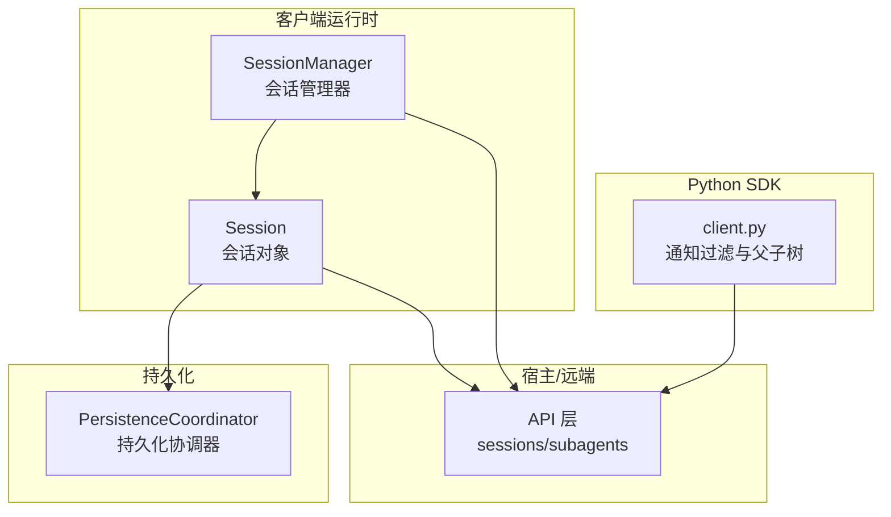
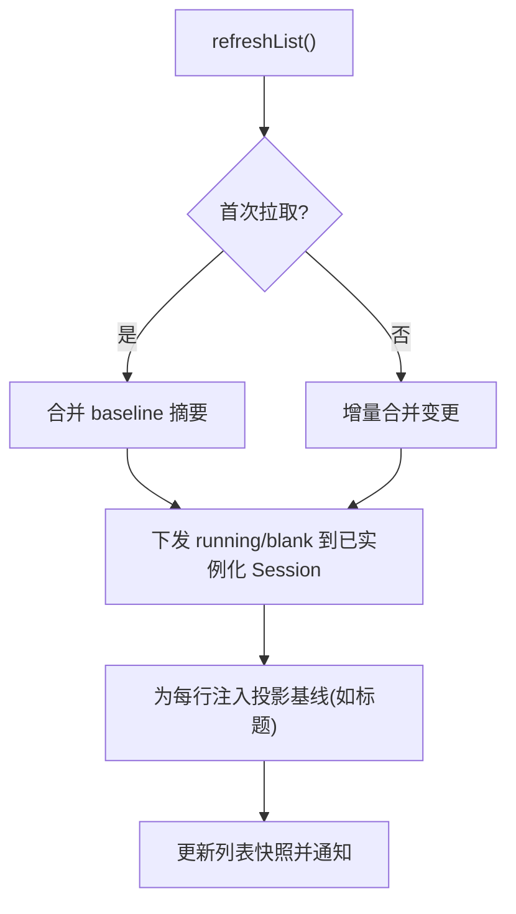
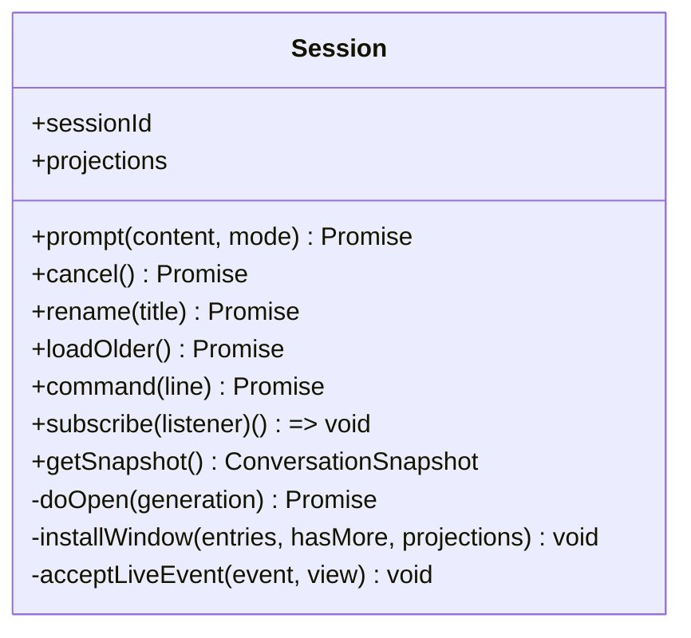
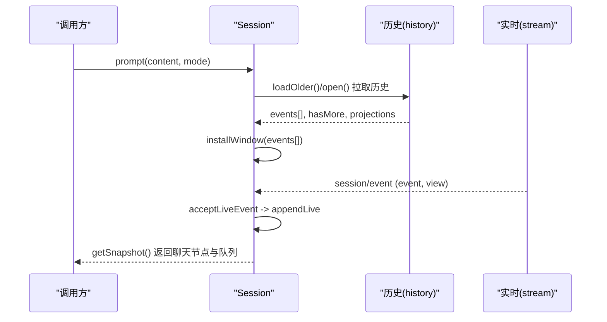
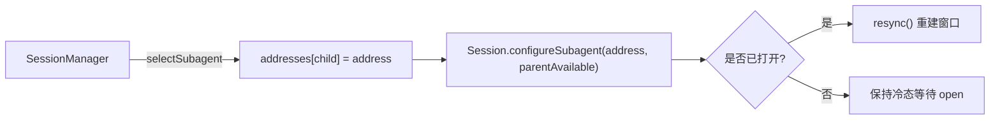
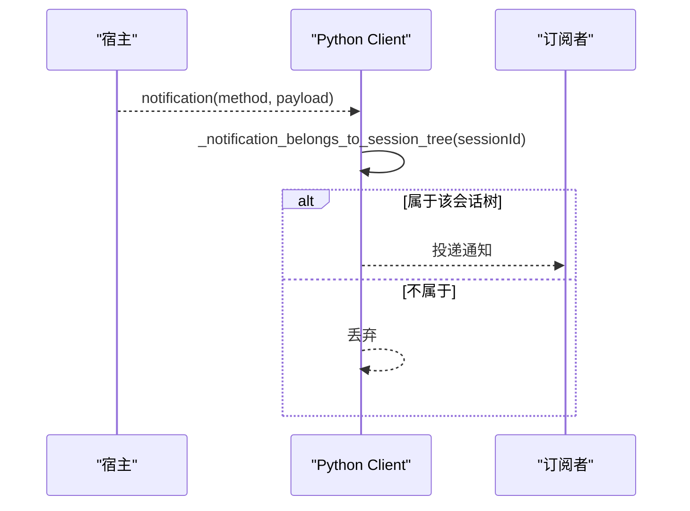
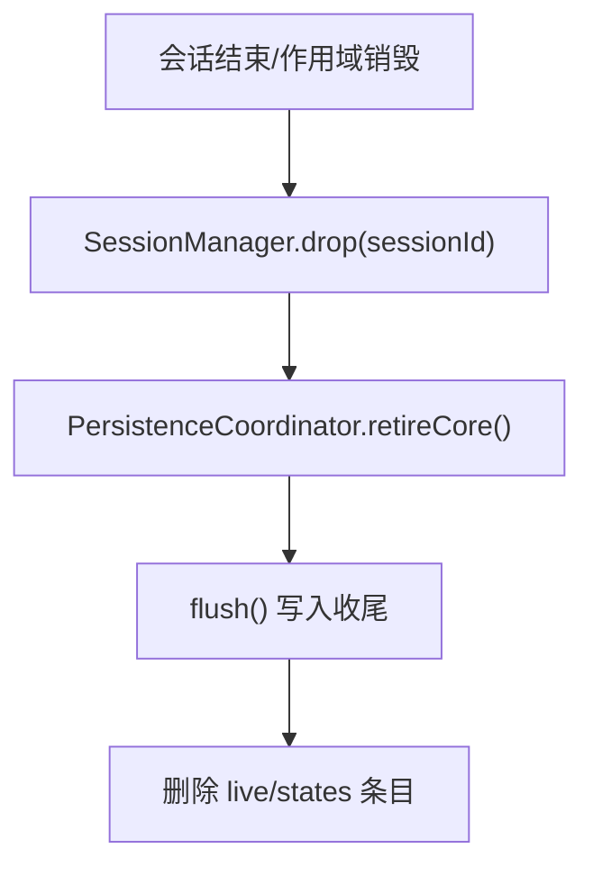
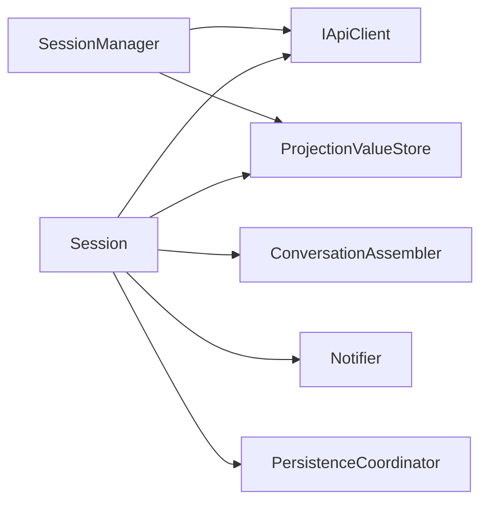

# 会话操作

<cite>
**本文引用的文件**
- [packages/client/runtime/src/client/sessions/session.ts](file://packages/client/runtime/src/client/sessions/session.ts)
- [packages/client/runtime/src/client/contract/session.ts](file://packages/client/runtime/src/client/contract/session.ts)
- [packages/client/runtime/src/client/sessions/manager.ts](file://packages/client/runtime/src/client/sessions/manager.ts)
- [packages/core/session/tests/session.spec.ts](file://packages/core/session/tests/session.spec.ts)
- [python/sdk/src/deepseek_harness/client.py](file://python/sdk/src/deepseek_harness/client.py)
- [python/sdk/tests/test_client.py](file://python/sdk/tests/test_client.py)
- [packages/sdk/client/src/client.ts](file://packages/sdk/client/src/client.ts)
- [packages/session/session-persistence/src/coordinator.ts](file://packages/session/session-persistence/src/coordinator.ts)
</cite>

## 目录
1. [简介](#简介)
2. [项目结构](#项目结构)
3. [核心组件](#核心组件)
4. [架构总览](#架构总览)
5. [详细组件分析](#详细组件分析)
6. [依赖关系分析](#依赖关系分析)
7. [性能考量](#性能考量)
8. [故障排查指南](#故障排查指南)
9. [结论](#结论)
10. [附录：完整示例与最佳实践](#附录完整示例与最佳实践)

## 简介
本文件聚焦“会话操作”，系统化说明会话的创建、管理、消息收发、状态跟踪、通知订阅以及资源清理等能力。重点覆盖：
- session_prompt（即 prompt）方法的使用与参数配置
- 会话ID与父子会话关系（子代理/子会话）
- 消息发送与接收流程（内容块格式、响应处理）
- 会话通知订阅机制（过滤器与事件处理）
- 会话生命周期管理与错误处理
- 资源清理与最佳实践

## 项目结构
围绕会话的核心代码分布在客户端运行时、会话管理器、持久化协调器以及 Python SDK 中：
- 客户端会话对象：负责单会话的事件窗口、对话组装、快照与订阅
- 会话管理器：维护会话实例集合、列表状态、帧路由与投影值存储
- 持久化协调器：负责会话落盘、回收与并发写入控制
- Python SDK：提供订阅过滤与父子会话树的通知分发



图表来源
- [packages/client/runtime/src/client/sessions/session.ts:65-162](file://packages/client/runtime/src/client/sessions/session.ts#L65-L162)
- [packages/client/runtime/src/client/sessions/manager.ts:105-177](file://packages/client/runtime/src/client/sessions/manager.ts#L105-L177)
- [packages/session/session-persistence/src/coordinator.ts:1153-1182](file://packages/session/session-persistence/src/coordinator.ts#L1153-L1182)
- [python/sdk/src/deepseek_harness/client.py:474-504](file://python/sdk/src/deepseek_harness/client.py#L474-L504)

章节来源
- [packages/client/runtime/src/client/sessions/session.ts:65-162](file://packages/client/runtime/src/client/sessions/session.ts#L65-L162)
- [packages/client/runtime/src/client/sessions/manager.ts:105-177](file://packages/client/runtime/src/client/sessions/manager.ts#L105-L177)

## 核心组件
- Session（会话对象）
  - 职责：维护事件窗口、对话视图、队列镜像、投影值、待处理交互；暴露 prompt/cancel/rename/loadOlder/command 等操作；提供 subscribe/getSnapshot 用于 UI 绑定
  - 关键状态：openState/openError、blankBit、running、promptAttempted、firstPromptPendingTurn、pending、queueMirror、projections
- SessionManager（会话管理器）
  - 职责：会话实例池（懒加载、常驻）、列表刷新、帧路由（MuxFrame/HostFrame）、子代理目录、投影值聚合、完成提醒
- PersistenceCoordinator（持久化协调器）
  - 职责：会话创建、追加、回收、序列化写入、并发控制
- Python SDK 通知过滤
  - 职责：根据父子会话树过滤通知，确保订阅者仅收到相关事件

章节来源
- [packages/client/runtime/src/client/sessions/session.ts:65-162](file://packages/client/runtime/src/client/sessions/session.ts#L65-L162)
- [packages/client/runtime/src/client/sessions/manager.ts:105-177](file://packages/client/runtime/src/client/sessions/manager.ts#L105-L177)
- [packages/session/session-persistence/src/coordinator.ts:1153-1182](file://packages/session/session-persistence/src/coordinator.ts#L1153-L1182)
- [python/sdk/src/deepseek_harness/client.py:474-504](file://python/sdk/src/deepseek_harness/client.py#L474-L504)

## 架构总览
下图展示从调用 prompt 到消息落地、再到 UI 更新的端到端流程，包括历史拉取、流式事件拼接、队列与待处理交互的处理。

```mermaid
sequenceDiagram
participant UI as "UI/业务层"
participant SM as "SessionManager"
participant SS as "Session"
participant API as "API(sessions/subagents)"
participant CONV as "ConversationAssembler"
participant STORE as "ProjectionValueStore"
UI->>SS : prompt(content, mode)
SS->>API : sessions.prompt / subagents.prompt
API-->>SS : {ok : true/false}
alt 成功
SS->>STORE : apply('title', title, seq) (重命名时)
SS->>CONV : append(event/view)
SS->>SS : markDirty() -> 构建快照
SS-->>UI : getSnapshot() 返回最新会话快照
else 失败
SS->>SS : promptError = error; markDirty()
SS-->>UI : 快照包含 promptError
end
Note over SS,API : 历史拉取(loadOlder/open)通过 history 接口补全窗口
```

图表来源
- [packages/client/runtime/src/client/sessions/session.ts:184-260](file://packages/client/runtime/src/client/sessions/session.ts#L184-L260)
- [packages/client/runtime/src/client/sessions/session.ts:364-410](file://packages/client/runtime/src/client/sessions/session.ts#L364-L410)
- [packages/client/runtime/src/client/sessions/session.ts:614-665](file://packages/client/runtime/src/client/sessions/session.ts#L614-L665)
- [packages/client/runtime/src/client/sessions/session.ts:731-768](file://packages/client/runtime/src/client/sessions/session.ts#L731-L768)

## 详细组件分析

### 会话创建与管理（SessionManager）
- 会话实例池与会话选择
  - 懒创建、常驻实例；select/selectSubagent 设置子代理地址并同步运行/空白位
  - 列表刷新 refreshList 合并摘要、推送 running/blank 位、注入投影基线
- 帧路由与待处理缓冲
  - handleMuxEnvelope/handleHostEnvelope 将事件分派到具体 Session；未实例化的会话会缓存可回答请求（审批/问题/队列）
- 子代理目录与活动行
  - refreshSubagents 获取子代理目录，维护 parentAvailable 与活动行状态



图表来源
- [packages/client/runtime/src/client/sessions/manager.ts:438-509](file://packages/client/runtime/src/client/sessions/manager.ts#L438-L509)
- [packages/client/runtime/src/client/sessions/manager.ts:181-220](file://packages/client/runtime/src/client/sessions/manager.ts#L181-L220)
- [packages/client/runtime/src/client/sessions/manager.ts:675-789](file://packages/client/runtime/src/client/sessions/manager.ts#L675-L789)

章节来源
- [packages/client/runtime/src/client/sessions/manager.ts:181-220](file://packages/client/runtime/src/client/sessions/manager.ts#L181-L220)
- [packages/client/runtime/src/client/sessions/manager.ts:438-509](file://packages/client/runtime/src/client/sessions/manager.ts#L438-L509)
- [packages/client/runtime/src/client/sessions/manager.ts:675-789](file://packages/client/runtime/src/client/sessions/manager.ts#L675-L789)

### 会话对象（Session）与 prompt 使用
- prompt(content, mode)
  - content：文本与浏览器临时图片上传的内容块数组
  - mode：'queue' 追加到当前轮次之后；'steer' 中断当前运行轮次
  - 行为：记录 promptAttempted/firstPromptPendingTurn；调用 sessions.prompt 或 subagents.prompt；失败写入 promptError；成功后若为首条接受的消息则翻转 blank 位并触发 onEngaged
- 历史与窗口
  - open()/loadOlder() 拉取历史页；installWindow 安装窗口并缝合 liveBuffer；repairGap 自动修复序列间隙
- 其他操作
  - cancel() 取消运行；rename() 重命名并应用标题投影；command() 执行斜杠命令；readAttachment() 读取附件



图表来源
- [packages/client/runtime/src/client/sessions/session.ts:65-162](file://packages/client/runtime/src/client/sessions/session.ts#L65-L162)
- [packages/client/runtime/src/client/sessions/session.ts:184-260](file://packages/client/runtime/src/client/sessions/session.ts#L184-L260)
- [packages/client/runtime/src/client/sessions/session.ts:364-410](file://packages/client/runtime/src/client/sessions/session.ts#L364-L410)
- [packages/client/runtime/src/client/sessions/session.ts:614-665](file://packages/client/runtime/src/client/sessions/session.ts#L614-L665)

章节来源
- [packages/client/runtime/src/client/sessions/session.ts:184-260](file://packages/client/runtime/src/client/sessions/session.ts#L184-L260)
- [packages/client/runtime/src/client/sessions/session.ts:364-410](file://packages/client/runtime/src/client/sessions/session.ts#L364-L410)
- [packages/client/runtime/src/client/sessions/session.ts:614-665](file://packages/client/runtime/src/client/sessions/session.ts#L614-L665)

### 消息发送与接收流程（内容块与响应）
- 发送
  - 通过 Session.prompt 提交 PromptContentPart[]；支持文本与图片（子代理续传不支持图片）
  - 失败路径统一折叠为 RpcResult 错误并写入 promptError
- 接收
  - 历史拉取：history 返回 HistoryEntry[]（含 event 与 view），由 installWindow 装配
  - 实时事件：session/event 进入 acceptLiveEvent，按 seq 去重与间隙修复
  - 队列与待处理：session/queue 更新队列镜像；approval/question 请求创建 PendingWait，解决后结算
- 内容块
  - 用户消息与助手消息遵循 LLM 消息模型；工具结果以 tool-result 块呈现；测试用例验证了消息推导与块结构



图表来源
- [packages/client/runtime/src/client/sessions/session.ts:364-410](file://packages/client/runtime/src/client/sessions/session.ts#L364-L410)
- [packages/client/runtime/src/client/sessions/session.ts:614-665](file://packages/client/runtime/src/client/sessions/session.ts#L614-L665)
- [packages/client/runtime/src/client/sessions/session.ts:667-697](file://packages/client/runtime/src/client/sessions/session.ts#L667-L697)
- [packages/core/session/tests/session.spec.ts:23-59](file://packages/core/session/tests/session.spec.ts#L23-L59)

章节来源
- [packages/core/session/tests/session.spec.ts:23-59](file://packages/core/session/tests/session.spec.ts#L23-L59)
- [packages/client/runtime/src/client/sessions/session.ts:667-697](file://packages/client/runtime/src/client/sessions/session.ts#L667-L697)

### 会话状态跟踪（ID 与父子关系）
- 会话ID：每个 Session 拥有 sessionId，作为宿主侧唯一标识
- 父子会话（子代理）：
  - SessionManager 维护 addresses/catalogs，selectSubagent 建立直接父地址
  - Session.configureSubagent 切换传输通道，必要时 resync
  - Python SDK 通过 _notification_belongs_to_session_tree 基于父子关系过滤通知，确保订阅者只收到相关事件



图表来源
- [packages/client/runtime/src/client/sessions/manager.ts:204-220](file://packages/client/runtime/src/client/sessions/manager.ts#L204-L220)
- [packages/client/runtime/src/client/sessions/session.ts:540-548](file://packages/client/runtime/src/client/sessions/session.ts#L540-L548)
- [python/sdk/src/deepseek_harness/client.py:474-504](file://python/sdk/src/deepseek_harness/client.py#L474-L504)

章节来源
- [packages/client/runtime/src/client/sessions/manager.ts:204-220](file://packages/client/runtime/src/client/sessions/manager.ts#L204-L220)
- [packages/client/runtime/src/client/sessions/session.ts:540-548](file://packages/client/runtime/src/client/sessions/session.ts#L540-L548)
- [python/sdk/src/deepseek_harness/client.py:474-504](file://python/sdk/src/deepseek_harness/client.py#L474-L504)

### 通知订阅机制（过滤器与事件处理）
- JavaScript 客户端
  - Session.subscribe 与 Notifier 实现 uSES 风格的订阅；manager 提供 useSessionList 的列表订阅
  - 框架层 push(notification) 在匹配过滤器后投递给等待者或入队；过滤器抛错仅影响该订阅
- Python SDK
  - 基于父子会话树的过滤：subagent.started/finished 与 sessionId 字段判断归属；_session_is_descendant_of 遍历父链判定
- 测试覆盖
  - Python SDK 测试验证跨订阅保持父子关系，且事件正确路由到对应订阅



图表来源
- [python/sdk/src/deepseek_harness/client.py:474-504](file://python/sdk/src/deepseek_harness/client.py#L474-L504)
- [python/sdk/tests/test_client.py:504-528](file://python/sdk/tests/test_client.py#L504-L528)
- [packages/sdk/client/src/client.ts:133-163](file://packages/sdk/client/src/client.ts#L133-L163)

章节来源
- [python/sdk/src/deepseek_harness/client.py:474-504](file://python/sdk/src/deepseek_harness/client.py#L474-L504)
- [python/sdk/tests/test_client.py:504-528](file://python/sdk/tests/test_client.py#L504-L528)
- [packages/sdk/client/src/client.ts:133-163](file://packages/sdk/client/src/client.ts#L133-L163)

### 资源清理与生命周期
- 会话实例
  - Session.dispose 为空操作（实例常驻），但可通过 SessionManager.drop 移除实例引用
  - 列表项 removed 信号标记会话被移除，但实例仍存活以便后续恢复
- 持久化回收
  - PersistenceCoordinator.retireCore 完成 flush、删除 live 集、清理 states 映射
- 存储作用域清理
  - 测试覆盖 pruneStoreScope 对死会话的持久化清理，即使从未渲染也会触发 clearPersisted



图表来源
- [packages/client/runtime/src/client/sessions/session.ts:574-590](file://packages/client/runtime/src/client/sessions/session.ts#L574-L590)
- [packages/client/runtime/src/client/sessions/manager.ts:256-264](file://packages/client/runtime/src/client/sessions/manager.ts#L256-L264)
- [packages/session/session-persistence/src/coordinator.ts:1153-1182](file://packages/session/session-persistence/src/coordinator.ts#L1153-L1182)

章节来源
- [packages/client/runtime/src/client/sessions/session.ts:574-590](file://packages/client/runtime/src/client/sessions/session.ts#L574-L590)
- [packages/client/runtime/src/client/sessions/manager.ts:256-264](file://packages/client/runtime/src/client/sessions/manager.ts#L256-L264)
- [packages/session/session-persistence/src/coordinator.ts:1153-1182](file://packages/session/session-persistence/src/coordinator.ts#L1153-L1182)

## 依赖关系分析
- Session 依赖
  - IApiClient 与 SessionRemotes：用于 sessions/subagents 的 RPC 调用
  - ConversationNodeAssembler：将事件转换为对话节点
  - ProjectionValueStore：承载 host 计算的投影值（如标题）
  - Notifier：驱动快照刷新与订阅通知
- SessionManager 依赖
  - IApiClient：会话列表、搜索、子代理目录
  - ProjectionValueStore：聚合列表级投影（标题等）
  - 子代理目录缓存与活动行追踪
- 持久化协调器
  - 与 Session 生命周期绑定，负责序列化写入与回收



图表来源
- [packages/client/runtime/src/client/sessions/session.ts:65-162](file://packages/client/runtime/src/client/sessions/session.ts#L65-L162)
- [packages/client/runtime/src/client/sessions/manager.ts:105-177](file://packages/client/runtime/src/client/sessions/manager.ts#L105-L177)
- [packages/session/session-persistence/src/coordinator.ts:1153-1182](file://packages/session/session-persistence/src/coordinator.ts#L1153-L1182)

章节来源
- [packages/client/runtime/src/client/sessions/session.ts:65-162](file://packages/client/runtime/src/client/sessions/session.ts#L65-L162)
- [packages/client/runtime/src/client/sessions/manager.ts:105-177](file://packages/client/runtime/src/client/sessions/manager.ts#L105-L177)

## 性能考量
- 历史分页与窗口管理
  - 每次拉取固定页数，避免一次性加载全部历史；loadOlder 按需前置插入
- 实时事件缝合
  - 使用 liveBuffer 与 stitching 标志，在 open/loading 期间缓冲事件，序列到达后统一安装，减少抖动
- 投影值与列表快照
  - 投影值采用更高 seq 覆盖规则，列表快照惰性构建，降低频繁重绘开销
- 子代理目录刷新
  - 防抖与复用 in-flight 请求，避免重复网络开销

[本节为通用指导，不直接分析具体文件]

## 故障排查指南
- prompt 失败
  - 检查 promptError 与 lastAgentError；确认 mode 与内容块是否符合约束（子代理续传不支持图片）
- 历史不连续
  - 观察 loadOlder 日志中的连续性断言；触发 repairGap 重新拉取尾部页
- 连接断开与重连
  - 使用 resync 重建窗口；注意 subscribedLastSeq 与 queue 镜像的重基线
- 通知未到达
  - 检查 Python SDK 的父子树过滤逻辑；确认 sessionId/parentSessionId 是否正确
- 资源泄漏
  - 确保 drop 与 retire 流程执行；检查 store 作用域清理是否触发

章节来源
- [packages/client/runtime/src/client/sessions/session.ts:376-410](file://packages/client/runtime/src/client/sessions/session.ts#L376-L410)
- [packages/client/runtime/src/client/sessions/session.ts:614-665](file://packages/client/runtime/src/client/sessions/session.ts#L614-L665)
- [python/sdk/src/deepseek_harness/client.py:474-504](file://python/sdk/src/deepseek_harness/client.py#L474-L504)

## 结论
本系统通过 Session 与 SessionManager 的协作，实现了高内聚的会话生命周期管理：稳定的 ID、清晰的父子关系、可靠的历史与实时事件管道、健壮的投影与队列机制，以及完善的资源清理策略。配合 Python SDK 的通知过滤，可在多订阅场景下精准路由事件。建议在实际使用中严格遵循 prompt 参数约定、利用分页与缝合机制优化性能，并在异常路径及时消费 promptError 与 openError。

[本节为总结性内容，不直接分析具体文件]

## 附录：完整示例与最佳实践
以下示例以“步骤+要点”的形式给出，便于快速上手与排错。请结合对应源码位置查看实现细节。

- 创建会话并发送首条消息
  - 步骤
    - 通过 SessionManager.create 创建会话（可选 workspaceId/cwd/sessionId）
    - 调用 Session.prompt(content, 'queue') 发送首条消息
    - 监听 Session.subscribe 或使用 getSnapshot 获取最新会话快照
  - 参考
    - [packages/client/runtime/src/client/sessions/manager.ts:536-569](file://packages/client/runtime/src/client/sessions/manager.ts#L536-L569)
    - [packages/client/runtime/src/client/sessions/session.ts:184-260](file://packages/client/runtime/src/client/sessions/session.ts#L184-L260)

- 子会话（子代理）导航与提示
  - 步骤
    - 通过 SessionManager.selectSubagent 选择子代理地址
    - 调用 Session.configureSubagent 切换传输通道（必要时 resync）
    - 发送提示（注意子代理续传不支持图片）
  - 参考
    - [packages/client/runtime/src/client/sessions/manager.ts:204-220](file://packages/client/runtime/src/client/sessions/manager.ts#L204-L220)
    - [packages/client/runtime/src/client/sessions/session.ts:540-548](file://packages/client/runtime/src/client/sessions/session.ts#L540-L548)

- 历史分页与滚动加载
  - 步骤
    - 初次 open 拉取尾部页；loadOlder 向前加载更多
    - 关注 hasMore 与 loadingOlder 状态
  - 参考
    - [packages/client/runtime/src/client/sessions/session.ts:364-410](file://packages/client/runtime/src/client/sessions/session.ts#L364-L410)

- 取消运行与重试
  - 步骤
    - 调用 Session.cancel 中断当前轮次；失败时读取 promptError
    - 对于 steer 模式，新提示将中断并追加
  - 参考
    - [packages/client/runtime/src/client/sessions/session.ts:293-330](file://packages/client/runtime/src/client/sessions/session.ts#L293-L330)

- 重命名会话标题
  - 步骤
    - 调用 Session.rename 设置标题；成功后标题投影立即生效
  - 参考
    - [packages/client/runtime/src/client/sessions/session.ts:332-349](file://packages/client/runtime/src/client/sessions/session.ts#L332-L349)

- 执行斜杠命令
  - 步骤
    - 调用 Session.command 执行命令；结果为纯准入语义
  - 参考
    - [packages/client/runtime/src/client/sessions/session.ts:351-362](file://packages/client/runtime/src/client/sessions/session.ts#L351-L362)

- 通知订阅与过滤
  - 步骤
    - JS：使用 Session.subscribe 或 manager.subscribe 订阅变化
    - Python：使用 subscribe_session_notifications 并按父子树过滤
  - 参考
    - [packages/sdk/client/src/client.ts:133-163](file://packages/sdk/client/src/client.ts#L133-L163)
    - [python/sdk/src/deepseek_harness/client.py:474-504](file://python/sdk/src/deepseek_harness/client.py#L474-L504)
    - [python/sdk/tests/test_client.py:504-528](file://python/sdk/tests/test_client.py#L504-L528)

- 资源清理
  - 步骤
    - 会话不再需要时调用 SessionManager.drop；持久化协调器会在回收时 flush 并清理状态
  - 参考
    - [packages/client/runtime/src/client/sessions/manager.ts:256-264](file://packages/client/runtime/src/client/sessions/manager.ts#L256-L264)
    - [packages/session/session-persistence/src/coordinator.ts:1153-1182](file://packages/session/session-persistence/src/coordinator.ts#L1153-L1182)

- 最佳实践
  - 始终消费 promptError/openError，避免静默失败
  - 合理使用分页与缝合机制，避免频繁重绘
  - 子代理续传避免发送图片
  - 使用投影值（如标题）提升列表体验
  - 在作用域销毁时确保清理持久化状态

[本节为实践指导，不直接分析具体文件]