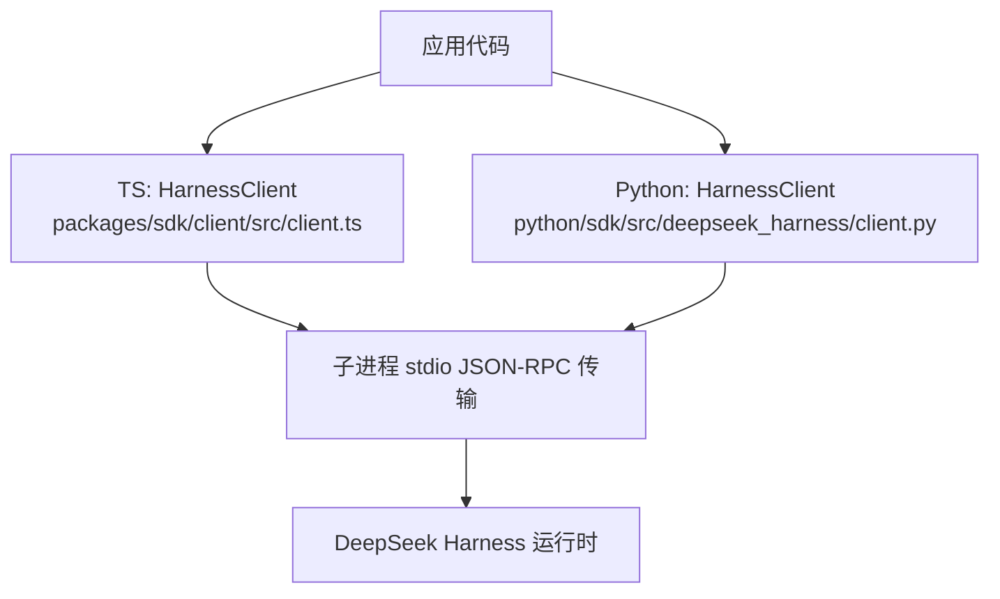
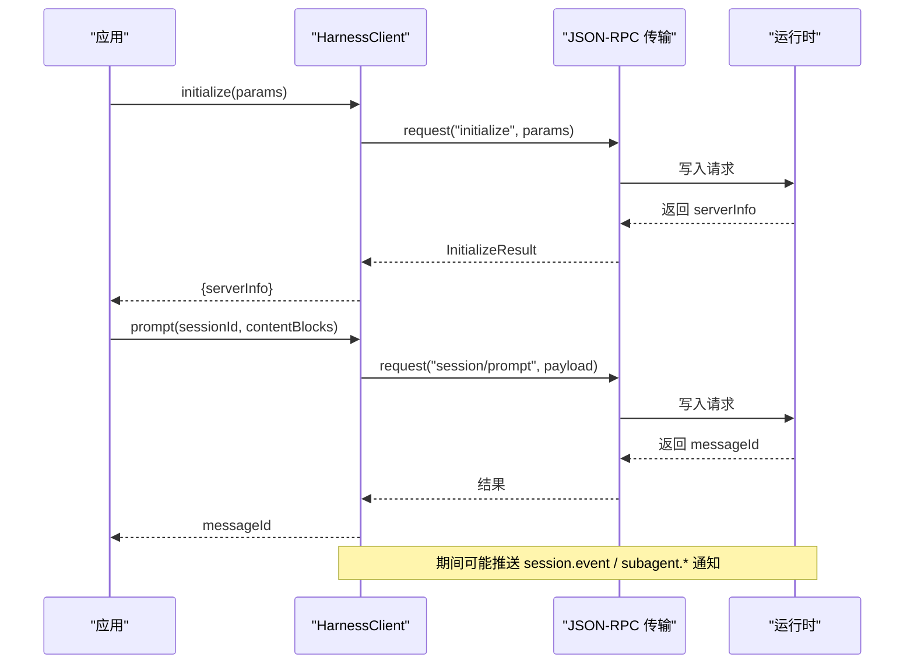
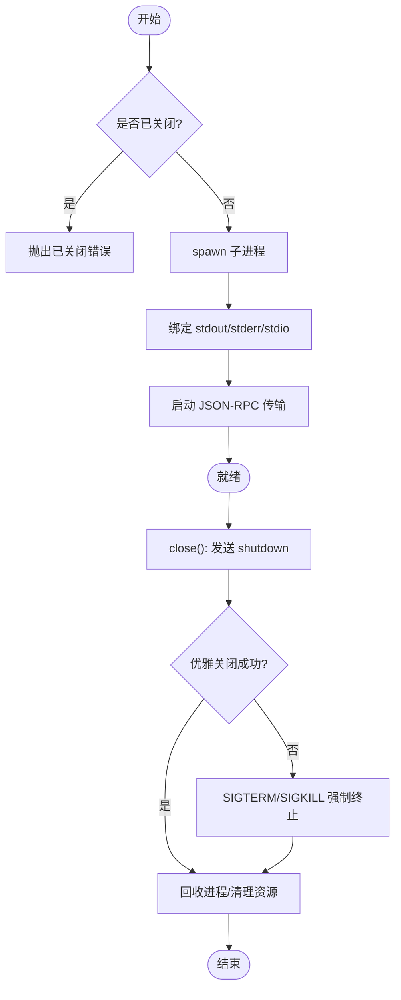
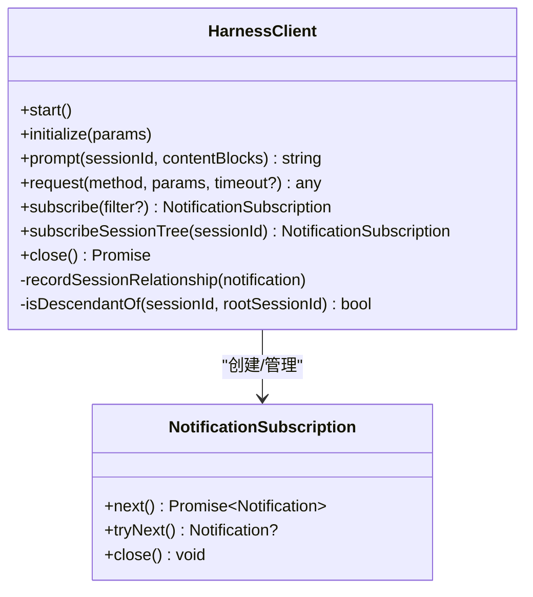
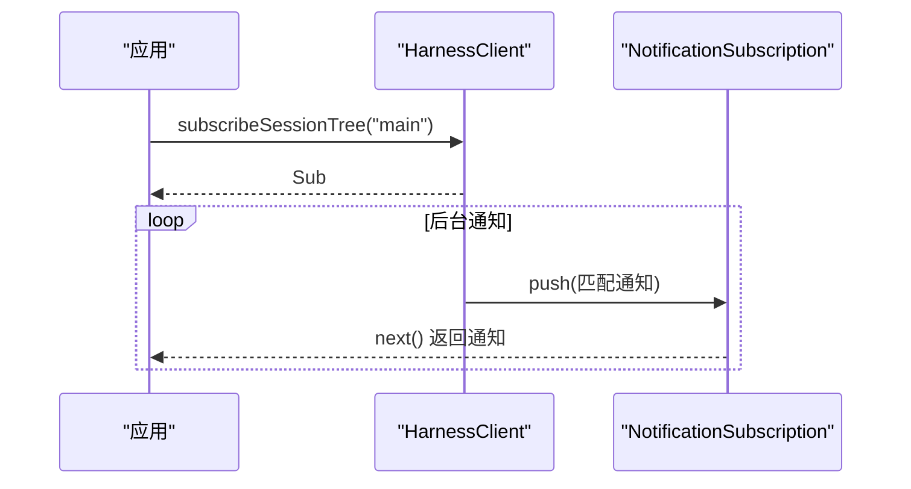
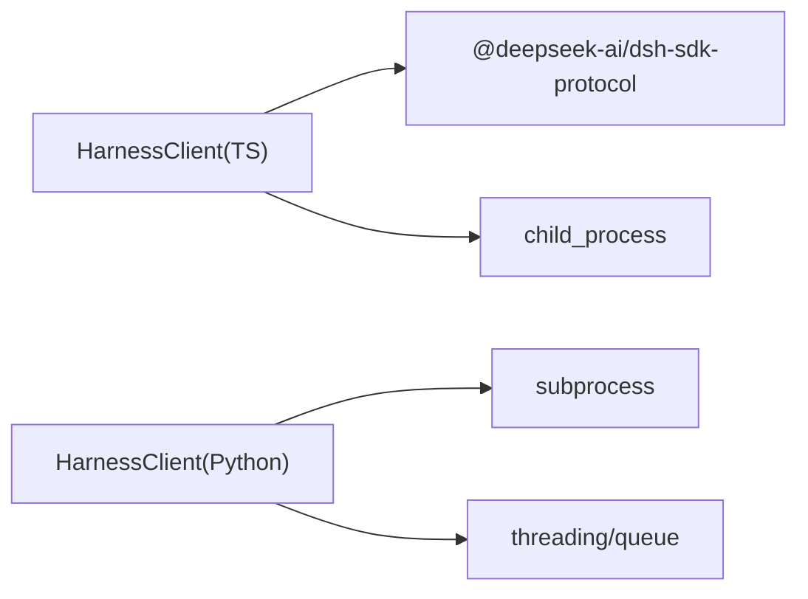

# 客户端使用

<cite>
**本文引用的文件**
- [packages/sdk/client/src/client.ts](file://packages/sdk/client/src/client.ts)
- [packages/sdk/client/src/types.ts](file://packages/sdk/client/src/types.ts)
- [python/sdk/src/deepseek_harness/client.py](file://python/sdk/src/deepseek_harness/client.py)
- [python/sdk/tests/test_client.py](file://python/sdk/tests/test_client.py)
- [packages/session/session-stats/src/client.ts](file://packages/session/session-stats/src/client.ts)
- [packages/host/apiproxy/tests/api-proxy-search.spec.ts](file://packages/host/apiproxy/tests/api-proxy-search.spec.ts)
</cite>

## 目录
1. [简介](#简介)
2. [项目结构](#项目结构)
3. [核心组件](#核心组件)
4. [架构总览](#架构总览)
5. [详细组件分析](#详细组件分析)
6. [依赖关系分析](#依赖关系分析)
7. [性能考量](#性能考量)
8. [故障排查指南](#故障排查指南)
9. [结论](#结论)
10. [附录：常见用法与示例路径](#附录：常见用法与示例路径)

## 简介
本文件面向“客户端”使用者，聚焦 HarnessClient 类的使用方式，覆盖连接建立、配置选项、生命周期管理、会话创建与管理、消息发送与接收（同步/异步）、错误重试与连接池建议、性能优化与最佳实践。仓库同时提供 TypeScript 与 Python 两套实现，二者驱动同一运行时协议；本文以 TypeScript 为主、Python 为辅进行对照说明，并给出可追溯的代码片段路径。

## 项目结构
- TypeScript 客户端位于 packages/sdk/client，核心为 HarnessClient 及其类型定义。
- Python 客户端位于 python/sdk，提供同步 API 与通知订阅能力。
- 测试用例展示了典型交互流程（初始化、提示、事件流、关闭）。

图表来源
- [packages/sdk/client/src/client.ts:175-458](file://packages/sdk/client/src/client.ts#L175-L458)
- [python/sdk/src/deepseek_harness/client.py:37-505](file://python/sdk/src/deepseek_harness/client.py#L37-L505)

章节来源
- [packages/sdk/client/src/client.ts:175-458](file://packages/sdk/client/src/client.ts#L175-L458)
- [python/sdk/src/deepseek_harness/client.py:37-505](file://python/sdk/src/deepseek_harness/client.py#L37-L505)

## 核心组件
- HarnessClient（TypeScript）
  - 负责启动/关闭运行时子进程、JSON-RPC 请求/响应、通知分发、会话树过滤、超时控制、异常诊断信息收集。
- HarnessClient（Python）
  - 同步风格 API，线程化读取 stdout/stderr，支持通知订阅、会话树过滤、请求超时、优雅关闭。
- 类型与配置
  - HarnessClientOptions/HarnessConfig：命令、参数、工作目录、环境变量、请求/关闭超时、清理宽限期等。

章节来源
- [packages/sdk/client/src/types.ts:22-59](file://packages/sdk/client/src/types.ts#L22-L59)
- [python/sdk/src/deepseek_harness/client.py:24-55](file://python/sdk/src/deepseek_harness/client.py#L24-L55)

## 架构总览
下图展示一次典型“提示-事件-完成”的端到端调用序列，涵盖 TS/Python 客户端与运行时的交互。

图表来源
- [packages/sdk/client/src/client.ts:268-333](file://packages/sdk/client/src/client.ts#L268-L333)
- [python/sdk/src/deepseek_harness/client.py:117-155](file://python/sdk/src/deepseek_harness/client.py#L117-L155)

## 详细组件分析

### 连接建立与生命周期管理
- 启动时机
  - TS：首次调用 request()/prompt()/initialize() 时惰性启动子进程；多次 start 幂等。
  - Python：显式 start() 或上下文管理器进入时启动；内部维护读写线程。
- 握手
  - initialize 校验服务端身份（name/version），不合法抛出协议错误。
- 关闭
  - 先尝试协议 shutdown，再执行 EOF → SIGTERM → SIGKILL 阶梯式终止，等待进程退出并清理资源。
  - 所有订阅在关闭时被失败化，避免悬挂等待。

图表来源
- [packages/sdk/client/src/client.ts:203-261](file://packages/sdk/client/src/client.ts#L203-L261)
- [packages/sdk/client/src/client.ts:380-401](file://packages/sdk/client/src/client.ts#L380-L401)
- [python/sdk/src/deepseek_harness/client.py:87-116](file://python/sdk/src/deepseek_harness/client.py#L87-L116)

章节来源
- [packages/sdk/client/src/client.ts:203-401](file://packages/sdk/client/src/client.ts#L203-L401)
- [python/sdk/src/deepseek_harness/client.py:63-116](file://python/sdk/src/deepseek_harness/client.py#L63-L116)

### 配置选项
- TS 配置 HarnessClientOptions
  - command/args/cwd/env：子进程启动参数与环境。
  - requestTimeoutMs：单次请求超时（默认无限制）。
  - shutdownTimeoutMs/disposeEofGraceMs/disposeGraceMs：关闭与清理时间预算。
- Python 配置 HarnessConfig
  - runtime_bin/bridge_bin/launch_args_override/cwd/env/request_timeout_seconds/shutdown_timeout_seconds。

章节来源
- [packages/sdk/client/src/types.ts:22-59](file://packages/sdk/client/src/types.ts#L22-L59)
- [python/sdk/src/deepseek_harness/client.py:24-55](file://python/sdk/src/deepseek_harness/client.py#L24-L55)

### 会话创建与管理
- 会话创建
  - 通过 prompt(sessionId, contentBlocks) 将消息入队，若 sessionId 不存在则运行时侧创建。
- 会话树跟踪
  - 客户端记录 subagent.started/finished 的父子关系，subscribeSessionTree 仅投递目标会话及其后代的通知。
- 状态与清理
  - 关闭时统一失败化所有订阅；stderr 尾部用于诊断。

图表来源
- [packages/sdk/client/src/client.ts:184-458](file://packages/sdk/client/src/client.ts#L184-L458)

章节来源
- [packages/sdk/client/src/client.ts:277-430](file://packages/sdk/client/src/client.ts#L277-L430)

### 消息发送与接收机制
- 同步调用
  - request/prompt/initialize 均阻塞等待响应或超时；支持 per-call 超时覆盖。
- 异步通知
  - subscribe/subscribeSessionTree 返回可迭代的订阅；next() 等待下一条匹配通知；tryNext() 非阻塞拉取。
- 会话级订阅
  - 基于 subagent 父子边构建的会话树过滤，确保只收到相关会话的通知。

图表来源
- [packages/sdk/client/src/client.ts:335-372](file://packages/sdk/client/src/client.ts#L335-L372)
- [python/sdk/src/deepseek_harness/client.py:192-204](file://python/sdk/src/deepseek_harness/client.py#L192-L204)

章节来源
- [packages/sdk/client/src/client.ts:335-430](file://packages/sdk/client/src/client.ts#L335-L430)
- [python/sdk/src/deepseek_harness/client.py:192-204](file://python/sdk/src/deepseek_harness/client.py#L192-L204)

### 错误处理与重试
- 错误类型
  - TransportClosedError：进程不可用/已关闭。
  - RequestTimeoutError：请求超时。
  - SdkProtocolError：服务端响应不符合协议。
- 诊断信息
  - 关闭错误包含 spawn 错误、退出码与 stderr 尾部，便于定位问题。
- 重试策略
  - 客户端未内置自动重试；建议在调用层根据错误类型实施指数退避重试（例如对网络/临时错误的重试，对协议错误直接失败）。

章节来源
- [packages/sdk/client/src/client.ts:38-65](file://packages/sdk/client/src/client.ts#L38-L65)
- [packages/sdk/client/src/client.ts:301-333](file://packages/sdk/client/src/client.ts#L301-L333)
- [packages/sdk/client/src/client.ts:451-457](file://packages/sdk/client/src/client.ts#L451-L457)

### 连接池管理与多实例
- 单实例模型
  - 每个 HarnessClient 拥有独立子进程；适合短生命周期任务或隔离场景。
- 连接池建议
  - 在高并发场景下，可在应用层维护一个“客户端池”，按会话/租户复用进程，减少启动开销；注意：
    - 合理设置 requestTimeoutMs 与 shutdownTimeoutMs。
    - 定期健康检查与失效回收。
    - 避免跨会话共享状态，必要时通过会话树过滤隔离。
- 搜索与取消
  - 上层服务（如 sessions.search）支持 AbortSignal 取消，避免长耗时查询占用资源。

章节来源
- [packages/host/apiproxy/tests/api-proxy-search.spec.ts:303-385](file://packages/host/apiproxy/tests/api-proxy-search.spec.ts#L303-L385)

## 依赖关系分析
- 外部依赖
  - Node.js child_process、JSON-RPC 传输抽象。
  - Python subprocess、threading、queue。
- 内部依赖
  - 会话统计/标题等模块通过各自的 client.ts 暴露能力，但不在 HarnessClient 内直接耦合。

图表来源
- [packages/sdk/client/src/client.ts:15-25](file://packages/sdk/client/src/client.ts#L15-L25)
- [python/sdk/src/deepseek_harness/client.py:1-19](file://python/sdk/src/deepseek_harness/client.py#L1-L19)

章节来源
- [packages/sdk/client/src/client.ts:15-25](file://packages/sdk/client/src/client.ts#L15-L25)
- [python/sdk/src/deepseek_harness/client.py:1-19](file://python/sdk/src/deepseek_harness/client.py#L1-L19)

## 性能考量
- 启动成本
  - 子进程启动有固定开销；建议复用进程（连接池）以减少冷启动。
- 请求超时
  - 合理设置 requestTimeoutMs，避免长时间挂起；对长任务可使用异步订阅+轮询状态。
- 通知风暴
  - 使用 subscribeSessionTree 精确过滤，降低无关通知处理成本。
- I/O 缓冲
  - Python 实现使用行缓冲读取；TS 实现基于传输层逐帧处理，避免大消息阻塞。
- 关闭预算
  - 调整 shutdownTimeoutMs/disposeGraceMs 平衡优雅关闭与快速回收。

[本节为通用指导，无需具体文件引用]

## 故障排查指南
- 常见问题
  - 进程无法启动：检查 command/args/cwd/env；查看 spawn 错误。
  - 请求超时：确认服务端是否繁忙；适当增大 requestTimeoutMs。
  - 协议错误：检查 initialize/prompt 返回值是否符合契约。
  - 通知丢失：确认订阅是否正确过滤；检查会话树关系。
- 诊断信息
  - 捕获 TransportClosedError 中的 stderr 尾部与退出码，快速定位根因。
- 复现与验证
  - 参考测试用例构造最小可复现场景（模拟慢启动、拒绝响应、非法返回等）。

章节来源
- [packages/sdk/client/src/client.ts:451-457](file://packages/sdk/client/src/client.ts#L451-L457)
- [python/sdk/tests/test_client.py:720-783](file://python/sdk/tests/test_client.py#L720-L783)

## 结论
HarnessClient 提供了稳定可靠的本地运行时客户端能力，具备完善的生命周期管理、通知订阅与会话树过滤、明确的错误分类与诊断信息。结合连接池与合理的超时/关闭预算，可在高吞吐场景中取得良好性能与稳定性。建议在生产中采用应用层重试与监控，配合测试用例持续验证行为一致性。

## 附录：常见用法与示例路径
- 初始化与提示
  - TS：initialize、prompt
    - [packages/sdk/client/src/client.ts:268-290](file://packages/sdk/client/src/client.ts#L268-L290)
  - Python：initialize、session_prompt
    - [python/sdk/src/deepseek_harness/client.py:117-155](file://python/sdk/src/deepseek_harness/client.py#L117-L155)
- 订阅通知与会话树
  - TS：subscribe、subscribeSessionTree
    - [packages/sdk/client/src/client.ts:335-372](file://packages/sdk/client/src/client.ts#L335-L372)
  - Python：subscribe_notifications、subscribe_session_notifications
    - [python/sdk/src/deepseek_harness/client.py:192-204](file://python/sdk/src/deepseek_harness/client.py#L192-L204)
- 关闭与清理
  - TS：close
    - [packages/sdk/client/src/client.ts:380-401](file://packages/sdk/client/src/client.ts#L380-L401)
  - Python：close
    - [python/sdk/src/deepseek_harness/client.py:87-116](file://python/sdk/src/deepseek_harness/client.py#L87-L116)
- 端到端示例（测试）
  - Python 测试覆盖完整流程
    - [python/sdk/tests/test_client.py:15-124](file://python/sdk/tests/test_client.py#L15-L124)
    - [python/sdk/tests/test_client.py:453-485](file://python/sdk/tests/test_client.py#L453-L485)
    - [python/sdk/tests/test_client.py:632-656](file://python/sdk/tests/test_client.py#L632-L656)
    - [python/sdk/tests/test_client.py:720-783](file://python/sdk/tests/test_client.py#L720-L783)