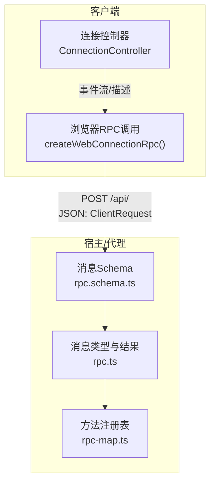
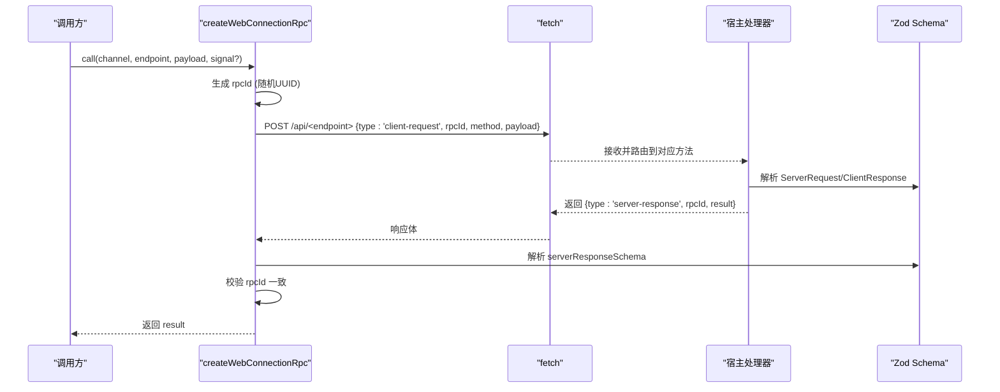
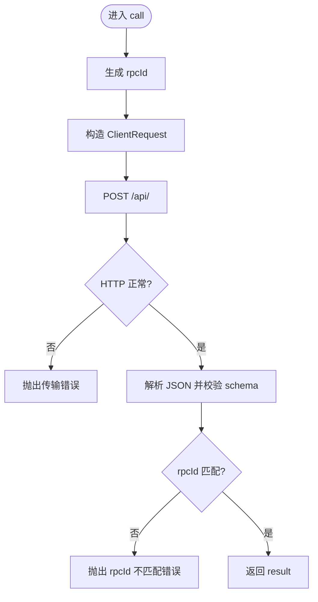
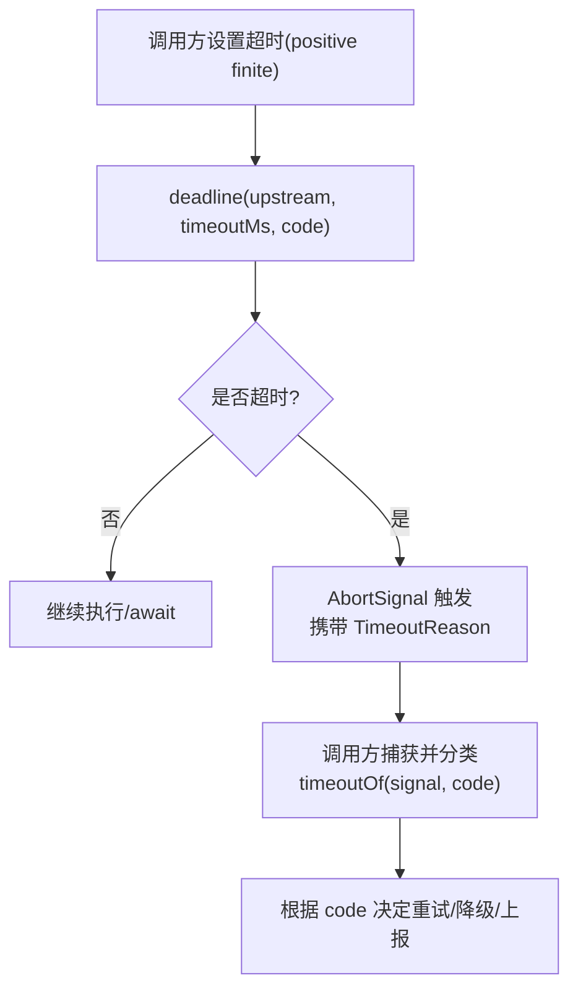
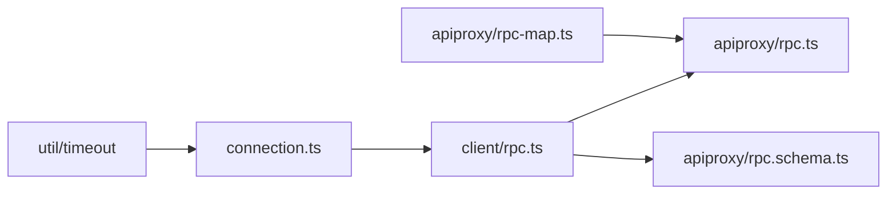

# 请求响应模式

<cite>
**本文引用的文件**
- [packages/client/connection/src/client/rpc.ts](file://packages/client/connection/src/client/rpc.ts)
- [packages/host/apiproxy/src/api/rpc.ts](file://packages/host/apiproxy/src/api/rpc.ts)
- [packages/host/apiproxy/src/api/rpc.schema.ts](file://packages/host/apiproxy/src/api/rpc.schema.ts)
- [packages/host/apiproxy/src/api/rpc-map.ts](file://packages/host/apiproxy/src/api/rpc-map.ts)
- [packages/client/connection/src/rpc.ts](file://packages/client/connection/src/rpc.ts)
- [packages/client/connection/src/client/connection.ts](file://packages/client/connection/src/client/connection.ts)
- [packages/util/timeout/README.md](file://packages/util/timeout/README.md)
- [packages/guard/timeout-policy/tests/timeout-policy.spec.ts](file://packages/guard/timeout-policy/tests/timeout-policy.spec.ts)
- [packages/test-support/llm-mock-server/README.md](file://packages/test-support/llm-mock-server/README.md)
</cite>

## 目录
1. [简介](#简介)
2. [项目结构](#项目结构)
3. [核心组件](#核心组件)
4. [架构总览](#架构总览)
5. [详细组件分析](#详细组件分析)
6. [依赖关系分析](#依赖关系分析)
7. [性能考虑](#性能考虑)
8. [故障排查指南](#故障排查指南)
9. [结论](#结论)
10. [附录：代码示例路径](#附录代码示例路径)

## 简介
本文件系统化阐述仓库中的“请求-响应”通信模式，覆盖 JSON-RPC 风格的消息模型、序列化与反序列化、同步与异步调用模式、超时与错误恢复机制、请求ID生成与响应匹配、以及并发与性能优化建议。该模式以“四象限消息”为核心：客户端发起请求、服务端返回响应；同时支持服务端主动推送（可应答或纯推送），通过统一的 rpcId 进行关联。

## 项目结构
围绕请求-响应模式的实现主要分布在以下位置：
- 协议与类型定义：host/apiproxy 的 rpc.ts、rpc.schema.ts、rpc-map.ts
- 浏览器端 RPC 调用封装：client/connection 的 client/rpc.ts
- 通用 RPC 契约（宿主/客户端共享）：client/connection 的 rpc.ts
- 连接管理与重连：client/connection 的 connection.ts
- 超时工具与策略：util/timeout、guard/timeout-policy

图表来源
- [packages/client/connection/src/client/rpc.ts:19-47](file://packages/client/connection/src/client/rpc.ts#L19-L47)
- [packages/host/apiproxy/src/api/rpc.schema.ts:98-134](file://packages/host/apiproxy/src/api/rpc.schema.ts#L98-L134)
- [packages/host/apiproxy/src/api/rpc.ts:148-186](file://packages/host/apiproxy/src/api/rpc.ts#L148-L186)
- [packages/host/apiproxy/src/api/rpc-map.ts:24-77](file://packages/host/apiproxy/src/api/rpc-map.ts#L24-L77)

章节来源
- [packages/client/connection/src/client/rpc.ts:19-47](file://packages/client/connection/src/client/rpc.ts#L19-L47)
- [packages/host/apiproxy/src/api/rpc.schema.ts:98-134](file://packages/host/apiproxy/src/api/rpc.schema.ts#L98-L134)
- [packages/host/apiproxy/src/api/rpc.ts:148-186](file://packages/host/apiproxy/src/api/rpc.ts#L148-L186)
- [packages/host/apiproxy/src/api/rpc-map.ts:24-77](file://packages/host/apiproxy/src/api/rpc-map.ts#L24-L77)

## 核心组件
- 消息模型与结果封装
  - 四象限消息：ClientRequest、ServerResponse、ServerRequest、ClientResponse，统一由 RpcMessage 联合类型表达。
  - 业务结果：RpcResult<T> = { ok: true; value: T } | { ok: false; error: RpcError }，所有方法不抛业务异常，错误走 in-band 结果。
  - 传输错误折叠：transportError 将网络/运行时异常折叠为 RpcResult.error，统一错误处理入口。
- 序列化与校验
  - 使用 Zod 定义 wire 层 schema，payload/result.value 在 wire 层保持宽类型，业务层按方法二次解析，保证前后端契约一致。
  - rpcReceiptSchema 用于承载层回执（如应答帧是否被接受）。
- 方法注册与类型推导
  - RpcMethodMap 将字符串方法名映射到具体 API 签名，从而自动推导 RequestPayload 与 ResponseValue，避免手写类型。
- 客户端调用器
  - createWebConnectionRpc 负责生成 rpcId、构造 ClientRequest、发送 POST、校验响应 rpcId、返回 result。
- 连接与重连
  - ConnectionController 管理双路流（mux/host）、握手、断线重连与指数退避，保障长连接可用性。

章节来源
- [packages/host/apiproxy/src/api/rpc.ts:14-130](file://packages/host/apiproxy/src/api/rpc.ts#L14-L130)
- [packages/host/apiproxy/src/api/rpc.schema.ts:31-140](file://packages/host/apiproxy/src/api/rpc.schema.ts#L31-L140)
- [packages/host/apiproxy/src/api/rpc-map.ts:19-85](file://packages/host/apiproxy/src/api/rpc-map.ts#L19-L85)
- [packages/client/connection/src/client/rpc.ts:19-47](file://packages/client/connection/src/client/rpc.ts#L19-L47)
- [packages/client/connection/src/client/connection.ts:61-169](file://packages/client/connection/src/client/connection.ts#L61-L169)

## 架构总览
下图展示一次典型的客户端到宿主的方法调用流程，包括请求ID生成、JSON 序列化、HTTP 传输、响应校验与结果返回。

图表来源
- [packages/client/connection/src/client/rpc.ts:19-47](file://packages/client/connection/src/client/rpc.ts#L19-L47)
- [packages/host/apiproxy/src/api/rpc.schema.ts:98-134](file://packages/host/apiproxy/src/api/rpc.schema.ts#L98-L134)
- [packages/host/apiproxy/src/api/rpc.ts:148-186](file://packages/host/apiproxy/src/api/rpc.ts#L148-L186)

## 详细组件分析

### 请求方法与 JSON-RPC 风格消息
- 请求构造
  - 客户端在调用时生成唯一 rpcId，构造 ClientRequest 并通过 fetch 发送。
  - URL 由 channel + endpoint 拼接，headers 指定 application/json。
- 响应处理
  - 收到响应后先检查 HTTP status，再解析 JSON 并校验 schema。
  - 校验 rpcId 与发送一致，确保请求-响应正确匹配。
  - 返回 result 字段（成功或失败的业务结果）。

图表来源
- [packages/client/connection/src/client/rpc.ts:19-47](file://packages/client/connection/src/client/rpc.ts#L19-L47)
- [packages/host/apiproxy/src/api/rpc.schema.ts:98-134](file://packages/host/apiproxy/src/api/rpc.schema.ts#L98-L134)

章节来源
- [packages/client/connection/src/client/rpc.ts:19-47](file://packages/client/connection/src/client/rpc.ts#L19-L47)
- [packages/host/apiproxy/src/api/rpc.schema.ts:98-134](file://packages/host/apiproxy/src/api/rpc.schema.ts#L98-L134)

### 同步与异步调用模式
- 同步调用
  - 客户端通过 Promise 风格的 call 等待单个请求完成，适合短耗时、强顺序的场景。
  - 典型用法：查询会话列表、创建会话、读取配置等。
- 异步调用
  - 服务端可通过 ServerRequest 主动推送消息（如 session/event），客户端可选择应答（ClientResponse）或忽略。
  - 对于需要长时间运行的任务，可在服务端内部异步推进，并通过事件流回推状态。
- 选择建议
  - 需要立即得到结果的交互用同步调用；
  - 需要持续反馈或后台处理的场景用异步推送+可选应答。

章节来源
- [packages/host/apiproxy/src/api/rpc.ts:165-183](file://packages/host/apiproxy/src/api/rpc.ts#L165-L183)
- [packages/client/connection/src/client/rpc.ts:19-47](file://packages/client/connection/src/client/rpc.ts#L19-L47)

### 超时处理与错误恢复
- 超时策略
  - 使用 deadline 将上游取消信号与定时器融合，产生一个带 TimeoutReason 的 AbortSignal。
  - 非正 timeoutMs 表示“无超时”，仅转发上游取消；外部传入的请求超时需为正有限值。
- 工具与分类
  - clampTimeout 校验/填充/限制超时值；
  - timeoutOf 从中止信号中识别是否为本次超时的 TimeoutReason。
- 错误恢复
  - 传输错误通过 transportError 折叠为 RpcResult.error，上层统一处理；
  - 连接层 ConnectionController 在流断开时执行指数退避重连，并在握手成功后恢复业务。
- 工具级超时替换
  - 测试中可见将工具调用超时统一替换为 TOOL_TIMEOUT，便于诊断与归因。

图表来源
- [packages/util/timeout/README.md:17-28](file://packages/util/timeout/README.md#L17-L28)
- [packages/guard/timeout-policy/tests/timeout-policy.spec.ts:97-129](file://packages/guard/timeout-policy/tests/timeout-policy.spec.ts#L97-L129)

章节来源
- [packages/util/timeout/README.md:17-28](file://packages/util/timeout/README.md#L17-L28)
- [packages/guard/timeout-policy/tests/timeout-policy.spec.ts:97-129](file://packages/guard/timeout-policy/tests/timeout-policy.spec.ts#L97-L129)
- [packages/client/connection/src/client/connection.ts:91-169](file://packages/client/connection/src/client/connection.ts#L91-L169)

### 请求ID生成与响应匹配
- 生成规则
  - 客户端在发起请求时生成唯一 rpcId（基于随机 UUID），作为请求标识。
- 匹配规则
  - 服务端响应必须原样回显 rpcId；
  - 客户端在解析响应后校验 rpcId 一致性，防止错配。
- 扩展
  - 服务端主动推送的 ServerRequest 也携带 rpcId，若为可应答帧，则后续 ClientResponse 必须复用同一 rpcId。

章节来源
- [packages/client/connection/src/client/rpc.ts:21-46](file://packages/client/connection/src/client/rpc.ts#L21-L46)
- [packages/host/apiproxy/src/api/rpc.ts:14-29](file://packages/host/apiproxy/src/api/rpc.ts#L14-L29)
- [packages/host/apiproxy/src/api/rpc.ts:165-183](file://packages/host/apiproxy/src/api/rpc.ts#L165-L183)

### 方法注册与类型推导
- 方法注册
  - RpcMethodMap 集中声明所有 client-request 方法及其签名，键为 wire 路径片段（如 session.list）。
- 类型推导
  - RequestPayload<K> 与 ResponseValue<K> 从方法签名自动推导，减少重复定义与不一致风险。
- 优势
  - 新增方法只需更新 map，即可自动获得请求/响应类型的约束与提示。

章节来源
- [packages/host/apiproxy/src/api/rpc-map.ts:1-85](file://packages/host/apiproxy/src/api/rpc-map.ts#L1-L85)

## 依赖关系分析
- 客户端调用器依赖协议类型与 schema，确保请求/响应的结构与校验。
- 宿主侧通过 schema 对入参/出参进行严格校验，再通过方法注册表路由到具体实现。
- 连接层独立于业务逻辑，提供稳定可靠的传输通道与重连能力。
- 超时工具被各能力层复用，统一超时语义与分类。

图表来源
- [packages/client/connection/src/client/rpc.ts:1-47](file://packages/client/connection/src/client/rpc.ts#L1-L47)
- [packages/host/apiproxy/src/api/rpc.ts:14-186](file://packages/host/apiproxy/src/api/rpc.ts#L14-L186)
- [packages/host/apiproxy/src/api/rpc.schema.ts:1-140](file://packages/host/apiproxy/src/api/rpc.schema.ts#L1-L140)
- [packages/host/apiproxy/src/api/rpc-map.ts:1-85](file://packages/host/apiproxy/src/api/rpc-map.ts#L1-L85)
- [packages/client/connection/src/client/connection.ts:61-169](file://packages/client/connection/src/client/connection.ts#L61-L169)
- [packages/util/timeout/README.md:17-28](file://packages/util/timeout/README.md#L17-L28)

## 性能考虑
- 并发与吞吐
  - 测试服务器说明请求脚本按到达顺序执行，并发调用者共享游标；如需确定性分配，应使用独立实例。
  - 合理设置连接层的 backoffBaseMs、backoffFactor、backoffMaxMs，避免雪崩式重连。
- 超时与资源释放
  - 使用 deadline 与 idleWatchdog 精确控制超时范围，及时释放定时器与信号监听。
  - 对长连接采用流式处理，避免阻塞事件循环。
- 序列化与校验
  - 两层解析（wire 宽类型 + 业务窄类型）减少不必要的深拷贝与早期失败成本。
  - 对高频路径尽量复用 schema 与类型推断，降低编译期开销。

章节来源
- [packages/test-support/llm-mock-server/README.md:82-87](file://packages/test-support/llm-mock-server/README.md#L82-L87)
- [packages/client/connection/src/client/connection.ts:3-24](file://packages/client/connection/src/client/connection.ts#L3-L24)
- [packages/util/timeout/README.md:17-28](file://packages/util/timeout/README.md#L17-L28)

## 故障排查指南
- 常见错误与定位
  - 传输错误：HTTP 非 2xx 会直接抛出错误，检查网络与目标地址。
  - rpcId 不匹配：响应中的 rpcId 与发送不一致，检查多路复用或并发请求是否混用。
  - 连接丢失：ConnectionController 会记录重连次数并指数退避，关注 onStateChange 与日志。
  - 超时：通过 timeoutOf 判断是否为本次 deadline 导致的超时，结合 code 做差异化处理。
- 建议步骤
  - 确认请求 URL、headers、body 是否符合 schema；
  - 检查服务端方法注册是否正确；
  - 观察连接状态变化与重连日志；
  - 对关键路径增加超时与重试策略，并记录错误码与详情。

章节来源
- [packages/client/connection/src/client/rpc.ts:39-46](file://packages/client/connection/src/client/rpc.ts#L39-L46)
- [packages/client/connection/src/client/connection.ts:156-169](file://packages/client/connection/src/client/connection.ts#L156-L169)
- [packages/util/timeout/README.md:17-28](file://packages/util/timeout/README.md#L17-L28)

## 结论
该仓库采用清晰的“四象限消息”模型与严格的 schema 校验，实现了跨载体（HTTP/WS/SSE）的解耦 RPC 通信。通过统一的 rpcId、RpcResult 与 transportError，请求-响应链路具备良好的一致性与可观测性。配合连接层的重连与超时工具的统一抽象，系统在高可用与可维护性方面表现稳健。建议在业务层遵循“请求-响应分离、错误内联、超时显式”的原则，以获得更好的性能与可调试性。

## 附录：代码示例路径
- 浏览器端 RPC 调用与响应校验
  - [packages/client/connection/src/client/rpc.ts:19-47](file://packages/client/connection/src/client/rpc.ts#L19-L47)
- 消息类型与结果封装
  - [packages/host/apiproxy/src/api/rpc.ts:14-130](file://packages/host/apiproxy/src/api/rpc.ts#L14-L130)
- 消息 schema（含回执）
  - [packages/host/apiproxy/src/api/rpc.schema.ts:31-140](file://packages/host/apiproxy/src/api/rpc.schema.ts#L31-L140)
- 方法注册与类型推导
  - [packages/host/apiproxy/src/api/rpc-map.ts:19-85](file://packages/host/apiproxy/src/api/rpc-map.ts#L19-L85)
- 连接管理与重连
  - [packages/client/connection/src/client/connection.ts:61-169](file://packages/client/connection/src/client/connection.ts#L61-L169)
- 超时工具与策略
  - [packages/util/timeout/README.md:17-28](file://packages/util/timeout/README.md#L17-L28)
  - [packages/guard/timeout-policy/tests/timeout-policy.spec.ts:97-129](file://packages/guard/timeout-policy/tests/timeout-policy.spec.ts#L97-L129)