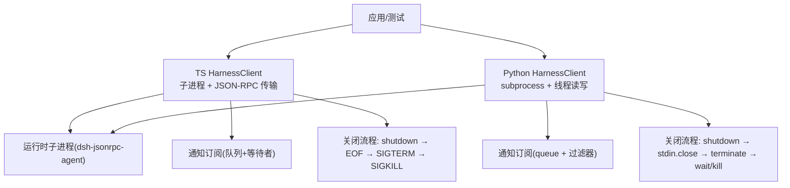
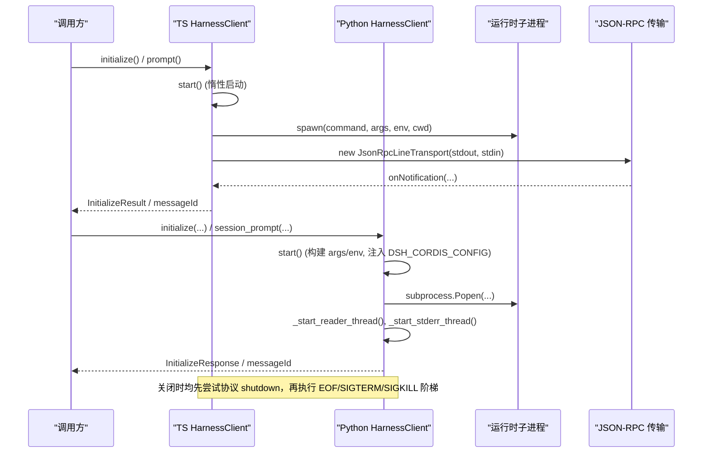
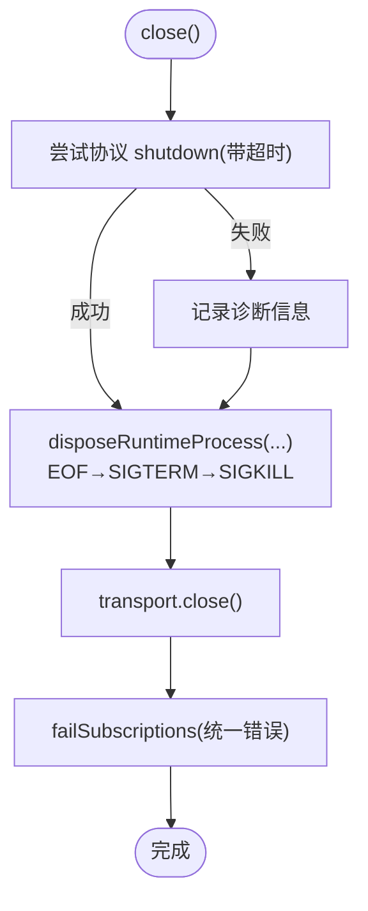
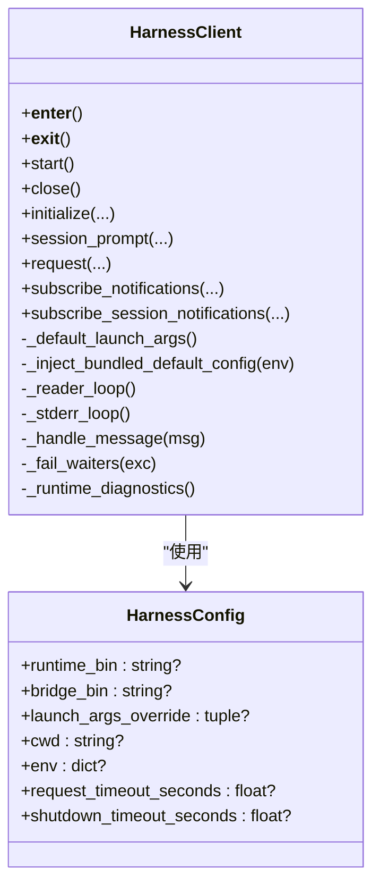
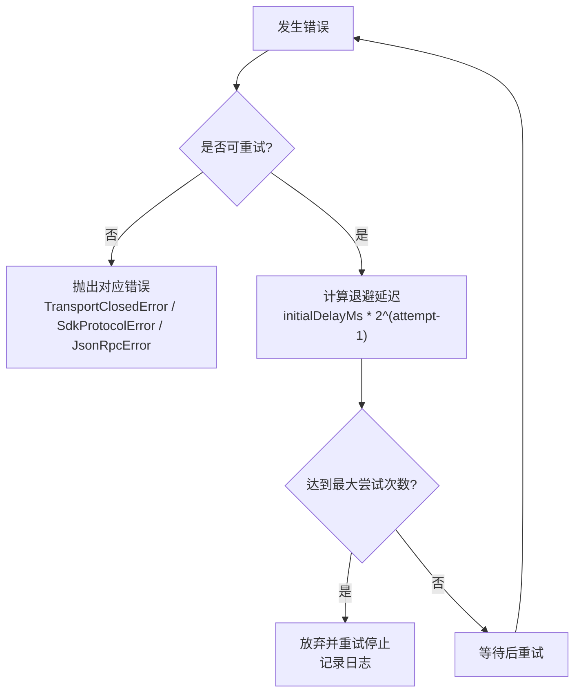
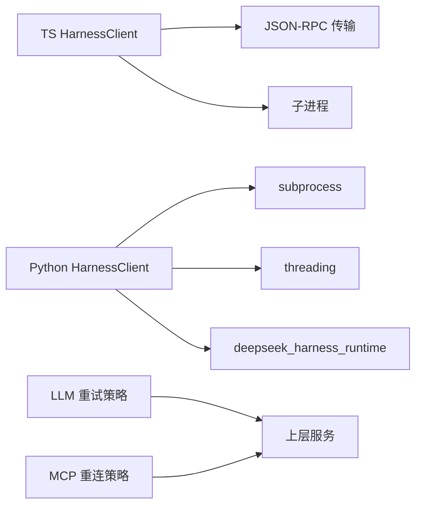

# 连接管理

<cite>
**本文引用的文件**
- [packages/sdk/client/src/client.ts](file://packages/sdk/client/src/client.ts)
- [packages/sdk/client/src/types.ts](file://packages/sdk/client/src/types.ts)
- [python/sdk/src/deepseek_harness/client.py](file://python/sdk/src/deepseek_harness/client.py)
- [python/sdk/src/deepseek_harness/errors.py](file://python/sdk/src/deepseek_harness/errors.py)
- [python/sdk/README.md](file://python/sdk/README.md)
- [packages/mcp/mcp-client/src/connection.ts](file://packages/mcp/mcp-client/src/connection.ts)
- [packages/llm/llm/src/retry-policy.ts](file://packages/llm/llm/src/retry-policy.ts)
- [packages/boot/app-boot/src/index.ts](file://packages/boot/app-boot/src/index.ts)
</cite>

## 目录
1. [简介](#简介)
2. [项目结构](#项目结构)
3. [核心组件](#核心组件)
4. [架构总览](#架构总览)
5. [详细组件分析](#详细组件分析)
6. [依赖关系分析](#依赖关系分析)
7. [性能考虑](#性能考虑)
8. [故障排查指南](#故障排查指南)
9. [结论](#结论)
10. [附录：示例与最佳实践](#附录示例与最佳实践)

## 简介
本文件聚焦于 Harness 客户端的连接管理，覆盖进程生命周期、线程模型、资源清理、配置项、错误处理与重试机制，以及上下文管理器模式的使用。文档同时给出连接池管理与性能优化建议，帮助读者在生产环境中稳定、高效地运行 Harness 客户端。

## 项目结构
围绕连接管理的代码主要分布在以下位置：
- TypeScript SDK 客户端：负责子进程启动、JSON-RPC 传输、通知订阅、关闭流程与超时控制。
- Python SDK 客户端：提供同步 API、线程化读写、环境变量注入、默认配置注入与上下文管理器。
- 通用重试与重连策略：为上层服务（如 MCP）提供指数退避与最大尝试次数等可配置的重试能力。
- 环境加载：按层级合并 .env 并注入到子进程环境。

图表来源
- [packages/sdk/client/src/client.ts:184-458](file://packages/sdk/client/src/client.ts#L184-L458)
- [python/sdk/src/deepseek_harness/client.py:37-116](file://python/sdk/src/deepseek_harness/client.py#L37-L116)

章节来源
- [packages/sdk/client/src/client.ts:184-458](file://packages/sdk/client/src/client.ts#L184-L458)
- [python/sdk/src/deepseek_harness/client.py:37-116](file://python/sdk/src/deepseek_harness/client.py#L37-L116)

## 核心组件
- TS HarnessClient
  - 子进程生命周期：惰性启动、错误捕获、退出/关闭事件处理、流收敛。
  - 请求与超时：支持 per-request 超时与 AbortController 放弃机制。
  - 通知系统：基于队列与等待者的异步迭代器，支持会话树过滤。
  - 关闭流程：协议 shutdown 失败降级为 EOF→SIGTERM→SIGKILL 阶梯式终止。
- Python HarnessClient
  - 子进程生命周期：start/close 实现，reader/stderr 线程，消息分发。
  - 配置与环境：默认二进制解析、DSH_CORDIS_CONFIG 注入、cwd/env 处理。
  - 上下文管理器：with 语句自动 start/close。
  - 错误体系：TransportClosedError、SdkProtocolError、JsonRpcError。
- 重试与重连
  - LLM 重试策略：backoff、maxRetries、retryableCodes 校验与默认值。
  - MCP 重连策略：指数退避、最大尝试次数、定时器 unref 避免阻塞进程。

章节来源
- [packages/sdk/client/src/client.ts:184-458](file://packages/sdk/client/src/client.ts#L184-L458)
- [python/sdk/src/deepseek_harness/client.py:24-116](file://python/sdk/src/deepseek_harness/client.py#L24-L116)
- [python/sdk/src/deepseek_harness/errors.py:4-24](file://python/sdk/src/deepseek_harness/errors.py#L4-L24)
- [packages/llm/llm/src/retry-policy.ts:105-156](file://packages/llm/llm/src/retry-policy.ts#L105-L156)
- [packages/mcp/mcp-client/src/connection.ts:200-352](file://packages/mcp/mcp-client/src/connection.ts#L200-L352)

## 架构总览
下图展示了 TS 与 Python 客户端在连接建立、运行与关闭时的关键交互。

图表来源
- [packages/sdk/client/src/client.ts:203-261](file://packages/sdk/client/src/client.ts#L203-L261)
- [packages/sdk/client/src/client.ts:380-401](file://packages/sdk/client/src/client.ts#L380-L401)
- [python/sdk/src/deepseek_harness/client.py:63-116](file://python/sdk/src/deepseek_harness/client.py#L63-L116)
- [python/sdk/src/deepseek_harness/client.py:424-454](file://python/sdk/src/deepseek_harness/client.py#L424-L454)

## 详细组件分析

### TS HarnessClient：进程生命周期与资源清理
- 启动
  - 惰性启动：首次 request/subscribe 触发 start()，创建子进程与 JSON-RPC 传输。
  - 事件绑定：error/exit/close 事件收集退出码与 stderr 尾部，用于诊断。
  - 流收敛：stderr close 与 exit 都就绪后才认为流已收敛，避免竞态。
- 请求与超时
  - 支持 per-request 超时；超时通过 AbortController 放弃请求，避免悬挂。
  - 运行时死亡或 spawn 失败会立即拒绝后续请求，附带退出码与 stderr 摘要。
- 通知订阅
  - 每个订阅维护队列与等待者列表；filter 抛错仅影响该订阅。
  - 支持 subscribeSessionTree，基于 subagent.started 父子关系过滤。
- 关闭流程
  - 先发送协议 shutdown（带超时），失败则记录诊断信息。
  - 随后执行 EOF→SIGTERM→SIGKILL 的阶梯终止，确保进程最终退出。
  - 关闭后所有订阅进入失败状态，pending waiter 被拒绝。

图表来源
- [packages/sdk/client/src/client.ts:380-401](file://packages/sdk/client/src/client.ts#L380-L401)
- [packages/sdk/client/src/client.ts:436-457](file://packages/sdk/client/src/client.ts#L436-L457)

章节来源
- [packages/sdk/client/src/client.ts:184-458](file://packages/sdk/client/src/client.ts#L184-L458)

### Python HarnessClient：线程模型、环境与上下文管理器
- 启动
  - 构造参数：优先 runtime_bin/bridge_bin，否则解析内置运行时参数。
  - 环境变量：复制父进程环境，可选注入 DSH_CORDIS_CONFIG（当使用内置运行时且未显式设置）。
  - 工作目录：cwd 解析为绝对路径后再传入。
  - 线程：reader 线程读取 stdout 并分发消息；stderr 线程收集日志。
- 请求与通知
  - 请求采用 queue 作为等待者；支持 on_notification 回调与 notification_subscription。
  - 通知按订阅过滤投递；无订阅时放入全局通知队列。
- 关闭
  - 先尝试 shutdown，再关闭 stdin，必要时 terminate/kill，并等待进程退出。
  - 关闭后统一失败所有等待者与订阅。
- 上下文管理器
  - with HarnessClient(...) 自动 start/close，保证资源释放。

图表来源
- [python/sdk/src/deepseek_harness/client.py:24-116](file://python/sdk/src/deepseek_harness/client.py#L24-L116)
- [python/sdk/src/deepseek_harness/client.py:424-454](file://python/sdk/src/deepseek_harness/client.py#L424-L454)

章节来源
- [python/sdk/src/deepseek_harness/client.py:24-116](file://python/sdk/src/deepseek_harness/client.py#L24-L116)
- [python/sdk/src/deepseek_harness/client.py:424-454](file://python/sdk/src/deepseek_harness/client.py#L424-L454)
- [python/sdk/README.md:49-52](file://python/sdk/README.md#L49-L52)

### 配置选项详解（HarnessConfig / HarnessClientOptions）
- 运行时二进制与参数
  - Python：runtime_bin、bridge_bin、launch_args_override；若均未设置则解析内置运行时参数。
  - TS：command、args、cwd、env。
- 环境变量
  - Python：env 覆盖父进程环境；当使用内置运行时且未显式设置 cordis 配置时，自动注入 DSH_CORDIS_CONFIG。
  - TS：env 完整替换子进程环境；未设置则继承 process.env。
- 超时配置
  - Python：request_timeout_seconds、shutdown_timeout_seconds。
  - TS：requestTimeoutMs、shutdownTimeoutMs、disposeEofGraceMs、disposeGraceMs。
- 工作目录
  - Python：cwd 解析为绝对路径后生效。
  - TS：cwd 直接传给子进程。

章节来源
- [python/sdk/src/deepseek_harness/client.py:24-35](file://python/sdk/src/deepseek_harness/client.py#L24-L35)
- [python/sdk/src/deepseek_harness/client.py:424-454](file://python/sdk/src/deepseek_harness/client.py#L424-L454)
- [packages/sdk/client/src/types.ts:22-45](file://packages/sdk/client/src/types.ts#L22-L45)
- [packages/boot/app-boot/src/index.ts:166-191](file://packages/boot/app-boot/src/index.ts#L166-L191)

### 错误处理与重试机制
- 错误类型
  - Python：TransportClosedError、SdkProtocolError、JsonRpcError。
  - TS：TransportClosedError、RequestTimeoutError、SdkProtocolError。
- 运行时异常传播
  - Python：reader/stderr 异常或 stdout 关闭会统一失败等待者与订阅。
  - TS：spawn error、exit、close 事件都会导致订阅失败与请求拒绝，并附带退出码与 stderr 尾部。
- 重试与重连
  - LLM 重试策略：支持 normal/always 模式、maxRetries、retryableCodes、backoff(initialDelayMs、maxDelayMs、jitterRatio)。
  - MCP 重连策略：指数退避、最大尝试次数、定时器 unref 避免阻止进程退出。

图表来源
- [packages/llm/llm/src/retry-policy.ts:105-156](file://packages/llm/llm/src/retry-policy.ts#L105-L156)
- [packages/mcp/mcp-client/src/connection.ts:200-225](file://packages/mcp/mcp-client/src/connection.ts#L200-L225)

章节来源
- [python/sdk/src/deepseek_harness/errors.py:4-24](file://python/sdk/src/deepseek_harness/errors.py#L4-L24)
- [packages/sdk/client/src/client.ts:38-65](file://packages/sdk/client/src/client.ts#L38-L65)
- [packages/llm/llm/src/retry-policy.ts:105-156](file://packages/llm/llm/src/retry-policy.ts#L105-L156)
- [packages/mcp/mcp-client/src/connection.ts:200-225](file://packages/mcp/mcp-client/src/connection.ts#L200-L225)

### 上下文管理器模式与资源自动清理
- Python HarnessClient
  - 支持 with HarnessClient(...) 自动 start/close，确保即使异常也能释放子进程与线程。
  - NotificationSubscription 同样支持 with 自动关闭。
- TS HarnessClient
  - 通过 close() 幂等关闭；建议在 finally 块中调用，或使用 try-with-resources 风格的封装。

章节来源
- [python/sdk/src/deepseek_harness/client.py:56-62](file://python/sdk/src/deepseek_harness/client.py#L56-L62)
- [python/sdk/src/deepseek_harness/client.py:507-546](file://python/sdk/src/deepseek_harness/client.py#L507-L546)
- [packages/sdk/client/src/client.ts:380-401](file://packages/sdk/client/src/client.ts#L380-L401)

## 依赖关系分析
- 模块耦合
  - TS 客户端依赖 JSON-RPC 传输与子进程；Python 客户端依赖 subprocess 与 threading。
  - 重试策略与重连策略被上层服务复用，不直接耦合具体客户端。
- 外部依赖
  - Python 内置运行时包 deepseek_harness_runtime 提供默认配置路径与启动参数。
  - 环境加载按层级合并 .env，避免污染父进程环境。

图表来源
- [packages/sdk/client/src/client.ts:15-25](file://packages/sdk/client/src/client.ts#L15-L25)
- [python/sdk/src/deepseek_harness/client.py:1-18](file://python/sdk/src/deepseek_harness/client.py#L1-L18)
- [python/sdk/src/deepseek_harness/client.py:424-454](file://python/sdk/src/deepseek_harness/client.py#L424-L454)
- [packages/llm/llm/src/retry-policy.ts:105-156](file://packages/llm/llm/src/retry-policy.ts#L105-L156)
- [packages/mcp/mcp-client/src/connection.ts:200-225](file://packages/mcp/mcp-client/src/connection.ts#L200-L225)

章节来源
- [packages/sdk/client/src/client.ts:15-25](file://packages/sdk/client/src/client.ts#L15-L25)
- [python/sdk/src/deepseek_harness/client.py:1-18](file://python/sdk/src/deepseek_harness/client.py#L1-L18)
- [python/sdk/src/deepseek_harness/client.py:424-454](file://python/sdk/src/deepseek_harness/client.py#L424-L454)
- [packages/llm/llm/src/retry-policy.ts:105-156](file://packages/llm/llm/src/retry-policy.ts#L105-L156)
- [packages/mcp/mcp-client/src/connection.ts:200-225](file://packages/mcp/mcp-client/src/connection.ts#L200-L225)

## 性能考虑
- 请求超时与放弃
  - TS 客户端使用 AbortController 放弃超时的请求，避免悬挂与服务端资源占用。
- 流收敛与关闭
  - 关闭前等待 stderr 与 exit 收敛，减少竞态导致的误报。
- 重连退避
  - 指数退避限制重连风暴；定时器 unref 避免阻止进程退出。
- 通知批处理
  - 订阅侧使用队列缓冲，避免频繁唤醒；过滤逻辑尽量轻量。
- 环境变量与配置
  - 合理设置 requestTimeoutMs/shutdownTimeoutMs，避免长任务误判超时。
  - 使用 DSH_CORDIS_CONFIG 指向最小化配置，减少启动开销。

[本节为通用指导，无需特定文件引用]

## 故障排查指南
- 常见错误
  - TransportClosedError：子进程退出或 stdout 关闭；检查退出码与 stderr 尾部。
  - RequestTimeoutError：请求超时；检查服务端负载与超时配置。
  - SdkProtocolError：协议不匹配；检查服务端版本与接口变更。
  - JsonRpcError：服务端返回错误响应；查看 code/message/data。
- 诊断信息
  - Python：_runtime_diagnostics 包含退出码与 stderr 尾部。
  - TS：closedError 聚合 spawnError、exitCode、stderr tail。
- 定位步骤
  - 确认子进程是否启动成功（command/args/env/cwd）。
  - 检查 DSH_CORDIS_CONFIG 是否正确注入。
  - 观察重连日志与退避策略是否合理。
  - 逐步缩小范围：最小化配置、隔离网络/依赖问题。

章节来源
- [python/sdk/src/deepseek_harness/client.py:399-422](file://python/sdk/src/deepseek_harness/client.py#L399-L422)
- [packages/sdk/client/src/client.ts:451-457](file://packages/sdk/client/src/client.ts#L451-L457)
- [python/sdk/src/deepseek_harness/errors.py:4-24](file://python/sdk/src/deepseek_harness/errors.py#L4-L24)

## 结论
Harness 客户端提供了健壮的进程生命周期管理、完善的错误处理与可配置的重试/重连策略。通过上下文管理器与幂等关闭，确保资源自动清理。生产部署时应合理配置超时、环境变量与重连策略，并结合日志与诊断信息进行快速定位与优化。

[本节为总结性内容，无需特定文件引用]

## 附录：示例与最佳实践
- 初始化与关闭（TypeScript）
  - 使用 try/finally 确保 close() 被调用；为请求设置合理的 requestTimeoutMs。
  - 参考路径：[packages/sdk/client/src/client.ts:268-333](file://packages/sdk/client/src/client.ts#L268-L333)、[packages/sdk/client/src/client.ts:380-401](file://packages/sdk/client/src/client.ts#L380-L401)
- 初始化与关闭（Python）
  - 使用 with HarnessClient(...) 自动管理生命周期；设置 DSH_CORDIS_CONFIG 指向最小配置。
  - 参考路径：[python/sdk/src/deepseek_harness/client.py:56-62](file://python/sdk/src/deepseek_harness/client.py#L56-L62)、[python/sdk/src/deepseek_harness/client.py:424-454](file://python/sdk/src/deepseek_harness/client.py#L424-L454)
- 连接池管理建议
  - 单实例复用：对同一运行时保持单一客户端实例，避免重复启动开销。
  - 多租户隔离：不同租户使用独立进程与配置，避免共享状态冲突。
  - 限流与背压：结合请求超时与订阅队列大小限制，防止雪崩。
- 性能优化建议
  - 合理设置 disposeEofGraceMs/disposeGraceMs，平衡优雅关闭与快速回收。
  - 使用通知过滤减少无关消息处理。
  - 监控重连频率与退避参数，避免过度重连。

章节来源
- [packages/sdk/client/src/client.ts:268-333](file://packages/sdk/client/src/client.ts#L268-L333)
- [packages/sdk/client/src/client.ts:380-401](file://packages/sdk/client/src/client.ts#L380-L401)
- [python/sdk/src/deepseek_harness/client.py:56-62](file://python/sdk/src/deepseek_harness/client.py#L56-L62)
- [python/sdk/src/deepseek_harness/client.py:424-454](file://python/sdk/src/deepseek_harness/client.py#L424-L454)