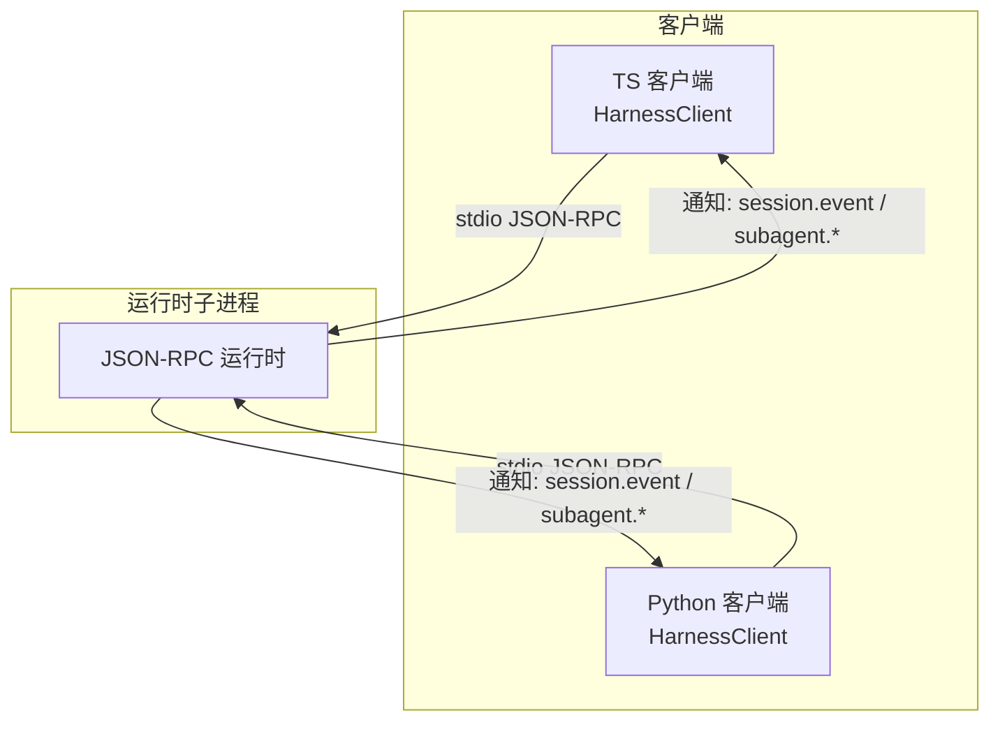
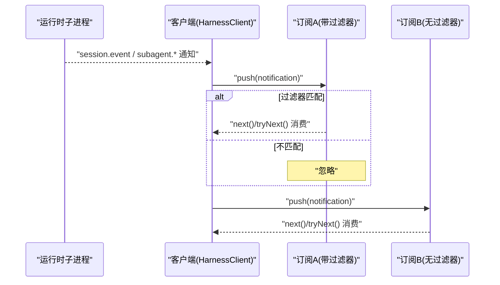
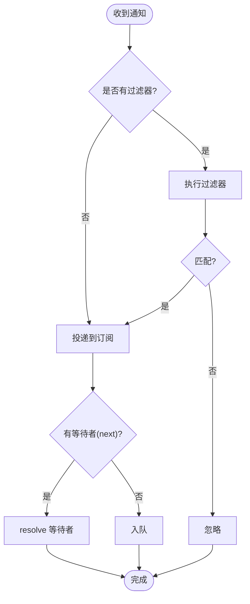
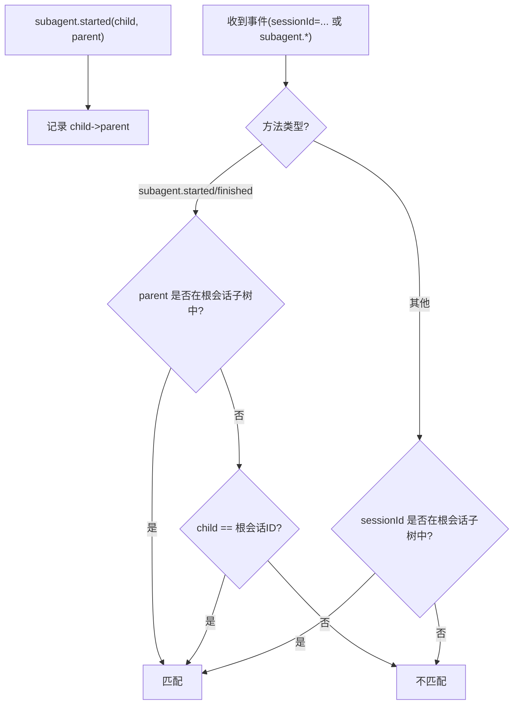
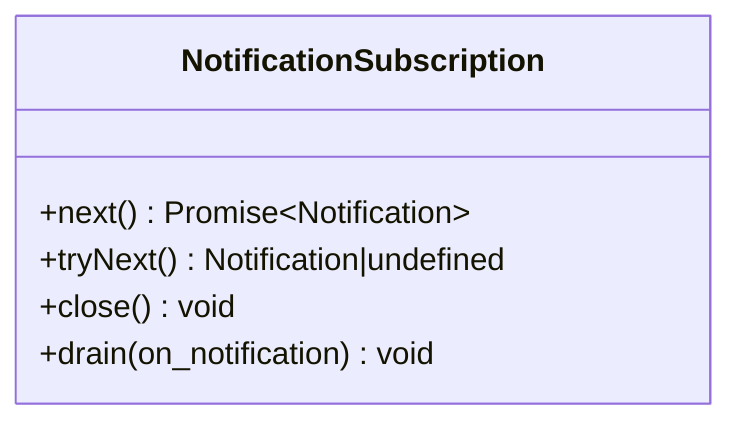
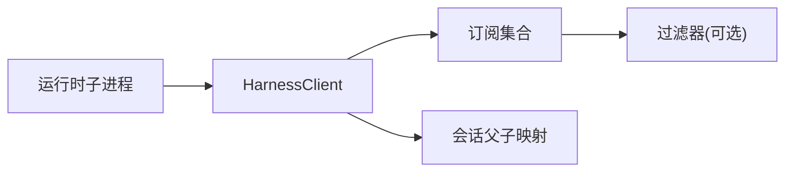

# 通知系统

<cite>
**本文引用的文件**
- [packages/sdk/client/src/client.ts](file://packages/sdk/client/src/client.ts)
- [packages/sdk/client/src/types.ts](file://packages/sdk/client/src/types.ts)
- [python/sdk/src/deepseek_harness/client.py](file://python/sdk/src/deepseek_harness/client.py)
- [python/sdk/tests/test_client.py](file://python/sdk/tests/test_client.py)
- [packages/sdk/client/tests/sdk-client.spec.ts](file://packages/sdk/client/tests/sdk-client.spec.ts)
</cite>

## 目录
1. [简介](#简介)
2. [项目结构](#项目结构)
3. [核心组件](#核心组件)
4. [架构总览](#架构总览)
5. [详细组件分析](#详细组件分析)
6. [依赖关系分析](#依赖关系分析)
7. [性能考虑](#性能考虑)
8. [故障排查指南](#故障排查指南)
9. [结论](#结论)
10. [附录：代码示例与最佳实践](#附录代码示例与最佳实践)

## 简介
本文件面向 DeepSeek Harness SDK 的通知子系统，系统性说明通知订阅机制、过滤器函数的工作原理、NotificationSubscription 的使用方法（获取、批量处理、资源清理）、会话树形结构的通知传播机制，以及性能与内存管理建议。文档同时覆盖 TypeScript 与 Python 两套客户端实现，确保跨语言使用一致。

## 项目结构
通知系统由“运行时子进程”通过 JSON-RPC 推送通知，SDK 客户端负责启动/维护子进程、读取通知、按订阅分发到各订阅者。关键位置如下：
- TypeScript 客户端：packages/sdk/client/src/client.ts、types.ts
- Python 客户端：python/sdk/src/deepseek_harness/client.py
- 测试用例：packages/sdk/client/tests/sdk-client.spec.ts、python/sdk/tests/test_client.py

图表来源
- [packages/sdk/client/src/client.ts:203-260](file://packages/sdk/client/src/client.ts#L203-L260)
- [python/sdk/src/deepseek_harness/client.py:63-116](file://python/sdk/src/deepseek_harness/client.py#L63-L116)

章节来源
- [packages/sdk/client/src/client.ts:1-474](file://packages/sdk/client/src/client.ts#L1-L474)
- [python/sdk/src/deepseek_harness/client.py:1-558](file://python/sdk/src/deepseek_harness/client.py#L1-L558)

## 核心组件
- 通知类型与过滤器
  - HarnessNotification：包含 method 和 params 的原始通知对象
  - NotificationFilter：(notification) => boolean 的谓词函数，用于过滤通知
- 订阅接口
  - next()：阻塞等待下一个匹配的通知
  - tryNext()：非阻塞取出已排队的一个通知
  - close()：关闭订阅，丢弃队列并拒绝后续等待
  - drain(on_notification)：Python 侧批量消费队列中的通知
- 会话树追踪
  - 基于 subagent.started 事件维护父子关系映射，支持 subscribeSessionTree / subscribe_session_notifications 按会话及其后代进行过滤

章节来源
- [packages/sdk/client/src/types.ts:11-20](file://packages/sdk/client/src/types.ts#L11-L20)
- [packages/sdk/client/src/client.ts:74-173](file://packages/sdk/client/src/client.ts#L74-L173)
- [python/sdk/src/deepseek_harness/client.py:192-204](file://python/sdk/src/deepseek_harness/client.py#L192-L204)
- [python/sdk/src/deepseek_harness/client.py:507-546](file://python/sdk/src/deepseek_harness/client.py#L507-L546)

## 架构总览
通知从运行时子进程经 JSON-RPC 推送到客户端；客户端内部将通知分发给所有活跃订阅者。每个订阅者可携带自定义过滤器，仅接收感兴趣的通知。对于会话树订阅，客户端会记录 subagent.started 产生的父子关系，从而在后续事件中判断是否属于该会话树。

图表来源
- [packages/sdk/client/src/client.ts:403-406](file://packages/sdk/client/src/client.ts#L403-L406)
- [packages/sdk/client/src/client.ts:150-163](file://packages/sdk/client/src/client.ts#L150-L163)
- [python/sdk/src/deepseek_harness/client.py:363-384](file://python/sdk/src/deepseek_harness/client.py#L363-L384)

## 详细组件分析

### 通知订阅机制与过滤器
- 通用订阅
  - TypeScript：subscribe(filter?) 返回 NotificationSubscription
  - Python：subscribe_notifications(notification_filter=None) 返回 NotificationSubscription
- 过滤器执行
  - 若未提供过滤器，则接收全部通知
  - 若提供过滤器，仅在匹配时投递到订阅队列或唤醒等待者
  - 过滤器抛错会被捕获，仅影响当前订阅（立即失败并断开），不影响其他订阅或读循环
- 通知投递
  - 有等待者（next）则直接 resolve；否则入队，供 tryNext/drain 消费

图表来源
- [packages/sdk/client/src/client.ts:150-163](file://packages/sdk/client/src/client.ts#L150-L163)
- [python/sdk/src/deepseek_harness/client.py:363-384](file://python/sdk/src/deepseek_harness/client.py#L363-L384)

章节来源
- [packages/sdk/client/src/client.ts:342-352](file://packages/sdk/client/src/client.ts#L342-L352)
- [python/sdk/src/deepseek_harness/client.py:192-204](file://python/sdk/src/deepseek_harness/client.py#L192-L204)
- [packages/sdk/client/tests/sdk-client.spec.ts:392-405](file://packages/sdk/client/tests/sdk-client.spec.ts#L392-L405)

### 会话树形结构的通知传播
- 关系建立
  - 当收到 subagent.started 时，记录 child -> parent 的父子关系
- 过滤规则
  - subagent.started / subagent.finished：若父节点在当前根会话的子树中，或子节点等于根会话 ID，则匹配
  - 其他事件：若 sessionId 在当前根会话的子树中，则匹配
- 祖先判定
  - 沿父链向上查找，直到到达根会话或发现不存在父节点为止

图表来源
- [packages/sdk/client/src/client.ts:408-430](file://packages/sdk/client/src/client.ts#L408-L430)
- [python/sdk/src/deepseek_harness/client.py:460-504](file://python/sdk/src/deepseek_harness/client.py#L460-L504)

章节来源
- [packages/sdk/client/src/client.ts:361-372](file://packages/sdk/client/src/client.ts#L361-L372)
- [python/sdk/src/deepseek_harness/client.py:202-204](file://python/sdk/src/deepseek_harness/client.py#L202-L204)
- [python/sdk/tests/test_client.py:504-528](file://python/sdk/tests/test_client.py#L504-L528)

### NotificationSubscription 使用方法
- 获取通知
  - next()：阻塞等待下一个匹配通知；运行时报错时会先排空已投递的通知再拒绝
  - tryNext()：非阻塞取一个已投递的通知
- 批量处理
  - Python 侧 drain(on_notification)：循环取出队列中的所有通知并调用回调
- 资源清理
  - close()：断开订阅，丢弃队列，并让后续 next() 立即拒绝
  - 上下文管理器：Python 支持 with 语句自动关闭；TS 需显式 close()

图表来源
- [packages/sdk/client/src/client.ts:74-173](file://packages/sdk/client/src/client.ts#L74-L173)
- [python/sdk/src/deepseek_harness/client.py:507-546](file://python/sdk/src/deepseek_harness/client.py#L507-L546)

章节来源
- [packages/sdk/client/src/client.ts:107-173](file://packages/sdk/client/src/client.ts#L107-L173)
- [python/sdk/src/deepseek_harness/client.py:507-546](file://python/sdk/src/deepseek_harness/client.py#L507-L546)
- [packages/sdk/client/tests/sdk-client.spec.ts:407-429](file://packages/sdk/client/tests/sdk-client.spec.ts#L407-L429)

### 错误与异常处理
- 过滤器抛错：仅影响当前订阅，订阅被断开并失败；其他订阅不受影响
- 运行时关闭：所有订阅统一失败；已投递的通知仍可被 tryNext/drain 消费
- 请求超时：TS 抛出 RequestTimeoutError；Python 抛出 TimeoutError

章节来源
- [packages/sdk/client/src/client.ts:150-163](file://packages/sdk/client/src/client.ts#L150-L163)
- [packages/sdk/client/src/client.ts:301-333](file://packages/sdk/client/src/client.ts#L301-L333)
- [python/sdk/src/deepseek_harness/client.py:363-396](file://python/sdk/src/deepseek_harness/client.py#L363-L396)
- [packages/sdk/client/tests/sdk-client.spec.ts:392-405](file://packages/sdk/client/tests/sdk-client.spec.ts#L392-L405)

## 依赖关系分析
- 客户端与运行时通过 JSON-RPC 通信，通知为单向推送
- 会话树依赖 subagent.started 事件构建父子关系图
- 订阅之间相互独立，过滤器异常隔离

图表来源
- [packages/sdk/client/src/client.ts:184-195](file://packages/sdk/client/src/client.ts#L184-L195)
- [python/sdk/src/deepseek_harness/client.py:40-55](file://python/sdk/src/deepseek_harness/client.py#L40-L55)

章节来源
- [packages/sdk/client/src/client.ts:184-195](file://packages/sdk/client/src/client.ts#L184-L195)
- [python/sdk/src/deepseek_harness/client.py:40-55](file://python/sdk/src/deepseek_harness/client.py#L40-L55)

## 性能考虑
- 过滤器复杂度
  - 尽量保持 O(1) 或低开销；避免在过滤器中进行昂贵计算或 I/O
- 队列与等待者
  - next() 会阻塞等待，适合单消费者；高吞吐场景建议使用 tryNext()/drain() 批量消费
- 会话树遍历
  - isDescendantOf 沿父链上溯，注意避免过深的会话层级导致多次查找
- 资源释放
  - 及时 close() 订阅，避免队列堆积；Python 推荐 with 语句自动关闭
- 运行时关闭
  - 关闭后仍有已投递通知可消费，但不再有新通知；注意区分 close() 与运行时死亡的不同语义

[本节为通用指导，不直接分析具体文件]

## 故障排查指南
- 过滤器异常
  - 现象：某个订阅 next() 抛出错误并断开，其他订阅正常
  - 定位：检查过滤器逻辑，确保不会抛错
- 通知丢失
  - 现象：某些事件未出现在订阅中
  - 可能原因：过滤器不匹配或未订阅对应会话树
- 运行时崩溃
  - 现象：所有订阅 next() 抛出 TransportClosedError
  - 诊断：查看 stderr 尾部与退出码（客户端会在错误信息中包含）
- 会话树不生效
  - 现象：subscribeSessionTree/subscribe_session_notifications 未收到预期事件
  - 检查：确认 subagent.started 已正确上报父子关系

章节来源
- [packages/sdk/client/src/client.ts:451-457](file://packages/sdk/client/src/client.ts#L451-L457)
- [python/sdk/src/deepseek_harness/client.py:399-422](file://python/sdk/src/deepseek_harness/client.py#L399-L422)
- [packages/sdk/client/tests/sdk-client.spec.ts:407-429](file://packages/sdk/client/tests/sdk-client.spec.ts#L407-L429)

## 结论
通知系统通过轻量级的 JSON-RPC 推送与灵活的过滤器机制，实现了高效、可扩展的事件分发。会话树订阅利用 subagent.started 事件动态构建父子关系，使上层应用可以方便地监听特定会话及其后代的所有相关事件。合理设计过滤器、及时释放订阅、关注运行时状态，是保证系统稳定与高性能的关键。

[本节为总结性内容，不直接分析具体文件]

## 附录：代码示例与最佳实践

- 通用订阅与过滤器
  - TypeScript：使用 subscribe(filter) 创建订阅，配合 next()/tryNext() 消费
  - Python：使用 subscribe_notifications(filter) 创建订阅，配合 next()/drain() 消费
  - 最佳实践：过滤器只做快速判断；复杂逻辑放在消费端

- 会话树订阅
  - TypeScript：subscribeSessionTree(sessionId)
  - Python：subscribe_session_notifications(session_id)
  - 最佳实践：确保 subagent.started 事件能正确上报父子关系；对深层级会话树谨慎评估遍历成本

- 批量处理
  - Python：drain(on_notification) 可一次性处理队列中所有通知，减少阻塞次数
  - TypeScript：结合 tryNext() 在非阻塞场景下批量消费

- 资源清理
  - Python：推荐使用 with 语句自动关闭订阅
  - TypeScript：确保在 finally 块中调用 close()，避免泄漏

- 错误处理
  - 捕获过滤器异常：确保单个订阅失败不影响整体
  - 处理运行时关闭：区分 close() 与运行时死亡，前者丢弃队列，后者保留已投递通知

章节来源
- [packages/sdk/client/src/client.ts:342-372](file://packages/sdk/client/src/client.ts#L342-L372)
- [python/sdk/src/deepseek_harness/client.py:192-204](file://python/sdk/src/deepseek_harness/client.py#L192-L204)
- [python/sdk/src/deepseek_harness/client.py:507-546](file://python/sdk/src/deepseek_harness/client.py#L507-L546)
- [python/sdk/tests/test_client.py:504-528](file://python/sdk/tests/test_client.py#L504-L528)
- [packages/sdk/client/tests/sdk-client.spec.ts:407-429](file://packages/sdk/client/tests/sdk-client.spec.ts#L407-L429)