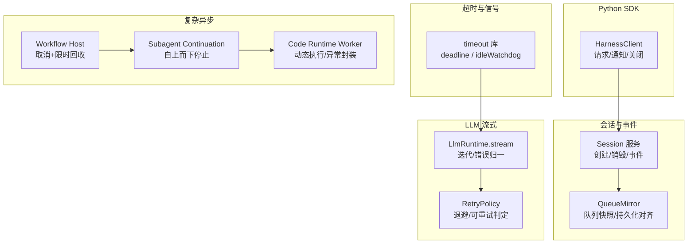
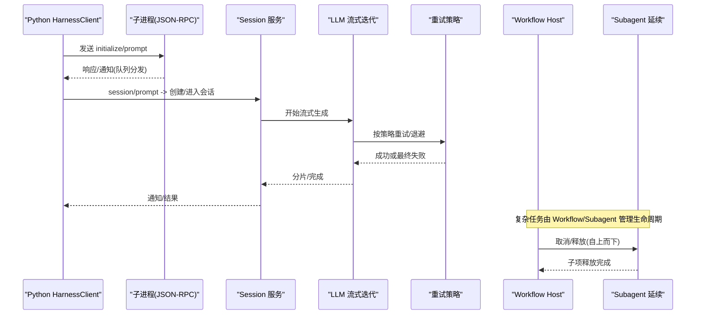
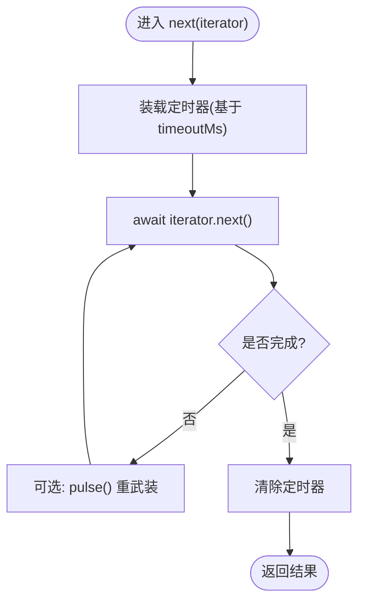
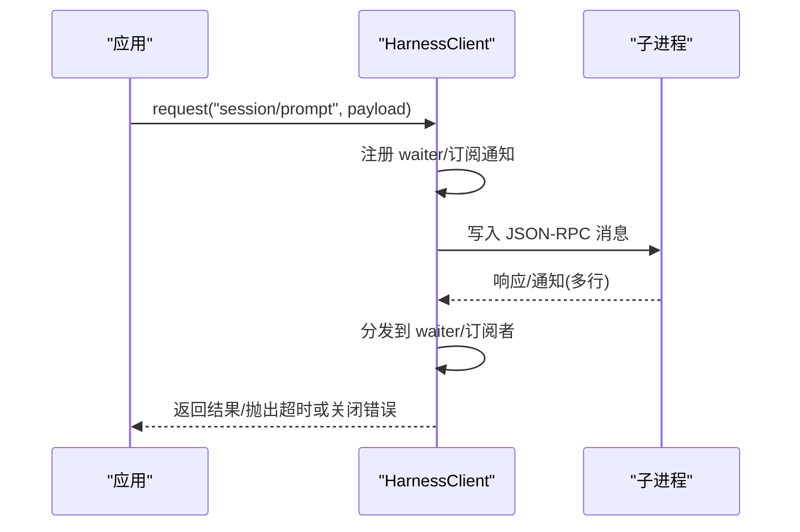
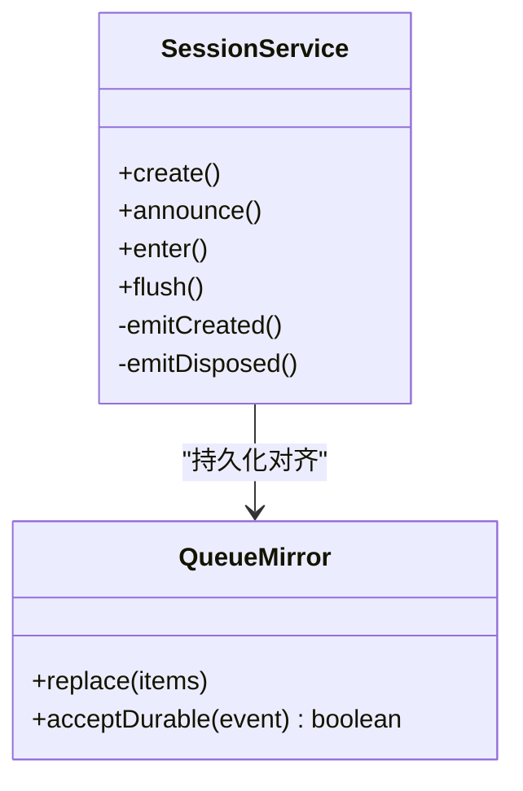
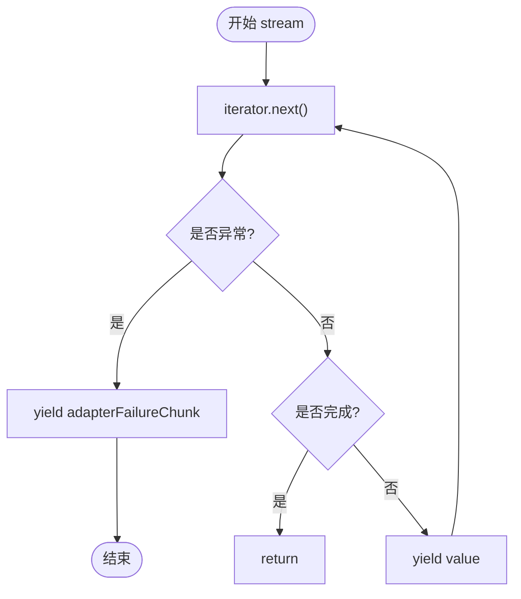
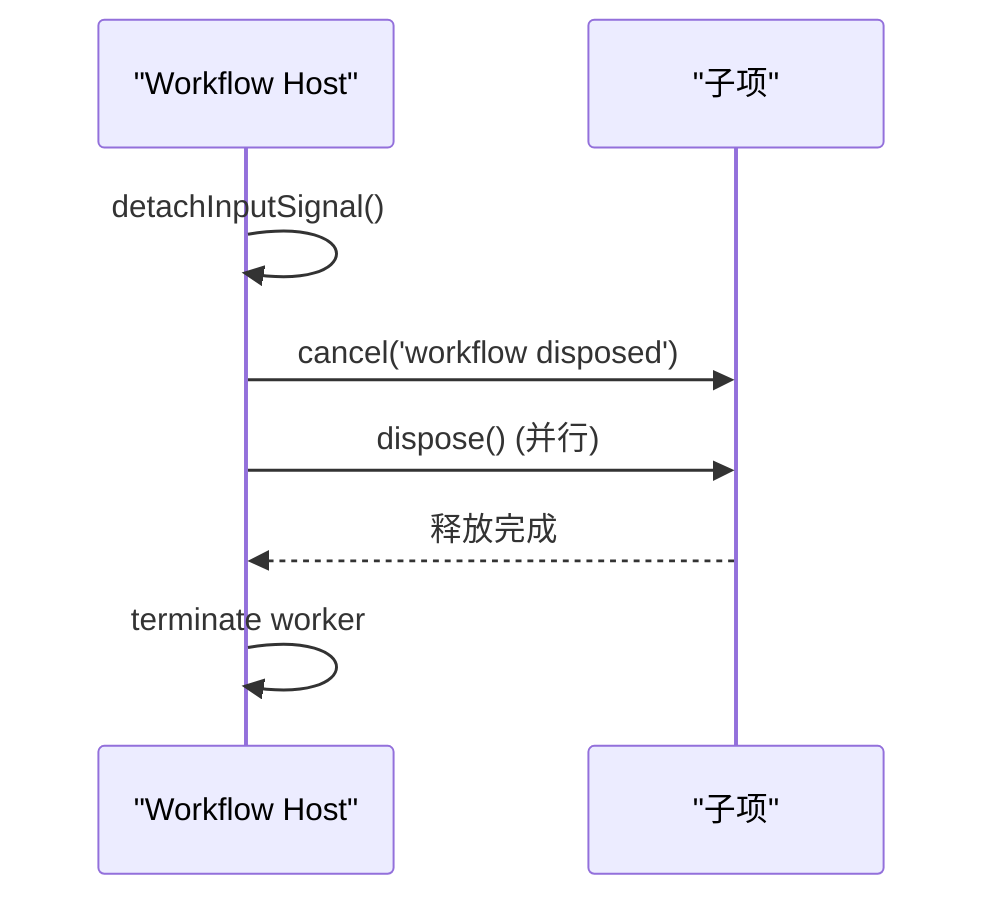
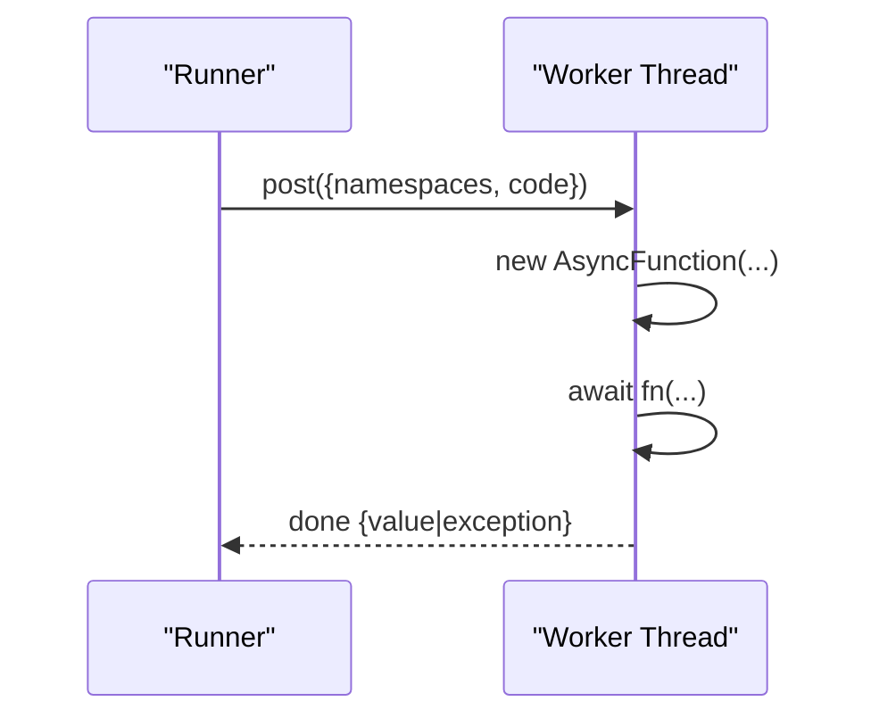
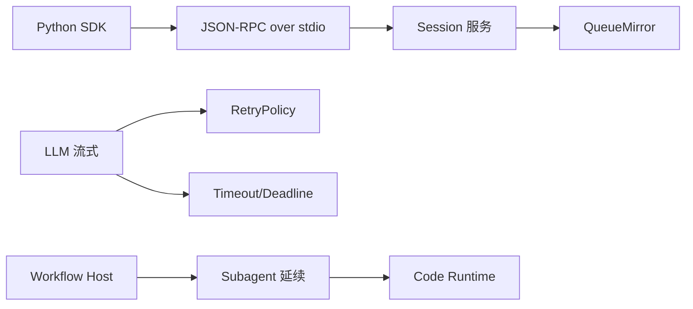

# 异步操作

<cite>
**本文引用的文件**
- [packages/util/timeout/src/index.ts](file://packages/util/timeout/src/index.ts)
- [packages/util/timeout/tests/timeout.spec.ts](file://packages/util/timeout/tests/timeout.spec.ts)
- [packages/util/timeout/README.md](file://packages/util/timeout/README.md)
- [python/sdk/src/deepseek_harness/client.py](file://python/sdk/src/deepseek_harness/client.py)
- [packages/core/session/src/index.ts](file://packages/core/session/src/index.ts)
- [packages/client/runtime/src/client/sessions/queue-mirror.ts](file://packages/client/runtime/src/client/sessions/queue-mirror.ts)
- [packages/test-support/llm-replay/src/index.ts](file://packages/test-support/llm-replay/src/index.ts)
- [packages/workflow/workflow-worker-thread/src/host.ts](file://packages/workflow/workflow-worker-thread/src/host.ts)
- [packages/subagent/subagent/src/continuation.ts](file://packages/subagent/subagent/src/continuation.ts)
- [packages/api/gateway/src/client/index.ts](file://packages/api/gateway/src/client/index.ts)
- [packages/code-runtime/code-runtime-worker-thread/src/bootstrap.ts](file://packages/code-runtime/code-runtime-worker-thread/src/bootstrap.ts)
- [packages/extensions/cordis-client-runner/src/client/timer.ts](file://packages/extensions/cordis-client-runner/src/client/timer.ts)
- [packages/llm/llm/src/retry-policy.ts](file://packages/llm/llm/src/retry-policy.ts)
- [packages/llm/llm/src/index.ts](file://packages/llm/llm/src/index.ts)
- [docs/defensive-patterns.md](file://docs/defensive-patterns.md)
</cite>

## 目录
1. [简介](#简介)
2. [项目结构](#项目结构)
3. [核心组件](#核心组件)
4. [架构总览](#架构总览)
5. [详细组件分析](#详细组件分析)
6. [依赖关系分析](#依赖关系分析)
7. [性能考量](#性能考量)
8. [故障排查指南](#故障排查指南)
9. [结论](#结论)
10. [附录：常见模式与示例路径](#附录：常见模式与示例路径)

## 简介
本文件聚焦于仓库中的异步编程模型与协程支持，覆盖以下主题：
- 异步连接建立、会话管理与消息处理
- 异步上下文管理与资源清理机制
- 异步错误处理与超时控制最佳实践
- 并发操作指导与性能优化建议
- 与 asyncio 生态的集成方式（Python SDK）
- 完整的异步代码示例与常见模式（以源码路径引用为主）

该仓库在 TypeScript/Node.js 侧广泛使用 Promise、AsyncIterator、AbortSignal 以及基于事件循环的流式处理；在 Python SDK 侧通过子进程 + 线程队列实现 JSON-RPC 通信，并提供同步 API，内部以线程和队列模拟“等待-通知”的异步语义。

## 项目结构
围绕异步能力的核心分布在如下位置：
- 超时与空闲守护：packages/util/timeout
- Python SDK 客户端（JSON-RPC over stdio）：python/sdk/src/deepseek_harness/client.py
- 会话生命周期与事件分发：packages/core/session/src/index.ts
- 客户端队列镜像与持久化对齐：packages/client/runtime/src/client/sessions/queue-mirror.ts
- LLM 流式迭代与重试策略：packages/llm/llm/src/index.ts、packages/llm/llm/src/retry-policy.ts
- 工作流/子代理/代码运行时等复杂异步场景：packages/workflow、packages/subagent、packages/code-runtime
- 测试回放与计时器：packages/test-support/llm-replay、packages/extensions/cordis-client-runner

图表来源
- [packages/util/timeout/src/index.ts:33-190](file://packages/util/timeout/src/index.ts#L33-L190)
- [python/sdk/src/deepseek_harness/client.py:157-296](file://python/sdk/src/deepseek_harness/client.py#L157-L296)
- [packages/core/session/src/index.ts:984-1007](file://packages/core/session/src/index.ts#L984-L1007)
- [packages/client/runtime/src/client/sessions/queue-mirror.ts:45-74](file://packages/client/runtime/src/client/sessions/queue-mirror.ts#L45-L74)
- [packages/llm/llm/src/index.ts:872-900](file://packages/llm/llm/src/index.ts#L872-L900)
- [packages/llm/llm/src/retry-policy.ts:123-191](file://packages/llm/llm/src/retry-policy.ts#L123-L191)
- [packages/workflow/workflow-worker-thread/src/host.ts:206-230](file://packages/workflow/workflow-worker-thread/src/host.ts#L206-L230)
- [packages/subagent/subagent/src/continuation.ts:1292-1307](file://packages/subagent/subagent/src/continuation.ts#L1292-L1307)
- [packages/code-runtime/code-runtime-worker-thread/src/bootstrap.ts:400-424](file://packages/code-runtime/code-runtime-worker-thread/src/bootstrap.ts#L400-L424)

章节来源
- [packages/util/timeout/src/index.ts:33-190](file://packages/util/timeout/src/index.ts#L33-L190)
- [python/sdk/src/deepseek_harness/client.py:157-296](file://python/sdk/src/deepseek_harness/client.py#L157-L296)
- [packages/core/session/src/index.ts:984-1007](file://packages/core/session/src/index.ts#L984-L1007)
- [packages/client/runtime/src/client/sessions/queue-mirror.ts:45-74](file://packages/client/runtime/src/client/sessions/queue-mirror.ts#L45-L74)
- [packages/llm/llm/src/index.ts:872-900](file://packages/llm/llm/src/index.ts#L872-L900)
- [packages/llm/llm/src/retry-policy.ts:123-191](file://packages/llm/llm/src/retry-policy.ts#L123-L191)
- [packages/workflow/workflow-worker-thread/src/host.ts:206-230](file://packages/workflow/workflow-worker-thread/src/host.ts#L206-L230)
- [packages/subagent/subagent/src/continuation.ts:1292-1307](file://packages/subagent/subagent/src/continuation.ts#L1292-L1307)
- [packages/code-runtime/code-runtime-worker-thread/src/bootstrap.ts:400-424](file://packages/code-runtime/code-runtime-worker-thread/src/bootstrap.ts#L400-L424)

## 核心组件
- 超时与空闲守护（TypeScript）
  - deadline：将上游取消信号与一次性定时器融合为 AbortSignal，附带 TimeoutReason，支持 using/dispose 清理。
  - idleWatchdog：针对 AsyncIterator 的“空闲超时”，仅在 next() 挂起时计时，支持 pulse 重武装。
  - clampTimeout/timeoutOf：参数校验与超时原因分类。
- Python SDK 客户端
  - HarnessClient：启动子进程、读写 JSON-RPC、请求-响应等待、通知订阅、关闭流程、诊断信息收集。
  - NotificationSubscription：带过滤的通知订阅，支持 drain/next/close。
- 会话与事件
  - Session 服务：创建/宣布/分离/销毁，事件监听器隔离与异常捕获。
  - QueueMirror：宿主队列快照替换与持久化消息对齐。
- LLM 流式与重试
  - stream：统一迭代器包装，错误归一化为终止块，finally 中确保 return 调用。
  - RetryPolicy：退避策略、最大重试次数、可重试码集合校验与默认值解析。
- 复杂异步场景
  - Workflow Host：取消+限时回收，立即下发子项释放，避免死锁。
  - Subagent Continuation：自上而下的停止传播与子项释放。
  - Code Runtime Worker：动态执行用户代码并封装完成/异常结果。

章节来源
- [packages/util/timeout/src/index.ts:33-190](file://packages/util/timeout/src/index.ts#L33-L190)
- [python/sdk/src/deepseek_harness/client.py:157-296](file://python/sdk/src/deepseek_harness/client.py#L157-L296)
- [packages/core/session/src/index.ts:984-1007](file://packages/core/session/src/index.ts#L984-L1007)
- [packages/client/runtime/src/client/sessions/queue-mirror.ts:45-74](file://packages/client/runtime/src/client/sessions/queue-mirror.ts#L45-L74)
- [packages/llm/llm/src/index.ts:872-900](file://packages/llm/llm/src/index.ts#L872-L900)
- [packages/llm/llm/src/retry-policy.ts:123-191](file://packages/llm/llm/src/retry-policy.ts#L123-L191)
- [packages/workflow/workflow-worker-thread/src/host.ts:206-230](file://packages/workflow/workflow-worker-thread/src/host.ts#L206-L230)
- [packages/subagent/subagent/src/continuation.ts:1292-1307](file://packages/subagent/subagent/src/continuation.ts#L1292-L1307)
- [packages/code-runtime/code-runtime-worker-thread/src/bootstrap.ts:400-424](file://packages/code-runtime/code-runtime-worker-thread/src/bootstrap.ts#L400-L424)

## 架构总览
下图展示从 Python SDK 发起请求到后端会话与流式处理的端到端异步链路，包含超时、重试、事件与资源清理。

图表来源
- [python/sdk/src/deepseek_harness/client.py:157-296](file://python/sdk/src/deepseek_harness/client.py#L157-L296)
- [packages/core/session/src/index.ts:984-1007](file://packages/core/session/src/index.ts#L984-L1007)
- [packages/llm/llm/src/index.ts:872-900](file://packages/llm/llm/src/index.ts#L872-L900)
- [packages/llm/llm/src/retry-policy.ts:123-191](file://packages/llm/llm/src/retry-policy.ts#L123-L191)
- [packages/workflow/workflow-worker-thread/src/host.ts:206-230](file://packages/workflow/workflow-worker-thread/src/host.ts#L206-L230)
- [packages/subagent/subagent/src/continuation.ts:1292-1307](file://packages/subagent/subagent/src/continuation.ts#L1292-L1307)

## 详细组件分析

### 超时与空闲守护（deadline / idleWatchdog）
- 设计要点
  - deadline 将上游取消与一次性定时器融合为稳定信号，携带 TimeoutReason，便于区分“超时”与“外部取消”。
  - idleWatchdog 仅在一次 next() 挂起时计时，避免消费方思考时间被误判为空闲；支持 pulse 在传输活动后重武装。
  - clampTimeout 强制正有限超时，timeoutOf 用于分类首个中止原因。
- 典型用法
  - 用 using/dispose 保证定时器在作用域退出时清理。
  - 将 signal 传递给底层 I/O（如 fetch），让真正的终止路径存在，而非仅靠 promise race。
- 复杂度与性能
  - 每个 idleWatchdog 最多一个活跃定时器；pulse 是 O(1)。
  - 避免无界定时器泄漏，降低事件循环压力。

图表来源
- [packages/util/timeout/src/index.ts:65-173](file://packages/util/timeout/src/index.ts#L65-L173)

章节来源
- [packages/util/timeout/src/index.ts:33-190](file://packages/util/timeout/src/index.ts#L33-L190)
- [packages/util/timeout/tests/timeout.spec.ts:137-230](file://packages/util/timeout/tests/timeout.spec.ts#L137-L230)
- [packages/util/timeout/README.md:30-49](file://packages/util/timeout/README.md#L30-L49)

### Python SDK 客户端（JSON-RPC over stdio）
- 连接建立
  - start() 启动子进程，开启 reader/stderr 线程，注入默认配置。
  - initialize() 初始化会话参数（cwd/provider/model/maxTokens）。
- 会话与消息
  - request()/session_prompt() 发送方法并等待响应；支持 on_notification 与过滤。
  - _request_raw() 维护请求-响应映射，轮询队列并处理通知，支持超时与诊断信息。
  - notify()/subscribe_notifications()/subscribe_session_notifications() 提供通知通道。
- 资源清理
  - close() 优雅关闭：shutdown 请求、关闭 stdin、终止/等待进程、清理线程、广播关闭异常给所有等待者。
  - _fail_waiters() 集中失败传播，确保所有 waiter/订阅者收到一致错误。
- 并发与线程安全
  - 使用锁保护共享状态（_responses/_notification_subscribers）。
  - 写锁串行化写入，避免交错。

图表来源
- [python/sdk/src/deepseek_harness/client.py:157-296](file://python/sdk/src/deepseek_harness/client.py#L157-L296)
- [python/sdk/src/deepseek_harness/client.py:318-385](file://python/sdk/src/deepseek_harness/client.py#L318-L385)
- [python/sdk/src/deepseek_harness/client.py:386-423](file://python/sdk/src/deepseek_harness/client.py#L386-L423)

章节来源
- [python/sdk/src/deepseek_harness/client.py:63-116](file://python/sdk/src/deepseek_harness/client.py#L63-L116)
- [python/sdk/src/deepseek_harness/client.py:117-155](file://python/sdk/src/deepseek_harness/client.py#L117-L155)
- [python/sdk/src/deepseek_harness/client.py:157-296](file://python/sdk/src/deepseek_harness/client.py#L157-L296)
- [python/sdk/src/deepseek_harness/client.py:318-385](file://python/sdk/src/deepseek_harness/client.py#L318-L385)
- [python/sdk/src/deepseek_harness/client.py:386-423](file://python/sdk/src/deepseek_harness/client.py#L386-L423)

### 会话管理与事件分发
- 会话生命周期
  - 创建/宣布/分离/销毁，事件监听器隔离，异常不会污染核心流程。
  - emitDisposed 对 teardown 通知进行包裹，确保单个监听器异常不影响其他监听器。
- 队列镜像
  - replace() 用完整快照替换当前队列视图，acceptDurable() 将持久化消息与临时行对齐。

图表来源
- [packages/core/session/src/index.ts:984-1007](file://packages/core/session/src/index.ts#L984-L1007)
- [packages/client/runtime/src/client/sessions/queue-mirror.ts:45-74](file://packages/client/runtime/src/client/sessions/queue-mirror.ts#L45-L74)

章节来源
- [packages/core/session/src/index.ts:984-1007](file://packages/core/session/src/index.ts#L984-L1007)
- [packages/client/runtime/src/client/sessions/queue-mirror.ts:45-74](file://packages/client/runtime/src/client/sessions/queue-mirror.ts#L45-L74)

### LLM 流式迭代与重试
- 流式迭代
  - 统一包装适配器迭代器，捕获异常并转换为终止块，finally 中确保 return 调用，避免资源泄漏。
- 重试策略
  - 支持 normal/always 模式，校验退避参数、最大重试次数、可重试码集合，提供默认值。
  - 结合超时信号，使重试可被上层取消。

图表来源
- [packages/llm/llm/src/index.ts:872-900](file://packages/llm/llm/src/index.ts#L872-L900)
- [packages/llm/llm/src/retry-policy.ts:123-191](file://packages/llm/llm/src/retry-policy.ts#L123-L191)

章节来源
- [packages/llm/llm/src/index.ts:872-900](file://packages/llm/llm/src/index.ts#L872-L900)
- [packages/llm/llm/src/retry-policy.ts:123-191](file://packages/llm/llm/src/retry-policy.ts#L123-L191)

### 复杂异步场景：工作流与子代理
- 工作流主机
  - dispose() 立即取消输入信号，并行下发子项释放，限制等待时间，最后无条件终止 worker，确保线程不存活超过运行期。
- 子代理延续
  - finishDisposal() 先唤醒并自上而下 cancel，再等待子项释放，避免祖先继续模型/工具工作。

图表来源
- [packages/workflow/workflow-worker-thread/src/host.ts:206-230](file://packages/workflow/workflow-worker-thread/src/host.ts#L206-L230)
- [packages/subagent/subagent/src/continuation.ts:1292-1307](file://packages/subagent/subagent/src/continuation.ts#L1292-L1307)

章节来源
- [packages/workflow/workflow-worker-thread/src/host.ts:206-230](file://packages/workflow/workflow-worker-thread/src/host.ts#L206-L230)
- [packages/subagent/subagent/src/continuation.ts:1292-1307](file://packages/subagent/subagent/src/continuation.ts#L1292-L1307)

### 代码运行时与定时任务
- 代码运行时
  - 动态构造 AsyncFunction 执行用户代码，捕获完成/异常并封装为完成消息，通过端口回传。
- 定时任务
  - 基于 setInterval 的异步迭代器，上下文 dispose 时清理定时器并拒绝待处理任务。

图表来源
- [packages/code-runtime/code-runtime-worker-thread/src/bootstrap.ts:400-424](file://packages/code-runtime/code-runtime-worker-thread/src/bootstrap.ts#L400-L424)
- [packages/extensions/cordis-client-runner/src/client/timer.ts:120-155](file://packages/extensions/cordis-client-runner/src/client/timer.ts#L120-L155)

章节来源
- [packages/code-runtime/code-runtime-worker-thread/src/bootstrap.ts:400-424](file://packages/code-runtime/code-runtime-worker-thread/src/bootstrap.ts#L400-L424)
- [packages/extensions/cordis-client-runner/src/client/timer.ts:120-155](file://packages/extensions/cordis-client-runner/src/client/timer.ts#L120-L155)

## 依赖关系分析
- 模块耦合
  - Python SDK 依赖子进程与线程队列，与 Session 服务通过 JSON-RPC 解耦。
  - Session 服务与 QueueMirror 协作，确保 UI 投影与持久化日志一致。
  - LLM 流式层依赖超时/重试能力，向上暴露统一的迭代协议。
  - Workflow/Subagent 作为更高层编排，向下驱动具体执行单元。
- 外部依赖
  - Node.js timers/promises、AbortSignal、AsyncIterator。
  - Python threading、subprocess、queue。

图表来源
- [python/sdk/src/deepseek_harness/client.py:157-296](file://python/sdk/src/deepseek_harness/client.py#L157-L296)
- [packages/core/session/src/index.ts:984-1007](file://packages/core/session/src/index.ts#L984-L1007)
- [packages/client/runtime/src/client/sessions/queue-mirror.ts:45-74](file://packages/client/runtime/src/client/sessions/queue-mirror.ts#L45-L74)
- [packages/llm/llm/src/index.ts:872-900](file://packages/llm/llm/src/index.ts#L872-L900)
- [packages/llm/llm/src/retry-policy.ts:123-191](file://packages/llm/llm/src/retry-policy.ts#L123-L191)
- [packages/util/timeout/src/index.ts:33-190](file://packages/util/timeout/src/index.ts#L33-L190)
- [packages/workflow/workflow-worker-thread/src/host.ts:206-230](file://packages/workflow/workflow-worker-thread/src/host.ts#L206-L230)
- [packages/subagent/subagent/src/continuation.ts:1292-1307](file://packages/subagent/subagent/src/continuation.ts#L1292-L1307)
- [packages/code-runtime/code-runtime-worker-thread/src/bootstrap.ts:400-424](file://packages/code-runtime/code-runtime-worker-thread/src/bootstrap.ts#L400-L424)

章节来源
- [python/sdk/src/deepseek_harness/client.py:157-296](file://python/sdk/src/deepseek_harness/client.py#L157-L296)
- [packages/core/session/src/index.ts:984-1007](file://packages/core/session/src/index.ts#L984-L1007)
- [packages/client/runtime/src/client/sessions/queue-mirror.ts:45-74](file://packages/client/runtime/src/client/sessions/queue-mirror.ts#L45-L74)
- [packages/llm/llm/src/index.ts:872-900](file://packages/llm/llm/src/index.ts#L872-L900)
- [packages/llm/llm/src/retry-policy.ts:123-191](file://packages/llm/llm/src/retry-policy.ts#L123-L191)
- [packages/util/timeout/src/index.ts:33-190](file://packages/util/timeout/src/index.ts#L33-L190)
- [packages/workflow/workflow-worker-thread/src/host.ts:206-230](file://packages/workflow/workflow-worker-thread/src/host.ts#L206-L230)
- [packages/subagent/subagent/src/continuation.ts:1292-1307](file://packages/subagent/subagent/src/continuation.ts#L1292-L1307)
- [packages/code-runtime/code-runtime-worker-thread/src/bootstrap.ts:400-424](file://packages/code-runtime/code-runtime-worker-thread/src/bootstrap.ts#L400-L424)

## 性能考量
- 超时与空闲检测
  - 使用 idleWatchdog 避免在无需求期间持有定时器；pulse 在传输活动后重武装，减少不必要的超时。
  - 使用 clampTimeout 限制最大超时，防止极端值导致长时间阻塞。
- 流式处理
  - LLM 流式迭代在 finally 中调用 return，确保下游资源及时释放，避免内存/句柄泄漏。
- 并发与背压
  - Python SDK 使用队列与锁，避免竞态；写操作加锁串行化，读操作通过队列解耦。
  - Workflow/Subagent 采用并行释放+限时等待，避免长尾阻塞。
- 事件循环友好
  - 使用 node:timers/promises 的 setTimeout，ref:false 避免阻止事件循环退出。
- 诊断与可观测性
  - 关闭/超时错误附带 stderr 尾部与进程退出码，便于快速定位问题。

[本节为通用性能讨论，不直接分析具体文件]

## 故障排查指南
- 超时与中断
  - 使用 timeoutOf(signal, code) 判断是否为本级超时，区分上游取消。
  - Python SDK 中 request 超时会抛出 TimeoutError，并附加运行时诊断信息。
- 资源泄漏
  - 确保 using/dispose 正确清理定时器与监听器；close() 中先关闭订阅再终止进程。
  - 流式迭代务必在 finally 中调用 iterator.return()。
- 回调异常隔离
  - 事件分发需包裹 try/catch，单个监听器异常不应影响核心流程。
- 进程/线程清理
  - Python SDK close() 中顺序：shutdown 请求 → 关闭 stdin → terminate/wait → 清理线程 → 广播关闭异常。
  - Workflow/Subagent 自上而下停止，确保子项释放完成后再终止宿主。

章节来源
- [packages/util/timeout/src/index.ts:175-190](file://packages/util/timeout/src/index.ts#L175-L190)
- [python/sdk/src/deepseek_harness/client.py:386-423](file://python/sdk/src/deepseek_harness/client.py#L386-L423)
- [packages/llm/llm/src/index.ts:872-900](file://packages/llm/llm/src/index.ts#L872-L900)
- [docs/defensive-patterns.md:15-25](file://docs/defensive-patterns.md#L15-L25)

## 结论
本仓库在 TypeScript 侧以 AbortSignal、AsyncIterator、超时/重试为核心构建稳健的异步模型；在 Python SDK 侧通过子进程与线程队列实现可靠的 JSON-RPC 通信。通过会话事件、流式迭代、工作流编排与严格的资源清理，系统在保证高吞吐的同时具备强韧的错误恢复能力。遵循文档中的最佳实践，可有效避免常见的异步陷阱，提升稳定性与可维护性。

[本节为总结性内容，不直接分析具体文件]

## 附录：常见模式与示例路径
- 超时与空闲守护
  - 使用 deadline 与 idleWatchdog 的模式与说明：[packages/util/timeout/README.md:30-49](file://packages/util/timeout/README.md#L30-L49)
  - 空闲守护行为验证用例：[packages/util/timeout/tests/timeout.spec.ts:200-230](file://packages/util/timeout/tests/timeout.spec.ts#L200-L230)
- Python SDK 异步请求与通知
  - 请求-响应循环与通知处理：[python/sdk/src/deepseek_harness/client.py:157-296](file://python/sdk/src/deepseek_harness/client.py#L157-L296)
  - 关闭与诊断：[python/sdk/src/deepseek_harness/client.py:386-423](file://python/sdk/src/deepseek_harness/client.py#L386-L423)
- 会话与队列对齐
  - 会话事件隔离与销毁通知：[packages/core/session/src/index.ts:984-1007](file://packages/core/session/src/index.ts#L984-L1007)
  - 队列快照与持久化对齐：[packages/client/runtime/src/client/sessions/queue-mirror.ts:45-74](file://packages/client/runtime/src/client/sessions/queue-mirror.ts#L45-L74)
- 流式与重试
  - 流式迭代与错误归一：[packages/llm/llm/src/index.ts:872-900](file://packages/llm/llm/src/index.ts#L872-L900)
  - 重试策略解析与校验：[packages/llm/llm/src/retry-policy.ts:123-191](file://packages/llm/llm/src/retry-policy.ts#L123-L191)
- 复杂异步编排
  - 工作流主机回收：[packages/workflow/workflow-worker-thread/src/host.ts:206-230](file://packages/workflow/workflow-worker-thread/src/host.ts#L206-L230)
  - 子代理停止传播：[packages/subagent/subagent/src/continuation.ts:1292-1307](file://packages/subagent/subagent/src/continuation.ts#L1292-L1307)
  - 代码运行时执行封装：[packages/code-runtime/code-runtime-worker-thread/src/bootstrap.ts:400-424](file://packages/code-runtime/code-runtime-worker-thread/src/bootstrap.ts#L400-L424)
- 防御性模式
  - 异步状态与清理原则：[docs/defensive-patterns.md:15-25](file://docs/defensive-patterns.md#L15-L25)