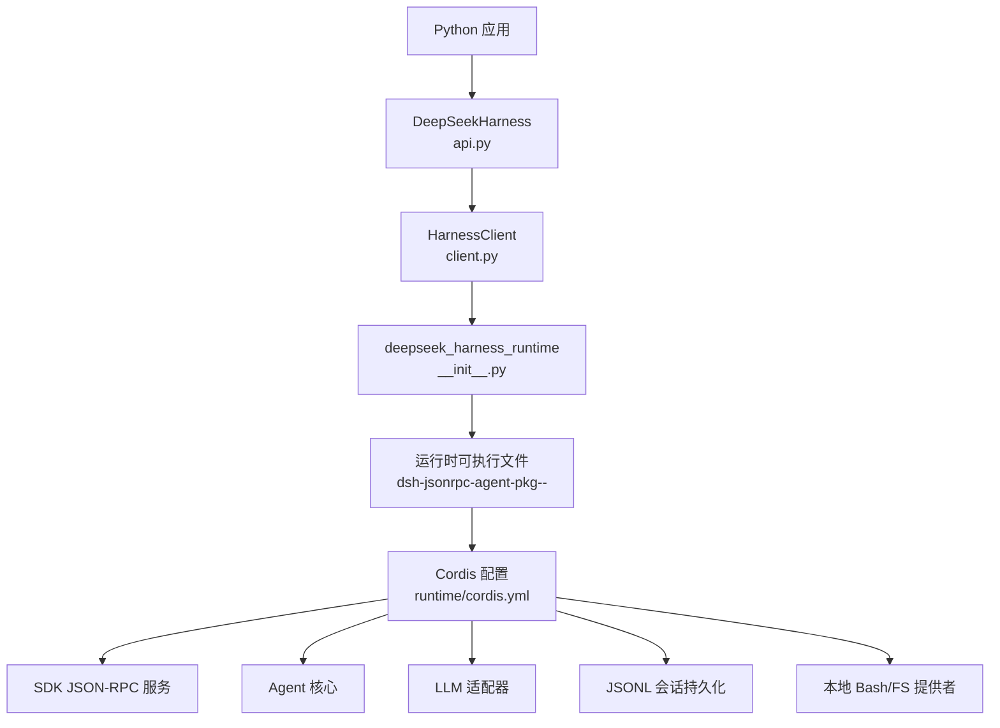
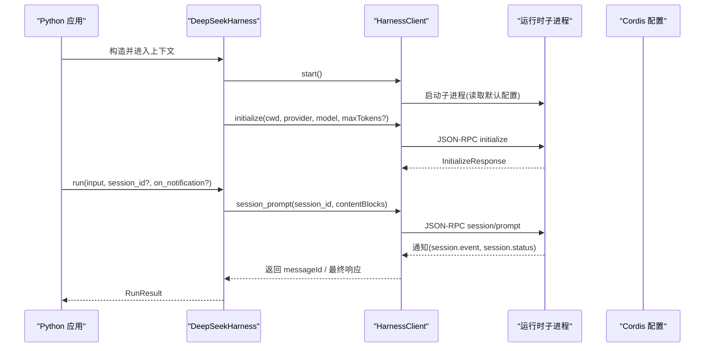
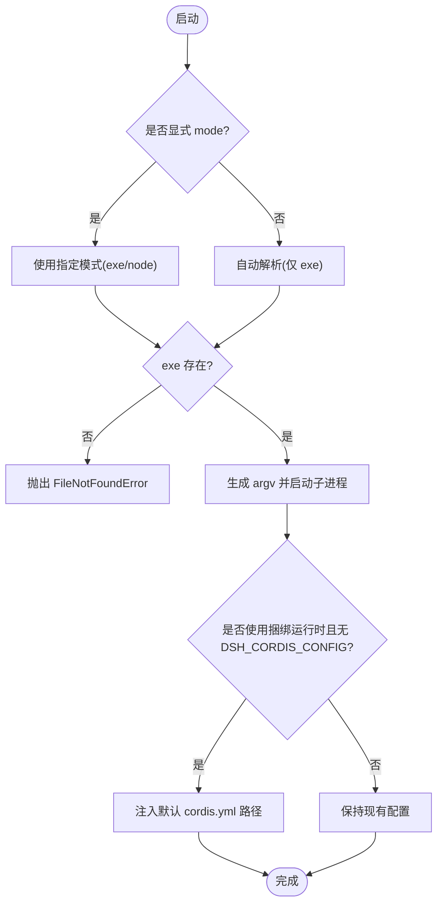
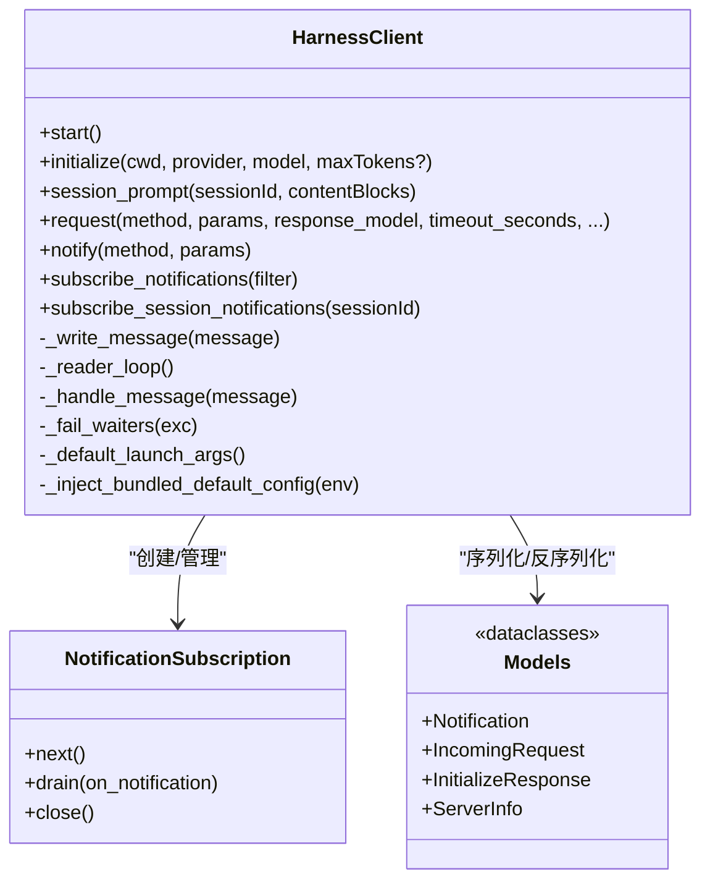
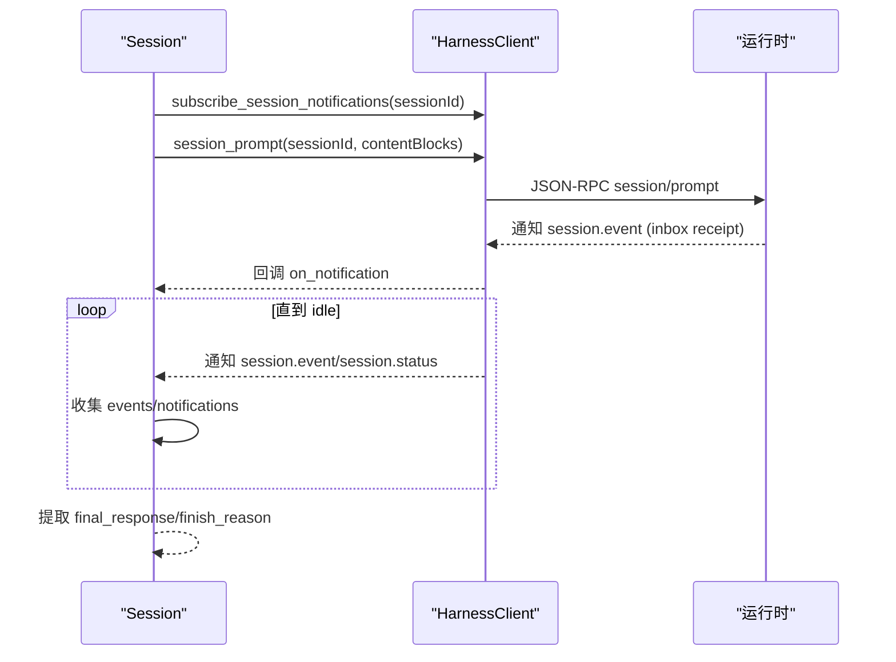
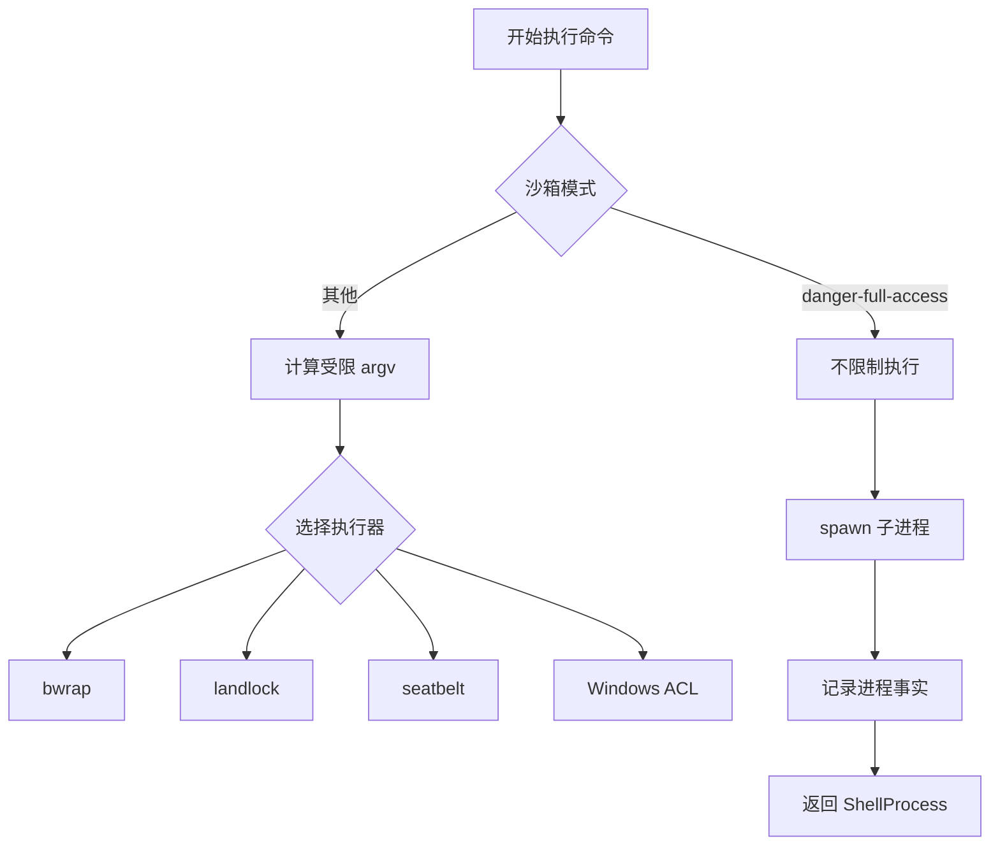
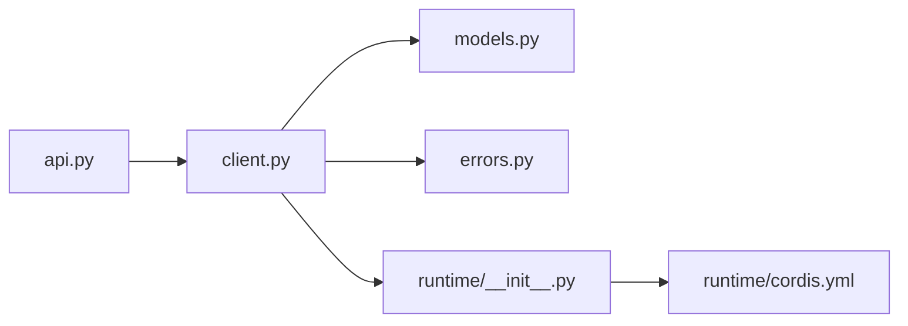

# 运行时环境

<cite>
**本文引用的文件**
- [python/sdk/src/deepseek_harness/api.py](file://python/sdk/src/deepseek_harness/api.py)
- [python/sdk/src/deepseek_harness/client.py](file://python/sdk/src/deepseek_harness/client.py)
- [python/sdk/src/deepseek_harness/models.py](file://python/sdk/src/deepseek_harness/models.py)
- [python/sdk/src/deepseek_harness/errors.py](file://python/sdk/src/deepseek_harness/errors.py)
- [python/sdk-runtime/src/deepseek_harness_runtime/__init__.py](file://python/sdk-runtime/src/deepseek_harness_runtime/__init__.py)
- [python/sdk-runtime/src/deepseek_harness_runtime/runtime/cordis.yml](file://python/sdk-runtime/src/deepseek_harness_runtime/runtime/cordis.yml)
- [python/sdk/README.md](file://python/sdk/README.md)
- [python/sdk-runtime/README.md](file://python/sdk-runtime/README.md)
- [packages/sandbox/sandbox-local/src/index.ts](file://packages/sandbox/sandbox-local/src/index.ts)
- [packages/shell/bash-sandbox/src/index.ts](file://packages/shell/bash-sandbox/src/index.ts)
- [packages/shell/pwsh-sandbox/src/index.ts](file://packages/shell/pwsh-sandbox/src/index.ts)
</cite>

## 目录
1. [简介](#简介)
2. [项目结构](#项目结构)
3. [核心组件](#核心组件)
4. [架构总览](#架构总览)
5. [详细组件分析](#详细组件分析)
6. [依赖关系分析](#依赖关系分析)
7. [性能考虑](#性能考虑)
8. [故障排查指南](#故障排查指南)
9. [结论](#结论)
10. [附录](#附录)

## 简介
本文件面向“Python SDK 运行时环境”，系统性说明 Python SDK 如何启动并管理 DeepSeek Harness 子进程、如何通过 JSON-RPC over stdio 进行进程间通信、如何解析与注入默认配置、如何在沙箱中执行命令，以及部署与环境配置要点。文档同时给出架构图、时序图、流程图和类图，帮助读者从高层到代码级理解运行时的初始化流程、数据流与安全隔离机制。

## 项目结构
Python SDK 运行时由两部分组成：
- Python SDK（客户端）：负责启动子进程、发送 JSON-RPC 请求、订阅通知、组装会话结果。
- 运行时载体包（runtime-bin）：提供平台可执行文件或开发期 Node 闭包，并通过默认 Cordis 配置装配 Agent、LLM 适配器、持久化、本地 Bash/文件系统等服务。

图表来源
- [python/sdk/src/deepseek_harness/api.py:48-124](file://python/sdk/src/deepseek_harness/api.py#L48-L124)
- [python/sdk/src/deepseek_harness/client.py:63-85](file://python/sdk/src/deepseek_harness/client.py#L63-L85)
- [python/sdk-runtime/src/deepseek_harness_runtime/__init__.py:96-116](file://python/sdk-runtime/src/deepseek_harness_runtime/__init__.py#L96-L116)
- [python/sdk-runtime/src/deepseek_harness_runtime/runtime/cordis.yml:1-50](file://python/sdk-runtime/src/deepseek_harness_runtime/runtime/cordis.yml#L1-L50)

章节来源
- [python/sdk/README.md:1-52](file://python/sdk/README.md#L1-L52)
- [python/sdk-runtime/README.md:1-30](file://python/sdk-runtime/README.md#L1-L30)

## 核心组件
- DeepSeekHarness：高层同步 API，封装子进程生命周期、会话创建与 run() 调用。
- HarnessClient：基于 stdio 的 JSON-RPC 客户端，负责启动子进程、读写消息、超时控制、通知订阅与诊断信息收集。
- deepseek_harness_runtime：定位并选择运行时载体（生产 exe 或开发 node 闭包），并提供默认配置路径注入。
- Cordis 默认配置：声明 JSON-RPC 服务、Agent 核心、LLM 适配器、持久化、本地 Bash/FS 等插件组合。

章节来源
- [python/sdk/src/deepseek_harness/api.py:13-124](file://python/sdk/src/deepseek_harness/api.py#L13-L124)
- [python/sdk/src/deepseek_harness/client.py:24-116](file://python/sdk/src/deepseek_harness/client.py#L24-L116)
- [python/sdk-runtime/src/deepseek_harness_runtime/__init__.py:46-116](file://python/sdk-runtime/src/deepseek_harness_runtime/__init__.py#L46-L116)
- [python/sdk-runtime/src/deepseek_harness_runtime/runtime/cordis.yml:1-50](file://python/sdk-runtime/src/deepseek_harness_runtime/runtime/cordis.yml#L1-L50)

## 架构总览
Python SDK 通过子进程方式运行 DeepSeek Harness，使用 JSON-RPC over stdio 进行双向通信。客户端在首次使用时懒启动子进程，维护连接直至显式关闭；运行时根据 Cordis 配置加载插件，暴露 session/prompt 等方法供客户端调用。

图表来源
- [python/sdk/src/deepseek_harness/api.py:97-124](file://python/sdk/src/deepseek_harness/api.py#L97-L124)
- [python/sdk/src/deepseek_harness/client.py:63-155](file://python/sdk/src/deepseek_harness/client.py#L63-L155)
- [python/sdk-runtime/src/deepseek_harness_runtime/runtime/cordis.yml:1-50](file://python/sdk-runtime/src/deepseek_harness_runtime/runtime/cordis.yml#L1-L50)

## 详细组件分析

### 运行时初始化与依赖管理
- 运行时载体选择：优先使用生产单文件可执行；若显式指定或环境变量为 node，则使用开发期 Node 闭包。自动模式仅选择生产 exe，避免误用源码构建产物。
- 默认配置注入：当未显式提供 cordis 配置且使用捆绑运行时，客户端会注入内置默认配置路径，确保零配置启动包含 JSON-RPC 服务、Agent、LLM 适配器、持久化与本地 Bash/FS。
- 环境变量传递：SDK 将 cwd、session_root、provider/model/max_tokens、base_url/api_key 等映射为环境变量传递给子进程，保证运行时按预期工作。

图表来源
- [python/sdk-runtime/src/deepseek_harness_runtime/__init__.py:96-116](file://python/sdk-runtime/src/deepseek_harness_runtime/__init__.py#L96-L116)
- [python/sdk/src/deepseek_harness/client.py:424-454](file://python/sdk/src/deepseek_harness/client.py#L424-L454)
- [python/sdk-runtime/src/deepseek_harness_runtime/runtime/cordis.yml:1-50](file://python/sdk-runtime/src/deepseek_harness_runtime/runtime/cordis.yml#L1-L50)

章节来源
- [python/sdk-runtime/src/deepseek_harness_runtime/__init__.py:46-116](file://python/sdk-runtime/src/deepseek_harness_runtime/__init__.py#L46-L116)
- [python/sdk/src/deepseek_harness/client.py:63-85](file://python/sdk/src/deepseek_harness/client.py#L63-L85)
- [python/sdk/src/deepseek_harness/api.py:56-84](file://python/sdk/src/deepseek_harness/api.py#L56-L84)

### 进程间通信与数据序列化
- 传输协议：JSON-RPC over stdio，每行一条 JSON 消息。
- 消息类型：请求（含 id）、响应（result/error）、通知（method）。
- 客户端实现：
  - 写端：串行写入，失败时包装为 TransportClosedError。
  - 读端：后台线程逐行解析，分发至响应等待队列、通知订阅者或入站请求队列。
  - 超时：请求级超时，结合诊断信息（退出码、stderr 尾部）提升可观测性。
  - 通知过滤：支持按会话树过滤（包括子代理父子关系）。
- 数据模型：Notification、IncomingRequest、InitializeResponse、ServerInfo 等用于结构化描述消息与响应。

图表来源
- [python/sdk/src/deepseek_harness/client.py:37-214](file://python/sdk/src/deepseek_harness/client.py#L37-L214)
- [python/sdk/src/deepseek_harness/models.py:13-33](file://python/sdk/src/deepseek_harness/models.py#L13-L33)

章节来源
- [python/sdk/src/deepseek_harness/client.py:157-214](file://python/sdk/src/deepseek_harness/client.py#L157-L214)
- [python/sdk/src/deepseek_harness/models.py:1-33](file://python/sdk/src/deepseek_harness/models.py#L1-L33)

### 会话与事件处理流程
- Session.run：
  - 标准化输入为内容块列表。
  - 订阅会话通知，发送 session/prompt。
  - 等待收件箱回执后继续消费通知，直到根会话空闲。
  - 从事件中提取最终回复与结束原因。
- 通知归属：通过记录 subagent.started/finished 建立父子会话关系，确保只接收当前会话及其后代的通知。

图表来源
- [python/sdk/src/deepseek_harness/api.py:127-183](file://python/sdk/src/deepseek_harness/api.py#L127-L183)
- [python/sdk/src/deepseek_harness/client.py:460-504](file://python/sdk/src/deepseek_harness/client.py#L460-L504)

章节来源
- [python/sdk/src/deepseek_harness/api.py:127-183](file://python/sdk/src/deepseek_harness/api.py#L127-L183)

### 沙箱环境与安全隔离
- 沙箱策略：Shell 执行层支持多种模式，默认非危险模式会启用受限执行；危险全开放模式直接放行。
- 执行器选择：根据平台与策略选择 bwrap、landlock、seatbelt 或 Windows ACL 作为具体执行器，并附加相应配置文件参数。
- 进程事实：每次启动记录执行模式、强制策略、拒绝签名、执行器程序与工作目录，便于诊断与审计。

图表来源
- [packages/shell/bash-sandbox/src/index.ts:116-144](file://packages/shell/bash-sandbox/src/index.ts#L116-L144)
- [packages/shell/pwsh-sandbox/src/index.ts:124-150](file://packages/shell/pwsh-sandbox/src/index.ts#L124-L150)
- [packages/sandbox/sandbox-local/src/index.ts:335-344](file://packages/sandbox/sandbox-local/src/index.ts#L335-L344)

章节来源
- [packages/shell/bash-sandbox/src/index.ts:51-144](file://packages/shell/bash-sandbox/src/index.ts#L51-L144)
- [packages/shell/pwsh-sandbox/src/index.ts:59-150](file://packages/shell/pwsh-sandbox/src/index.ts#L59-L150)
- [packages/sandbox/sandbox-local/src/index.ts:335-344](file://packages/sandbox/sandbox-local/src/index.ts#L335-L344)

### 部署指南与环境配置要求
- 安装与运行：
  - 安装 Python SDK 会自动安装同版本运行时二进制包。
  - 零配置启动：无需显式传入 cordis 路径，客户端会注入默认配置。
  - 自定义配置：可通过 cordis 参数或环境变量 DSH_CORDIS_CONFIG 指定。
- 关键环境变量：
  - DEEPSEEK_API_KEY、DEEPSEEK_BASE_URL：模型凭据与端点。
  - DSH_SESSION_ROOT：会话持久化根目录。
  - DSH_CWD：工作目录（Bash/FS 提供者使用）。
  - DSH_RUNTIME_MODE：选择运行时模式（exe/node）。
- 平台与可执行文件：
  - 生产模式使用单文件可执行，macOS 附带 spawn helper。
  - 开发模式需要系统 Node >= 22.19。

章节来源
- [python/sdk/README.md:1-52](file://python/sdk/README.md#L1-L52)
- [python/sdk-runtime/README.md:1-30](file://python/sdk-runtime/README.md#L1-L30)
- [python/sdk-runtime/src/deepseek_harness_runtime/runtime/cordis.yml:1-50](file://python/sdk-runtime/src/deepseek_harness_runtime/runtime/cordis.yml#L1-L50)

### 性能监控与诊断工具
- 诊断信息：
  - 客户端在超时或传输关闭时收集子进程退出码与 stderr 尾部，附加到错误信息中。
  - 支持在请求循环中定期排空通知队列，避免阻塞。
- 建议实践：
  - 合理设置 request_timeout_seconds 与 shutdown_timeout_seconds。
  - 使用 on_notification 回调采集 session.event 以追踪中间状态。
  - 检查 DSH_SESSION_ROOT 下的 JSONL 会话文件进行离线分析。

章节来源
- [python/sdk/src/deepseek_harness/client.py:258-296](file://python/sdk/src/deepseek_harness/client.py#L258-L296)
- [python/sdk/src/deepseek_harness/client.py:399-422](file://python/sdk/src/deepseek_harness/client.py#L399-L422)

### 与宿主环境的集成与扩展点
- 环境变量继承：子进程默认继承宿主环境变量，允许外部注入凭据与端点。
- 配置扩展：通过自定义 Cordis 配置挂载新的 LLM 适配器、持久化后端、工具与服务。
- 动态插件：运行时支持动态插件注册与生命周期管理，可在会话内定义、运行与停止插件。

章节来源
- [python/sdk/src/deepseek_harness/api.py:13-36](file://python/sdk/src/deepseek_harness/api.py#L13-L36)
- [python/sdk-runtime/src/deepseek_harness_runtime/runtime/cordis.yml:1-50](file://python/sdk-runtime/src/deepseek_harness_runtime/runtime/cordis.yml#L1-L50)

## 依赖关系分析
- 模块耦合：
  - api.py 依赖 client.py 与 models.py，提供高层 API。
  - client.py 依赖 errors.py 与 models.py，实现低层通信。
  - runtime __init__.py 提供运行时载体定位与默认配置注入。
- 外部依赖：
  - 子进程：Node 可执行或 Node 解释器。
  - 沙箱执行器：bwrap、landlock、seatbelt、Windows ACL。

图表来源
- [python/sdk/src/deepseek_harness/api.py:1-11](file://python/sdk/src/deepseek_harness/api.py#L1-L11)
- [python/sdk/src/deepseek_harness/client.py:1-19](file://python/sdk/src/deepseek_harness/client.py#L1-L19)
- [python/sdk-runtime/src/deepseek_harness_runtime/__init__.py:1-20](file://python/sdk-runtime/src/deepseek_harness_runtime/__init__.py#L1-L20)
- [python/sdk-runtime/src/deepseek_harness_runtime/runtime/cordis.yml:1-50](file://python/sdk-runtime/src/deepseek_harness_runtime/runtime/cordis.yml#L1-L50)

章节来源
- [python/sdk/src/deepseek_harness/api.py:1-11](file://python/sdk/src/deepseek_harness/api.py#L1-L11)
- [python/sdk/src/deepseek_harness/client.py:1-19](file://python/sdk/src/deepseek_harness/client.py#L1-L19)

## 性能考虑
- 懒启动与复用：DeepSeekHarness 懒启动子进程并在实例生命周期内复用，减少冷启动开销。
- 超时与资源释放：请求级超时防止长时间阻塞；关闭时先优雅 shutdown，再终止进程，避免僵尸进程。
- 通知批处理：在请求循环中定期 drain 通知队列，降低延迟。
- 沙箱开销：受限执行模式可能引入额外开销，应根据任务敏感度权衡。

[本节为通用指导，不直接分析具体文件]

## 故障排查指南
- 常见错误：
  - 运行时缺失：FileNotFoundError，需安装对应平台 wheel 或构建可执行文件。
  - 传输关闭：TransportClosedError，检查子进程是否异常退出，查看 stderr 尾部。
  - JSON-RPC 错误：JsonRpcError，携带 code/message/data，定位服务端问题。
  - 协议违规：SdkProtocolError，如 turn/end 缺少 reason.kind。
- 诊断步骤：
  - 检查 DSH_CORDIS_CONFIG 是否正确指向配置。
  - 确认 DEEPSEEK_API_KEY 与 DEEPSEEK_BASE_URL 已正确设置。
  - 查看 DSH_SESSION_ROOT 下会话文件，分析事件序列。
  - 调整 request_timeout_seconds 与 shutdown_timeout_seconds 观察行为变化。

章节来源
- [python/sdk/src/deepseek_harness/errors.py:4-24](file://python/sdk/src/deepseek_harness/errors.py#L4-L24)
- [python/sdk/src/deepseek_harness/client.py:399-422](file://python/sdk/src/deepseek_harness/client.py#L399-L422)
- [python/sdk/src/deepseek_harness/api.py:225-243](file://python/sdk/src/deepseek_harness/api.py#L225-L243)

## 结论
Python SDK 运行时通过清晰的职责划分实现了高内聚、低耦合的架构：Python 侧专注进程管理与协议封装，运行时侧专注插件装配与服务暴露。借助默认配置与环境变量注入，用户可实现零配置快速启动，也可通过自定义 Cordis 配置灵活扩展能力。沙箱机制保障执行安全，诊断工具提升可观测性。整体设计兼顾易用性与可扩展性，适合在生产环境中稳定运行。

[本节为总结性内容，不直接分析具体文件]

## 附录
- 关键接口速查：
  - DeepSeekHarness.start/close/run
  - HarnessClient.initialize/session_prompt/request
  - resolve_bundled_launch_args/bundled_default_config_path
- 环境变量清单：
  - DEEPSEEK_API_KEY、DEEPSEEK_BASE_URL、DSH_SESSION_ROOT、DSH_CWD、DSH_CORDIS_CONFIG、DSH_RUNTIME_MODE

[本节为参考信息，不直接分析具体文件]