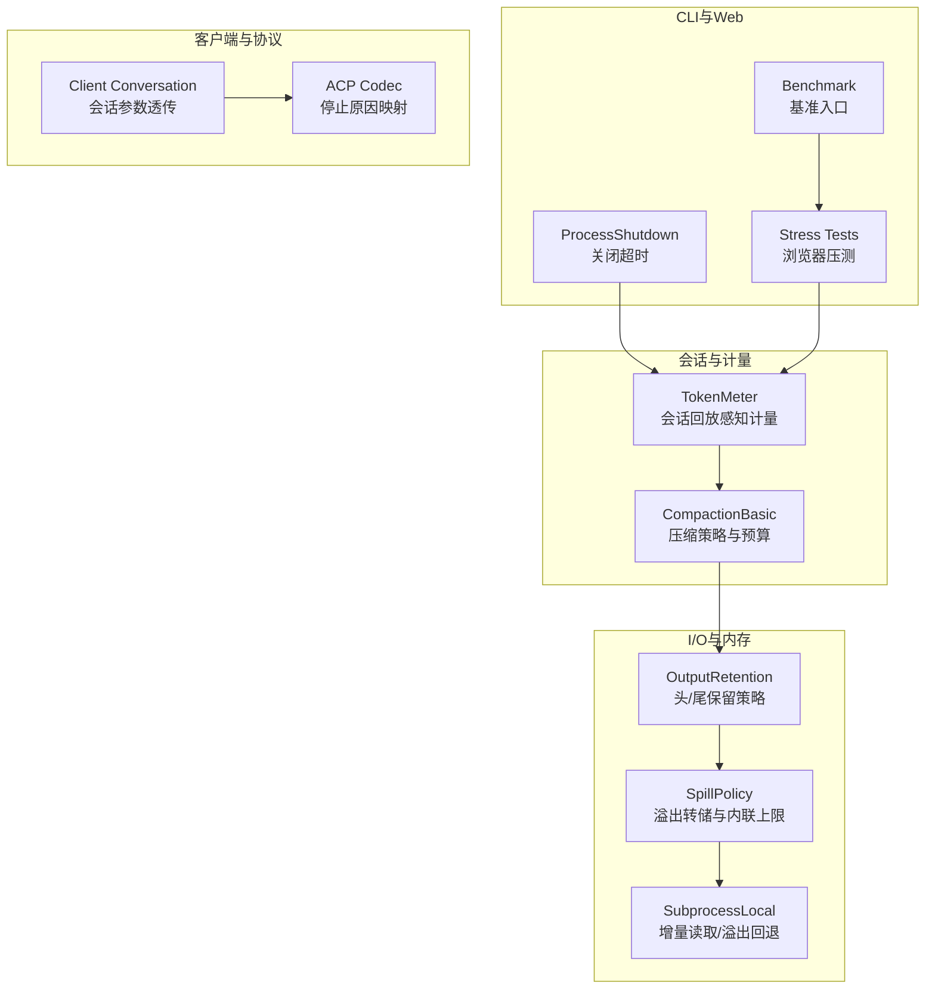
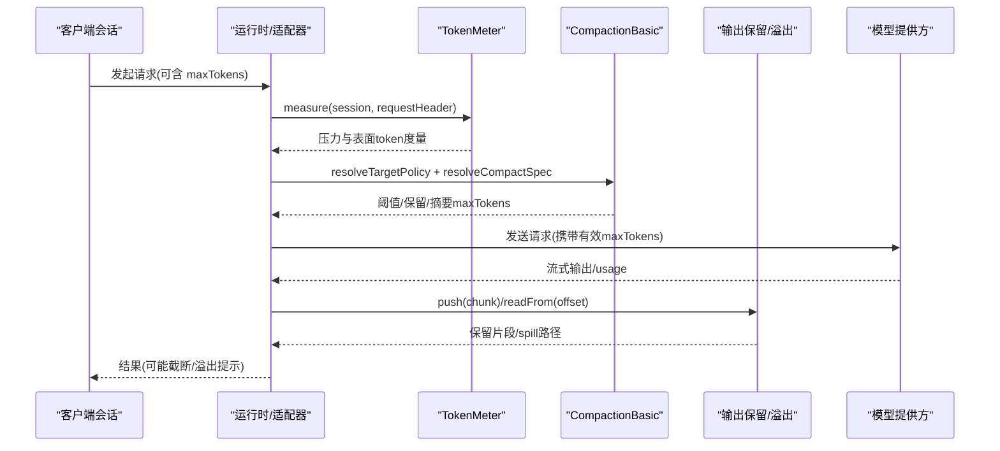
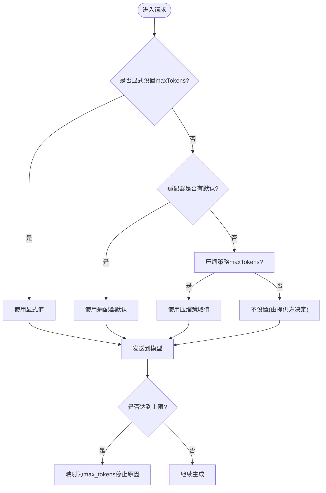
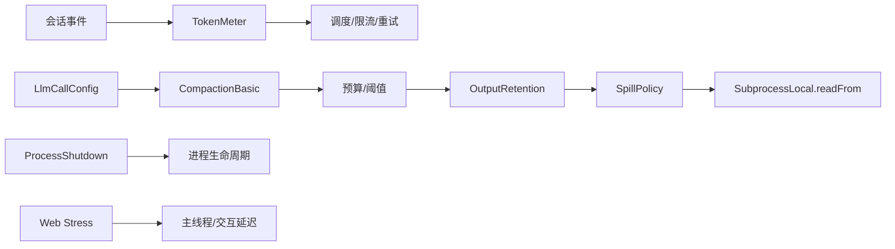

# 性能配置

<cite>
**本文引用的文件**
- [BENCHMARK.md](file://BENCHMARK.md)
- [apps/cli/src/process-shutdown.ts](file://apps/cli/src/process-shutdown.ts)
- [packages/compaction/compaction-basic/src/config.ts](file://packages/compaction/compaction-basic/src/config.ts)
- [packages/llm/token-meter/src/index.ts](file://packages/llm/token-meter/src/index.ts)
- [packages/util/output-retention/src/index.ts](file://packages/util/output-retention/src/index.ts)
- [packages/spill/spill-policy/README.zh.md](file://packages/spill/spill-policy/README.zh.md)
- [packages/subprocess/subprocess-local/src/spawn.ts](file://packages/subprocess/subprocess-local/src/spawn.ts)
- [apps/web/stress-tests/reasoning-chunks.stress.ts](file://apps/web/stress-tests/reasoning-chunks.stress.ts)
- [vitest.web-stress.config.ts](file://vitest.web-stress.config.ts)
- [examples/jsonrpc-agent/tests/keyless-smoke.e2e.ts](file://examples/jsonrpc-agent/tests/keyless-smoke.e2e.ts)
- [examples/headless-agent/tests/headless.snapshot.ts](file://examples/headless-agent/tests/headless.snapshot.ts)
- [packages/acp/acp/src/codec.ts](file://packages/acp/acp/src/codec.ts)
- [packages/client/runtime/src/client/sessions/conversation.ts](file://packages/client/runtime/src/client/sessions/conversation.ts)
</cite>

## 目录
1. [简介](#简介)
2. [项目结构](#项目结构)
3. [核心组件](#核心组件)
4. [架构总览](#架构总览)
5. [详细组件分析](#详细组件分析)
6. [依赖关系分析](#依赖关系分析)
7. [性能考量](#性能考量)
8. [故障排查指南](#故障排查指南)
9. [结论](#结论)
10. [附录](#附录)

## 简介
本文件聚焦于 deepseek-harness 的性能配置与调优，围绕以下目标展开：
- 详细说明 max_tokens 参数的配置来源、生效范围与优化策略。
- 解释请求超时与关闭超时的调优方法。
- 文档化并发请求、消息队列与内存管理的配置选项。
- 提供高并发、低延迟与大文本处理等场景的调优建议。
- 说明性能监控指标与瓶颈识别方法。
- 给出性能测试工具与基准测试指南。
- 总结最佳实践与常见问题解决方案。

## 项目结构
与性能相关的关键模块分布在如下位置：
- 令牌计量与上下文压力：token-meter（会话回放感知、表面 token 统计、用量基线）。
- 压缩与上下文预算：compaction-basic（阈值、保留比例、摘要模型、maxTokens）。
- 输出保留与溢出控制：output-retention、spill-policy（头尾保留、溢出转储、内联上限）。
- 子进程与 I/O 窗口：subprocess-local（增量读取、溢出回退）。
- CLI 关闭超时：process-shutdown（优雅退出等待时间）。
- Web 压测与基准：stress-tests、BENCHMARK.md、Vitest 配置。
- 客户端会话与 maxTokens 透传：client runtime conversation。
- ACP 停止原因映射：acp codec（max_tokens 到 stop reason）。

图表来源
- [packages/llm/token-meter/src/index.ts:74-147](file://packages/llm/token-meter/src/index.ts#L74-L147)
- [packages/compaction/compaction-basic/src/config.ts:67-167](file://packages/compaction/compaction-basic/src/config.ts#L67-L167)
- [packages/util/output-retention/src/index.ts:256-298](file://packages/util/output-retention/src/index.ts#L256-L298)
- [packages/spill/spill-policy/README.zh.md:15-29](file://packages/spill/spill-policy/README.zh.md#L15-L29)
- [packages/subprocess/subprocess-local/src/spawn.ts:199-218](file://packages/subprocess/subprocess-local/src/spawn.ts#L199-L218)
- [apps/cli/src/process-shutdown.ts:4-54](file://apps/cli/src/process-shutdown.ts#L4-L54)
- [apps/web/stress-tests/reasoning-chunks.stress.ts:46-153](file://apps/web/stress-tests/reasoning-chunks.stress.ts#L46-L153)
- [BENCHMARK.md:1-4](file://BENCHMARK.md#L1-L4)
- [packages/client/runtime/src/client/sessions/conversation.ts:32-32](file://packages/client/runtime/src/client/sessions/conversation.ts#L32-L32)
- [packages/acp/acp/src/codec.ts:19-19](file://packages/acp/acp/src/codec.ts#L19-L19)

章节来源
- [packages/llm/token-meter/src/index.ts:74-147](file://packages/llm/token-meter/src/index.ts#L74-L147)
- [packages/compaction/compaction-basic/src/config.ts:67-167](file://packages/compaction/compaction-basic/src/config.ts#L67-L167)
- [packages/util/output-retention/src/index.ts:256-298](file://packages/util/output-retention/src/index.ts#L256-L298)
- [packages/spill/spill-policy/README.zh.md:15-29](file://packages/spill/spill-policy/README.zh.md#L15-L29)
- [packages/subprocess/subprocess-local/src/spawn.ts:199-218](file://packages/subprocess/subprocess-local/src/spawn.ts#L199-L218)
- [apps/cli/src/process-shutdown.ts:4-54](file://apps/cli/src/process-shutdown.ts#L4-L54)
- [apps/web/stress-tests/reasoning-chunks.stress.ts:46-153](file://apps/web/stress-tests/reasoning-chunks.stress.ts#L46-L153)
- [BENCHMARK.md:1-4](file://BENCHMARK.md#L1-L4)
- [packages/client/runtime/src/client/sessions/conversation.ts:32-32](file://packages/client/runtime/src/client/sessions/conversation.ts#L32-L32)
- [packages/acp/acp/src/codec.ts:19-19](file://packages/acp/acp/src/codec.ts#L19-L19)

## 核心组件
- TokenMeter：基于会话事件回放，计算请求压力与“表面”token 总量，支持 provider usage 锚点与估计基线，返回不可变测量结果。
- CompactionBasic：按模型路由解析压缩策略，包含阈值比例、保留策略、摘要模型、maxTokens、重试次数等，并校验一致性。
- OutputRetention：对长输出进行头/尾保留，限制内联字节预算，避免大对象阻塞主线程或占用过多内存。
- SpillPolicy：当输出超过内联预算时，将完整内容落盘为 spill 文件，并在结果中返回预览与路径提示。
- SubprocessLocal：以增量方式读取子进程输出，支持从指定字节偏移恢复；当超出内存窗口时标记 lossy 并从 spill 文件恢复。
- ProcessShutdown：定义 CLI 进程的优雅关闭超时，确保在强制退出前完成必要清理。
- Web Stress Tests：通过 Playwright 驱动真实应用，注入大量推理分片，验证主线程延迟与交互响应性。
- Benchmark：提供 Python SDK 与 jsonrpc-agent 最小变体的基准运行指引。

章节来源
- [packages/llm/token-meter/src/index.ts:74-147](file://packages/llm/token-meter/src/index.ts#L74-L147)
- [packages/compaction/compaction-basic/src/config.ts:67-167](file://packages/compaction/compaction-basic/src/config.ts#L67-L167)
- [packages/util/output-retention/src/index.ts:256-298](file://packages/util/output-retention/src/index.ts#L256-L298)
- [packages/spill/spill-policy/README.zh.md:15-29](file://packages/spill/spill-policy/README.zh.md#L15-L29)
- [packages/subprocess/subprocess-local/src/spawn.ts:199-218](file://packages/subprocess/subprocess-local/src/spawn.ts#L199-L218)
- [apps/cli/src/process-shutdown.ts:4-54](file://apps/cli/src/process-shutdown.ts#L4-L54)
- [apps/web/stress-tests/reasoning-chunks.stress.ts:46-153](file://apps/web/stress-tests/reasoning-chunks.stress.ts#L46-L153)
- [BENCHMARK.md:1-4](file://BENCHMARK.md#L1-L4)

## 架构总览
下图展示了从客户端会话到模型调用、再到输出保留与溢出的关键路径，以及 token 计量如何贯穿会话回放。

图表来源
- [packages/llm/token-meter/src/index.ts:116-147](file://packages/llm/token-meter/src/index.ts#L116-L147)
- [packages/compaction/compaction-basic/src/config.ts:105-167](file://packages/compaction/compaction-basic/src/config.ts#L105-L167)
- [packages/util/output-retention/src/index.ts:287-298](file://packages/util/output-retention/src/index.ts#L287-L298)
- [packages/subprocess/subprocess-local/src/spawn.ts:207-218](file://packages/subprocess/subprocess-local/src/spawn.ts#L207-L218)

## 详细组件分析

### max_tokens 参数：配置来源、生效范围与优化策略
- 配置来源
  - 客户端会话层可传入 maxTokens（例如 client runtime 会话参数）。
  - 压缩策略中的 maxTokens 用于摘要生成或压缩步骤的输出上限。
  - 测试与示例中可见向模型请求传递 maxTokens（如 jsonrpc-agent 测试、headless 快照期望值）。
- 生效范围
  - 适配器/运行时会在最终边界将默认或显式值物化为 LlmCallConfig.maxTokens。
  - 若未显式设置，可由适配器默认或压缩策略提供的 maxTokens 作为请求默认。
- 优化策略
  - 在高并发场景下，适当降低 maxTokens 可减少单次请求的内存峰值与网络负载，提升吞吐。
  - 在大文本处理场景中，结合 output-retention 与 spill-policy，将超长输出分段保留或落盘，避免主线程卡顿。
  - 使用 compaction 的 thresholdRatio/retainRatio 控制何时触发压缩，从而间接影响后续请求的上下文大小与 maxTokens 需求。
- 停止原因映射
  - 当达到输出上限时，ACP 会将内部状态映射为 max_tokens 停止原因，便于上层统一处理。

图表来源
- [packages/client/runtime/src/client/sessions/conversation.ts:32-32](file://packages/client/runtime/src/client/sessions/conversation.ts#L32-L32)
- [packages/compaction/compaction-basic/src/config.ts:86-96](file://packages/compaction/compaction-basic/src/config.ts#L86-L96)
- [examples/jsonrpc-agent/tests/keyless-smoke.e2e.ts:108-147](file://examples/jsonrpc-agent/tests/keyless-smoke.e2e.ts#L108-L147)
- [examples/headless-agent/tests/headless.snapshot.ts:543-562](file://examples/headless-agent/tests/headless.snapshot.ts#L543-L562)
- [packages/acp/acp/src/codec.ts:19-19](file://packages/acp/acp/src/codec.ts#L19-L19)

章节来源
- [packages/client/runtime/src/client/sessions/conversation.ts:32-32](file://packages/client/runtime/src/client/sessions/conversation.ts#L32-L32)
- [packages/compaction/compaction-basic/src/config.ts:86-96](file://packages/compaction/compaction-basic/src/config.ts#L86-L96)
- [examples/jsonrpc-agent/tests/keyless-smoke.e2e.ts:108-147](file://examples/jsonrpc-agent/tests/keyless-smoke.e2e.ts#L108-L147)
- [examples/headless-agent/tests/headless.snapshot.ts:543-562](file://examples/headless-agent/tests/headless.snapshot.ts#L543-L562)
- [packages/acp/acp/src/codec.ts:19-19](file://packages/acp/acp/src/codec.ts#L19-L19)

### 请求超时与关闭超时的调优
- 请求超时
  - 在工具执行与调度管线中，可通过 around-dispatch 包装器实现请求级超时控制（注册顺序决定覆盖范围）。
  - 对于长时间运行的任务，建议结合重试与熔断策略，避免雪崩。
- 关闭超时
  - CLI 进程定义了优雅关闭等待时间（默认毫秒级），可在测试或部署中替换为更合适的值，确保资源释放与日志落盘。
- 调优建议
  - 根据业务 SLA 调整超时阈值，区分冷启动与热路径。
  - 在 CI/CD 中为端到端测试设置合理的超时，避免误报。

章节来源
- [apps/cli/src/process-shutdown.ts:4-54](file://apps/cli/src/process-shutdown.ts#L4-L54)

### 并发请求、消息队列与内存管理
- 并发请求
  - 通过会话回放与计量服务，可在不阻塞的情况下并行评估多个请求的压力与 token 消耗。
  - 在 Web 端，使用分片与节流（如每间隔推送若干 chunk）维持主线程响应性。
- 消息队列
  - 将重型任务（如长文本压缩、摘要生成）放入后台队列，避免阻塞用户交互。
  - 队列消费端应遵循 backpressure，防止内存膨胀。
- 内存管理
  - 使用 output-retention 限制内联输出的头/尾字节，避免一次性加载超大字符串。
  - 使用 spill-policy 将超出预算的内容转储到磁盘，并通过 readFrom 按需读取，减少常驻内存。
  - subprocess-local 的增量读取支持从指定字节偏移恢复，适合大输出流的断点续读。

章节来源
- [packages/util/output-retention/src/index.ts:256-298](file://packages/util/output-retention/src/index.ts#L256-L298)
- [packages/spill/spill-policy/README.zh.md:15-29](file://packages/spill/spill-policy/README.zh.md#L15-L29)
- [packages/subprocess/subprocess-local/src/spawn.ts:199-218](file://packages/subprocess/subprocess-local/src/spawn.ts#L199-L218)
- [apps/web/stress-tests/reasoning-chunks.stress.ts:46-153](file://apps/web/stress-tests/reasoning-chunks.stress.ts#L46-L153)

### 不同场景下的性能调优建议
- 高并发
  - 降低单请求 maxTokens，提高吞吐；启用压缩策略，及时释放上下文。
  - 使用队列与背压，避免瞬时峰值导致 OOM。
  - 合理设置超时与重试，防止级联失败。
- 低延迟
  - 优先命中缓存与复用连接；减少不必要的序列化与反序列化。
  - 使用 output-retention 仅保留必要的前缀/后缀，缩短渲染与传输时间。
  - 在 Web 端采用分片推送与节流，保持 UI 流畅。
- 大文本处理
  - 启用 spill-policy，将大输出落盘并按需读取。
  - 调整压缩阈值与保留比例，平衡上下文质量与成本。
  - 使用 TokenMeter 监控表面 token 与用量基线，识别异常增长。

[本节为通用指导，不直接分析具体文件]

### 性能监控指标与瓶颈识别
- 关键指标
  - 表面 token 数、总 token 数、用量基线（provider usage 或估计）。
  - 压缩触发频率、摘要生成耗时、溢出转储次数。
  - 主线程延迟、交互响应延迟、流式分片间隔。
- 识别方法
  - 通过 TokenMeter.measure 获取当前会话的压力与表面 token，定位异常会话。
  - 在 Web 压测中记录最大主线程延迟与交互延迟，判断渲染瓶颈。
  - 观察 spill 路径与 lossy 标志，确认是否存在频繁溢出与回退。

章节来源
- [packages/llm/token-meter/src/index.ts:116-147](file://packages/llm/token-meter/src/index.ts#L116-L147)
- [apps/web/stress-tests/reasoning-chunks.stress.ts:113-147](file://apps/web/stress-tests/reasoning-chunks.stress.ts#L113-L147)
- [packages/subprocess/subprocess-local/src/spawn.ts:207-218](file://packages/subprocess/subprocess-local/src/spawn.ts#L207-L218)

### 性能测试工具与基准测试指南
- 基准测试
  - 使用 Python SDK 与 jsonrpc-agent 最小变体进行独立基准任务，隔离工作区与会话 ID。
- Web 压测
  - 使用 vitest.web-stress.config 启用浏览器压测通道，注入大量推理分片，验证响应性。
  - 关注主线程延迟与交互延迟，确保在预算范围内。
- 测试配置
  - 调整 testTimeout 与 hookTimeout，适应不同硬件与调度差异。
  - 禁用文件并行，保证压测稳定性。

章节来源
- [BENCHMARK.md:1-4](file://BENCHMARK.md#L1-L4)
- [vitest.web-stress.config.ts:5-14](file://vitest.web-stress.config.ts#L5-L14)
- [apps/web/stress-tests/reasoning-chunks.stress.ts:46-153](file://apps/web/stress-tests/reasoning-chunks.stress.ts#L46-L153)

## 依赖关系分析
- TokenMeter 依赖会话事件回放与估算逻辑，产出不可变测量结果，供上层决策。
- CompactionBasic 依赖 LlmCallConfig 的目标路由信息，解析出阈值、保留与摘要策略。
- OutputRetention 与 SpillPolicy 协同工作，前者负责内存中的头尾保留，后者负责溢出落盘。
- SubprocessLocal 提供增量读取能力，配合 spill 文件实现大输出流的可靠恢复。
- CLI 关闭超时与 Web 压测分别作用于进程生命周期与应用层响应性。

图表来源
- [packages/llm/token-meter/src/index.ts:116-147](file://packages/llm/token-meter/src/index.ts#L116-L147)
- [packages/compaction/compaction-basic/src/config.ts:105-167](file://packages/compaction/compaction-basic/src/config.ts#L105-L167)
- [packages/util/output-retention/src/index.ts:287-298](file://packages/util/output-retention/src/index.ts#L287-L298)
- [packages/spill/spill-policy/README.zh.md:15-29](file://packages/spill/spill-policy/README.zh.md#L15-L29)
- [packages/subprocess/subprocess-local/src/spawn.ts:207-218](file://packages/subprocess/subprocess-local/src/spawn.ts#L207-L218)
- [apps/cli/src/process-shutdown.ts:4-54](file://apps/cli/src/process-shutdown.ts#L4-L54)
- [apps/web/stress-tests/reasoning-chunks.stress.ts:113-147](file://apps/web/stress-tests/reasoning-chunks.stress.ts#L113-L147)

章节来源
- [packages/llm/token-meter/src/index.ts:116-147](file://packages/llm/token-meter/src/index.ts#L116-L147)
- [packages/compaction/compaction-basic/src/config.ts:105-167](file://packages/compaction/compaction-basic/src/config.ts#L105-L167)
- [packages/util/output-retention/src/index.ts:287-298](file://packages/util/output-retention/src/index.ts#L287-L298)
- [packages/spill/spill-policy/README.zh.md:15-29](file://packages/spill/spill-policy/README.zh.md#L15-L29)
- [packages/subprocess/subprocess-local/src/spawn.ts:207-218](file://packages/subprocess/subprocess-local/src/spawn.ts#L207-L218)
- [apps/cli/src/process-shutdown.ts:4-54](file://apps/cli/src/process-shutdown.ts#L4-L54)
- [apps/web/stress-tests/reasoning-chunks.stress.ts:113-147](file://apps/web/stress-tests/reasoning-chunks.stress.ts#L113-L147)

## 性能考量
- 在高并发环境下，优先控制单请求的 maxTokens 与上下文大小，避免内存尖峰。
- 对长输出采用 head/tail 保留与 spill 落盘，减少主线程负担。
- 使用 TokenMeter 持续监控表面 token 与用量基线，及时发现异常增长。
- 在 Web 端通过分片与节流保持 UI 响应性，避免渲染阻塞。
- 合理设置 CLI 关闭超时，确保资源释放与日志完整性。

[本节为通用指导，不直接分析具体文件]

## 故障排查指南
- 现象：请求被提前终止且停止原因为 max_tokens
  - 检查客户端会话是否设置了过小的 maxTokens。
  - 查看压缩策略的 maxTokens 是否过低。
  - 确认 ACP 停止原因映射是否正确。
- 现象：主线程延迟过高
  - 检查 Web 压测报告中的最大主线程延迟与交互延迟。
  - 调整分片大小与推送间隔，降低单次渲染压力。
- 现象：频繁溢出与 lossy 读取
  - 调整 output-retention 的预算与 spill-policy 的内联上限。
  - 优化下游消费逻辑，避免重复读取与不必要的全量加载。

章节来源
- [packages/acp/acp/src/codec.ts:19-19](file://packages/acp/acp/src/codec.ts#L19-L19)
- [apps/web/stress-tests/reasoning-chunks.stress.ts:113-147](file://apps/web/stress-tests/reasoning-chunks.stress.ts#L113-L147)
- [packages/util/output-retention/src/index.ts:287-298](file://packages/util/output-retention/src/index.ts#L287-L298)
- [packages/subprocess/subprocess-local/src/spawn.ts:207-218](file://packages/subprocess/subprocess-local/src/spawn.ts#L207-L218)

## 结论
- max_tokens 的配置应结合客户端、适配器默认与压缩策略综合决策，避免单一维度调参。
- 通过 TokenMeter 与压缩策略，可实现对上下文压力与 token 成本的精细化控制。
- 输出保留与溢出机制是处理大文本的关键，能有效降低内存与主线程压力。
- Web 压测与基准测试为性能回归与容量规划提供了可复现的证据。
- 建议在部署前进行多场景压测，并根据监控指标持续迭代优化。

[本节为总结，不直接分析具体文件]

## 附录
- 基准测试入口与说明参见 BENCHMARK.md。
- Web 压测配置位于 vitest.web-stress.config.ts，可按需调整超时与并行度。
- 客户端会话参数透传与停止原因映射分别参考 client runtime 与 acp codec。

章节来源
- [BENCHMARK.md:1-4](file://BENCHMARK.md#L1-L4)
- [vitest.web-stress.config.ts:5-14](file://vitest.web-stress.config.ts#L5-L14)
- [packages/client/runtime/src/client/sessions/conversation.ts:32-32](file://packages/client/runtime/src/client/sessions/conversation.ts#L32-L32)
- [packages/acp/acp/src/codec.ts:19-19](file://packages/acp/acp/src/codec.ts#L19-L19)