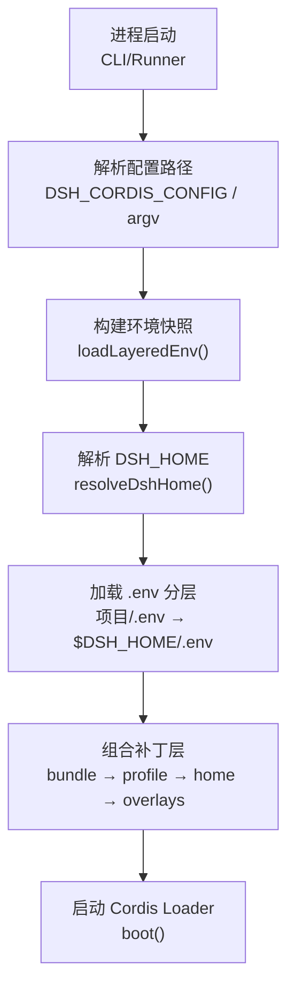
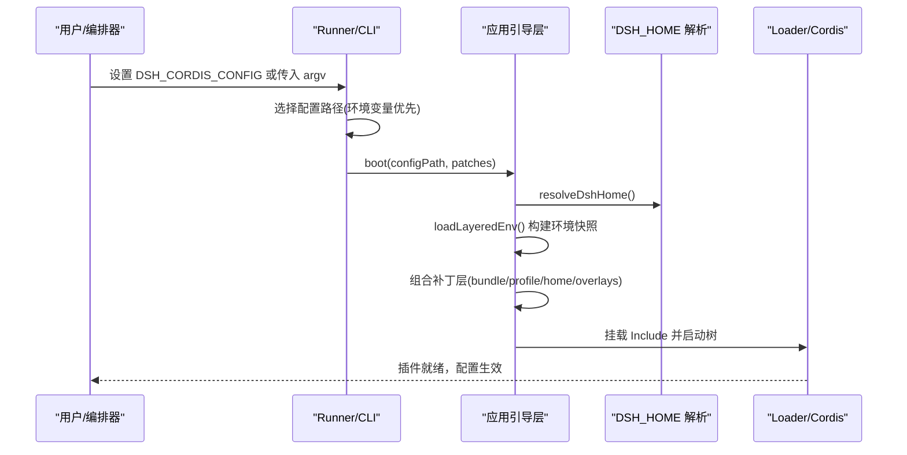
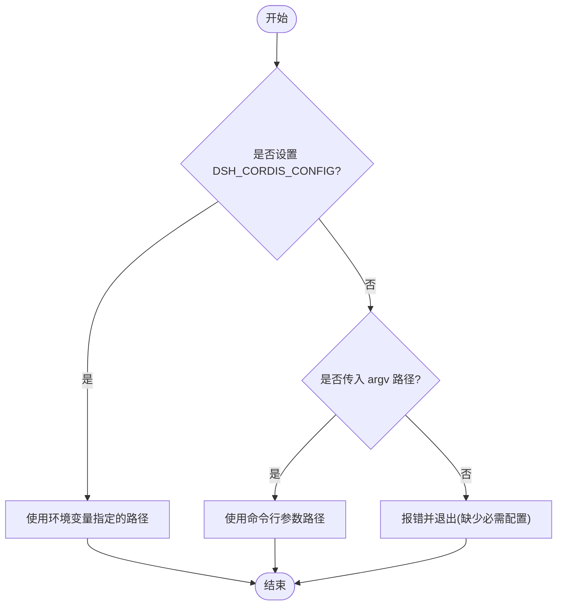
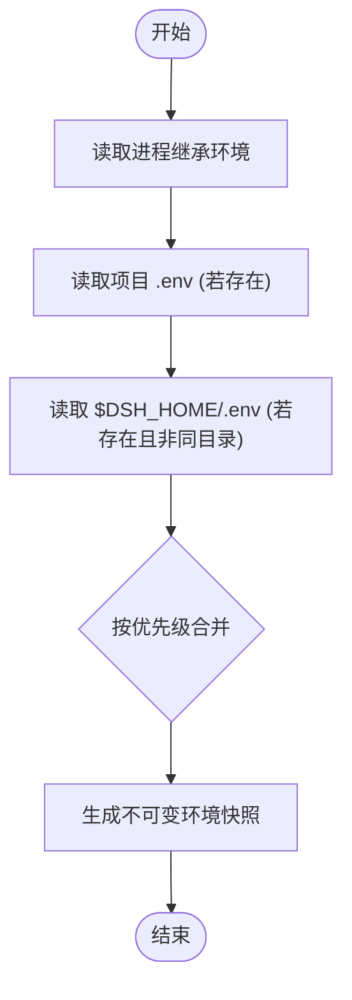
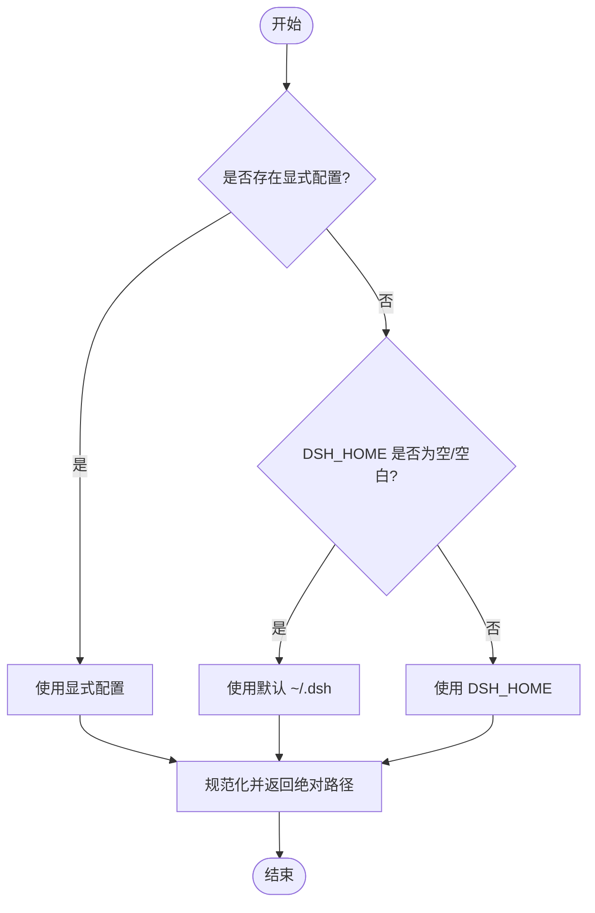
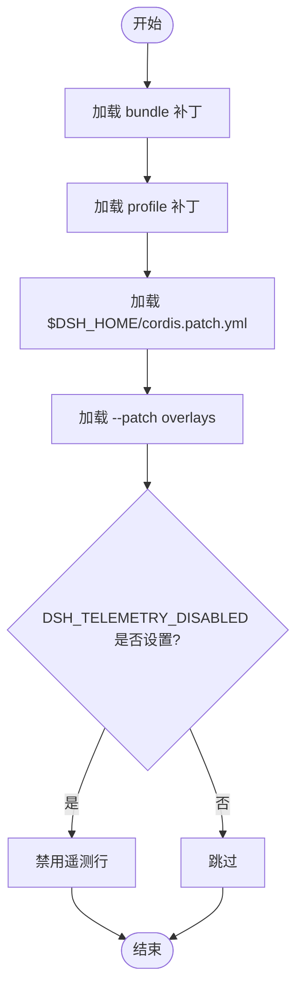
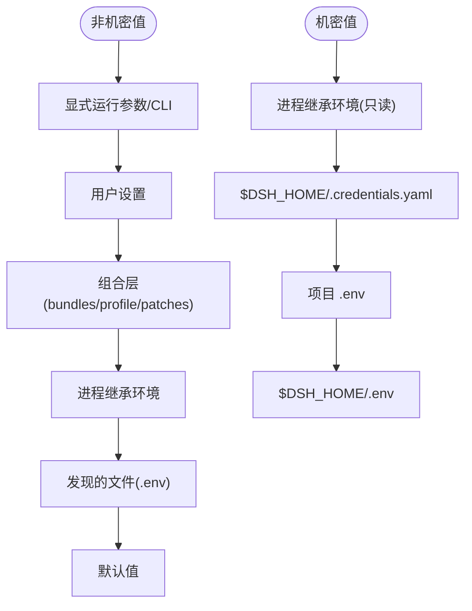
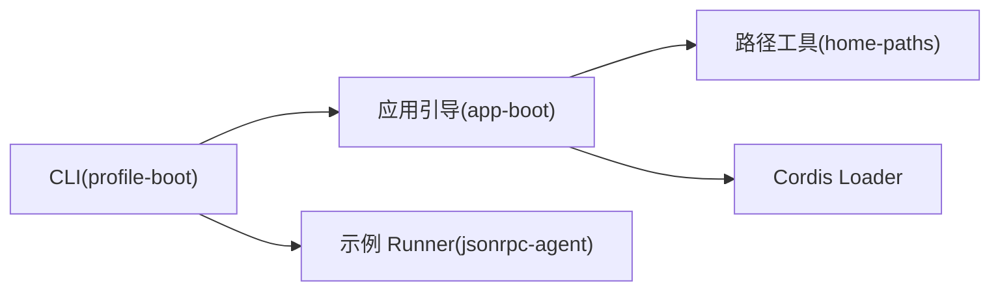

# 环境变量配置

<cite>
**本文引用的文件**
- [apps/cli/src/profile-boot.ts](file://apps/cli/src/profile-boot.ts)
- [packages/boot/app-boot/src/index.ts](file://packages/boot/app-boot/src/index.ts)
- [packages/util/home-paths/src/index.ts](file://packages/util/home-paths/src/index.ts)
- [examples/jsonrpc-agent/src/runner.ts](file://examples/jsonrpc-agent/src/runner.ts)
- [.agents/notes/implemented/architecture/2026-08-04-configuration-source-ownership.md](file://.agents/notes/implemented/architecture/2026-08-04-configuration-source-ownership.md)
- [.agents/notes/implemented/architecture/2026-08-04-credentials-yaml-and-user-environment-layer.md](file://.agents/notes/implemented/architecture/2026-08-04-credentials-yaml-and-user-environment-layer.md)
</cite>

## 目录
1. [简介](#简介)
2. [项目结构](#项目结构)
3. [核心组件](#核心组件)
4. [架构总览](#架构总览)
5. [详细组件分析](#详细组件分析)
6. [依赖关系分析](#依赖关系分析)
7. [性能考虑](#性能考虑)
8. [故障排查指南](#故障排查指南)
9. [结论](#结论)
10. [附录：环境变量参考与示例](#附录环境变量参考与示例)

## 简介
本文件系统化说明 DeepSeek Harness（DSH）的环境变量配置机制，重点覆盖 DSH_CORDIS_CONFIG、DSH_HOME、DSH_TELEMETRY_DISABLED 等关键变量的作用、优先级与默认值处理；解释配置文件与环境变量的层级关系；给出不同部署环境（开发、测试、生产、容器化）的最佳实践与安全建议；并提供完整的环境变量参考列表与配置示例。

## 项目结构
围绕环境变量与配置加载的关键代码分布在以下位置：
- CLI 启动与配置路径解析：CLI 入口与 profile 启动流程负责读取并应用环境变量与配置文件。
- 应用引导层：统一的环境快照构建、.env 分层加载、补丁层组合与 HMR 热重载。
- 用户数据根路径：DSH_HOME 的解析与展示。
- 架构决策文档：明确非机密值与机密的优先级顺序。

图表来源
- [packages/boot/app-boot/src/index.ts:166-198](file://packages/boot/app-boot/src/index.ts#L166-L198)
- [packages/util/home-paths/src/index.ts:76-91](file://packages/util/home-paths/src/index.ts#L76-L91)
- [apps/cli/src/profile-boot.ts:142-170](file://apps/cli/src/profile-boot.ts#L142-L170)

章节来源
- [packages/boot/app-boot/src/index.ts:1-800](file://packages/boot/app-boot/src/index.ts#L1-L800)
- [apps/cli/src/profile-boot.ts:1-301](file://apps/cli/src/profile-boot.ts#L1-L301)
- [packages/util/home-paths/src/index.ts:1-113](file://packages/util/home-paths/src/index.ts#L1-L113)

## 核心组件
- 配置路径解析与选择：支持通过环境变量或命令行参数指定 cordis.yml 路径，且环境变量优先于命令行参数。
- 环境快照与 .env 分层：在进程继承环境之上，按“项目 .env → $DSH_HOME/.env”的顺序合并，且不覆盖已存在的高优先级值。
- DSH_HOME 解析：决定用户数据根目录，空值或空白视为未设置，回退到默认 ~/.dsh。
- 补丁层组合：按固定顺序叠加 bundle、profile、home patch、--patch overlays，以及运行时开关（如遥测禁用）。
- 安全校验：禁止从 .env 设置受保护的“引导类”变量名（含 DSH_ 前缀等），防止影响进程启动与网络信任链。

章节来源
- [examples/jsonrpc-agent/src/runner.ts:24-38](file://examples/jsonrpc-agent/src/runner.ts#L24-L38)
- [packages/boot/app-boot/src/index.ts:92-128](file://packages/boot/app-boot/src/index.ts#L92-L128)
- [packages/boot/app-boot/src/index.ts:166-198](file://packages/boot/app-boot/src/index.ts#L166-L198)
- [packages/util/home-paths/src/index.ts:76-91](file://packages/util/home-paths/src/index.ts#L76-L91)
- [apps/cli/src/profile-boot.ts:142-170](file://apps/cli/src/profile-boot.ts#L142-L170)

## 架构总览
下图展示了从进程启动到最终配置生效的关键调用链与数据流。

图表来源
- [examples/jsonrpc-agent/src/runner.ts:24-38](file://examples/jsonrpc-agent/src/runner.ts#L24-L38)
- [packages/boot/app-boot/src/index.ts:166-198](file://packages/boot/app-boot/src/index.ts#L166-L198)
- [packages/util/home-paths/src/index.ts:76-91](file://packages/util/home-paths/src/index.ts#L76-L91)
- [apps/cli/src/profile-boot.ts:142-170](file://apps/cli/src/profile-boot.ts#L142-L170)

## 详细组件分析

### 配置路径选择：DSH_CORDIS_CONFIG
- 行为：当设置了 DSH_CORDIS_CONFIG 且非空时，使用该值作为配置路径；否则回退到命令行参数；若两者均未提供则报错退出。
- 用途：便于在 CI/容器/编排系统中通过环境变量注入配置路径，避免硬编码或参数传递。
- 注意：该变量仅用于选择要加载的 cordis.yml 路径，不直接参与配置值的合并。

图表来源
- [examples/jsonrpc-agent/src/runner.ts:24-38](file://examples/jsonrpc-agent/src/runner.ts#L24-L38)

章节来源
- [examples/jsonrpc-agent/src/runner.ts:24-38](file://examples/jsonrpc-agent/src/runner.ts#L24-L38)

### 环境快照与 .env 分层加载
- 分层顺序：进程继承环境 > 项目 .env > $DSH_HOME/.env。后一层不会覆盖高优先级层的已有值。
- 安全限制：禁止在项目或用户 .env 中设置“引导类”变量（包括所有 DSH_ 前缀变量），这些只能由启动环境设置。
- 结果：返回一个不可变的环境快照，供后续组件一致读取。

图表来源
- [packages/boot/app-boot/src/index.ts:166-198](file://packages/boot/app-boot/src/index.ts#L166-L198)
- [packages/boot/app-boot/src/index.ts:92-128](file://packages/boot/app-boot/src/index.ts#L92-L128)

章节来源
- [packages/boot/app-boot/src/index.ts:92-128](file://packages/boot/app-boot/src/index.ts#L92-L128)
- [packages/boot/app-boot/src/index.ts:166-198](file://packages/boot/app-boot/src/index.ts#L166-L198)

### DSH_HOME 解析与默认值
- 解析优先级：显式配置 > 环境变量 DSH_HOME > 默认 ~/.dsh。
- 空值处理：空字符串或仅空白被视为未设置，回退到默认路径。
- 显示友好：默认路径以“~/.dsh”显示，自定义路径显示为“$DSH_HOME”。

图表来源
- [packages/util/home-paths/src/index.ts:76-91](file://packages/util/home-paths/src/index.ts#L76-L91)

章节来源
- [packages/util/home-paths/src/index.ts:76-91](file://packages/util/home-paths/src/index.ts#L76-L91)

### 补丁层组合与运行时开关
- 组合顺序：bundle 层 → profile 自身层 → 家目录用户层（$DSH_HOME/cordis.patch.yml）→ --patch overlays → 运行时开关（如遥测禁用）。
- 遥测开关：DSH_TELEMETRY_DISABLED 为非空即禁用对应遥测行，任何非空值都视为关闭，遵循“隐私优先”原则。
- 热重载：用户补丁层支持 HMR 监听与动态重组合，确保用户编辑即时生效而不破坏应用自有层。

图表来源
- [apps/cli/src/profile-boot.ts:142-170](file://apps/cli/src/profile-boot.ts#L142-L170)

章节来源
- [apps/cli/src/profile-boot.ts:142-170](file://apps/cli/src/profile-boot.ts#L142-L170)

### 配置源优先级总览（非机密 vs 机密）
- 非机密值：显式运行参数 > 用户设置 > 组合（profile/bundle/patch）> 进程继承环境 > 发现的文件（项目/.env → $DSH_HOME/.env）> 默认值。
- 机密值：进程继承环境（只读且最高优先级）> $DSH_HOME/.credentials.yaml（可写、受管理）> 项目 .env > $DSH_HOME/.env。

图表来源
- [.agents/notes/implemented/architecture/2026-08-04-configuration-source-ownership.md:17-39](file://.agents/notes/implemented/architecture/2026-08-04-configuration-source-ownership.md#L17-L39)
- [.agents/notes/implemented/architecture/2026-08-04-credentials-yaml-and-user-environment-layer.md:24-30](file://.agents/notes/implemented/architecture/2026-08-04-credentials-yaml-and-user-environment-layer.md#L24-L30)

章节来源
- [.agents/notes/implemented/architecture/2026-08-04-configuration-source-ownership.md:17-39](file://.agents/notes/implemented/architecture/2026-08-04-configuration-source-ownership.md#L17-L39)
- [.agents/notes/implemented/architecture/2026-08-04-credentials-yaml-and-user-environment-layer.md:24-30](file://.agents/notes/implemented/architecture/2026-08-04-credentials-yaml-and-user-environment-layer.md#L24-L30)

## 依赖关系分析
- CLI 与引导层：CLI 通过 profile-boot 组装补丁层并调用引导层 boot()；引导层负责环境快照、.env 加载与 Loader 启动。
- 路径与用户数据：home-paths 提供 DSH_HOME 解析，被引导层与 CLI 共同使用。
- 安全边界：引导层对 .env 中的“引导类”变量进行严格拒绝，防止污染进程启动与网络信任链。

图表来源
- [apps/cli/src/profile-boot.ts:1-301](file://apps/cli/src/profile-boot.ts#L1-L301)
- [packages/boot/app-boot/src/index.ts:1-800](file://packages/boot/app-boot/src/index.ts#L1-L800)
- [packages/util/home-paths/src/index.ts:1-113](file://packages/util/home-paths/src/index.ts#L1-L113)
- [examples/jsonrpc-agent/src/runner.ts:24-38](file://examples/jsonrpc-agent/src/runner.ts#L24-L38)

章节来源
- [apps/cli/src/profile-boot.ts:1-301](file://apps/cli/src/profile-boot.ts#L1-L301)
- [packages/boot/app-boot/src/index.ts:1-800](file://packages/boot/app-boot/src/index.ts#L1-L800)
- [packages/util/home-paths/src/index.ts:1-113](file://packages/util/home-paths/src/index.ts#L1-L113)
- [examples/jsonrpc-agent/src/runner.ts:24-38](file://examples/jsonrpc-agent/src/runner.ts#L24-L38)

## 性能考虑
- 环境快照一次性构建：避免重复解析 .env，减少 I/O 与解析开销。
- 补丁层克隆与增量更新：用户补丁层在 HMR 场景下按需重新组合，避免全局对象共享导致的副作用。
- 最小化环境变量数量：仅暴露必要变量，降低启动期解析与校验成本。

[本节为通用指导，无需特定文件引用]

## 故障排查指南
- 错误：.env 中设置了受保护变量（如 DSH_*）
  - 现象：启动时报错提示不允许在 .env 中设置该类变量。
  - 处理：将相关变量改为在进程启动环境中导出，不要放入 .env。
- 错误：缺少必需的配置路径
  - 现象：未设置 DSH_CORDIS_CONFIG 也未传入命令行参数时退出。
  - 处理：设置 DSH_CORDIS_CONFIG 或在命令行传入 cordis.yml 路径。
- 错误：用户补丁层无法解析或格式错误
  - 现象：启动时报错提示补丁文件解析失败。
  - 处理：检查 cordis.patch.yml 语法与条目结构，确保为 YAML 数组。

章节来源
- [packages/boot/app-boot/src/index.ts:92-128](file://packages/boot/app-boot/src/index.ts#L92-L128)
- [packages/boot/app-boot/src/index.ts:267-338](file://packages/boot/app-boot/src/index.ts#L267-L338)
- [examples/jsonrpc-agent/src/runner.ts:24-38](file://examples/jsonrpc-agent/src/runner.ts#L24-L38)

## 结论
DSH 的环境变量与配置文件采用严格的优先级与分层策略，确保在不同部署环境下具备可预测性与安全性。通过 DSH_CORDIS_CONFIG 控制配置路径，通过 DSH_HOME 管理用户数据根，通过 .env 分层与补丁层组合实现灵活配置；同时以安全边界与默认值机制保障系统稳定。容器化部署推荐通过编排平台注入环境变量，避免将敏感信息写入镜像或 .env 文件。

[本节为总结性内容，无需特定文件引用]

## 附录：环境变量参考与示例

- DSH_CORDIS_CONFIG
  - 作用：指定要加载的 cordis.yml 配置路径。
  - 优先级：高于命令行参数；为空时回退到命令行参数；均未设置则报错退出。
  - 示例：export DSH_CORDIS_CONFIG=/etc/dsh/cordis.yml

- DSH_HOME
  - 作用：设置 Harness 用户数据根目录。
  - 默认值：未设置或为空时回退到 ~/.dsh。
  - 示例：export DSH_HOME=/opt/dsh-home

- DSH_TELEMETRY_DISABLED
  - 作用：非空即禁用遥测行，遵循“隐私优先”。
  - 示例：export DSH_TELEMETRY_DISABLED=1

- 其他常见 DSH_* 变量（来自源码与测试）
  - DSH_SNAPSHOT：用于快照录制/回放模式切换（如 record/refresh/replay）。
  - DSH_WEB_STRESS_HEADFUL：控制 Web 压力测试浏览器是否带界面。
  - DSH_PLAYWRIGHT_EXECUTABLE_PATH：指定 Playwright 可执行路径。
  - DSH_REQUIRE_BUILT_CLI_SMOKE：控制是否要求构建产物进行冒烟测试。
  - DSH_AGENTS_HOME、DSH_BUNDLED_SKILL_DIR：测试隔离时使用，指定代理与技能目录。

- 最佳实践
  - 开发环境：使用项目 .env 存放本地密钥与调试开关；通过 DSH_HOME 指向临时目录以便隔离。
  - 测试环境：通过编排注入 DSH_CORDIS_CONFIG 与必要的 DSH_* 开关；避免持久化敏感信息。
  - 生产环境：仅允许进程继承环境与受管理的机密存储（如 secrets manager）注入；禁止在生产镜像中包含 .env。
  - 容器化部署：通过容器编排（环境变量注入、Secrets 挂载）管理 DSH_*；使用只读文件系统与最小权限原则。

- 安全注意事项
  - 禁止在 .env 中设置受保护变量（包括所有 DSH_* 前缀），这些必须由启动环境设置。
  - 机密值优先来自进程继承环境；其次为 $DSH_HOME/.credentials.yaml；最后才是 .env 文件。
  - 定期审计环境变量与配置文件，避免泄露敏感信息。

[本节为参考与示例，无需特定文件引用]