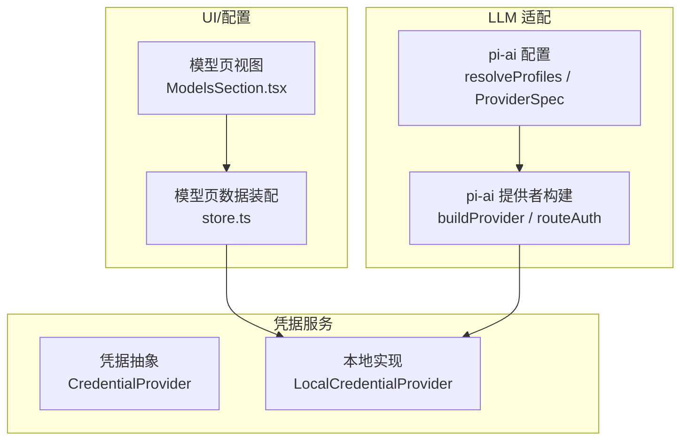
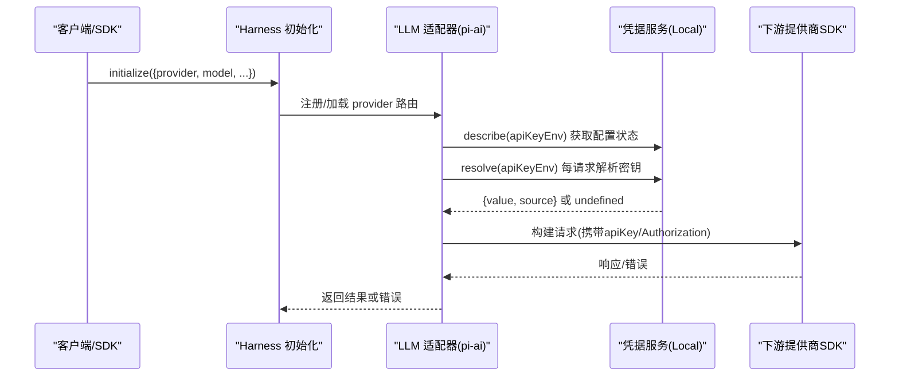
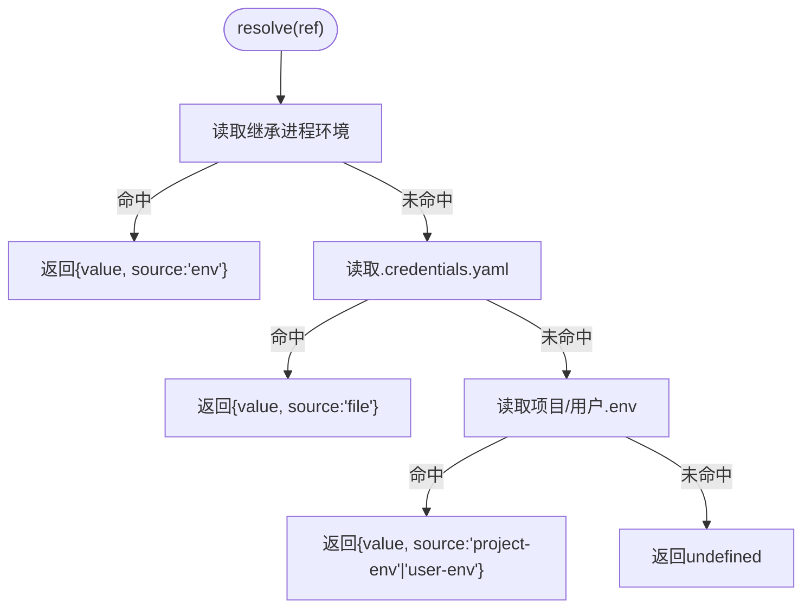
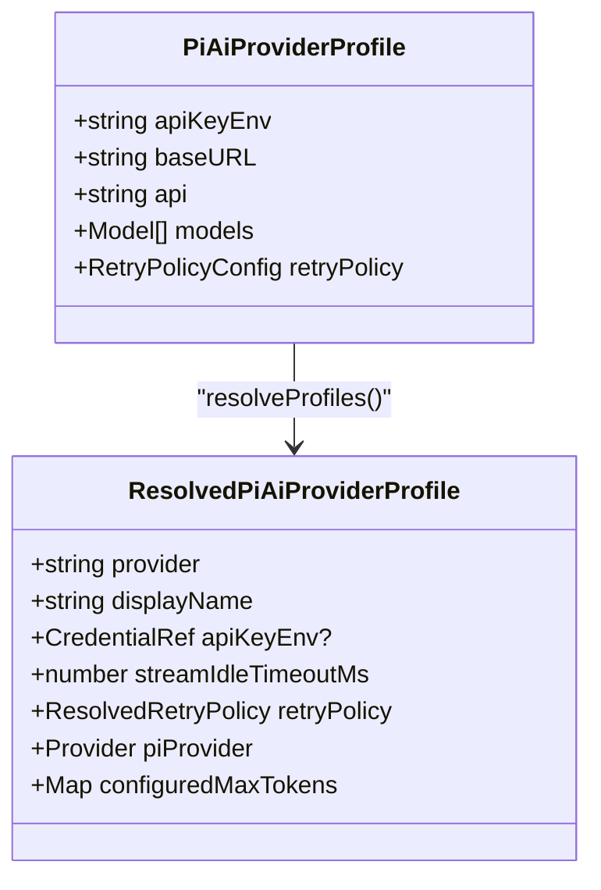
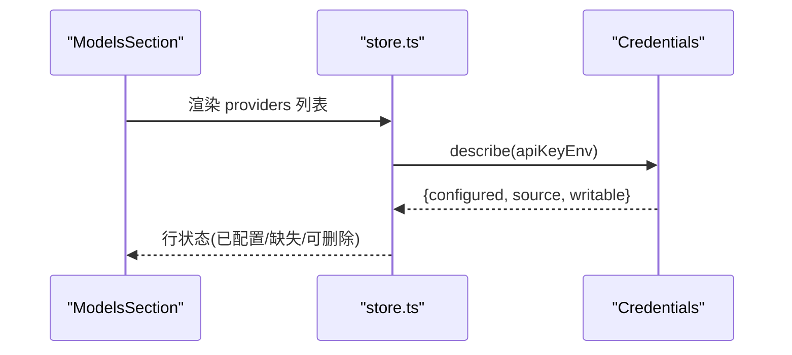
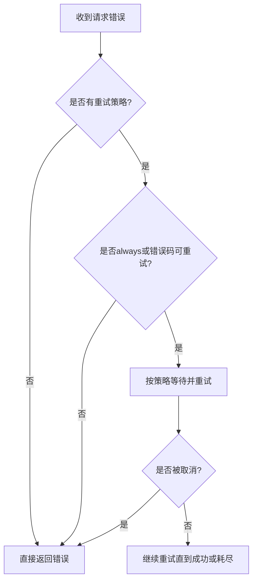
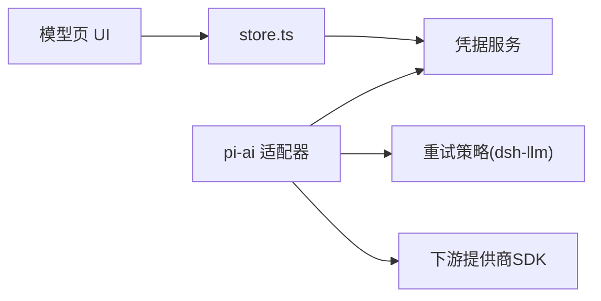

# 认证配置

<cite>
**本文引用的文件**
- [packages/credentials/credentials/src/index.ts](file://packages/credentials/credentials/src/index.ts)
- [packages/credentials/credentials-local/src/index.ts](file://packages/credentials/credentials-local/src/index.ts)
- [packages/llm/llm-pi-ai/src/config.ts](file://packages/llm/llm-pi-ai/src/config.ts)
- [packages/llm/llm-pi-ai/src/provider.ts](file://packages/llm/llm-pi-ai/src/provider.ts)
- [packages/llm/llm/src/retry-policy.ts](file://packages/llm/llm/src/retry-policy.ts)
- [packages/llm/llm-retry/src/index.ts](file://packages/llm/llm-retry/src/index.ts)
- [packages/client/ui-settings-models/src/client/store.ts](file://packages/client/ui-settings-models/src/client/store.ts)
- [packages/client/ui-settings-models/src/client/ModelsSection.tsx](file://packages/client/ui-settings-models/src/client/ModelsSection.tsx)
- [docs/subsystems/credentials.md](file://docs/subsystems/credentials.md)
- [.agents/notes/implemented/architecture/2026-07-14-provider-routed-llm-adapters.md](file://.agents/notes/implemented/architecture/2026-07-14-provider-routed-llm-adapters.md)
- [.agents/notes/implemented/architecture/2026-08-03-pi-ai-declared-provider-catalog.md](file://.agents/notes/implemented/architecture/2026-08-03-pi-ai-declared-provider-catalog.md)
- [.agents/notes/implemented/architecture/2026-08-04-configuration-source-ownership.md](file://.agents/notes/implemented/architecture/2026-08-04-configuration-source-ownership.md)
- [.agents/notes/implemented/architecture/2026-08-04-credentials-yaml-and-user-environment-layer.md](file://.agents/notes/implemented/architecture/2026-08-04-credentials-yaml-and-user-environment-layer.md)
</cite>

## 目录
1. [简介](#简介)
2. [项目结构](#项目结构)
3. [核心组件](#核心组件)
4. [架构总览](#架构总览)
5. [详细组件分析](#详细组件分析)
6. [依赖关系分析](#依赖关系分析)
7. [性能与可靠性](#性能与可靠性)
8. [故障排查指南](#故障排查指南)
9. [结论](#结论)
10. [附录：配置示例与迁移指南](#附录：配置示例与迁移指南)

## 简介
本文件聚焦于 Harness 的认证配置体系，围绕 initialize 流程中的 provider 与 model 参数、认证令牌与 API 密钥的来源、环境变量与配置文件的安全存储、不同 LLM 提供商的认证格式差异、认证失败的处理与重试策略，以及常见问题排查与迁移实践进行系统化说明。目标是帮助开发者在正确、安全且可维护的方式下完成多提供商认证配置。

## 项目结构
认证相关能力由“凭据服务层 + LLM 适配器层 + UI/配置面”共同构成：
- 凭据服务层：抽象凭据接口与本地实现，负责从进程环境、用户家目录文件、项目环境等来源解析并管理密钥。
- LLM 适配器层：以 pi-ai 为例，将 provider/model 路由与凭据引用绑定，并在请求时按策略注入认证信息。
- UI/配置面：提供模型页与设置界面，支持只写凭据、显示配置状态、避免在配置中泄露密钥。

图表来源
- [packages/credentials/credentials/src/index.ts:60-143](file://packages/credentials/credentials/src/index.ts#L60-L143)
- [packages/credentials/credentials-local/src/index.ts:207-331](file://packages/credentials/credentials-local/src/index.ts#L207-L331)
- [packages/llm/llm-pi-ai/src/config.ts:64-179](file://packages/llm/llm-pi-ai/src/config.ts#L64-L179)
- [packages/llm/llm-pi-ai/src/provider.ts:87-107](file://packages/llm/llm-pi-ai/src/provider.ts#L87-L107)
- [packages/client/ui-settings-models/src/client/store.ts:141-171](file://packages/client/ui-settings-models/src/client/store.ts#L141-L171)
- [packages/client/ui-settings-models/src/client/ModelsSection.tsx:298-326](file://packages/client/ui-settings-models/src/client/ModelsSection.tsx#L298-L326)

章节来源
- [packages/credentials/credentials/src/index.ts:60-143](file://packages/credentials/credentials/src/index.ts#L60-L143)
- [packages/credentials/credentials-local/src/index.ts:207-331](file://packages/credentials/credentials-local/src/index.ts#L207-L331)
- [packages/llm/llm-pi-ai/src/config.ts:64-179](file://packages/llm/llm-pi-ai/src/config.ts#L64-L179)
- [packages/llm/llm-pi-ai/src/provider.ts:87-107](file://packages/llm/llm-pi-ai/src/provider.ts#L87-L107)
- [packages/client/ui-settings-models/src/client/store.ts:141-171](file://packages/client/ui-settings-models/src/client/store.ts#L141-L171)
- [packages/client/ui-settings-models/src/client/ModelsSection.tsx:298-326](file://packages/client/ui-settings-models/src/client/ModelsSection.tsx#L298-L326)

## 核心组件
- 凭据抽象（CredentialProvider）
  - 定义 resolve/describe/set/unset 四个操作，保证空值视为未配置，每次调用重新解析，避免缓存导致密钥不生效。
- 本地凭据实现（LocalCredentialProvider）
  - 优先级：继承进程环境（只读且最高）> 用户家目录 .credentials.yaml（可写）> 项目/用户 .env（只读回退）。
  - 写入时拒绝被继承环境覆盖的目标；文件权限校验、热重载、原子写入。
- pi-ai 适配器配置（resolveProfiles / ProviderSpec）
  - 每个 provider 路由携带 apiKeyEnv 引用、baseURL、协议、模型清单、重试策略等。
  - namesCredential 标志决定是否为仅 OAuth 的提供商附加 Harness 的 api-key 方法。
- 模型页与设置界面
  - store 通过 credentials.describe 获取配置状态，ModelsSection 展示已配置/缺失状态，支持只写凭据。

章节来源
- [packages/credentials/credentials/src/index.ts:60-143](file://packages/credentials/credentials/src/index.ts#L60-L143)
- [packages/credentials/credentials-local/src/index.ts:207-331](file://packages/credentials/credentials-local/src/index.ts#L207-L331)
- [packages/llm/llm-pi-ai/src/config.ts:64-179](file://packages/llm/llm-pi-ai/src/config.ts#L64-L179)
- [packages/llm/llm-pi-ai/src/provider.ts:87-107](file://packages/llm/llm-pi-ai/src/provider.ts#L87-L107)
- [packages/client/ui-settings-models/src/client/store.ts:141-171](file://packages/client/ui-settings-models/src/client/store.ts#L141-L171)
- [packages/client/ui-settings-models/src/client/ModelsSection.tsx:298-326](file://packages/client/ui-settings-models/src/client/ModelsSection.tsx#L298-L326)

## 架构总览
下图展示了 initialize 过程中 provider/model 选择、凭据解析、以及请求级认证注入的关键路径。

图表来源
- [packages/llm/llm-pi-ai/src/config.ts:301-372](file://packages/llm/llm-pi-ai/src/config.ts#L301-L372)
- [packages/llm/llm-pi-ai/src/provider.ts:87-107](file://packages/llm/llm-pi-ai/src/provider.ts#L87-L107)
- [packages/credentials/credentials-local/src/index.ts:309-331](file://packages/credentials/credentials-local/src/index.ts#L309-L331)

章节来源
- [packages/llm/llm-pi-ai/src/config.ts:301-372](file://packages/llm/llm-pi-ai/src/config.ts#L301-L372)
- [packages/llm/llm-pi-ai/src/provider.ts:87-107](file://packages/llm/llm-pi-ai/src/provider.ts#L87-L107)
- [packages/credentials/credentials-local/src/index.ts:309-331](file://packages/credentials/credentials-local/src/index.ts#L309-L331)

## 详细组件分析

### 凭据服务与本地实现
- 设计要点
  - 所有消费方在每次操作时重新解析凭据，确保旋转密钥立即生效。
  - 空字符串视为未配置，避免误用。
  - describe 暴露“是否配置、来源、是否可写”，供 UI 渲染而不泄露值。
- 本地实现优先级
  - 继承进程环境（只读且最高）
  - $DSH_HOME/.credentials.yaml（可写，受锁保护，原子写入）
  - 项目/用户 .env（只读回退）
- 安全约束
  - 文件权限检查（非 owner 不可读即报错）
  - 禁止对继承环境键执行 set/unset（会被覆盖，无意义）

图表来源
- [packages/credentials/credentials-local/src/index.ts:249-331](file://packages/credentials/credentials-local/src/index.ts#L249-L331)

章节来源
- [packages/credentials/credentials/src/index.ts:60-143](file://packages/credentials/credentials/src/index.ts#L60-L143)
- [packages/credentials/credentials-local/src/index.ts:207-331](file://packages/credentials/credentials-local/src/index.ts#L207-L331)
- [docs/subsystems/credentials.md:1-134](file://docs/subsystems/credentials.md#L1-L134)

### pi-ai 适配器与 provider/model 路由
- 配置项
  - apiKeyEnv：凭据引用（环境变量名），不在配置中存放密钥。
  - baseURL/api/models/compat/defaultContextWindow/defaultMaxTokens 等用于描述端点与模型能力。
  - retryPolicy：请求级重试策略（由 dsh-llm 统一解析）。
- 构建过程
  - resolveProfiles 校验并生成 ResolvedPiAiProviderProfile，内含 piProvider、重试策略、模型清单等。
  - namesCredential 标志决定是否对仅 OAuth 的提供商附加 Harness 的 api-key 方法。
- 请求级认证
  - 适配器在请求时通过 ctx.credentials.resolve 获取密钥，再注入到下游 SDK 请求中。

图表来源
- [packages/llm/llm-pi-ai/src/config.ts:64-179](file://packages/llm/llm-pi-ai/src/config.ts#L64-L179)
- [packages/llm/llm-pi-ai/src/config.ts:301-372](file://packages/llm/llm-pi-ai/src/config.ts#L301-L372)

章节来源
- [packages/llm/llm-pi-ai/src/config.ts:64-179](file://packages/llm/llm-pi-ai/src/config.ts#L64-L179)
- [packages/llm/llm-pi-ai/src/config.ts:301-372](file://packages/llm/llm-pi-ai/src/config.ts#L301-L372)
- [packages/llm/llm-pi-ai/src/provider.ts:87-107](file://packages/llm/llm-pi-ai/src/provider.ts#L87-L107)

### 模型页与凭据状态展示
- store 收集 providers 列表后，对每个 provider 行计算 apiKeyEnv 引用，并通过 credentials.describe 查询其配置状态。
- ModelsSection 根据 configured/writable 等信息渲染“已配置/缺失/自定义”标签，并支持只写凭据。

图表来源
- [packages/client/ui-settings-models/src/client/store.ts:141-171](file://packages/client/ui-settings-models/src/client/store.ts#L141-L171)
- [packages/client/ui-settings-models/src/client/ModelsSection.tsx:298-326](file://packages/client/ui-settings-models/src/client/ModelsSection.tsx#L298-L326)

章节来源
- [packages/client/ui-settings-models/src/client/store.ts:141-171](file://packages/client/ui-settings-models/src/client/store.ts#L141-L171)
- [packages/client/ui-settings-models/src/client/ModelsSection.tsx:298-326](file://packages/client/ui-settings-models/src/client/ModelsSection.tsx#L298-L326)

### 不同 LLM 提供商的认证配置格式
- 通用原则
  - 配置中只放凭据引用（apiKeyEnv），不放密钥明文。
  - 具体密钥来源由凭据服务统一解析（进程环境 > 家目录文件 > .env 回退）。
- 仅 OAuth 提供商
  - 若提供商仅有 OAuth 方法，则不会在配置中要求 apiKeyEnv；适配器会保留提供商原生发现机制。
  - 若仍显式配置 apiKeyEnv，适配器会在路由上附加 Harness 的 api-key 方法以兼容。
- 其他提供商
  - 通过 apiKeyEnv 指向的环境变量名，结合凭据服务解析出实际密钥，注入到下游 SDK 的请求头或鉴权字段。

章节来源
- [.agents/notes/implemented/architecture/2026-08-03-pi-ai-declared-provider-catalog.md:42-46](file://.agents/notes/implemented/architecture/2026-08-03-pi-ai-declared-provider-catalog.md#L42-L46)
- [packages/llm/llm-pi-ai/src/provider.ts:87-107](file://packages/llm/llm-pi-ai/src/provider.ts#L87-L107)

### 安全存储凭据的最佳实践
- 推荐顺序
  - 进程环境（CI/容器注入）：只读、最高优先级，适合一次性覆盖。
  - 家目录 .credentials.yaml：可写、受锁保护、原子写入，适合持久化密钥。
  - 项目/用户 .env：只读回退，适合开发期临时使用。
- 安全约束
  - 文件权限必须为 owner-only（POSIX 模式 0600），否则启动时报错。
  - 禁止对继承环境键执行 set/unset，避免“看似成功实则无效”。
  - 配置文件中绝不出现密钥明文，只保留引用名称。

章节来源
- [packages/credentials/credentials-local/src/index.ts:87-122](file://packages/credentials/credentials-local/src/index.ts#L87-L122)
- [packages/credentials/credentials-local/src/index.ts:333-417](file://packages/credentials/credentials-local/src/index.ts#L333-L417)
- [.agents/notes/implemented/architecture/2026-08-04-configuration-source-ownership.md:17-39](file://.agents/notes/implemented/architecture/2026-08-04-configuration-source-ownership.md#L17-L39)
- [.agents/notes/implemented/architecture/2026-08-04-credentials-yaml-and-user-environment-layer.md:9-22](file://.agents/notes/implemented/architecture/2026-08-04-credentials-yaml-and-user-environment-layer.md#L9-L22)

### 认证失败处理与重试策略
- 重试策略来源
  - 每个 provider 路由可配置 retryPolicy（backoff、maxRetries、retryableCodes 等），由 dsh-llm 统一解析与固化。
  - 当下游发生可重试错误时，agent 层的 llm-retry 插件依据策略决定是否重试。
- 行为规则
  - 如果策略 mode 为 always，则在下游决策允许的情况下重试。
  - 如果错误码不在 retryableCodes 中，直接放弃重试。
  - 取消信号优先于重试，避免不必要的后续操作。

图表来源
- [packages/llm/llm/src/retry-policy.ts:123-156](file://packages/llm/llm/src/retry-policy.ts#L123-L156)
- [packages/llm/llm-retry/src/index.ts:156-179](file://packages/llm/llm-retry/src/index.ts#L156-L179)

章节来源
- [packages/llm/llm/src/retry-policy.ts:123-156](file://packages/llm/llm/src/retry-policy.ts#L123-L156)
- [packages/llm/llm-retry/src/index.ts:156-179](file://packages/llm/llm-retry/src/index.ts#L156-L179)

## 依赖关系分析
- 耦合关系
  - pi-ai 适配器依赖凭据服务进行请求级密钥解析；UI 依赖凭据服务描述能力以渲染配置状态。
  - 重试策略解耦于适配器，由 agent 层统一应用。
- 外部依赖
  - 下游提供商 SDK（如 pi-ai）负责最终 HTTP/WS 通信与鉴权细节。
  - 文件系统与进程环境作为凭据来源。

图表来源
- [packages/client/ui-settings-models/src/client/store.ts:141-171](file://packages/client/ui-settings-models/src/client/store.ts#L141-L171)
- [packages/llm/llm-pi-ai/src/config.ts:301-372](file://packages/llm/llm-pi-ai/src/config.ts#L301-L372)
- [packages/llm/llm/src/retry-policy.ts:123-156](file://packages/llm/llm/src/retry-policy.ts#L123-L156)

章节来源
- [packages/client/ui-settings-models/src/client/store.ts:141-171](file://packages/client/ui-settings-models/src/client/store.ts#L141-L171)
- [packages/llm/llm-pi-ai/src/config.ts:301-372](file://packages/llm/llm-pi-ai/src/config.ts#L301-L372)
- [packages/llm/llm/src/retry-policy.ts:123-156](file://packages/llm/llm/src/retry-policy.ts#L123-L156)

## 性能与可靠性
- 性能
  - 凭据解析为轻量查找（内存 Map + 环境变量），开销极低。
  - 文件写入采用原子写入与文件锁，避免并发竞争。
- 可靠性
  - 热重载：外部编辑 .credentials.yaml 会触发刷新，无需重启。
  - 幂等性：set/unset 对不存在键为 no-op；重复写入同一值无副作用。
  - 错误隔离：监听器失败不影响持久化提交，仅记录日志。

章节来源
- [packages/credentials/credentials-local/src/index.ts:265-307](file://packages/credentials/credentials-local/src/index.ts#L265-L307)
- [packages/credentials/credentials-local/src/index.ts:368-403](file://packages/credentials/credentials-local/src/index.ts#L368-L403)
- [packages/credentials/credentials/src/index.ts:104-142](file://packages/credentials/credentials/src/index.ts#L104-L142)

## 故障排查指南
- 常见症状与原因
  - “Provider is not configured”：未配置 apiKeyEnv 或未解析到密钥。
  - “AUTH/RATE_LIMIT/SERVICE_UNAVAILABLE”：下游认证或限流错误，应检查重试策略与密钥有效性。
  - 写入无效：目标键被继承进程环境覆盖，导致 set/unset 被拒绝。
  - 文件权限问题：.credentials.yaml 非 owner-only 导致启动失败。
- 排查步骤
  - 确认 initialize 传入的 provider/model 是否正确匹配路由。
  - 使用 credentials.describe 查看当前引用是否已配置及来源。
  - 检查 .credentials.yaml 权限与内容，确保无空值与非法键名。
  - 调整 retryPolicy 的 backoff 与 retryableCodes，观察是否缓解瞬时错误。
- 解决方案
  - 将密钥放入继承进程环境（只读最高）或 .credentials.yaml（可写持久化）。
  - 对仅 OAuth 提供商，不要强制 apiKeyEnv；保持提供商原生认证。
  - 若频繁限流，增大 backoff 或降低并发；必要时切换提供商或配额。

章节来源
- [.agents/notes/implemented/architecture/2026-08-03-pi-ai-declared-provider-catalog.md:42-46](file://.agents/notes/implemented/architecture/2026-08-03-pi-ai-declared-provider-catalog.md#L42-L46)
- [packages/credentials/credentials-local/src/index.ts:87-122](file://packages/credentials/credentials-local/src/index.ts#L87-L122)
- [packages/credentials/credentials-local/src/index.ts:333-417](file://packages/credentials/credentials-local/src/index.ts#L333-L417)
- [packages/llm/llm-retry/src/index.ts:156-179](file://packages/llm/llm-retry/src/index.ts#L156-L179)

## 结论
Harness 的认证体系通过“配置引用 + 请求级解析 + 安全存储”实现了灵活、安全且可运维的密钥管理。initialize 中的 provider/model 路由与凭据引用紧密绑定，UI 层提供可视化配置与状态反馈，重试策略保障稳定性。遵循最佳实践与排查指南，可在多提供商环境下稳定运行。

## 附录：配置示例与迁移指南
- 配置示例（概念性）
  - 在 settings/cordis 中声明 provider 路由，包含 apiKeyEnv、baseURL、models 等。
  - 在 .credentials.yaml 中保存对应引用名的密钥值。
  - 在进程环境中注入临时覆盖（如 CI 场景）。
- 迁移指南
  - 从硬编码密钥迁移到凭据引用：移除配置中的明文，改为 apiKeyEnv 引用。
  - 从旧版 .env 迁移到 .credentials.yaml：将密钥移动到受管文件，注意权限与格式。
  - 对仅 OAuth 提供商：移除 apiKeyEnv，保留提供商原生认证。
  - 更新重试策略：根据业务需求调整 backoff 与可重试错误码。

章节来源
- [packages/llm/llm-pi-ai/src/config.ts:64-179](file://packages/llm/llm-pi-ai/src/config.ts#L64-L179)
- [packages/credentials/credentials-local/src/index.ts:207-331](file://packages/credentials/credentials-local/src/index.ts#L207-L331)
- [.agents/notes/implemented/architecture/2026-08-04-configuration-source-ownership.md:17-39](file://.agents/notes/implemented/architecture/2026-08-04-configuration-source-ownership.md#L17-L39)
- [.agents/notes/implemented/architecture/2026-08-04-credentials-yaml-and-user-environment-layer.md:9-22](file://.agents/notes/implemented/architecture/2026-08-04-credentials-yaml-and-user-environment-layer.md#L9-L22)