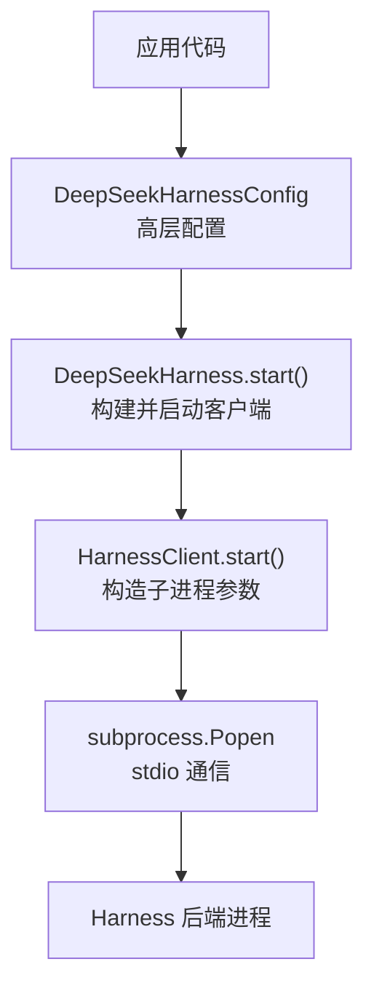
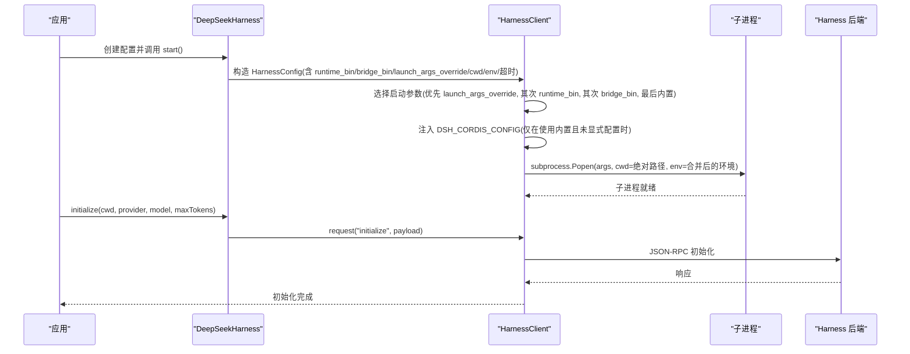
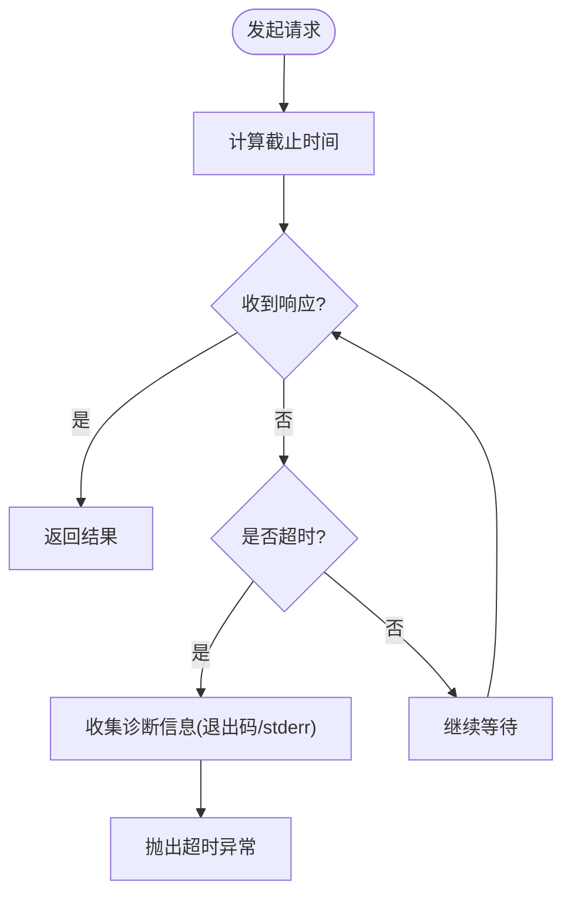
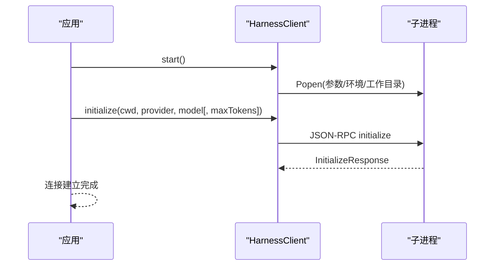
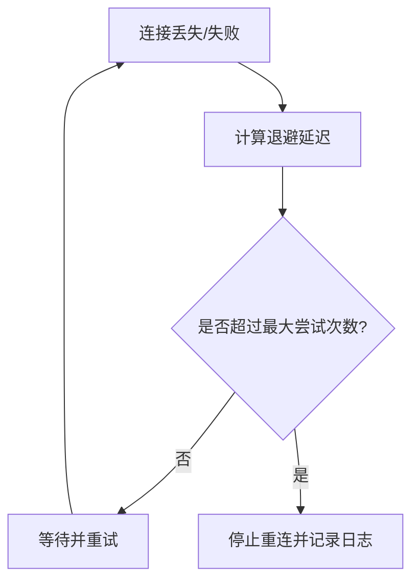
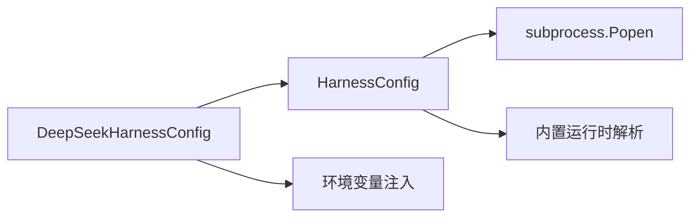

# 连接配置

<cite>
**本文引用的文件**
- [client.py](file://python/sdk/src/deepseek_harness/client.py)
- [api.py](file://python/sdk/src/deepseek_harness/api.py)
- [errors.py](file://python/sdk/src/deepseek_harness/errors.py)
- [connection.ts](file://packages/mcp/mcp-client/src/connection.ts)
- [README.md（Python SDK）](file://python/sdk/README.md)
</cite>

## 目录
1. [简介](#简介)
2. [项目结构](#项目结构)
3. [核心组件](#核心组件)
4. [架构总览](#架构总览)
5. [详细组件分析](#详细组件分析)
6. [依赖关系分析](#依赖关系分析)
7. [性能与超时](#性能与超时)
8. [故障诊断与排错](#故障诊断与排错)
9. [结论](#结论)
10. [附录：环境示例与最佳实践](#附录环境示例与最佳实践)

## 简介
本文件聚焦于 DeepSeek Harness Python SDK 的连接配置，围绕 HarnessConfig 类及其上层封装 DeepSeekHarnessConfig 的运行时参数、工作目录与环境变量注入、请求与关闭超时策略进行系统化说明。文档还解释连接建立过程、错误处理与重连机制，并提供本地开发、测试与生产环境的配置建议与排错指南。

## 项目结构
- Python SDK 层提供两个关键配置对象：
  - HarnessConfig：面向底层子进程启动与 JSON-RPC 通信的细粒度配置。
  - DeepSeekHarnessConfig：面向用户的高层配置，负责将高层选项映射到底层 HarnessConfig，并注入环境变量。
- 运行时通过子进程 stdio 与 Harness 后端通信；默认情况下会尝试使用内置运行时，也可通过 runtime_bin、bridge_bin 或 launch_args_override 指定自定义运行方式。
- 工作目录 cwd 与运行时工作目录 runtime_cwd 在启动前解析为绝对路径，确保子进程与握手阶段一致。
- 环境变量 env 会被合并到子进程环境；同时支持注入 DSH_CORDIS_CONFIG、DSH_SESSION_ROOT、DSH_CWD、DEEPSEEK_BASE_URL、DEEPSEEK_API_KEY 等键。

图表来源
- [api.py:56-107](file://python/sdk/src/deepseek_harness/api.py#L56-L107)
- [client.py:63-85](file://python/sdk/src/deepseek_harness/client.py#L63-L85)

章节来源
- [api.py:13-83](file://python/sdk/src/deepseek_harness/api.py#L13-L83)
- [client.py:24-85](file://python/sdk/src/deepseek_harness/client.py#L24-L85)

## 核心组件
- HarnessConfig
  - runtime_bin：直接指定运行时可执行路径。
  - bridge_bin：指定桥接二进制路径（当未设置 runtime_bin 时优先）。
  - launch_args_override：完全覆盖默认启动参数，优先级最高。
  - cwd：子进程工作目录（解析为绝对路径）。
  - env：子进程环境变量字典，会与当前进程环境合并。
  - request_timeout_seconds：单次请求等待响应的超时秒数；None 表示不限制。
  - shutdown_timeout_seconds：关闭流程中发送 shutdown 请求与等待进程退出的超时秒数。
- DeepSeekHarnessConfig
  - 提供 provider、model、max_tokens、cwd、runtime_cwd、session_root、cordis、env、runtime_bin、launch_args_override、request_timeout_seconds、shutdown_timeout_seconds、base_url、api_key 等高层选项。
  - 自动将 session_root、cordis、cwd、base_url、api_key 转换为环境变量注入子进程。
  - 将高层配置映射到底层 HarnessConfig。

章节来源
- [client.py:24-35](file://python/sdk/src/deepseek_harness/client.py#L24-L35)
- [api.py:13-34](file://python/sdk/src/deepseek_harness/api.py#L13-L34)
- [api.py:56-83](file://python/sdk/src/deepseek_harness/api.py#L56-L83)

## 架构总览
下图展示了从高层配置到低层子进程的完整链路，包括环境变量注入、默认配置注入、启动参数选择与请求超时控制。

图表来源
- [client.py:63-85](file://python/sdk/src/deepseek_harness/client.py#L63-L85)
- [client.py:424-454](file://python/sdk/src/deepseek_harness/client.py#L424-L454)
- [api.py:56-107](file://python/sdk/src/deepseek_harness/api.py#L56-L107)

## 详细组件分析

### 运行时与启动参数
- 启动参数选择顺序：
  1) launch_args_override 完全覆盖；
  2) 若设置了 runtime_bin，则使用该二进制；
  3) 若设置了 bridge_bin，则使用该桥接；
  4) 否则尝试从内置运行时包解析默认启动参数。
- 内置默认配置注入：
  - 仅在“未设置 launch_args_override、runtime_bin、bridge_bin”且“未显式设置 DSH_CORDIS_CONFIG”时，自动注入内置默认配置文件路径到环境变量。
- 工作目录：
  - cwd 在启动前解析为绝对路径，避免相对路径歧义。
- 环境变量：
  - env 与当前进程环境合并；DeepSeekHarnessConfig 还会注入 DSH_SESSION_ROOT、DSH_CORDIS_CONFIG、DSH_CWD、DEEPSEEK_BASE_URL、DEEPSEEK_API_KEY。

章节来源
- [client.py:63-85](file://python/sdk/src/deepseek_harness/client.py#L63-L85)
- [client.py:424-454](file://python/sdk/src/deepseek_harness/client.py#L424-L454)
- [api.py:56-83](file://python/sdk/src/deepseek_harness/api.py#L56-L83)

### 请求与关闭超时
- 请求超时 request_timeout_seconds：
  - 应用于每次 JSON-RPC 请求的等待时间；None 表示不限制。
  - 超时会抛出 TimeoutError，并在错误信息中包含子进程退出码与最近 stderr 输出片段，便于定位问题。
- 关闭超时 shutdown_timeout_seconds：
  - 用于发送 shutdown 请求后等待进程退出的时间；超时后会终止进程并清理资源。
  - 关闭失败会记录 stderr 尾部信息，便于诊断。

图表来源
- [client.py:228-296](file://python/sdk/src/deepseek_harness/client.py#L228-L296)
- [client.py:403-422](file://python/sdk/src/deepseek_harness/client.py#L403-L422)

章节来源
- [client.py:228-296](file://python/sdk/src/deepseek_harness/client.py#L228-L296)
- [client.py:87-111](file://python/sdk/src/deepseek_harness/client.py#L87-L111)
- [client.py:403-422](file://python/sdk/src/deepseek_harness/client.py#L403-L422)

### 连接建立过程
- 启动子进程：
  - 根据配置选择启动参数，合并环境变量，解析工作目录，创建子进程并启动读写线程。
- 初始化会话：
  - 调用 initialize 传入 cwd、provider、model、可选 maxTokens。
- 内置默认配置注入：
  - 如使用内置运行时且未显式配置 cordis，则自动注入内置默认配置文件路径。

图表来源
- [client.py:63-85](file://python/sdk/src/deepseek_harness/client.py#L63-L85)
- [client.py:117-136](file://python/sdk/src/deepseek_harness/client.py#L117-L136)
- [client.py:424-454](file://python/sdk/src/deepseek_harness/client.py#L424-L454)

章节来源
- [client.py:63-136](file://python/sdk/src/deepseek_harness/client.py#L63-L136)
- [client.py:424-454](file://python/sdk/src/deepseek_harness/client.py#L424-L454)

### 错误处理与诊断
- 传输关闭：
  - 当子进程退出或 stdout 关闭时，抛出 TransportClosedError，并附带诊断信息（退出码与 stderr 尾部）。
- JSON-RPC 错误：
  - 当后端返回错误响应时，抛出 JsonRpcError，包含 code、message、data。
- 协议错误：
  - 当运行时数据不符合 SDK 协议时，抛出 SdkProtocolError。
- 诊断信息：
  - 超时与传输错误会附加子进程状态与最近 stderr 输出，帮助快速定位问题。

章节来源
- [errors.py:4-24](file://python/sdk/src/deepseek_harness/errors.py#L4-L24)
- [client.py:399-422](file://python/sdk/src/deepseek_harness/client.py#L399-L422)

### 重连机制（MCP 客户端）
- MCP 客户端具备自动重连策略，适用于与外部 MCP 服务器的连接恢复：
  - 指数退避：initialDelayMs 起始，按 2^(attempt-1) 增长，上限为 maxDelayMs。
  - 最大尝试次数：达到 maxAttempts 后停止重连。
  - 生成期保护：为避免重叠的子进程，会在必要时停止重连并记录日志。
- 注意：该重连逻辑属于 MCP 客户端模块，与 Python SDK 的 HarnessClient 子进程管理相互独立。

图表来源
- [connection.ts:27-53](file://packages/mcp/mcp-client/src/connection.ts#L27-L53)
- [connection.ts:214-225](file://packages/mcp/mcp-client/src/connection.ts#L214-L225)

章节来源
- [connection.ts:27-53](file://packages/mcp/mcp-client/src/connection.ts#L27-L53)
- [connection.ts:214-225](file://packages/mcp/mcp-client/src/connection.ts#L214-L225)

## 依赖关系分析
- 高层配置 DeepSeekHarnessConfig 依赖底层 HarnessConfig 以完成子进程启动与通信。
- 启动参数解析依赖内置运行时包（deepseek_harness_runtime），若不可用需安装对应包或显式设置 runtime_bin。
- 环境变量注入遵循优先级：显式 env > 高层配置注入 > 内置默认注入（条件满足时）。

图表来源
- [api.py:56-83](file://python/sdk/src/deepseek_harness/api.py#L56-L83)
- [client.py:424-454](file://python/sdk/src/deepseek_harness/client.py#L424-L454)

章节来源
- [api.py:56-83](file://python/sdk/src/deepseek_harness/api.py#L56-L83)
- [client.py:424-454](file://python/sdk/src/deepseek_harness/client.py#L424-L454)

## 性能与超时
- 请求超时：
  - 合理设置 request_timeout_seconds 以避免长时间阻塞；对于长任务可适当增大。
  - 超时异常包含诊断信息，便于快速定位后端卡死或网络问题。
- 关闭超时：
  - shutdown_timeout_seconds 控制优雅关闭的等待时间；过短可能导致进程未完全清理，过长影响回收速度。
- 子进程 I/O：
  - 读写线程采用队列与锁保护，避免竞争；stderr 捕获有助于诊断。

[本节为通用指导，不直接分析具体文件]

## 故障诊断与排错
- 常见错误类型：
  - TransportClosedError：子进程退出或 stdout 关闭，检查进程状态与 stderr。
  - JsonRpcError：后端返回错误，查看 code、message、data。
  - SdkProtocolError：数据格式不符，检查后端实现是否符合协议。
  - TimeoutError：请求超时，结合诊断信息判断后端是否响应。
- 诊断信息：
  - 超时与传输错误会附带退出码与最近 stderr 输出，优先检查这些线索。
- 内置默认配置：
  - 若使用内置运行时且未显式配置 cordis，会自动注入内置默认配置文件路径；如需自定义，请设置 DSH_CORDIS_CONFIG 或显式配置 cordis。

章节来源
- [errors.py:4-24](file://python/sdk/src/deepseek_harness/errors.py#L4-L24)
- [client.py:399-422](file://python/sdk/src/deepseek_harness/client.py#L399-L422)
- [client.py:424-454](file://python/sdk/src/deepseek_harness/client.py#L424-L454)

## 结论
HarnessConfig 提供了对运行时二进制、启动参数、工作目录、环境变量与超时的精细控制；DeepSeekHarnessConfig 在此基础上提供更友好的高层接口与环境变量注入。通过合理的超时设置与错误诊断，可在不同环境中稳定地建立与维护连接。对于 MCP 客户端场景，自动重连策略提升了连接的鲁棒性。

[本节为总结，不直接分析具体文件]

## 附录：环境示例与最佳实践
- 本地开发
  - 使用内置运行时，无需设置 runtime_bin；可通过 launch_args_override 注入调试参数。
  - 设置较短的 request_timeout_seconds 以便快速反馈；shutdown_timeout_seconds 保持默认或略增。
  - 通过 env 注入调试变量，如 DSH_CORDIS_CONFIG 指向本地配置文件。
- 测试环境
  - 明确设置 runtime_bin 或 bridge_bin 以隔离测试运行时。
  - 设置合理的 request_timeout_seconds，避免测试长时间挂起。
  - 使用独立的 session_root 与 cordis 配置，确保测试隔离。
- 生产环境
  - 固定 runtime_bin 或 bridge_bin，避免依赖内置运行时解析。
  - 设置合适的 request_timeout_seconds 与 shutdown_timeout_seconds，兼顾稳定性与资源回收。
  - 通过 env 注入 DEEPSEEK_BASE_URL、DEEPSEEK_API_KEY 等敏感配置，避免硬编码。

章节来源
- [README.md（Python SDK）:49-52](file://python/sdk/README.md#L49-L52)
- [api.py:56-83](file://python/sdk/src/deepseek_harness/api.py#L56-L83)
- [client.py:424-454](file://python/sdk/src/deepseek_harness/client.py#L424-L454)