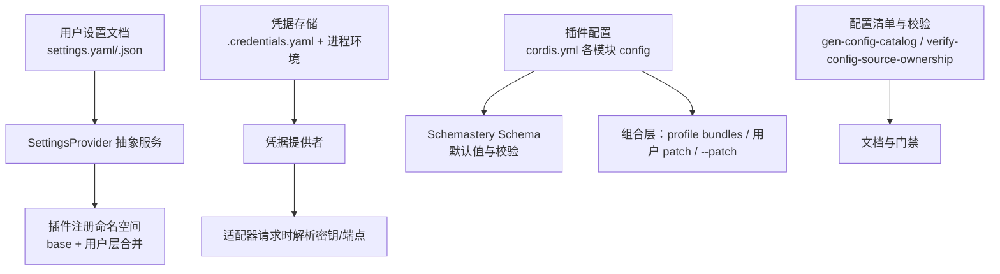
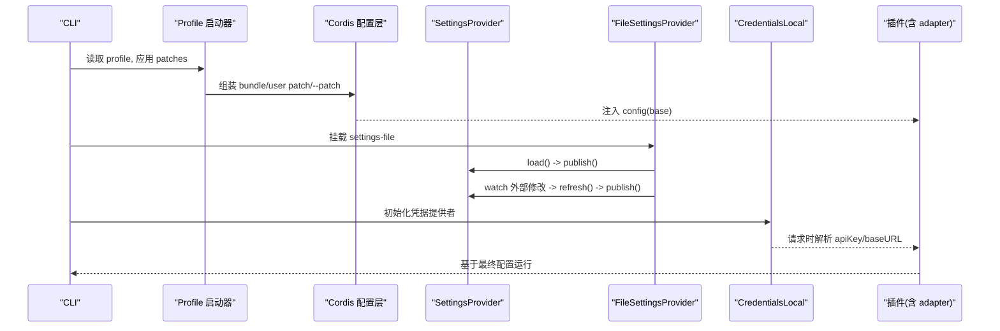
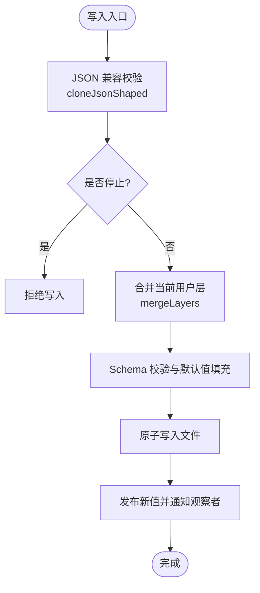
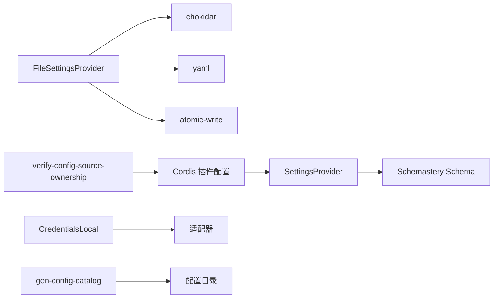

# 配置管理

<cite>
**本文引用的文件**
- [packages/settings/settings/src/index.ts](file://packages/settings/settings/src/index.ts)
- [packages/settings/settings-file/src/index.ts](file://packages/settings/settings-file/src/index.ts)
- [apps/cli/src/dump-config.ts](file://apps/cli/src/dump-config.ts)
- [scripts/verify-config-source-ownership.ts](file://scripts/verify-config-source-ownership.ts)
- [examples/headless-agent/cordis.yml](file://examples/headless-agent/cordis.yml)
- [docs/config-catalog.md](file://docs/config-catalog.md)
- [.agents/notes/implemented/architecture/2026-08-04-configuration-source-ownership.md](file://.agents/notes/implemented/architecture/2026-08-04-configuration-source-ownership.md)
</cite>

## 目录
1. [简介](#简介)
2. [项目结构](#项目结构)
3. [核心组件](#核心组件)
4. [架构总览](#架构总览)
5. [详细组件分析](#详细组件分析)
6. [依赖关系分析](#依赖关系分析)
7. [性能考虑](#性能考虑)
8. [故障排除指南](#故障排除指南)
9. [结论](#结论)
10. [附录](#附录)

## 简介
本文件系统化说明 DeepSeek Harness 的配置管理体系，覆盖配置对象结构、连接与认证设置、性能调优参数、环境变量与配置文件使用方式、不同环境的最佳实践、配置的验证机制与默认值处理、热重载与安全注意事项，并提供完整示例与排障指引。目标是帮助开发者在不同环境下正确、安全地编排配置，并理解运行时如何解析、合并与生效。

## 项目结构
配置体系由“用户设置文档”“凭据存储”“插件配置目录（cordis.yml）”“配置清单生成与校验”共同组成：
- 用户设置文档：通过 settings-file 提供 YAML/JSON 持久化与热重载，按命名空间组织各插件的“用户层”。
- 凭据存储：credentials-local 提供 .credentials.yaml 与进程环境混合的凭据解析。
- 插件配置：每个插件在 cordis.yml 中声明 config，并通过 schemastery schema 进行类型与默认值约束；可通过 profile bundles、用户 patch、--patch 叠加。
- 配置清单与校验：gen-config-catalog 生成可浏览的配置目录；verify-config-source-ownership 禁止在已交付配置中内联敏感或端点来源的环境变量。

**图示来源**
- [packages/settings/settings-file/src/index.ts:20-67](file://packages/settings/settings-file/src/index.ts#L20-L67)
- [packages/settings/settings/src/index.ts:350-470](file://packages/settings/settings/src/index.ts#L350-L470)
- [examples/headless-agent/cordis.yml:9-24](file://examples/headless-agent/cordis.yml#L9-L24)
- [scripts/verify-config-source-ownership.ts:12-42](file://scripts/verify-config-source-ownership.ts#L12-L42)

**章节来源**
- [packages/settings/settings-file/src/index.ts:20-67](file://packages/settings/settings-file/src/index.ts#L20-L67)
- [packages/settings/settings/src/index.ts:350-470](file://packages/settings/settings/src/index.ts#L350-L470)
- [examples/headless-agent/cordis.yml:9-24](file://examples/headless-agent/cordis.yml#L9-L24)
- [scripts/verify-config-source-ownership.ts:12-42](file://scripts/verify-config-source-ownership.ts#L12-L42)

## 核心组件
- SettingsProvider（抽象服务）
  - 负责命名空间注册、值解析（schema 默认值 → base → 用户层）、变更监听、并发写队列、版本冲突检测、事件广播。
  - 支持 update/replace/mutate 三种写入模式，保证 JSON 兼容数据持久化。
- FileSettingsProvider（文件实现）
  - 以 settings.yaml/.json 为单一文档，支持外部编辑热重载（chokidar），原子写入与注释保留的增量渲染。
  - 提供 prepareDocument 创建空文档、documentPath 暴露本地路径。
- CredentialsLocal（凭据提供者）
  - 将进程环境与 $DSH_HOME/.credentials.yaml 合并，按优先级解析密钥与端点。
- Cordis 插件配置
  - 每个插件在 cordis.yml 中声明 config，并由 schemastery schema 约束；可通过 profile bundles、用户 patch、--patch 叠加。
- 配置清单与门禁
  - gen-config-catalog 生成全量插件配置目录；verify-config-source-ownership 禁止在已交付配置中内联敏感或端点来源的环境变量。

**章节来源**
- [packages/settings/settings/src/index.ts:36-129](file://packages/settings/settings/src/index.ts#L36-L129)
- [packages/settings/settings/src/index.ts:350-800](file://packages/settings/settings/src/index.ts#L350-L800)
- [packages/settings/settings-file/src/index.ts:104-190](file://packages/settings/settings-file/src/index.ts#L104-L190)
- [examples/headless-agent/cordis.yml:9-24](file://examples/headless-agent/cordis.yml#L9-L24)
- [scripts/verify-config-source-ownership.ts:12-42](file://scripts/verify-config-source-ownership.ts#L12-L42)

## 架构总览
下图展示从 CLI 到插件配置的加载与合并流程，以及用户设置与凭据的热重载路径。

**图示来源**
- [apps/cli/src/dump-config.ts:30-52](file://apps/cli/src/dump-config.ts#L30-L52)
- [packages/settings/settings-file/src/index.ts:232-269](file://packages/settings/settings-file/src/index.ts#L232-L269)
- [packages/settings/settings/src/index.ts:657-684](file://packages/settings/settings/src/index.ts#L657-L684)
- [examples/headless-agent/cordis.yml:9-24](file://examples/headless-agent/cordis.yml#L9-L24)

## 详细组件分析

### 用户设置（SettingsProvider 与 FileSettingsProvider）
- 命名空间与注册
  - 插件通过 register(ns, schema, options) 声明命名空间、schema 与 base（composition 层）。
  - applies 控制生效时机（live/restart），validate 用于跨字段校验。
- 值解析与合并
  - 解析顺序：schema 默认值 → base → 用户层（settings.yaml 对应 section）。
  - 写入模式：update（合并）、replace（替换）、mutate（路径操作）。
  - 并发写：每命名空间串行队列，避免竞态；支持 expectedRevision 冲突检测。
- 文件实现
  - 支持 YAML/JSON，watch 外部编辑并热重载；原子写入与注释保留。
  - 错误策略：启动时非法文档失败；热重载失败则保持最后一份有效文档并告警。

**图示来源**
- [packages/settings/settings/src/index.ts:253-305](file://packages/settings/settings/src/index.ts#L253-L305)
- [packages/settings/settings/src/index.ts:577-648](file://packages/settings/settings/src/index.ts#L577-L648)
- [packages/settings/settings-file/src/index.ts:210-229](file://packages/settings/settings-file/src/index.ts#L210-L229)

**章节来源**
- [packages/settings/settings/src/index.ts:36-129](file://packages/settings/settings/src/index.ts#L36-L129)
- [packages/settings/settings/src/index.ts:350-800](file://packages/settings/settings/src/index.ts#L350-L800)
- [packages/settings/settings-file/src/index.ts:104-190](file://packages/settings/settings-file/src/index.ts#L104-L190)
- [packages/settings/settings-file/src/index.ts:271-338](file://packages/settings/settings-file/src/index.ts#L271-L338)

### 连接配置（客户端连接与 Web 服务器）
- 连接配置（trustedHosts、maxRequestBodyBytes）
  - 限制非回环主机访问与 API 请求体大小，防止误暴露。
- Web 服务器（host、port）
  - 监听地址与端口，配合连接信任列表保障边界安全。

**章节来源**
- [docs/config-catalog.md:390-413](file://docs/config-catalog.md#L390-L413)
- [docs/config-catalog.md:788-800](file://docs/config-catalog.md#L788-L800)

### 认证设置（凭据与端点）
- 凭据优先级（非机密值与凭据值分开排序）
  - 非机密值：显式覆盖 > 用户设置 > 组合层 > 继承环境 > 发现文件 > 默认值。
  - 凭据值：继承环境（只读且最高）> $DSH_HOME/.credentials.yaml > 项目 .env > 用户 .env。
- 适配器解析
  - 适配器在请求时解析 apiKeyEnv/baseURL，避免在 cordis.yml 中内联敏感或端点来源的环境变量。
- 门禁规则
  - verify-config-source-ownership 禁止在已交付配置中内联 apiKey/baseURL/apiKeyEnv/authToken/headers 的环境引用形式。

**章节来源**
- [.agents/notes/implemented/architecture/2026-08-04-configuration-source-ownership.md:17-39](file://.agents/notes/implemented/architecture/2026-08-04-configuration-source-ownership.md#L17-L39)
- [scripts/verify-config-source-ownership.ts:22-42](file://scripts/verify-config-source-ownership.ts#L22-L42)
- [examples/headless-agent/cordis.yml:12-17](file://examples/headless-agent/cordis.yml#L12-L17)

### 性能调优参数
- 代码执行工作线程（computeMs、maxWallMs、maxOutputBytes、maxOldGenerationSizeMb）
  - 控制 CPU 预算、墙钟上限、输出大小与堆内存，防止资源滥用。
- Bash 执行器（timeoutMs、maxTimeoutMs、maxOutputBytes、maxSpillBytes、graceMs）
  - 限制命令超时、输出缓冲与溢出转储，提升稳定性。
- 压缩与上下文窗口（compaction-basic）
  - thresholdRatio/retainRatio/maxTokens/compactionRetries 等控制上下文压缩策略。

**章节来源**
- [docs/config-catalog.md:431-466](file://docs/config-catalog.md#L431-L466)
- [docs/config-catalog.md:343-367](file://docs/config-catalog.md#L343-L367)
- [docs/config-catalog.md:468-512](file://docs/config-catalog.md#L468-L512)

### 环境变量与配置文件的使用方式
- 环境变量
  - 非机密值与凭据值遵循不同优先级；部分开关受 DSH_* 命名空间保护，禁止从 .env 直接注入。
- 配置文件
  - settings.yaml/.json：用户级设置，按命名空间组织，支持热重载。
  - .credentials.yaml：凭据存储，与进程环境合并。
  - cordis.yml：插件配置，通过 profile bundles、用户 patch、--patch 叠加。
- 配置转储
  - dump-config 可打印 profile 的组合层与 overlays，便于诊断。

**章节来源**
- [apps/cli/src/dump-config.ts:30-52](file://apps/cli/src/dump-config.ts#L30-L52)
- [examples/headless-agent/cordis.yml:6-17](file://examples/headless-agent/cordis.yml#L6-L17)
- [.agents/notes/implemented/architecture/2026-08-04-configuration-source-ownership.md:17-39](file://.agents/notes/implemented/architecture/2026-08-04-configuration-source-ownership.md#L17-L39)

### 不同环境下的配置最佳实践
- 开发环境
  - 使用 settings.yaml 快速迭代；启用 watch 热重载；谨慎使用 .env，避免覆盖关键端点。
- CI/容器
  - 优先通过进程环境注入凭据；避免在项目 .env 中放置敏感信息；使用 profile bundles 固化组合。
- 生产环境
  - 锁定组合层（bundles/patches），仅允许用户设置覆盖；关闭不必要的调试开关；严格 trustedHosts。

[本节为通用指导，不直接分析具体文件]

### 配置的验证机制与默认值处理
- Schema 校验与默认值
  - 每个插件的 Config 由 schemastery schema 定义，缺失字段使用默认值；运行时对输入进行严格校验。
- 跨字段校验
  - 通过 validate 钩子实现复杂约束，失败时拒绝写入或注册。
- 冲突检测
  - 使用 expectedRevision 检测并发写冲突，返回明确错误码。

**章节来源**
- [packages/settings/settings/src/index.ts:36-62](file://packages/settings/settings/src/index.ts#L36-L62)
- [packages/settings/settings/src/index.ts:577-648](file://packages/settings/settings/src/index.ts#L577-L648)
- [docs/config-catalog.md:1-10](file://docs/config-catalog.md#L1-L10)

### 配置热重载与安全考虑
- 热重载
  - FileSettingsProvider 使用 chokidar 监听 settings 文件变化，去抖后重新解析并发布；读写原子化，避免中间状态。
- 安全
  - 禁止在已交付配置中内联敏感或端点来源的环境变量；凭据优先顺序确保进程环境不可被 .env 覆盖；API 网关限制 trustedHosts。

**章节来源**
- [packages/settings/settings-file/src/index.ts:232-269](file://packages/settings/settings-file/src/index.ts#L232-L269)
- [scripts/verify-config-source-ownership.ts:22-42](file://scripts/verify-config-source-ownership.ts#L22-L42)
- [docs/config-catalog.md:390-413](file://docs/config-catalog.md#L390-L413)

### 完整配置示例与参考
- 示例组合（headless-agent）
  - 包含 settings、credentials、llm-deepseek、bash、agent-spine-demo、persistence、compaction-basic 等模块的配置片段。
- 插件配置目录
  - docs/config-catalog.md 汇总所有插件的 Config 接口与依赖，便于查阅。

**章节来源**
- [examples/headless-agent/cordis.yml:6-83](file://examples/headless-agent/cordis.yml#L6-L83)
- [docs/config-catalog.md:1-10](file://docs/config-catalog.md#L1-L10)

## 依赖关系分析
- SettingsProvider 依赖 Schemastery 进行 schema 校验；FileSettingsProvider 依赖 chokidar、yaml、atomic-write 等。
- Cordis 插件通过 config 注入 base 层，用户设置作为上层覆盖；凭据提供者独立于设置系统但影响适配器行为。
- 配置清单与门禁脚本依赖仓库布局与 glob 匹配，确保交付配置合规。

**图示来源**
- [packages/settings/settings/src/index.ts:350-470](file://packages/settings/settings/src/index.ts#L350-L470)
- [packages/settings/settings-file/src/index.ts:10-18](file://packages/settings/settings-file/src/index.ts#L10-L18)
- [scripts/verify-config-source-ownership.ts:12-42](file://scripts/verify-config-source-ownership.ts#L12-L42)

**章节来源**
- [packages/settings/settings/src/index.ts:350-470](file://packages/settings/settings/src/index.ts#L350-L470)
- [packages/settings/settings-file/src/index.ts:10-18](file://packages/settings/settings-file/src/index.ts#L10-L18)
- [scripts/verify-config-source-ownership.ts:12-42](file://scripts/verify-config-source-ownership.ts#L12-L42)

## 性能考虑
- 合理设置 computeMs、maxWallMs、maxOutputBytes 以避免长时间占用或内存泄漏。
- 调整 compaction 策略以平衡上下文长度与模型成本。
- 使用 settings 热重载时注意 debounce 时间，避免频繁重绘。

[本节为通用指导，不直接分析具体文件]

## 故障排除指南
- 启动失败（非法 settings 文档）
  - 检查 settings.yaml/.json 语法；确认根节点为映射；查看解析错误行号。
- 热重载无效
  - 确认 watch 已启用；检查 debounce 设置；查看 watcher 日志。
- 凭据未生效
  - 确认进程环境优先级高于 .env；检查 .credentials.yaml 格式；避免在 cordis.yml 中内联敏感值。
- 配置冲突
  - 使用 expectedRevision 检测并发写；查看 SettingsConflictError 详情。

**章节来源**
- [packages/settings/settings-file/src/index.ts:271-295](file://packages/settings/settings-file/src/index.ts#L271-L295)
- [packages/settings/settings-file/src/index.ts:297-338](file://packages/settings/settings-file/src/index.ts#L297-L338)
- [packages/settings/settings/src/index.ts:160-183](file://packages/settings/settings/src/index.ts#L160-L183)

## 结论
DeepSeek Harness 的配置体系通过分层合并、严格校验与热重载机制，提供了灵活而安全的配置能力。建议在生产环境中锁定组合层、谨慎使用环境变量与 .env，并利用配置清单与门禁工具确保合规。对于性能敏感场景，应结合插件配置调优资源使用与上下文压缩策略。

[本节为总结性内容，不直接分析具体文件]

## 附录
- 常用环境变量
  - DSH_HOME：harness 主目录，settings 与凭据默认位置。
  - DSH_TELEMETRY_DISABLED：关闭遥测（通过组合层补丁）。
- 参考文档
  - 配置目录：docs/config-catalog.md
  - 架构决策：.agents/notes/implemented/architecture/2026-08-04-configuration-source-ownership.md

[本节为补充信息，不直接分析具体文件]