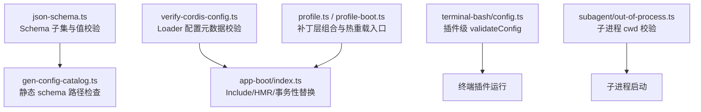
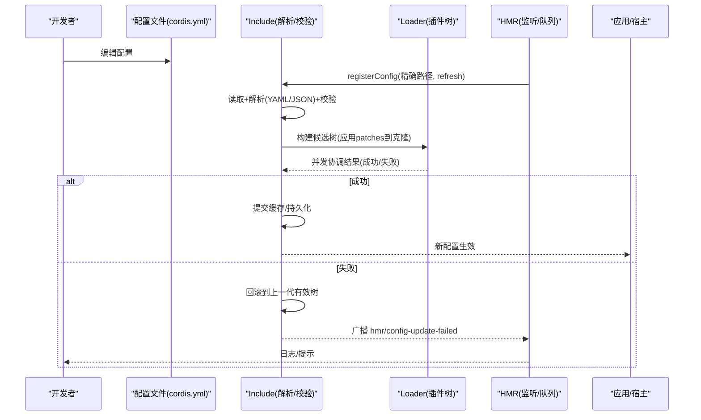
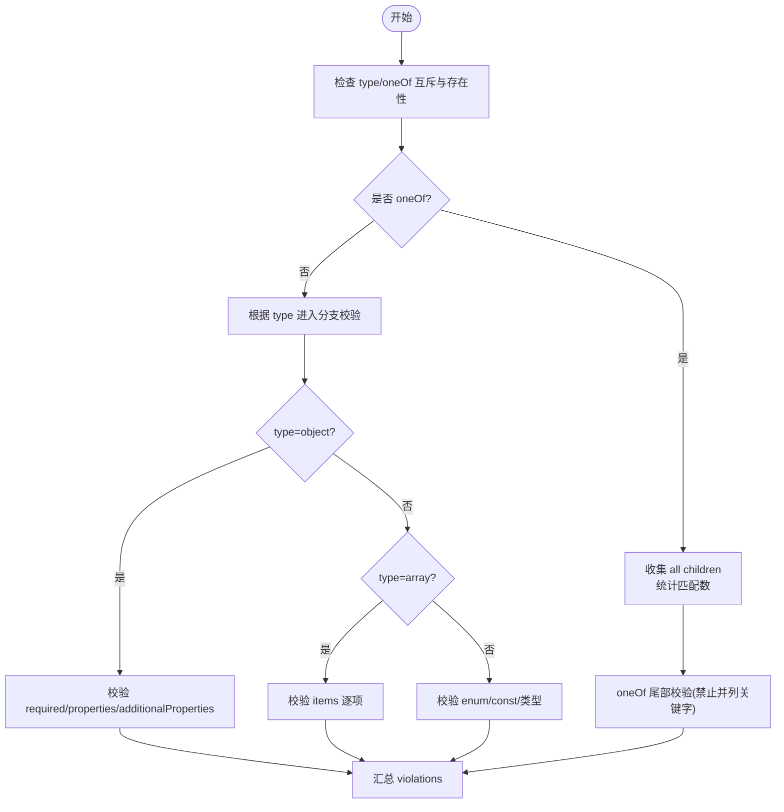
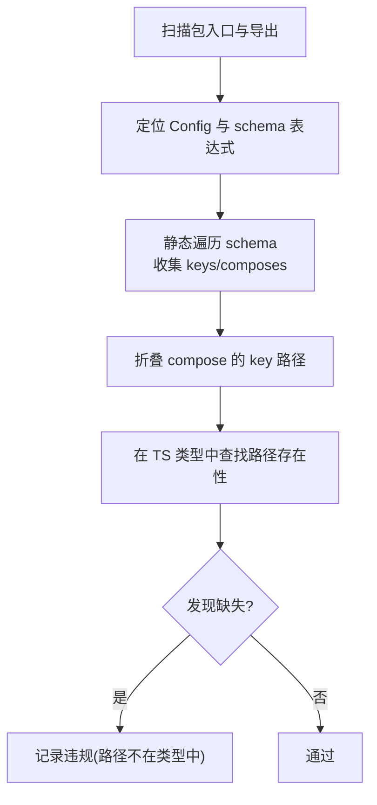
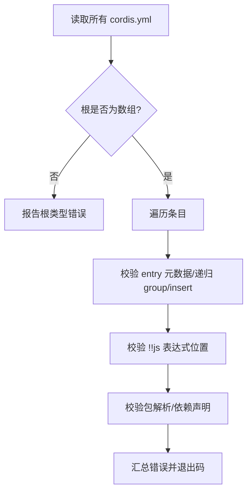
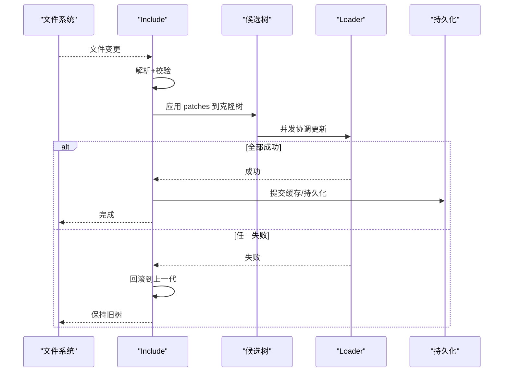
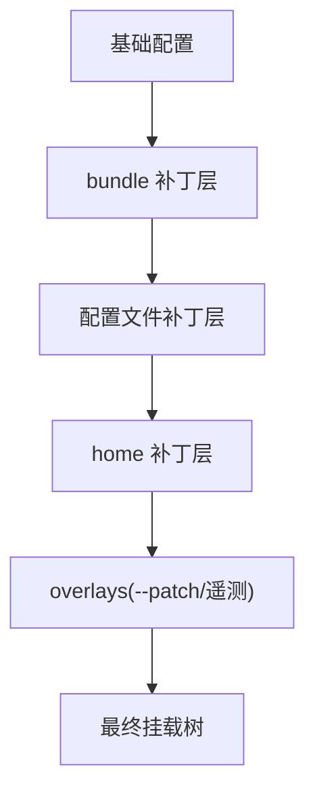
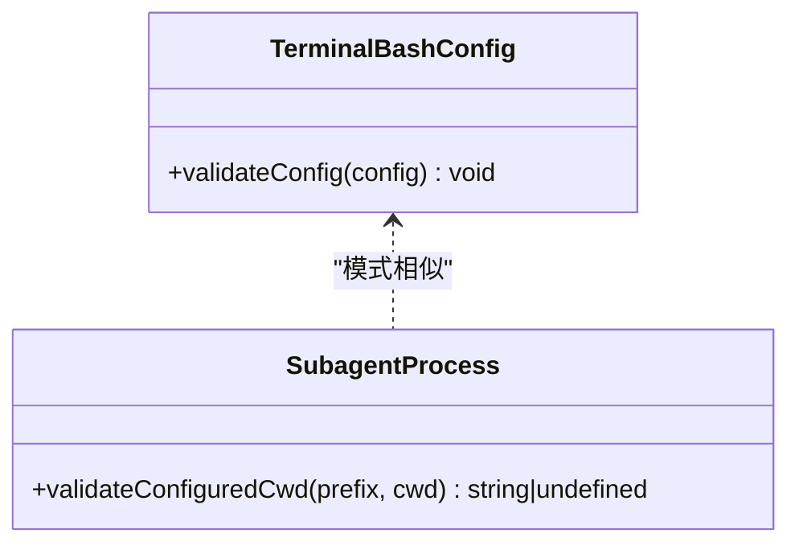
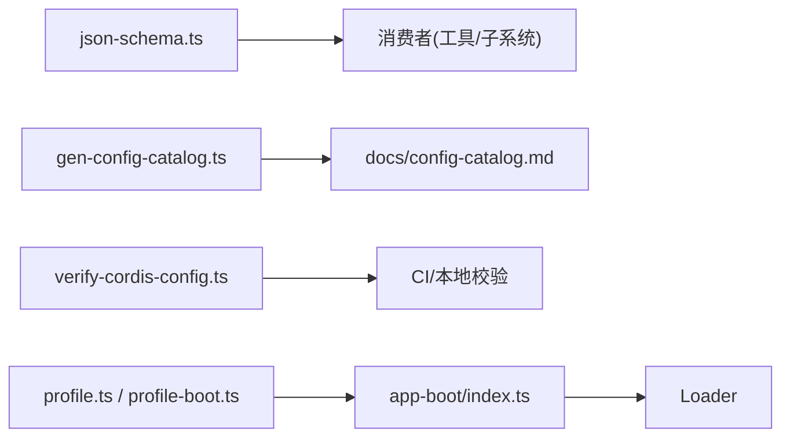

# 配置验证

<cite>
**本文引用的文件**
- [packages/core/tools/src/json-schema.ts](file://packages/core/tools/src/json-schema.ts)
- [scripts/gen-config-catalog.ts](file://scripts/gen-config-catalog.ts)
- [scripts/verify-cordis-config.ts](file://scripts/verify-cordis-config.ts)
- [packages/boot/app-boot/tests/config-reload.spec.ts](file://packages/boot/app-boot/tests/config-reload.spec.ts)
- [packages/boot/app-boot/src/index.ts](file://packages/boot/app-boot/src/index.ts)
- [packages/boot/app-boot/src/profile.ts](file://packages/boot/app-boot/src/profile.ts)
- [apps/cli/src/profile-boot.ts](file://apps/cli/src/profile-boot.ts)
- [packages/terminal/terminal-bash/src/config.ts](file://packages/terminal/terminal-bash/src/config.ts)
- [packages/subagent/subagent/src/out-of-process.ts](file://packages/subagent/subagent/src/out-of-process.ts)
</cite>

## 目录
1. [简介](#简介)
2. [项目结构](#项目结构)
3. [核心组件](#核心组件)
4. [架构总览](#架构总览)
5. [详细组件分析](#详细组件分析)
6. [依赖关系分析](#依赖关系分析)
7. [性能考量](#性能考量)
8. [故障排查指南](#故障排查指南)
9. [结论](#结论)
10. [附录](#附录)

## 简介
本文件系统化梳理仓库中的“配置验证”能力，覆盖以下主题：
- 配置参数的类型与格式校验机制（JSON Schema 子集、运行时值校验、静态 schema 路径检查）
- 配置加载过程中的错误检测与报告（解析失败、校验失败、应用失败与回滚）
- 配置热重载的实现原理与使用方式（Include.refresh、HMR 队列、事务性替换）
- 配置继承与覆盖机制（补丁层叠加、patch 顺序、include 嵌套）
- 自定义验证器的开发指南（包内 validateConfig、CLI 工具扩展）
- 配置错误的诊断工具与调试方法（dump、verify、schema 诊断）
- 最佳实践与常见错误解决方案

## 项目结构
围绕配置验证的关键位置如下：
- JSON Schema 子集与值校验器：packages/core/tools/src/json-schema.ts
- 配置目录生成与静态 schema-path 检查：scripts/gen-config-catalog.ts
- Cordis Loader 配置元数据校验：scripts/verify-cordis-config.ts
- 启动与热重载：packages/boot/app-boot/src/index.ts、profile.ts；apps/cli/src/profile-boot.ts
- 测试用例（覆盖解析失败、应用失败、回滚、覆盖层重放等）：packages/boot/app-boot/tests/config-reload.spec.ts
- 插件级配置校验示例：packages/terminal/terminal-bash/src/config.ts、packages/subagent/subagent/src/out-of-process.ts

图表来源
- [packages/core/tools/src/json-schema.ts:1-657](file://packages/core/tools/src/json-schema.ts#L1-L657)
- [scripts/gen-config-catalog.ts:422-500](file://scripts/gen-config-catalog.ts#L422-L500)
- [scripts/verify-cordis-config.ts:72-99](file://scripts/verify-cordis-config.ts#L72-L99)
- [packages/boot/app-boot/src/index.ts:367-397](file://packages/boot/app-boot/src/index.ts#L367-L397)
- [packages/boot/app-boot/src/profile.ts:405-420](file://packages/boot/app-boot/src/profile.ts#L405-L420)
- [apps/cli/src/profile-boot.ts:227-248](file://apps/cli/src/profile-boot.ts#L227-L248)
- [packages/terminal/terminal-bash/src/config.ts:66-66](file://packages/terminal/terminal-bash/src/config.ts#L66-L66)
- [packages/subagent/subagent/src/out-of-process.ts:93-93](file://packages/subagent/subagent/src/out-of-process.ts#L93-L93)

章节来源
- [packages/core/tools/src/json-schema.ts:1-657](file://packages/core/tools/src/json-schema.ts#L1-L657)
- [scripts/gen-config-catalog.ts:1-800](file://scripts/gen-config-catalog.ts#L1-L800)
- [scripts/verify-cordis-config.ts:1-498](file://scripts/verify-cordis-config.ts#L1-L498)
- [packages/boot/app-boot/tests/config-reload.spec.ts:1-432](file://packages/boot/app-boot/tests/config-reload.spec.ts#L1-L432)
- [packages/boot/app-boot/src/index.ts:367-397](file://packages/boot/app-boot/src/index.ts#L367-L397)
- [packages/boot/app-boot/src/profile.ts:405-420](file://packages/boot/app-boot/src/profile.ts#L405-L420)
- [apps/cli/src/profile-boot.ts:227-248](file://apps/cli/src/profile-boot.ts#L227-L248)
- [packages/terminal/terminal-bash/src/config.ts:66-66](file://packages/terminal/terminal-bash/src/config.ts#L66-L66)
- [packages/subagent/subagent/src/out-of-process.ts:93-93](file://packages/subagent/subagent/src/out-of-process.ts#L93-L93)

## 核心组件
- JSON Schema 子集与值校验器
  - 支持受控的 JSON Schema 关键字：type、oneOf、properties、required、additionalProperties、items、enum、const 及注释字段。
  - 提供 schema 合法性断言与值校验，返回按路径定位的错误集合，避免栈溢出（显式帧遍历）。
- 静态 schema 路径检查
  - 从包的导出中抽取 schemastery 表达式，收集键路径并折叠 compose 的 schema，再与 TypeScript 声明进行存在性比对，确保“loader 接受的字段”在文档粘贴中可见。
- Loader 配置元数据校验
  - 校验 cordis.yml 根为数组、条目对象、group/insert 递归结构、!!js 表达式仅允许出现在 disabled 等指定位置，并验证示例与应用层的包解析。
- 启动与热重载
  - Include 负责读取 YAML/JSON、校验、应用 patches 到克隆树、并发协调 Loader 变更、成功后才持久化缓存；失败时回滚并保持上一代有效树。
  - HMR 对精确路径监听、去抖合并刷新、广播失败事件，保证 UI 侧可观测且不影响后续刷新。
- 插件级配置校验
  - 各插件通过 validateConfig 函数进行参数范围、必填项、路径有效性等校验，并在 apply 前执行。

章节来源
- [packages/core/tools/src/json-schema.ts:1-657](file://packages/core/tools/src/json-schema.ts#L1-L657)
- [scripts/gen-config-catalog.ts:422-500](file://scripts/gen-config-catalog.ts#L422-L500)
- [scripts/verify-cordis-config.ts:72-99](file://scripts/verify-cordis-config.ts#L72-L99)
- [packages/boot/app-boot/tests/config-reload.spec.ts:61-85](file://packages/boot/app-boot/tests/config-reload.spec.ts#L61-L85)
- [packages/boot/app-boot/tests/config-reload.spec.ts:174-280](file://packages/boot/app-boot/tests/config-reload.spec.ts#L174-L280)
- [packages/boot/app-boot/tests/config-reload.spec.ts:282-388](file://packages/boot/app-boot/tests/config-reload.spec.ts#L282-L388)
- [packages/terminal/terminal-bash/src/config.ts:66-66](file://packages/terminal/terminal-bash/src/config.ts#L66-L66)
- [packages/subagent/subagent/src/out-of-process.ts:93-93](file://packages/subagent/subagent/src/out-of-process.ts#L93-L93)

## 架构总览
配置验证贯穿“静态检查—解析—校验—应用—热重载—回滚”的全链路：

图表来源
- [packages/boot/app-boot/tests/config-reload.spec.ts:61-85](file://packages/boot/app-boot/tests/config-reload.spec.ts#L61-L85)
- [packages/boot/app-boot/tests/config-reload.spec.ts:174-280](file://packages/boot/app-boot/tests/config-reload.spec.ts#L174-L280)
- [packages/boot/app-boot/tests/config-reload.spec.ts:282-388](file://packages/boot/app-boot/tests/config-reload.spec.ts#L282-L388)
- [packages/boot/app-boot/src/index.ts:367-397](file://packages/boot/app-boot/src/index.ts#L367-L397)

## 详细组件分析

### JSON Schema 子集与值校验器
- 支持的 schema 关键字与约束
  - type：object/array/string/number/integer/boolean/null
  - oneOf：至少两个分支，且不允许与 type 同时出现；oneOf 旁禁止 properties/required/additionalProperties/items/enum/const
  - object：properties、required（字符串数组）、additionalProperties（布尔）
  - array：items
  - scalar：enum（非空数组，元素类型匹配）、const（与 enum 共存时需属于枚举）
  - 注释字段：description/title/default/examples（需为无损 JSON）
- 值校验特性
  - 严格的路径诊断（如 value.a.b），oneOf 必须恰好匹配一个分支
  - 对象 additionalProperties=false 时拒绝未声明键
  - 数值限制为有限数，整数要求整型
- 复杂度
  - 以显式帧实现，避免递归导致的栈溢出；时间复杂度与 schema 节点数和待校验值大小线性相关

图表来源
- [packages/core/tools/src/json-schema.ts:202-376](file://packages/core/tools/src/json-schema.ts#L202-L376)
- [packages/core/tools/src/json-schema.ts:486-656](file://packages/core/tools/src/json-schema.ts#L486-L656)

章节来源
- [packages/core/tools/src/json-schema.ts:1-657](file://packages/core/tools/src/json-schema.ts#L1-L657)

### 静态 schema 路径检查（生成配置目录）
- 目标：确保运行时 schema 声明的每个键路径都能在 TypeScript 配置类型中找到对应成员，避免“loader 接受但文档不可见”的字段。
- 关键流程
  - 扫描包入口，识别 Config 类型与 schemastery 表达式
  - 静态遍历 object/array/intersect/union，收集键路径与 compose 的包名
  - 将 compose 的键路径折叠进当前包，再对每个路径执行存在性查找
  - 若路径在类型中不存在，则报告违规
- 输出：生成 docs/config-catalog.md，包含类型粘贴、依赖、源码链接等

图表来源
- [scripts/gen-config-catalog.ts:422-500](file://scripts/gen-config-catalog.ts#L422-L500)
- [scripts/gen-config-catalog.ts:730-767](file://scripts/gen-config-catalog.ts#L730-L767)

章节来源
- [scripts/gen-config-catalog.ts:1-800](file://scripts/gen-config-catalog.ts#L1-L800)

### Loader 配置元数据校验
- 校验点
  - 根必须是 Loader 条目数组
  - 每个条目为对象，支持 group/insert 递归校验
  - !!js 表达式仅在允许的位置出现（如 disabled），其他位置报错
  - 示例与应用层插件依赖解析一致性检查
- 作用：尽早暴露不合法的 Loader 配置，避免运行时歧义或崩溃

图表来源
- [scripts/verify-cordis-config.ts:72-99](file://scripts/verify-cordis-config.ts#L72-L99)
- [scripts/verify-cordis-config.ts:200-231](file://scripts/verify-cordis-config.ts#L200-L231)
- [scripts/verify-cordis-config.ts:416-472](file://scripts/verify-cordis-config.ts#L416-L472)

章节来源
- [scripts/verify-cordis-config.ts:1-498](file://scripts/verify-cordis-config.ts#L1-L498)

### 配置热重载与事务性替换
- Include.refresh 流程
  - 读取并解析新的 YAML/JSON，校验结构
  - 基于克隆树应用 patches，构建候选 Loader 树
  - 并发协调所有条目更新（导入、应用、移动、删除）
  - 全部成功后提交缓存与持久化；任一失败则回滚到上一代有效树
- HMR 集成
  - 注册精确路径监听，串行化并合并刷新请求
  - 失败归一化为 Error，广播 hmr/config-update-failed，不影响后续刷新
- 行为保障
  - 初始加载失败即抛错；refresh 失败保留上次有效状态
  - 覆盖层（bundle/user/--patch）顺序固定，用户层无法覆盖内置层

图表来源
- [packages/boot/app-boot/tests/config-reload.spec.ts:61-85](file://packages/boot/app-boot/tests/config-reload.spec.ts#L61-L85)
- [packages/boot/app-boot/tests/config-reload.spec.ts:174-280](file://packages/boot/app-boot/tests/config-reload.spec.ts#L174-L280)
- [packages/boot/app-boot/tests/config-reload.spec.ts:282-388](file://packages/boot/app-boot/tests/config-reload.spec.ts#L282-L388)
- [packages/boot/app-boot/src/index.ts:367-397](file://packages/boot/app-boot/src/index.ts#L367-L397)

章节来源
- [packages/boot/app-boot/tests/config-reload.spec.ts:1-432](file://packages/boot/app-boot/tests/config-reload.spec.ts#L1-L432)
- [packages/boot/app-boot/src/index.ts:367-397](file://packages/boot/app-boot/src/index.ts#L367-L397)

### 配置继承与覆盖机制
- 补丁层顺序（由低到高）
  - bundle 层 → 配置文件自身 → home 层 → overlays（--patch、遥测开关等）
- 规则
  - 后一层可覆盖/禁用前一层插入的行
  - patches 不会跨越 include 边界
  - 每次重新读取都会重新应用 patches，保证与初始加载一致
- 动态组合
  - 热重载时，用户层与 overlays 会被重新组合，避免复用已变异的 patch 对象

图表来源
- [apps/cli/src/profile-boot.ts:227-248](file://apps/cli/src/profile-boot.ts#L227-L248)
- [packages/boot/app-boot/src/profile.ts:405-420](file://packages/boot/app-boot/src/profile.ts#L405-L420)
- [packages/boot/app-boot/tests/config-reload.spec.ts:282-388](file://packages/boot/app-boot/tests/config-reload.spec.ts#L282-L388)

章节来源
- [apps/cli/src/profile-boot.ts:227-248](file://apps/cli/src/profile-boot.ts#L227-L248)
- [packages/boot/app-boot/src/profile.ts:405-420](file://packages/boot/app-boot/src/profile.ts#L405-L420)
- [packages/boot/app-boot/tests/config-reload.spec.ts:282-388](file://packages/boot/app-boot/tests/config-reload.spec.ts#L282-L388)

### 插件级配置校验与自定义验证器
- 插件应提供 validateConfig(config): asserts config is ResolvedConfig
  - 校验必填字段、取值范围、路径有效性等
  - 在 apply 之前调用，失败则阻止插件启动
- 示例
  - 终端 bash 插件：校验 backendType、shellPath 等
  - 子进程：校验 cwd 为空/相对路径处理

图表来源
- [packages/terminal/terminal-bash/src/config.ts:66-66](file://packages/terminal/terminal-bash/src/config.ts#L66-L66)
- [packages/subagent/subagent/src/out-of-process.ts:93-93](file://packages/subagent/subagent/src/out-of-process.ts#L93-L93)

章节来源
- [packages/terminal/terminal-bash/src/config.ts:66-66](file://packages/terminal/terminal-bash/src/config.ts#L66-L66)
- [packages/subagent/subagent/src/out-of-process.ts:93-93](file://packages/subagent/subagent/src/out-of-process.ts#L93-L93)

## 依赖关系分析
- json-schema.ts 被多处用于值校验（工具输出、结构化输出等）
- gen-config-catalog.ts 依赖 TypeScript 编译器 API 与 JSDoc 解析，产出文档与静态检查
- verify-cordis-config.ts 依赖 js-yaml 与 tsconfig 解析，校验 Loader 配置与包解析
- app-boot 与 CLI profile 组合补丁层，驱动 Include 与 Loader 的热重载
- 插件通过 validateConfig 与系统校验形成互补

图表来源
- [packages/core/tools/src/json-schema.ts:1-657](file://packages/core/tools/src/json-schema.ts#L1-L657)
- [scripts/gen-config-catalog.ts:1-800](file://scripts/gen-config-catalog.ts#L1-L800)
- [scripts/verify-cordis-config.ts:1-498](file://scripts/verify-cordis-config.ts#L1-L498)
- [packages/boot/app-boot/src/index.ts:367-397](file://packages/boot/app-boot/src/index.ts#L367-L397)
- [packages/boot/app-boot/src/profile.ts:405-420](file://packages/boot/app-boot/src/profile.ts#L405-L420)
- [apps/cli/src/profile-boot.ts:227-248](file://apps/cli/src/profile-boot.ts#L227-L248)

章节来源
- [packages/core/tools/src/json-schema.ts:1-657](file://packages/core/tools/src/json-schema.ts#L1-L657)
- [scripts/gen-config-catalog.ts:1-800](file://scripts/gen-config-catalog.ts#L1-L800)
- [scripts/verify-cordis-config.ts:1-498](file://scripts/verify-cordis-config.ts#L1-L498)
- [packages/boot/app-boot/src/index.ts:367-397](file://packages/boot/app-boot/src/index.ts#L367-L397)
- [packages/boot/app-boot/src/profile.ts:405-420](file://packages/boot/app-boot/src/profile.ts#L405-L420)
- [apps/cli/src/profile-boot.ts:227-248](file://apps/cli/src/profile-boot.ts#L227-L248)

## 性能考量
- JSON Schema 值校验采用显式帧遍历，避免深层嵌套导致的栈溢出，适合大配置与复杂 schema
- Include.refresh 并发协调条目更新，减少串行等待；失败时快速回滚，避免长时间占用资源
- HMR 队列串行化刷新，防止频繁写入导致抖动
- 静态 schema 路径检查在构建期运行，不增加运行时开销

[本节为通用指导，无需特定文件引用]

## 故障排查指南
- 解析失败
  - 现象：Include.refresh 抛出“failed to parse config file”
  - 原因：YAML/JSON 语法错误或根不是数组
  - 处理：修正语法，确保根为 Loader 条目数组
- 校验失败
  - 现象：Include.refresh 抛出“failed to validate config file”
  - 原因：根不是数组、条目结构不符合预期
  - 处理：依据错误信息修复条目结构
- 应用失败与回滚
  - 现象：更新某 entry 失败（import/apply），保留上一代有效树
  - 原因：模块导入失败、插件 apply 抛错、配置非法
  - 处理：修复模块或配置后重试；查看日志定位具体阶段
- 覆盖层问题
  - 现象：用户层无法覆盖 bundle 插入的行
  - 原因：补丁层顺序固定，需确认 id 与层级
  - 处理：调整 patches 顺序或使用 disable/id 精准覆盖
- 诊断工具
  - 使用 renderConfigDump 输出最终组合后的配置清单
  - 使用 verify-cordis-config 校验 Loader 配置与包解析
  - 使用 gen-config-catalog 检查 schema 与类型一致性

章节来源
- [packages/boot/app-boot/tests/config-reload.spec.ts:61-85](file://packages/boot/app-boot/tests/config-reload.spec.ts#L61-L85)
- [packages/boot/app-boot/tests/config-reload.spec.ts:174-280](file://packages/boot/app-boot/tests/config-reload.spec.ts#L174-L280)
- [packages/boot/app-boot/tests/config-reload.spec.ts:282-388](file://packages/boot/app-boot/tests/config-reload.spec.ts#L282-L388)
- [packages/boot/app-boot/src/index.ts:367-397](file://packages/boot/app-boot/src/index.ts#L367-L397)
- [scripts/verify-cordis-config.ts:72-99](file://scripts/verify-cordis-config.ts#L72-L99)
- [scripts/gen-config-catalog.ts:730-767](file://scripts/gen-config-catalog.ts#L730-L767)

## 结论
该仓库通过“静态 schema 检查 + 运行时值校验 + Loader 元数据校验 + 事务性热重载”的多层机制，实现了高可靠、可观测、可回滚的配置体系。插件可通过 validateConfig 扩展校验逻辑，配合 dump/verify 工具链，快速定位与修复配置问题。遵循补丁层顺序与覆盖规则，可在多环境、多角色场景下安全地演进配置。

[本节为总结，无需特定文件引用]

## 附录
- 最佳实践
  - 始终为插件提供 validateConfig，明确必填与取值范围
  - 使用 oneOf 表达互斥配置，避免歧义
  - 谨慎使用 additionalProperties=false，避免意外键被忽略
  - 在 include 中使用 patches 分层管理默认与覆盖，保持顺序清晰
  - 利用 HMR 进行增量修改，关注失败事件与日志
- 常见错误与解决
  - required 指向未声明属性：修正 required 列表或补充 properties
  - oneOf 与 type 同时声明：移除其一
  - enum/const 类型不匹配：统一为标量类型
  - 插件 apply 抛错：检查配置与依赖，必要时回滚并重试
  - 包解析失败：确保依赖声明与 tsconfig paths 正确

[本节为通用指导，无需特定文件引用]