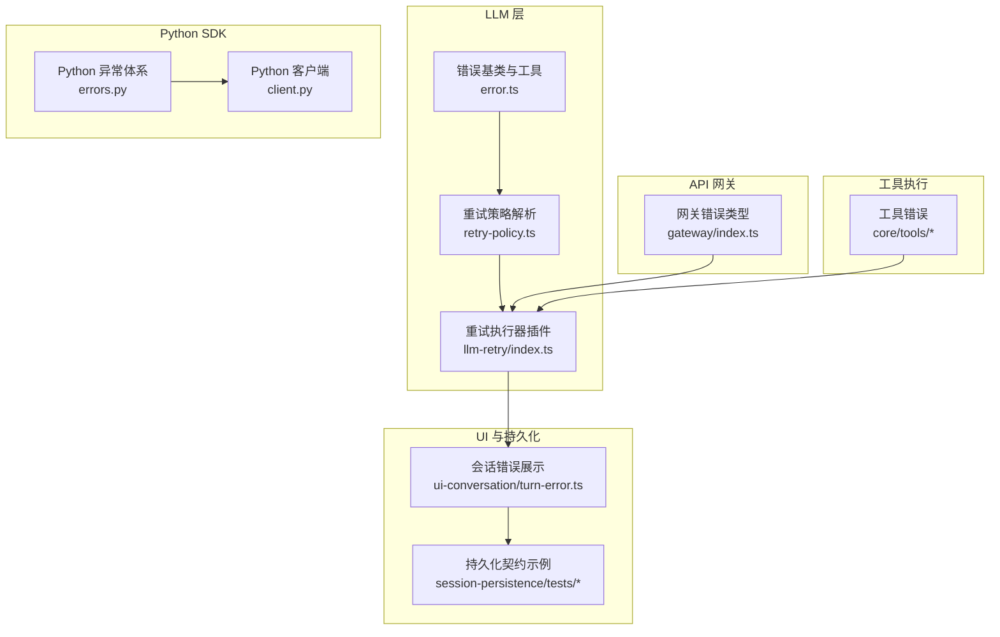
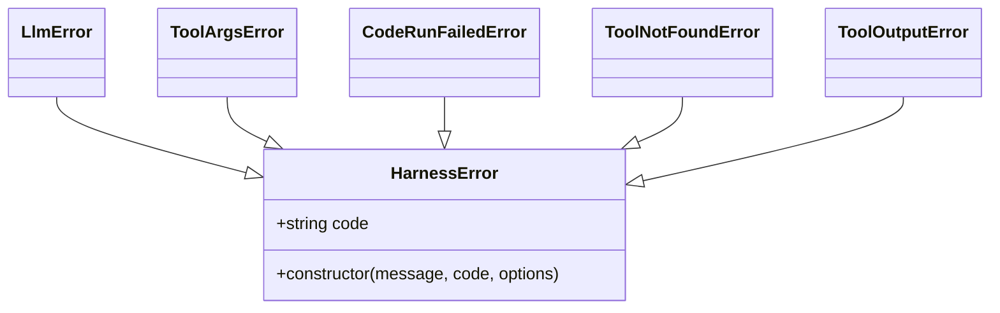
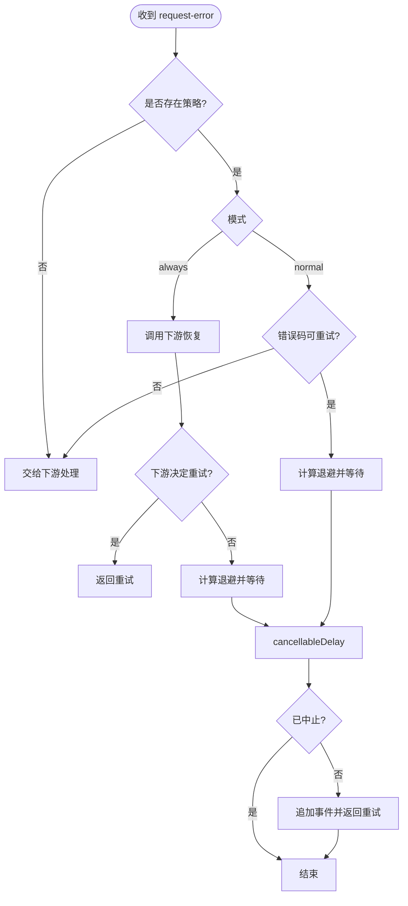
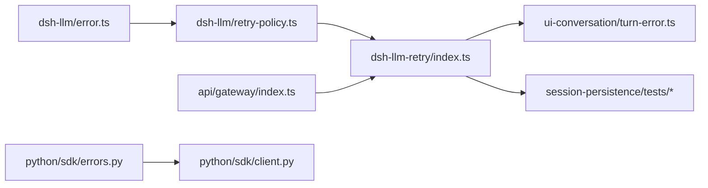

# 错误处理

<cite>
**本文引用的文件**
- [packages/llm/llm/src/error.ts](file://packages/llm/llm/src/error.ts)
- [packages/llm/llm/src/retry-policy.ts](file://packages/llm/llm/src/retry-policy.ts)
- [packages/llm/llm-retry/src/index.ts](file://packages/llm/llm-retry/src/index.ts)
- [packages/api/gateway/src/index.ts](file://packages/api/gateway/src/index.ts)
- [python/sdk/src/deepseek_harness/errors.py](file://python/sdk/src/deepseek_harness/errors.py)
- [python/sdk/src/deepseek_harness/client.py](file://python/sdk/src/deepseek_harness/client.py)
- [packages/core/tools/src/code-mode.ts](file://packages/core/tools/src/code-mode.ts)
- [packages/core/tools/src/index.ts](file://packages/core/tools/src/index.ts)
- [packages/client/ui-conversation/src/client/conversation-nodes/turn-error.ts](file://packages/client/ui-conversation/src/client/conversation-nodes/turn-error.ts)
- [packages/session/session-persistence/tests/coordinator-contract.ts](file://packages/session/session-persistence/tests/coordinator-contract.ts)
</cite>

## 目录
1. [简介](#简介)
2. [项目结构](#项目结构)
3. [核心组件](#核心组件)
4. [架构总览](#架构总览)
5. [详细组件分析](#详细组件分析)
6. [依赖关系分析](#依赖关系分析)
7. [性能考量](#性能考量)
8. [故障排查指南](#故障排查指南)
9. [结论](#结论)
10. [附录](#附录)

## 简介
本文件系统化梳理 SDK 与相关子系统的错误处理机制，覆盖异常层次、错误分类、网络/协议/业务错误的处理策略、重试与退避配置、日志记录与调试技巧、自定义错误捕获与最佳实践。目标是帮助开发者在跨语言（TypeScript/Python）和跨进程边界中稳定地识别、分类、恢复并记录错误。

## 项目结构
围绕错误处理的关键代码分布在以下模块：
- LLM 层错误基类与工具函数：定义统一错误基类、错误码常量、上下文溢出/配额耗尽识别、错误链渲染等。
- 重试策略与执行器：提供可配置的“正常模式”和“始终重试”两种策略，以及指数退避与抖动实现。
- API 网关错误：用于远端调用边界的结构化错误类型。
- Python SDK 异常体系：SDK 与运行时通信的异常分层。
- 工具执行错误：将工具执行失败以结构化方式上报。
- UI 展示：会话中的错误事件如何被消费并呈现给用户。
- 持久化测试契约：验证 turn/end 事件中错误字段的结构与兼容性。



**图示来源**
- [packages/llm/llm/src/error.ts:1-164](file://packages/llm/llm/src/error.ts#L1-L164)
- [packages/llm/llm/src/retry-policy.ts:1-192](file://packages/llm/llm/src/retry-policy.ts#L1-L192)
- [packages/llm/llm-retry/src/index.ts:1-227](file://packages/llm/llm-retry/src/index.ts#L1-L227)
- [packages/api/gateway/src/index.ts:43-71](file://packages/api/gateway/src/index.ts#L43-L71)
- [python/sdk/src/deepseek_harness/errors.py:1-24](file://python/sdk/src/deepseek_harness/errors.py#L1-L24)
- [python/sdk/src/deepseek_harness/client.py:223-223](file://python/sdk/src/deepseek_harness/client.py#L223-L223)
- [packages/core/tools/src/code-mode.ts:139-139](file://packages/core/tools/src/code-mode.ts#L139-L139)
- [packages/core/tools/src/index.ts:494-513](file://packages/core/tools/src/index.ts#L494-L513)
- [packages/client/ui-conversation/src/client/conversation-nodes/turn-error.ts:39-61](file://packages/client/ui-conversation/src/client/conversation-nodes/turn-error.ts#L39-L61)
- [packages/session/session-persistence/tests/coordinator-contract.ts:172-198](file://packages/session/session-persistence/tests/coordinator-contract.ts#L172-L198)

**章节来源**
- [packages/llm/llm/src/error.ts:1-164](file://packages/llm/llm/src/error.ts#L1-L164)
- [packages/llm/llm/src/retry-policy.ts:1-192](file://packages/llm/llm/src/retry-policy.ts#L1-L192)
- [packages/llm/llm-retry/src/index.ts:1-227](file://packages/llm/llm-retry/src/index.ts#L1-L227)
- [packages/api/gateway/src/index.ts:43-71](file://packages/api/gateway/src/index.ts#L43-L71)
- [python/sdk/src/deepseek_harness/errors.py:1-24](file://python/sdk/src/deepseek_harness/errors.py#L1-L24)
- [python/sdk/src/deepseek_harness/client.py:223-223](file://python/sdk/src/deepseek_harness/client.py#L223-L223)
- [packages/core/tools/src/code-mode.ts:139-139](file://packages/core/tools/src/code-mode.ts#L139-L139)
- [packages/core/tools/src/index.ts:494-513](file://packages/core/tools/src/index.ts#L494-L513)
- [packages/client/ui-conversation/src/client/conversation-nodes/turn-error.ts:39-61](file://packages/client/ui-conversation/src/client/conversation-nodes/turn-error.ts#L39-L61)
- [packages/session/session-persistence/tests/coordinator-contract.ts:172-198](file://packages/session/session-persistence/tests/coordinator-contract.ts#L172-L198)

## 核心组件
- 统一错误基类与工具
  - 提供稳定的机器可读错误码 code 与人类可读 message 分离；支持 cause 链；name 默认子类名；提供 isHarnessError 类型收窄与 errorChain 渲染。
  - 预置关键错误码：上下文窗口超限、配额耗尽、空响应、无效凭据等；并提供 provider 无关的文本匹配判定函数。
- 重试策略与执行器
  - 策略解析：支持 normal（按错误码重试）与 always（无界重试）两种模式；内置指数退避与对称抖动；严格校验配置键与取值范围。
  - 执行器：监听 agent/request-error 扩展点，依据策略决定是否重试；尊重 providerRetryAfterMs；输出 llm/retry 与 llm/retry-started 事件；支持中止信号与生命周期管理。
- API 网关错误
  - 结构化错误包含 code、endpoint、field，便于定位远端调用失败位置。
- Python SDK 异常
  - 分层异常：基础 HarnessError、TransportClosedError、SdkProtocolError、JsonRpcError；JSON-RPC 错误携带 code/message/data。
- 工具执行错误
  - 工具执行失败以 HarnessError 派生类型上报，确保 code 可路由。
- UI 与持久化
  - UI 从 turn/end 事件的 reason.error 提取 code 与 message 进行展示；持久化契约保证错误字段兼容。

**章节来源**
- [packages/llm/llm/src/error.ts:1-164](file://packages/llm/llm/src/error.ts#L1-L164)
- [packages/llm/llm/src/retry-policy.ts:1-192](file://packages/llm/llm/src/retry-policy.ts#L1-L192)
- [packages/llm/llm-retry/src/index.ts:1-227](file://packages/llm/llm-retry/src/index.ts#L1-L227)
- [packages/api/gateway/src/index.ts:43-71](file://packages/api/gateway/src/index.ts#L43-L71)
- [python/sdk/src/deepseek_harness/errors.py:1-24](file://python/sdk/src/deepseek_harness/errors.py#L1-L24)
- [packages/core/tools/src/code-mode.ts:139-139](file://packages/core/tools/src/code-mode.ts#L139-L139)
- [packages/core/tools/src/index.ts:494-513](file://packages/core/tools/src/index.ts#L494-L513)
- [packages/client/ui-conversation/src/client/conversation-nodes/turn-error.ts:39-61](file://packages/client/ui-conversation/src/client/conversation-nodes/turn-error.ts#L39-L61)
- [packages/session/session-persistence/tests/coordinator-contract.ts:172-198](file://packages/session/session-persistence/tests/coordinator-contract.ts#L172-L198)

## 架构总览
下图展示了错误从产生到重试决策再到 UI/持久化的端到端流程。

```mermaid
sequenceDiagram
participant Provider as "模型提供方"
participant Adapter as "适配器"
participant Loop as "Agent 循环"
participant Retry as "重试插件"
participant Policy as "策略解析"
participant UI as "UI 展示"
participant Store as "持久化"
Adapter->>Loop : 抛出 LlmFailure(含 code, status, providerRetryAfterMs)
Loop->>Retry : 触发 agent/request-error
Retry->>Policy : 读取 retryPolicy(mode, codes, backoff)
alt 允许重试
Retry->>Provider : 等待退避后重试
Provider-->>Retry : 成功或再次失败
else 不重试
Retry-->>Loop : 返回非重试动作
end
Loop-->>UI : turn/end.reason.error{code,message,...}
UI-->>Store : 写入会话事件
```

**图示来源**
- [packages/llm/llm-retry/src/index.ts:156-208](file://packages/llm/llm-retry/src/index.ts#L156-L208)
- [packages/llm/llm/src/retry-policy.ts:145-191](file://packages/llm/llm/src/retry-policy.ts#L145-L191)
- [packages/client/ui-conversation/src/client/conversation-nodes/turn-error.ts:39-61](file://packages/client/ui-conversation/src/client/conversation-nodes/turn-error.ts#L39-L61)
- [packages/session/session-persistence/tests/coordinator-contract.ts:172-198](file://packages/session/session-persistence/tests/coordinator-contract.ts#L172-L198)

## 详细组件分析

### 错误基类与工具（TypeScript）
- 设计要点
  - 所有 harness 错误继承统一基类，携带稳定 code 与可选 cause 链；name 自动为子类名。
  - 提供 provider 无关的错误分类辅助：上下文窗口超限、配额耗尽、空响应、无效凭据等。
  - errorChain 安全渲染完整 cause 链与 AggregateError 成员，避免重复与循环引用。
  - isHarnessError 用于跨边界类型收窄。
- 使用建议
  - 消费方应基于 code 分支，而非解析 message。
  - 诊断面（日志、通知）可使用 errorChain；控制流不要解析其结果。



**图示来源**
- [packages/llm/llm/src/error.ts:13-22](file://packages/llm/llm/src/error.ts#L13-L22)
- [packages/core/tools/src/code-mode.ts:139-139](file://packages/core/tools/src/code-mode.ts#L139-L139)
- [packages/core/tools/src/index.ts:494-513](file://packages/core/tools/src/index.ts#L494-L513)

**章节来源**
- [packages/llm/llm/src/error.ts:1-164](file://packages/llm/llm/src/error.ts#L1-L164)
- [packages/core/tools/src/code-mode.ts:139-139](file://packages/core/tools/src/code-mode.ts#L139-L139)
- [packages/core/tools/src/index.ts:494-513](file://packages/core/tools/src/index.ts#L494-L513)

### 重试策略与执行器
- 策略解析
  - 两种模式：normal（仅对指定错误码重试）、always（无界重试）。
  - 退避参数：initialDelayMs、maxDelayMs、jitterRatio；严格校验取值范围与键名。
  - 默认可重试码包括空响应、速率限制、服务端错误、超时、传输错误。
- 执行器行为
  - 监听 agent/request-error，若策略允许则计算退避延迟（优先使用 providerRetryAfterMs），追加 llm/retry 与 llm/retry-started 事件，返回重试动作。
  - 支持 AbortSignal 取消；插件销毁时中止并清理活跃操作。
  - always 模式下会先尝试下游专用恢复，再决定是否重试。



**图示来源**
- [packages/llm/llm-retry/src/index.ts:156-208](file://packages/llm/llm-retry/src/index.ts#L156-L208)
- [packages/llm/llm-retry/src/index.ts:78-91](file://packages/llm/llm-retry/src/index.ts#L78-L91)
- [packages/llm/llm/src/retry-policy.ts:145-191](file://packages/llm/llm/src/retry-policy.ts#L145-L191)

**章节来源**
- [packages/llm/llm-retry/src/index.ts:1-227](file://packages/llm/llm-retry/src/index.ts#L1-L227)
- [packages/llm/llm/src/retry-policy.ts:1-192](file://packages/llm/llm/src/retry-policy.ts#L1-L192)

### API 网关错误
- 用途：封装远端调用过程中产生的非业务方法错误，包含稳定 code、端点标识、影响字段。
- 建议：在网关层统一构造，避免敏感值进入 message；通过 cause 保留原始错误。

**章节来源**
- [packages/api/gateway/src/index.ts:43-71](file://packages/api/gateway/src/index.ts#L43-L71)

### Python SDK 异常体系
- 分层：
  - HarnessError：SDK/运行时通用基类。
  - TransportClosedError：运行时子进程退出或 stdout 关闭。
  - SdkProtocolError：运行时发送了超出协议的数据。
  - JsonRpcError：JSON-RPC 错误响应，携带 code/message/data。
- 客户端侧会将错误序列化为 JSON-RPC 错误对象，便于上层统一处理。

**章节来源**
- [python/sdk/src/deepseek_harness/errors.py:1-24](file://python/sdk/src/deepseek_harness/errors.py#L1-L24)
- [python/sdk/src/deepseek_harness/client.py:223-223](file://python/sdk/src/deepseek_harness/client.py#L223-L223)

### 工具执行错误
- 工具执行失败以 HarnessError 派生类型上报，确保 code 可路由，便于重试/沙箱插件与回放系统消费。

**章节来源**
- [packages/core/tools/src/code-mode.ts:139-139](file://packages/core/tools/src/code-mode.ts#L139-L139)
- [packages/core/tools/src/index.ts:494-513](file://packages/core/tools/src/index.ts#L494-L513)

### UI 展示与持久化
- UI 从 turn/end 事件的 reason.error 中提取 code 与 message 显示；隐藏已被重试的失败行。
- 持久化契约示例验证错误字段结构兼容，包括 providerRetryAfterMs、status、requestId 等。

**章节来源**
- [packages/client/ui-conversation/src/client/conversation-nodes/turn-error.ts:39-61](file://packages/client/ui-conversation/src/client/conversation-nodes/turn-error.ts#L39-L61)
- [packages/session/session-persistence/tests/coordinator-contract.ts:172-198](file://packages/session/session-persistence/tests/coordinator-contract.ts#L172-L198)

## 依赖关系分析
- 低耦合高内聚
  - LLM 错误基类位于 dsh-llm（叶子包），被其他包导入而不引入新依赖边。
  - 重试执行器依赖策略解析与 LLM 失败类型，但不反向依赖具体提供者。
  - UI 与持久化仅消费标准化事件，不感知内部错误类型。
- 外部集成点
  - 网络层错误由适配器转换为 LlmFailure（含 code/status/providerRetryAfterMs）。
  - Python SDK 通过 JSON-RPC 错误与宿主交互。



**图示来源**
- [packages/llm/llm/src/error.ts:1-164](file://packages/llm/llm/src/error.ts#L1-L164)
- [packages/llm/llm/src/retry-policy.ts:1-192](file://packages/llm/llm/src/retry-policy.ts#L1-L192)
- [packages/llm/llm-retry/src/index.ts:1-227](file://packages/llm/llm-retry/src/index.ts#L1-L227)
- [packages/api/gateway/src/index.ts:43-71](file://packages/api/gateway/src/index.ts#L43-L71)
- [python/sdk/src/deepseek_harness/errors.py:1-24](file://python/sdk/src/deepseek_harness/errors.py#L1-L24)
- [python/sdk/src/deepseek_harness/client.py:223-223](file://python/sdk/src/deepseek_harness/client.py#L223-L223)
- [packages/client/ui-conversation/src/client/conversation-nodes/turn-error.ts:39-61](file://packages/client/ui-conversation/src/client/conversation-nodes/turn-error.ts#L39-L61)
- [packages/session/session-persistence/tests/coordinator-contract.ts:172-198](file://packages/session/session-persistence/tests/coordinator-contract.ts#L172-L198)

**章节来源**
- [packages/llm/llm/src/error.ts:1-164](file://packages/llm/llm/src/error.ts#L1-L164)
- [packages/llm/llm/src/retry-policy.ts:1-192](file://packages/llm/llm/src/retry-policy.ts#L1-L192)
- [packages/llm/llm-retry/src/index.ts:1-227](file://packages/llm/llm-retry/src/index.ts#L1-L227)
- [packages/api/gateway/src/index.ts:43-71](file://packages/api/gateway/src/index.ts#L43-L71)
- [python/sdk/src/deepseek_harness/errors.py:1-24](file://python/sdk/src/deepseek_harness/errors.py#L1-L24)
- [python/sdk/src/deepseek_harness/client.py:223-223](file://python/sdk/src/deepseek_harness/client.py#L223-L223)
- [packages/client/ui-conversation/src/client/conversation-nodes/turn-error.ts:39-61](file://packages/client/ui-conversation/src/client/conversation-nodes/turn-error.ts#L39-L61)
- [packages/session/session-persistence/tests/coordinator-contract.ts:172-198](file://packages/session/session-persistence/tests/coordinator-contract.ts#L172-L198)

## 性能考量
- 退避上限与抖动
  - 最大延迟受全局定时器上限约束；抖动比例控制在 0~1 之间，避免雪崩。
- 重试次数
  - normal 模式默认最多重试 2 次；可通过配置调整，但需避免无限重试导致资源耗尽。
- 事件开销
  - 每次重试都会追加事件，注意在高吞吐场景下合理设置 maxRetries 与 backoff。
- 取消与生命周期
  - 使用 AbortSignal 及时中断等待，避免无用计时器占用资源。

[本节为通用指导，不直接分析具体文件]

## 故障排查指南
- 快速定位
  - 查看 turn/end 事件的 reason.error.code 与 message，结合 UI 展示的失败行。
  - 检查 llm/retry 与 llm/retry-started 事件，确认是否触发了重试及退避时长。
- 常见错误分类与处理
  - 网络/传输错误（如 TRANSPORT/TIMEOUT）：通常可重试；关注 providerRetryAfterMs。
  - 协议错误（Python SDK 的 SdkProtocolError/JsonRpcError）：检查运行时通信协议与消息格式。
  - 业务逻辑错误（如 INVALID_CREDENTIAL、CONTEXT_WINDOW_EXCEEDED、QUOTA）：不应重试或需特殊处理（修正配置/裁剪输入/联系账户管理员）。
- 调试技巧
  - 使用 errorChain 打印完整 cause 链，避免丢失底层原因。
  - 在网关层使用 TypertGatewayError 的 endpoint/field 精确定位失败位置。
  - 在 Python 侧捕获 JsonRpcError 的 code/message/data 进行诊断。
- 自定义错误
  - TypeScript：继承 HarnessError 并设置稳定 code；在 catch 中用 isHarnessError 收窄。
  - Python：继承 HarnessError 或更具体的异常类型；在客户端统一转换为 JSON-RPC 错误对象。

**章节来源**
- [packages/llm/llm/src/error.ts:1-164](file://packages/llm/llm/src/error.ts#L1-L164)
- [packages/api/gateway/src/index.ts:43-71](file://packages/api/gateway/src/index.ts#L43-L71)
- [python/sdk/src/deepseek_harness/errors.py:1-24](file://python/sdk/src/deepseek_harness/errors.py#L1-L24)
- [python/sdk/src/deepseek_harness/client.py:223-223](file://python/sdk/src/deepseek_harness/client.py#L223-L223)
- [packages/client/ui-conversation/src/client/conversation-nodes/turn-error.ts:39-61](file://packages/client/ui-conversation/src/client/conversation-nodes/turn-error.ts#L39-L61)

## 结论
本仓库通过统一的错误基类、稳定的错误码、可配置的重试策略与执行器，实现了跨语言、跨进程的稳定错误处理链路。建议在开发中遵循以下原则：
- 始终使用稳定 code 进行分支判断，message 仅用于诊断与展示。
- 根据错误性质选择重试策略：瞬态错误可重试，配额/凭据/上下文等终端错误应快速失败或走专门修复路径。
- 充分利用 providerRetryAfterMs 与退避配置，避免过载。
- 在网关与 SDK 边界统一构造结构化错误，便于追踪与回放。
- 借助 errorChain 与事件流进行问题定位与复盘。

[本节为总结性内容，不直接分析具体文件]

## 附录
- 重试与退避配置要点
  - initialDelayMs：初始退避时间，必须为正数且不超过全局上限。
  - maxDelayMs：最大退避时间，防止延迟过大。
  - jitterRatio：抖动比例，0~1 之间，降低并发重试风暴风险。
  - mode：normal（按错误码重试）或 always（无界重试）。
  - retryableCodes：normal 模式下允许重试的错误码集合，不能为空且去重。
- 最佳实践清单
  - 适配器将网络/协议错误映射为 LlmFailure，填充 code/status/providerRetryAfterMs。
  - 工具执行失败以 HarnessError 派生类型上报，保持 code 可路由。
  - UI 消费 turn/end.reason.error 展示用户可见信息；隐藏已被重试的行。
  - Python SDK 将运行时错误转为 JSON-RPC 错误对象，便于上层统一处理。

**章节来源**
- [packages/llm/llm/src/retry-policy.ts:145-191](file://packages/llm/llm/src/retry-policy.ts#L145-L191)
- [packages/llm/llm-retry/src/index.ts:156-208](file://packages/llm/llm-retry/src/index.ts#L156-L208)
- [packages/client/ui-conversation/src/client/conversation-nodes/turn-error.ts:39-61](file://packages/client/ui-conversation/src/client/conversation-nodes/turn-error.ts#L39-L61)
- [python/sdk/src/deepseek_harness/client.py:223-223](file://python/sdk/src/deepseek_harness/client.py#L223-L223)