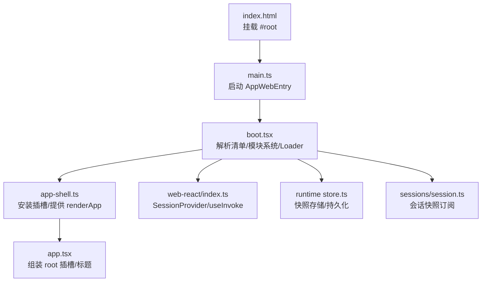
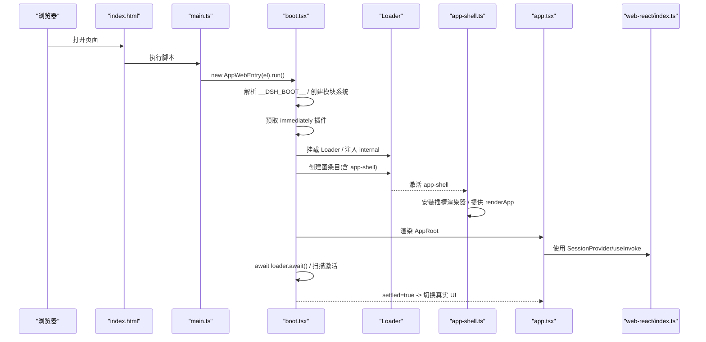
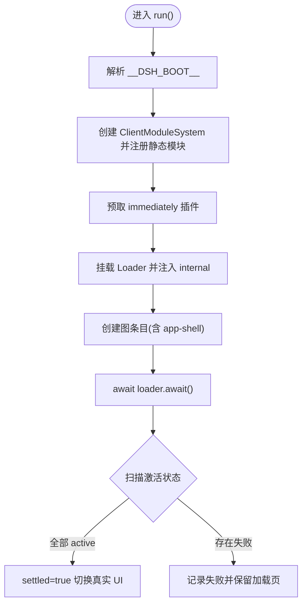
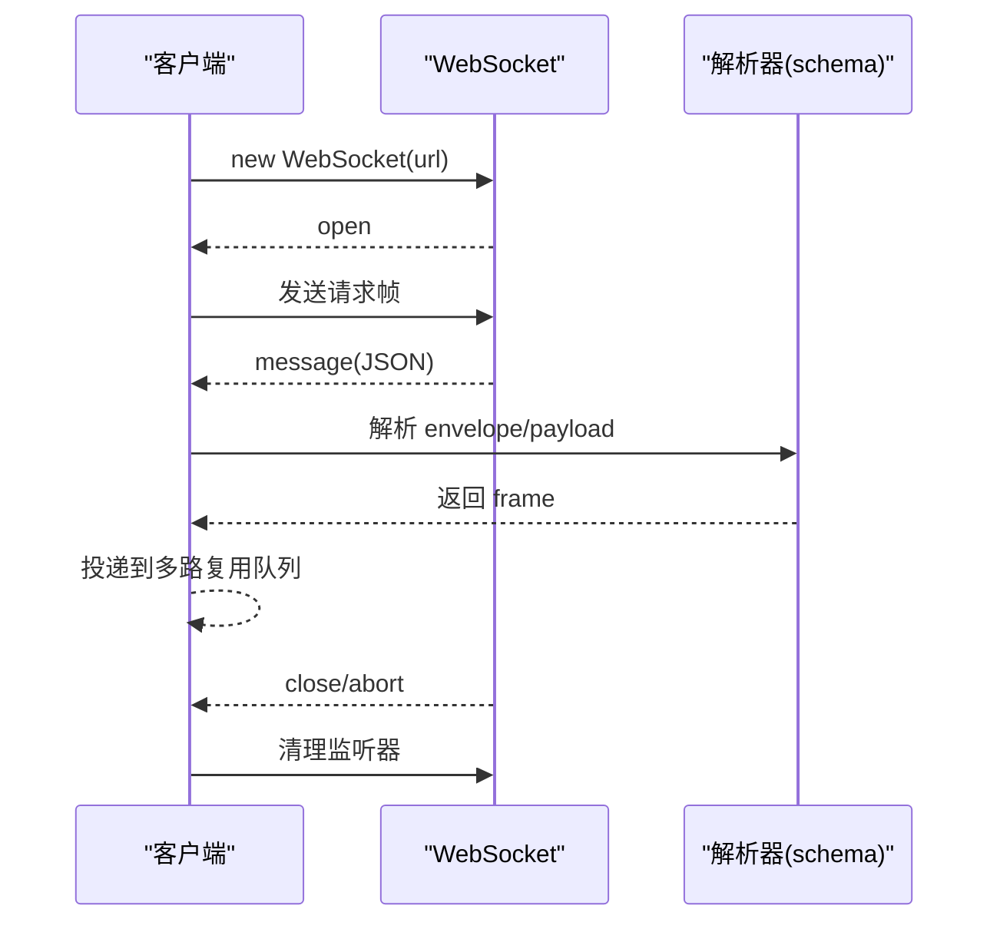
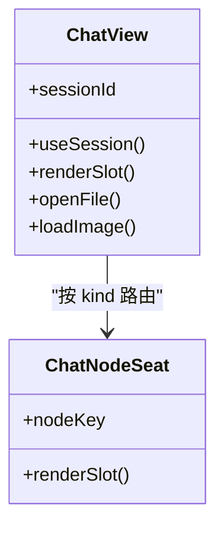
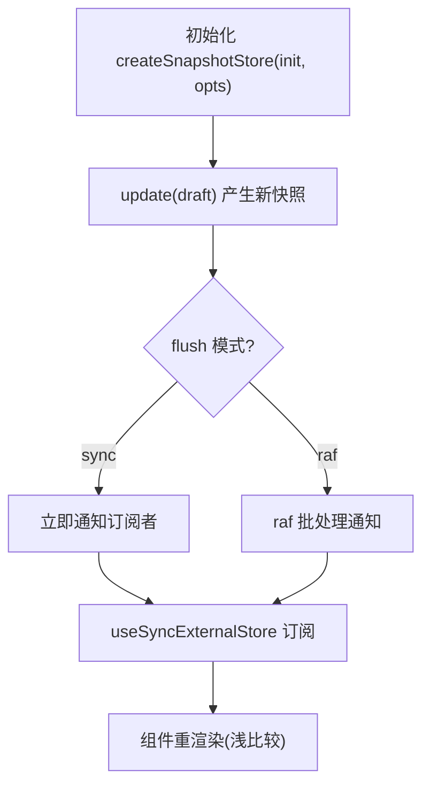
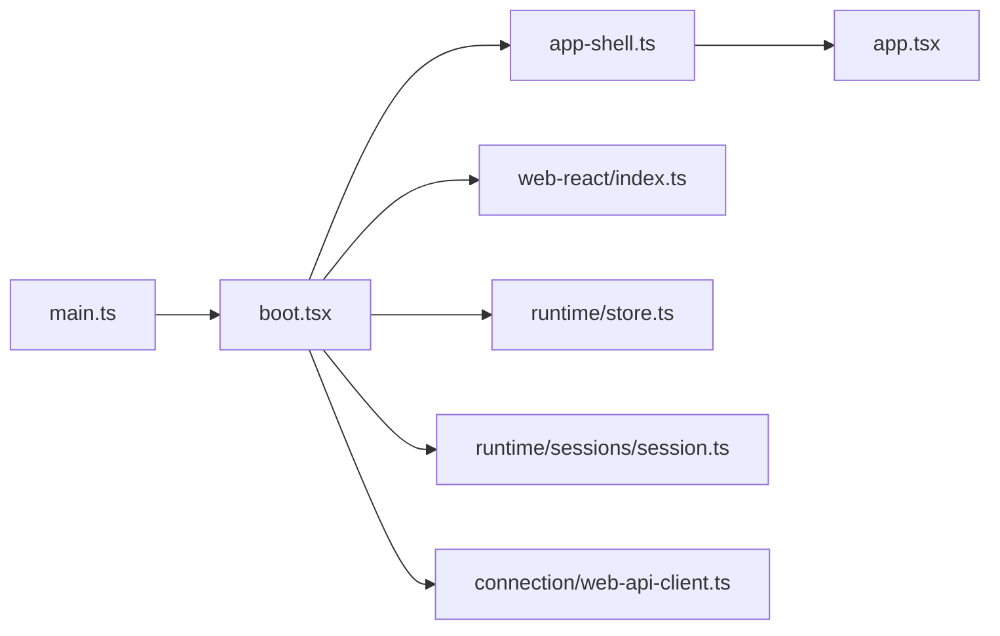

# Web 界面

<cite>
**本文引用的文件**
- [apps/web/src/main.ts](file://apps/web/src/main.ts)
- [apps/web/index.html](file://apps/web/index.html)
- [apps/web/vite.config.ts](file://apps/web/vite.config.ts)
- [packages/client/web/src/boot.tsx](file://packages/client/web/src/boot.tsx)
- [packages/client/web/src/app-shell.ts](file://packages/client/web/src/app-shell.ts)
- [packages/client/web/src/AppRoot.tsx](file://packages/client/web/src/AppRoot.tsx)
- [packages/client/web/src/app.tsx](file://packages/client/web/src/app.tsx)
- [packages/client/web-react/src/index.ts](file://packages/client/web-react/src/index.ts)
- [packages/client/connection/src/client/web-api-client.ts](file://packages/client/connection/src/client/web-api-client.ts)
- [packages/client/runtime/src/client/contract/store.ts](file://packages/client/runtime/src/client/contract/store.ts)
- [packages/client/runtime/src/client/sessions/session.ts](file://packages/client/runtime/src/client/sessions/session.ts)
- [packages/client/ui-conversation/src/client/chat/ChatView.tsx](file://packages/client/ui-conversation/src/client/chat/ChatView.tsx)
</cite>

## 目录
1. [简介](#简介)
2. [项目结构](#项目结构)
3. [核心组件](#核心组件)
4. [架构总览](#架构总览)
5. [详细组件分析](#详细组件分析)
6. [依赖关系分析](#依赖关系分析)
7. [性能考虑](#性能考虑)
8. [故障排查指南](#故障排查指南)
9. [结论](#结论)
10. [附录](#附录)

## 简介
本文件面向开发者与集成者，系统化说明 DeepSeek Harness 的 Web 界面：从启动引导、插件化壳层、React 渲染管线，到实时通信（WebSocket）、状态管理与数据同步、主题定制与样式覆盖、响应式设计与无障碍支持，以及性能优化策略与扩展开发指南。文档以仓库实际代码为依据，提供可追溯的文件来源与图示映射。

## 项目结构
Web 前端由“应用入口 + 构建配置 + 壳层引导 + 插件化 UI”组成：
- 应用入口：index.html 挂载 #root，main.ts 仅负责找到挂载点并启动 AppWebEntry。
- 构建配置：vite.config.ts 定义 React 插件、分包策略（vendor/index/langs/fonts）、别名与 define 常量，确保 shell 自足且插件按需加载。
- 壳层引导：boot.tsx 解析启动清单、初始化模块系统、并行预取 immediately 行、挂载 Loader、创建图条目、扫尾校验后切换真实 UI。
- 应用装配：app-shell.ts 安装插槽渲染器并提供 renderApp；app.tsx 组装根树（标题、root 插槽）。
- React 绑定：web-react 暴露 SessionProvider、useInvoke、快照选择器等能力，供上层 UI 消费。

**图表来源**
- [apps/web/index.html:1-15](file://apps/web/index.html#L1-L15)
- [apps/web/src/main.ts:1-11](file://apps/web/src/main.ts#L1-L11)
- [packages/client/web/src/boot.tsx:1-239](file://packages/client/web/src/boot.tsx#L1-L239)
- [packages/client/web/src/app-shell.ts:1-51](file://packages/client/web/src/app-shell.ts#L1-L51)
- [packages/client/web/src/app.tsx:1-45](file://packages/client/web/src/app.tsx#L1-L45)
- [packages/client/web-react/src/index.ts:1-24](file://packages/client/web-react/src/index.ts#L1-L24)
- [packages/client/runtime/src/client/contract/store.ts:73-103](file://packages/client/runtime/src/client/contract/store.ts#L73-L103)
- [packages/client/runtime/src/client/sessions/session.ts:440-460](file://packages/client/runtime/src/client/sessions/session.ts#L440-L460)

**章节来源**
- [apps/web/index.html:1-15](file://apps/web/index.html#L1-L15)
- [apps/web/src/main.ts:1-11](file://apps/web/src/main.ts#L1-L11)
- [apps/web/vite.config.ts:1-161](file://apps/web/vite.config.ts#L1-L161)
- [packages/client/web/src/boot.tsx:1-239](file://packages/client/web/src/boot.tsx#L1-L239)
- [packages/client/web/src/app-shell.ts:1-51](file://packages/client/web/src/app-shell.ts#L1-L51)
- [packages/client/web/src/app.tsx:1-45](file://packages/client/web/src/app.tsx#L1-L45)
- [packages/client/web-react/src/index.ts:1-24](file://packages/client/web-react/src/index.ts#L1-L24)

## 核心组件
- 启动引导 AppWebEntry：解析 window.__DSH_BOOT__，建立 ClientModuleSystem，注册静态模块与 app-shell，渲染加载页，预取 immediately 插件，挂载 Loader，创建图条目并等待激活，最终切换真实 UI。
- 应用装配 app-shell：在注入集就绪时安装插槽渲染器，提供 renderApp 工厂，将真实 UI 挂入 root 插槽。
- 根容器 AppRoot：基于信号与状态展示加载中或失败报告，并在引导完成后调用 renderApp。
- React 绑定 web-react：导出 SessionProvider、useInvoke、快照选择器 Hook，统一会话与插槽的 React 集成方式。
- 会话与存储：基于 createSnapshotStore 的快照存储，支持同步/raf 刷新与持久化；会话对象提供 subscribe/getSnapshot 以便 useSyncExternalStore 直连。

**章节来源**
- [packages/client/web/src/boot.tsx:68-239](file://packages/client/web/src/boot.tsx#L68-L239)
- [packages/client/web/src/app-shell.ts:10-51](file://packages/client/web/src/app-shell.ts#L10-L51)
- [packages/client/web/src/AppRoot.tsx:16-61](file://packages/client/web/src/AppRoot.tsx#L16-L61)
- [packages/client/web-react/src/index.ts:1-24](file://packages/client/web-react/src/index.ts#L1-L24)
- [packages/client/runtime/src/client/contract/store.ts:73-103](file://packages/client/runtime/src/client/contract/store.ts#L73-L103)
- [packages/client/runtime/src/client/sessions/session.ts:440-460](file://packages/client/runtime/src/client/sessions/session.ts#L440-L460)

## 架构总览
下图展示了从页面加载到真实 UI 渲染的关键路径，包括模块系统、插件加载、插槽装配与 React 绑定。

**图表来源**
- [apps/web/index.html:1-15](file://apps/web/index.html#L1-L15)
- [apps/web/src/main.ts:1-11](file://apps/web/src/main.ts#L1-L11)
- [packages/client/web/src/boot.tsx:97-208](file://packages/client/web/src/boot.tsx#L97-L208)
- [packages/client/web/src/app-shell.ts:35-51](file://packages/client/web/src/app-shell.ts#L35-L51)
- [packages/client/web/src/app.tsx:26-45](file://packages/client/web/src/app.tsx#L26-L45)
- [packages/client/web-react/src/index.ts:1-24](file://packages/client/web-react/src/index.ts#L1-L24)

## 详细组件分析

### 启动引导与插件化壳层
- 引导职责：解析启动清单、构建模块系统、预取 immediately 行、挂载 Loader、创建图条目、等待激活、扫描失败项并上报。
- 壳层装配：在注入集满足 slots/sessions/layout 后安装插槽渲染器，提供 renderApp 工厂，保证 UI 树只构建一次。
- 根容器：在未 settled 前显示加载或失败信息；settled 后调用 renderApp 渲染真实 UI。

**图表来源**
- [packages/client/web/src/boot.tsx:97-239](file://packages/client/web/src/boot.tsx#L97-L239)
- [packages/client/web/src/app-shell.ts:35-51](file://packages/client/web/src/app-shell.ts#L35-L51)
- [packages/client/web/src/AppRoot.tsx:29-61](file://packages/client/web/src/AppRoot.tsx#L29-L61)

**章节来源**
- [packages/client/web/src/boot.tsx:68-239](file://packages/client/web/src/boot.tsx#L68-L239)
- [packages/client/web/src/app-shell.ts:10-51](file://packages/client/web/src/app-shell.ts#L10-L51)
- [packages/client/web/src/AppRoot.tsx:16-61](file://packages/client/web/src/AppRoot.tsx#L16-L61)

### 实时通信机制（WebSocket）
- 连接建立：客户端通过 WebSocket 协议转换（ws/wss）建立连接，监听 open/message/close/abort 事件。
- 消息处理：接收 JSON 帧，按 schema 解析为请求/响应信封，投递到多路复用通道；异常帧被丢弃并记录日志。
- 生命周期：AbortSignal 控制取消；关闭时清理监听器并停止迭代。

**图表来源**
- [packages/client/connection/src/client/web-api-client.ts:34-91](file://packages/client/connection/src/client/web-api-client.ts#L34-L91)

**章节来源**
- [packages/client/connection/src/client/web-api-client.ts:34-91](file://packages/client/connection/src/client/web-api-client.ts#L34-L91)

### 用户界面组件：聊天视图
- 聊天视图 ChatView 作为插槽入口，读取会话中的顺序、节点、时间线、收件箱等状态，结合工作区上下文与运行态，组织对话渲染。
- 节点路由：不同 ChatNode 类型通过键值路由到对应渲染座位，实现可扩展的消息体呈现。

**图表来源**
- [packages/client/ui-conversation/src/client/chat/ChatView.tsx:142-167](file://packages/client/ui-conversation/src/client/chat/ChatView.tsx#L142-L167)
- [packages/client/ui-conversation/src/client/chat/ChatNodeSeat.tsx:1-16](file://packages/client/ui-conversation/src/client/chat/ChatNodeSeat.tsx#L1-L16)

**章节来源**
- [packages/client/ui-conversation/src/client/chat/ChatView.tsx:142-167](file://packages/client/ui-conversation/src/client/chat/ChatView.tsx#L142-L167)
- [packages/client/ui-conversation/src/client/chat/ChatNodeSeat.tsx:1-16](file://packages/client/ui-conversation/src/client/chat/ChatNodeSeat.tsx#L1-L16)

### 状态管理与数据同步
- 快照存储：createSnapshotStore 基于 zustand 与 Immer，支持同步或 requestAnimationFrame 批量刷新，可选 localStorage 持久化。
- 会话订阅：会话对象暴露 subscribe/getSnapshot，配合 React 的 useSyncExternalStore 实现零拷贝订阅与缓存快照。
- React 绑定：web-react 提供 SessionProvider 与 useInvoke，使组件能安全访问会话快照与远程调用。

**图表来源**
- [packages/client/runtime/src/client/contract/store.ts:73-103](file://packages/client/runtime/src/client/contract/store.ts#L73-L103)
- [packages/client/runtime/src/client/sessions/session.ts:440-460](file://packages/client/runtime/src/client/sessions/session.ts#L440-L460)
- [packages/client/web-react/src/index.ts:1-24](file://packages/client/web-react/src/index.ts#L1-L24)

**章节来源**
- [packages/client/runtime/src/client/contract/store.ts:73-103](file://packages/client/runtime/src/client/contract/store.ts#L73-L103)
- [packages/client/runtime/src/client/sessions/session.ts:440-460](file://packages/client/runtime/src/client/sessions/session.ts#L440-L460)
- [packages/client/web-react/src/index.ts:1-24](file://packages/client/web-react/src/index.ts#L1-L24)

### 主题定制与样式覆盖
- 构建期资源分组：字体资源（woff2/woff/ttf）被路由至 assets/fonts/，便于集中管理 KaTeX 字体。
- CSS 模块化：AppRoot 使用 CSS Modules 类名隔离样式，避免全局污染。
- 建议实践：通过外部样式表或 CSS 变量覆盖主题色；利用 Vite 的 CSS 管道对源码级样式进行编译与优化。

**章节来源**
- [apps/web/vite.config.ts:76-117](file://apps/web/vite.config.ts#L76-L117)
- [packages/client/web/src/AppRoot.tsx:14-58](file://packages/client/web/src/AppRoot.tsx#L14-L58)

### 响应式设计与无障碍访问
- 视口设置：index.html 中设置 viewport 与语言 zh-CN，启用移动端适配与国际化基础。
- 语义化与可访问性：建议在自定义组件中使用语义标签与 aria-* 属性，确保键盘导航与屏幕阅读器友好。

**章节来源**
- [apps/web/index.html:1-15](file://apps/web/index.html#L1-L15)

### 性能优化策略
- 分包与缓存：
  - vendor 包：将数学、语法高亮、Markdown 解析等重型依赖独立打包，变更频率低，利于长期缓存。
  - 语法分词：@shikijs/langs 的懒加载语法保持独立 chunk，仅在需要时加载；启动所需语法归入 vendor。
  - 资源分组：字体与语言包分别置于 assets/fonts/ 与 assets/langs/，提升缓存命中率。
- 预取与并行：
  - immediately 行在挂载加载页时并行预取，减少首屏阻塞。
  - 图条目创建并发执行，非预取包的下载可并行化。
- 渲染与更新：
  - 快照存储支持 raf 批量刷新，降低高频更新导致的抖动。
  - 会话快照惰性重建与缓存，减少重复计算。

**章节来源**
- [apps/web/vite.config.ts:21-125](file://apps/web/vite.config.ts#L21-L125)
- [packages/client/web/src/boot.tsx:129-208](file://packages/client/web/src/boot.tsx#L129-L208)
- [packages/client/runtime/src/client/contract/store.ts:73-103](file://packages/client/runtime/src/client/contract/store.ts#L73-L103)
- [packages/client/runtime/src/client/sessions/session.ts:440-460](file://packages/client/runtime/src/client/sessions/session.ts#L440-L460)

### 界面定制与扩展开发指南
- 插槽扩展：通过 ctx.slots.install(createSlotRenderer()) 安装渲染器，使用 renderSlot('root', {}) 挂载主布局；业务组件可通过插槽机制替换或增强局部 UI。
- 会话与调用：使用 web-react 提供的 SessionProvider 包裹应用，useInvoke 发起远程调用；useSession 选择器订阅会话快照变化。
- 插件装配：遵循 shell 自足规则，插件以 bundle 形式通过 Loader 动态加载；shell 不直接 value-import 插件包，保证加载页稳定。

**章节来源**
- [packages/client/web/src/app-shell.ts:35-51](file://packages/client/web/src/app-shell.ts#L35-L51)
- [packages/client/web/src/app.tsx:26-45](file://packages/client/web/src/app.tsx#L26-L45)
- [packages/client/web-react/src/index.ts:1-24](file://packages/client/web-react/src/index.ts#L1-L24)
- [packages/client/web/src/boot.tsx:1-34](file://packages/client/web/src/boot.tsx#L1-L34)

## 依赖关系分析
- 入口依赖：main.ts 依赖 @deepseek-ai/dsh-client-web 的 AppWebEntry。
- 引导依赖：boot.tsx 依赖 cordis Context/Loader、ClientModuleSystem、React DOM、app-shell 与状态工具。
- 装配依赖：app-shell 依赖 web-react 插槽渲染器与 app.tsx 的装配函数。
- 运行时依赖：store.ts 基于 zustand/Immer；session.ts 提供快照订阅；connection 封装 WebSocket 多路复用。

**图表来源**
- [apps/web/src/main.ts:1-11](file://apps/web/src/main.ts#L1-L11)
- [packages/client/web/src/boot.tsx:1-239](file://packages/client/web/src/boot.tsx#L1-L239)
- [packages/client/web/src/app-shell.ts:1-51](file://packages/client/web/src/app-shell.ts#L1-L51)
- [packages/client/web/src/app.tsx:1-45](file://packages/client/web/src/app.tsx#L1-L45)
- [packages/client/web-react/src/index.ts:1-24](file://packages/client/web-react/src/index.ts#L1-L24)
- [packages/client/runtime/src/client/contract/store.ts:73-103](file://packages/client/runtime/src/client/contract/store.ts#L73-L103)
- [packages/client/runtime/src/client/sessions/session.ts:440-460](file://packages/client/runtime/src/client/sessions/session.ts#L440-L460)
- [packages/client/connection/src/client/web-api-client.ts:34-91](file://packages/client/connection/src/client/web-api-client.ts#L34-L91)

**章节来源**
- [apps/web/src/main.ts:1-11](file://apps/web/src/main.ts#L1-L11)
- [packages/client/web/src/boot.tsx:1-239](file://packages/client/web/src/boot.tsx#L1-L239)
- [packages/client/web/src/app-shell.ts:1-51](file://packages/client/web/src/app-shell.ts#L1-L51)
- [packages/client/web/src/app.tsx:1-45](file://packages/client/web/src/app.tsx#L1-L45)
- [packages/client/web-react/src/index.ts:1-24](file://packages/client/web-react/src/index.ts#L1-L24)
- [packages/client/runtime/src/client/contract/store.ts:73-103](file://packages/client/runtime/src/client/contract/store.ts#L73-L103)
- [packages/client/runtime/src/client/sessions/session.ts:440-460](file://packages/client/runtime/src/client/sessions/session.ts#L440-L460)
- [packages/client/connection/src/client/web-api-client.ts:34-91](file://packages/client/connection/src/client/web-api-client.ts#L34-L91)

## 性能考虑
- 构建与缓存：vendor 包隔离重型依赖，lang 包懒加载，fonts 集中管理，提升缓存命中与增量更新效率。
- 启动优化：immediately 行预取与并行创建图条目，缩短首屏时间；Loader 内部状态投影驱动加载反馈。
- 渲染优化：快照存储支持 raf 批量刷新；会话快照惰性重建与缓存；useSyncExternalStore 最小化重渲染。
- 网络优化：WebSocket 消息按 schema 解析，错误帧丢弃并记录，避免无效渲染。

[本节为通用指导，无需特定文件来源]

## 故障排查指南
- 引导失败：AppRoot 在未 settled 时显示失败条目与错误信息；boot 阶段会扫描未激活条目并抛出汇总错误。
- 模块导入失败：prefetch 失败不会阻断整体引导，但会在具体 import 路径处报错；检查模块 ID 与依赖是否可达。
- WebSocket 异常：收到二进制帧或解析失败会被丢弃并记录日志；确认服务端协议与 payload 格式。
- 插槽缺失：若 appShell 服务在 settle 后仍缺失，会抛出错误；检查注入集与插件装配顺序。

**章节来源**
- [packages/client/web/src/AppRoot.tsx:29-61](file://packages/client/web/src/AppRoot.tsx#L29-L61)
- [packages/client/web/src/boot.tsx:129-239](file://packages/client/web/src/boot.tsx#L129-L239)
- [packages/client/connection/src/client/web-api-client.ts:51-64](file://packages/client/connection/src/client/web-api-client.ts#L51-L64)

## 结论
该 Web 界面采用“壳层引导 + 插件化 UI + React 绑定”的分层架构：通过模块系统与 Loader 实现插件的动态装配与状态可见；以快照存储与会话订阅保障高效的数据同步；借助构建分包与预取策略优化启动与渲染性能；同时提供插槽机制与 React 绑定，便于界面定制与扩展。实时通信通过标准化的 WebSocket 多路复用实现，具备健壮的错误处理与生命周期管理。

## 附录
- 构建命令：参考 apps/web/package.json 的 scripts（build/dev/watch）。
- 环境变量与别名：vite.config.ts 中 define 与 alias 用于浏览器兼容与源码解析。
- 测试与 E2E：apps/web/tests 下包含大量端到端用例，可用于验证界面行为与交互流程。

[本节为补充信息，无需特定文件来源]