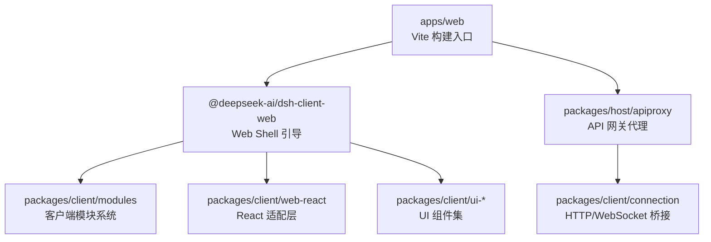
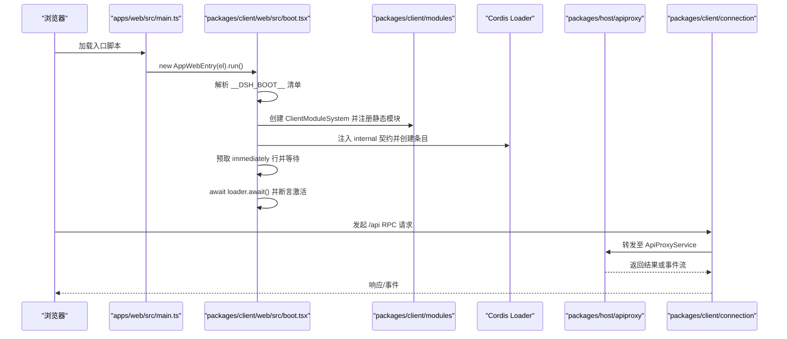
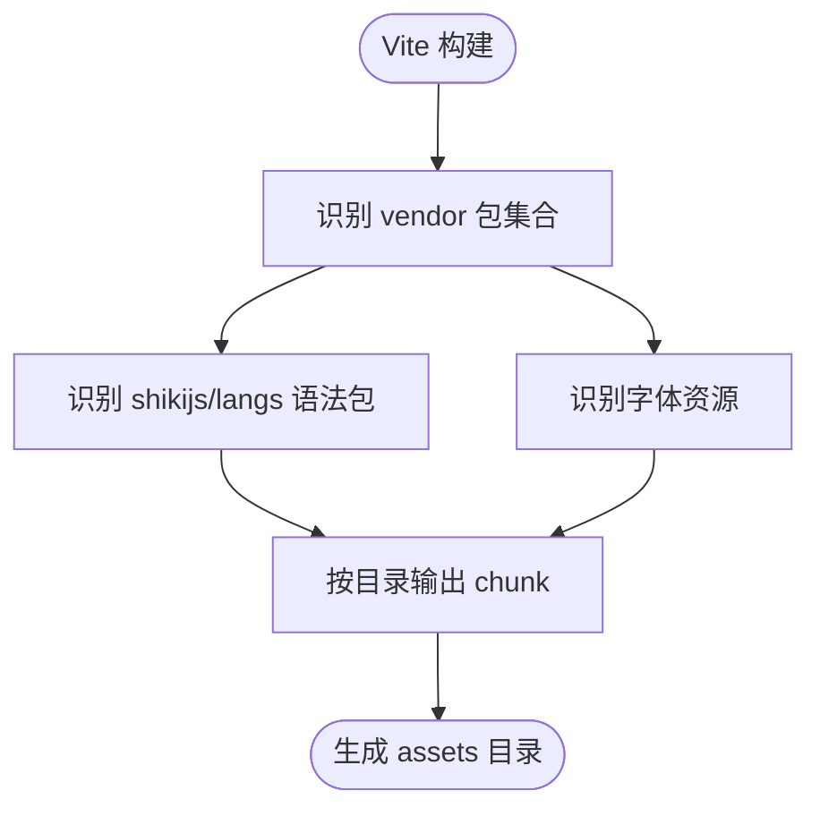
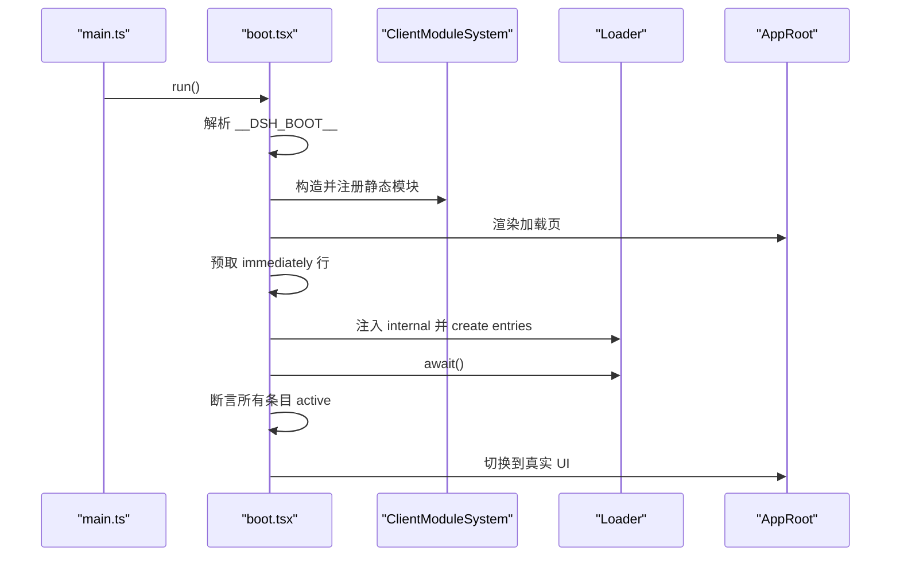
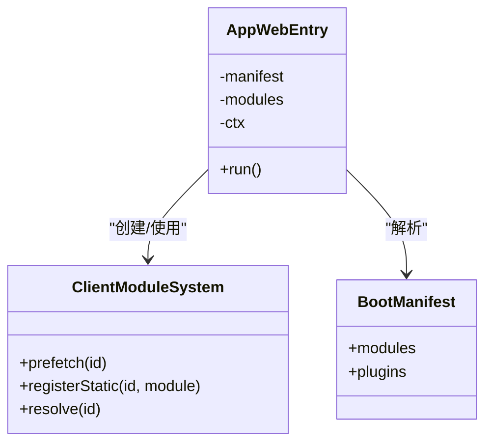
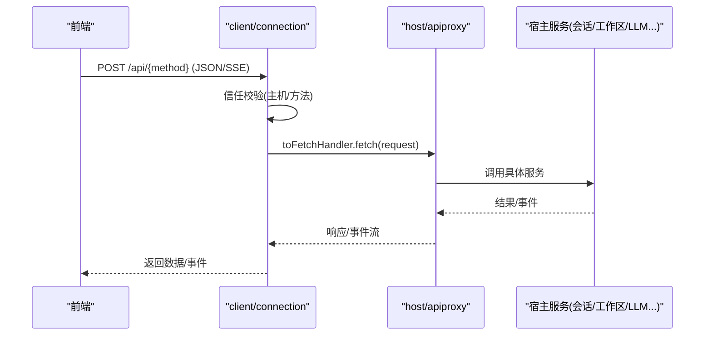
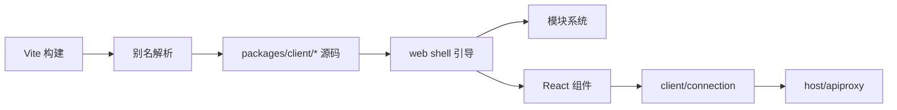

# 前端架构设计

<cite>
**本文引用的文件**
- [apps/web/package.json](file://apps/web/package.json)
- [apps/web/vite.config.ts](file://apps/web/vite.config.ts)
- [apps/web/src/main.ts](file://apps/web/src/main.ts)
- [packages/client/web/src/boot.tsx](file://packages/client/web/src/boot.tsx)
- [packages/client/modules/src/client/index.ts](file://packages/client/modules/src/client/index.ts)
- [packages/host/apiproxy/src/index.ts](file://packages/host/apiproxy/src/index.ts)
- [packages/host/apiproxy/src/fetch/handler.ts](file://packages/host/apiproxy/src/fetch/handler.ts)
- [packages/client/connection/src/index.ts](file://packages/client/connection/src/index.ts)
- [tsconfig.base.json](file://tsconfig.base.json)
- [tsconfig.base.client.json](file://tsconfig.base.client.json)
- [package.json](file://package.json)
</cite>

## 目录
1. [简介](#简介)
2. [项目结构](#项目结构)
3. [核心组件](#核心组件)
4. [架构总览](#架构总览)
5. [详细组件分析](#详细组件分析)
6. [依赖关系分析](#依赖关系分析)
7. [性能考量](#性能考量)
8. [故障排查指南](#故障排查指南)
9. [结论](#结论)
10. [附录](#附录)

## 简介
本文件面向基于 Vite 的前端构建系统与模块化架构，聚焦以下目标：
- 解释 apps/web 作为 Web 应用入口的构建与打包策略（Vite + React）。
- 说明客户端包（packages/client）与宿主包（packages/host）的职责分离与通信机制。
- 文档化应用启动流程与初始化过程（从 main.ts 到壳层 boot 再到插件装配）。
- 说明 TypeScript 配置与类型系统的使用方式。
- 总结模块化设计与依赖管理策略，并提供扩展点与自定义开发指南。

## 项目结构
- apps/web：Web 应用入口，使用 Vite 构建，依赖 @deepseek-ai/dsh-client-web 等客户端库，产出静态资源由 CLI 的 web 命令提供。
- packages/client：客户端侧能力集合，包括连接、模块系统、运行时、UI 组件与 Web Shell 引导逻辑。
- packages/host：宿主侧能力集合，包含 API 网关代理、目录选择器、Web 服务器集成等。
- tsconfig.*：统一的 TypeScript 编译与路径映射配置，确保跨包引用一致性与浏览器/Node 差异处理。

图表来源
- [apps/web/vite.config.ts:92-160](file://apps/web/vite.config.ts#L92-L160)
- [packages/client/web/src/boot.tsx:68-143](file://packages/client/web/src/boot.tsx#L68-L143)
- [packages/host/apiproxy/src/index.ts:69-125](file://packages/host/apiproxy/src/index.ts#L69-L125)
- [packages/client/connection/src/index.ts:130-196](file://packages/client/connection/src/index.ts#L130-L196)

章节来源
- [apps/web/package.json:1-52](file://apps/web/package.json#L1-L52)
- [apps/web/vite.config.ts:1-161](file://apps/web/vite.config.ts#L1-L161)
- [package.json:19-47](file://package.json#L19-L47)

## 核心组件
- Web 应用入口：apps/web/src/main.ts 负责挂载根节点并启动 AppWebEntry。
- Web Shell 引导：packages/client/web/src/boot.tsx 实现两阶段启动（立即预取 + 插件加载），维护模块系统与状态。
- 客户端模块系统：packages/client/modules/src/client/index.ts 将内核构建的模块系统注入上下文，供插件消费。
- 宿主 API 网关：packages/host/apiproxy/src/index.ts 暴露 ApiProxyService，统一对外能力；通过 toFetchHandler 提供 fetch 载体。
- 连接桥接：packages/client/connection/src/index.ts 在宿主侧注册 /api 路由与 WebSocket 下行通道，并对特权方法进行信任校验。

章节来源
- [apps/web/src/main.ts:1-11](file://apps/web/src/main.ts#L1-L11)
- [packages/client/web/src/boot.tsx:1-239](file://packages/client/web/src/boot.tsx#L1-L239)
- [packages/client/modules/src/client/index.ts:1-35](file://packages/client/modules/src/client/index.ts#L1-L35)
- [packages/host/apiproxy/src/index.ts:1-129](file://packages/host/apiproxy/src/index.ts#L1-L129)
- [packages/client/connection/src/index.ts:1-197](file://packages/client/connection/src/index.ts#L1-L197)

## 架构总览
下图展示了从浏览器入口到宿主 API 的整体调用链与数据流：

图表来源
- [apps/web/src/main.ts:6-11](file://apps/web/src/main.ts#L6-L11)
- [packages/client/web/src/boot.tsx:97-208](file://packages/client/web/src/boot.tsx#L97-L208)
- [packages/host/apiproxy/src/index.ts:69-125](file://packages/host/apiproxy/src/index.ts#L69-L125)
- [packages/client/connection/src/index.ts:130-196](file://packages/client/connection/src/index.ts#L130-L196)

## 详细组件分析

### Web 应用入口与 Vite 构建
- 入口职责：查找 #root 并启动 AppWebEntry。
- Vite 配置要点：
  - 禁止独立 serve（防止无 boot manifest 的裸壳暴露）。
  - 手动分包 vendor：将数学、语法高亮、Markdown 解析等重型依赖单独拆分，提升缓存命中。
  - 字体与语言包分目录输出，便于 CDN 与缓存策略。
  - 别名指向 packages/client/* 源码，使 CSS 走 Vite 管线而非已构建产物。
  - define 替换 process.env 与 node 探针，保证浏览器环境安全。

图表来源
- [apps/web/vite.config.ts:21-77](file://apps/web/vite.config.ts#L21-L77)
- [apps/web/vite.config.ts:92-127](file://apps/web/vite.config.ts#L92-L127)
- [apps/web/vite.config.ts:129-159](file://apps/web/vite.config.ts#L129-L159)

章节来源
- [apps/web/vite.config.ts:1-161](file://apps/web/vite.config.ts#L1-L161)
- [apps/web/package.json:22-32](file://apps/web/package.json#L22-L32)

### 应用启动流程与初始化
- 启动序列：
  1) main.ts 实例化 AppWebEntry 并调用 run。
  2) boot.tsx 解析 window.__DSH_BOOT__，构造 ClientModuleSystem，注册静态模块（app-shell 与 modules）。
  3) 渲染加载页，并行预取 immediately 行。
  4) 挂载 Cordis Loader，注入 internal 契约，创建所有条目（含 app-shell）。
  5) 等待全部条目 settle，断言激活，切换 UI。
- 错误处理：启动失败停留在加载页并展示错误信息；仅清单缺失或格式错误会拒绝启动。

图表来源
- [apps/web/src/main.ts:6-11](file://apps/web/src/main.ts#L6-L11)
- [packages/client/web/src/boot.tsx:97-208](file://packages/client/web/src/boot.tsx#L97-L208)

章节来源
- [apps/web/src/main.ts:1-11](file://apps/web/src/main.ts#L1-L11)
- [packages/client/web/src/boot.tsx:1-239](file://packages/client/web/src/boot.tsx#L1-L239)

### 客户端模块系统与插件装配
- 模块系统：
  - 由 shell 内核在 cordis 之前构建，避免“自举循环”。
  - 通过 globalThis.__DSH_MODULES__ 暴露给插件面，apply 时注入 ctx.modules。
- 插件装配：
  - 每个插件以 graph row 形式存在，支持 prefetch 与按需加载。
  - 立即执行行（immediately）用于同步 require 边，必须在任何条目 materialize 前完成工厂注册。

图表来源
- [packages/client/web/src/boot.tsx:68-143](file://packages/client/web/src/boot.tsx#L68-L143)
- [packages/client/modules/src/client/index.ts:22-34](file://packages/client/modules/src/client/index.ts#L22-L34)

章节来源
- [packages/client/web/src/boot.tsx:1-239](file://packages/client/web/src/boot.tsx#L1-L239)
- [packages/client/modules/src/client/index.ts:1-35](file://packages/client/modules/src/client/index.ts#L1-L35)

### 宿主 API 网关与通信机制
- 宿主侧：
  - ApiProxyService 聚合各子系统能力（sessions、workspace、llm 等），并通过 toFetchHandler 暴露为 fetch 接口。
  - 支持 SSE 事件流与二进制帧封装。
- 客户端连接：
  - 在宿主侧注册 /api 路由，对特权方法实施信任校验（仅回环或白名单主机）。
  - 提供 WebSocket 下行通道（MUX_EVENTS_PATH、HOST_EVENTS_PATH）用于事件推送。
  - 通过 AbstractApiClient/InProcessApiClient 与宿主交互。

图表来源
- [packages/host/apiproxy/src/index.ts:69-125](file://packages/host/apiproxy/src/index.ts#L69-L125)
- [packages/host/apiproxy/src/fetch/handler.ts:220-250](file://packages/host/apiproxy/src/fetch/handler.ts#L220-L250)
- [packages/client/connection/src/index.ts:130-196](file://packages/client/connection/src/index.ts#L130-L196)

章节来源
- [packages/host/apiproxy/src/index.ts:1-129](file://packages/host/apiproxy/src/index.ts#L1-L129)
- [packages/host/apiproxy/src/fetch/handler.ts:220-250](file://packages/host/apiproxy/src/fetch/handler.ts#L220-L250)
- [packages/client/connection/src/index.ts:1-197](file://packages/client/connection/src/index.ts#L1-L197)

### TypeScript 配置与类型系统
- 基础配置：
  - 目标 ES2024，模块 esnext，bundler 解析，严格模式开启。
  - paths 映射覆盖仓库内所有 dsh-* 包，保持源码级引用与类型一致性。
- 客户端专用：
  - 启用 react-jsx，DOM/DOM.Iterable 库，默认不引入 Node 类型（需要时局部覆盖）。
- 作用：
  - 保证 client/host 两套构建在同一类型契约下运行。
  - 通过 project references 与 strict 选项强化类型安全与增量编译。

章节来源
- [tsconfig.base.json:1-280](file://tsconfig.base.json#L1-L280)
- [tsconfig.base.client.json:1-12](file://tsconfig.base.client.json#L1-L12)

## 依赖关系分析
- 构建期依赖：
  - Vite + @vitejs/plugin-react 驱动开发与构建。
  - 通过 alias 将 @deepseek-ai/dsh-client-* 指向源码，确保样式与热更新体验。
- 运行期依赖：
  - React/ReactDOM 用于 UI 渲染。
  - Cordis Loader 与模块系统用于插件装配。
  - host apiproxy 与 connection 提供前后端通信。

图表来源
- [apps/web/vite.config.ts:129-149](file://apps/web/vite.config.ts#L129-L149)
- [apps/web/package.json:28-49](file://apps/web/package.json#L28-L49)
- [packages/client/web/src/boot.tsx:35-48](file://packages/client/web/src/boot.tsx#L35-L48)
- [packages/client/connection/src/index.ts:130-196](file://packages/client/connection/src/index.ts#L130-L196)
- [packages/host/apiproxy/src/index.ts:69-125](file://packages/host/apiproxy/src/index.ts#L69-L125)

章节来源
- [apps/web/vite.config.ts:1-161](file://apps/web/vite.config.ts#L1-L161)
- [apps/web/package.json:1-52](file://apps/web/package.json#L1-L52)
- [package.json:19-47](file://package.json#L19-L47)

## 性能考量
- 分包策略：
  - 将数学、语法高亮、Markdown 解析等重型依赖放入 vendor 包，减少主包体积并提高缓存命中率。
  - 语法包按需懒加载，初始加载最小化。
- 资源组织：
  - 字体与语言包按目录输出，便于 CDN 缓存与版本控制。
- 构建优化：
  - 使用 sourcemap 便于调试。
  - 通过 define 移除不必要的 Node 探针与环境变量分支。

章节来源
- [apps/web/vite.config.ts:21-77](file://apps/web/vite.config.ts#L21-L77)
- [apps/web/vite.config.ts:92-127](file://apps/web/vite.config.ts#L92-L127)
- [apps/web/vite.config.ts:151-159](file://apps/web/vite.config.ts#L151-L159)

## 故障排查指南
- 启动失败：
  - 检查 window.__DSH_BOOT__ 是否存在且格式正确。
  - 查看加载页的错误提示与控制台日志，确认是否有条目未激活或服务缺失。
- 模块加载问题：
  - 确认 immediately 行是否全部预取成功，避免同步 require 边未就绪。
  - 检查模块别名是否正确指向源码，避免样式未走 Vite 管线。
- 通信异常：
  - 验证 /api 请求是否通过信任校验（主机名与方法权限）。
  - 检查 WebSocket 升级是否被允许，以及下行通道是否正常注册。
- 构建错误：
  - 确认未以独立模式运行 Vite serve（会被插件拒绝）。
  - 核对 vendor 包列表与语法包文件匹配，避免分包错位。

章节来源
- [apps/web/vite.config.ts:11-19](file://apps/web/vite.config.ts#L11-L19)
- [packages/client/web/src/boot.tsx:97-143](file://packages/client/web/src/boot.tsx#L97-L143)
- [packages/client/connection/src/index.ts:130-196](file://packages/client/connection/src/index.ts#L130-L196)

## 结论
本项目采用“壳层 + 插件”的模块化架构，结合 Vite 的灵活构建与分包策略，实现了高性能、可维护的前端系统。客户端与宿主的职责清晰分离，通过标准化的 API 网关与连接桥接进行通信。TypeScript 的全局路径映射与严格配置确保了类型一致性与开发体验。遵循本文档的扩展点与最佳实践，可以安全地添加新插件、定制 UI 与增强通信能力。

## 附录
- 扩展点与自定义指南
  - 新增插件：以 graph row 形式定义，按需加入 boot manifest；必要时将重型依赖加入 vendor 列表。
  - 自定义 UI：通过 ui-* 包扩展插槽与组件，遵循 React 与主题约定。
  - 通信扩展：在 host apiproxy 中增加新的 API 方法，并在 client/connection 中补充信任策略与路由。
  - 构建定制：调整 vite.config.ts 的分包与别名策略，注意保持 shell 自足性规则。

[本节为概念性内容，不直接分析具体文件]