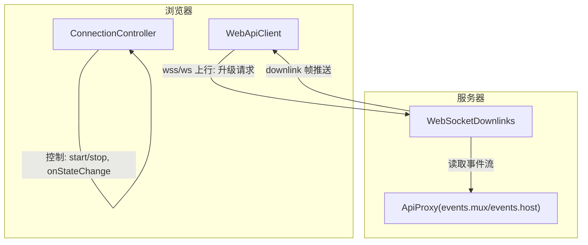
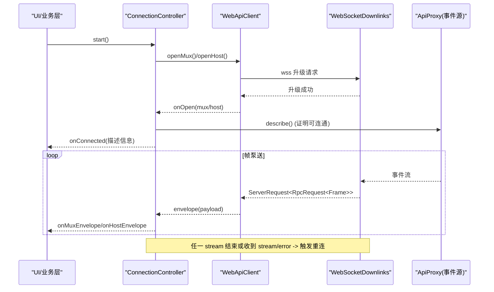
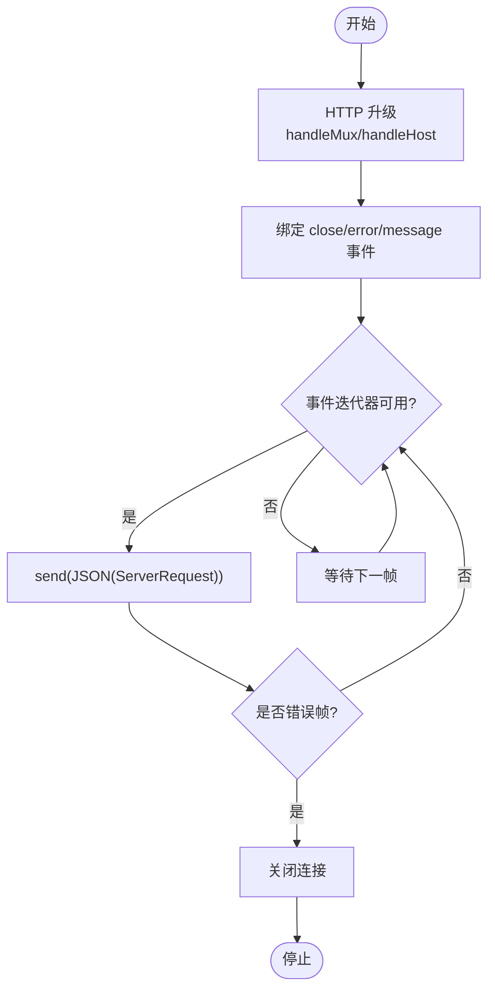
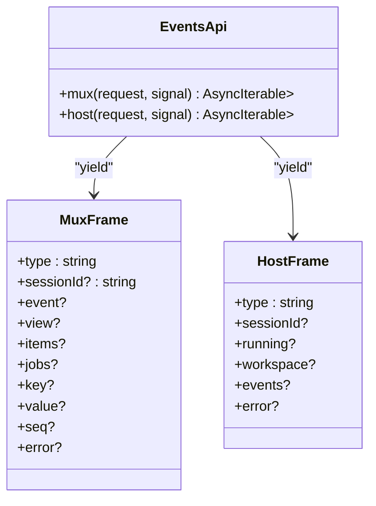
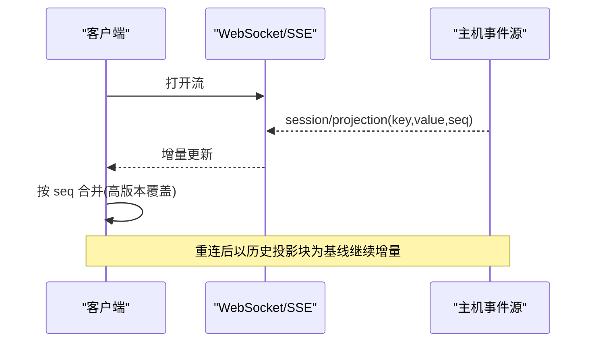
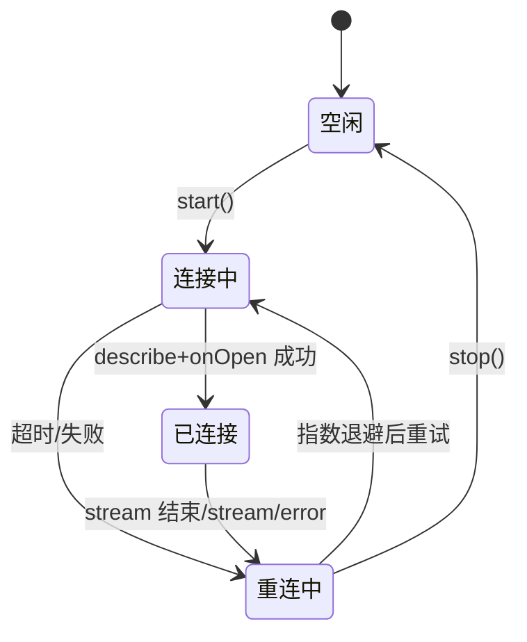
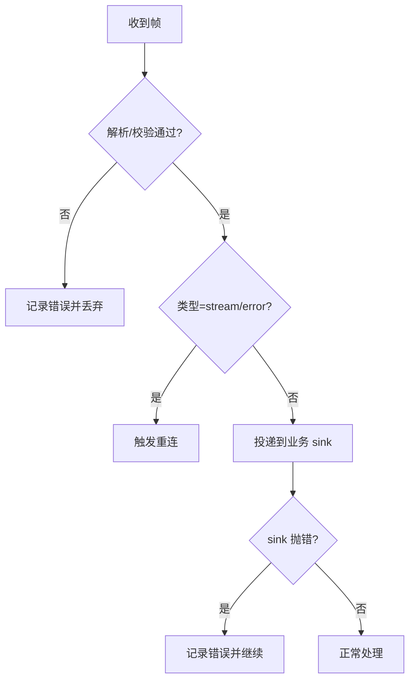
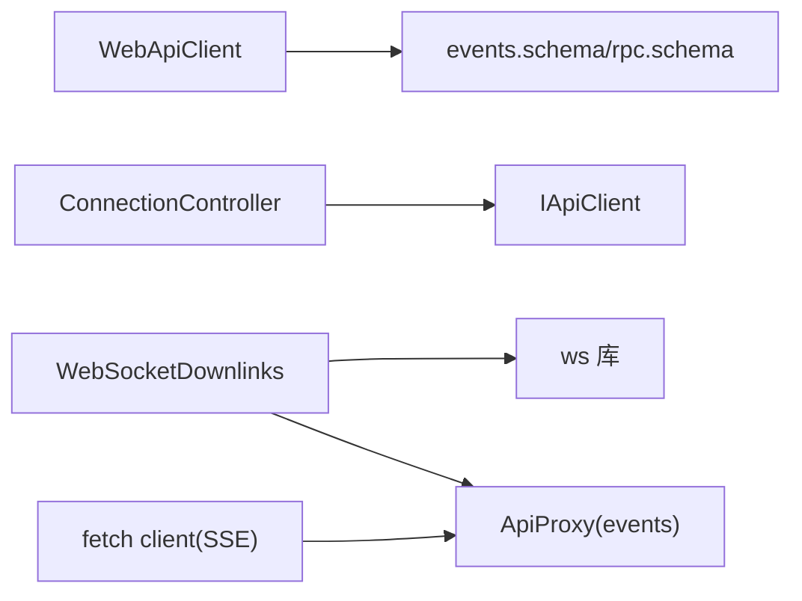

# 实时通信机制

<cite>
**本文引用的文件**
- [packages/client/connection/src/websocket-downlink.ts](file://packages/client/connection/src/websocket-downlink.ts)
- [packages/client/connection/src/client/web-api-client.ts](file://packages/client/connection/src/client/web-api-client.ts)
- [packages/client/connection/src/client/connection.ts](file://packages/client/connection/src/client/connection.ts)
- [packages/host/apiproxy/src/api/events.ts](file://packages/host/apiproxy/src/api/events.ts)
- [packages/host/apiproxy/src/fetch/client.ts](file://packages/host/apiproxy/src/fetch/client.ts)
- [packages/host/apiproxy/src/fetch/handler.ts](file://packages/host/apiproxy/src/fetch/handler.ts)
- [packages/mcp/mcp-client/src/connection.ts](file://packages/mcp/mcp-client/src/connection.ts)
- [packages/client/connection/tests/connection.client.spec.ts](file://packages/client/connection/tests/connection.client.spec.ts)
- [packages/host/apiproxy/tests/client-handler.spec.ts](file://packages/host/apiproxy/tests/client-handler.spec.ts)
</cite>

## 目录
1. [简介](#简介)
2. [项目结构](#项目结构)
3. [核心组件](#核心组件)
4. [架构总览](#架构总览)
5. [详细组件分析](#详细组件分析)
6. [依赖关系分析](#依赖关系分析)
7. [性能考量](#性能考量)
8. [故障排查指南](#故障排查指南)
9. [结论](#结论)
10. [附录](#附录)

## 简介
本文件系统化说明 Web 界面的实时通信机制，覆盖 WebSocket 连接建立与管理、消息协议与事件处理、流式响应与增量更新、连接状态与重连策略、错误处理与异常恢复，以及性能优化与连接池管理方案。该机制在浏览器端通过独立的 WebSocket 下行通道承载两条逻辑事件流（mux 与 host），并在服务端以 WebSocketDownlinks 进行升级与帧泵送；同时提供基于 SSE 的兼容实现用于进程内或测试环境。

## 项目结构
- 客户端侧
  - WebApiClient：浏览器平台实现，使用原生 WebSocket 建立两条独立下行流，解析 ServerRequest 信封并产出 RpcRequest<MuxFrame/HostFrame>。
  - ConnectionController：连接控制器，负责双流握手、状态机、丢流检测、指数退避重连、sink 隔离。
- 服务端侧
  - WebSocketDownlinks：持有 ws.Server，对 /api 下的 mux 与 host 路径执行 HTTP->WebSocket 升级，将后端事件流泵入 socket。
  - fetch handler/client：SSE 路径实现，用于进程内或测试场景，遵循相同的信封与帧协议。
- 协议与事件
  - events.ts：定义 MuxFrame 与 HostFrame 的所有帧类型，包括 session/event、session/subscribed、approval/question、stream/error 等。

**图表来源**
- [packages/client/connection/src/client/web-api-client.ts:18-32](file://packages/client/connection/src/client/web-api-client.ts#L18-L32)
- [packages/client/connection/src/websocket-downlink.ts:64-82](file://packages/client/connection/src/websocket-downlink.ts#L64-L82)
- [packages/host/apiproxy/src/api/events.ts:46-63](file://packages/host/apiproxy/src/api/events.ts#L46-L63)

**章节来源**
- [packages/client/connection/src/client/web-api-client.ts:1-92](file://packages/client/connection/src/client/web-api-client.ts#L1-L92)
- [packages/client/connection/src/websocket-downlink.ts:1-154](file://packages/client/connection/src/websocket-downlink.ts#L1-L154)
- [packages/host/apiproxy/src/api/events.ts:1-156](file://packages/host/apiproxy/src/api/events.ts#L1-L156)

## 核心组件
- WebApiClient：封装浏览器 WebSocket 生命周期、消息解析、信封透传、AbortSignal 驱动关闭。
- ConnectionController：维护 generation/attempt、指数退避、双流就绪握手（describe + onOpen）、stream/error 收敛为断线、sink 异常隔离。
- WebSocketDownlinks：HTTP 升级、downlink-only 约束（禁止上游消息）、失败帧注入、优雅关闭。
- events 协议：MuxFrame/HostFrame 统一帧模型，支持会话事件、审批/问答、队列/作业快照、投影增量、错误帧。

**章节来源**
- [packages/client/connection/src/client/web-api-client.ts:34-90](file://packages/client/connection/src/client/web-api-client.ts#L34-L90)
- [packages/client/connection/src/client/connection.ts:1-203](file://packages/client/connection/src/client/connection.ts#L1-L203)
- [packages/client/connection/src/websocket-downlink.ts:46-138](file://packages/client/connection/src/websocket-downlink.ts#L46-L138)
- [packages/host/apiproxy/src/api/events.ts:46-156](file://packages/host/apiproxy/src/api/events.ts#L46-L156)

## 架构总览
下图展示从浏览器到服务器的完整实时通信链路，包含握手、帧泵送、错误处理与重连。

**图表来源**
- [packages/client/connection/src/client/connection.ts:107-169](file://packages/client/connection/src/client/connection.ts#L107-L169)
- [packages/client/connection/src/client/web-api-client.ts:18-32](file://packages/client/connection/src/client/web-api-client.ts#L18-L32)
- [packages/client/connection/src/websocket-downlink.ts:64-82](file://packages/client/connection/src/websocket-downlink.ts#L64-L82)
- [packages/host/apiproxy/src/api/events.ts:46-63](file://packages/host/apiproxy/src/api/events.ts#L46-L63)

## 详细组件分析

### WebSocket 连接建立与管理策略
- 浏览器端
  - WebApiClient.openMux/openHost 分别创建独立 WebSocket 连接，路径映射至 mux 与 host 事件流。
  - 每个连接维护 inbox 与 wake 信号，按序产出 RpcRequest<Frame>，遇到 close 则终止生成器。
  - AbortSignal 控制连接生命周期，避免悬挂。
- 服务器端
  - WebSocketDownlinks.handleMux/handleHost 对指定路径执行 upgrade，绑定 downlink-only 语义（首个消息即关闭）。
  - pump 循环将 ApiProxy 的事件迭代器写入 socket，捕获错误并发送 stream/error 失败帧。
  - close 时终止所有客户端并等待泵任务完成。

**图表来源**
- [packages/client/connection/src/websocket-downlink.ts:99-138](file://packages/client/connection/src/websocket-downlink.ts#L99-L138)
- [packages/client/connection/src/client/web-api-client.ts:34-90](file://packages/client/connection/src/client/web-api-client.ts#L34-L90)

**章节来源**
- [packages/client/connection/src/client/web-api-client.ts:18-90](file://packages/client/connection/src/client/web-api-client.ts#L18-L90)
- [packages/client/connection/src/websocket-downlink.ts:46-138](file://packages/client/connection/src/websocket-downlink.ts#L46-L138)

### 消息协议格式与事件处理机制
- 信封与帧
  - 传输层使用 ServerRequest 包裹 RpcRequest<Frame>，其中 rpcId 用于关联可应答帧（如 approval/question）。
  - MuxFrame：会话事件、订阅基线、审批/问答、队列/作业快照、投影增量、错误帧。
  - HostFrame：会话增删、运行状态、工作区变更、归档会话变更、远程事件转发、错误帧。
- 事件分发
  - ConnectionController.pumpStream 过滤 stream/error 并转发其余帧至 sink；sink 异常被隔离，不影响泵循环。
  - 业务层通过 onMuxEnvelope/onHostEnvelope 消费事件，onConnected 在握手成功后触发。

**图表来源**
- [packages/host/apiproxy/src/api/events.ts:46-156](file://packages/host/apiproxy/src/api/events.ts#L46-L156)

**章节来源**
- [packages/host/apiproxy/src/api/events.ts:46-156](file://packages/host/apiproxy/src/api/events.ts#L46-L156)
- [packages/client/connection/src/client/connection.ts:178-192](file://packages/client/connection/src/client/connection.ts#L178-L192)

### 流式响应与增量更新机制
- 增量投影
  - session/projection 帧携带 key/value/seq，客户端维护 per-session 值存储，采用高 seq 覆盖策略，结合历史尾部投影块作为基线。
- 队列与作业快照
  - session/queue 与 session/jobs 提供完整快照，确保重连后编辑、删除、取消等操作收敛到唯一权威值。
- 流式边界
  - SSE 路径以 '\n\n' 分界，支持任意 chunk 切分重组；WebSocket 路径逐条 JSON 帧传输。

**图表来源**
- [packages/host/apiproxy/src/api/events.ts:99-108](file://packages/host/apiproxy/src/api/events.ts#L99-L108)
- [packages/host/apiproxy/src/fetch/client.ts:362-389](file://packages/host/apiproxy/src/fetch/client.ts#L362-L389)

**章节来源**
- [packages/host/apiproxy/src/api/events.ts:65-108](file://packages/host/apiproxy/src/api/events.ts#L65-L108)
- [packages/host/apiproxy/src/fetch/client.ts:362-389](file://packages/host/apiproxy/src/fetch/client.ts#L362-L389)

### 连接状态管理与重连策略
- 状态机
  - connected：握手成功（describe 成功 + 两路 onOpen 到达）；reconnecting：任一 stream 结束或收到 stream/error。
  - 去抖：仅当状态变化时触发 onStateChange。
- 指数退避
  - backoffBaseMs/backoffFactor/backoffMaxMs 控制退避上限与抖动；每次失败 attempt++，sleep 后重试。
- 超时保护
  - streamOpenTimeoutMs 防止代理不触发 onOpen 导致死锁；超时后仍视为已连接，后续由 gap 修复补齐。
- 业务隔离
  - sink 抛错不会中断泵循环；stream/error 帧直接触发重连而不投递给业务层。

**图表来源**
- [packages/client/connection/src/client/connection.ts:19-40](file://packages/client/connection/src/client/connection.ts#L19-L40)
- [packages/client/connection/src/client/connection.ts:91-169](file://packages/client/connection/src/client/connection.ts#L91-L169)

**章节来源**
- [packages/client/connection/src/client/connection.ts:1-203](file://packages/client/connection/src/client/connection.ts#L1-L203)
- [packages/client/connection/tests/connection.client.spec.ts:120-163](file://packages/client/connection/tests/connection.client.spec.ts#L120-L163)
- [packages/client/connection/tests/connection.client.spec.ts:215-248](file://packages/client/connection/tests/connection.client.spec.ts#L215-L248)

### 错误处理与异常恢复机制
- 传输层
  - WebSocketDownlinks 在泵循环捕获错误并发送 stream/error；若 socket 已丢失则忽略。
  - WebApiClient 解析失败（二进制帧/JSON 解析/帧校验）会记录日志并丢弃坏帧，保持流稳定。
- 连接层
  - ConnectionController 将 stream/error 视为断线，进入重连流程；sink 异常被捕获并记录，不影响泵。
- MCP 重连（参考）
  - resolveReconnectPolicy 校验配置，bounded exponential backoff，达到 maxAttempts 后注销工具并停止；断开超过稳定性窗口重置尝试计数。

**图表来源**
- [packages/client/connection/src/websocket-downlink.ts:118-138](file://packages/client/connection/src/websocket-downlink.ts#L118-L138)
- [packages/client/connection/src/client/web-api-client.ts:51-64](file://packages/client/connection/src/client/web-api-client.ts#L51-L64)
- [packages/client/connection/src/client/connection.ts:178-201](file://packages/client/connection/src/client/connection.ts#L178-L201)
- [packages/mcp/mcp-client/src/connection.ts:192-225](file://packages/mcp/mcp-client/src/connection.ts#L192-L225)

**章节来源**
- [packages/client/connection/src/websocket-downlink.ts:118-138](file://packages/client/connection/src/websocket-downlink.ts#L118-L138)
- [packages/client/connection/src/client/web-api-client.ts:51-64](file://packages/client/connection/src/client/web-api-client.ts#L51-L64)
- [packages/client/connection/src/client/connection.ts:178-201](file://packages/client/connection/src/client/connection.ts#L178-L201)
- [packages/mcp/mcp-client/src/connection.ts:192-225](file://packages/mcp/mcp-client/src/connection.ts#L192-L225)

## 依赖关系分析
- 客户端依赖
  - WebApiClient 依赖 events.schema/rpc.schema 进行帧与信封校验。
  - ConnectionController 依赖 IApiClient 抽象，屏蔽具体载体（WebSocket/SSE）。
- 服务端依赖
  - WebSocketDownlinks 依赖 ws 库与 ApiProxy 事件源。
  - fetch handler/client 提供 SSE 同构实现，遵循相同协议。
- 外部集成
  - MCP 客户端具备独立的连接监督器与重连策略，可作为参考模式。

**图表来源**
- [packages/client/connection/src/client/web-api-client.ts:3-7](file://packages/client/connection/src/client/web-api-client.ts#L3-L7)
- [packages/client/connection/src/websocket-downlink.ts:3-11](file://packages/client/connection/src/websocket-downlink.ts#L3-L11)
- [packages/host/apiproxy/src/fetch/client.ts:362-389](file://packages/host/apiproxy/src/fetch/client.ts#L362-L389)

**章节来源**
- [packages/client/connection/src/client/web-api-client.ts:1-92](file://packages/client/connection/src/client/web-api-client.ts#L1-L92)
- [packages/client/connection/src/websocket-downlink.ts:1-154](file://packages/client/connection/src/websocket-downlink.ts#L1-L154)
- [packages/host/apiproxy/src/fetch/client.ts:362-389](file://packages/host/apiproxy/src/fetch/client.ts#L362-L389)

## 性能考量
- 连接复用与并发
  - 浏览器端每条下行流使用独立 WebSocket，规避 HTTP/1.1 六连接限制；生产部署通常借助 HTTP/2 提升并发。
- 背压与缓冲
  - 服务端 send 前检查 readyState，避免向关闭 socket 写数据；SSE 路径通过 ReadableStream 自然背压。
- 解析与校验
  - 逐帧 schema 校验，坏帧丢弃不中断流；减少无效计算与 UI 抖动。
- 重连与抖动
  - 指数退避加随机抖动，降低雪崩风险；超时保护避免代理问题导致的死锁。
- 增量更新
  - 投影增量与快照组合，减少全量同步成本；客户端按 seq 合并，保证一致性。

[本节为通用指导，无需特定文件引用]

## 故障排查指南
- 常见问题定位
  - 无法升级：确认路径匹配 mux/host，且服务端 reject 未误拦截。
  - 无 onOpen：检查代理是否吞掉 onOpen；ConnectionController 的 streamOpenTimeoutMs 会兜底。
  - 频繁重连：关注 stream/error 帧来源；检查 sink 异常是否影响上层。
  - 帧乱序/丢失：核对 SSE 分界与 chunk 重组；WebSocket 顺序由单连接保证。
- 诊断建议
  - 启用日志：WebApiClient 的 malformed frame 日志；ConnectionController 的重连告警。
  - 最小化复现：使用 InProcessApiClient 走 SSE 路径验证协议正确性。
  - 观察状态：onStateChange 序列应为 connected -> reconnecting -> connected 的合理切换。

**章节来源**
- [packages/client/connection/src/client/web-api-client.ts:51-64](file://packages/client/connection/src/client/web-api-client.ts#L51-L64)
- [packages/client/connection/src/client/connection.ts:156-169](file://packages/client/connection/src/client/connection.ts#L156-L169)
- [packages/host/apiproxy/tests/client-handler.spec.ts:445-490](file://packages/host/apiproxy/tests/client-handler.spec.ts#L445-L490)

## 结论
该实时通信机制通过“独立 WebSocket 下行流 + 严格握手 + 指数退避重连 + 增量投影”的组合，实现了高可靠、低延迟的 Web 界面与后端交互。协议层面以统一的信封与帧模型解耦载体差异；工程层面通过超时保护、sink 隔离与坏帧丢弃保障鲁棒性。配合增量更新与快照基线，可在网络波动与服务重启场景下快速收敛一致状态。

[本节为总结性内容，无需特定文件引用]

## 附录
- 关键配置项
  - ConnectionConfig：backoffBaseMs、backoffFactor、backoffMaxMs、streamOpenTimeoutMs。
  - ReconnectConfig（MCP 参考）：enabled、initialDelayMs、maxDelayMs、maxAttempts。
- 典型事件类型
  - MuxFrame：session/event、session/subscribed、approval/requested、question/requested、session/queue、session/jobs、session/projection、stream/error。
  - HostFrame：host/session-added/removed/status、host/agent-error、host/workspace-*、host/archived-sessions-changed、host/remote-event、stream/error。

**章节来源**
- [packages/client/connection/src/client/connection.ts:19-40](file://packages/client/connection/src/client/connection.ts#L19-L40)
- [packages/mcp/mcp-client/src/connection.ts:27-45](file://packages/mcp/mcp-client/src/connection.ts#L27-L45)
- [packages/host/apiproxy/src/api/events.ts:65-156](file://packages/host/apiproxy/src/api/events.ts#L65-L156)