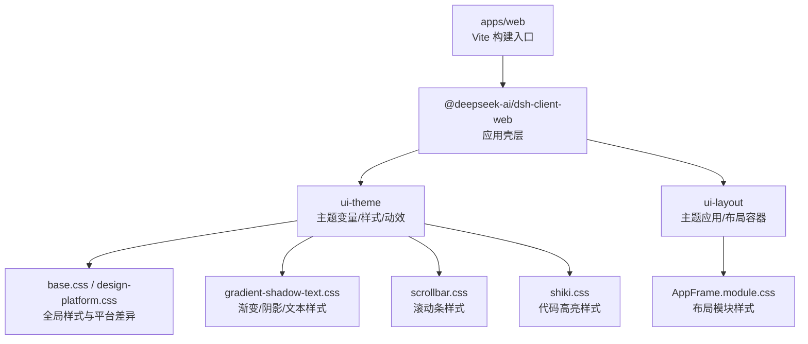
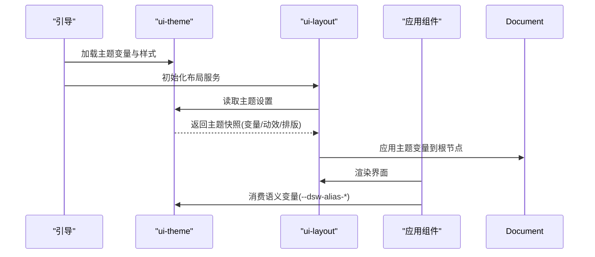
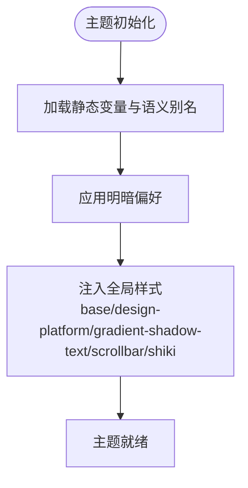
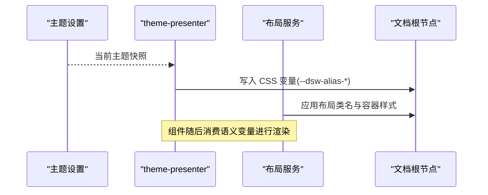
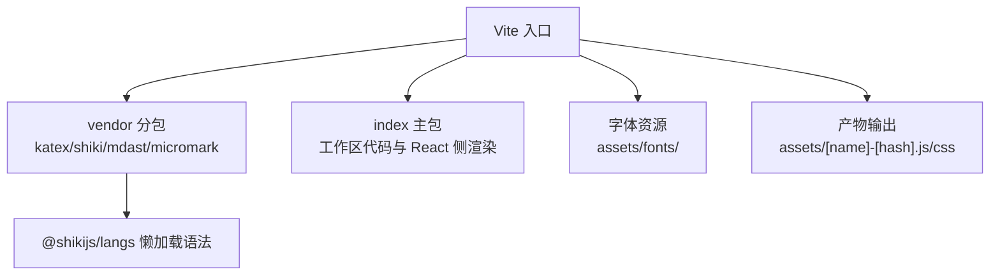
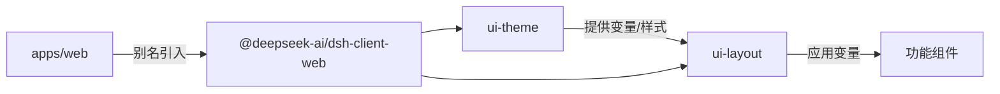

# 样式与主题

<cite>
**本文引用的文件**
- [apps/web/vite.config.ts](file://apps/web/vite.config.ts)
- [apps/web/package.json](file://apps/web/package.json)
- [docs/web-styling.md](file://docs/web-styling.md)
- [packages/client/ui-theme/src/styles/base.css](file://packages/client/ui-theme/src/styles/base.css)
- [packages/client/ui-theme/src/styles/design-platform.css](file://packages/client/ui-theme/src/styles/design-platform.css)
- [packages/client/ui-theme/src/styles/gradient-shadow-text.css](file://packages/client/ui-theme/src/styles/gradient-shadow-text.css)
- [packages/client/ui-theme/src/styles/scrollbar.css](file://packages/client/ui-theme/src/styles/scrollbar.css)
- [packages/client/ui-theme/src/styles/shiki.css](file://packages/client/ui-theme/src/styles/shiki.css)
- [packages/client/ui-theme/src/boot-theme.ts](file://packages/client/ui-theme/src/boot-theme.ts)
- [packages/client/ui-theme/src/theme-settings.ts](file://packages/client/ui-theme/src/theme-settings.ts)
- [packages/client/ui-theme/src/index.ts](file://packages/client/ui-theme/src/index.ts)
- [packages/client/ui-layout/src/client/AppFrame.module.css](file://packages/client/ui-layout/src/client/AppFrame.module.css)
- [packages/client/ui-layout/src/client/theme-presenter.ts](file://packages/client/ui-layout/src/client/theme-presenter.ts)
- [packages/client/ui-layout/src/client/service.ts](file://packages/client/ui-layout/src/client/service.ts)
</cite>

## 目录
1. [简介](#简介)
2. [项目结构](#项目结构)
3. [核心组件](#核心组件)
4. [架构总览](#架构总览)
5. [详细组件分析](#详细组件分析)
6. [依赖关系分析](#依赖关系分析)
7. [性能考量](#性能考量)
8. [故障排查指南](#故障排查指南)
9. [结论](#结论)
10. [附录](#附录)

## 简介
本文件面向 Web 界面的样式与主题系统，系统性说明 CSS 架构、样式组织方式、主题系统与变量定义、响应式断点与适配策略、动画与过渡实现、样式定制与主题切换方法，以及样式性能优化与打包策略。目标是帮助开发者在不深入源码细节的前提下，快速理解并安全地扩展或定制界面风格。

## 项目结构
Web 前端由 Vite 构建，入口位于 apps/web，通过别名将 @deepseek-ai/dsh-client-web 等客户端包引入到浏览器环境。样式与主题的核心职责被拆分到两个包：
- ui-theme：负责主题变量、语义化别名、排版、动效、渐变阴影、滚动条样式与明暗偏好。
- ui-layout：负责将解析后的主题快照应用到文档，并提供布局相关的样式容器。

图表来源
- [apps/web/vite.config.ts:92-160](file://apps/web/vite.config.ts#L92-L160)
- [packages/client/ui-theme/src/styles/base.css](file://packages/client/ui-theme/src/styles/base.css)
- [packages/client/ui-theme/src/styles/design-platform.css](file://packages/client/ui-theme/src/styles/design-platform.css)
- [packages/client/ui-theme/src/styles/gradient-shadow-text.css](file://packages/client/ui-theme/src/styles/gradient-shadow-text.css)
- [packages/client/ui-theme/src/styles/scrollbar.css](file://packages/client/ui-theme/src/styles/scrollbar.css)
- [packages/client/ui-theme/src/styles/shiki.css](file://packages/client/ui-theme/src/styles/shiki.css)
- [packages/client/ui-layout/src/client/AppFrame.module.css](file://packages/client/ui-layout/src/client/AppFrame.module.css)

章节来源
- [apps/web/vite.config.ts:92-160](file://apps/web/vite.config.ts#L92-L160)
- [apps/web/package.json:22-31](file://apps/web/package.json#L22-L31)
- [docs/web-styling.md:7-21](file://docs/web-styling.md#L7-L21)

## 核心组件
- 主题所有权与职责划分
  - ui-theme 拥有静态色板、语义别名、排版、动效、渐变阴影、滚动条样式与明暗偏好。
  - ui-layout 负责把解析后的主题快照应用到文档根节点，使全局样式生效。
  - 功能组件仅消费语义别名，不重复定义全局主题；组件级样式使用 CSS Modules 就近管理。
- 组件样式规则
  - 使用 CSS Modules 与 clsx；不使用外部 UI 库或 Tailwind。
  - 在功能组件中使用 --dsw-alias-* 语义令牌；避免直接复制静态色板或硬编码颜色。
  - 主题选择器不得出现在功能组件 CSS 中；明暗覆盖由主题方统一处理。
  - 字体大小需与行高配对，优先使用主题排版变量。
  - 源文本、终端输出、diff 行保持不换行以保留列对齐；共享滚动条样式而非组件内自定义滚动条。
  - 表现逻辑放入 CSS；React 内联样式可传递组件本地自定义属性，但不承载主题分支。
  - 新增过渡或悬停控制时，必须保留键盘焦点可见性与尊重 reduced-motion。

章节来源
- [docs/web-styling.md:7-21](file://docs/web-styling.md#L7-L21)

## 架构总览
主题与样式在运行时的工作流如下：
- 启动阶段：ui-theme 提供主题变量与样式资源；boot-theme 负责初始化主题状态。
- 应用挂载：ui-layout 的 theme-presenter 读取当前主题设置，将主题快照（如 CSS 变量）注入到文档根节点。
- 组件消费：功能组件通过 CSS Modules 与语义变量进行样式表达，确保与主题解耦。

图表来源
- [packages/client/ui-theme/src/boot-theme.ts](file://packages/client/ui-theme/src/boot-theme.ts)
- [packages/client/ui-theme/src/theme-settings.ts](file://packages/client/ui-theme/src/theme-settings.ts)
- [packages/client/ui-layout/src/client/theme-presenter.ts](file://packages/client/ui-layout/src/client/theme-presenter.ts)
- [packages/client/ui-layout/src/client/service.ts](file://packages/client/ui-layout/src/client/service.ts)

## 详细组件分析

### 主题系统（ui-theme）
- 职责范围
  - 定义 --dsw-* 静态比例尺与 --dsw-alias-* 语义别名。
  - 管理排版、动效、渐变、阴影、滚动条样式与明暗偏好。
  - 提供主题设置与持久化接口，供 ui-layout 消费。
- 样式组织
  - base.css：基础重置与全局变量。
  - design-platform.css：平台差异与兼容性处理。
  - gradient-shadow-text.css：渐变、阴影、文本样式。
  - scrollbar.css：统一的滚动条样式。
  - shiki.css：代码高亮样式。
- 运行期行为
  - boot-theme 初始化主题状态。
  - theme-settings 暴露主题设置读写能力。
  - index.ts 导出主题 API，供其他包引用。

图表来源
- [packages/client/ui-theme/src/styles/base.css](file://packages/client/ui-theme/src/styles/base.css)
- [packages/client/ui-theme/src/styles/design-platform.css](file://packages/client/ui-theme/src/styles/design-platform.css)
- [packages/client/ui-theme/src/styles/gradient-shadow-text.css](file://packages/client/ui-theme/src/styles/gradient-shadow-text.css)
- [packages/client/ui-theme/src/styles/scrollbar.css](file://packages/client/ui-theme/src/styles/scrollbar.css)
- [packages/client/ui-theme/src/styles/shiki.css](file://packages/client/ui-theme/src/styles/shiki.css)
- [packages/client/ui-theme/src/boot-theme.ts](file://packages/client/ui-theme/src/boot-theme.ts)
- [packages/client/ui-theme/src/theme-settings.ts](file://packages/client/ui-theme/src/theme-settings.ts)
- [packages/client/ui-theme/src/index.ts](file://packages/client/ui-theme/src/index.ts)

章节来源
- [docs/web-styling.md:7-21](file://docs/web-styling.md#L7-L21)
- [packages/client/ui-theme/src/styles/base.css](file://packages/client/ui-theme/src/styles/base.css)
- [packages/client/ui-theme/src/styles/design-platform.css](file://packages/client/ui-theme/src/styles/design-platform.css)
- [packages/client/ui-theme/src/styles/gradient-shadow-text.css](file://packages/client/ui-theme/src/styles/gradient-shadow-text.css)
- [packages/client/ui-theme/src/styles/scrollbar.css](file://packages/client/ui-theme/src/styles/scrollbar.css)
- [packages/client/ui-theme/src/styles/shiki.css](file://packages/client/ui-theme/src/styles/shiki.css)
- [packages/client/ui-theme/src/boot-theme.ts](file://packages/client/ui-theme/src/boot-theme.ts)
- [packages/client/ui-theme/src/theme-settings.ts](file://packages/client/ui-theme/src/theme-settings.ts)
- [packages/client/ui-theme/src/index.ts](file://packages/client/ui-theme/src/index.ts)

### 布局与主题呈现（ui-layout）
- 职责范围
  - 将主题快照应用到文档根节点，确保全局 CSS 变量生效。
  - 提供布局容器与列配置，配合主题完成整体页面结构。
- 关键文件
  - theme-presenter.ts：读取主题设置并更新 DOM 上的主题变量。
  - service.ts：提供布局服务，协调主题与组件渲染。
  - AppFrame.module.css：布局容器的模块样式。

图表来源
- [packages/client/ui-layout/src/client/theme-presenter.ts](file://packages/client/ui-layout/src/client/theme-presenter.ts)
- [packages/client/ui-layout/src/client/service.ts](file://packages/client/ui-layout/src/client/service.ts)
- [packages/client/ui-layout/src/client/AppFrame.module.css](file://packages/client/ui-layout/src/client/AppFrame.module.css)

章节来源
- [packages/client/ui-layout/src/client/theme-presenter.ts](file://packages/client/ui-layout/src/client/theme-presenter.ts)
- [packages/client/ui-layout/src/client/service.ts](file://packages/client/ui-layout/src/client/service.ts)
- [packages/client/ui-layout/src/client/AppFrame.module.css](file://packages/client/ui-layout/src/client/AppFrame.module.css)

### 构建与打包（apps/web）
- Vite 配置要点
  - 禁止独立 serve：防止未注入 boot 清单的裸壳暴露。
  - vendor 分包：将数学、语法高亮、Markdown 解析等重型依赖单独打包为 vendor chunk，减少主包体积。
  - 语法分词懒加载：@shikijs/langs 的语法按需加载，初始仅包含必要语法。
  - 资源分组：字体资源归入 assets/fonts/，语言分词归入 assets/langs/，提升缓存命中率。
  - 别名映射：将客户端包指向源码，以便 CSS 走 Vite 管线参与构建。
- 脚本与依赖
  - build/dev/watch 脚本用于构建与开发。
  - 依赖 React 与 dsh-client-web 等客户端包。

图表来源
- [apps/web/vite.config.ts:21-61](file://apps/web/vite.config.ts#L21-L61)
- [apps/web/vite.config.ts:92-127](file://apps/web/vite.config.ts#L92-L127)
- [apps/web/vite.config.ts:129-159](file://apps/web/vite.config.ts#L129-L159)
- [apps/web/package.json:22-31](file://apps/web/package.json#L22-L31)

章节来源
- [apps/web/vite.config.ts:21-61](file://apps/web/vite.config.ts#L21-L61)
- [apps/web/vite.config.ts:92-127](file://apps/web/vite.config.ts#L92-L127)
- [apps/web/vite.config.ts:129-159](file://apps/web/vite.config.ts#L129-L159)
- [apps/web/package.json:22-31](file://apps/web/package.json#L22-L31)

## 依赖关系分析
- 样式所有权与消费关系
  - ui-theme 提供主题变量与样式；ui-layout 负责应用；功能组件消费语义变量。
- 构建依赖
  - apps/web 通过 Vite 别名将客户端包引入源码，确保 CSS 参与构建管线。
  - vendor 分包隔离重型依赖，提高缓存命中与首屏性能。

图表来源
- [apps/web/vite.config.ts:129-149](file://apps/web/vite.config.ts#L129-L149)
- [docs/web-styling.md:7-21](file://docs/web-styling.md#L7-L21)

章节来源
- [apps/web/vite.config.ts:129-149](file://apps/web/vite.config.ts#L129-L149)
- [docs/web-styling.md:7-21](file://docs/web-styling.md#L7-L21)

## 性能考量
- 分包策略
  - 将数学、语法高亮、Markdown 解析等重型依赖放入 vendor 包，减少主包体积。
  - 语法分词按需加载，避免一次性引入所有语言。
- 资源组织
  - 字体资源按类型分组到 assets/fonts/，便于浏览器缓存与 CDN 分发。
  - 语言分词归入 assets/langs/，支持懒加载与增量更新。
- 构建优化
  - 启用 sourcemap 便于调试。
  - 通过别名确保 CSS 走 Vite 管线，充分利用现代构建工具的能力。
- 主题与样式
  - 使用语义变量减少重复样式，降低 CSS 体积。
  - 遵循组件样式就近原则，避免全局污染与选择器冲突。

章节来源
- [apps/web/vite.config.ts:21-61](file://apps/web/vite.config.ts#L21-L61)
- [apps/web/vite.config.ts:92-127](file://apps/web/vite.config.ts#L92-L127)
- [docs/web-styling.md:7-21](file://docs/web-styling.md#L7-L21)

## 故障排查指南
- 无法独立启动 web 服务
  - 现象：尝试直接 serve apps/web 会抛出错误，提示需要经由 dsh web 启动。
  - 原因：缺少 boot 清单注入，导致应用壳层不完整。
  - 解决：使用仓库命令 pnpm dsh web 或安装后的 dsh web 启动。
- 样式未生效或主题未应用
  - 检查 ui-theme 是否已正确加载并注入全局样式。
  - 确认 ui-layout 的 theme-presenter 已将主题变量写入文档根节点。
  - 验证功能组件是否使用了 --dsw-alias-* 语义变量，而非硬编码颜色。
- 构建产物异常
  - 检查 vendor 分包是否正确分离重型依赖。
  - 确认字体与语言分词资源路径是否符合约定（assets/fonts/、assets/langs/）。
  - 查看 sourcemap 与构建日志定位问题。

章节来源
- [apps/web/vite.config.ts:11-19](file://apps/web/vite.config.ts#L11-L19)
- [packages/client/ui-theme/src/boot-theme.ts](file://packages/client/ui-theme/src/boot-theme.ts)
- [packages/client/ui-layout/src/client/theme-presenter.ts](file://packages/client/ui-layout/src/client/theme-presenter.ts)

## 结论
本项目的样式与主题系统通过清晰的职责划分与模块化组织，实现了主题变量的集中管理与组件样式的解耦消费。结合 Vite 的分包与资源组织策略，既保证了首屏性能，又提供了良好的可扩展性。遵循文档中的样式规则与打包策略，可以在不破坏主题一致性的前提下，安全地进行样式定制与主题切换。

## 附录
- 主题定制建议
  - 在 ui-theme 中添加或修改共享令牌，并在功能组件中消费其语义别名。
  - 如需新增主题分支，请在主题方统一处理明暗覆盖，避免在功能组件中引入主题选择器。
- 响应式与适配
  - 使用主题排版变量与语义变量，确保在不同屏幕尺寸下的一致性。
  - 对于需要保持列对齐的内容（如终端输出、diff），使用共享滚动条样式与不换行策略。
- 动画与过渡
  - 使用主题定义的动效变量，确保跨组件一致性。
  - 新增过渡时需保留键盘焦点可见性，并尊重 reduced-motion 偏好。