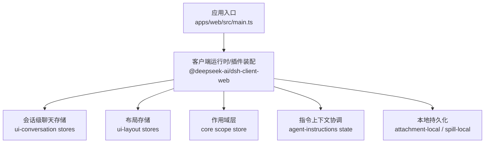
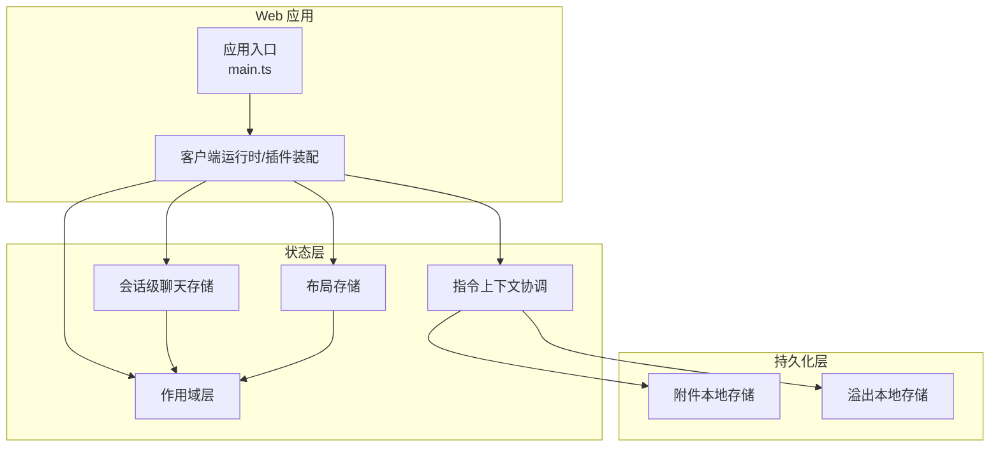
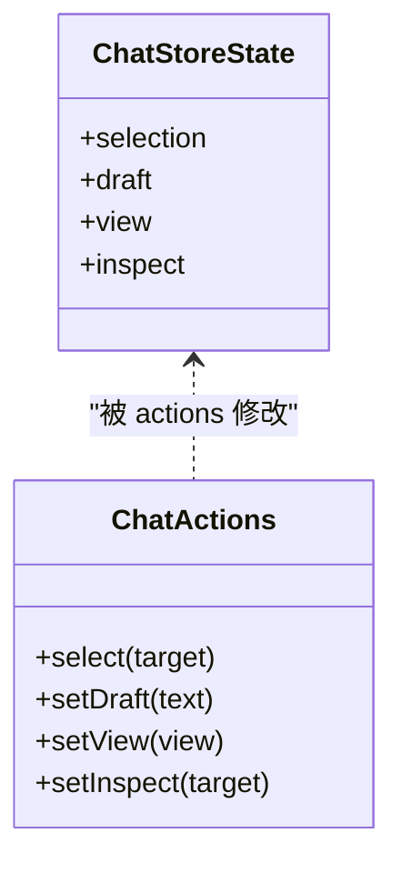
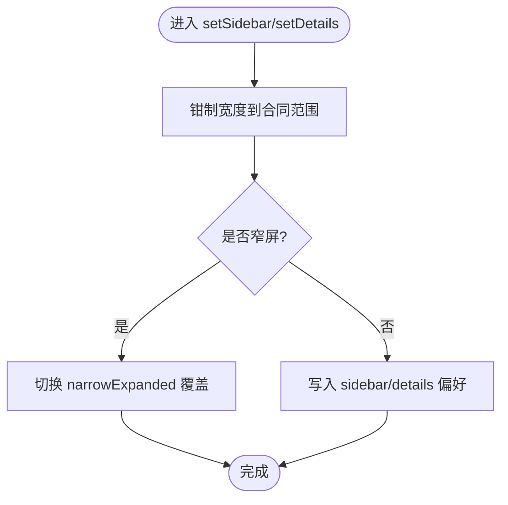
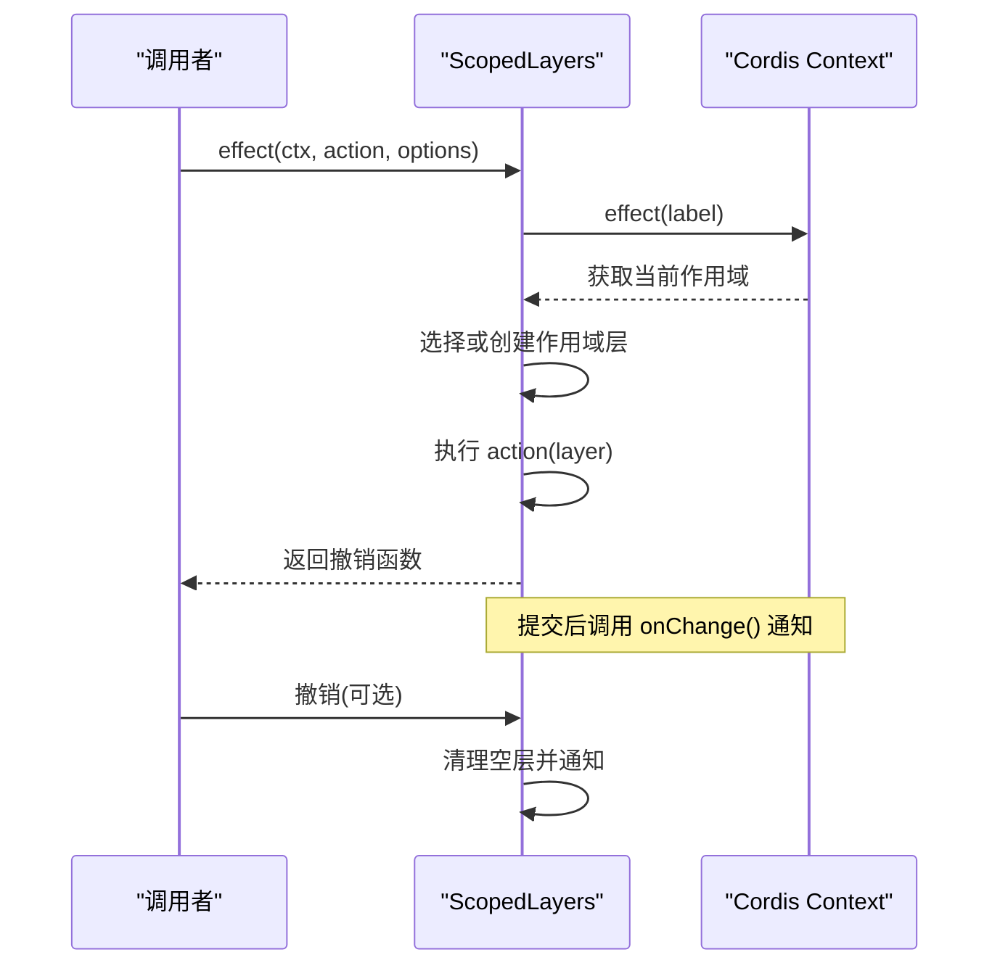
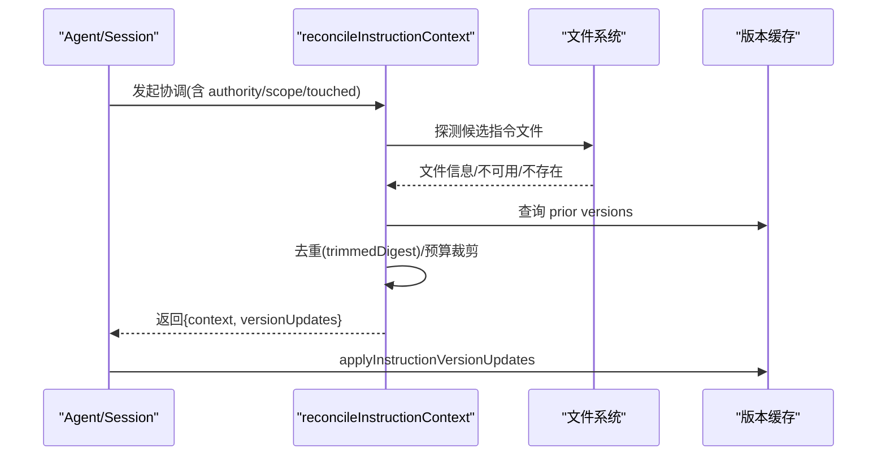
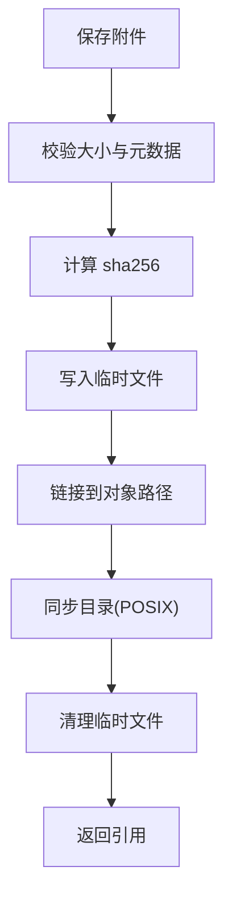
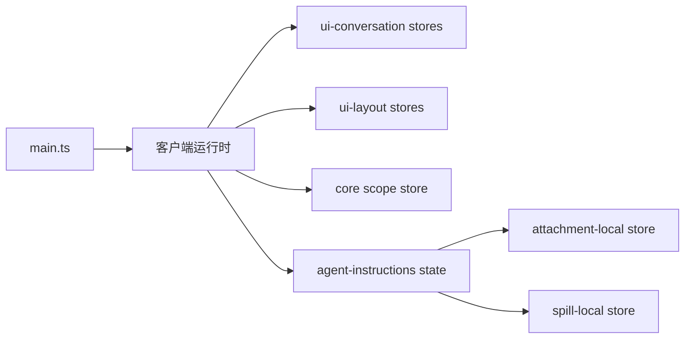

# 状态管理

<cite>
**本文引用的文件**
- [apps/web/src/main.ts](file://apps/web/src/main.ts)
- [packages/client/ui-conversation/src/client/stores.ts](file://packages/client/ui-conversation/src/client/stores.ts)
- [packages/client/ui-layout/src/client/stores.ts](file://packages/client/ui-layout/src/client/stores.ts)
- [packages/core/scope/src/store.ts](file://packages/core/scope/src/store.ts)
- [packages/context/agent-instructions/src/state.ts](file://packages/context/agent-instructions/src/state.ts)
- [packages/spill/spill-local/src/store.ts](file://packages/spill/spill-local/src/store.ts)
- [packages/attachment/attachment-local/src/store.ts](file://packages/attachment/attachment-local/src/store.ts)
</cite>

## 目录
1. [简介](#简介)
2. [项目结构](#项目结构)
3. [核心组件](#核心组件)
4. [架构总览](#架构总览)
5. [详细组件分析](#详细组件分析)
6. [依赖关系分析](#依赖关系分析)
7. [性能考量](#性能考量)
8. [故障排查指南](#故障排查指南)
9. [结论](#结论)
10. [附录](#附录)

## 简介
本文件面向 Web 界面状态管理，系统性说明全局状态与本地状态的组织方式、状态同步与一致性保证、持久化与恢复策略、变更监听与副作用处理，以及调试与性能监控工具与实践。文档基于仓库中客户端运行时存储、作用域层、指令上下文协调、以及本地持久化实现进行归纳与可视化。

## 项目结构
Web 应用入口仅负责挂载与启动，真正的状态管理与插件装配位于客户端运行时与业务模块中：
- 应用入口：最小化引导，定位挂载点并运行 AppWebEntry。
- 会话级聊天状态：按会话隔离的聊天输入、选择、视图与检查态。
- 布局状态：面板宽度、窄屏模式与详情面板开关等 UI 布局偏好。
- 作用域层：跨注册表的全局与精确作用域叠加，支持变更通知与撤销。
- 指令上下文协调：将工作区指令文件差异渲染为会话可见消息，维护版本缓存与变更集。
- 本地持久化：附件内容寻址存储、溢出数据（spill）安全落盘。

图表来源
- [apps/web/src/main.ts:1-11](file://apps/web/src/main.ts#L1-L11)
- [packages/client/ui-conversation/src/client/stores.ts:1-35](file://packages/client/ui-conversation/src/client/stores.ts#L1-L35)
- [packages/client/ui-layout/src/client/stores.ts:1-73](file://packages/client/ui-layout/src/client/stores.ts#L1-L73)
- [packages/core/scope/src/store.ts:1-268](file://packages/core/scope/src/store.ts#L1-L268)
- [packages/context/agent-instructions/src/state.ts:1-434](file://packages/context/agent-instructions/src/state.ts#L1-L434)
- [packages/attachment/attachment-local/src/store.ts:1-232](file://packages/attachment/attachment-local/src/store.ts#L1-L232)
- [packages/spill/spill-local/src/store.ts:1-121](file://packages/spill/spill-local/src/store.ts#L1-L121)

章节来源
- [apps/web/src/main.ts:1-11](file://apps/web/src/main.ts#L1-L11)

## 核心组件
- 会话级聊天存储：定义每会话的选中项、草稿、视图与检查目标，提供 actions 以原子更新状态，并声明持久化键。
- 布局存储：管理侧边栏与详情面板宽度、窄屏切换与展开覆盖，确保宽度在合同范围内，避免越界。
- 作用域层：维护全局与精确作用域的注册表叠加，支持链式合并、变更通知与撤销，保证作用域隔离与可见性。
- 指令上下文协调：对比可见状态与提供者文件，生成变更集并渲染为会话消息；维护每会话的版本缓存，避免重复读取与渲染。
- 本地持久化：附件采用内容寻址存储，写入前校验元数据与大小限制，落盘后通过链接与目录同步保证幂等与崩溃恢复；溢出数据使用安全路径编码与独占写保护。

章节来源
- [packages/client/ui-conversation/src/client/stores.ts:1-35](file://packages/client/ui-conversation/src/client/stores.ts#L1-L35)
- [packages/client/ui-layout/src/client/stores.ts:1-73](file://packages/client/ui-layout/src/client/stores.ts#L1-L73)
- [packages/core/scope/src/store.ts:1-268](file://packages/core/scope/src/store.ts#L1-L268)
- [packages/context/agent-instructions/src/state.ts:1-434](file://packages/context/agent-instructions/src/state.ts#L1-L434)
- [packages/attachment/attachment-local/src/store.ts:1-232](file://packages/attachment/attachment-local/src/store.ts#L1-L232)
- [packages/spill/spill-local/src/store.ts:1-121](file://packages/spill/spill-local/src/store.ts#L1-L121)

## 架构总览
下图展示从应用入口到各状态组件的交互关系，包括状态定义、作用域叠加、指令上下文协调与本地持久化。

图表来源
- [apps/web/src/main.ts:1-11](file://apps/web/src/main.ts#L1-L11)
- [packages/client/ui-conversation/src/client/stores.ts:1-35](file://packages/client/ui-conversation/src/client/stores.ts#L1-L35)
- [packages/client/ui-layout/src/client/stores.ts:1-73](file://packages/client/ui-layout/src/client/stores.ts#L1-L73)
- [packages/core/scope/src/store.ts:1-268](file://packages/core/scope/src/store.ts#L1-L268)
- [packages/context/agent-instructions/src/state.ts:1-434](file://packages/context/agent-instructions/src/state.ts#L1-L434)
- [packages/attachment/attachment-local/src/store.ts:1-232](file://packages/attachment/attachment-local/src/store.ts#L1-L232)
- [packages/spill/spill-local/src/store.ts:1-121](file://packages/spill/spill-local/src/store.ts#L1-L121)

## 详细组件分析

### 会话级聊天存储（局部状态）
- 职责：维护每会话的选择、草稿、视图与检查目标，提供 actions 进行原子更新。
- 组织：通过 defineStore 声明 init 与 actions，绑定持久化键，消费方通过 PropsStore 的快照选择器订阅。
- 同步与一致性：actions 直接修改 draft，框架保证事务性与观察者通知；持久化键用于跨会话恢复。
- 副作用：无外部副作用，纯状态更新。

图表来源
- [packages/client/ui-conversation/src/client/stores.ts:1-35](file://packages/client/ui-conversation/src/client/stores.ts#L1-L35)

章节来源
- [packages/client/ui-conversation/src/client/stores.ts:1-35](file://packages/client/ui-conversation/src/client/stores.ts#L1-L35)

### 布局存储（局部状态）
- 职责：管理侧边栏与详情面板宽度、窄屏模式与展开覆盖，确保宽度在合同范围。
- 组织：defineStore 初始化默认值，actions 对宽度进行钳制与切换；窄屏时仅翻转覆盖位，不破坏偏好。
- 同步与一致性：所有宽度写入均受 clampWidth 约束；打开/关闭显式设置 0 或默认值，避免漂移。
- 副作用：无外部副作用。

图表来源
- [packages/client/ui-layout/src/client/stores.ts:1-73](file://packages/client/ui-layout/src/client/stores.ts#L1-L73)

章节来源
- [packages/client/ui-layout/src/client/stores.ts:1-73](file://packages/client/ui-layout/src/client/stores.ts#L1-L73)

### 作用域层（全局与精确作用域叠加）
- 职责：维护全局与精确作用域的注册表叠加，支持链式合并、变更通知与撤销。
- 组织：ScopedLayers 持有 global 与 scoped Map；merge 按作用域链合并命名条目；effect 在上下文中执行原子动作并返回可撤销函数。
- 同步与一致性：读取不创建作用域层；变更通过 ctx.effect 包装，确保撤销与通知；空层自动回收。
- 副作用：onChange 回调触发下游观察者；撤销清理作用域层。

图表来源
- [packages/core/scope/src/store.ts:152-268](file://packages/core/scope/src/store.ts#L152-L268)

章节来源
- [packages/core/scope/src/store.ts:1-268](file://packages/core/scope/src/store.ts#L1-L268)

### 指令上下文协调（全局状态与数据一致性）
- 职责：对比可见状态与提供者文件，生成变更集并渲染为会话消息；维护每会话的版本缓存，避免重复读取与渲染。
- 组织：reconcileInstructionContext 计算可见变更、探测文件、去重与预算裁剪；baselineInstructionState 构建基线；applyInstructionVersionUpdates 应用版本缓存更新。
- 同步与一致性：visibleInstructionChanges 过滤出可见变更；trimmedDigest 去重；rendered.changes 决定保留的缓存更新；未渲染则不提交版本更新。
- 副作用：产出 UserMessage 作为会话可见上下文；版本缓存更新影响后续快速路径。

图表来源
- [packages/context/agent-instructions/src/state.ts:158-434](file://packages/context/agent-instructions/src/state.ts#L158-L434)

章节来源
- [packages/context/agent-instructions/src/state.ts:1-434](file://packages/context/agent-instructions/src/state.ts#L1-L434)

### 本地持久化（附件与溢出）
- 附件存储：内容寻址（sha256），写入前校验大小与元数据；临时文件写入后链接至目标，目录 fsync 保证崩溃恢复；读取时再次校验完整性与元数据。
- 溢出存储：会话级私有目录，安全路径编码防止穿越；随机前缀+建议名，独占写权限；字节长度统计。
- 一致性：附件通过哈希验证；溢出通过安全编码与独占写避免冲突；两者均考虑并发与崩溃场景。

图表来源
- [packages/attachment/attachment-local/src/store.ts:136-194](file://packages/attachment/attachment-local/src/store.ts#L136-L194)

章节来源
- [packages/attachment/attachment-local/src/store.ts:1-232](file://packages/attachment/attachment-local/src/store.ts#L1-L232)
- [packages/spill/spill-local/src/store.ts:1-121](file://packages/spill/spill-local/src/store.ts#L1-L121)

## 依赖关系分析
- 应用入口依赖客户端运行时进行装配；运行时注入各存储与作用域层。
- 会话级与布局存储通过 defineStore 暴露 actions，消费方通过 PropsStore 订阅快照。
- 作用域层为其他组件提供跨注册表的叠加与通知能力。
- 指令上下文协调依赖文件系统与版本缓存，输出会话可见消息与缓存更新。
- 持久化层为附件与溢出提供安全、幂等、可恢复的存储能力。

图表来源
- [apps/web/src/main.ts:1-11](file://apps/web/src/main.ts#L1-L11)
- [packages/client/ui-conversation/src/client/stores.ts:1-35](file://packages/client/ui-conversation/src/client/stores.ts#L1-L35)
- [packages/client/ui-layout/src/client/stores.ts:1-73](file://packages/client/ui-layout/src/client/stores.ts#L1-L73)
- [packages/core/scope/src/store.ts:1-268](file://packages/core/scope/src/store.ts#L1-L268)
- [packages/context/agent-instructions/src/state.ts:1-434](file://packages/context/agent-instructions/src/state.ts#L1-L434)
- [packages/attachment/attachment-local/src/store.ts:1-232](file://packages/attachment/attachment-local/src/store.ts#L1-L232)
- [packages/spill/spill-local/src/store.ts:1-121](file://packages/spill/spill-local/src/store.ts#L1-L121)

章节来源
- [apps/web/src/main.ts:1-11](file://apps/web/src/main.ts#L1-L11)
- [packages/client/ui-conversation/src/client/stores.ts:1-35](file://packages/client/ui-conversation/src/client/stores.ts#L1-L35)
- [packages/client/ui-layout/src/client/stores.ts:1-73](file://packages/client/ui-layout/src/client/stores.ts#L1-L73)
- [packages/core/scope/src/store.ts:1-268](file://packages/core/scope/src/store.ts#L1-L268)
- [packages/context/agent-instructions/src/state.ts:1-434](file://packages/context/agent-instructions/src/state.ts#L1-L434)
- [packages/attachment/attachment-local/src/store.ts:1-232](file://packages/attachment/attachment-local/src/store.ts#L1-L232)
- [packages/spill/spill-local/src/store.ts:1-121](file://packages/spill/spill-local/src/store.ts#L1-L121)

## 性能考量
- 指令上下文协调使用 trimmedDigest 去重与 per-directory 集合，避免重复读取与渲染；仅在必要时读取完整内容，降低 I/O 压力。
- 作用域层按需创建作用域层并在空时回收，减少内存占用；链式合并只在读取时进行，避免写时开销。
- 布局存储对宽度进行钳制，避免频繁边界检查与无效更新；窄屏模式仅翻转覆盖位，保持偏好稳定。
- 附件存储通过内容寻址与链接实现幂等写入，减少重复存储；目录同步仅在发布阶段执行，平衡一致性与性能。
- 溢出存储使用安全编码与随机前缀，避免冲突与遍历攻击；会话级目录隔离提升并发安全性。

[本节为通用性能讨论，不直接分析具体文件]

## 故障排查指南
- 指令上下文协调失败：
  - 检查 visibleInstructionChanges 是否正确过滤可见变更；确认 authorityMessages 与 scopeMessages 的来源。
  - 若文件不可用或不存在，查看 probeScopeInstruction 分支逻辑与 priorVersions 回滚行为。
  - 参考路径：[packages/context/agent-instructions/src/state.ts:136-156](file://packages/context/agent-instructions/src/state.ts#L136-L156)、[packages/context/agent-instructions/src/state.ts:331-422](file://packages/context/agent-instructions/src/state.ts#L331-L422)
- 附件写入失败：
  - 校验大小与元数据；检查临时文件写入与链接过程；确认目录同步与权限设置。
  - 参考路径：[packages/attachment/attachment-local/src/store.ts:136-194](file://packages/attachment/attachment-local/src/store.ts#L136-L194)
- 溢出存储异常：
  - 检查安全路径编码与随机前缀生成；确认会话目录创建与独占写权限。
  - 参考路径：[packages/spill/spill-local/src/store.ts:48-63](file://packages/spill/spill-local/src/store.ts#L48-L63)、[packages/spill/spill-local/src/store.ts:107-120](file://packages/spill/spill-local/src/store.ts#L107-L120)
- 作用域层通知问题：
  - 确认 effect 中的 onChange 调用时机；检查撤销时是否清理空层并通知。
  - 参考路径：[packages/core/scope/src/store.ts:226-268](file://packages/core/scope/src/store.ts#L226-L268)

章节来源
- [packages/context/agent-instructions/src/state.ts:136-156](file://packages/context/agent-instructions/src/state.ts#L136-L156)
- [packages/context/agent-instructions/src/state.ts:331-422](file://packages/context/agent-instructions/src/state.ts#L331-L422)
- [packages/attachment/attachment-local/src/store.ts:136-194](file://packages/attachment/attachment-local/src/store.ts#L136-L194)
- [packages/spill/spill-local/src/store.ts:48-63](file://packages/spill/spill-local/src/store.ts#L48-L63)
- [packages/spill/spill-local/src/store.ts:107-120](file://packages/spill/spill-local/src/store.ts#L107-L120)
- [packages/core/scope/src/store.ts:226-268](file://packages/core/scope/src/store.ts#L226-L268)

## 结论
该项目的 Web 状态管理采用分层设计：会话级与布局状态作为局部状态，通过 defineStore 暴露 actions 与持久化键；作用域层提供全局与精确作用域的叠加与通知；指令上下文协调负责将工作区指令差异渲染为会话可见消息，并维护版本缓存；本地持久化层提供安全、幂等、可恢复的存储能力。整体架构在保证一致性与可恢复性的同时，兼顾了性能与可维护性。

[本节为总结性内容，不直接分析具体文件]

## 附录
- 最佳实践
  - 局部状态优先：将 UI 相关状态（如布局、聊天草稿）放在会话级存储中，便于隔离与恢复。
  - 全局状态收敛：通过作用域层统一管理跨注册表的状态叠加，避免散落的全局变量。
  - 数据一致性：在指令上下文协调中使用 trimmedDigest 去重与预算裁剪，确保渲染结果稳定。
  - 持久化策略：附件采用内容寻址与链接，溢出采用安全编码与独占写，确保幂等与崩溃恢复。
  - 变更监听与副作用：通过作用域层的 onChange 与 Cordis effect 机制，集中管理副作用与撤销。
  - 调试与监控：利用 PropsStore 的快照选择器观察状态变化；在指令协调中记录变更集与版本更新，便于回溯。

[本节为通用指导，不直接分析具体文件]