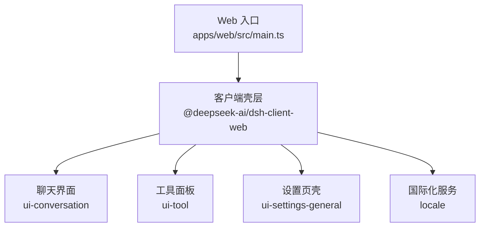
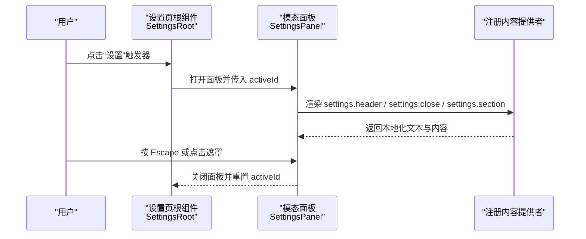
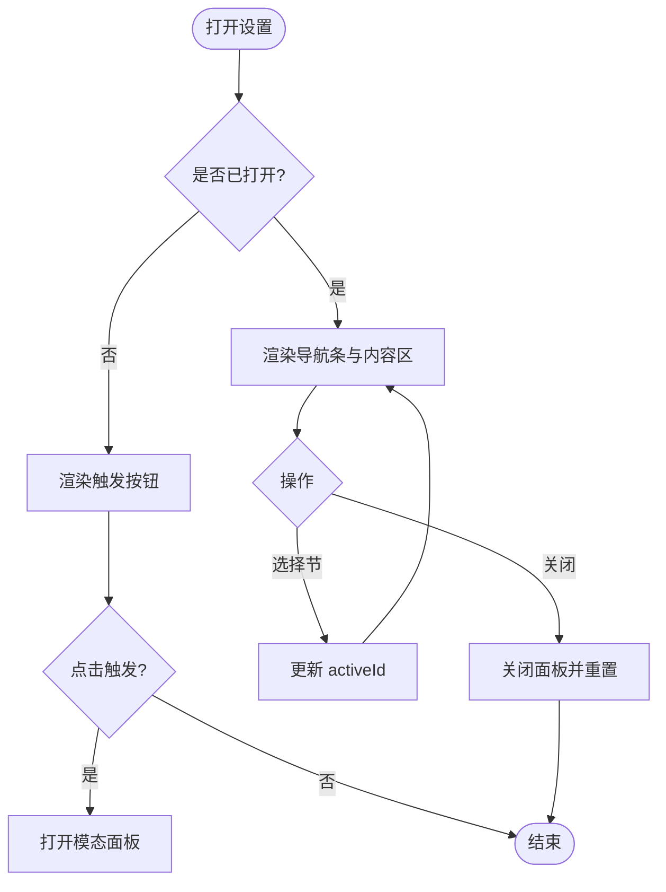
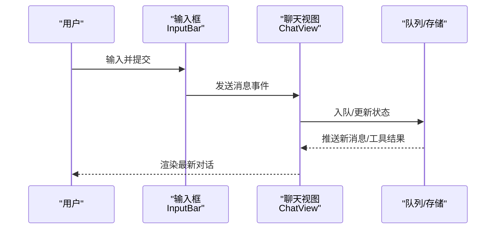
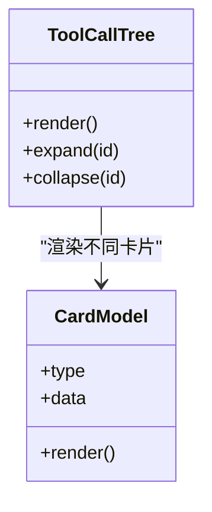
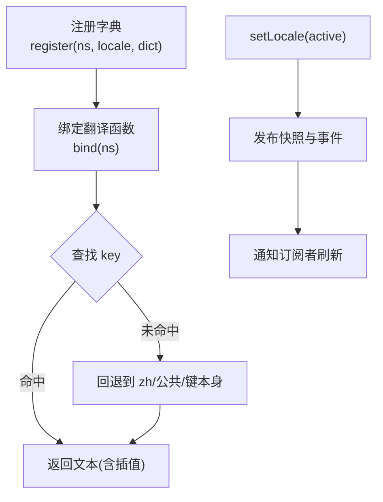
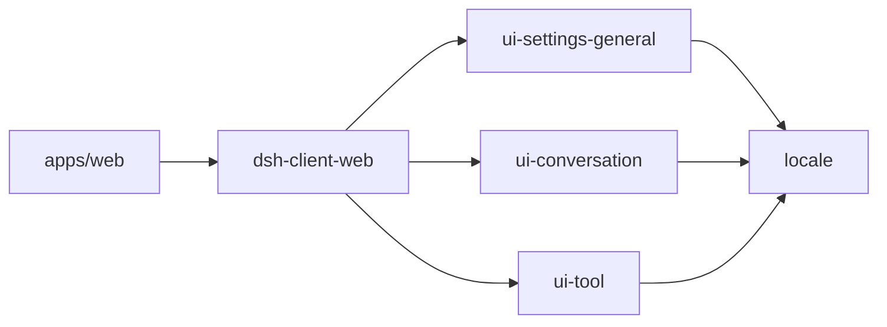

# 用户界面组件

<cite>
**本文引用的文件**
- [apps/web/src/main.ts](file://apps/web/src/main.ts)
- [apps/web/package.json](file://apps/web/package.json)
- [packages/client/ui-settings-general/src/client/SettingsRoot.tsx](file://packages/client/ui-settings-general/src/client/SettingsRoot.tsx)
- [packages/client/ui-settings-general/src/client/chrome.tsx](file://packages/client/ui-settings-general/src/client/chrome.tsx)
- [packages/client/ui-conversation/src/client/chat/ChatView.tsx](file://packages/client/ui-conversation/src/client/chat/ChatView.tsx)
- [packages/client/ui-conversation/src/client/skeleton/InputBar.tsx](file://packages/client/ui-conversation/src/client/skeleton/InputBar.tsx)
- [packages/client/ui-tool/src/client/tool/ToolCallTree.tsx](file://packages/client/ui-tool/src/client/tool/ToolCallTree.tsx)
- [packages/client/locale/src/client/index.ts](file://packages/client/locale/src/client/index.ts)
- [packages/client/locale/src/locale-settings.ts](file://packages/client/locale/src/locale-settings.ts)
- [packages/test-support/client-runtime/src/translate.ts](file://packages/test-support/client-runtime/src/translate.ts)
</cite>

## 目录
1. [简介](#简介)
2. [项目结构](#项目结构)
3. [核心组件](#核心组件)
4. [架构总览](#架构总览)
5. [详细组件分析](#详细组件分析)
6. [依赖关系分析](#依赖关系分析)
7. [性能考量](#性能考量)
8. [故障排查指南](#故障排查指南)
9. [结论](#结论)
10. [附录](#附录)

## 简介
本文件面向 Web 界面的用户界面组件，聚焦聊天界面、工具面板与设置页面等核心 UI 组件的设计与实现。文档覆盖：
- 组件职责与数据流
- 组件间通信与状态传递机制
- 响应式设计与移动端适配要点
- 样式定制与覆盖方式
- 无障碍访问（a11y）与国际化（i18n）支持

## 项目结构
Web 应用入口位于 apps/web，负责挂载由 dsh-client-web 提供的壳层；UI 能力以 packages/client/* 的独立包形式提供，如 ui-conversation（聊天）、ui-tool（工具面板）、ui-settings-general（设置页）以及 locale（国际化）。

图表来源
- [apps/web/src/main.ts:1-11](file://apps/web/src/main.ts#L1-L11)
- [apps/web/package.json:28-38](file://apps/web/package.json#L28-L38)

章节来源
- [apps/web/src/main.ts:1-11](file://apps/web/src/main.ts#L1-L11)
- [apps/web/package.json:1-52](file://apps/web/package.json#L1-L52)

## 核心组件
- 聊天界面（ui-conversation）：承载消息列表、输入框、队列、骨架屏与对话节点渲染。
- 工具面板（ui-tool）：以树形结构展示工具调用详情，并提供多种卡片视图。
- 设置页（ui-settings-general）：侧边栏触发 + 居中模态面板，包含导航条与可插拔内容区。
- 国际化（locale）：字典注册、语言切换、模板插值与持久化偏好。

章节来源
- [packages/client/ui-conversation/src/client/chat/ChatView.tsx](file://packages/client/ui-conversation/src/client/chat/ChatView.tsx)
- [packages/client/ui-tool/src/client/tool/ToolCallTree.tsx](file://packages/client/ui-tool/src/client/tool/ToolCallTree.tsx)
- [packages/client/ui-settings-general/src/client/SettingsRoot.tsx:1-173](file://packages/client/ui-settings-general/src/client/SettingsRoot.tsx#L1-L173)
- [packages/client/locale/src/client/index.ts:104-363](file://packages/client/locale/src/client/index.ts#L104-L363)

## 架构总览
整体采用“壳层 + 插件”模式：Web 入口仅做挂载，具体功能通过 client 包以插槽（slots）和运行时上下文注入到壳层中。设置页作为典型示例，使用“触发器 + 模态面板 + 导航条 + 内容区”的结构，并通过 slots 将标题、关闭按钮、各节内容等交由注册者提供。

图表来源
- [packages/client/ui-settings-general/src/client/SettingsRoot.tsx:43-97](file://packages/client/ui-settings-general/src/client/SettingsRoot.tsx#L43-L97)
- [packages/client/ui-settings-general/src/client/SettingsRoot.tsx:104-173](file://packages/client/ui-settings-general/src/client/SettingsRoot.tsx#L104-L173)

## 详细组件分析

### 设置页（SettingsRoot）
- 职责：提供侧边栏触发按钮与居中模态面板；管理打开/关闭、当前激活节、引导流程。
- 交互：Escape 关闭、遮罩点击关闭、头部关闭按钮关闭；首次进入聚焦关闭按钮。
- 可访问性：dialog 角色、aria-modal、aria-labelledby、aria-current 指示活动项；关闭按钮具备隐藏标签。
- 插槽契约：settings.trigger、settings.header、settings.action、settings.close、settings.section、settings.onboarding。
- 响应式：wide 模式下显示完整触发标签；窄列仅图标。

图表来源
- [packages/client/ui-settings-general/src/client/SettingsRoot.tsx:43-97](file://packages/client/ui-settings-general/src/client/SettingsRoot.tsx#L43-L97)
- [packages/client/ui-settings-general/src/client/SettingsRoot.tsx:104-173](file://packages/client/ui-settings-general/src/client/SettingsRoot.tsx#L104-L173)

章节来源
- [packages/client/ui-settings-general/src/client/SettingsRoot.tsx:1-173](file://packages/client/ui-settings-general/src/client/SettingsRoot.tsx#L1-L173)
- [packages/client/ui-settings-general/src/client/chrome.tsx:1-51](file://packages/client/ui-settings-general/src/client/chrome.tsx#L1-L51)

### 聊天界面（ChatView 与输入）
- 职责：呈现对话消息、助手回复、命令与工具结果；承载输入框与提交策略。
- 数据流：消息与工具调用通过会话/队列状态驱动；输入行为受策略控制。
- 响应式：在窄屏下折叠次要面板，保留核心对话与输入区域。
- 可访问性：为关键交互元素提供语义化角色与标签；键盘可达。

图表来源
- [packages/client/ui-conversation/src/client/chat/ChatView.tsx](file://packages/client/ui-conversation/src/client/chat/ChatView.tsx)
- [packages/client/ui-conversation/src/client/skeleton/InputBar.tsx](file://packages/client/ui-conversation/src/client/skeleton/InputBar.tsx)

章节来源
- [packages/client/ui-conversation/src/client/chat/ChatView.tsx](file://packages/client/ui-conversation/src/client/chat/ChatView.tsx)
- [packages/client/ui-conversation/src/client/skeleton/InputBar.tsx](file://packages/client/ui-conversation/src/client/skeleton/InputBar.tsx)

### 工具面板（ToolCallTree）
- 职责：以树形结构组织工具调用，展开/收起子调用，展示不同卡片视图（读取、搜索、终端、网页等）。
- 数据模型：基于工具调用模型与卡片模型组合，支持差异对比、只读展示等。
- 可访问性：对可展开节点提供键盘操作与语义化标题。

图表来源
- [packages/client/ui-tool/src/client/tool/ToolCallTree.tsx](file://packages/client/ui-tool/src/client/tool/ToolCallTree.tsx)

章节来源
- [packages/client/ui-tool/src/client/tool/ToolCallTree.tsx](file://packages/client/ui-tool/src/client/tool/ToolCallTree.tsx)

### 国际化（LocaleRuntime）
- 职责：维护字典注册表、活跃语言、快照与订阅；提供 t 函数绑定与模板插值。
- 解析链：命名空间活跃语言 -> 命名空间 zh 回退 -> 公共命名空间 -> 键本身（缺失时可见键名）。
- 持久化：通过 Host 设置域保存用户偏好；启动时优先浏览器语言，随后被显式偏好覆盖。
- 测试支持：提供 makeTranslate 用于测试环境模拟翻译链。

图表来源
- [packages/client/locale/src/client/index.ts:104-363](file://packages/client/locale/src/client/index.ts#L104-L363)
- [packages/client/locale/src/locale-settings.ts:1-26](file://packages/client/locale/src/locale-settings.ts#L1-L26)
- [packages/test-support/client-runtime/src/translate.ts:1-32](file://packages/test-support/client-runtime/src/translate.ts#L1-L32)

章节来源
- [packages/client/locale/src/client/index.ts:104-363](file://packages/client/locale/src/client/index.ts#L104-L363)
- [packages/client/locale/src/locale-settings.ts:1-26](file://packages/client/locale/src/locale-settings.ts#L1-L26)
- [packages/test-support/client-runtime/src/translate.ts:1-32](file://packages/test-support/client-runtime/src/translate.ts#L1-L32)

## 依赖关系分析
- Web 入口依赖 dsh-client-web 壳层，并在 package.json 中声明 React 与相关 client 包。
- 设置页依赖 ui-primitives 图标与 ui-slots 类型；通过 slots 与 shell 解耦。
- 聊天界面与工具面板均依赖共享的 slots、store 与 primitives。
- 国际化服务通过 settingsScope 与 connection/remote 集成，向渲染管线注入 t 标准座位。

图表来源
- [apps/web/package.json:28-38](file://apps/web/package.json#L28-L38)
- [packages/client/ui-settings-general/src/client/SettingsRoot.tsx:13-20](file://packages/client/ui-settings-general/src/client/SettingsRoot.tsx#L13-L20)
- [packages/client/locale/src/client/index.ts:346-363](file://packages/client/locale/src/client/index.ts#L346-L363)

章节来源
- [apps/web/package.json:1-52](file://apps/web/package.json#L1-L52)
- [packages/client/ui-settings-general/src/client/SettingsRoot.tsx:13-20](file://packages/client/ui-settings-general/src/client/SettingsRoot.tsx#L13-L20)
- [packages/client/locale/src/client/index.ts:346-363](file://packages/client/locale/src/client/index.ts#L346-L363)

## 性能考量
- 懒加载与按需渲染：设置页仅在打开时挂载模态与监听器，减少常驻开销。
- 局部状态：activeId、open 等视图状态保持组件内，避免全局风暴。
- 字典注册与刷新：国际化服务通过 revision 与订阅机制增量刷新，避免重复重注册导致的性能问题。
- 滚动与交互：在附件/工具面板等横向滚动区域，合理处理 wheel 事件与 reduced-motion 偏好，提升体验。

[本节为通用指导，不直接分析具体文件]

## 故障排查指南
- 设置面板无法关闭：检查 Escape 监听是否在面板生命周期内正确挂载与移除；确认遮罩与关闭按钮事件绑定。
- 国际化文本不生效：确认命名空间字典已注册且 active 语言匹配；检查 t 绑定是否正确注入到组件 props。
- 聊天输入无响应：核对输入框提交策略与队列/存储状态更新路径；验证事件冒泡与 preventDefault 的使用场景。
- 工具面板展开异常：检查树节点 id 唯一性与展开/收起逻辑；确认卡片模型数据完整性。

章节来源
- [packages/client/ui-settings-general/src/client/SettingsRoot.tsx:49-59](file://packages/client/ui-settings-general/src/client/SettingsRoot.tsx#L49-L59)
- [packages/client/locale/src/client/index.ts:284-313](file://packages/client/locale/src/client/index.ts#L284-L313)

## 结论
本项目以“壳层 + 插件”的方式组织 Web UI，聊天、工具与设置等核心组件职责清晰、耦合度低。通过插槽与国际化服务，实现了可插拔的内容与多语言支持。配合合理的状态管理与可访问性实践，可在桌面与移动端提供一致的用户体验。

[本节为总结性内容，不直接分析具体文件]

## 附录

### 响应式设计与移动端适配建议
- 布局：在大屏使用三栏（侧边栏/对话/详情），在小屏折叠侧边栏与详情，仅保留对话与输入。
- 交互：触摸友好的按钮尺寸与间距；手势与键盘兼容（如 Escape 关闭、Tab 顺序）。
- 字体与缩放：使用相对单位与媒体查询，确保在不同 DPI 与字号下可读。

[本节为通用指导，不直接分析具体文件]

### 组件定制与样式覆盖方法
- CSS Modules：各组件使用 .module.css 隔离样式，可通过同名类名替换或外层容器覆盖。
- 主题变量：通过 ui-theme 提供的主题令牌统一色彩与间距。
- 插槽扩展：利用 ui-slots 的 renderSlot 机制插入自定义内容，无需修改核心组件。

[本节为通用指导，不直接分析具体文件]

### 无障碍访问（a11y）要点
- 语义化角色：对话框使用 role="dialog"、aria-modal；导航使用 aria-current。
- 焦点管理：打开对话框聚焦关闭按钮；关闭后恢复焦点。
- 屏幕阅读器：为图标按钮提供隐藏文本标签；确保所有交互均可通过键盘完成。

章节来源
- [packages/client/ui-settings-general/src/client/SettingsRoot.tsx:62-94](file://packages/client/ui-settings-general/src/client/SettingsRoot.tsx#L62-L94)

### 国际化（i18n）接入要点
- 字典注册：按命名空间注册多语言字典；支持 zh 回退与公共词典。
- 模板插值：使用 {name} 占位符进行参数替换；未知占位符保留原样。
- 偏好持久化：通过 Host 设置域保存用户选择的语言；启动时优先浏览器语言，再被显式偏好覆盖。

章节来源
- [packages/client/locale/src/client/index.ts:104-363](file://packages/client/locale/src/client/index.ts#L104-L363)
- [packages/client/locale/src/locale-settings.ts:1-26](file://packages/client/locale/src/locale-settings.ts#L1-L26)
- [packages/test-support/client-runtime/src/translate.ts:1-32](file://packages/test-support/client-runtime/src/translate.ts#L1-L32)