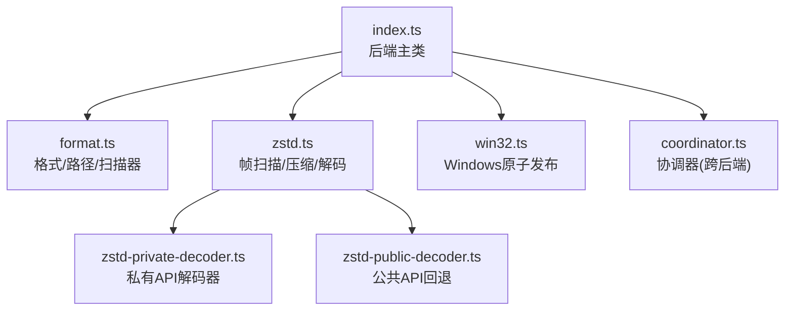
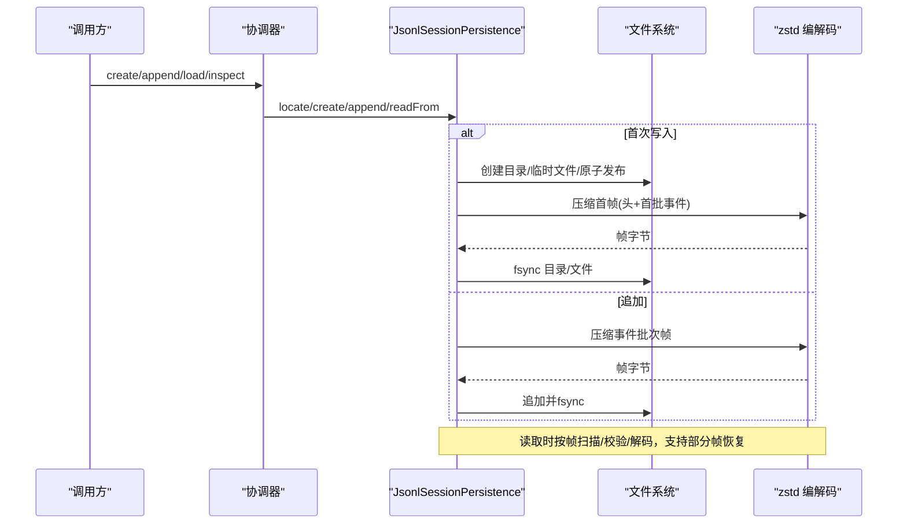
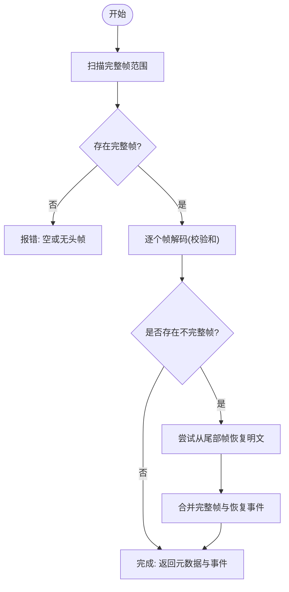
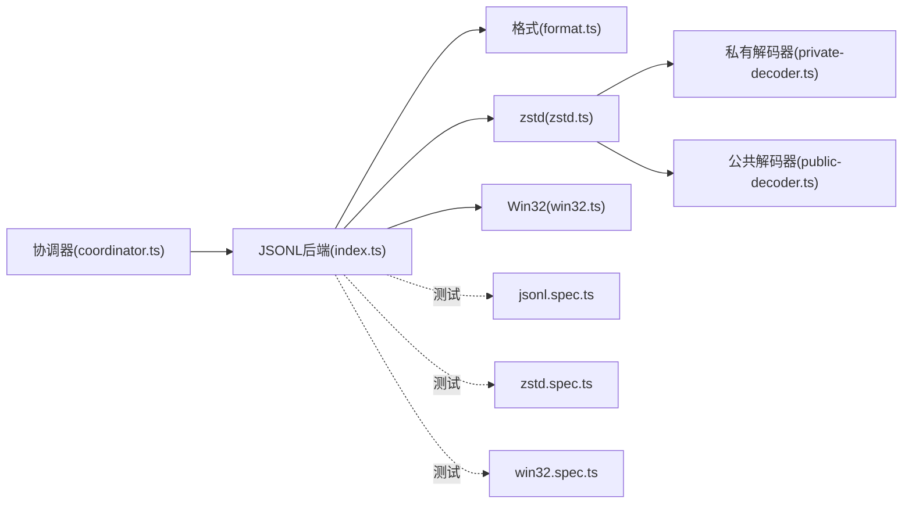

# JSONL 存储后端

<cite>
**本文引用的文件**
- [packages/session/session-persistence-jsonl/src/index.ts](file://packages/session/session-persistence-jsonl/src/index.ts)
- [packages/session/session-persistence-jsonl/src/format.ts](file://packages/session/session-persistence-jsonl/src/format.ts)
- [packages/session/session-persistence-jsonl/src/zstd.ts](file://packages/session/session-persistence-jsonl/src/zstd.ts)
- [packages/session/session-persistence-jsonl/src/zstd-private-decoder.ts](file://packages/session/session-persistence-jsonl/src/zstd-private-decoder.ts)
- [packages/session/session-persistence-jsonl/src/zstd-public-decoder.ts](file://packages/session/session-persistence-jsonl/src/zstd-public-decoder.ts)
- [packages/session/session-persistence-jsonl/src/win32.ts](file://packages/session/session-persistence-jsonl/src/win32.ts)
- [packages/session/session-persistence-jsonl/tests/jsonl.spec.ts](file://packages/session/session-persistence-jsonl/tests/jsonl.spec.ts)
- [packages/session/session-persistence-jsonl/tests/zstd.spec.ts](file://packages/session/session-persistence-jsonl/tests/zstd.spec.ts)
- [packages/session/session-persistence-jsonl/tests/win32.spec.ts](file://packages/session/session-persistence-jsonl/tests/win32.spec.ts)
- [packages/session/session-persistence/src/coordinator.ts](file://packages/session/session-persistence/src/coordinator.ts)
</cite>

## 目录
1. [简介](#简介)
2. [项目结构](#项目结构)
3. [核心组件](#核心组件)
4. [架构总览](#架构总览)
5. [详细组件分析](#详细组件分析)
6. [依赖关系分析](#依赖关系分析)
7. [性能考量](#性能考量)
8. [故障排查指南](#故障排查指南)
9. [结论](#结论)
10. [附录](#附录)

## 简介
本文件为 JSONL 存储后端的全面技术文档，覆盖以下主题：
- JSONL 格式的设计理念与数据结构定义
- zstd 压缩算法的使用、压缩级别配置与解码性能优化
- 文件命名约定、版本控制与数据迁移策略
- Windows 平台特殊处理与文件系统兼容性
- 存储配置选项（压缩参数、写入批处理、缓存等）
- 实际数据格式示例与查询方法
- 数据完整性验证与错误恢复机制

JSONL 后端以“每会话一个追加式日志文件”的方式持久化会话事件。默认使用带校验和的 Zstandard 帧进行物理编码，支持明文模式；通过协调器实现写路径批处理、冷启动准备与崩溃恢复。

## 项目结构
JSONL 后端位于 session-persistence-jsonl 包中，关键模块如下：
- index.ts：后端主类、配置、读写流程、发现与列表、修复与回滚
- format.ts：文件格式、路径生成、头行序列化/反序列化、事件扫描器
- zstd.ts：zstd 帧扫描、压缩/解压、多帧解码器工厂
- zstd-private-decoder.ts / zstd-public-decoder.ts：高性能私有 API 解码器与公共 API 回退
- win32.ts：Windows 平台的原子发布与目录创建
- tests/*：行为与兼容性测试

图表来源
- [packages/session/session-persistence-jsonl/src/index.ts:1-178](file://packages/session/session-persistence-jsonl/src/index.ts#L1-L178)
- [packages/session/session-persistence-jsonl/src/format.ts:1-224](file://packages/session/session-persistence-jsonl/src/format.ts#L1-L224)
- [packages/session/session-persistence-jsonl/src/zstd.ts:1-157](file://packages/session/session-persistence-jsonl/src/zstd.ts#L1-L157)
- [packages/session/session-persistence-jsonl/src/zstd-private-decoder.ts:1-179](file://packages/session/session-persistence-jsonl/src/zstd-private-decoder.ts#L1-L179)
- [packages/session/session-persistence-jsonl/src/zstd-public-decoder.ts:1-41](file://packages/session/session-persistence-jsonl/src/zstd-public-decoder.ts#L1-L41)
- [packages/session/session-persistence-jsonl/src/win32.ts:1-156](file://packages/session/session-persistence-jsonl/src/win32.ts#L1-L156)
- [packages/session/session-persistence/src/coordinator.ts:1035-1049](file://packages/session/session-persistence/src/coordinator.ts#L1035-L1049)

章节来源
- [packages/session/session-persistence-jsonl/src/index.ts:1-178](file://packages/session/session-persistence-jsonl/src/index.ts#L1-L178)
- [packages/session/session-persistence-jsonl/src/format.ts:1-224](file://packages/session/session-persistence-jsonl/src/format.ts#L1-L224)
- [packages/session/session-persistence-jsonl/src/zstd.ts:1-157](file://packages/session/session-persistence-jsonl/src/zstd.ts#L1-L157)
- [packages/session/session-persistence-jsonl/src/win32.ts:1-156](file://packages/session/session-persistence-jsonl/src/win32.ts#L1-L156)
- [packages/session/session-persistence/src/coordinator.ts:1035-1049](file://packages/session/session-persistence/src/coordinator.ts#L1035-L1049)

## 核心组件
- JsonlSessionPersistence：后端主类，封装配置、定位、创建、追加、读取、列表、原始内容导出、修复与回滚。
- PersistenceCoordinator：跨后端的协调器，负责写批处理、冷启动准备、版本检查、崩溃恢复编排。
- format 模块：定义 JSONL 头行、事件行、路径规则、扫描器 SessionLogScanner。
- zstd 模块：帧扫描、压缩、解压、多帧解码器抽象与实现。
- win32 模块：Windows 下原子发布与目录创建。

章节来源
- [packages/session/session-persistence-jsonl/src/index.ts:121-200](file://packages/session/session-persistence-jsonl/src/index.ts#L121-L200)
- [packages/session/session-persistence-jsonl/src/format.ts:29-224](file://packages/session/session-persistence-jsonl/src/format.ts#L29-L224)
- [packages/session/session-persistence-jsonl/src/zstd.ts:25-157](file://packages/session/session-persistence-jsonl/src/zstd.ts#L25-L157)
- [packages/session/session-persistence-jsonl/src/win32.ts:109-156](file://packages/session/session-persistence-jsonl/src/win32.ts#L109-L156)
- [packages/session/session-persistence/src/coordinator.ts:1035-1049](file://packages/session/session-persistence/src/coordinator.ts#L1035-L1049)

## 架构总览
JSONL 后端将“逻辑会话事件”落盘为“追加式 JSONL 日志”，可选用 zstd 帧打包。协调器保证幂等的创建与追加，并在崩溃时基于“完整帧 + 可恢复尾部”的策略进行修复。

图表来源
- [packages/session/session-persistence-jsonl/src/index.ts:513-632](file://packages/session/session-persistence-jsonl/src/index.ts#L513-L632)
- [packages/session/session-persistence-jsonl/src/zstd.ts:106-157](file://packages/session/session-persistence-jsonl/src/zstd.ts#L106-L157)

## 详细组件分析

### 文件格式与数据结构
- 头行（HeaderLine）：包含类型标记、版本、会话 ID、创建时间、工作目录、父会话、种子长度、来源、委托深度、代理预设等字段。
- 事件行（StorageRecord/SessionEvent）：每个事件一行 JSON；支持“打包块”将连续增量事件合并为更紧凑的行，读端透明。
- 扫描器（SessionLogScanner）：逐行解析事件，维护已提交字节偏移，遇到损坏或序列号不连续会记录问题并在 turn/end 前截断。

章节来源
- [packages/session/session-persistence-jsonl/src/format.ts:29-108](file://packages/session/session-persistence-jsonl/src/format.ts#L29-L108)
- [packages/session/session-persistence-jsonl/src/format.ts:210-224](file://packages/session/session-persistence-jsonl/src/format.ts#L210-L224)
- [packages/session/session-persistence-jsonl/src/format.ts:272-394](file://packages/session/session-persistence-jsonl/src/format.ts#L272-L394)

### 文件命名与目录布局
- 根目录：由配置 root 指定，首次使用时自动创建。
- 项目目录：根据会话 cwd 生成可读且安全的目录名（projectKey），避免路径穿越与冲突。
- 会话目录：对会话 ID 进行安全编码后作为子目录。
- 日志文件：session.jsonl（明文）或 session.jsonl.zstd（zstd 压缩）。
- 路径函数：logPath、sessionDir、projectDir、encodeSegment。

章节来源
- [packages/session/session-persistence-jsonl/src/format.ts:110-208](file://packages/session/session-persistence-jsonl/src/format.ts#L110-L208)
- [packages/session/session-persistence-jsonl/src/index.ts:171-174](file://packages/session/session-persistence-jsonl/src/index.ts#L171-L174)

### 版本控制与迁移策略
- 会话格式版本：头行 version 字段用于标识会话格式版本。
- 拒绝未知版本：当检测到当前构建无法读取的版本时，抛出“不支持格式版本”错误，提示升级而非误报为损坏。
- 协调器版本检查：在 adopt/preload 阶段进行版本断言，确保只加载兼容版本。

章节来源
- [packages/session/session-persistence-jsonl/src/format.ts:232-264](file://packages/session/session-persistence-jsonl/src/format.ts#L232-L264)
- [packages/session/session-persistence/src/coordinator.ts:1035-1049](file://packages/session/session-persistence/src/coordinator.ts#L1035-L1049)

### zstd 压缩与解码
- 帧结构：每个独立可解码的帧包含魔数、描述符、块链与可选校验和；支持扫描完整帧并识别末尾不完整帧。
- 压缩：使用带校验和的帧；头行与事件批次分别成帧，便于独立解码与恢复。
- 解码：优先使用 Node 私有同步解码器（复用原生上下文），否则回退到公共 API；多帧迭代器按顺序产出明文。
- 部分帧恢复：对 EOF 中断的最终帧，使用 flush 模式提取可用明文，结合完整帧重建已提交事件。

图表来源
- [packages/session/session-persistence-jsonl/src/zstd.ts:41-104](file://packages/session/session-persistence-jsonl/src/zstd.ts#L41-L104)
- [packages/session/session-persistence-jsonl/src/zstd.ts:147-157](file://packages/session/session-persistence-jsonl/src/zstd.ts#L147-L157)
- [packages/session/session-persistence-jsonl/src/index.ts:347-419](file://packages/session/session-persistence-jsonl/src/index.ts#L347-L419)

章节来源
- [packages/session/session-persistence-jsonl/src/zstd.ts:1-157](file://packages/session/session-persistence-jsonl/src/zstd.ts#L1-L157)
- [packages/session/session-persistence-jsonl/src/zstd-private-decoder.ts:1-179](file://packages/session/session-persistence-jsonl/src/zstd-private-decoder.ts#L1-L179)
- [packages/session/session-persistence-jsonl/src/zstd-public-decoder.ts:1-41](file://packages/session/session-persistence-jsonl/src/zstd-public-decoder.ts#L1-L41)
- [packages/session/session-persistence-jsonl/src/index.ts:347-419](file://packages/session/session-persistence-jsonl/src/index.ts#L347-L419)

### Windows 平台特殊处理
- 原子发布：使用 MoveFileExW(MOVEFILE_WRITE_THROUGH) 实现写穿透的原子重命名，避免跨卷拷贝回退。
- 目录创建：逐级创建目录，先创建临时目录再原子移动到目标名，处理并发竞争。
- 错误映射：将 Win32 错误码映射为常见 errno（如 ENOENT、EEXIST 等），保持上层一致的错误语义。

章节来源
- [packages/session/session-persistence-jsonl/src/win32.ts:109-156](file://packages/session/session-persistence-jsonl/src/win32.ts#L109-L156)
- [packages/session/session-persistence-jsonl/src/index.ts:572-592](file://packages/session/session-persistence-jsonl/src/index.ts#L572-L592)

### 存储配置选项
- root：会话根目录，必须存在或首次使用时创建。
- packChunks：是否将连续增量事件打包为紧凑存储行（读端透明）。
- compression：'zstd'（默认）或 'none'。
- preparedSessionCacheSize：冷启动准备的会话缓存大小。
- writeBatchMaxDelayMs：写批最大延迟窗口。

章节来源
- [packages/session/session-persistence-jsonl/src/index.ts:59-83](file://packages/session/session-persistence-jsonl/src/index.ts#L59-L83)
- [packages/session/session-persistence-jsonl/src/index.ts:126-133](file://packages/session/session-persistence-jsonl/src/index.ts#L126-L133)

### 数据完整性验证与错误恢复
- 帧级校验：压缩帧启用校验和；扫描器拒绝非法魔数、保留位、保留块类型。
- 头行校验：头行必须是合法 JSON 且符合 HeaderLine 结构；拒绝未知版本。
- 事件一致性：事件 seq 严格递增；出现 gap 则记录问题并在 turn/end 前截断。
- 崩溃恢复：若最终帧不完整，尝试恢复可用明文；必要时截断文件至安全偏移并重写闭合事件。
- 追加回滚：写入失败时回滚到写入前大小，避免重复序列号。

章节来源
- [packages/session/session-persistence-jsonl/src/zstd.ts:41-104](file://packages/session/session-persistence-jsonl/src/zstd.ts#L41-L104)
- [packages/session/session-persistence-jsonl/src/format.ts:249-394](file://packages/session/session-persistence-jsonl/src/format.ts#L249-L394)
- [packages/session/session-persistence-jsonl/src/index.ts:646-701](file://packages/session/session-persistence-jsonl/src/index.ts#L646-L701)
- [packages/session/session-persistence-jsonl/tests/jsonl.spec.ts:1570-1597](file://packages/session/session-persistence-jsonl/tests/jsonl.spec.ts#L1570-L1597)

### 查询方法与示例
- 列出会话：list() 仅读取各会话头行，不解析整个日志，适合大规模场景。
- 快照信息：listSnapshots() 提供头信息与文件修订标识。
- 原始内容：readRaw() 返回该后端物理编码对应的完整文本（压缩模式下为所有完整帧拼接后的明文），文件名固定为 session.jsonl。
- 从某序列号读取：readFrom(id, fromSeq) 跳过历史事件，直接定位到指定 seq。

章节来源
- [packages/session/session-persistence-jsonl/src/index.ts:446-509](file://packages/session/session-persistence-jsonl/src/index.ts#L446-L509)
- [packages/session/session-persistence-jsonl/src/index.ts:252-282](file://packages/session/session-persistence-jsonl/src/index.ts#L252-L282)
- [packages/session/session-persistence-jsonl/src/index.ts:198-200](file://packages/session/session-persistence-jsonl/src/index.ts#L198-L200)

## 依赖关系分析
- 后端主类依赖 format（路径/头/扫描）、zstd（压缩/解码）、win32（平台适配）、协调器（通用编排）。
- 协调器负责版本检查与生命周期管理，后端专注物理存储细节。
- 测试覆盖 zstd 兼容性、Windows 行为与 JSONL 行为。

图表来源
- [packages/session/session-persistence/src/coordinator.ts:1035-1049](file://packages/session/session-persistence/src/coordinator.ts#L1035-L1049)
- [packages/session/session-persistence-jsonl/src/index.ts:1-178](file://packages/session/session-persistence-jsonl/src/index.ts#L1-L178)
- [packages/session/session-persistence-jsonl/src/format.ts:1-224](file://packages/session/session-persistence-jsonl/src/format.ts#L1-L224)
- [packages/session/session-persistence-jsonl/src/zstd.ts:1-157](file://packages/session/session-persistence-jsonl/src/zstd.ts#L1-L157)
- [packages/session/session-persistence-jsonl/src/win32.ts:1-156](file://packages/session/session-persistence-jsonl/src/win32.ts#L1-L156)
- [packages/session/session-persistence-jsonl/tests/jsonl.spec.ts:1570-1597](file://packages/session/session-persistence-jsonl/tests/jsonl.spec.ts#L1570-L1597)
- [packages/session/session-persistence-jsonl/tests/zstd.spec.ts:698-720](file://packages/session/session-persistence-jsonl/tests/zstd.spec.ts#L698-L720)
- [packages/session/session-persistence-jsonl/tests/win32.spec.ts:1-200](file://packages/session/session-persistence-jsonl/tests/win32.spec.ts#L1-L200)

章节来源
- [packages/session/session-persistence-jsonl/src/index.ts:1-178](file://packages/session/session-persistence-jsonl/src/index.ts#L1-L178)
- [packages/session/session-persistence-jsonl/src/format.ts:1-224](file://packages/session/session-persistence-jsonl/src/format.ts#L1-L224)
- [packages/session/session-persistence-jsonl/src/zstd.ts:1-157](file://packages/session/session-persistence-jsonl/src/zstd.ts#L1-L157)
- [packages/session/session-persistence-jsonl/src/win32.ts:1-156](file://packages/session/session-persistence-jsonl/src/win32.ts#L1-L156)
- [packages/session/session-persistence/src/coordinator.ts:1035-1049](file://packages/session/session-persistence/src/coordinator.ts#L1035-L1049)

## 性能考量
- 解码性能：优先使用 Node 私有同步解码器，复用原生上下文与输出缓冲，减少分配与系统调用开销；多帧解码器按帧边界 yield，避免一次性大对象。
- 长任务分片：解码过程中按间隔让出事件循环，降低阻塞风险。
- 写入批处理：writeBatchMaxDelayMs 控制批量窗口，平衡吞吐与延迟。
- 空间效率：packChunks 可将连续增量事件打包为紧凑行，显著减小日志体积。
- 头部读取优化：list/listSnapshots 仅读取头行，避免全量解析。

章节来源
- [packages/session/session-persistence-jsonl/src/zstd-private-decoder.ts:10-11](file://packages/session/session-persistence-jsonl/src/zstd-private-decoder.ts#L10-L11)
- [packages/session/session-persistence-jsonl/src/zstd-private-decoder.ts:57-94](file://packages/session/session-persistence-jsonl/src/zstd-private-decoder.ts#L57-L94)
- [packages/session/session-persistence-jsonl/src/index.ts:38-44](file://packages/session/session-persistence-jsonl/src/index.ts#L38-L44)
- [packages/session/session-persistence-jsonl/src/index.ts:446-509](file://packages/session/session-persistence-jsonl/src/index.ts#L446-L509)
- [packages/session/session-persistence-jsonl/src/index.ts:59-83](file://packages/session/session-persistence-jsonl/src/index.ts#L59-L83)

## 故障排查指南
- 非 JSON 可序列化数据：append 时会拒绝 BigInt、函数、Symbol、Map、undefined、Infinity、循环引用等，不会污染已提交数据。
- 压缩不匹配：根目录已存在不同压缩模式的会话时，列举或访问会拒绝并提示配置不一致。
- 损坏帧：魔数/保留位/保留块类型检测失败会报错；完整帧内发生损坏会在 turn/end 前截断。
- 追加失败：写入或 fsync 失败会回滚到写入前大小，避免重复序列号。
- Windows 原子发布失败：MoveFileExW 失败会清理临时文件并抛出对应错误。

章节来源
- [packages/session/session-persistence-jsonl/tests/jsonl.spec.ts:1570-1597](file://packages/session/session-persistence-jsonl/tests/jsonl.spec.ts#L1570-L1597)
- [packages/session/session-persistence-jsonl/tests/zstd.spec.ts:698-720](file://packages/session/session-persistence-jsonl/tests/zstd.spec.ts#L698-L720)
- [packages/session/session-persistence-jsonl/src/index.ts:646-701](file://packages/session/session-persistence-jsonl/src/index.ts#L646-L701)
- [packages/session/session-persistence-jsonl/src/win32.ts:116-120](file://packages/session/session-persistence-jsonl/src/win32.ts#L116-L120)

## 结论
JSONL 存储后端以简洁可靠的追加式日志为核心，结合带校验和的 zstd 帧与完善的崩溃恢复机制，在保证数据一致性的同时提供高吞吐与低延迟。其模块化设计使格式、压缩、平台适配相互解耦，易于扩展与维护。通过合理的配置（压缩、批处理、缓存）与严格的版本控制，可在多种部署环境中稳定运行。

## 附录

### 配置项速查
- root：必需，会话根目录
- packChunks：布尔，是否打包增量事件（默认开启）
- compression：'zstd'（默认）或 'none'
- preparedSessionCacheSize：正整数，冷启动准备缓存大小
- writeBatchMaxDelayMs：正整数，写批最大延迟毫秒

章节来源
- [packages/session/session-persistence-jsonl/src/index.ts:59-83](file://packages/session/session-persistence-jsonl/src/index.ts#L59-L83)
- [packages/session/session-persistence-jsonl/src/index.ts:126-133](file://packages/session/session-persistence-jsonl/src/index.ts#L126-L133)

### 数据格式示例（说明性）
- 头行示例（JSON 单行）：
  - type: "session"
  - version: 数字
  - id: 字符串
  - createdAt: 数字
  - cwd?: 字符串
  - parentSession?: 字符串
  - seedLength?: 数字
  - origin?: "subagent"
  - delegationDepth: 数字
  - agentPreset?: 字符串
- 事件行示例（JSON 单行）：
  - 标准事件对象（具体字段由会话事件模型定义）
- 打包行示例（当 packChunks 开启）：
  - text-chunks / reasoning-chunks / tool-call-chunks 等存储行

章节来源
- [packages/session/session-persistence-jsonl/src/format.ts:29-108](file://packages/session/session-persistence-jsonl/src/format.ts#L29-L108)
- [packages/session/session-persistence-jsonl/src/format.ts:210-224](file://packages/session/session-persistence-jsonl/src/format.ts#L210-L224)

### 查询方法速查
- list(signal?)：列出所有会话头
- listSnapshots(signal?)：列出会话头与文件修订
- readRaw(id, signal?)：获取后端物理编码对应的完整明文（压缩模式下为完整帧拼接）
- readFrom(id, fromSeq, signal?)：从指定序列号开始读取

章节来源
- [packages/session/session-persistence-jsonl/src/index.ts:198-200](file://packages/session/session-persistence-jsonl/src/index.ts#L198-L200)
- [packages/session/session-persistence-jsonl/src/index.ts:252-282](file://packages/session/session-persistence-jsonl/src/index.ts#L252-L282)
- [packages/session/session-persistence-jsonl/src/index.ts:446-509](file://packages/session/session-persistence-jsonl/src/index.ts#L446-L509)