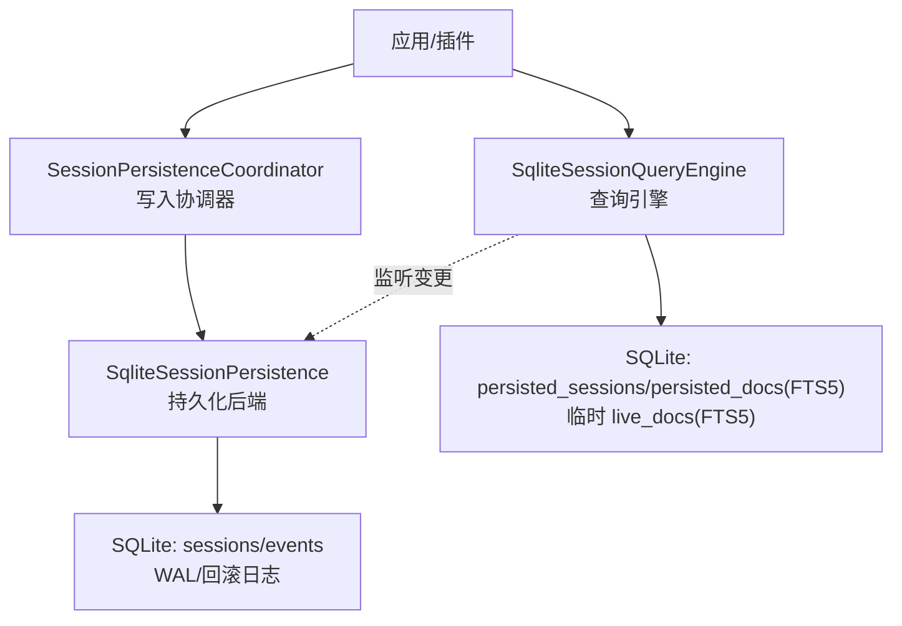
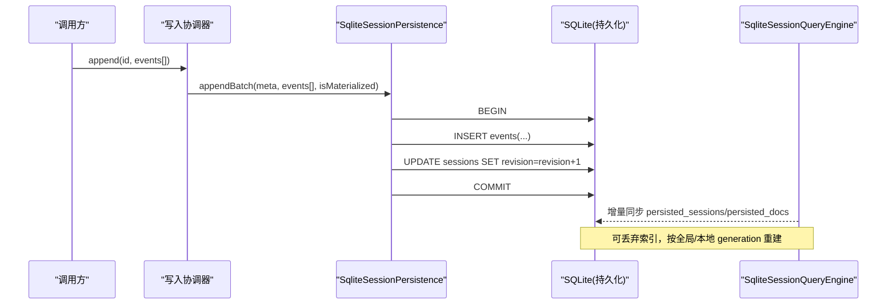
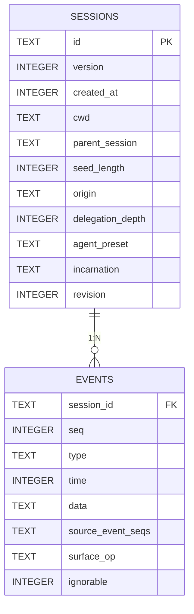
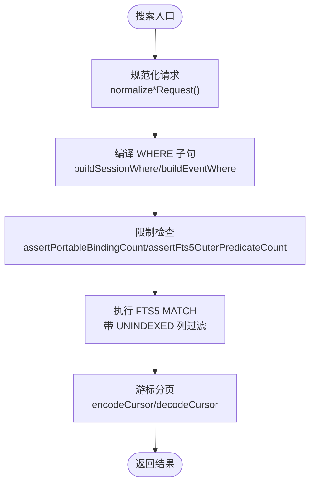
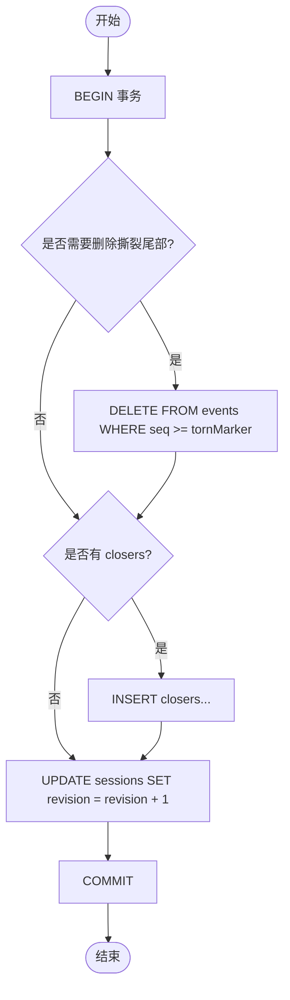
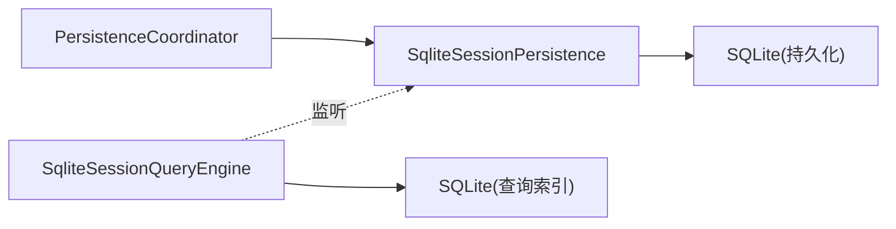

# SQLite 存储后端

<cite>
**本文引用的文件**
- [packages/session/session-persistence-sqlite/src/schema.ts](file://packages/session/session-persistence-sqlite/src/schema.ts)
- [packages/session/session-persistence-sqlite/src/index.ts](file://packages/session/session-persistence-sqlite/src/index.ts)
- [packages/session-query/session-query-sqlite/src/schema.ts](file://packages/session-query/session-query-sqlite/src/schema.ts)
- [packages/session-query/session-query-sqlite/src/query.ts](file://packages/session-query/session-query-sqlite/src/query.ts)
- [packages/session-query/session-query-sqlite/src/index.ts](file://packages/session-query/session-query-sqlite/src/index.ts)
- [packages/session/session-persistence/src/coordinator.ts](file://packages/session/session-persistence/src/coordinator.ts)
- [apps/web/tests/complex-history.perf.ts](file://apps/web/tests/complex-history.perf.ts)
- [BENCHMARK.md](file://BENCHMARK.md)
</cite>

## 目录
1. [简介](#简介)
2. [项目结构](#项目结构)
3. [核心组件](#核心组件)
4. [架构总览](#架构总览)
5. [详细组件分析](#详细组件分析)
6. [依赖关系分析](#依赖关系分析)
7. [性能考量](#性能考量)
8. [故障排查指南](#故障排查指南)
9. [结论](#结论)
10. [附录](#附录)

## 简介
本文件面向 SQLite 存储后端，系统性说明会话数据、事件日志与元数据的表结构设计；索引策略与查询优化；事务与并发控制；连接管理；备份与恢复；迁移与版本升级；以及与 JSONL 存储的性能对比与选型建议。内容基于仓库中 session-persistence-sqlite 与 session-query-sqlite 两个子包的实际实现进行整理。

## 项目结构
SQLite 存储由两部分组成：
- 持久化层（session-persistence-sqlite）：负责会话头与事件的追加、读取、列表、快照等，使用 SQLite 的 sessions 与 events 表，提供 WAL/回滚日志模式配置与崩溃恢复语义。
- 查询层（session-query-sqlite）：在持久化之上构建可丢弃的全量搜索索引（FTS5），提供跨会话与会话内的事件全文检索、分页游标与过滤条件编译。

图表来源
- [packages/session/session-persistence-sqlite/src/index.ts:99-138](file://packages/session/session-persistence-sqlite/src/index.ts#L99-L138)
- [packages/session/session-persistence-sqlite/src/schema.ts:116-172](file://packages/session/session-persistence-sqlite/src/schema.ts#L116-L172)
- [packages/session-query/session-query-sqlite/src/schema.ts:103-139](file://packages/session-query/session-query-sqlite/src/schema.ts#L103-L139)
- [packages/session-query/session-query-sqlite/src/index.ts:214-254](file://packages/session-query/session-query-sqlite/src/index.ts#L214-L254)

章节来源
- [packages/session/session-persistence-sqlite/src/index.ts:99-138](file://packages/session/session-persistence-sqlite/src/index.ts#L99-L138)
- [packages/session/session-persistence-sqlite/src/schema.ts:116-172](file://packages/session/session-persistence-sqlite/src/schema.ts#L116-L172)
- [packages/session-query/session-query-sqlite/src/schema.ts:103-139](file://packages/session-query/session-query-sqlite/src/schema.ts#L103-L139)
- [packages/session-query/session-query-sqlite/src/index.ts:214-254](file://packages/session-query/session-query-sqlite/src/index.ts#L214-L254)

## 核心组件
- SqliteSessionPersistence：会话持久化的 SQLite 实现，负责会话头与事件行的增删改查、事务边界、崩溃修复（删除撕裂尾部并插入关闭事件）。
- PersistenceCoordinator：写入路径协调器，聚合批量写入、冷启动准备缓存、写批延迟合并等。
- SqliteSessionQueryEngine：基于 FTS5 的可丢弃搜索索引，提供会话列表与事件全文检索、游标分页、过滤条件编译与执行。

章节来源
- [packages/session/session-persistence-sqlite/src/index.ts:99-138](file://packages/session/session-persistence-sqlite/src/index.ts#L99-L138)
- [packages/session/session-persistence/src/coordinator.ts:605-627](file://packages/session/session-persistence/src/coordinator.ts#L605-L627)
- [packages/session-query/session-query-sqlite/src/index.ts:214-254](file://packages/session-query/session-query-sqlite/src/index.ts#L214-L254)

## 架构总览
SQLite 后端采用“持久化 + 可丢弃索引”的双层设计：
- 持久化层以 sessions 与 events 两表为核心，通过 PRAGMA application_id 与 user_version 标识数据库归属与 schema 版本，确保只接受受控版本的数据库。
- 查询层维护独立的 derived index 数据库，包含 persisted_sessions、persisted_docs(FTS5) 以及内存中的 live_docs(FTS5)，用于高效全文检索。

图表来源
- [packages/session/session-persistence-sqlite/src/index.ts:284-302](file://packages/session/session-persistence-sqlite/src/index.ts#L284-L302)
- [packages/session-query/session-query-sqlite/src/index.ts:284-319](file://packages/session-query/session-query-sqlite/src/index.ts#L284-L319)

## 详细组件分析

### 表结构与数据模型
- persistence_state：单行记录 store_identity，用于校验数据库所有权。
- sessions：会话元数据（id、version、created_at、cwd、parent_session、seed_length、origin、delegation_depth、agent_preset、incarnation、revision）。
- events：每个 SessionEvent 一行（session_id、seq、type、time、data、source_event_seqs、surface_op、ignorable），主键为 (session_id, seq)。

图表来源
- [packages/session/session-persistence-sqlite/src/schema.ts:116-147](file://packages/session/session-persistence-sqlite/src/schema.ts#L116-L147)

章节来源
- [packages/session/session-persistence-sqlite/src/schema.ts:116-147](file://packages/session/session-persistence-sqlite/src/schema.ts#L116-L147)

### 索引策略与查询优化
- 持久化层：events 表主键 (session_id, seq) 保证顺序追加与唯一性；无额外二级索引，读路径通过 seq 范围扫描或全序读取。
- 查询层：使用 FTS5 虚拟表 persisted_docs 与 temp.live_docs 进行全文检索；会话级过滤通过 persisted_sessions 列匹配；请求参数经 query.ts 编译为安全 SQL 片段，限制绑定变量数量与外层谓词预算，避免 FTS5 规划退化。
- 游标分页：基于 requestFingerprint 生成稳定指纹，结合 offset 编码实现跨进程稳定的分页。

图表来源
- [packages/session-query/session-query-sqlite/src/query.ts:100-138](file://packages/session-query/session-query-sqlite/src/query.ts#L100-L138)
- [packages/session-query/session-query-sqlite/src/query.ts:145-216](file://packages/session-query/session-query-sqlite/src/query.ts#L145-L216)
- [packages/session-query/session-query-sqlite/src/query.ts:240-261](file://packages/session-query/session-query-sqlite/src/query.ts#L240-L261)

章节来源
- [packages/session-query/session-query-sqlite/src/query.ts:100-138](file://packages/session-query/session-query-sqlite/src/query.ts#L100-L138)
- [packages/session-query/session-query-sqlite/src/query.ts:145-216](file://packages/session-query/session-query-sqlite/src/query.ts#L145-L216)
- [packages/session-query/session-query-sqlite/src/query.ts:240-261](file://packages/session-query/session-query-sqlite/src/query.ts#L240-L261)

### 事务处理与崩溃恢复
- 写入原子性：appendBatch 在一个事务内完成会话行写入（若未物化）、事件批量插入与 revision 自增，失败则 ROLLBACK。
- 崩溃恢复：commitRepair 在同一事务中删除撕裂尾部（tornMarker 起）并插入必要的 closers 事件，再更新 revision，确保存储日志与内存一致。
- 加载时断裂尾检测：scanRows 解析事件行，遇到不可解析或 seq 断点时，若位于最后一个 turn/end 之后则视为可容忍的撕裂尾部，否则抛出错误。

图表来源
- [packages/session/session-persistence-sqlite/src/index.ts:309-338](file://packages/session/session-persistence-sqlite/src/index.ts#L309-L338)
- [packages/session/session-persistence-sqlite/src/schema.ts:220-270](file://packages/session/session-persistence-sqlite/src/schema.ts#L220-L270)

章节来源
- [packages/session/session-persistence-sqlite/src/index.ts:284-338](file://packages/session/session-persistence-sqlite/src/index.ts#L284-L338)
- [packages/session/session-persistence-sqlite/src/schema.ts:220-270](file://packages/session/session-persistence-sqlite/src/schema.ts#L220-L270)

### 连接管理与并发访问控制
- 连接模型：使用 DatabaseSync 同步 API，单实例持有单一连接；目录与数据库文件创建时使用 owner-only 权限。
- 并发控制：
  - 写入路径通过协调器串行化，配合 writeBatchMaxDelayMs 合并事件批次。
  - 查询引擎内部使用 _serialized 队列串行化操作，避免并发竞争；支持 AbortSignal 取消。
  - 打开数据库时设置 foreign_keys=ON，并在初始化阶段验证 application_id 与 user_version。

章节来源
- [packages/session/session-persistence-sqlite/src/index.ts:140-168](file://packages/session/session-persistence-sqlite/src/index.ts#L140-L168)
- [packages/session/session-persistence/src/coordinator.ts:605-627](file://packages/session/session-persistence/src/coordinator.ts#L605-L627)
- [packages/session-query/session-query-sqlite/src/index.ts:357-393](file://packages/session-query/session-query-sqlite/src/index.ts#L357-L393)

### 备份与恢复机制
- 完整备份：直接复制 SQLite 数据库文件（含 WAL 侧文件，若启用 WAL）。由于 WAL 共享内存文件可能存在于网络挂载上，需根据部署环境选择 journal_mode。
- 增量备份：利用 revision 与 search_state.global_generation 作为一致性标记；可在业务层基于这些单调令牌触发增量导出（例如导出新增事件或重新构建 FTS5 索引）。
- 恢复：将备份库置于相同路径或由上层服务指定路径打开；schema 版本与应用 ID 校验通过后即可使用。

章节来源
- [packages/session/session-persistence-sqlite/src/schema.ts:100-115](file://packages/session/session-persistence-sqlite/src/schema.ts#L100-L115)
- [packages/session-query/session-query-sqlite/src/schema.ts:55-73](file://packages/session-query/session-query-sqlite/src/schema.ts#L55-L73)

### 迁移脚本与版本升级指南
- 持久化层：SCHEMA_VERSION 仅在破坏性表结构变更时提升；openDatabase 会拒绝非当前版本或非预期 application_id 的数据库，防止误用。
- 查询层：SESSION_QUERY_SQLITE_SCHEMA_VERSION 变化时，会在打开时重置派生索引（DROP 用户表并重建），确保索引与代码一致。
- 升级流程：
  1) 停止写入或进入只读窗口。
  2) 升级二进制后首次打开数据库，自动校验并应用新 schema。
  3) 查询层检测到版本不匹配会自动重建索引。

章节来源
- [packages/session/session-persistence-sqlite/src/schema.ts:100-115](file://packages/session/session-persistence-sqlite/src/schema.ts#L100-L115)
- [packages/session-query/session-query-sqlite/src/schema.ts:55-73](file://packages/session-query/session-query-sqlite/src/schema.ts#L55-L73)

### 性能基准测试与最佳实践
- 基准运行：遵循仓库根文档指引，使用独立工作区与会话 ID 运行最小化变体进行基准测试。
- 前端性能用例：复杂历史场景测试覆盖长会话加载、流式渲染与压力测试，可作为端到端性能参考。
- 最佳实践：
  - 写入：合理设置 writeBatchMaxDelayMs，减少频繁小批提交；优先使用 appendBatch 批量写入。
  - 读取：使用 loadStoredFrom 从 fromSeq 开始的后缀读取，避免全量加载；列表与快照仅读取 sessions 表。
  - 查询：控制 limit 与过滤器数量，避免超出 FTS5 外层谓词预算；使用游标分页。
  - 日志模式：默认 WAL；在网络挂载或共享内存受限环境切换为 delete/truncate/persist。

章节来源
- [BENCHMARK.md:1-4](file://BENCHMARK.md#L1-L4)
- [apps/web/tests/complex-history.perf.ts:37-66](file://apps/web/tests/complex-history.perf.ts#L37-L66)
- [packages/session/session-persistence-sqlite/src/index.ts:80-92](file://packages/session/session-persistence-sqlite/src/index.ts#L80-L92)
- [packages/session-query/session-query-sqlite/src/query.ts:23-31](file://packages/session-query/session-query-sqlite/src/query.ts#L23-L31)

### 与 JSONL 存储的性能对比与选择建议
- 一致性语义：SQLite 与 JSONL 在后端均提供一致的“崩溃尾部保留到上一个 turn/end”的恢复语义，便于替换。
- 写入吞吐：SQLite 通过事务与 WAL 获得更好的并发与持久化性能；JSONL 适合简单场景但大并发下锁竞争明显。
- 查询能力：SQLite 查询层提供 FTS5 全文检索与结构化过滤；JSONL 需要外部工具或自定义索引。
- 选择建议：
  - 高并发、强一致、需要全文检索：优先 SQLite。
  - 单机、低并发、极简部署：JSONL 更易运维。
  - 网络文件系统：考虑使用回滚日志模式而非 WAL。

章节来源
- [packages/session/session-persistence-sqlite/src/schema.ts:62-70](file://packages/session/session-persistence-sqlite/src/schema.ts#L62-L70)
- [packages/session/session-persistence-sqlite/src/schema.ts:220-270](file://packages/session/session-persistence-sqlite/src/schema.ts#L220-L270)

## 依赖关系分析
- 持久化层依赖 node:sqlite 的 DatabaseSync，并通过 coordinator 统一写入路径。
- 查询层依赖持久化层的变更信号（通过上下文注入），在自身数据库内维护派生索引。
- 两者通过 application_id 与 schema version 隔离不同用途的数据库文件，避免互相污染。

图表来源
- [packages/session/session-persistence/src/coordinator.ts:605-627](file://packages/session/session-persistence/src/coordinator.ts#L605-L627)
- [packages/session/session-persistence-sqlite/src/index.ts:99-138](file://packages/session/session-persistence-sqlite/src/index.ts#L99-L138)
- [packages/session-query/session-query-sqlite/src/index.ts:214-254](file://packages/session-query/session-query-sqlite/src/index.ts#L214-L254)

章节来源
- [packages/session/session-persistence/src/coordinator.ts:605-627](file://packages/session/session-persistence/src/coordinator.ts#L605-L627)
- [packages/session/session-persistence-sqlite/src/index.ts:99-138](file://packages/session/session-persistence-sqlite/src/index.ts#L99-L138)
- [packages/session-query/session-query-sqlite/src/index.ts:214-254](file://packages/session-query/session-query-sqlite/src/index.ts#L214-L254)

## 性能考量
- 事务粒度：尽量批量写入以减少事务开销；避免在热路径中进行大量单条插入。
- 日志模式：生产默认 WAL；在 NFS/网络盘上切换为 delete/truncate/persist 以避免共享内存问题。
- 查询预算：严格控制过滤器数量与绑定变量规模，避免 FTS5 规划退化。
- 缓存：preparedSessionCacheSize 控制冷启动准备缓存大小，提高历史复用效率。
- 并发：查询引擎串行化操作，避免并发竞争；必要时拆分多实例。

章节来源
- [packages/session/session-persistence-sqlite/src/index.ts:80-92](file://packages/session/session-persistence-sqlite/src/index.ts#L80-L92)
- [packages/session-query/session-query-sqlite/src/query.ts:23-31](file://packages/session-query/session-query-sqlite/src/query.ts#L23-L31)
- [packages/session-query/session-query-sqlite/src/index.ts:357-393](file://packages/session-query/session-query-sqlite/src/index.ts#L357-L393)

## 故障排查指南
- 无法打开数据库：检查 application_id 与 user_version 是否匹配；确认目录权限与 WAL 侧文件可用性。
- 写入失败：查看事务是否被回滚；检查唯一约束冲突（重复 seq）或磁盘空间不足。
- 查询失败：确认 FTS5 索引已重建；检查过滤器是否超出预算；关注 SESSION_QUERY_INDEX_FAILED 错误码。
- 崩溃恢复：确认 scanRows 能正确识别撕裂尾部；必要时手动执行 commitRepair 清理。

章节来源
- [packages/session/session-persistence-sqlite/src/schema.ts:100-115](file://packages/session/session-persistence-sqlite/src/schema.ts#L100-L115)
- [packages/session/session-persistence-sqlite/src/index.ts:284-338](file://packages/session/session-persistence-sqlite/src/index.ts#L284-L338)
- [packages/session-query/session-query-sqlite/src/index.ts:357-393](file://packages/session-query/session-query-sqlite/src/index.ts#L357-L393)

## 结论
SQLite 存储后端通过严谨的 schema 版本控制、事务原子性与崩溃恢复机制，提供了高可靠、高性能的会话持久化能力；配合 FTS5 查询层，实现了高效的全文检索与结构化过滤。在生产环境中，建议优先选用 SQLite 作为默认后端，并根据部署环境选择合适的日志模式与查询预算。对于极低并发与极简部署场景，可考虑 JSONL 替代方案。

## 附录
- 配置项速览（持久化后端）：
  - path：数据库文件路径，支持 :memory:
  - journalMode：wal（默认）或 delete/truncate/persist
  - preparedSessionCacheSize：冷启动准备缓存大小
  - writeBatchMaxDelayMs：写批合并窗口
- 配置项速览（查询后端）：
  - openAt：startup 或按需打开
  - 其他查询限制由 query.ts 内置常量约束

章节来源
- [packages/session/session-persistence-sqlite/src/index.ts:69-92](file://packages/session/session-persistence-sqlite/src/index.ts#L69-L92)
- [packages/session-query/session-query-sqlite/src/index.ts:214-254](file://packages/session-query/session-query-sqlite/src/index.ts#L214-L254)
- [packages/session-query/session-query-sqlite/src/query.ts:23-31](file://packages/session-query/session-query-sqlite/src/query.ts#L23-L31)