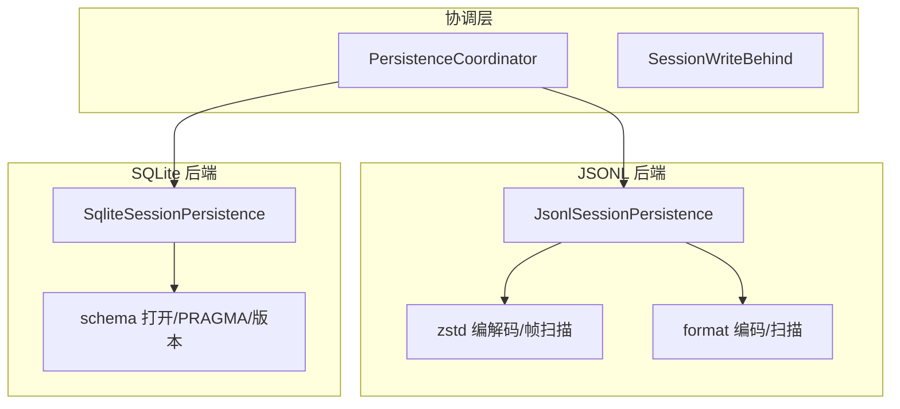
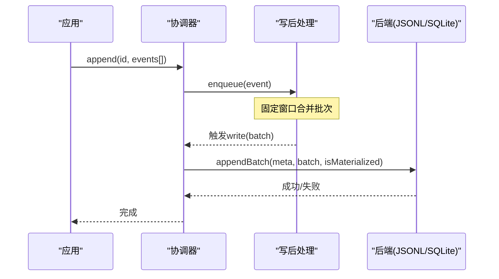
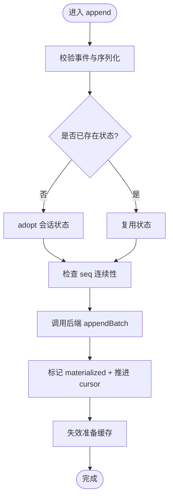
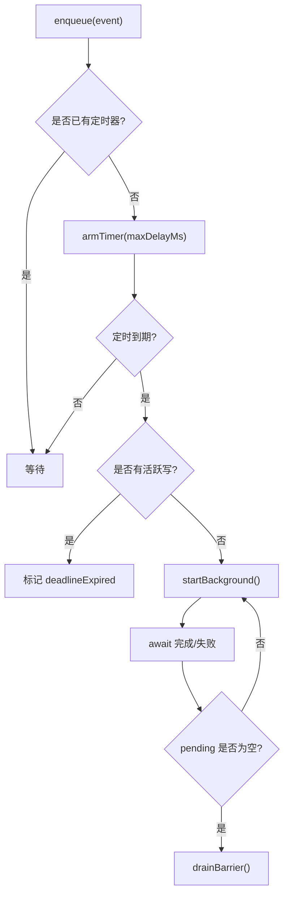
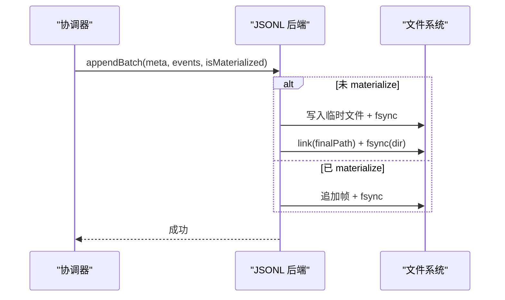
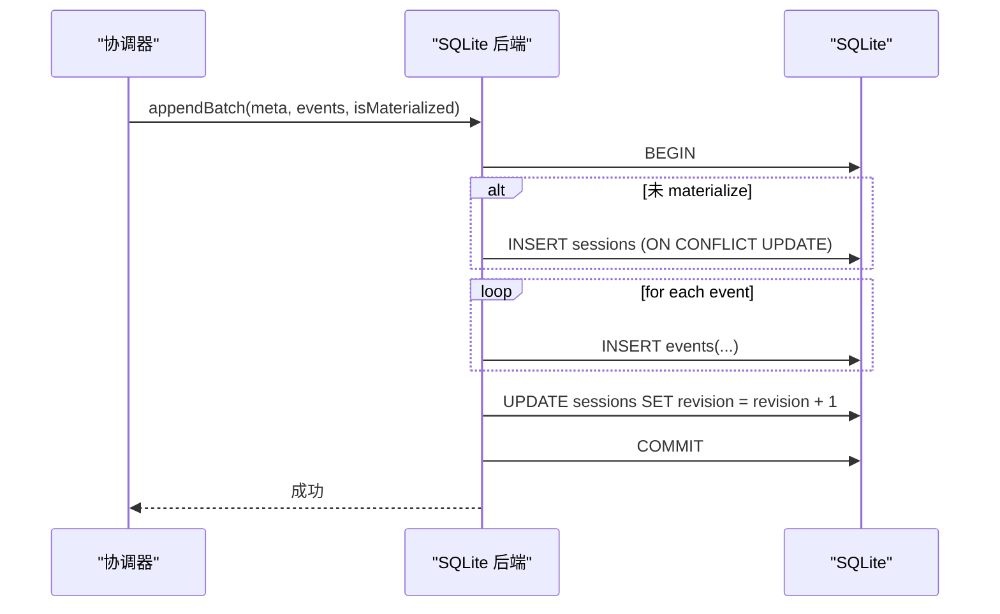
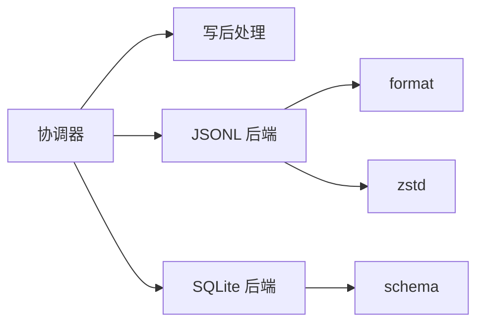

# 会话持久化

<cite>
**本文引用的文件**
- [packages/session/session-persistence/src/coordinator.ts](file://packages/session/session-persistence/src/coordinator.ts)
- [packages/session/session-persistence/src/write-behind.ts](file://packages/session/session-persistence/src/write-behind.ts)
- [packages/session/session-persistence-jsonl/src/index.ts](file://packages/session/session-persistence-jsonl/src/index.ts)
- [packages/session/session-persistence-jsonl/src/format.ts](file://packages/session/session-persistence-jsonl/src/format.ts)
- [packages/session/session-persistence-jsonl/src/zstd.ts](file://packages/session/session-persistence-jsonl/src/zstd.ts)
- [packages/session/session-persistence-jsonl/src/zstd-public-decoder.ts](file://packages/session/session-persistence-jsonl/src/zstd-public-decoder.ts)
- [packages/session/session-persistence-jsonl/src/zstd-private-decoder.ts](file://packages/session/session-persistence-jsonl/src/zstd-private-decoder.ts)
- [packages/session/session-persistence-sqlite/src/index.ts](file://packages/session/session-persistence-sqlite/src/index.ts)
- [packages/session/session-persistence-sqlite/src/schema.ts](file://packages/session/session-persistence-sqlite/src/schema.ts)
- [packages/session/session-projection/tests/registry.spec.ts](file://packages/session/session-projection/tests/registry.spec.ts)
</cite>

## 目录
1. [简介](#简介)
2. [项目结构](#项目结构)
3. [核心组件](#核心组件)
4. [架构总览](#架构总览)
5. [详细组件分析](#详细组件分析)
6. [依赖关系分析](#依赖关系分析)
7. [性能考量](#性能考量)
8. [故障排查指南](#故障排查指南)
9. [结论](#结论)
10. [附录](#附录)

## 简介
本文件系统性说明会话持久化的设计与实现，覆盖两种后端：JSONL（文本日志）与 SQLite（关系型数据库）。重点阐述数据写入策略（写后处理 write-behind、协调器模式）、数据压缩（zstd）、版本控制与迁移、配置选项与性能对比、备份恢复与一致性保证，并给出实际存储示例与查询方法。

## 项目结构
会话持久化由“协调器 + 具体后端”构成：
- 协调器（coordinator）：提供跨后端的统一写入路径编排、缓冲、序列化、恢复、生命周期管理。
- JSONL 后端：以每会话一个追加式文件存储，支持 zstd 压缩与打包行优化。
- SQLite 后端：将会话元数据与事件映射为表行，利用事务与 WAL 提供强一致性与并发安全。

图表来源
- [packages/session/session-persistence/src/coordinator.ts:588-625](file://packages/session/session-persistence/src/coordinator.ts#L588-L625)
- [packages/session/session-persistence-jsonl/src/index.ts:121-164](file://packages/session/session-persistence-jsonl/src/index.ts#L121-L164)
- [packages/session/session-persistence-sqlite/src/index.ts:99-138](file://packages/session/session-persistence-sqlite/src/index.ts#L99-L138)
- [packages/session/session-persistence-sqlite/src/schema.ts:62-90](file://packages/session/session-persistence-sqlite/src/schema.ts#L62-L90)

章节来源
- [packages/session/session-persistence/src/coordinator.ts:588-625](file://packages/session/session-persistence/src/coordinator.ts#L588-L625)
- [packages/session/session-persistence-jsonl/src/index.ts:121-164](file://packages/session/session-persistence-jsonl/src/index.ts#L121-L164)
- [packages/session/session-persistence-sqlite/src/index.ts:99-138](file://packages/session/session-persistence-sqlite/src/index.ts#L99-L138)
- [packages/session/session-persistence-sqlite/src/schema.ts:62-90](file://packages/session/session-persistence-sqlite/src/schema.ts#L62-L90)

## 核心组件
- 协调器（PersistenceCoordinator）
  - 负责 per-id 串行化、冷读准备缓存、写批窗口、崩溃修复序列、发布与回收。
  - 暴露 create/append/load/inspect/readFrom/list 等统一接口，委托给具体后端。
- 写后处理（SessionWriteBehind）
  - 固定时延的批量合并，后台异步落盘；失败重试与屏障同步点。
- JSONL 后端
  - 每会话追加式文件；支持 zstd 压缩、packed chunks；原子发布（link+fsync）；断尾修复。
- SQLite 后端
  - 单库多会话；WAL 默认；事务内 appendBatch/commitRepair；seek-capable 后缀读取。

章节来源
- [packages/session/session-persistence/src/coordinator.ts:588-800](file://packages/session/session-persistence/src/coordinator.ts#L588-L800)
- [packages/session/session-persistence/src/write-behind.ts:1-160](file://packages/session/session-persistence/src/write-behind.ts#L1-L160)
- [packages/session/session-persistence-jsonl/src/index.ts:121-200](file://packages/session/session-persistence-jsonl/src/index.ts#L121-L200)
- [packages/session/session-persistence-sqlite/src/index.ts:99-200](file://packages/session/session-persistence-sqlite/src/index.ts#L99-L200)

## 架构总览
协调器作为“控制面”，后端作为“数据面”。所有写路径经协调器进行批量化与顺序化，再调用后端持久化；读路径可走冷读准备缓存或 live 快照。

图表来源
- [packages/session/session-persistence/src/coordinator.ts:669-710](file://packages/session/session-persistence/src/coordinator.ts#L669-L710)
- [packages/session/session-persistence/src/write-behind.ts:45-100](file://packages/session/session-persistence/src/write-behind.ts#L45-L100)
- [packages/session/session-persistence-jsonl/src/index.ts:421-429](file://packages/session/session-persistence-jsonl/src/index.ts#L421-L429)
- [packages/session/session-persistence-sqlite/src/index.ts:284-302](file://packages/session/session-persistence-sqlite/src/index.ts#L284-L302)

## 详细组件分析

### 协调器（PersistenceCoordinator）
- 职责
  - 维护 per-id 状态（cursor、materialized）、per-session 写控制器、冷读准备缓存。
  - 确保 append 的 seq 连续性、首次 materialize 的原子性、崩溃后的截断与补全。
  - 提供 load/inspect/readFrom 的统一语义，兼容 seek-capable 后端。
- 关键流程
  - create：防止重复 id 与已存在持久化冲突。
  - append：校验、序列化、顺序写入、更新 cursor、失效准备缓存。
  - prepare/load：基于准备缓存与 revision 重试，收敛外部写入。
  - readFrom：优先使用后端 loadStoredFrom（SQLite），否则回退到完整前缀扫描。

图表来源
- [packages/session/session-persistence/src/coordinator.ts:669-710](file://packages/session/session-persistence/src/coordinator.ts#L669-L710)

章节来源
- [packages/session/session-persistence/src/coordinator.ts:629-800](file://packages/session/session-persistence/src/coordinator.ts#L629-L800)

### 写后处理（SessionWriteBehind）
- 设计要点
  - 固定最大延迟窗口合并事件，避免频繁 I/O。
  - 后台任务失败不阻塞生产者，但会保留待写队列并在屏障中重试。
  - flush() 提供确定性同步点，等待所有持久化完成。
- 行为
  - enqueue：入队并启动定时器（若自动路径空闲）。
  - onDeadline/startBackground：触发一次后台写；若已有活跃写则标记 deadlineExpired，完成后继续。
  - drainBarrier：汇聚重叠工作，清空队列并解决屏障。

图表来源
- [packages/session/session-persistence/src/write-behind.ts:45-160](file://packages/session/session-persistence/src/write-behind.ts#L45-L160)

章节来源
- [packages/session/session-persistence/src/write-behind.ts:1-160](file://packages/session/session-persistence/src/write-behind.ts#L1-L160)

### JSONL 后端
- 存储模型
  - 每个会话一个追加式文件；首行 header，后续事件行；可选 packed chunks 压缩连续 chunk 事件。
  - 物理编码：zstd 帧拼接或明文；列表与读取仅解析必要部分。
- 写入策略
  - 首次 materialize：临时文件写入 + fsync + link 原子发布 + 目录 fsync。
  - 追加：按配置编码（zstd 帧或明文）并追加、fsync；失败时回滚至先前大小。
- 压缩与解码
  - zstd 帧扫描、头帧独立验证、长流解码分片 yield 避免阻塞事件循环。
  - 支持公共 API 与私有优化解码器回退。
- 崩溃恢复
  - 断尾检测：不完整帧位置 tornStart；恢复出完整记录，返回 tornMarker。
  - commitRepair：截断到 offset，重放恢复的事件片段，必要时追加合成关闭事件。

图表来源
- [packages/session/session-persistence-jsonl/src/index.ts:513-592](file://packages/session/session-persistence-jsonl/src/index.ts#L513-L592)
- [packages/session/session-persistence-jsonl/src/index.ts:618-689](file://packages/session/session-persistence-jsonl/src/index.ts#L618-L689)
- [packages/session/session-persistence-jsonl/src/index.ts:421-444](file://packages/session/session-persistence-jsonl/src/index.ts#L421-L444)

章节来源
- [packages/session/session-persistence-jsonl/src/index.ts:121-200](file://packages/session/session-persistence-jsonl/src/index.ts#L121-L200)
- [packages/session/session-persistence-jsonl/src/index.ts:208-345](file://packages/session/session-persistence-jsonl/src/index.ts#L208-L345)
- [packages/session/session-persistence-jsonl/src/index.ts:421-701](file://packages/session/session-persistence-jsonl/src/index.ts#L421-L701)
- [packages/session/session-persistence-jsonl/src/zstd.ts:1-39](file://packages/session/session-persistence-jsonl/src/zstd.ts#L1-L39)
- [packages/session/session-persistence-jsonl/src/zstd-public-decoder.ts:1-40](file://packages/session/session-persistence-jsonl/src/zstd-public-decoder.ts#L1-L40)
- [packages/session/session-persistence-jsonl/src/zstd-private-decoder.ts:1-55](file://packages/session/session-persistence-jsonl/src/zstd-private-decoder.ts#L1-L55)

### SQLite 后端
- 存储模型
  - sessions 表保存会话元数据；events 表保存有序事件；revision/incarnation 用于标识变更。
  - journal_mode 默认 wal；在特定文件系统可用 delete/truncate/persist。
- 写入策略
  - appendBatch：BEGIN → 插入事件 → 更新 revision → COMMIT；任何失败 ROLLBACK。
  - commitRepair：DELETE 断尾 + INSERT 合成事件 → UPDATE revision → COMMIT。
- 读取优化
  - loadStoredFrom：按 fromSeq 直接 SELECT，只加载后缀，提升大日志读取效率。
- 版本与迁移
  - openDatabase：创建/打开 DB，设置 PRAGMA，校验 application_id/user_version；非当前版本拒绝而非就地迁移。

图表来源
- [packages/session/session-persistence-sqlite/src/index.ts:284-302](file://packages/session/session-persistence-sqlite/src/index.ts#L284-L302)
- [packages/session/session-persistence-sqlite/src/index.ts:309-338](file://packages/session/session-persistence-sqlite/src/index.ts#L309-L338)
- [packages/session/session-persistence-sqlite/src/schema.ts:62-90](file://packages/session/session-persistence-sqlite/src/schema.ts#L62-L90)

章节来源
- [packages/session/session-persistence-sqlite/src/index.ts:99-200](file://packages/session/session-persistence-sqlite/src/index.ts#L99-L200)
- [packages/session/session-persistence-sqlite/src/index.ts:206-365](file://packages/session/session-persistence-sqlite/src/index.ts#L206-L365)
- [packages/session/session-persistence-sqlite/src/schema.ts:62-90](file://packages/session/session-persistence-sqlite/src/schema.ts#L62-L90)

### 数据压缩技术（zstd）
- 帧结构与扫描
  - 文件由多个 zstd 帧拼接；首帧必须仅包含 header 行；扫描器返回完整帧范围与可能的不完整尾部起始位置。
- 解码策略
  - 公共解码器：基于 Node 的一体化 API，适合通用场景。
  - 私有优化解码器：尝试访问内部句柄以提升吞吐；不可用时回退到公共解码器。
- 安全性
  - 每帧带校验位；解码失败抛出明确错误，便于定位损坏帧。

章节来源
- [packages/session/session-persistence-jsonl/src/zstd.ts:1-39](file://packages/session/session-persistence-jsonl/src/zstd.ts#L1-L39)
- [packages/session/session-persistence-jsonl/src/zstd-public-decoder.ts:1-40](file://packages/session/session-persistence-jsonl/src/zstd-public-decoder.ts#L1-L40)
- [packages/session/session-persistence-jsonl/src/zstd-private-decoder.ts:1-55](file://packages/session/session-persistence-jsonl/src/zstd-private-decoder.ts#L1-L55)
- [packages/session/session-persistence-jsonl/src/index.ts:347-419](file://packages/session/session-persistence-jsonl/src/index.ts#L347-L419)

### 版本控制与数据迁移
- JSONL
  - 通过 SessionHeader.version 与构建期 SESSION_FORMAT_VERSION 比较；不支持的版本拒绝并提示升级或降级。
  - 旧格式事件在加载时进行迁移转换（如 steering/message、turn/start/end、message 包装等）。
- SQLite
  - 使用 user_version 与 application_id 标识数据库版本与应用身份；非当前版本拒绝打开，避免就地迁移风险。
  - 测试覆盖新旧版本拒绝、未版本化数据库拒绝、外置 identity 拒绝等边界情况。

章节来源
- [packages/session/session-persistence/src/coordinator.ts:47-81](file://packages/session/session-persistence/src/coordinator.ts#L47-L81)
- [packages/session/session-persistence/src/coordinator.ts:273-573](file://packages/session/session-persistence/src/coordinator.ts#L273-L573)
- [packages/session/session-persistence-sqlite/src/schema.ts:62-90](file://packages/session/session-persistence-sqlite/src/schema.ts#L62-L90)
- [packages/session/session-persistence-sqlite/tests/sqlite.spec.ts:352-456](file://packages/session/session-persistence-sqlite/tests/sqlite.spec.ts#L352-L456)

### 配置选项与性能对比
- JSONL 后端配置
  - root：根目录（必需）
  - packChunks：是否打包连续 chunk 事件（默认开启，显著减小体积）
  - compression：'zstd' | 'none'（默认 zstd）
  - preparedSessionCacheSize：冷读准备缓存大小
  - writeBatchMaxDelayMs：写批最大延迟
- SQLite 后端配置
  - path：数据库路径（支持 :memory:）
  - journalMode：'wal' | 'delete' | 'truncate' | 'persist'（默认 wal）
  - preparedSessionCacheSize / writeBatchMaxDelayMs：同上
- 性能对比
  - JSONL：追加式文件 + zstd 压缩，适合高吞吐追加与离线分析；列表/读取可仅解析头部。
  - SQLite：事务与索引友好，适合随机查询与复杂检索；WAL 提升并发读性能。

章节来源
- [packages/session/session-persistence-jsonl/src/index.ts:59-83](file://packages/session/session-persistence-jsonl/src/index.ts#L59-L83)
- [packages/session/session-persistence-sqlite/src/index.ts:69-92](file://packages/session/session-persistence-sqlite/src/index.ts#L69-L92)

### 备份、恢复与一致性
- 一致性保证
  - JSONL：原子发布（link+fsync）、追加失败回滚、断尾检测与修复。
  - SQLite：事务包裹 appendBatch/commitRepair，WAL 提供持久化语义。
- 备份建议
  - JSONL：复制 session.jsonl(.zstd) 文件；注意同一进程内避免混合不同压缩格式。
  - SQLite：使用 sqlite3 工具或在线备份 API；保持 journal_mode 一致。
- 恢复策略
  - JSONL：从备份恢复文件；若存在断尾，协调器会在下次 load 时自动截断并重放恢复事件。
  - SQLite：恢复数据库文件；openDatabase 会校验版本与 identity，不匹配则拒绝。

章节来源
- [packages/session/session-persistence-jsonl/src/index.ts:513-592](file://packages/session/session-persistence-jsonl/src/index.ts#L513-L592)
- [packages/session/session-persistence-jsonl/src/index.ts:646-701](file://packages/session/session-persistence-jsonl/src/index.ts#L646-L701)
- [packages/session/session-persistence-sqlite/src/index.ts:284-338](file://packages/session/session-persistence-sqlite/src/index.ts#L284-L338)
- [packages/session/session-persistence-sqlite/src/schema.ts:62-90](file://packages/session/session-persistence-sqlite/src/schema.ts#L62-L90)

### 实际数据存储示例与查询方法
- JSONL
  - 存储位置：root/<project>/<session>/session.jsonl(.zstd)
  - 读取方式：readRaw 获取原始内容；list/listSnapshots 获取元数据与修订。
  - 示例路径参考：[packages/session/session-persistence-jsonl/src/index.ts:171-174](file://packages/session/session-persistence-jsonl/src/index.ts#L171-L174)
- SQLite
  - 存储位置：path（文件或 :memory:）
  - 查询方式：loadStoredFrom(id, fromSeq) 获取后缀事件；list 获取会话元数据。
  - 示例路径参考：[packages/session/session-persistence-sqlite/src/index.ts:220-238](file://packages/session/session-persistence-sqlite/src/index.ts#L220-L238)

章节来源
- [packages/session/session-persistence-jsonl/src/index.ts:171-174](file://packages/session/session-persistence-jsonl/src/index.ts#L171-L174)
- [packages/session/session-persistence-jsonl/src/index.ts:239-282](file://packages/session/session-persistence-jsonl/src/index.ts#L239-L282)
- [packages/session/session-persistence-sqlite/src/index.ts:220-238](file://packages/session/session-persistence-sqlite/src/index.ts#L220-L238)
- [packages/session/session-persistence-sqlite/src/index.ts:340-365](file://packages/session/session-persistence-sqlite/src/index.ts#L340-L365)

## 依赖关系分析
- 协调器依赖
  - 写后处理：SessionWriteBehind
  - 会话领域：SessionEvent/SessionHeader/SessionId 等
  - 后端抽象：PersistenceBackend<TornMarker>
- JSONL 后端依赖
  - format：事件行编码/扫描、路径生成
  - zstd：帧扫描、压缩/解压、解码器
- SQLite 后端依赖
  - schema：数据库打开、PRAGMA、版本校验、行映射

图表来源
- [packages/session/session-persistence/src/coordinator.ts:588-625](file://packages/session/session-persistence/src/coordinator.ts#L588-L625)
- [packages/session/session-persistence-jsonl/src/index.ts:121-164](file://packages/session/session-persistence-jsonl/src/index.ts#L121-L164)
- [packages/session/session-persistence-sqlite/src/index.ts:99-138](file://packages/session/session-persistence-sqlite/src/index.ts#L99-L138)

章节来源
- [packages/session/session-persistence/src/coordinator.ts:588-625](file://packages/session/session-persistence/src/coordinator.ts#L588-L625)
- [packages/session/session-persistence-jsonl/src/index.ts:121-164](file://packages/session/session-persistence-jsonl/src/index.ts#L121-L164)
- [packages/session/session-persistence-sqlite/src/index.ts:99-138](file://packages/session/session-persistence-sqlite/src/index.ts#L99-L138)

## 性能考量
- 写路径
  - 使用 SessionWriteBehind 固定窗口合并事件，降低 I/O 次数。
  - JSONL 的 packed chunks 可显著减少日志体积与 I/O。
  - SQLite 使用 WAL 提高并发读性能；批量 INSERT 在事务内执行。
- 读路径
  - JSONL 列表/读取仅解析头部或首个帧，避免全量解码。
  - SQLite 的 loadStoredFrom 支持按 seq 后缀读取，线性扩展。
- 压缩
  - zstd 压缩带来 CPU 开销，但通常换取更小的磁盘占用与网络传输成本。

[本节为通用指导，无需引用具体文件]

## 故障排查指南
- 常见错误
  - 版本不兼容：JSONL 的会话格式版本高于/低于当前构建；SQLite 的 user_version/application_id 不匹配。
  - 数据损坏：zstd 帧校验失败、JSONL 记录撕裂、SQLite UNIQUE 冲突。
- 诊断步骤
  - JSONL：使用 readRaw 获取原始内容；检查首帧是否仅为 header；查看 tornStart 指示的不完整帧位置。
  - SQLite：检查 journal_mode；确认事务是否提交；查看 revision 递增。
- 恢复手段
  - JSONL：协调器自动截断断尾并重放恢复事件；必要时手动删除损坏文件后重新 append。
  - SQLite：回滚事务；从备份恢复数据库；确保 journal_mode 与预期一致。

章节来源
- [packages/session/session-persistence/src/coordinator.ts:35-81](file://packages/session/session-persistence/src/coordinator.ts#L35-L81)
- [packages/session/session-persistence-jsonl/src/index.ts:347-419](file://packages/session/session-persistence-jsonl/src/index.ts#L347-L419)
- [packages/session/session-persistence-sqlite/src/index.ts:284-338](file://packages/session/session-persistence-sqlite/src/index.ts#L284-L338)
- [packages/session/session-projection/tests/registry.spec.ts:327-349](file://packages/session/session-projection/tests/registry.spec.ts#L327-L349)

## 结论
该持久化子系统通过协调器统一了 JSONL 与 SQLite 两种后端的写入与读取语义，结合写后处理、压缩、版本控制与崩溃恢复机制，提供了高性能、强一致且可运维的会话存储方案。根据负载特征选择合适后端：高吞吐追加与离线分析倾向 JSONL；复杂查询与并发读倾向 SQLite。

[本节为总结性内容，无需引用具体文件]

## 附录
- 术语
  - 写后处理（write-behind）：将事件暂存于内存并按固定窗口批量落盘。
  - 协调器模式：将跨后端的通用逻辑集中在协调器，后端专注介质操作。
  - 断尾（torn tail）：因异常导致的不完整尾部，需截断并恢复。
- 最佳实践
  - 合理设置 writeBatchMaxDelayMs 与 preparedSessionCacheSize。
  - 生产环境启用 zstd 压缩与 WAL；定期备份与校验。
  - 监控版本兼容性，避免混用不同构建产物。

[本节为补充信息，无需引用具体文件]