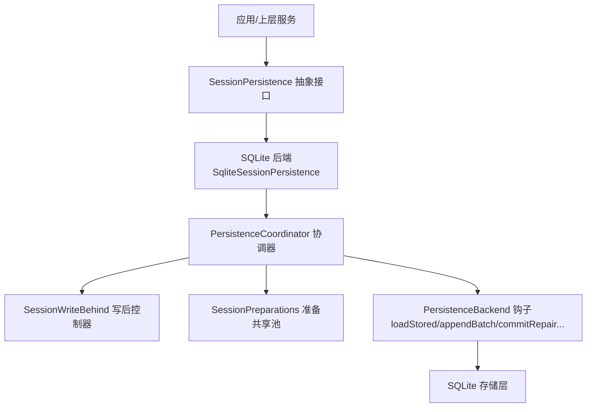
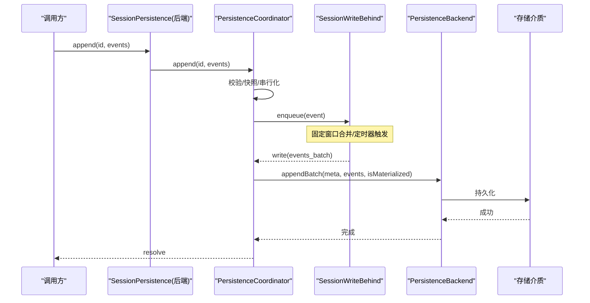
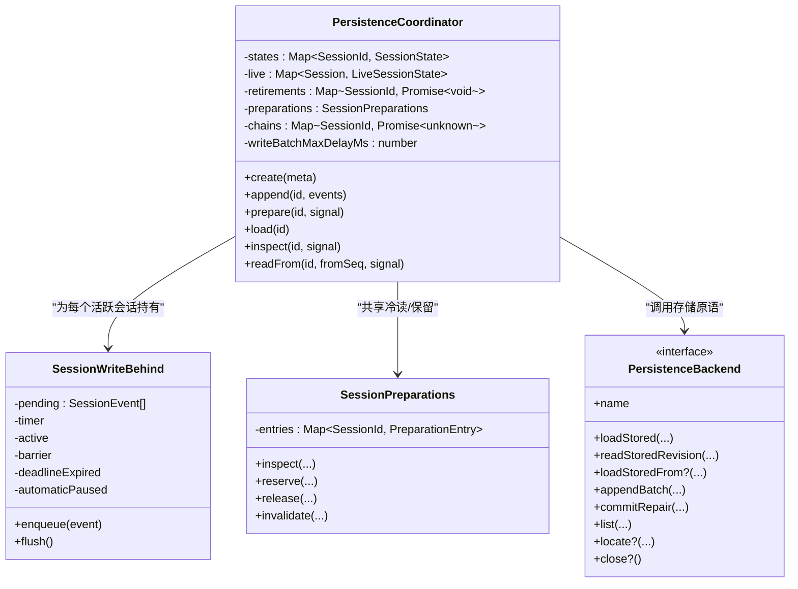
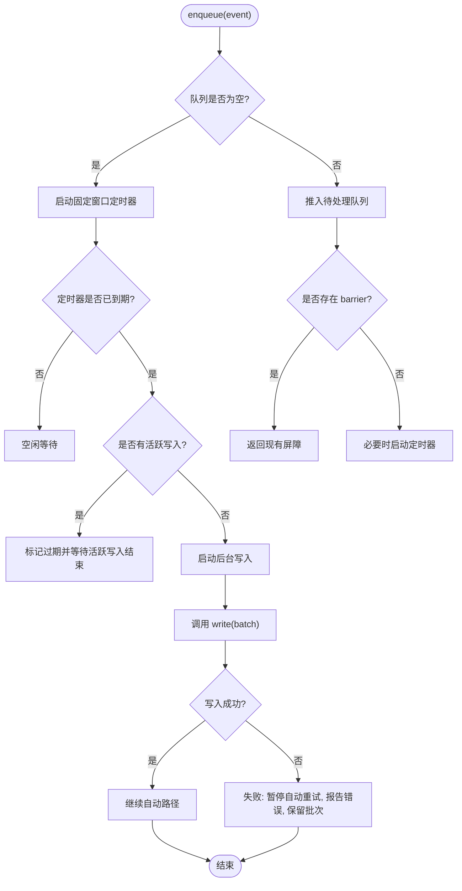
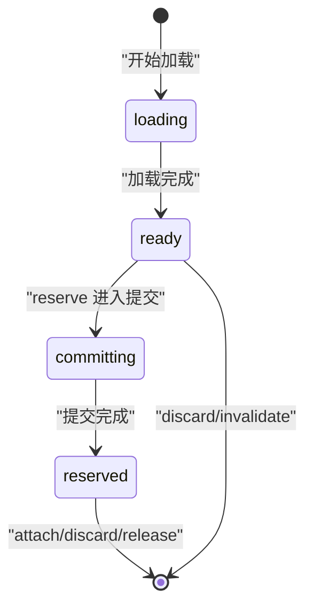
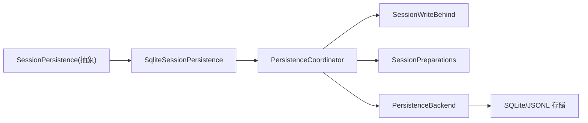
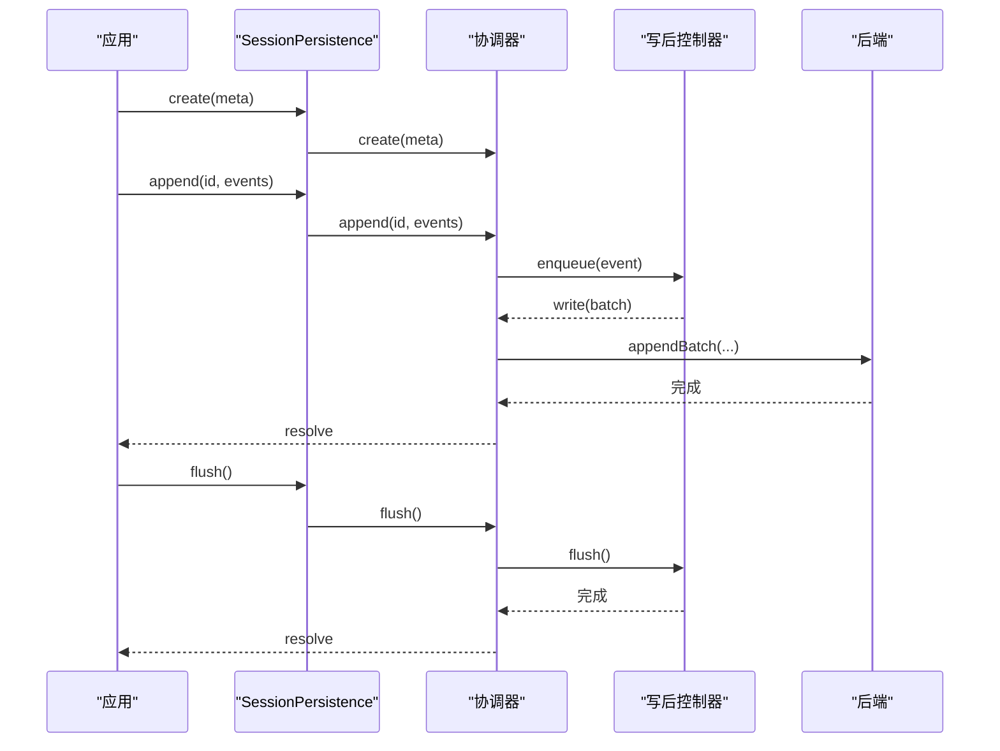

# 持久化协调器

<cite>
**本文引用的文件**
- [coordinator.ts](file://packages/session/session-persistence/src/coordinator.ts)
- [write-behind.ts](file://packages/session/session-persistence/src/write-behind.ts)
- [preparations.ts](file://packages/session/session-persistence/src/preparations.ts)
- [index.ts（session-persistence）](file://packages/session/session-persistence/src/index.ts)
- [index.ts（sqlite 后端）](file://packages/session/session-persistence-sqlite/src/index.ts)
- [write-behind.spec.ts](file://packages/session/session-persistence/tests/write-behind.spec.ts)
</cite>

## 目录
1. [简介](#简介)
2. [项目结构](#项目结构)
3. [核心组件](#核心组件)
4. [架构总览](#架构总览)
5. [详细组件分析](#详细组件分析)
6. [依赖关系分析](#依赖关系分析)
7. [性能考量](#性能考量)
8. [故障排查指南](#故障排查指南)
9. [结论](#结论)
10. [附录：配置选项与集成示例](#附录：配置选项与集成示例)

## 简介
本文件系统化说明“持久化协调器”在会话持久化中的作用，重点包括：
- 协调器模式如何统一编排多个存储后端的写入路径，屏蔽后端差异。
- 写后处理（write-behind）机制的实现原理：固定窗口合并、异步写入、错误重试与一致性保证。
- 协调器的配置项：批量大小、超时/延迟上限、冷读缓存等。
- 与其他组件的集成方式：并发写入、数据同步、恢复与准备流程。
- 性能优化建议与常见问题解决方案。

## 项目结构
持久化子系统由“服务定义 + 协调器 + 写后控制器 + 准备共享池 + 具体后端”组成：
- 服务定义：抽象 SessionPersistence 接口，暴露 create/append/load/inspect/readFrom/list 等能力。
- 协调器：后端无关的写入路径编排，负责序列化、批处理、恢复、准备与生命周期管理。
- 写后控制器：每个活跃会话一个 SessionWriteBehind，实现有界合并与屏障式 flush。
- 准备共享池：SessionPreparations 提供冷读共享、独占保留、LRU 复用。
- 后端实现：如 SQLite 后端通过实现 PersistenceBackend 钩子接入协调器。

图表来源
- [index.ts（session-persistence）:84-241](file://packages/session/session-persistence/src/index.ts#L84-L241)
- [index.ts（sqlite 后端）:99-209](file://packages/session/session-persistence-sqlite/src/index.ts#L99-L209)
- [coordinator.ts:588-625](file://packages/session/session-persistence/src/coordinator.ts#L588-L625)
- [write-behind.ts:22-33](file://packages/session/session-persistence/src/write-behind.ts#L22-L33)
- [preparations.ts:32-35](file://packages/session/session-persistence/src/preparations.ts#L32-L35)

章节来源
- [index.ts（session-persistence）:84-241](file://packages/session/session-persistence/src/index.ts#L84-L241)
- [index.ts（sqlite 后端）:99-209](file://packages/session/session-persistence-sqlite/src/index.ts#L99-L209)

## 核心组件
- PersistenceCoordinator：后端无关的会话写入路径编排者，维护每会话状态、串行链、写后控制器、准备池、退役排空等。
- SessionWriteBehind：单会话的写后控制器，提供 enqueue、flush、自动失败暂停与重试控制。
- SessionPreparations：冷读共享、独占保留、LRU 就绪条目管理与失效策略。
- PersistenceBackend：后端必须实现的存储原语接口（读取前缀/后缀、追加批次、修复提交、列表等）。

章节来源
- [coordinator.ts:588-625](file://packages/session/session-persistence/src/coordinator.ts#L588-L625)
- [write-behind.ts:22-33](file://packages/session/session-persistence/src/write-behind.ts#L22-L33)
- [preparations.ts:32-35](file://packages/session/session-persistence/src/preparations.ts#L32-L35)
- [coordinator.ts:127-215](file://packages/session/session-persistence/src/coordinator.ts#L127-L215)

## 架构总览
协调器将“服务方法”委托给统一的编排逻辑，后端仅关注存储原语。关键流程：
- create：注册元数据，惰性物化（首次 append 时创建持久化工件）。
- append：校验事件、按会话 id 串行执行、调用后端 appendBatch。
- prepare/load/inspect：冷读共享、版本收敛、恢复（截断撕裂尾部并补全关闭事件）、发布/借用不可变视图。
- readFrom：从指定 seq 起读取后缀，支持 seek 或顺序回退。
- list/listSnapshots：后端独立枚举，不经过协调器。

图表来源
- [coordinator.ts:669-710](file://packages/session/session-persistence/src/coordinator.ts#L669-L710)
- [write-behind.ts:45-158](file://packages/session/session-persistence/src/write-behind.ts#L45-L158)
- [coordinator.ts:178-193](file://packages/session/session-persistence/src/coordinator.ts#L178-L193)

## 详细组件分析

### 协调器类 PersistenceCoordinator
职责与要点：
- 维护 per-session 状态（meta、cursor、materialized、owner），以及 live session 的生命周期与写后控制器。
- 通过 chains Map 对同一会话的操作进行串行化，避免并发写入交错。
- 使用 SessionPreparations 共享冷读结果、保留独占准备、LRU 回收。
- 安装写路径监听、会话退役排空、后端 dispose 效果。
- 对外暴露 create/append/prepare/load/inspect/readFrom 等方法，内部委托到协调逻辑。

图表来源
- [coordinator.ts:588-625](file://packages/session/session-persistence/src/coordinator.ts#L588-L625)
- [coordinator.ts:217-252](file://packages/session/session-persistence/src/coordinator.ts#L217-L252)
- [write-behind.ts:22-33](file://packages/session/session-persistence/src/write-behind.ts#L22-L33)
- [preparations.ts:32-35](file://packages/session/session-persistence/src/preparations.ts#L32-L35)
- [coordinator.ts:127-215](file://packages/session/session-persistence/src/coordinator.ts#L127-L215)

章节来源
- [coordinator.ts:588-625](file://packages/session/session-persistence/src/coordinator.ts#L588-L625)
- [coordinator.ts:669-710](file://packages/session/session-persistence/src/coordinator.ts#L669-L710)
- [coordinator.ts:720-800](file://packages/session/session-persistence/src/coordinator.ts#L720-L800)

### 写后处理 SessionWriteBehind
实现要点：
- 固定窗口合并：当队列从空变为非空时启动定时器；后续事件加入该批次但不重置截止时间（有界合并而非防抖）。
- 屏障式 flush：并发 flush 会合并为同一个屏障，等待所有待处理前缀被持久化。
- 失败处理：后台写入失败会暂停自动重试，保留未持久化的批次；手动 flush 可观察并重试。
- 超预算量：若新事件在活跃写入期间到达，形成新的待处理前缀，并在前一次写入完成后立即开始（如有到期）。

图表来源
- [write-behind.ts:45-158](file://packages/session/session-persistence/src/write-behind.ts#L45-L158)

章节来源
- [write-behind.ts:45-158](file://packages/session/session-persistence/src/write-behind.ts#L45-L158)
- [write-behind.spec.ts:168-240](file://packages/session/session-persistence/tests/write-behind.spec.ts#L168-L240)

### 准备与共享 SessionPreparations
职责：
- 冷读共享：同一会话的多次 inspect/prepare 共享一次加载过程。
- 独占保留：prepare 流程中进入 reserved 阶段，防止并发写入冲突。
- LRU 就绪缓存：ready 条目超过容量时淘汰最久未用。
- 失效与丢弃：当底层日志变化时使旧准备失效。

图表来源
- [preparations.ts:12-29](file://packages/session/session-persistence/src/preparations.ts#L12-L29)
- [preparations.ts:75-123](file://packages/session/session-persistence/src/preparations.ts#L75-L123)
- [preparations.ts:168-191](file://packages/session/session-persistence/src/preparations.ts#L168-L191)

章节来源
- [preparations.ts:32-35](file://packages/session/session-persistence/src/preparations.ts#L32-L35)
- [preparations.ts:75-123](file://packages/session/session-persistence/src/preparations.ts#L75-L123)
- [preparations.ts:168-191](file://packages/session/session-persistence/src/preparations.ts#L168-L191)

### 后端集成（以 SQLite 为例）
- SqliteSessionPersistence 实现 PersistenceBackend 钩子，并将所有服务方法委托给协调器。
- 配置项 path/journalMode/preparedSessionCacheSize/writeBatchMaxDelayMs 在构造时解析并传入协调器。
- 通过 loadStored/readStoredRevision/appendBatch/commitRepair/list 等钩子对接 SQLite 存储。

章节来源
- [index.ts（sqlite 后端）:99-209](file://packages/session/session-persistence-sqlite/src/index.ts#L99-L209)
- [index.ts（sqlite 后端）:124-138](file://packages/session/session-persistence-sqlite/src/index.ts#L124-L138)

## 依赖关系分析
- 协调器依赖：
  - 服务定义：SessionPersistence 抽象接口。
  - 写后控制器：SessionWriteBehind（每会话实例）。
  - 准备共享池：SessionPreparations（冷读共享与保留）。
  - 后端钩子：PersistenceBackend（存储原语）。
- 后端实现依赖：
  - 协调器：通过 new PersistenceCoordinator(ctx, this, options) 组合。
  - 配置：preparedSessionCacheSize、writeBatchMaxDelayMs 等。

图表来源
- [coordinator.ts:588-625](file://packages/session/session-persistence/src/coordinator.ts#L588-L625)
- [index.ts（sqlite 后端）:99-209](file://packages/session/session-persistence-sqlite/src/index.ts#L99-L209)

章节来源
- [coordinator.ts:588-625](file://packages/session/session-persistence/src/coordinator.ts#L588-L625)
- [index.ts（sqlite 后端）:99-209](file://packages/session/session-persistence-sqlite/src/index.ts#L99-L209)

## 性能考量
- 固定窗口合并：默认最大延迟 200ms，减少频繁 I/O，提高吞吐。
- 每会话串行化：避免同一会话的并发写入竞争，降低锁争用与不一致风险。
- 冷读共享与 LRU：减少重复解析与对象重建，提升 inspect/prepare 性能。
- 失败暂停与手动 flush：避免风暴式重试，允许上层在合适时机集中重试。
- 建议：
  - 在高吞吐场景适当增大 writeBatchMaxDelayMs，但需权衡延迟。
  - 合理设置 preparedSessionCacheSize，平衡内存与重复解析成本。
  - 对关键路径使用 flush 确保及时落盘。

[本节为通用指导，无需特定文件引用]

## 故障排查指南
- 常见错误类型：
  - SessionPersistenceCorruptionError：存储内容验证失败。
  - SessionFormatUnsupportedError：格式版本不受支持（升级 harness）。
- 行为特征：
  - 后台失败会暂停自动重试，hasWork 保持 true，直到手动 flush。
  - 并发 flush 会合并为同一屏障，便于观察与重试。
- 定位步骤：
  - 检查后端钩子实现是否正确（appendBatch/commitRepair）。
  - 确认事件序列连续性（seq 匹配）。
  - 查看协调器日志与后端诊断信息（如 SQLite journal_mode）。

章节来源
- [coordinator.ts:36-81](file://packages/session/session-persistence/src/coordinator.ts#L36-L81)
- [write-behind.spec.ts:168-240](file://packages/session/session-persistence/tests/write-behind.spec.ts#L168-L240)

## 结论
持久化协调器通过统一编排写入路径、提供写后合并与恢复机制，显著降低了多后端实现的复杂度，同时保证了正确性与性能。配合 SessionWriteBehind 的有界合并与失败暂停，以及 SessionPreparations 的冷读共享与保留，系统在高并发与高吞吐场景下具备良好的一致性与稳定性。

[本节为总结性内容，无需特定文件引用]

## 附录：配置选项与集成示例

### 配置选项
- preparedSessionCacheSize：冷读准备的最大缓存数量，默认值来自协调器常量。
- writeBatchMaxDelayMs：写后合并的最大延迟窗口，默认 200ms，受 Node 计时器上限限制。
- SQLite 后端额外选项：
  - path：数据库文件路径（支持 :memory:）。
  - journalMode：WAL 或 rollback-journal 模式。

章节来源
- [coordinator.ts:26-33](file://packages/session/session-persistence/src/coordinator.ts#L26-L33)
- [index.ts（sqlite 后端）:70-92](file://packages/session/session-persistence-sqlite/src/index.ts#L70-L92)
- [index.ts（sqlite 后端）:104-110](file://packages/session/session-persistence-sqlite/src/index.ts#L104-L110)

### 集成示例（概念流程）
- 创建会话：调用 create 注册元数据，惰性物化。
- 写入事件：调用 append，事件经写后合并后批量持久化。
- 准备与恢复：调用 prepare/load，协调器负责恢复撕裂尾部并生成不可变视图。
- 并发写入：同一会话的 append 会被串行化；不同会话可并行。
- 强制落盘：调用 flush 确保当前批次持久化完成。

图表来源
- [coordinator.ts:629-710](file://packages/session/session-persistence/src/coordinator.ts#L629-L710)
- [write-behind.ts:63-72](file://packages/session/session-persistence/src/write-behind.ts#L63-L72)

[本节为概念性流程图，不直接映射具体代码结构，故无图表来源标注]