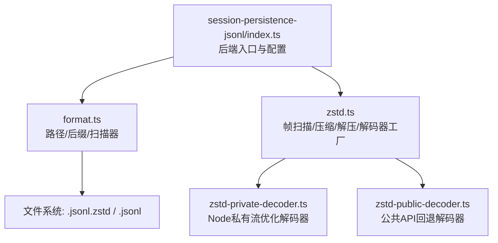
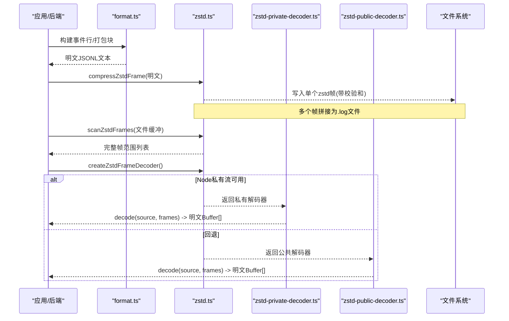
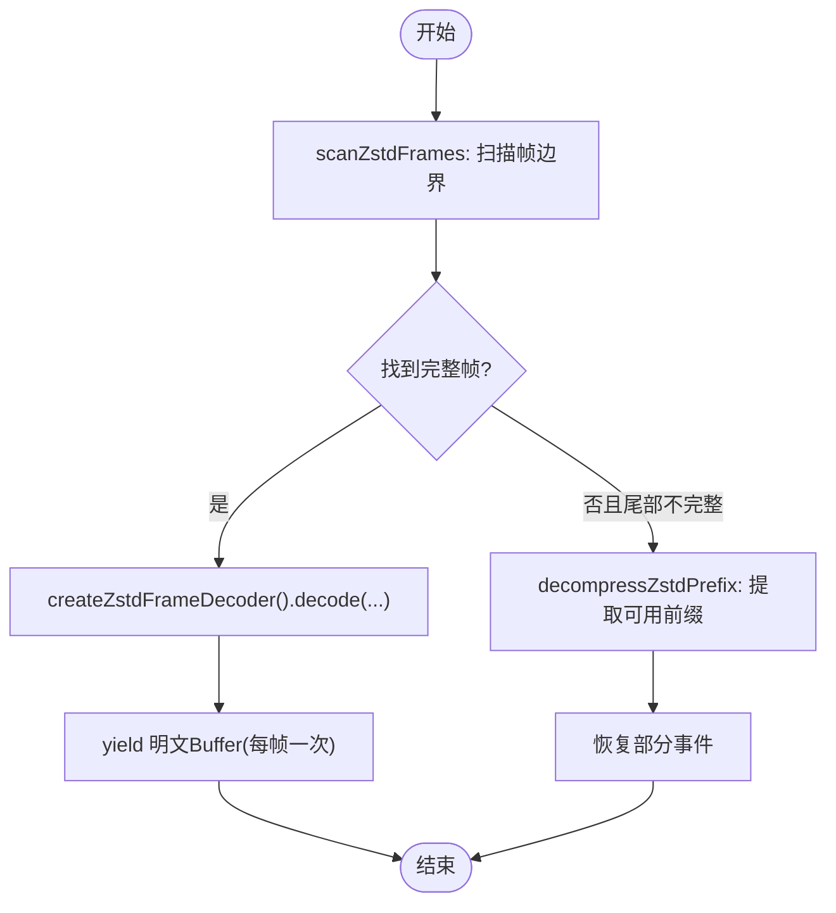
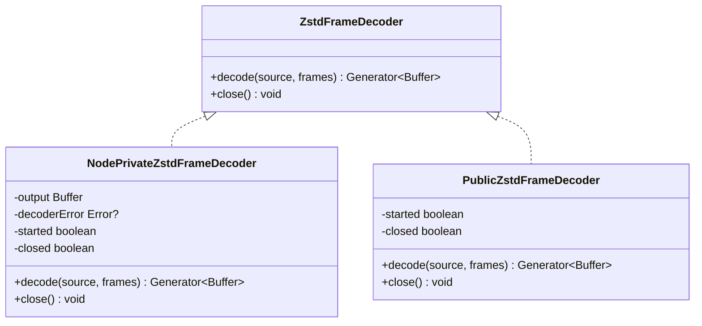
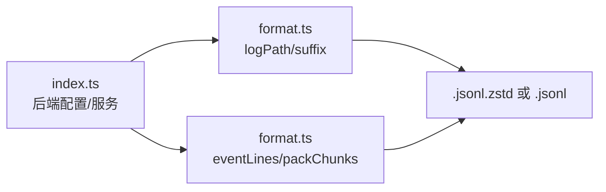
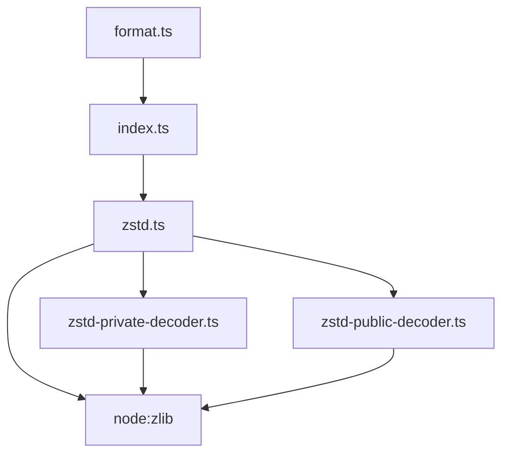

# 数据压缩技术

<cite>
**本文引用的文件**
- [zstd.ts](file://packages/session/session-persistence-jsonl/src/zstd.ts)
- [zstd-private-decoder.ts](file://packages/session/session-persistence-jsonl/src/zstd-private-decoder.ts)
- [zstd-public-decoder.ts](file://packages/session/session-persistence-jsonl/src/zstd-public-decoder.ts)
- [format.ts](file://packages/session/session-persistence-jsonl/src/format.ts)
- [index.ts](file://packages/session/session-persistence-jsonl/src/index.ts)
- [zstd.spec.ts](file://packages/session/session-persistence-jsonl/tests/zstd.spec.ts)
</cite>

## 目录
1. [简介](#简介)
2. [项目结构](#项目结构)
3. [核心组件](#核心组件)
4. [架构总览](#架构总览)
5. [详细组件分析](#详细组件分析)
6. [依赖关系分析](#依赖关系分析)
7. [性能考量](#性能考量)
8. [故障排除指南](#故障排除指南)
9. [结论](#结论)
10. [附录](#附录)

## 简介
本文件聚焦于会话持久化 JSONL 后端的 Zstandard（zstd）压缩实现，围绕以下目标展开：
- 说明选择 zstd 的原因与在本仓库中的优势
- 解释压缩级别配置选项、压缩率与速度的权衡
- 文档化流式压缩与解压的实现方式
- 说明内存管理与缓冲区优化策略
- 提供不同数据类型的压缩效果对比与最佳配置建议
- 包含压缩性能基准测试方法与结果解读
- 解释与不同存储后端的集成方式与兼容性考虑

## 项目结构
该功能位于 session-persistence-jsonl 包中，围绕“可独立解码的 zstd 帧”组织代码：
- 格式与路径：定义 JSONL 文件的物理编码后缀、会话目录布局与日志路径
- 压缩/解压：封装 zstd 帧的扫描、压缩、解压与同步多帧解码器
- 解码器实现：提供 Node 私有流优化解码器与公共 API 回退解码器
- 后端集成：JSONL 后端以“帧拼接容器”的形式写入与读取，屏蔽压缩细节

图表来源
- [index.ts:124-178](file://packages/session/session-persistence-jsonl/src/index.ts#L124-L178)
- [format.ts:16-26](file://packages/session/session-persistence-jsonl/src/format.ts#L16-L26)
- [zstd.ts:1-23](file://packages/session/session-persistence-jsonl/src/zstd.ts#L1-L23)

章节来源
- [index.ts:124-178](file://packages/session/session-persistence-jsonl/src/index.ts#L124-L178)
- [format.ts:16-26](file://packages/session/session-persistence-jsonl/src/format.ts#L16-L26)

## 核心组件
- 帧扫描与边界识别：在不解压的情况下定位完整帧范围，支持截断恢复
- 单帧压缩/解压：为每个事件批次或头部生成独立可解码的 zstd 帧，并启用校验和
- 同步多帧解码器：统一接口，优先使用 Node 私有流优化解码器，否则回退到公共 API
- 后端集成：JSONL 后端将多个帧拼接写入，读取时按帧顺序还原明文

章节来源
- [zstd.ts:25-104](file://packages/session/session-persistence-jsonl/src/zstd.ts#L25-L104)
- [zstd.ts:106-156](file://packages/session/session-persistence-jsonl/src/zstd.ts#L106-L156)
- [zstd-private-decoder.ts:57-179](file://packages/session/session-persistence-jsonl/src/zstd-private-decoder.ts#L57-L179)
- [zstd-public-decoder.ts:9-41](file://packages/session/session-persistence-jsonl/src/zstd-public-decoder.ts#L9-L41)
- [format.ts:210-224](file://packages/session/session-persistence-jsonl/src/format.ts#L210-L224)

## 架构总览
下图展示了从后端写入到读取的端到端流程，包括帧扫描、压缩/解压与解码器选择。

图表来源
- [zstd.ts:48-104](file://packages/session/session-persistence-jsonl/src/zstd.ts#L48-L104)
- [zstd.ts:111-122](file://packages/session/session-persistence-jsonl/src/zstd.ts#L111-L122)
- [zstd.ts:143-145](file://packages/session/session-persistence-jsonl/src/zstd.ts#L143-L145)
- [zstd-private-decoder.ts:83-114](file://packages/session/session-persistence-jsonl/src/zstd-private-decoder.ts#L83-L114)
- [zstd-public-decoder.ts:15-34](file://packages/session/session-persistence-jsonl/src/zstd-public-decoder.ts#L15-L34)

## 详细组件分析

### 选择 zstd 的原因与性能优势
- 独立可解码帧：每个帧自带校验和，便于追加写入、并发安全与损坏恢复
- 高吞吐与低延迟：在 Node zlib 原生实现上获得良好性能
- 兼容性与生态：广泛支持，便于跨平台与工具链集成
- 本仓库实践：通过“帧拼接容器”抽象，使上层无需感知压缩细节

章节来源
- [zstd.ts:1-23](file://packages/session/session-persistence-jsonl/src/zstd.ts#L1-L23)
- [zstd.ts:106-122](file://packages/session/session-persistence-jsonl/src/zstd.ts#L106-L122)

### 压缩级别配置与权衡
- 当前默认行为：使用 Node zlib 的 zstdCompressAsync 进行压缩，未暴露用户级压缩级别参数
- 设计取舍：以“帧+校验和”的稳定性与可恢复性为先，避免复杂级别调优带来的不一致性
- 扩展点：如需引入压缩级别，可在压缩选项中增加 level 等参数，并在测试矩阵中验证各版本一致性

章节来源
- [zstd.ts:16-23](file://packages/session/session-persistence-jsonl/src/zstd.ts#L16-L23)
- [zstd.ts:111-113](file://packages/session/session-persistence-jsonl/src/zstd.ts#L111-L113)

### 流式压缩与解压
- 写入侧：按事件批次生成独立帧并追加到文件，天然支持流式写入
- 读取侧：scanZstdFrames 仅解析帧头与块边界，不解压即可定位完整帧；createZstdFrameDecoder 提供同步迭代器逐帧解压
- 截断恢复：对不完整尾帧，可使用 decompressZstdPrefix 提取已可用的明文前缀

图表来源
- [zstd.ts:48-104](file://packages/session/session-persistence-jsonl/src/zstd.ts#L48-L104)
- [zstd.ts:143-156](file://packages/session/session-persistence-jsonl/src/zstd.ts#L143-L156)

章节来源
- [zstd.ts:48-104](file://packages/session/session-persistence-jsonl/src/zstd.ts#L48-L104)
- [zstd.ts:143-156](file://packages/session/session-persistence-jsonl/src/zstd.ts#L143-L156)

### 内存管理与缓冲区优化
- 输出复用：私有解码器使用固定大小的输出缓冲区，减少分配与拷贝
- 大对象保护：限制单帧输出长度，防止异常膨胀导致内存压力
- 错误传播：内部错误通过符号键与事件机制收集，统一抛出结构化错误
- 生命周期：解码器启动/关闭状态受控，避免重复使用与资源泄漏

图表来源
- [zstd.ts:124-136](file://packages/session/session-persistence-jsonl/src/zstd.ts#L124-L136)
- [zstd-private-decoder.ts:63-179](file://packages/session/session-persistence-jsonl/src/zstd-private-decoder.ts#L63-L179)
- [zstd-public-decoder.ts:10-41](file://packages/session/session-persistence-jsonl/src/zstd-public-decoder.ts#L10-L41)

章节来源
- [zstd-private-decoder.ts:63-179](file://packages/session/session-persistence-jsonl/src/zstd-private-decoder.ts#L63-L179)
- [zstd-public-decoder.ts:10-41](file://packages/session/session-persistence-jsonl/src/zstd-public-decoder.ts#L10-L41)

### 与存储后端的集成与兼容性
- 物理编码：可选择 zstd 或 none，影响文件后缀与读写路径
- 路径与布局：根据 root、cwd、id 计算会话目录与日志文件路径
- 写入策略：事件批转换为 JSONL 文本，再按帧写入；支持 packChunks 优化新写入字节
- 读取策略：先解析首行头部，再增量扫描事件记录，忽略末尾不完整行

图表来源
- [index.ts:124-178](file://packages/session/session-persistence-jsonl/src/index.ts#L124-L178)
- [format.ts:16-26](file://packages/session/session-persistence-jsonl/src/format.ts#L16-L26)
- [format.ts:210-224](file://packages/session/session-persistence-jsonl/src/format.ts#L210-L224)

章节来源
- [index.ts:124-178](file://packages/session/session-persistence-jsonl/src/index.ts#L124-L178)
- [format.ts:16-26](file://packages/session/session-persistence-jsonl/src/format.ts#L16-L26)
- [format.ts:210-224](file://packages/session/session-persistence-jsonl/src/format.ts#L210-L224)

## 依赖关系分析
- 模块内依赖：
  - zstd.ts 依赖 Node zlib 的 zstdCompress/zstdDecompress，并组合两种解码器实现
  - private decoder 依赖 Node 内部流形状（探测失败则回退）
  - public decoder 仅依赖 Node 公共 API
- 外部依赖：
  - Node zlib（zstd 编解码）
  - Node buffer/constants（内存上限常量）
- 耦合与内聚：
  - 解码器抽象解耦具体实现，提升可替换性
  - 帧扫描与解压分离，便于元数据读取与修复

图表来源
- [zstd.ts:8-13](file://packages/session/session-persistence-jsonl/src/zstd.ts#L8-L13)
- [zstd-private-decoder.ts:6-8](file://packages/session/session-persistence-jsonl/src/zstd-private-decoder.ts#L6-L8)
- [zstd-public-decoder.ts:6-7](file://packages/session/session-persistence-jsonl/src/zstd-public-decoder.ts#L6-L7)
- [index.ts:124-178](file://packages/session/session-persistence-jsonl/src/index.ts#L124-L178)
- [format.ts:16-26](file://packages/session/session-persistence-jsonl/src/format.ts#L16-L26)

章节来源
- [zstd.ts:8-13](file://packages/session/session-persistence-jsonl/src/zstd.ts#L8-L13)
- [zstd-private-decoder.ts:6-8](file://packages/session/session-persistence-jsonl/src/zstd-private-decoder.ts#L6-L8)
- [zstd-public-decoder.ts:6-7](file://packages/session/session-persistence-jsonl/src/zstd-public-decoder.ts#L6-L7)

## 性能考量
- 解码器选择：优先使用 Node 私有流解码器以降低分配与拷贝开销；不可用时自动回退
- 帧粒度：以帧为单位进行解压，保证单次同步操作的可预测性
- 缓冲区大小：私有解码器使用固定大小输出缓冲，避免频繁扩容
- 写入效率：packChunks 可将增量块打包为存储行，减少新写入字节量
- 监控建议：结合 perf_hooks 测量关键路径（scan、compress、decode）耗时与吞吐

章节来源
- [zstd.ts:138-145](file://packages/session/session-persistence-jsonl/src/zstd.ts#L138-L145)
- [zstd-private-decoder.ts:10-11](file://packages/session/session-persistence-jsonl/src/zstd-private-decoder.ts#L10-L11)
- [format.ts:210-224](file://packages/session/session-persistence-jsonl/src/format.ts#L210-L224)

## 故障排除指南
- 常见错误类型
  - 帧魔数无效或保留位设置：表示文件损坏或格式不符
  - 帧校验失败：解压时触发，通常由传输或磁盘损坏引起
  - 输出超限：单帧输出超过进程级最大长度限制
  - 解码器状态错误：重复启动、关闭后继续使用
- 诊断步骤
  - 使用 scanZstdFrames 检查帧边界与完整性
  - 对不完整尾帧使用 decompressZstdPrefix 尝试恢复可用明文
  - 切换解码器实现（私有/公共）验证是否为运行时差异导致
  - 检查文件后缀与后端配置是否一致（.jsonl.zstd vs .jsonl）
- 恢复策略
  - 基于 scanLog 的提交偏移进行截断恢复
  - 对损坏帧丢弃并重写对应批次

章节来源
- [zstd.ts:48-104](file://packages/session/session-persistence-jsonl/src/zstd.ts#L48-L104)
- [zstd.ts:147-156](file://packages/session/session-persistence-jsonl/src/zstd.ts#L147-L156)
- [zstd-private-decoder.ts:96-114](file://packages/session/session-persistence-jsonl/src/zstd-private-decoder.ts#L96-L114)
- [zstd-public-decoder.ts:15-34](file://packages/session/session-persistence-jsonl/src/zstd-public-decoder.ts#L15-L34)
- [format.ts:266-394](file://packages/session/session-persistence-jsonl/src/format.ts#L266-L394)

## 结论
本实现以“可独立解码的 zstd 帧”为核心，兼顾了高性能、可恢复性与易维护性。通过统一的解码器抽象与智能回退机制，在不同 Node 运行时下保持稳定行为；同时借助帧扫描与截断恢复能力，确保在写入中断或文件损坏场景下的数据可用性。对于生产部署，建议在开启校验和的前提下，结合 packChunks 与合适的写入批大小，以获得更优的存储与 I/O 表现。

## 附录

### 不同数据类型的压缩效果对比与最佳配置建议
- 文本型 JSONL 事件：压缩率高，适合默认配置
- 二进制或随机噪声：压缩率较低，但仍能降低体积
- 建议
  - 保持启用校验和，确保数据完整性
  - 若追求极致吞吐，可评估关闭 packChunks 的写入路径（仅影响新写入字节）
  - 在大规模写入场景下，关注帧大小与批量大小，避免过大帧导致解码阻塞

[本节为通用指导，不直接分析具体文件]

### 压缩性能基准测试方法
- 指标
  - 压缩/解压吞吐（MB/s）
  - 平均延迟（ms/帧）
  - CPU 占用与内存峰值
- 方法
  - 构造代表性数据集（短消息、长文本、混合负载）
  - 使用 perf_hooks 测量 compressZstdFrame、scanZstdFrames、decode 耗时
  - 对比私有解码器与公共解码器的差异
- 参考用例
  - 测试套件中包含帧结构与解码器互换性的用例，可用于复现与回归

章节来源
- [zstd.spec.ts:147-200](file://packages/session/session-persistence-jsonl/tests/zstd.spec.ts#L147-L200)