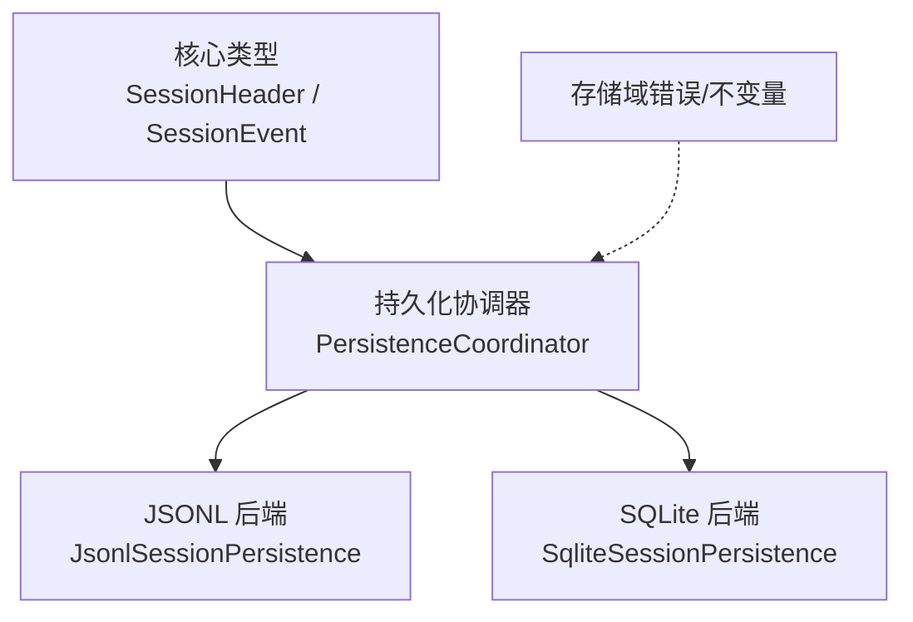
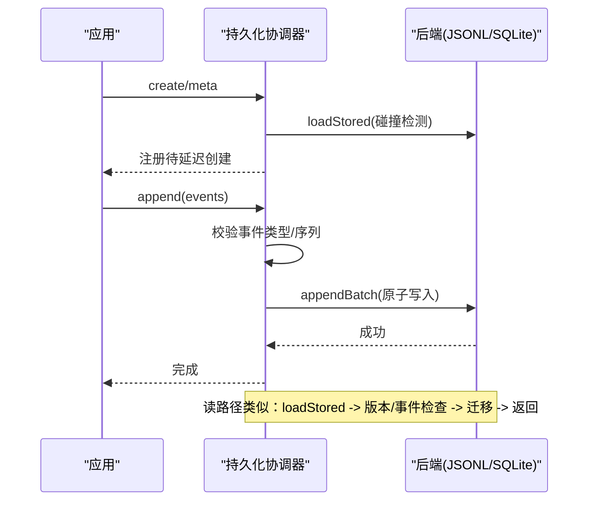
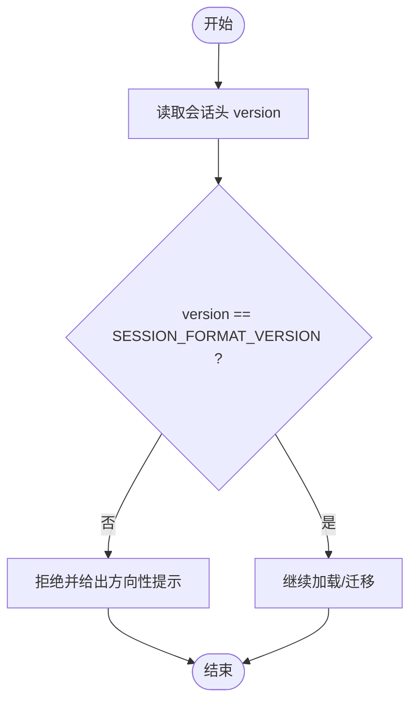
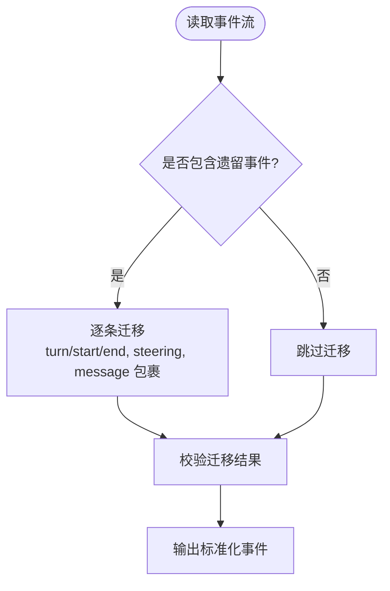
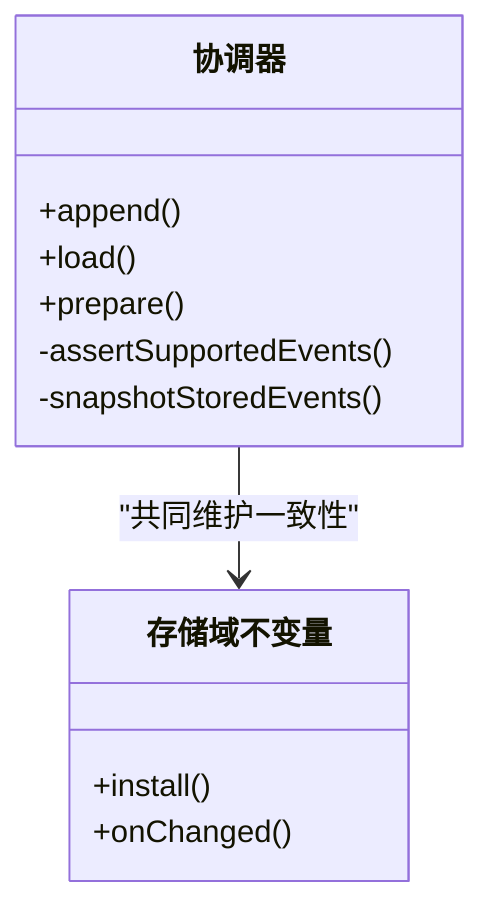
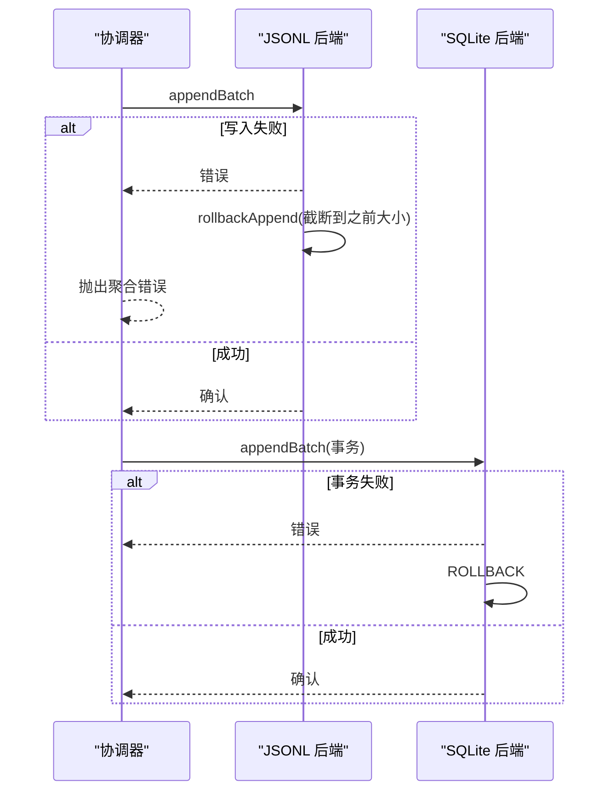
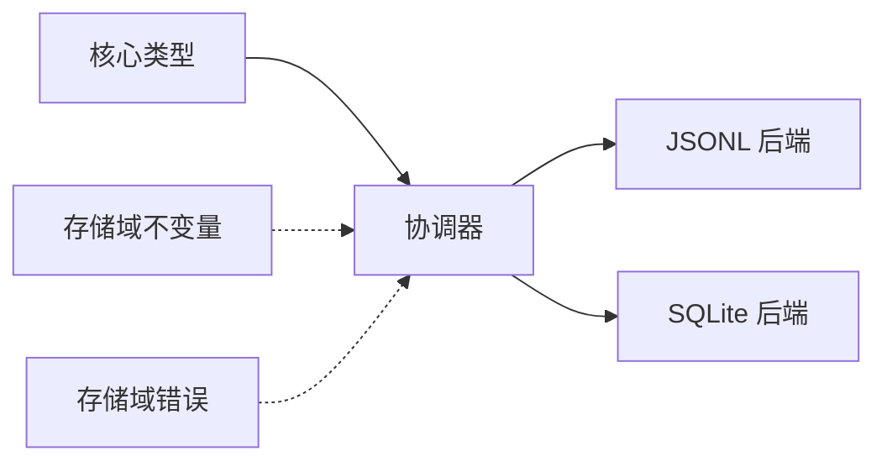

# 版本控制与数据迁移

<cite>
**本文引用的文件**
- [packages/core/session/src/types.ts](file://packages/core/session/src/types.ts)
- [packages/core/session/src/index.ts](file://packages/core/session/src/index.ts)
- [packages/session/session-persistence/src/coordinator.ts](file://packages/session/session-persistence/src/coordinator.ts)
- [packages/session/session-persistence-jsonl/src/index.ts](file://packages/session/session-persistence-jsonl/src/index.ts)
- [packages/session/session-persistence-jsonl/src/format.ts](file://packages/session/session-persistence-jsonl/src/format.ts)
- [packages/session/session-persistence-sqlite/src/index.ts](file://packages/session/session-persistence-sqlite/src/index.ts)
- [packages/storage/storage-domain/src/error.ts](file://packages/storage/storage-domain/src/error.ts)
- [packages/storage/storage-domain/src/invariant.ts](file://packages/storage/storage-domain/src/invariant.ts)
</cite>

## 目录
1. [简介](#简介)
2. [项目结构](#项目结构)
3. [核心组件](#核心组件)
4. [架构总览](#架构总览)
5. [详细组件分析](#详细组件分析)
6. [依赖关系分析](#依赖关系分析)
7. [性能考量](#性能考量)
8. [故障排查指南](#故障排查指南)
9. [结论](#结论)
10. [附录](#附录)

## 简介
本文件系统性说明会话数据的版本控制与数据迁移机制，覆盖版本号定义、兼容性检查、向后/向前兼容策略、迁移脚本编写规范与执行顺序、数据校验与完整性验证、错误处理与回滚策略、版本升级最佳实践，以及面向未来演进的可扩展数据结构设计。内容基于代码库中的会话持久化协调器、JSONL 与 SQLite 后端实现及核心类型定义进行提炼。

## 项目结构
围绕“版本控制与数据迁移”的关键位置如下：
- 会话格式版本与会话头定义位于核心 session 包。
- 会话持久化协调器统一负责加载、准备、修复与写入编排，并集中执行版本与事件兼容性检查。
- JSONL 后端以追加式日志文件存储，具备原样读取能力与崩溃尾段恢复标记。
- SQLite 后端以行表存储，提供按 seq 的增量读取与事务级原子性。
- 存储域的错误与不变量用于跨层一致性保障。

**图示来源**
- [packages/core/session/src/types.ts:33-56](file://packages/core/session/src/types.ts#L33-L56)
- [packages/session/session-persistence/src/coordinator.ts:588-625](file://packages/session/session-persistence/src/coordinator.ts#L588-L625)
- [packages/session/session-persistence-jsonl/src/index.ts:121-164](file://packages/session/session-persistence-jsonl/src/index.ts#L121-L164)
- [packages/session/session-persistence-sqlite/src/index.ts:99-138](file://packages/session/session-persistence-sqlite/src/index.ts#L99-L138)

**章节来源**
- [packages/core/session/src/types.ts:33-56](file://packages/core/session/src/types.ts#L33-L56)
- [packages/session/session-persistence/src/coordinator.ts:588-625](file://packages/session/session-persistence/src/coordinator.ts#L588-L625)

## 核心组件
- 会话格式版本与会话头：在核心类型中定义当前磁盘格式版本常量与会话头字段；创建时写入版本，加载时强制校验。
- 持久化协调器：封装所有后端的通用逻辑，包括版本拒绝、事件类型白名单、旧事件迁移、崩溃修复、序列号连续性校验等。
- JSONL 后端：单会话追加日志文件，支持压缩（zstd）或明文；提供原始内容读取、稳定文件读取、断尾恢复与列表快照。
- SQLite 后端：单库多会话，按 seq 索引；支持从指定 seq 起读、事务内原子写入与修复、源相关 revision 生成。
- 存储域错误与不变量：统一错误码与内存-存储一致性检查，辅助定位不一致问题。

**章节来源**
- [packages/core/session/src/types.ts:33-56](file://packages/core/session/src/types.ts#L33-L56)
- [packages/core/session/src/index.ts:149-157](file://packages/core/session/src/index.ts#L149-L157)
- [packages/session/session-persistence/src/coordinator.ts:35-81](file://packages/session/session-persistence/src/coordinator.ts#L35-L81)
- [packages/session/session-persistence-jsonl/src/index.ts:208-282](file://packages/session/session-persistence-jsonl/src/index.ts#L208-L282)
- [packages/session/session-persistence-sqlite/src/index.ts:206-338](file://packages/session/session-persistence-sqlite/src/index.ts#L206-L338)
- [packages/storage/storage-domain/src/error.ts:37-53](file://packages/storage/storage-domain/src/error.ts#L37-L53)
- [packages/storage/storage-domain/src/invariant.ts:23-67](file://packages/storage/storage-domain/src/invariant.ts#L23-L67)

## 架构总览
会话数据在“写路径”和“读路径”均经过协调器统一治理：
- 写路径：create/append 前做元数据与事件合法性校验，确保事件序列连续，并通过后端 appendBatch 原子落盘。
- 读路径：load/prepare/inspect/readFrom 先读取存储前缀或后缀，再执行版本检查、事件类型检查与旧事件迁移，最终产出不可变视图。
- 崩溃修复：后端返回“断尾标记”，协调器调用 commitRepair 截断并补全关闭事件，保证日志平衡。

**图示来源**
- [packages/session/session-persistence/src/coordinator.ts:629-710](file://packages/session/session-persistence/src/coordinator.ts#L629-L710)
- [packages/session/session-persistence-jsonl/src/index.ts:421-444](file://packages/session/session-persistence-jsonl/src/index.ts#L421-L444)
- [packages/session/session-persistence-sqlite/src/index.ts:284-338](file://packages/session/session-persistence-sqlite/src/index.ts#L284-L338)

## 详细组件分析

### 版本号定义与兼容性检查
- 版本常量：会话格式版本由核心类型导出，作为唯一权威来源；未发布阶段固定为 0，不暗示任何兼容性。
- 写入侧：创建会话头时写入当前版本；后续所有后端在加载时比对运行时版本，不匹配则拒绝。
- 拒绝语义：
  - 更高版本：提示需升级 harness。
  - 更低版本：提示无升级路径。
- 事件级别兼容：未知事件类型若未标记 ignorable，必须拒绝；新增事件类型可通过 ignorable 实现词汇增长而不必升版。

**图示来源**
- [packages/core/session/src/types.ts:33-56](file://packages/core/session/src/types.ts#L33-L56)
- [packages/session/session-persistence/src/coordinator.ts:1046-1049](file://packages/session/session-persistence/src/coordinator.ts#L1046-L1049)
- [packages/session/session-persistence/src/coordinator.ts:77-81](file://packages/session/session-persistence/src/coordinator.ts#L77-L81)

**章节来源**
- [packages/core/session/src/types.ts:33-56](file://packages/core/session/src/types.ts#L33-L56)
- [packages/core/session/src/index.ts:149-157](file://packages/core/session/src/index.ts#L149-L157)
- [packages/session/session-persistence/src/coordinator.ts:77-81](file://packages/session/session-persistence/src/coordinator.ts#L77-L81)
- [packages/session/session-persistence/src/coordinator.ts:1046-1049](file://packages/session/session-persistence/src/coordinator.ts#L1046-L1049)

### 数据迁移流程（向后兼容与向前迁移）
- 向后兼容（旧事件到新事件）：协调器内置对若干遗留事件类型的识别与转换，如 turn/start/end、steering/message、message 包裹结构等；迁移过程保持消息 ID 稳定性与引用关系。
- 向前迁移（新读者读旧日志）：通过版本常量与事件白名单拒绝无法解释的日志，避免静默降级导致的不一致。
- 迁移触发点：
  - 冷启动加载：load/prepare 读取存储前缀后进行迁移。
  - HMR/热更新：live adoption 同样会拒绝不支持的遗留事件。
- 迁移边界：仅对需要的事实进行迁移；当前形态但结构异常的事件交由上层校验拒绝，不伪装成历史数据。

**图示来源**
- [packages/session/session-persistence/src/coordinator.ts:273-290](file://packages/session/session-persistence/src/coordinator.ts#L273-L290)
- [packages/session/session-persistence/src/coordinator.ts:343-455](file://packages/session/session-persistence/src/coordinator.ts#L343-L455)
- [packages/session/session-persistence/src/coordinator.ts:544-573](file://packages/session/session-persistence/src/coordinator.ts#L544-L573)

**章节来源**
- [packages/session/session-persistence/src/coordinator.ts:273-290](file://packages/session/session-persistence/src/coordinator.ts#L273-L290)
- [packages/session/session-persistence/src/coordinator.ts:343-455](file://packages/session/session-persistence/src/coordinator.ts#L343-L455)
- [packages/session/session-persistence/src/coordinator.ts:544-573](file://packages/session/session-persistence/src/coordinator.ts#L544-L573)

### 迁移脚本编写规范与执行顺序
- 原则：
  - 迁移应幂等且可重试；失败不影响已提交部分。
  - 优先在“读路径”做轻量迁移（如事件形状归一），重迁移（如大表结构变更）走独立脚本并在维护窗口执行。
  - 所有迁移需附带单元测试与快照，确保行为稳定。
- 执行顺序：
  - 先执行“读路径”兼容层，保证新版本能正确读取旧数据。
  - 再执行“写路径”升级，使新写入数据符合新结构。
  - 最后清理遗留结构（可选，分批次）。
- 回滚：
  - 每个迁移步骤记录状态；失败时按逆序回滚。
  - 数据库类迁移使用事务；文件系统类迁移采用临时文件+原子替换。

[本节为通用规范说明，不直接分析具体文件]

### 数据校验与完整性验证
- 会话头校验：创建/恢复时对字段类型、取值范围、可序列化性进行严格校验，冻结对象防止篡改。
- 事件校验：
  - 事件类型白名单 + ignorable 标记控制未知事件的处理策略。
  - 序列号连续性校验，拒绝非连续追加。
  - 表面事件（user/assistant/tool result）要求 sourceEventSeqs/surfaceOp 满足约束。
- 存储一致性：
  - 存储域不变量监听 domain/changed 事件，核对内存与持久化状态一致。
  - JSONL/SQLite 各自提供原始内容读取与 revision 标识，便于外部审计与对比。

**图示来源**
- [packages/session/session-persistence/src/coordinator.ts:669-710](file://packages/session/session-persistence/src/coordinator.ts#L669-L710)
- [packages/storage/storage-domain/src/invariant.ts:23-67](file://packages/storage/storage-domain/src/invariant.ts#L23-L67)

**章节来源**
- [packages/core/session/src/index.ts:122-157](file://packages/core/session/src/index.ts#L122-L157)
- [packages/session/session-persistence/src/coordinator.ts:669-710](file://packages/session/session-persistence/src/coordinator.ts#L669-L710)
- [packages/storage/storage-domain/src/invariant.ts:23-67](file://packages/storage/storage-domain/src/invariant.ts#L23-L67)

### 错误处理与回滚策略
- 版本/事件拒绝：
  - 版本不匹配抛出明确的方向性错误（升级或无升级路径）。
  - 未知事件且非 ignorable 时拒绝，避免静默丢失。
- 崩溃恢复：
  - JSONL：扫描 zstd 帧，检测断尾；commitRepair 截断到偏移并补全关闭事件。
  - SQLite：scanRows 返回 tornFrom；commitRepair 删除尾部并插入 closers，整体在一个事务中完成。
- 写入回滚：
  - JSONL：追加失败时回退文件大小至写入前，避免重复 seq。
  - SQLite：事务内 INSERT/UPDATE，失败即 ROLLBACK。
- 错误分类：
  - 存储域错误携带稳定 code 与 detail，便于上层区分处理。

**图示来源**
- [packages/session/session-persistence-jsonl/src/index.ts:651-689](file://packages/session/session-persistence-jsonl/src/index.ts#L651-L689)
- [packages/session/session-persistence-jsonl/src/index.ts:436-444](file://packages/session/session-persistence-jsonl/src/index.ts#L436-L444)
- [packages/session/session-persistence-sqlite/src/index.ts:284-338](file://packages/session/session-persistence-sqlite/src/index.ts#L284-L338)
- [packages/storage/storage-domain/src/error.ts:37-53](file://packages/storage/storage-domain/src/error.ts#L37-L53)

**章节来源**
- [packages/session/session-persistence-jsonl/src/index.ts:436-444](file://packages/session/session-persistence-jsonl/src/index.ts#L436-L444)
- [packages/session/session-persistence-jsonl/src/index.ts:651-689](file://packages/session/session-persistence-jsonl/src/index.ts#L651-L689)
- [packages/session/session-persistence-sqlite/src/index.ts:284-338](file://packages/session/session-persistence-sqlite/src/index.ts#L284-L338)
- [packages/storage/storage-domain/src/error.ts:37-53](file://packages/storage/storage-domain/src/error.ts#L37-L53)

### 版本升级最佳实践与注意事项
- 升级前：
  - 备份数据（JSONL 日志文件或 SQLite 数据库）。
  - 在测试环境完整回归读/写路径与迁移逻辑。
- 升级中：
  - 优先启用“读路径兼容层”，确保新版本可读取旧日志。
  - 逐步引入“写路径新结构”，双写期间保留旧字段以便回滚。
  - 对关键迁移步骤增加幂等性与重试。
- 升级后：
  - 观察错误日志与指标，确认无拒绝或回滚异常。
  - 清理废弃字段/表，发布迁移完成公告。
- 注意事项：
  - 版本常量是唯一权威来源，切勿分散定义。
  - 新增事件类型默认视为“必需”，必要时显式标记 ignorable。
  - 对外暴露的 API 与事件契约需保持稳定，变更需评估影响面。

[本节为通用最佳实践说明，不直接分析具体文件]

### 可扩展的数据结构设计
- 会话头与会话事件采用“合并扩展”的设计：
  - 会话头允许可选字段（cwd、parentSession、seedLength、origin、delegationDepth、agentPreset），新增字段默认可选，避免破坏旧数据。
  - 事件类型通过 SessionEventMap 扩展，新增类型默认不受旧读者理解，需配合 ignorable 控制。
- 表面事件（user/assistant/tool result）通过 surfaceOp/sourceEventSeqs 描述如何投影到有序表面，解耦业务与展示。
- 建议：
  - 新增字段尽量置于 data 内部，避免破坏外层信封。
  - 对可能缺失的字段提供默认值或空集合。
  - 对重要字段添加校验与文档，确保可序列化与可迁移。

**章节来源**
- [packages/core/session/src/types.ts:61-99](file://packages/core/session/src/types.ts#L61-L99)
- [packages/core/session/src/types.ts:236-333](file://packages/core/session/src/types.ts#L236-L333)
- [packages/core/session/src/types.ts:348-437](file://packages/core/session/src/types.ts#L348-L437)

## 依赖关系分析
- 核心类型被协调器与后端广泛引用，构成契约基础。
- 协调器依赖后端接口 PersistenceBackend，屏蔽差异并提供统一语义。
- JSONL/SQLite 后端分别实现物理存储细节，但都遵循同一协调协议。
- 存储域错误与不变量为跨层一致性提供支撑。

**图示来源**
- [packages/core/session/src/types.ts:33-56](file://packages/core/session/src/types.ts#L33-L56)
- [packages/session/session-persistence/src/coordinator.ts:588-625](file://packages/session/session-persistence/src/coordinator.ts#L588-L625)
- [packages/session/session-persistence-jsonl/src/index.ts:121-164](file://packages/session/session-persistence-jsonl/src/index.ts#L121-L164)
- [packages/session/session-persistence-sqlite/src/index.ts:99-138](file://packages/session/session-persistence-sqlite/src/index.ts#L99-L138)
- [packages/storage/storage-domain/src/invariant.ts:23-67](file://packages/storage/storage-domain/src/invariant.ts#L23-L67)
- [packages/storage/storage-domain/src/error.ts:37-53](file://packages/storage/storage-domain/src/error.ts#L37-L53)

**章节来源**
- [packages/core/session/src/types.ts:33-56](file://packages/core/session/src/types.ts#L33-L56)
- [packages/session/session-persistence/src/coordinator.ts:588-625](file://packages/session/session-persistence/src/coordinator.ts#L588-L625)
- [packages/session/session-persistence-jsonl/src/index.ts:121-164](file://packages/session/session-persistence-jsonl/src/index.ts#L121-L164)
- [packages/session/session-persistence-sqlite/src/index.ts:99-138](file://packages/session/session-persistence-sqlite/src/index.ts#L99-L138)
- [packages/storage/storage-domain/src/invariant.ts:23-67](file://packages/storage/storage-domain/src/invariant.ts#L23-L67)
- [packages/storage/storage-domain/src/error.ts:37-53](file://packages/storage/storage-domain/src/error.ts#L37-L53)

## 性能考量
- 批量写入：协调器将事件批量化写入，减少 I/O 次数；JSONL/SQLite 均支持批量操作。
- 增量读取：SQLite 支持从指定 seq 起读，避免全量解析；JSONL 虽顺序读取，但提供原始内容读取与只读头部扫描优化。
- 压缩与解码：JSONL 默认 zstd 压缩，解码时分块 yield 避免阻塞事件循环。
- 缓存：协调器维护 prepared session 缓存，减少冷启动开销。

[本节为通用性能讨论，不直接分析具体文件]

## 故障排查指南
- 常见错误：
  - 版本不匹配：检查运行时代码与存储版本是否一致；根据提示升级或回退。
  - 事件类型未知：检查事件是否标记 ignorable；必要时调整事件模型。
  - 序列号不连续：检查并发写入或异常中断后的恢复逻辑。
  - 崩溃尾段：查看后端返回的断尾标记，确认 commitRepair 是否正确执行。
- 诊断工具：
  - JSONL 原始内容读取：用于比对物理字节与逻辑事件。
  - 存储域不变量：定位内存与存储不一致。
  - 错误码与 detail：结合上层日志快速定位根因。

**章节来源**
- [packages/session/session-persistence-jsonl/src/index.ts:240-282](file://packages/session/session-persistence-jsonl/src/index.ts#L240-L282)
- [packages/storage/storage-domain/src/invariant.ts:23-67](file://packages/storage/storage-domain/src/invariant.ts#L23-L67)
- [packages/storage/storage-domain/src/error.ts:37-53](file://packages/storage/storage-domain/src/error.ts#L37-L53)

## 结论
本仓库通过单一版本常量、严格的读/写路径校验、内置的旧事件迁移、崩溃恢复与事务/原子写入，构建了稳健的会话数据版本控制与迁移体系。建议在后续演进中坚持“读路径兼容优先、写路径渐进升级”的策略，配合完善的测试与监控，确保数据一致性与系统可用性。

## 附录
- 术语
  - 会话头：会话的不可变元数据，包含版本、ID、创建时间等。
  - 会话事件：追加式日志条目，描述会话交互过程。
  - 断尾标记：后端在读取时发现的不完整尾部信息，用于修复。
  - 源限定修订：基于存储介质特征生成的单调标识，用于精确识别数据版本。

[本节为概念性说明，不直接分析具体文件]