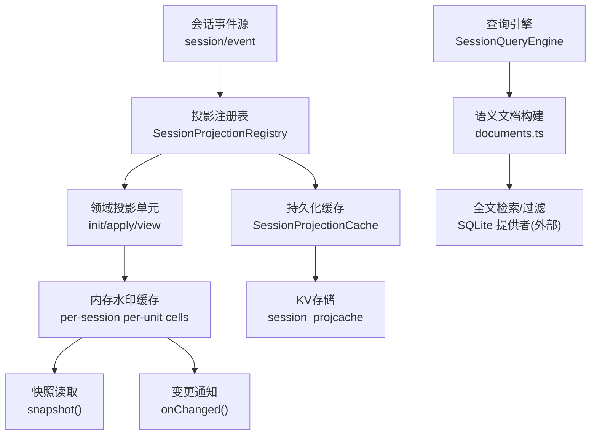
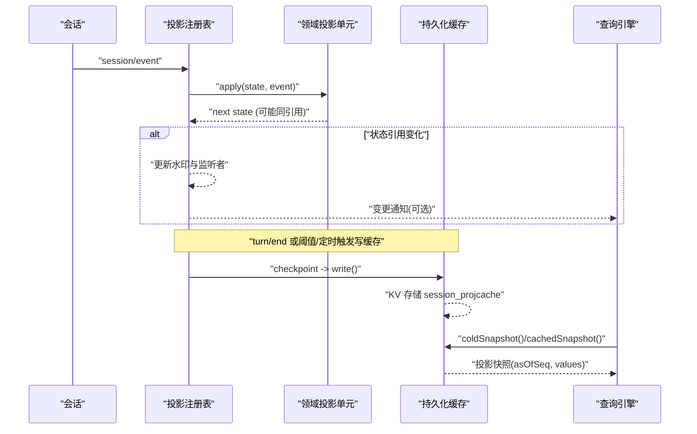
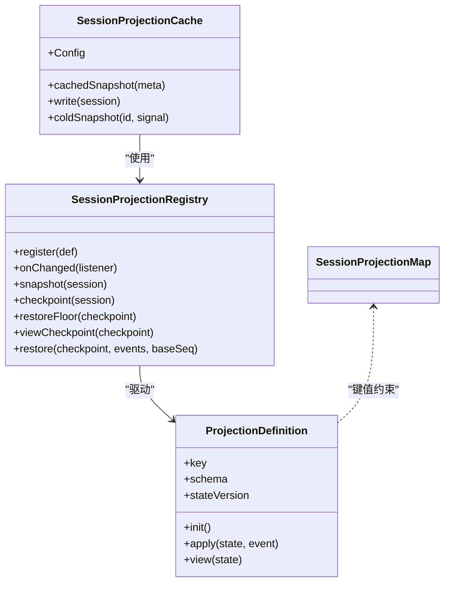
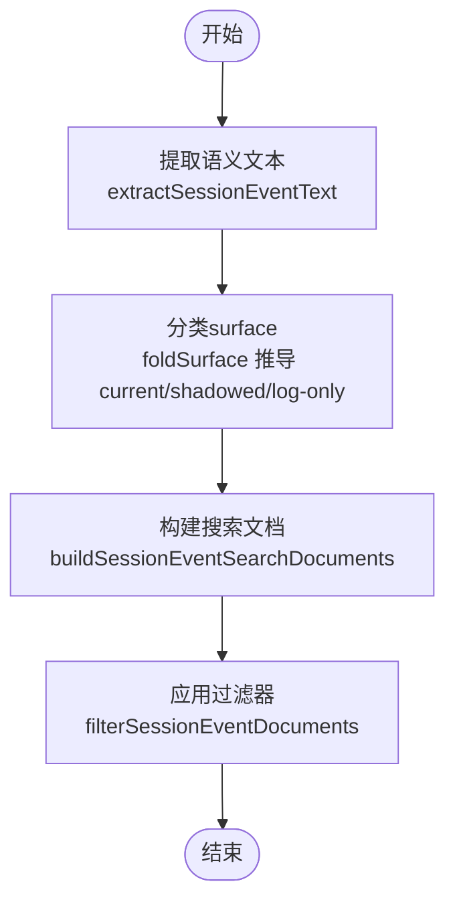
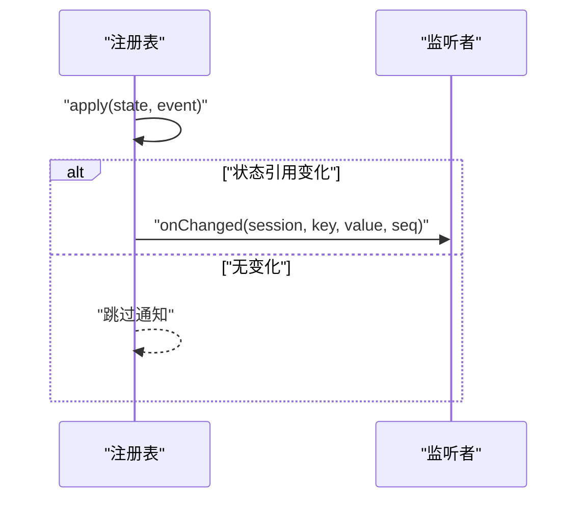
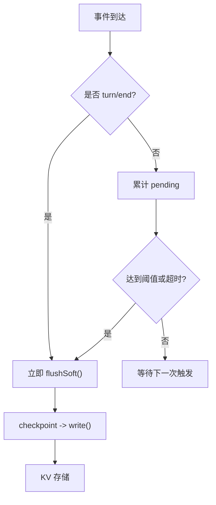
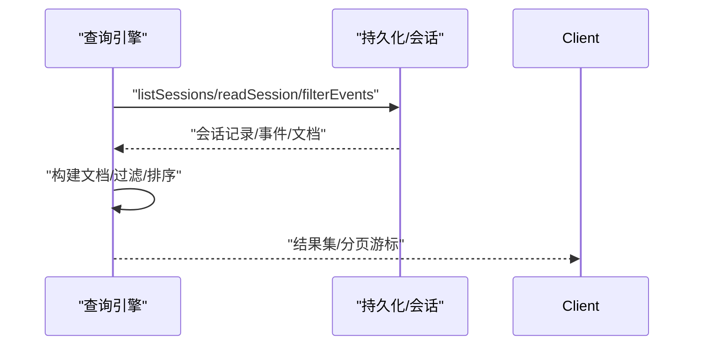
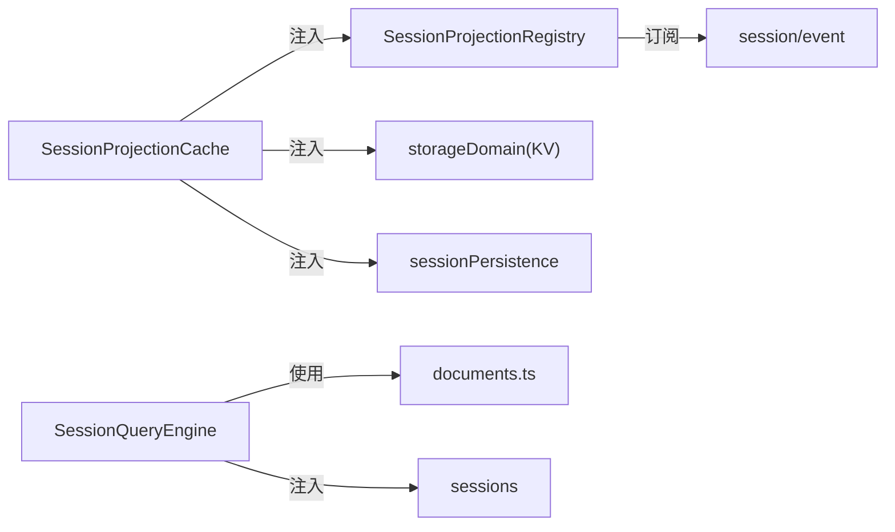

# 会话投影机制

<cite>
**本文引用的文件**
- [packages/session/session-projection/src/index.ts](file://packages/session/session-projection/src/index.ts)
- [packages/session/session-projection/src/types.ts](file://packages/session/session-projection/src/types.ts)
- [packages/session/session-projection-cache/src/index.ts](file://packages/session/session-projection-cache/src/index.ts)
- [docs/subsystems/session-projection.md](file://docs/subsystems/session-projection.md)
- [docs/subsystems/session-query.md](file://docs/subsystems/session-query.md)
- [packages/session-query/session-query/src/index.ts](file://packages/session-query/session-query/src/index.ts)
- [packages/session-query/session-query/src/documents.ts](file://packages/session-query/session-query/src/documents.ts)
- [packages/session-query/session-query/src/extraction.ts](file://packages/session-query/session-query/src/extraction.ts)
</cite>

## 目录
1. [简介](#简介)
2. [项目结构](#项目结构)
3. [核心组件](#核心组件)
4. [架构总览](#架构总览)
5. [详细组件分析](#详细组件分析)
6. [依赖关系分析](#依赖关系分析)
7. [性能与缓存策略](#性能与缓存策略)
8. [故障排查指南](#故障排查指南)
9. [结论](#结论)
10. [附录：配置与自定义开发](#附录：配置与自定义开发)

## 简介
本文件系统化说明“会话投影机制”的设计与实现：将原始事件流转换为结构化、可查询的数据模型；定义投影管道（事件提取、数据转换、规范化）；明确不同事件类型的投影规则与处理逻辑；阐述投影缓存策略与性能优化；提供投影配置选项与自定义投影开发指南，并通过实际示例展示如何从原始事件构建查询友好的数据结构。

该机制由“服务契约 + 驱动注册表 + 持久化缓存 + 查询层”组成：框架订阅会话事件并驱动每个领域贡献的纯函数单元进行状态折叠；客户端消费快照或变更通知；持久化缓存以失败安全的方式加速冷启动和列表浏览。

**章节来源**
- [docs/subsystems/session-projection.md:1-10](file://docs/subsystems/session-projection.md#L1-L10)

## 项目结构
围绕会话投影的关键代码分布在以下包中：
- 投影服务与类型契约：packages/session/session-projection
- 投影持久化缓存：packages/session/session-projection-cache
- 会话查询与语义文档：packages/session-query/session-query
- 相关文档：docs/subsystems/session-projection.md, docs/subsystems/session-query.md

**图表来源**
- [packages/session/session-projection/src/index.ts:171-425](file://packages/session/session-projection/src/index.ts#L171-L425)
- [packages/session/session-projection-cache/src/index.ts:71-239](file://packages/session/session-projection-cache/src/index.ts#L71-L239)
- [packages/session-query/session-query/src/index.ts:81-357](file://packages/session-query/session-query/src/index.ts#L81-L357)
- [packages/session-query/session-query/src/documents.ts:15-75](file://packages/session-query/session-query/src/documents.ts#L15-L75)

**章节来源**
- [packages/session/session-projection/src/index.ts:171-425](file://packages/session/session-projection/src/index.ts#L171-L425)
- [packages/session/session-projection-cache/src/index.ts:71-239](file://packages/session/session-projection-cache/src/index.ts#L71-L239)
- [packages/session-query/session-query/src/index.ts:81-357](file://packages/session-query/session-query/src/index.ts#L81-L357)

## 核心组件
- 投影类型表 SessionProjectionMap：跨宿主、传输、客户端的统一类型表，允许通过声明合并扩展键值对。
- 投影单元 ProjectionDefinition：每个领域贡献一个纯计算单元，包含 init、apply、view、schema、stateVersion。
- 投影注册表 SessionProjectionRegistry：订阅 session/event，驱动所有已注册单元，维护每会话每单元的水印缓存，提供 snapshot/onChanged/checkpoint/restore 等能力。
- 投影缓存 SessionProjectionCache：将投影状态持久化到 KV 域，提供 cachedSnapshot/coldSnapshot/write 等接口，支持写后跟与强制落盘点。
- 查询引擎 SessionQueryEngine：提供会话列表、事件过滤、全文搜索、表面快照、血缘追踪等能力，基于投影与事件文档构建查询友好视图。

**章节来源**
- [packages/session/session-projection/src/types.ts:11-17](file://packages/session/session-projection/src/types.ts#L11-L17)
- [packages/session/session-projection/src/index.ts:42-74](file://packages/session/session-projection/src/index.ts#L42-L74)
- [packages/session/session-projection/src/index.ts:171-425](file://packages/session/session-projection/src/index.ts#L171-L425)
- [packages/session/session-projection-cache/src/index.ts:71-239](file://packages/session/session-projection-cache/src/index.ts#L71-L239)
- [packages/session-query/session-query/src/index.ts:81-357](file://packages/session-query/session-query/src/index.ts#L81-L357)

## 架构总览
投影系统采用“驱动-计算-消费”三端解耦：
- 驱动：注册表订阅事件，按序驱动 apply。
- 计算：领域单元为纯同步函数，返回新状态引用或原引用以触发最小化下游工作。
- 消费：快照读取与变更通知；持久化缓存用于冷读加速与列表页快速渲染。

**图表来源**
- [packages/session/session-projection/src/index.ts:181-425](file://packages/session/session-projection/src/index.ts#L181-L425)
- [packages/session/session-projection-cache/src/index.ts:140-239](file://packages/session/session-projection-cache/src/index.ts#L140-L239)
- [packages/session-query/session-query/src/index.ts:134-270](file://packages/session-query/session-query/src/index.ts#L134-L270)

## 详细组件分析

### 投影单元与类型表
- SessionProjectionMap：全局投影类型表，各域通过声明合并扩展键值对，值为 wire-JSON 完整值。
- ProjectionDefinition：
  - key：投影键
  - schema：Zod 校验器，确保 view 输出符合契约
  - init：空日志初始状态
  - apply：纯同步状态转移，未关注的事件应返回相同引用
  - view：状态到 wire 值的映射
  - stateVersion：版本号，用于缓存行失效与恢复判断

**图表来源**
- [packages/session/session-projection/src/types.ts:11-17](file://packages/session/session-projection/src/types.ts#L11-L17)
- [packages/session/session-projection/src/index.ts:42-74](file://packages/session/session-projection/src/index.ts#L42-L74)
- [packages/session/session-projection/src/index.ts:171-425](file://packages/session/session-projection/src/index.ts#L171-L425)
- [packages/session/session-projection-cache/src/index.ts:71-239](file://packages/session/session-projection-cache/src/index.ts#L71-L239)

**章节来源**
- [packages/session/session-projection/src/types.ts:11-17](file://packages/session/session-projection/src/types.ts#L11-L17)
- [packages/session/session-projection/src/index.ts:42-74](file://packages/session/session-projection/src/index.ts#L42-L74)

### 事件提取、转换与规范化
- 事件提取：从原始事件抽取可搜索语义文本，忽略结构性边界与未知事件。
- 数据转换：构建轻量级事件记录与搜索文档，标注 surface（current/shadowed/log-only）。
- 规范化：通过 schema 校验 view 输出，保证跨层一致性。

**图表来源**
- [packages/session-query/session-query/src/extraction.ts:13-42](file://packages/session-query/session-query/src/extraction.ts#L13-L42)
- [packages/session-query/session-query/src/documents.ts:15-75](file://packages/session-query/session-query/src/documents.ts#L15-L75)

**章节来源**
- [packages/session-query/session-query/src/extraction.ts:13-42](file://packages/session-query/session-query/src/extraction.ts#L13-L42)
- [packages/session-query/session-query/src/documents.ts:15-75](file://packages/session-query/session-query/src/documents.ts#L15-L75)

### 不同事件类型的投影规则与处理逻辑
- 用户消息、助手消息、工具调用/结果、待办写入、回合结束原因等会贡献语义文本。
- 结构性事件（如 turn/start、step/start/end、assistant/chunk、request/header）不贡献文本。
- 未知事件保持不可搜索，直到具体消费者定义其语义。

**章节来源**
- [packages/session-query/session-query/src/extraction.ts:13-42](file://packages/session-query/session-query/src/extraction.ts#L13-L42)

### 投影快照与变更通知
- snapshot：同步读取所有已注册单元的当前值，asOfSeq 为共享水位线。
- onChanged：当某单元的状态引用发生变化时，通知监听者，附带 seq 与校验后的 view 值。
- checkpoint：导出每单元的状态行（ver、seq、val），供持久化缓存使用。

**图表来源**
- [packages/session/session-projection/src/index.ts:230-255](file://packages/session/session-projection/src/index.ts#L230-L255)
- [packages/session/session-projection/src/index.ts:404-425](file://packages/session/session-projection/src/index.ts#L404-L425)

**章节来源**
- [packages/session/session-projection/src/index.ts:230-255](file://packages/session/session-projection/src/index.ts#L230-L255)
- [packages/session/session-projection/src/index.ts:404-425](file://packages/session/session-projection/src/index.ts#L404-L425)

### 持久化缓存与冷读路径
- 写路径：
  - 强制落盘点：turn/end 与会话释放（session/disposed）。
  - 节流：按事件计数与时间间隔触发写缓存。
  - 失败安全：写失败仅记录警告，不影响主流程。
- 读路径：
  - cachedSnapshot：零 I/O 列表页快速渲染，基于已持久化行。
  - coldSnapshot：从缓存行 + 持久化尾部事件恢复，必要时全量重放。

**图表来源**
- [packages/session/session-projection-cache/src/index.ts:201-239](file://packages/session/session-projection-cache/src/index.ts#L201-L239)
- [packages/session/session-projection-cache/src/index.ts:140-197](file://packages/session/session-projection-cache/src/index.ts#L140-L197)

**章节来源**
- [packages/session/session-projection-cache/src/index.ts:140-239](file://packages/session/session-projection-cache/src/index.ts#L140-L239)

### 查询引擎与语义文档
- 列表与过滤：listSessions、filterSessions、filterEvents。
- 表面快照：readSurface 返回当前模型表面事件及捕获到的最大 seq。
- 血缘追踪：traceSession、traceEvent。
- 事件窗口：readEvent 提供目标事件及其前后上下文。

**图表来源**
- [packages/session-query/session-query/src/index.ts:134-357](file://packages/session-query/session-query/src/index.ts#L134-L357)

**章节来源**
- [packages/session-query/session-query/src/index.ts:134-357](file://packages/session-query/session-query/src/index.ts#L134-L357)

## 依赖关系分析
- 投影注册表依赖 Cordis 上下文与 session/event 事件流。
- 持久化缓存依赖 storageDomain、sessionProjections、sessionPersistence、sessions。
- 查询引擎依赖 sessions 与内部 corpus，结合 documents.ts 构建搜索文档。

**图表来源**
- [packages/session/session-projection/src/index.ts:171-184](file://packages/session/session-projection/src/index.ts#L171-L184)
- [packages/session/session-projection-cache/src/index.ts:71-89](file://packages/session/session-projection-cache/src/index.ts#L71-L89)
- [packages/session-query/session-query/src/index.ts:81-105](file://packages/session-query/session-query/src/index.ts#L81-L105)

**章节来源**
- [packages/session/session-projection/src/index.ts:171-184](file://packages/session/session-projection/src/index.ts#L171-L184)
- [packages/session/session-projection-cache/src/index.ts:71-89](file://packages/session/session-projection-cache/src/index.ts#L71-L89)
- [packages/session-query/session-query/src/index.ts:81-105](file://packages/session-query/session-query/src/index.ts#L81-L105)

## 性能与缓存策略
- 纯同步 apply：避免异步撕裂一致性切面，减少锁竞争与竞态。
- 引用不变性：未变化的事件返回相同状态引用，下游零开销。
- 懒构建单元格：首次访问或晚注册时折叠历史，按需构建。
- 写后跟节流：按事件计数与时间间隔合并写操作，降低 IO 压力。
- 强制落盘点：turn/end 与会话释放确保关键时间点一致性与冷读可用性。
- 失败安全：写失败仅告警，下次冷读自愈。
- 零 I/O 列表页：cachedSnapshot 直接读取持久化行，快速渲染。

[本节为通用性能讨论，无需特定文件来源]

## 故障排查指南
- 状态版本不匹配：恢复时若行 ver 与 live 不一致，丢弃该行并重放。
- 日志收缩检测：restoreFloor 锚点确保能发现截断导致的过期行，必要时全量重放。
- 非 JSON 序列化：checkpoint 要求状态为纯 JSON，否则抛出类型错误。
- 查询错误码：SESSION_QUERY_* 系列错误码便于定位请求校验、索引失败、持久化失败等问题。

**章节来源**
- [packages/session/session-projection/src/index.ts:300-385](file://packages/session/session-projection/src/index.ts#L300-L385)
- [packages/session/session-projection-cache/src/index.ts:265-281](file://packages/session/session-projection-cache/src/index.ts#L265-L281)
- [docs/subsystems/session-query.md:333-357](file://docs/subsystems/session-query.md#L333-L357)

## 结论
会话投影机制通过纯函数单元、统一类型表、注册表驱动与持久化缓存，实现了从原始事件到结构化、可查询数据的高效转换。其设计强调一致性、可扩展性与容错性，既支持实时变更通知，也提供稳定的冷读与列表页体验。查询层在此基础上进一步提供语义文档与全文检索能力，满足复杂场景下的数据分析需求。

[本节为总结，无需特定文件来源]

## 附录：配置与自定义开发

### 投影配置选项
- 写后跟阈值：writeEveryEvents（事件数）
- 写后跟间隔：writeIntervalMs（毫秒）
- 强制落盘点：turn/end 与会话释放（不可调）

**章节来源**
- [packages/session/session-projection-cache/src/index.ts:42-52](file://packages/session/session-projection-cache/src/index.ts#L42-L52)

### 自定义投影开发指南
- 在 SessionProjectionMap 中声明键值对（通过声明合并）。
- 实现 ProjectionDefinition：
  - init：空日志初始状态
  - apply：纯同步状态转移，未关注事件返回相同引用
  - view：状态到 wire 值的映射，需通过 schema 校验
  - stateVersion：当状态字段或折叠语义变化时递增
- 通过 ctx.sessionProjections.register 注册单元，生命周期随 fiber 管理。
- 如需消费变更，使用 onChanged 订阅。

**章节来源**
- [packages/session/session-projection/src/types.ts:11-17](file://packages/session/session-projection/src/types.ts#L11-L17)
- [packages/session/session-projection/src/index.ts:42-74](file://packages/session/session-projection/src/index.ts#L42-L74)
- [packages/session/session-projection/src/index.ts:186-222](file://packages/session/session-projection/src/index.ts#L186-L222)
- [packages/session/session-projection/src/index.ts:224-238](file://packages/session/session-projection/src/index.ts#L224-L238)

### 实际投影示例（从事件构建查询友好结构）
- 语义文档构建：
  - 遍历事件，提取文本（用户消息、助手消息、工具调用/结果、待办、回合结束原因等）。
  - 标注 surface（current/shadowed/log-only）。
  - 生成搜索文档，供过滤与全文检索使用。
- 查询友好结构：
  - 通过 query 层的 listEvents/filterEvents/readSurface 等方法获取结构化视图。
  - 使用 traceEvent/traceSession 获取事件与血缘关系。

**章节来源**
- [packages/session-query/session-query/src/documents.ts:15-75](file://packages/session-query/session-query/src/documents.ts#L15-L75)
- [packages/session-query/session-query/src/extraction.ts:13-42](file://packages/session-query/session-query/src/extraction.ts#L13-L42)
- [packages/session-query/session-query/src/index.ts:222-270](file://packages/session-query/session-query/src/index.ts#L222-L270)