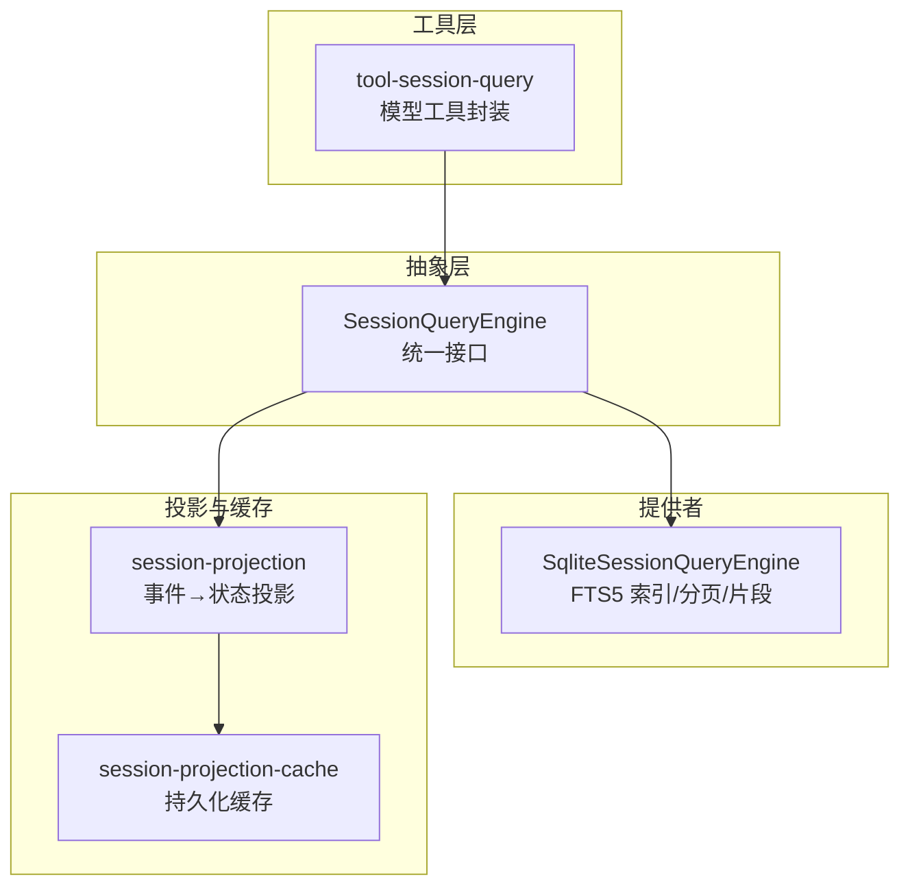
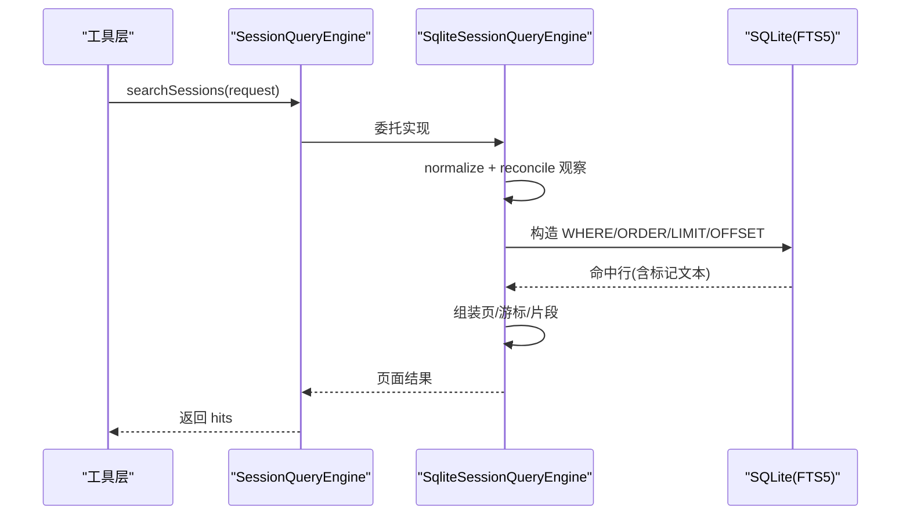
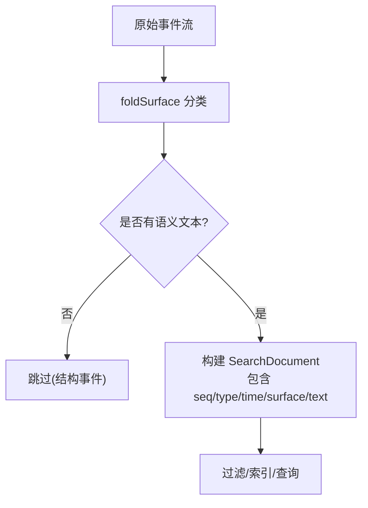
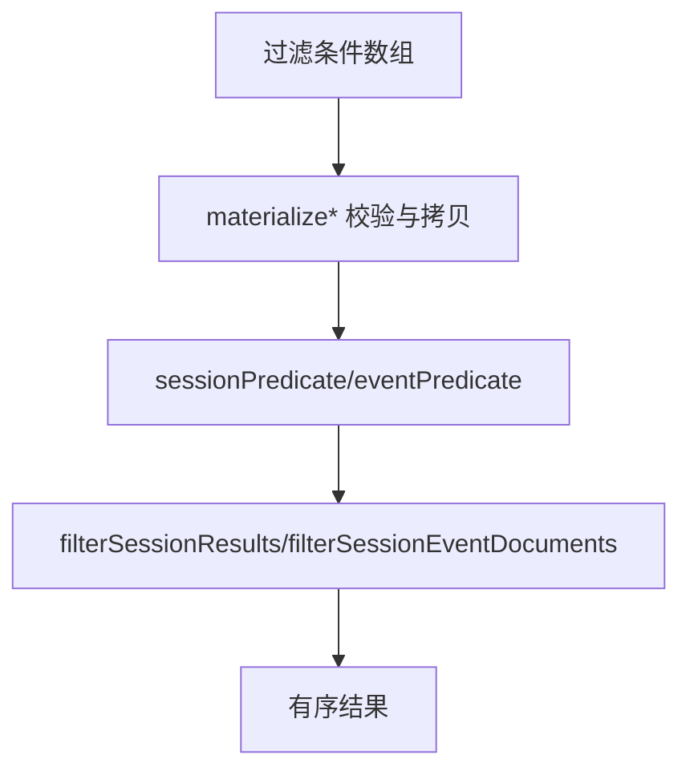
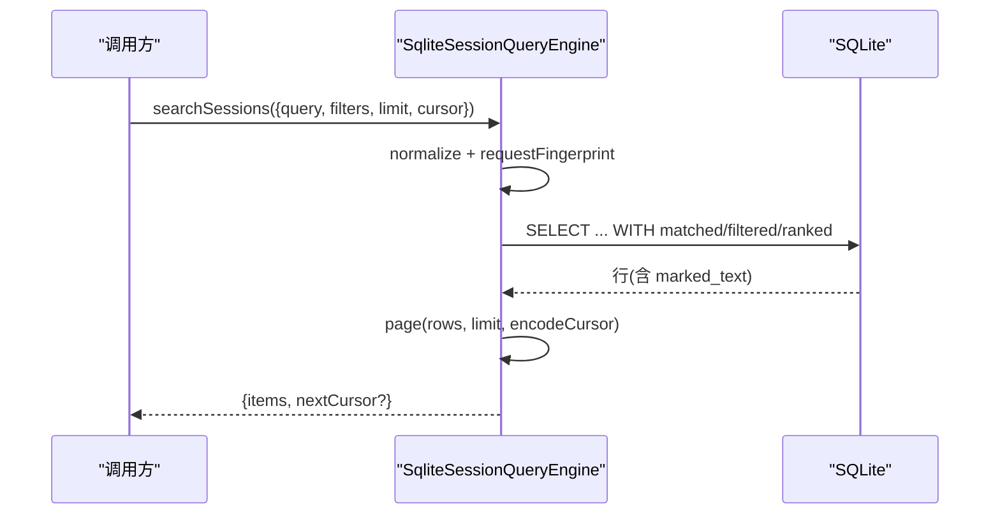
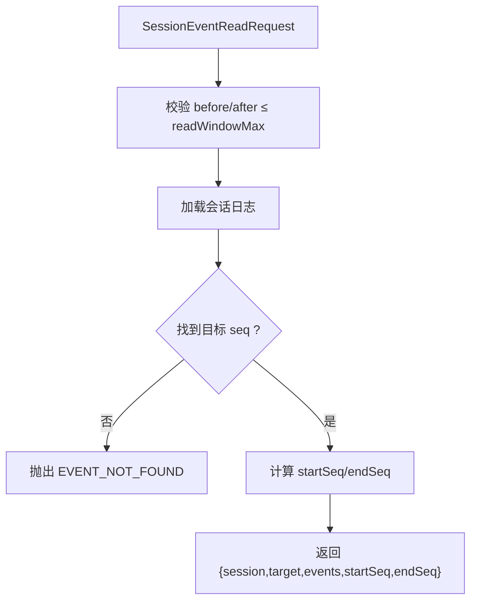
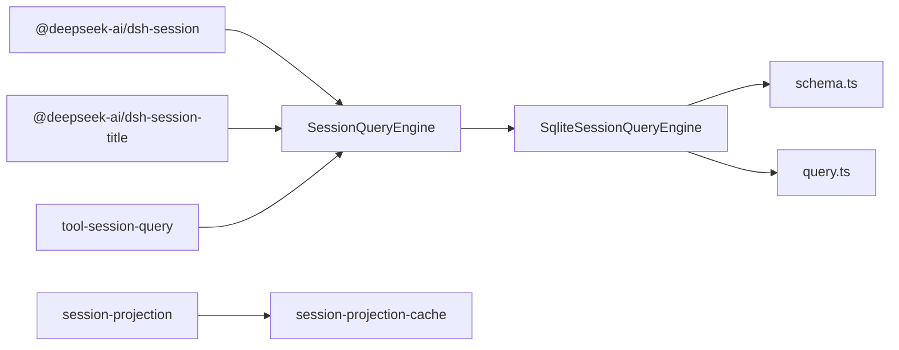
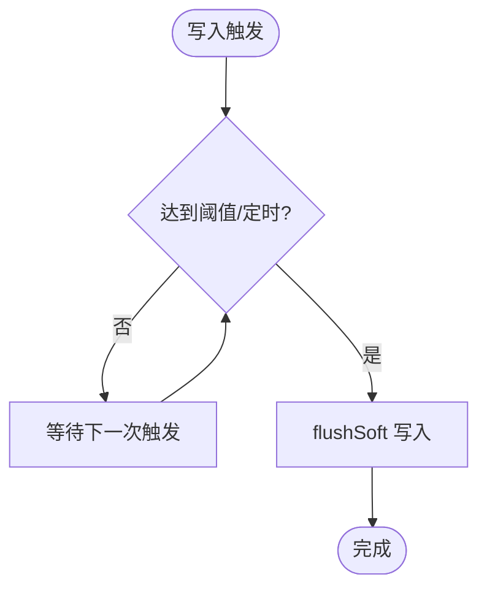

# 会话查询

<cite>
**本文引用的文件**
- [session-query.md](file://docs/subsystems/session-query.md)
- [session-projection.md](file://docs/subsystems/session-projection.md)
- [index.ts（SessionQueryEngine）](file://packages/session-query/session-query/src/index.ts)
- [types.ts（类型定义）](file://packages/session-query/session-query/src/types.ts)
- [filters.ts（过滤与文本匹配）](file://packages/session-query/session-query/src/filters.ts)
- [documents.ts（事件文档构建）](file://packages/session-query/session-query/src/documents.ts)
- [index.ts（SQLite 实现）](file://packages/session-query/session-query-sqlite/src/index.ts)
- [query.ts（SQL/游标/片段生成）](file://packages/session-query/session-query-sqlite/src/query.ts)
- [schema.ts（索引模式）](file://packages/session-query/session-query-sqlite/src/schema.ts)
- [index.ts（模型工具封装）](file://packages/session-query/tool-session-query/src/index.ts)
- [operations.ts（工具操作）](file://packages/session-query/tool-session-query/src/operations.ts)
- [presentation.ts（结果呈现）](file://packages/session-query/tool-session-query/src/presentation.ts)
- [input.ts（输入参数）](file://packages/session-query/tool-session-query/src/input.ts)
- [cache.spec.ts（投影缓存行为测试）](file://packages/session/session-projection-cache/tests/cache.spec.ts)
</cite>

## 目录
1. [简介](#简介)
2. [项目结构](#项目结构)
3. [核心组件](#核心组件)
4. [架构总览](#架构总览)
5. [详细组件分析](#详细组件分析)
6. [依赖关系分析](#依赖关系分析)
7. [性能与缓存](#性能与缓存)
8. [故障排查](#故障排查)
9. [结论](#结论)
10. [附录：查询示例与最佳实践](#附录：查询示例与最佳实践)

## 简介
本文件系统性地说明“会话查询”能力：将原始会话事件流投影为可查询的结构化数据，提供跨会话与单会话的全文检索、精确过滤、时间/序列范围筛选、用户ID等条件过滤，以及复杂查询的构建与执行流程。同时文档化查询结果的数据结构与格式化选项，并给出优化技巧与实战示例。

## 项目结构
- 抽象服务层：`SessionQueryEngine` 暴露统一接口，负责逻辑会话语料（live-preferred）的读取、过滤、追踪、标题折叠、表面快照等。
- SQLite 提供者：基于 FTS5 的全文检索实现，维护持久化与临时（live）两套文档索引，支持分页游标、高亮片段、排序与分组。
- 工具封装：面向模型的 `tool-session-query` 插件，注册搜索、追踪、读取等工具，限制并发与超时，输出可读文本。
- 投影系统：`session-projection` 将事件流归并为每会话的状态值，配合 `session-projection-cache` 做持久化缓存，加速冷读与回放。

图表来源
- [index.ts（SessionQueryEngine）:81-116](file://packages/session-query/session-query/src/index.ts#L81-L116)
- [index.ts（SQLite 实现）:196-313](file://packages/session-query/session-query-sqlite/src/index.ts#L196-L313)
- [index.ts（工具封装）:58-123](file://packages/session-query/tool-session-query/src/index.ts#L58-L123)
- [session-projection.md:91-257](file://docs/subsystems/session-projection.md#L91-L257)

章节来源
- [session-query.md:1-496](file://docs/subsystems/session-query.md#L1-L496)
- [session-projection.md:1-263](file://docs/subsystems/session-projection.md#L1-L263)

## 核心组件
- SessionQueryEngine：抽象服务，提供 list/filter/search/read/trace 等能力；内部通过 corpus 聚合 live 与 persisted 源，保证一致性观察。
- SqliteSessionQueryEngine：具体实现，维护 FTS5 索引、会话头元数据表、游标与分页、片段高亮、并发控制与关闭生命周期。
- 过滤器与文档：将事件转换为可搜索的语义文档，支持按 type/surface/time/seq/text 过滤，文本匹配安全编译正则。
- 工具封装：对外暴露 session_search、session_event_search、session_trace、session_event_trace、session_event_read 五个工具，带超时与上限。

章节来源
- [index.ts（SessionQueryEngine）:81-359](file://packages/session-query/session-query/src/index.ts#L81-L359)
- [index.ts（SQLite 实现）:196-761](file://packages/session-query/session-query-sqlite/src/index.ts#L196-L761)
- [filters.ts:1-244](file://packages/session-query/session-query/src/filters.ts#L1-L244)
- [documents.ts:1-75](file://packages/session-query/session-query/src/documents.ts#L1-L75)
- [index.ts（工具封装）:58-123](file://packages/session-query/tool-session-query/src/index.ts#L58-L123)

## 架构总览
下图展示一次跨会话全文检索的关键调用链：工具 → 抽象引擎 → SQLite 提供者 → 索引查询 → 返回命中与片段。

图表来源
- [index.ts（工具封装）:66-84](file://packages/session-query/tool-session-query/src/index.ts#L66-L84)
- [index.ts（SessionQueryEngine）:107-127](file://packages/session-query/session-query/src/index.ts#L107-L127)
- [index.ts（SQLite 实现）:256-282](file://packages/session-query/session-query-sqlite/src/index.ts#L256-L282)
- [query.ts（SQL/游标/片段）](file://packages/session-query/session-query-sqlite/src/query.ts)

## 详细组件分析

### 会话数据投影机制
- 事件到记录：通过 `buildSessionEventRecords` 将原始事件映射为轻量记录（sessionId、seq、type、time、surface）。
- 事件到文档：通过 `buildSessionEventSearchDocuments` 提取语义文本，跳过无文本的结构事件，供过滤与全文索引使用。
- 表面分类：利用 foldSurface 将事件归类为 current/shadowed/log-only，用于 surface 过滤与当前模型上下文视图。

图表来源
- [documents.ts:15-54](file://packages/session-query/session-query/src/documents.ts#L15-L54)
- [documents.ts:56-75](file://packages/session-query/session-query/src/documents.ts#L56-L75)

章节来源
- [documents.ts:1-75](file://packages/session-query/session-query/src/documents.ts#L1-L75)
- [session-query.md:9-141](file://docs/subsystems/session-query.md#L9-L141)

### 查询接口与过滤
- 会话级过滤：id、cwd、created-at 范围、parent、availability（live/persisted），数组内 OR，数组间 AND。
- 事件级过滤：seq/time 范围、type、surface、text（安全正则匹配）。
- 文本匹配：compileSessionTextFilter 将用户文本转义并拼接为 Unicode 大小写不敏感的正则，避免注入。

图表来源
- [filters.ts:18-38](file://packages/session-query/session-query/src/filters.ts#L18-L38)
- [filters.ts:45-98](file://packages/session-query/session-query/src/filters.ts#L45-L98)
- [filters.ts:105-118](file://packages/session-query/session-query/src/filters.ts#L105-L118)

章节来源
- [types.ts:179-219](file://packages/session-query/session-query/src/types.ts#L179-L219)
- [filters.ts:1-244](file://packages/session-query/session-query/src/filters.ts#L1-L244)

### 全文检索与分页
- 跨会话搜索：searchSessions 按最强匹配事件分组，返回每个会话的最佳命中。
- 单会话搜索：searchEvents 在指定会话内搜索，返回命中与目标会话头。
- 游标分页：cursor 绑定规范化请求、指纹、全局/本地 generation、offset，确保稳定翻页。
- 片段高亮：FTS highlight 生成 snippet，长度由配置控制。

图表来源
- [index.ts（SQLite 实现）:256-282](file://packages/session-query/session-query-sqlite/src/index.ts#L256-L282)
- [index.ts（SQLite 实现）:633-670](file://packages/session-query/session-query-sqlite/src/index.ts#L633-L670)
- [query.ts（游标/片段/SQL）](file://packages/session-query/session-query-sqlite/src/query.ts)

章节来源
- [session-query.md:143-219](file://docs/subsystems/session-query.md#L143-L219)
- [index.ts（SQLite 实现）:256-313](file://packages/session-query/session-query-sqlite/src/index.ts#L256-L313)

### 事件追踪与窗口读取
- 事件追踪：traceEvent 返回替换链、被替换事件、引用与被引用事件序列。
- 窗口读取：readEvent 返回目标事件及前后若干事件的上下文窗口，受 readWindowMax 限制。

图表来源
- [index.ts（SessionQueryEngine）:307-356](file://packages/session-query/session-query/src/index.ts#L307-L356)

章节来源
- [types.ts:126-150](file://packages/session-query/session-query/src/types.ts#L126-L150)
- [index.ts（SessionQueryEngine）:285-356](file://packages/session-query/session-query/src/index.ts#L285-L356)

### 模型工具封装
- 工具列表：session_search、session_event_search、session_trace、session_event_trace、session_event_read。
- 安全与限流：默认最大命中数、默认超时，输出为纯文本，便于模型消费。
- 工作区授权：工具仅访问授权范围内的会话与事件。

章节来源
- [index.ts（工具封装）:58-123](file://packages/session-query/tool-session-query/src/index.ts#L58-L123)
- [operations.ts](file://packages/session-query/tool-session-query/src/operations.ts)
- [presentation.ts](file://packages/session-query/tool-session-query/src/presentation.ts)
- [input.ts](file://packages/session-query/tool-session-query/src/input.ts)

## 依赖关系分析
- 抽象层依赖：@deepseek-ai/dsh-session（会话/事件）、@deepseek-ai/dsh-session-title（标题折叠）。
- 提供者依赖：SQLite 模块、Schema、SQL 构建器、游标与片段工具。
- 工具层依赖：tools/systemPrompt/sessionQuery，输出文本格式。
- 投影与缓存：session-projection 提供事件→状态投影，session-projection-cache 提供持久化缓存与冷读路径。

图表来源
- [index.ts（SessionQueryEngine）:7-47](file://packages/session-query/session-query/src/index.ts#L7-L47)
- [index.ts（SQLite 实现）:7-57](file://packages/session-query/session-query-sqlite/src/index.ts#L7-L57)
- [index.ts（工具封装）:7-14](file://packages/session-query/tool-session-query/src/index.ts#L7-L14)

章节来源
- [index.ts（SessionQueryEngine）:7-67](file://packages/session-query/session-query/src/index.ts#L7-L67)
- [index.ts（SQLite 实现）:7-57](file://packages/session-query/session-query-sqlite/src/index.ts#L7-L57)
- [index.ts（工具封装）:7-20](file://packages/session-query/tool-session-query/src/index.ts#L7-L20)

## 性能与缓存
- 全文检索性能
  - FTS5 索引：持久化与临时（live）双表，reconcile 阶段增量更新，减少重复扫描。
  - 分页与游标：基于规范化请求指纹与 generation 的稳定分页，避免全量排序开销。
  - 片段截取：snippetChars 控制高亮片段长度，降低传输与渲染成本。
- 过滤与文本匹配
  - 提前 materialize 并校验过滤器，避免异步边界污染。
  - 文本匹配使用安全正则，避免昂贵且危险的动态表达式。
- 投影缓存
  - 写路径：节流写入（计数/间隔触发）+ 强制点（turn/end、session 销毁时）。
  - 读路径：cachedSnapshot 零 I/O 直接读存储行；coldSnapshot 从缓存行 + 持久化 tail 恢复，再回写。
  - 自修复：写入失败软处理，下次写入或冷读自愈。

图表来源
- [cache.spec.ts:120-168](file://packages/session/session-projection-cache/tests/cache.spec.ts#L120-L168)
- [session-projection.md:107-147](file://docs/subsystems/session-projection.md#L107-L147)

章节来源
- [index.ts（SQLite 实现）:395-481](file://packages/session-query/session-query-sqlite/src/index.ts#L395-L481)
- [index.ts（SQLite 实现）:633-696](file://packages/session-query/session-query-sqlite/src/index.ts#L633-L696)
- [session-projection.md:107-147](file://docs/subsystems/session-projection.md#L107-L147)
- [cache.spec.ts:120-168](file://packages/session/session-projection-cache/tests/cache.spec.ts#L120-L168)

## 故障排查
- 常见错误码
  - SESSION_QUERY_ABORTED：操作被中止。
  - SESSION_QUERY_CORRUPT_SESSION：会话表面无效。
  - SESSION_QUERY_EVENT_NOT_FOUND：事件不存在。
  - SESSION_QUERY_INDEX_FAILED：索引打开/重合并失败。
  - SESSION_QUERY_INVALID_CONFIG/FILTER/CURSOR/LIMIT/QUERY/WINDOW/SURFACE：参数非法。
  - SESSION_QUERY_PERSISTENCE_FAILED：持久化观察失败。
  - SESSION_QUERY_SEARCH_DISABLED：全文搜索被禁用（openAt=never）。
  - SESSION_QUERY_SESSION_NOT_FOUND：会话未找到。
  - SESSION_QUERY_STALE_CURSOR：游标过期。
  - SESSION_QUERY_SOURCE_CONFLICT：源冲突。
  - SESSION_QUERY_INVALID_LINEAGE：谱系异常。
- 定位建议
  - 检查过滤器是否合法（类型、范围、枚举值）。
  - 确认 openAt 配置与是否启用全文搜索。
  - 关注 SQLite 打开与事务提交/回滚异常。
  - 对 readEvent 的 before/after 进行边界校验。

章节来源
- [session-query.md:333-357](file://docs/subsystems/session-query.md#L333-L357)
- [index.ts（SQLite 实现）:321-332](file://packages/session-query/session-query-sqlite/src/index.ts#L321-L332)
- [index.ts（SQLite 实现）:468-473](file://packages/session-query/session-query-sqlite/src/index.ts#L468-L473)
- [index.ts（SQLite 实现）:726-730](file://packages/session-query/session-query-sqlite/src/index.ts#L726-L730)

## 结论
会话查询系统以“抽象服务 + SQLite 提供者”的分层设计，实现了高性能、可扩展的全文检索与精确过滤；结合投影与缓存机制，兼顾热路径与冷路径的性能与可靠性。通过统一的类型与错误体系，保障跨部署的可移植性与可观测性。

## 附录：查询示例与最佳实践

- 按时间范围与消息类型过滤事件
  - 使用 filterEvents，传入 time 范围与 type 列表，获取结构化文档并按 seq 升序返回。
  - 参考：[filters.ts:32-38](file://packages/session-query/session-query/src/filters.ts#L32-L38)、[types.ts:205-210](file://packages/session-query/session-query/src/types.ts#L205-L210)

- 按用户ID过滤会话
  - 若用户ID作为会话头字段存在，可通过 id/cwd/parent/availability 组合过滤；否则建议在业务层先筛选会话集合再查事件。
  - 参考：[types.ts:194-199](file://packages/session-query/session-query/src/types.ts#L194-L199)

- 跨会话全文检索
  - 使用 searchSessions，传入 query、可选 sessionFilters 与 eventFilters，按最强匹配事件分组返回。
  - 参考：[index.ts（SessionQueryEngine）:107-127](file://packages/session-query/session-query/src/index.ts#L107-L127)、[index.ts（SQLite 实现）:256-282](file://packages/session-query/session-query-sqlite/src/index.ts#L256-L282)

- 单会话内检索历史消息
  - 使用 searchEvents，限定 sessionId，结合 type/surface/time/seq 过滤，返回命中与 snippet。
  - 参考：[index.ts（SQLite 实现）:284-313](file://packages/session-query/session-query-sqlite/src/index.ts#L284-L313)

- 读取事件上下文窗口
  - 使用 readEvent，指定 before/after，获取目标事件及其前后若干事件。
  - 参考：[index.ts（SessionQueryEngine）:307-356](file://packages/session-query/session-query/src/index.ts#L307-L356)

- 查询结果数据结构与格式化
  - 会话命中：SessionSearchHit（header、live、persisted、bestMatch）。
  - 事件命中：SessionEventSearchHit（sessionId、seq、type、time、surface、snippet）。
  - 事件记录：SessionEventRecord（轻量元信息）。
  - 参考：[types.ts:221-279](file://packages/session-query/session-query/src/types.ts#L221-L279)

- 复杂查询构建与执行
  - 将多条件拆分为多个 SessionResultFilter/SessionEventResultFilter，数组内 OR、数组间 AND；文本匹配使用 compileSessionTextFilter 确保安全。
  - 参考：[filters.ts:18-38](file://packages/session-query/session-query/src/filters.ts#L18-L38)、[filters.ts:105-118](file://packages/session-query/session-query/src/filters.ts#L105-L118)

- 查询优化技巧
  - 优先使用 metadata 过滤（type/surface/time/seq）缩小候选集，再进行文本匹配。
  - 合理设置 limit 与 snippetChars，控制响应体积。
  - 使用游标分页，避免大偏移量带来的性能退化。
  - 开启投影缓存，提升冷读与回放速度。
  - 参考：[index.ts（SQLite 实现）:633-696](file://packages/session-query/session-query-sqlite/src/index.ts#L633-L696)、[session-projection.md:107-147](file://docs/subsystems/session-projection.md#L107-L147)

- 实际示例（工具侧）
  - 使用 tool-session-query 提供的 session_search / session_event_search / session_event_read 等工具，获得模型友好的文本输出与超时保护。
  - 参考：[index.ts（工具封装）:66-123](file://packages/session-query/tool-session-query/src/index.ts#L66-L123)