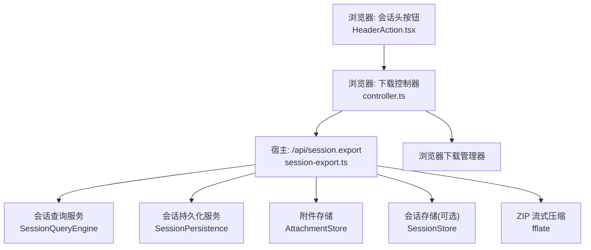
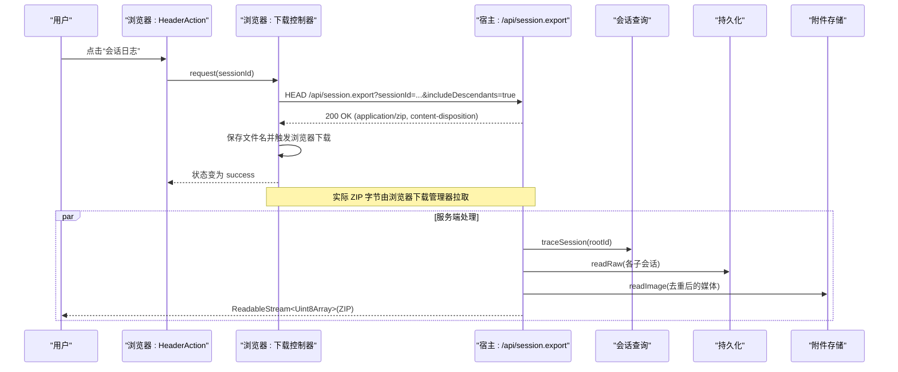
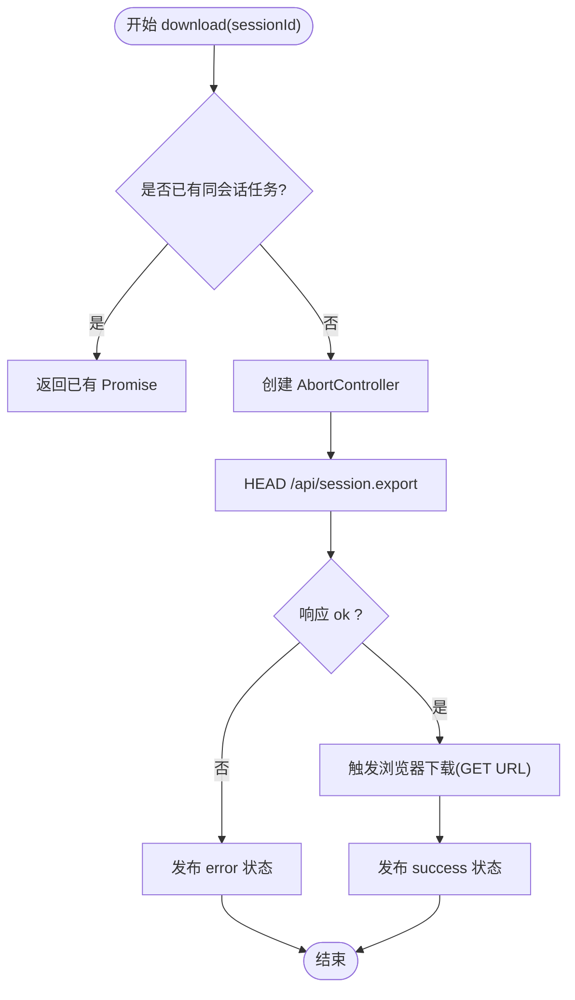
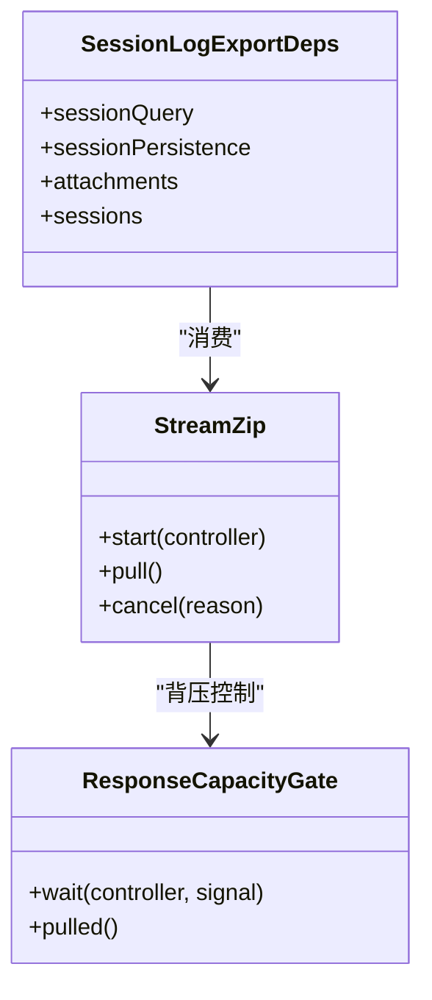
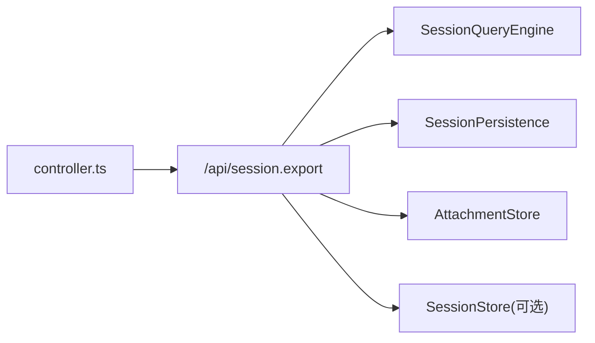

# 导出功能

<cite>
**本文引用的文件**
- [packages/session-query/session-log-export/src/client/controller.ts](file://packages/session-query/session-log-export/src/client/controller.ts)
- [packages/session-query/session-log-export/src/client/HeaderAction.tsx](file://packages/session-query/session-log-export/src/client/HeaderAction.tsx)
- [packages/session-query/session-log-export/src/client/Dialog.tsx](file://packages/session-query/session-log-export/src/client/Dialog.tsx)
- [packages/session-query/session-log-export/README.md](file://packages/session-query/session-log-export/README.md)
- [packages/host/apiproxy/src/session-export.ts](file://packages/host/apiproxy/src/session-export.ts)
- [packages/host/apiproxy/tests/session-export.spec.ts](file://packages/host/apiproxy/tests/session-export.spec.ts)
- [packages/jobs/jobs/src/index.ts](file://packages/jobs/jobs/src/index.ts)
- [packages/jobs/jobs-local/src/index.ts](file://packages/jobs/jobs-local/src/index.ts)
- [packages/util/output-retention/src/index.ts](file://packages/util/output-retention/src/index.ts)
</cite>

## 目录
1. [简介](#简介)
2. [项目结构](#项目结构)
3. [核心组件](#核心组件)
4. [架构总览](#架构总览)
5. [详细组件分析](#详细组件分析)
6. [依赖关系分析](#依赖关系分析)
7. [性能与内存管理](#性能与内存管理)
8. [故障排查指南](#故障排查指南)
9. [结论](#结论)
10. [附录：配置与批量处理](#附录配置与批量处理)

## 简介
本文件系统化说明会话日志导出功能的整体设计、前后端交互、UI 组件、文件格式与数据类型、异步处理与进度展示、过滤与格式化选项、配置与批量方法，以及性能优化与内存管理策略。该功能由浏览器端的下载控制器与对话框、宿主侧的流式 ZIP 导出服务共同实现，支持将当前会话及其子代理（可选）的 JSONL 日志与引用媒体对象打包为 ZIP 并下载到本地。

## 项目结构
- 浏览器端
  - 下载控制器：维护每个会话的下载状态、并发控制、取消与错误传播。
  - 头部按钮与对话框：提供“会话日志”入口与共享模态框，显示准备中、成功、失败等状态。
- 宿主侧
  - 导出服务：按会话树生成 ZIP 流，包含根日志、子代理日志（可选）、去重后的媒体对象；使用分块压缩与背压控制，避免大内存占用。
- 文档与契约
  - 包级 README 描述命令契约、组合方式与模型体验影响。

图表来源
- [packages/session-query/session-log-export/src/client/HeaderAction.tsx:1-32](file://packages/session-query/session-log-export/src/client/HeaderAction.tsx#L1-L32)
- [packages/session-query/session-log-export/src/client/controller.ts:56-137](file://packages/session-query/session-log-export/src/client/controller.ts#L56-L137)
- [packages/host/apiproxy/src/session-export.ts:1-458](file://packages/host/apiproxy/src/session-export.ts#L1-L458)

章节来源
- [packages/session-query/session-log-export/README.md:1-50](file://packages/session-query/session-log-export/README.md#L1-L50)

## 核心组件
- 浏览器下载控制器
  - 负责发起 HEAD 预检、构建下载 URL、调用浏览器下载、更新共享状态（打开/关闭、状态、错误）。
  - 同一会话的多次点击会合并到一次进行中任务，避免重复请求。
- 头部按钮与对话框
  - 按钮禁用态基于“正在下载”，对话框根据控制器状态渲染标题、描述与关闭操作。
- 宿主导出服务
  - 读取根会话原始工件，遍历子代理（可选），收集所有被引用的媒体对象，按顺序产出 ZIP 条目。
  - 通过流式压缩与响应容量门控，限制内存峰值并支持取消。

章节来源
- [packages/session-query/session-log-export/src/client/controller.ts:56-137](file://packages/session-query/session-log-export/src/client/controller.ts#L56-L137)
- [packages/session-query/session-log-export/src/client/HeaderAction.tsx:1-32](file://packages/session-query/session-log-export/src/client/HeaderAction.tsx#L1-L32)
- [packages/session-query/session-log-export/src/client/Dialog.tsx:1-50](file://packages/session-query/session-log-export/src/client/Dialog.tsx#L1-L50)
- [packages/host/apiproxy/src/session-export.ts:219-458](file://packages/host/apiproxy/src/session-export.ts#L219-L458)

## 架构总览
导出流程采用“预检 + 直连下载”的模式：
- 浏览器先发送 HEAD 请求以验证可导出性（内容类型、内容处置头、参数校验）。
- 成功后立即将 GET 链接交给浏览器下载管理器，不缓冲 ZIP 数据。
- 服务端在收到请求后，按需刷新活跃会话、读取原始工件、枚举子代理与媒体对象，并以流式方式压缩输出。

图表来源
- [packages/session-query/session-log-export/src/client/controller.ts:111-137](file://packages/session-query/session-log-export/src/client/controller.ts#L111-L137)
- [packages/host/apiproxy/src/session-export.ts:219-458](file://packages/host/apiproxy/src/session-export.ts#L219-L458)

## 详细组件分析

### 浏览器下载控制器
- 职责
  - 维护 per-session 的下载状态（open/status/error）。
  - 并发控制：同一 sessionId 仅允许一个进行中任务。
  - 预检：HEAD 请求确认可导出。
  - 下载：构造 GET URL 与安全的文件名，交由浏览器下载。
  - 错误处理：非 2xx 时解析错误详情并上报。
- 关键行为
  - 关闭对话框不取消已开始的浏览器下载。
  - dispose 时中止所有进行中的预检与下载。

图表来源
- [packages/session-query/session-log-export/src/client/controller.ts:73-137](file://packages/session-query/session-log-export/src/client/controller.ts#L73-L137)

章节来源
- [packages/session-query/session-log-export/src/client/controller.ts:1-137](file://packages/session-query/session-log-export/src/client/controller.ts#L1-L137)

### 头部按钮与对话框
- 按钮
  - 当状态为“downloading”时禁用，避免重复触发。
  - 点击调用控制器 request(sessionId)。
- 对话框
  - 根据 bySession[sessionId] 的状态渲染标题与描述。
  - 关闭仅隐藏对话框，不影响已开始的下载。

章节来源
- [packages/session-query/session-log-export/src/client/HeaderAction.tsx:1-32](file://packages/session-query/session-log-export/src/client/HeaderAction.tsx#L1-L32)
- [packages/session-query/session-log-export/src/client/Dialog.tsx:1-50](file://packages/session-query/session-log-export/src/client/Dialog.tsx#L1-L50)

### 宿主导出服务（ZIP 流式生成）
- 输入
  - 根会话原始工件（JSONL）。
  - includeDescendants：是否包含子代理日志。
  - compressionLevel：DEFLATE 压缩级别。
  - signal：取消信号（请求取消或消费者取消）。
- 输出
  - ReadableStream<Uint8Array>，内容为 ZIP 压缩包。
- 条目组织
  - 根工件：以其原始文件名置于归档根。
  - 子代理：subagents/<安全化的会话ID>/<原始文件名>。
  - 媒体对象：media/<attachmentId>.<ext>，按 attachmentId 去重。
- 背压与内存
  - 文本与二进制均按固定大小分块推入压缩器。
  - 响应队列达到高水位时暂停生产，直到消费者拉取释放空间。
  - 文本分块避免拆分代理对，防止编码损坏。
- 取消
  - 任何阶段检测到 abort 即终止压缩并错误流。

图表来源
- [packages/host/apiproxy/src/session-export.ts:35-49](file://packages/host/apiproxy/src/session-export.ts#L35-L49)
- [packages/host/apiproxy/src/session-export.ts:278-308](file://packages/host/apiproxy/src/session-export.ts#L278-L308)
- [packages/host/apiproxy/src/session-export.ts:388-458](file://packages/host/apiproxy/src/session-export.ts#L388-L458)

章节来源
- [packages/host/apiproxy/src/session-export.ts:1-458](file://packages/host/apiproxy/src/session-export.ts#L1-L458)

## 依赖关系分析
- 浏览器端
  - 控制器依赖宿主 API 路径与浏览器下载能力。
  - 对话框依赖注入的会话 ID、状态订阅与回调。
- 宿主端
  - 导出服务依赖会话查询、持久化、附件存储与可选的会话存储。
  - 通过 fflate 进行流式压缩，并通过 ReadableStream 的高水位与 size 函数控制内存。
- 外部服务
  - 若未挂载必要服务，接口返回 500；缺少 sessionId 或 includeDescendants 非法则返回 400。

图表来源
- [packages/session-query/session-log-export/src/client/controller.ts:111-137](file://packages/session-query/session-log-export/src/client/controller.ts#L111-L137)
- [packages/host/apiproxy/src/session-export.ts:51-63](file://packages/host/apiproxy/src/session-export.ts#L51-L63)

章节来源
- [packages/host/apiproxy/tests/session-export.spec.ts:156-323](file://packages/host/apiproxy/tests/session-export.spec.ts#L156-L323)

## 性能与内存管理
- 流式压缩与分块写入
  - 文本与二进制分别按固定大小分块推入压缩器，避免一次性加载大对象。
  - 文本分块边界避开代理对，确保 UTF-8 编码正确。
- 背压控制
  - 响应队列达到高水位（默认 64 KiB）时暂停生产，直到消费者拉取。
  - 通过 capacity.wait/pulled 协调生产者与消费者速率。
- 取消与清理
  - 请求取消或消费者取消会终止压缩并释放资源。
  - 对话关闭不中断浏览器下载，但控制器 dispose 会中止预检与后续逻辑。
- 输出保留策略参考
  - 通用输出保留工具提供 head/tail/headTail 策略，便于在其他场景限制内存与 I/O。

章节来源
- [packages/host/apiproxy/src/session-export.ts:268-458](file://packages/host/apiproxy/src/session-export.ts#L268-L458)
- [packages/util/output-retention/src/index.ts:70-201](file://packages/util/output-retention/src/index.ts#L70-L201)

## 故障排查指南
- 常见错误码
  - 400：缺少 sessionId 或 includeDescendants 值非法。
  - 500：未挂载 session-query 或 session-persistence 等服务。
- 诊断要点
  - 检查请求参数是否正确。
  - 确认宿主已挂载所需服务。
  - 关注浏览器控制台的网络面板，查看 HEAD 与 GET 响应头与状态。
- 相关测试用例
  - 覆盖 400/500 分支与 ZIP 内容断言。

章节来源
- [packages/host/apiproxy/tests/session-export.spec.ts:156-323](file://packages/host/apiproxy/tests/session-export.spec.ts#L156-L323)

## 结论
会话日志导出功能通过“预检 + 直连下载”的简洁模式，结合宿主侧流式压缩与背压控制，实现了在大体积日志下的稳定导出。浏览器端提供清晰的交互与状态反馈，宿主端保证数据完整性与资源可控。对于大规模导出场景，建议合理设置压缩级别、监控网络吞吐，并结合业务需求决定是否包含子代理与媒体对象。

## 附录：配置与批量处理

### 导出的文件格式与数据类型
- 归档格式：ZIP（application/zip）。
- 根工件：JSONL 文本，保持原样。
- 子代理工件：JSONL 文本，路径为 subagents/<安全化会话ID>/<原始文件名>。
- 媒体对象：PNG/JPEG/WebP/GIF，路径为 media/<attachmentId>.<ext>，按 attachmentId 去重。
- 文件名：dsh-session-<安全化会话ID>.zip。

章节来源
- [packages/host/apiproxy/src/session-export.ts:87-109](file://packages/host/apiproxy/src/session-export.ts#L87-L109)
- [packages/host/apiproxy/src/session-export.ts:194-201](file://packages/host/apiproxy/src/session-export.ts#L194-L201)

### 过滤与格式化选项
- includeDescendants：布尔参数，决定是否包含子代理日志。
- 过滤器语义参考：会话结果过滤器的类型与校验模式可用于其他查询场景。

章节来源
- [packages/session-query/session-query/src/filters.ts:40-68](file://packages/session-query/session-query/src/filters.ts#L40-L68)

### 异步处理机制与进度跟踪
- 前端进度
  - 状态机：downloading → success | error。
  - 并发控制：同一会话仅一个进行中任务。
  - 取消：dispose 中止预检与后续逻辑；关闭对话框不中断下载。
- 后端异步
  - 使用 AsyncGenerator 与 ReadableStream 驱动流水线。
  - 背压：ResponseCapacityGate 协调生产与消费。
  - 取消：AbortSignal 贯穿查询、持久化与附件读取。

章节来源
- [packages/session-query/session-log-export/src/client/controller.ts:56-137](file://packages/session-query/session-log-export/src/client/controller.ts#L56-L137)
- [packages/host/apiproxy/src/session-export.ts:219-458](file://packages/host/apiproxy/src/session-export.ts#L219-L458)

### 后台作业与生命周期（参考）
- 作业注册与结算语义：首终记录、等待者释放、监听通知顺序等，适用于需要长期运行的任务编排。
- 本地作业实现：提供 owner 清理、取消与终结记录。

章节来源
- [packages/jobs/jobs/src/index.ts:35-56](file://packages/jobs/jobs/src/index.ts#L35-L56)
- [packages/jobs/jobs-local/src/index.ts:408-475](file://packages/jobs/jobs-local/src/index.ts#L408-L475)

### 集成示例与使用场景
- Web 组合
  - 在 Web 包中加载会话日志导出插件，与命令、会话 UI 组合。
- 典型场景
  - 用户在会话头点击“会话日志”，触发导出。
  - 通过斜杠命令 /export 触发相同流程。
  - 导出用于离线分析、审计、问题复现与知识沉淀。

章节来源
- [packages/session-query/session-log-export/README.md:7-27](file://packages/session-query/session-log-export/README.md#L7-L27)