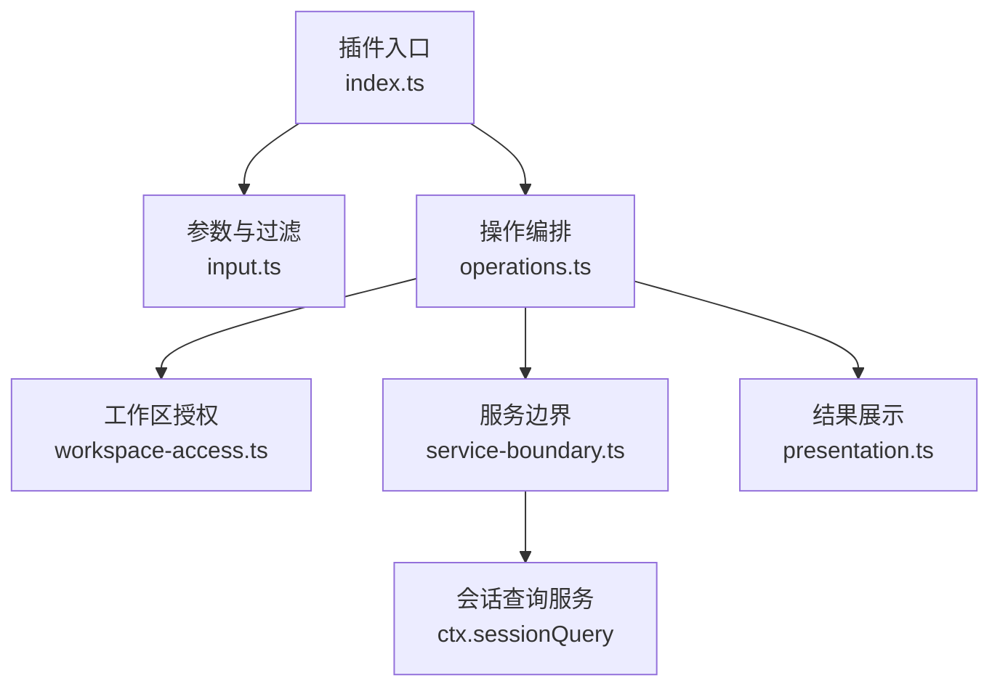
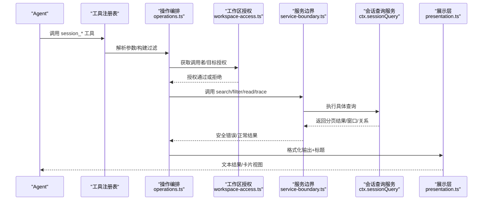
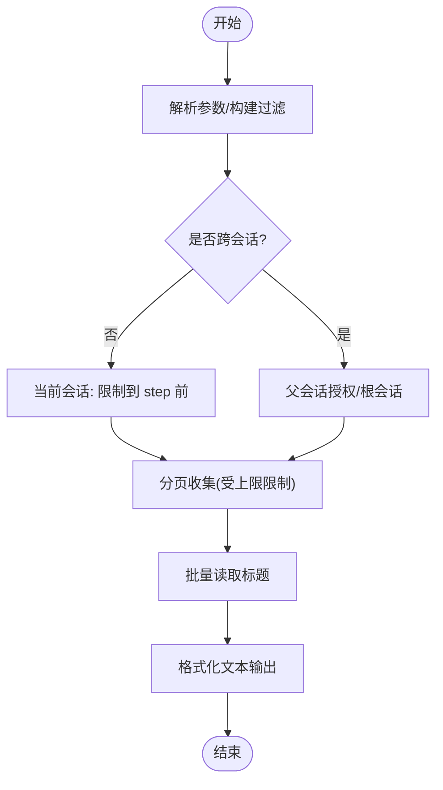
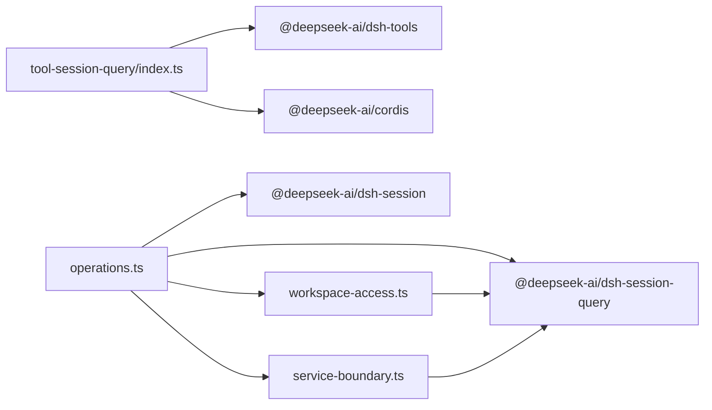

# 工具集成

<cite>
**本文引用的文件**
- [packages/session-query/tool-session-query/src/index.ts](file://packages/session-query/tool-session-query/src/index.ts)
- [packages/session-query/tool-session-query/src/operations.ts](file://packages/session-query/tool-session-query/src/operations.ts)
- [packages/session-query/tool-session-query/src/input.ts](file://packages/session-query/tool-session-query/src/input.ts)
- [packages/session-query/tool-session-query/src/presentation.ts](file://packages/session-query/tool-session-query/src/presentation.ts)
- [packages/session-query/tool-session-query/src/workspace-access.ts](file://packages/session-query/tool-session-query/src/workspace-access.ts)
- [packages/session-query/tool-session-query/src/service-boundary.ts](file://packages/session-query/tool-session-query/src/service-boundary.ts)
- [examples/acp-agent/session-query.cordis.yml](file://examples/acp-agent/session-query.cordis.yml)
- [docs/subsystems/tools.md](file://docs/subsystems/tools.md)
- [docs/subsystems/tools.zh.md](file://docs/subsystems/tools.zh.md)
- [docs/subsystems/session-query.md](file://docs/subsystems/session-query.md)
</cite>

## 目录
1. [简介](#简介)
2. [项目结构](#项目结构)
3. [核心组件](#核心组件)
4. [架构总览](#架构总览)
5. [详细组件分析](#详细组件分析)
6. [依赖关系分析](#依赖关系分析)
7. [性能与限制](#性能与限制)
8. [故障排查指南](#故障排查指南)
9. [结论](#结论)
10. [附录：注册与配置、使用示例](#附录注册与配置使用示例)

## 简介
本文件面向希望在 Agent 工具系统中集成“会话查询”能力的开发者，系统性说明如何注册、配置、调用并展示会话查询工具。内容覆盖：
- 工具参数定义与输入校验
- 执行流程（从工具入口到服务层）
- 结果格式化与 UI 呈现
- 权限控制与工作区访问限制
- 工具注册与部署配置
- 错误处理与异常恢复机制
- 在 Agent 工作流中的实际调用方式

## 项目结构
会话查询工具位于 packages/session-query/tool-session-query，围绕以下职责划分：
- index.ts：插件入口，注册五个模型可见工具，注入系统提示，声明配置项与默认值
- input.ts：模型参数 schema 定义、规范化与过滤条件构建
- operations.ts：五大操作的编排与分页收集、授权与标题读取
- presentation.ts：文本输出与通用调用卡片展示
- workspace-access.ts：调用者身份、工作区授权、可见祖先/后代投影与标题读取
- service-boundary.ts：服务边界封装与安全错误翻译

图表来源
- [packages/session-query/tool-session-query/src/index.ts:58-123](file://packages/session-query/tool-session-query/src/index.ts#L58-L123)
- [packages/session-query/tool-session-query/src/operations.ts:54-237](file://packages/session-query/tool-session-query/src/operations.ts#L54-L237)
- [packages/session-query/tool-session-query/src/workspace-access.ts:54-162](file://packages/session-query/tool-session-query/src/workspace-access.ts#L54-L162)
- [packages/session-query/tool-session-query/src/service-boundary.ts:99-141](file://packages/session-query/tool-session-query/src/service-boundary.ts#L99-L141)

章节来源
- [packages/session-query/tool-session-query/src/index.ts:1-138](file://packages/session-query/tool-session-query/src/index.ts#L1-L138)
- [docs/subsystems/tools.zh.md:1-200](file://docs/subsystems/tools.zh.md#L1-L200)

## 核心组件
- 工具注册与系统提示：插件通过 defineTool 注册 session_search、session_event_search、session_trace、session_event_trace、session_event_read 五个工具，并在系统提示中给出引导文案，帮助模型选择合适工具。
- 参数与过滤：统一用 JSON Schema 描述参数；提供 query、时间/序列范围、事件类型/表面、父会话等过滤构建器，并进行严格校验。
- 操作编排：每个操作先解析参数、构建过滤条件、进行工作区授权、调用 ctx.sessionQuery 服务、收集分页结果、读取标题并格式化输出。
- 权限控制：基于调用者会话的 cwd 进行工作区隔离；跨会话访问需显式授权；当前会话搜索会排除执行步骤本身。
- 结果展示：统一以纯文本返回，并提供通用的“待执行/已完成”卡片视图，便于宿主 UI 渲染。
- 服务边界：将底层 SessionQueryError 映射为模型安全的错误码与消息，并对未授权场景统一为工具级未授权错误。

章节来源
- [packages/session-query/tool-session-query/src/index.ts:58-123](file://packages/session-query/tool-session-query/src/index.ts#L58-L123)
- [packages/session-query/tool-session-query/src/input.ts:45-141](file://packages/session-query/tool-session-query/src/input.ts#L45-L141)
- [packages/session-query/tool-session-query/src/operations.ts:54-237](file://packages/session-query/tool-session-query/src/operations.ts#L54-L237)
- [packages/session-query/tool-session-query/src/workspace-access.ts:54-162](file://packages/session-query/tool-session-query/src/workspace-access.ts#L54-L162)
- [packages/session-query/tool-session-query/src/service-boundary.ts:21-90](file://packages/session-query/tool-session-query/src/service-boundary.ts#L21-L90)

## 架构总览
下图展示了从工具调用到会话查询服务的完整链路，包括参数校验、权限检查、分页检索、标题读取与结果格式化。

图表来源
- [packages/session-query/tool-session-query/src/operations.ts:54-237](file://packages/session-query/tool-session-query/src/operations.ts#L54-L237)
- [packages/session-query/tool-session-query/src/workspace-access.ts:73-162](file://packages/session-query/tool-session-query/src/workspace-access.ts#L73-L162)
- [packages/session-query/tool-session-query/src/service-boundary.ts:99-141](file://packages/session-query/tool-session-query/src/service-boundary.ts#L99-L141)
- [docs/subsystems/session-query.md:367-490](file://docs/subsystems/session-query.md#L367-L490)

## 详细组件分析

### 工具注册与系统提示
- 插件导出名称与注入能力：name、inject（tools、systemPrompt、sessionQuery）。
- 配置项：maxSearchResults（单次最大命中数）、searchTimeoutMs（全文搜索超时），带默认值与校验。
- 系统提示：插入一段引导文案，指导模型优先使用 session_search 与 session_event_search，必要时再使用 trace/read。
- 工具清单：
  - session_search：跨会话全文检索，按最强匹配事件分组
  - session_event_search：单会话内事件全文检索
  - session_trace：会话血缘（祖先/后代）
  - session_event_trace：事件替换链与引用关系
  - session_event_read：精确事件及上下文窗口

章节来源
- [packages/session-query/tool-session-query/src/index.ts:16-64](file://packages/session-query/tool-session-query/src/index.ts#L16-L64)
- [packages/session-query/tool-session-query/src/index.ts:66-123](file://packages/session-query/tool-session-query/src/index.ts#L66-L123)

### 参数定义与输入验证
- 参数 schema：
  - session_search：query、session_ids、created_at_from/to、parent_session_ids、include_root_sessions、availability、event_seq_from/to、event_time_from/to、event_types、event_surfaces
  - session_event_search：session_id（可选，缺省为当前会话）、query、seq_from/to、time_from/to、event_types、surfaces
  - session_trace / session_event_trace / session_event_read：target session + seq（部分）
- 校验与规范化：
  - 查询字符串去空白、禁止 NUL
  - 时间戳仅接受 ISO 8601（含时区偏移），并计算上下界
  - 序列范围 from <= to，非负安全整数
  - 数组参数非空校验
- 过滤构建：
  - 会话级过滤：id、created-at、availability、cwd（由工作区注入）
  - 事件级过滤：seq、time、type、surface、text（语义文本扫描）

章节来源
- [packages/session-query/tool-session-query/src/input.ts:20-86](file://packages/session-query/tool-session-query/src/input.ts#L20-L86)
- [packages/session-query/tool-session-query/src/input.ts:88-141](file://packages/session-query/tool-session-query/src/input.ts#L88-L141)
- [packages/session-query/tool-session-query/src/input.ts:143-294](file://packages/session-query/tool-session-query/src/input.ts#L143-L294)
- [docs/subsystems/session-query.md:103-141](file://docs/subsystems/session-query.md#L103-L141)

### 执行流程与分页收集
- 跨会话搜索：
  - 校验调用者具备工作区 cwd
  - 构建会话/事件过滤，支持父会话白名单与根会话
  - 分页收集结果，应用 maxSearchResults 上限，记录是否被截断
  - 对命中结果的父会话进行二次授权，批量读取标题后格式化
- 单会话搜索：
  - 若 target 为当前会话，自动将搜索上界限制到当前 step 之前
  - 构建事件过滤，分页收集并校验观察到的目标头仍属当前工作区
- 血缘/关系/读取：
  - 均先授权目标，再调用服务，最后读取标题并格式化

图表来源
- [packages/session-query/tool-session-query/src/operations.ts:54-166](file://packages/session-query/tool-session-query/src/operations.ts#L54-L166)
- [packages/session-query/tool-session-query/src/operations.ts:239-272](file://packages/session-query/tool-session-query/src/operations.ts#L239-L272)

章节来源
- [packages/session-query/tool-session-query/src/operations.ts:54-237](file://packages/session-query/tool-session-query/src/operations.ts#L54-L237)

### 权限控制与工作区访问
- 调用者身份：从 ToolRunContext 提取 agent 与会话信息
- 目标授权：
  - 同会话直接允许
  - 跨会话通过 filterSessions({kind:'id', values:[...]}, {kind:'cwd', values:[caller.cwd]}) 校验归属
- 可见性投影：
  - 祖先链遇到越界即截断显示“[outside workspace boundary]”
  - 后代树递归授权，不可见节点以 null 占位
- 标题读取：
  - 批量 readTitleSnapshots，失败项标记 unavailableCode，避免泄露内部错误

章节来源
- [packages/session-query/tool-session-query/src/workspace-access.ts:54-162](file://packages/session-query/tool-session-query/src/workspace-access.ts#L54-L162)

### 结果格式化和展示
- 文本输出：
  - 会话搜索：列出命中会话、创建时间、父会话、可用性、最佳匹配事件与片段，提示是否达到上限
  - 事件搜索：列出命中事件、时间、片段
  - 血缘：祖先/后代树形展示，标注越界
  - 事件关系：目标事件、替换链、源/派生事件列表
  - 事件读取：目标事件 JSON + 前后邻居摘要
- UI 卡片：
  - presentCall 返回通用卡片（搜索/读取意图），包含标题与原始输入，便于宿主渲染

章节来源
- [packages/session-query/tool-session-query/src/presentation.ts:48-241](file://packages/session-query/tool-session-query/src/presentation.ts#L48-L241)

### 错误处理与异常恢复
- 服务边界：
  - 捕获 SessionQueryError，映射为模型安全错误码与消息
  - 未授权场景统一为 SESSION_QUERY_TOOL_UNAUTHORIZED
  - 未知错误降级为通用失败码
- 常见错误码：
  - 取消、索引失败、无效配置/游标/过滤/限制/查询/血缘/表面/窗口、持久化失败、搜索禁用、会话不存在、游标过期、源冲突等
- 恢复建议：
  - 游标过期：重试完整搜索
  - 索引/持久化失败：稍后重试或降级为过滤扫描
  - 未授权：缩小范围至当前工作区或申请授权

章节来源
- [packages/session-query/tool-session-query/src/service-boundary.ts:21-90](file://packages/session-query/tool-session-query/src/service-boundary.ts#L21-L90)
- [packages/session-query/tool-session-query/src/service-boundary.ts:99-141](file://packages/session-query/tool-session-query/src/service-boundary.ts#L99-L141)
- [docs/subsystems/session-query.md:333-357](file://docs/subsystems/session-query.md#L333-L357)

## 依赖关系分析
- 插件依赖：
  - @deepseek-ai/dsh-tools：defineTool、工具注册与执行流水线
  - @deepseek-ai/cordis：Context、系统提示注入
  - @deepseek-ai/dsh-session-query：会话查询服务接口与错误类型
  - @deepseek-ai/dsh-session：会话 ID、事件类型等基础类型
  - @deepseek-ai/schemastery：参数 schema 校验
  - @deepseek-ai/dsh-timeout：超时上限常量
- 运行时依赖：
  - ctx.tools：工具注册、执行、守卫、限制
  - ctx.sessionQuery：会话查询服务（跨会话/单会话搜索、过滤、血缘、事件窗口等）

图表来源
- [packages/session-query/tool-session-query/src/index.ts:7-14](file://packages/session-query/tool-session-query/src/index.ts#L7-L14)
- [packages/session-query/tool-session-query/src/operations.ts:7-21](file://packages/session-query/tool-session-query/src/operations.ts#L7-L21)
- [packages/session-query/tool-session-query/src/workspace-access.ts:7-20](file://packages/session-query/tool-session-query/src/workspace-access.ts#L7-L20)
- [packages/session-query/tool-session-query/src/service-boundary.ts:7-12](file://packages/session-query/tool-session-query/src/service-boundary.ts#L7-L12)

章节来源
- [packages/session-query/tool-session-query/src/index.ts:7-14](file://packages/session-query/tool-session-query/src/index.ts#L7-L14)
- [packages/session-query/tool-session-query/src/operations.ts:7-21](file://packages/session-query/tool-session-query/src/operations.ts#L7-L21)

## 性能与限制
- 分页与上限：
  - collectPages 循环拉取下一页，直到达到 maxSearchResults 或无更多数据
  - capped 标志用于提示前端“结果已截断”，建议收紧查询或增加过滤
- 超时控制：
  - 工具声明 timeoutMs，配合工具调用超时策略包装，确保可协作中止
- 并发安全：
  - 血缘/关系/读取类工具声明 isConcurrencySafe，可与兄弟调用并行
- 资源保护：
  - 当前会话搜索自动限制到当前 step 之前，避免读到自身写入
  - 标题批量读取减少多次往返

章节来源
- [packages/session-query/tool-session-query/src/index.ts:22-40](file://packages/session-query/tool-session-query/src/index.ts#L22-L40)
- [packages/session-query/tool-session-query/src/operations.ts:239-272](file://packages/session-query/tool-session-query/src/operations.ts#L239-L272)
- [docs/subsystems/tools.zh.md:170-200](file://docs/subsystems/tools.zh.md#L170-L200)

## 故障排查指南
- 未找到会话/事件：
  - 确认目标会话存在且在工作区内
  - 检查过滤条件是否过严（如时间/序列范围）
- 索引不可用/搜索禁用：
  - 检查部署配置是否启用搜索
  - 等待索引重建或回退到过滤扫描
- 游标过期/重复：
  - 重新发起完整搜索
  - 避免复用旧游标
- 未授权：
  - 确认调用者具有对应工作区 cwd
  - 跨会话访问需显式授权或通过父会话白名单
- 查询无效：
  - 检查 query 是否为空或包含 NUL
  - 检查时间戳是否符合 ISO 8601
  - 检查序列范围 from <= to

章节来源
- [packages/session-query/tool-session-query/src/service-boundary.ts:21-90](file://packages/session-query/tool-session-query/src/service-boundary.ts#L21-L90)
- [packages/session-query/tool-session-query/src/input.ts:126-141](file://packages/session-query/tool-session-query/src/input.ts#L126-L141)
- [packages/session-query/tool-session-query/src/operations.ts:127-136](file://packages/session-query/tool-session-query/src/operations.ts#L127-L136)

## 结论
会话查询工具通过清晰的参数 schema、严格的输入校验、工作区级别的权限控制、健壮的分页与超时机制，以及安全的错误翻译，提供了稳定可靠的跨会话与单会话检索能力。结合系统提示与统一的文本输出/卡片展示，可在 Agent 工作流中自然嵌入“先搜索、后追溯、再精读”的使用范式。

## 附录：注册与配置、使用示例

### 工具注册与配置
- 插件注册：
  - 在 Cordis 配置中引入 tool-session-query 插件，并可选择引入超时策略
- 配置项：
  - maxSearchResults：单次搜索结果上限（默认 100）
  - searchTimeoutMs：全文搜索超时（默认 30000ms，不超过平台上限）

章节来源
- [examples/acp-agent/session-query.cordis.yml:1-13](file://examples/acp-agent/session-query.cordis.yml#L1-L13)
- [packages/session-query/tool-session-query/src/index.ts:22-40](file://packages/session-query/tool-session-query/src/index.ts#L22-L40)

### 在 Agent 工作流中的调用方式
- 推荐顺序：
  1) 使用 session_search 在历史会话中定位相关片段
  2) 使用 session_event_search 在当前或指定会话中进一步筛选事件
  3) 如需血缘或关系，使用 session_trace 或 session_event_trace
  4) 需要精确数据时使用 session_event_read 获取完整事件与上下文
- 典型参数要点：
  - 跨会话搜索：传入 parent_session_ids 或 include_root_sessions 限定范围
  - 当前会话搜索：不传 session_id，自动排除当前步骤
  - 时间/序列范围：使用 ISO 8601 时间与 seq 范围组合过滤
  - 事件类型/表面：通过 event_types 与 surfaces 缩小范围

章节来源
- [packages/session-query/tool-session-query/src/index.ts:52-56](file://packages/session-query/tool-session-query/src/index.ts#L52-L56)
- [packages/session-query/tool-session-query/src/input.ts:45-86](file://packages/session-query/tool-session-query/src/input.ts#L45-L86)
- [packages/session-query/tool-session-query/src/operations.ts:54-166](file://packages/session-query/tool-session-query/src/operations.ts#L54-L166)

### 结果展示与交互
- 文本结果：所有工具统一返回结构化文本，便于日志与回放
- 卡片视图：pending 状态使用通用卡片（搜索/读取意图），完成后可替换为更丰富的视图（由宿主实现）
- 截断提示：当达到 maxSearchResults 时，输出会提示“结果已达上限”，建议收紧查询或添加过滤

章节来源
- [packages/session-query/tool-session-query/src/presentation.ts:48-106](file://packages/session-query/tool-session-query/src/presentation.ts#L48-L106)
- [packages/session-query/tool-session-query/src/presentation.ts:211-241](file://packages/session-query/tool-session-query/src/presentation.ts#L211-L241)