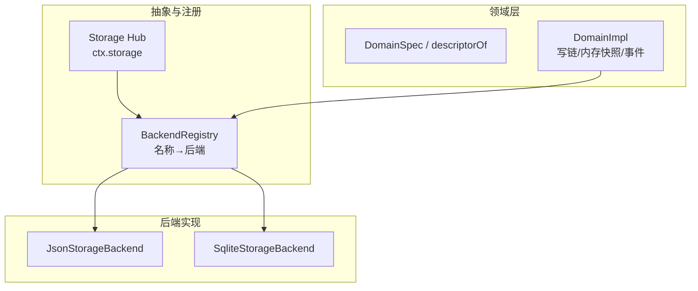
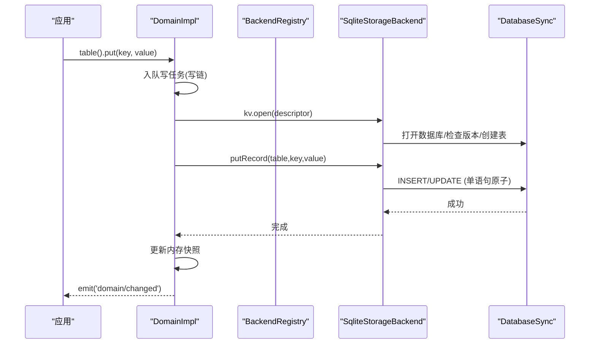
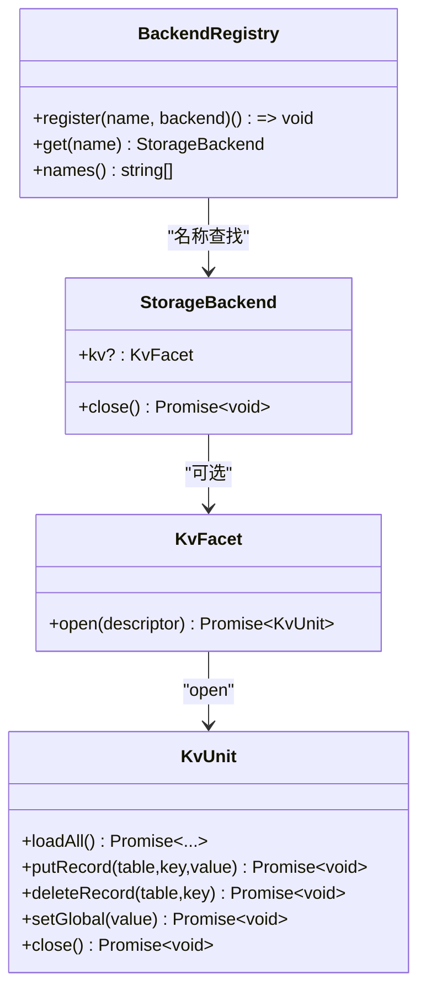
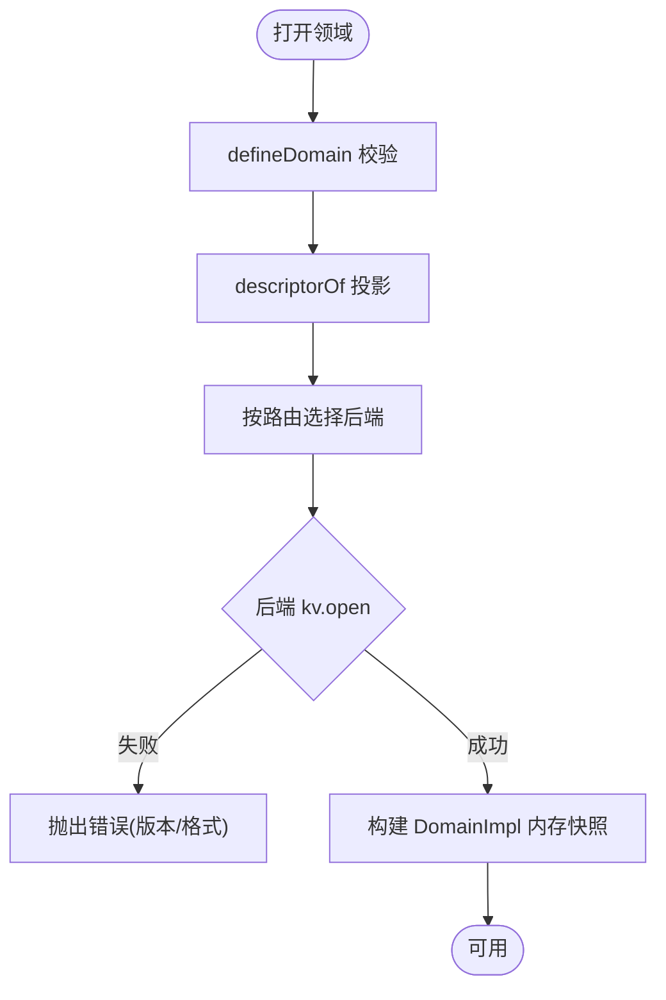
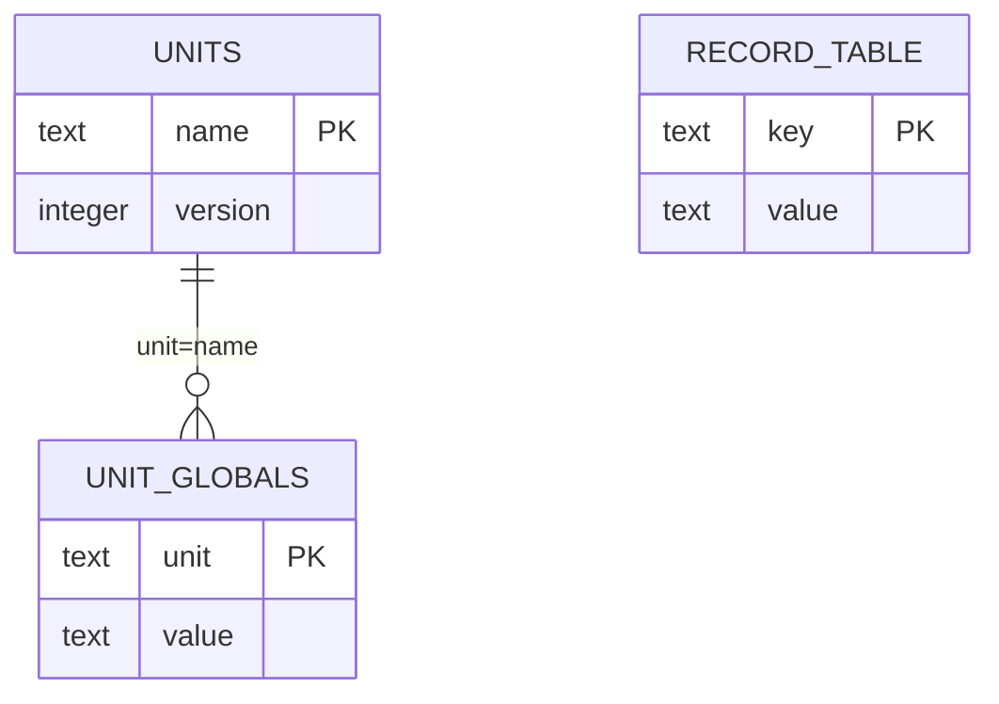
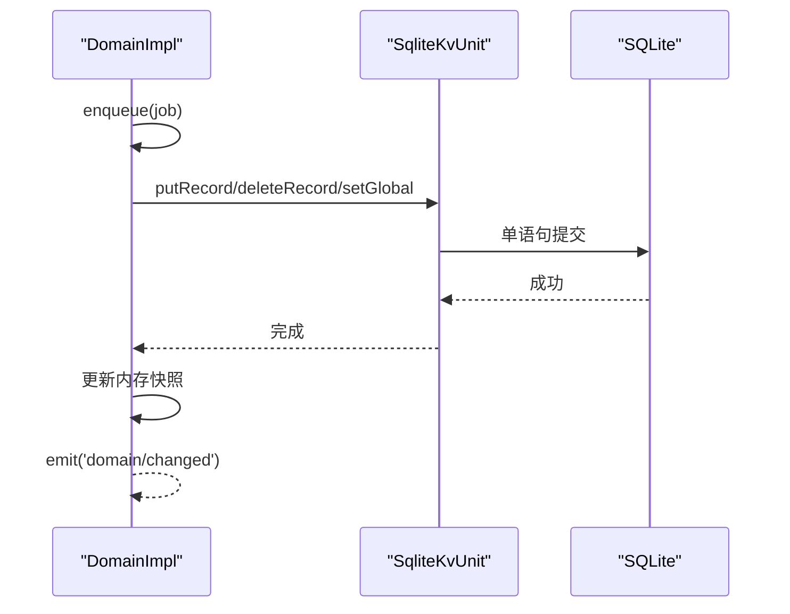
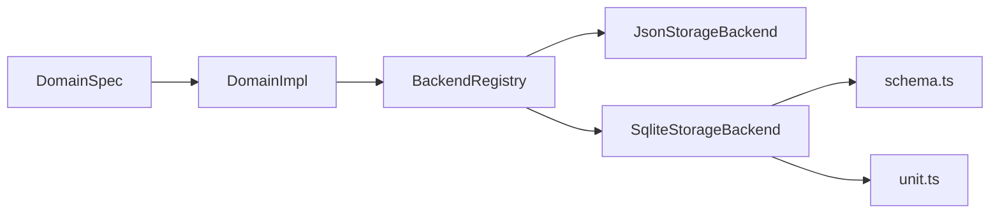

# 查询存储后端

<cite>
**本文引用的文件**
- [packages/storage/storage/src/backend.ts](file://packages/storage/storage/src/backend.ts)
- [packages/storage/storage/src/registry.ts](file://packages/storage/storage/src/registry.ts)
- [packages/storage/storage/src/index.ts](file://packages/storage/storage/src/index.ts)
- [packages/storage/storage-domain/src/spec.ts](file://packages/storage/storage-domain/src/spec.ts)
- [packages/storage/storage-domain/src/domain.ts](file://packages/storage/storage-domain/src/domain.ts)
- [packages/storage/storage-domain/src/events.ts](file://packages/storage/storage-domain/src/events.ts)
- [packages/storage/storage-sqlite/src/index.ts](file://packages/storage/storage-sqlite/src/index.ts)
- [packages/storage/storage-sqlite/src/schema.ts](file://packages/storage/storage-sqlite/src/schema.ts)
- [packages/storage/storage-sqlite/src/unit.ts](file://packages/storage/storage-sqlite/src/unit.ts)
- [packages/storage/storage-json/src/index.ts](file://packages/storage/storage-json/src/index.ts)
- [packages/storage/storage-sqlite/README.md](file://packages/storage/storage-sqlite/README.md)
- [docs/subsystems/storage.md](file://docs/subsystems/storage.md)
</cite>

## 目录
1. [简介](#简介)
2. [项目结构](#项目结构)
3. [核心组件](#核心组件)
4. [架构总览](#架构总览)
5. [详细组件分析](#详细组件分析)
6. [依赖关系分析](#依赖关系分析)
7. [性能与调优](#性能与调优)
8. [故障排查指南](#故障排查指南)
9. [结论](#结论)
10. [附录：配置、迁移与备份恢复](#附录：配置迁移与备份恢复)

## 简介
本文件聚焦“查询存储后端”的 SQLite 实现，围绕存储抽象层、SQLite 物理表结构与索引、查询执行计划、数据生命周期（写入/更新/清理）、性能参数与监控指标、以及迁移与备份恢复进行系统化说明。存储子系统将“领域模型（domain）”与“介质（backend）”解耦：领域层定义数据形态与一致性语义，后端负责持久化；当前提供 JSON 与 SQLite 两种后端，可按需切换。

## 项目结构
存储子系统由三层组成：
- 抽象与注册层：定义后端契约、名称注册与解析、Hub 挂载点。
- 领域层：声明领域（DomainSpec）、打开域（Domain）、写链与变更事件。
- 后端实现层：JSON 与 SQLite 两种 KvFacet 实现，分别以文件树或单库多表承载数据。

图表来源
- [packages/storage/storage/src/index.ts:43-75](file://packages/storage/storage/src/index.ts#L43-L75)
- [packages/storage/storage/src/registry.ts:14-62](file://packages/storage/storage/src/registry.ts#L14-L62)
- [packages/storage/storage-domain/src/spec.ts:34-113](file://packages/storage/storage-domain/src/spec.ts#L34-L113)
- [packages/storage/storage-domain/src/domain.ts:140-277](file://packages/storage/storage-domain/src/domain.ts#L140-L277)
- [packages/storage/storage-json/src/index.ts:63-114](file://packages/storage/storage-json/src/index.ts#L63-L114)
- [packages/storage/storage-sqlite/src/index.ts:55-169](file://packages/storage/storage-sqlite/src/index.ts#L55-L169)

章节来源
- [docs/subsystems/storage.md:1-105](file://docs/subsystems/storage.md#L1-L105)
- [packages/storage/storage/src/backend.ts:1-105](file://packages/storage/storage/src/backend.ts#L1-L105)

## 核心组件
- 存储后端契约 StorageBackend/KvFacet/KvUnit：统一描述“单元”的打开、快照读取、记录级写入、全局槽写入与关闭。
- 领域声明 DomainSpec：以 zod schema 声明表结构与全局槽，defineDomain 在模块加载时做强校验。
- 领域运行时 DomainImpl：维护权威内存快照、单写链、事件 domain/changed；读同步、写异步且先持久再改内存再发事件。
- SQLite 后端 SqliteStorageBackend：单库多表，按 unit+table 生成物理表名，值列存 JSON 文本；通过 PRAGMA user_version 管理物理布局版本。
- JSON 后端 JsonStorageBackend：每单元一个原子 JSON 文件，适合人类可读与低并发场景。

章节来源
- [packages/storage/storage/src/backend.ts:12-105](file://packages/storage/storage/src/backend.ts#L12-L105)
- [packages/storage/storage-domain/src/spec.ts:34-113](file://packages/storage/storage-domain/src/spec.ts#L34-L113)
- [packages/storage/storage-domain/src/domain.ts:140-358](file://packages/storage/storage-domain/src/domain.ts#L140-L358)
- [packages/storage/storage-sqlite/src/index.ts:55-169](file://packages/storage/storage-sqlite/src/index.ts#L55-L169)
- [packages/storage/storage-json/src/index.ts:63-114](file://packages/storage/storage-json/src/index.ts#L63-L114)

## 架构总览
存储系统采用“能力接缝”设计：Hub 不直接 IO，后端拥有介质，领域层拥有语义。消费者通过 ctx.storageDomain.open(spec) 打开领域，内部根据路由选择后端并打开 KvUnit；所有写操作经领域写链串行化，确保顺序与一致性。

图表来源
- [packages/storage/storage-domain/src/domain.ts:263-358](file://packages/storage/storage-domain/src/domain.ts#L263-L358)
- [packages/storage/storage-sqlite/src/index.ts:75-123](file://packages/storage/storage-sqlite/src/index.ts#L75-L123)
- [packages/storage/storage-sqlite/src/unit.ts:99-118](file://packages/storage/storage-sqlite/src/unit.ts#L99-L118)

## 详细组件分析

### 存储抽象层与后端注册
- StorageBackend 暴露可选 facet（当前仅 kv），close 保证幂等释放介质。
- BackendRegistry 维护 name→backend 映射，重复注册抛错；get 未找到抛 backend-not-found。
- Storage Hub 提供 mount/form 机制挂载数据形式，避免产品包直连后端。

图表来源
- [packages/storage/storage/src/backend.ts:12-105](file://packages/storage/storage/src/backend.ts#L12-L105)
- [packages/storage/storage/src/registry.ts:14-62](file://packages/storage/storage/src/registry.ts#L14-L62)

章节来源
- [packages/storage/storage/src/backend.ts:12-105](file://packages/storage/storage/src/backend.ts#L12-L105)
- [packages/storage/storage/src/registry.ts:14-62](file://packages/storage/storage/src/registry.ts#L14-L62)
- [packages/storage/storage/src/index.ts:43-75](file://packages/storage/storage/src/index.ts#L43-L75)

### 领域声明与打开流程
- DomainSpec 定义 name/version/global/tables，defineDomain 在模块加载时校验名称、版本与 global schema 不接受 null。
- descriptorOf(spec) 投影为 KvUnitDescriptor，供后端打开单元。
- DomainImpl 维护内存快照与写链；put/delete/update/global.set 均入队，先持久化再改内存再发事件。

图表来源
- [packages/storage/storage-domain/src/spec.ts:34-113](file://packages/storage/storage-domain/src/spec.ts#L34-L113)
- [packages/storage/storage-domain/src/domain.ts:140-201](file://packages/storage/storage-domain/src/domain.ts#L140-L201)

章节来源
- [packages/storage/storage-domain/src/spec.ts:34-113](file://packages/storage/storage-domain/src/spec.ts#L34-L113)
- [packages/storage/storage-domain/src/domain.ts:140-201](file://packages/storage/storage-domain/src/domain.ts#L140-L201)

### SQLite 存储实现：表结构、索引与执行计划
- 物理布局版本：PRAGMA user_version 固定为 STORAGE_SQLITE_SCHEMA_VERSION；非零且不等于当前版本即拒绝（无迁移）。
- 元数据表：
  - units(name PK, version)：记录每个单元的格式版本。
  - unit_globals(unit PK, value)：单元级全局槽。
- 记录表：u_<unit>_<table>(key TEXT PRIMARY KEY, value TEXT NOT NULL) STRICT；value 为 JSON 文本。
- 索引优化：
  - key 为主键，天然支持 O(log N) 查找与唯一约束。
  - 常见查询模式（按 key 精确访问、全表扫描 loadAll）已覆盖；如需按业务字段过滤，应在领域层引入额外索引表或物化视图。
- 执行计划要点：
  - 每条写操作为单条 prepared statement，利用 SQLite 语句级原子性满足 KV 契约。
  - WAL 模式下并发读友好；写冲突由底层立即报错（无重试/忙等待）。
  - 读取 loadAll 会遍历表，适合中小规模；大规模建议拆分单元或增加查询侧索引。

图表来源
- [packages/storage/storage-sqlite/src/schema.ts:77-108](file://packages/storage/storage-sqlite/src/schema.ts#L77-L108)
- [packages/storage/storage-sqlite/src/index.ts:98-123](file://packages/storage/storage-sqlite/src/index.ts#L98-L123)
- [packages/storage/storage-sqlite/src/unit.ts:43-63](file://packages/storage/storage-sqlite/src/unit.ts#L43-L63)

章节来源
- [packages/storage/storage-sqlite/src/schema.ts:14-121](file://packages/storage/storage-sqlite/src/schema.ts#L14-L121)
- [packages/storage/storage-sqlite/src/index.ts:55-169](file://packages/storage/storage-sqlite/src/index.ts#L55-L169)
- [packages/storage/storage-sqlite/src/unit.ts:1-157](file://packages/storage/storage-sqlite/src/unit.ts#L1-L157)
- [packages/storage/storage-sqlite/README.md:7-12](file://packages/storage/storage-sqlite/README.md#L7-L12)

### 数据写入、更新与清理策略
- 写入路径：DomainImpl.put/update/global.set → 入队写链 → KvUnit.putRecord/setGlobal → SQLite 单语句提交 → 更新内存 → 发出 domain/changed。
- 删除策略：delete 若不存在则返回 false 且不写；存在则删除并触发事件。
- 清理策略：
  - 单元级 close：释放该单元句柄，允许后续重新打开。
  - 后端 close：关闭所有单元并释放数据库连接；幂等。
  - 领域 close：拒绝新写、排空写链、关闭单元、释放名称。

图表来源
- [packages/storage/storage-domain/src/domain.ts:263-358](file://packages/storage/storage-domain/src/domain.ts#L263-L358)
- [packages/storage/storage-sqlite/src/unit.ts:99-118](file://packages/storage/storage-sqlite/src/unit.ts#L99-L118)

章节来源
- [packages/storage/storage-domain/src/domain.ts:263-358](file://packages/storage/storage-domain/src/domain.ts#L263-L358)
- [packages/storage/storage-sqlite/src/unit.ts:99-118](file://packages/storage/storage-sqlite/src/unit.ts#L99-L118)

### 变更事件与一致性
- 事件 domain/changed 在每次持久化成功后发出，携带 domain/table/key/operation/value。
- 事件是通知而非事务参与者：监听器抛错不会回滚已提交的写。
- 同一领域的多个事件保持写链顺序。

章节来源
- [packages/storage/storage-domain/src/events.ts:108-126](file://packages/storage/storage-domain/src/events.ts#L108-L126)
- [packages/storage/storage-domain/src/domain.ts:246-261](file://packages/storage/storage-domain/src/domain.ts#L246-L261)

## 依赖关系分析
- 领域层依赖后端契约（KvFacet/KvUnit），不感知具体介质。
- SQLite 后端依赖 node:sqlite 与 schema 工具函数；通过 recordTableName 构造安全标识符。
- JSON 后端以原子文件为单位，适合调试与人类可读。
- Hub 通过 BackendRegistry 解耦消费者与后端选择。

图表来源
- [packages/storage/storage-domain/src/spec.ts:34-113](file://packages/storage/storage-domain/src/spec.ts#L34-L113)
- [packages/storage/storage-domain/src/domain.ts:140-201](file://packages/storage/storage-domain/src/domain.ts#L140-L201)
- [packages/storage/storage/src/registry.ts:14-62](file://packages/storage/storage/src/registry.ts#L14-L62)
- [packages/storage/storage-sqlite/src/index.ts:55-169](file://packages/storage/storage-sqlite/src/index.ts#L55-L169)

章节来源
- [packages/storage/storage/src/registry.ts:14-62](file://packages/storage/storage/src/registry.ts#L14-L62)
- [packages/storage/storage-sqlite/src/index.ts:55-169](file://packages/storage/storage-sqlite/src/index.ts#L55-L169)

## 性能与调优
- 写入吞吐与延迟
  - 单语句原子写，WAL 默认开启，读并发友好；写冲突立即失败，无重试。
  - 高并发写建议控制调用方并发度，或在领域层合并批量写。
- 读取性能
  - loadAll 全表扫描，适合中小规模；大表应拆分单元或引入查询索引。
  - 对 key 的精确访问走主键索引，O(log N)。
- 存储体积
  - value 为 JSON 文本，注意对象大小与序列化开销；必要时在领域层压缩或分片。
- 日志模式
  - journal_mode 可配置为 wal/delete/truncate/persist；网络文件系统建议使用 rollback-journal 模式。
- 监控指标建议
  - 写队列长度（写链深度）、写耗时分布、错误率（version-mismatch/malformed-medium/closed）。
  - 数据库文件大小、WAL 文件大小、PRAGMA user_version。
  - 热点表行数与增长速率。

章节来源
- [packages/storage/storage-sqlite/README.md:7-12](file://packages/storage/storage-sqlite/README.md#L7-L12)
- [packages/storage/storage-sqlite/src/schema.ts:22-29](file://packages/storage/storage-sqlite/src/schema.ts#L22-L29)
- [packages/storage/storage-sqlite/src/index.ts:24-48](file://packages/storage/storage-sqlite/src/index.ts#L24-L48)

## 故障排查指南
- 版本不匹配
  - 现象：打开单元或数据库时报 version-mismatch。
  - 原因：PRAGMA user_version 或单元 version 与当前构建不一致。
  - 处理：升级/降级到兼容版本；不要尝试就地迁移。
- 介质损坏
  - 现象：malformed-medium（无法解析 JSON）。
  - 原因：值列非合法 JSON。
  - 处理：定位对应单元/表/键，修复或重建数据。
- 后端未注册/重复注册
  - 现象：backend-not-found、duplicate-backend。
  - 处理：确认插件 apply 已执行；避免重复 register。
- 并发写冲突
  - 现象：另一连接持有写事务导致立即失败。
  - 处理：避免多进程共享同一数据库；或在上层加锁/重试。
- 关闭后使用
  - 现象：closed 错误。
  - 处理：确保在 close 前完成必要操作；遵循领域/后端生命周期。

章节来源
- [packages/storage/storage-sqlite/src/schema.ts:77-108](file://packages/storage/storage-sqlite/src/schema.ts#L77-L108)
- [packages/storage/storage-sqlite/src/unit.ts:86-97](file://packages/storage/storage-sqlite/src/unit.ts#L86-L97)
- [packages/storage/storage/src/registry.ts:44-53](file://packages/storage/storage/src/registry.ts#L44-L53)
- [packages/storage/storage-sqlite/src/index.ts:75-96](file://packages/storage/storage-sqlite/src/index.ts#L75-L96)

## 结论
SQLite 存储后端以单库多表承载领域数据，通过严格版本管理与原子语句实现可靠的 KV 语义。领域层提供强类型声明、内存快照与写链一致性，配合 domain/changed 事件驱动下游消费。生产环境建议结合 WAL 与合适的 journal_mode，关注写链深度与错误率，并在数据规模增长时考虑单元拆分与查询索引扩展。

## 附录：配置、迁移与备份恢复

### 配置示例（SQLite）
- path：数据库文件路径或 :memory:（测试用）。
- journalMode：wal（默认）或 delete/truncate/persist（网络文件系统推荐）。
- 插件注入：通过 apply(ctx, config) 注册为后端 sqlite。

章节来源
- [packages/storage/storage-sqlite/src/index.ts:24-48](file://packages/storage/storage-sqlite/src/index.ts#L24-L48)
- [packages/storage/storage-sqlite/src/index.ts:158-169](file://packages/storage/storage-sqlite/src/index.ts#L158-L169)

### 迁移策略
- 物理布局版本：STORAGE_SQLITE_SCHEMA_VERSION 变化时拒绝旧库，不进行就地迁移。
- 单元版本：units.version 与 descriptor.version 不一致时抛出 version-mismatch。
- 建议：发布新版本前先验证兼容性；跨版本升级需准备离线重建或数据导出/导入流程。

章节来源
- [packages/storage/storage-sqlite/src/schema.ts:14-20](file://packages/storage/storage-sqlite/src/schema.ts#L14-L20)
- [packages/storage/storage-sqlite/src/index.ts:98-110](file://packages/storage/storage-sqlite/src/index.ts#L98-L110)

### 备份与恢复
- 备份：停止写入后复制 .db 文件；WAL 模式下同时备份对应的 -wal/-shm 文件（如存在）。
- 恢复：将备份文件放回原路径并确保权限正确；启动服务后验证 PRAGMA user_version 与关键表完整性。
- 校验：可通过 loadAll 或关键记录的 get 进行一致性校验。

[本节为通用实践说明，不直接引用具体代码]