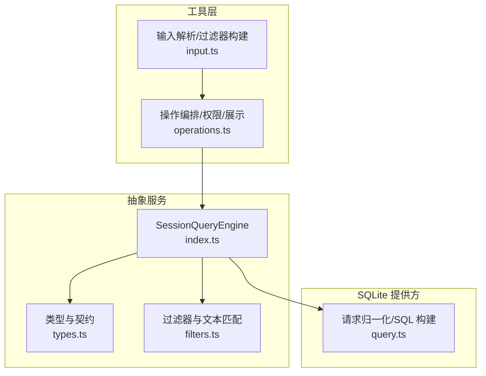
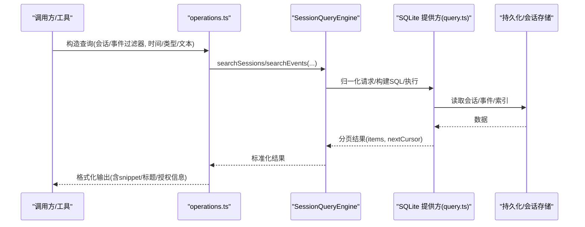
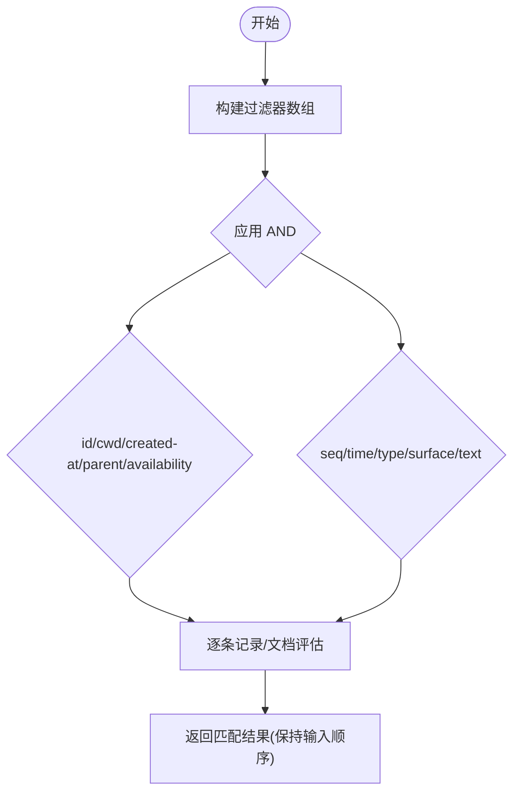
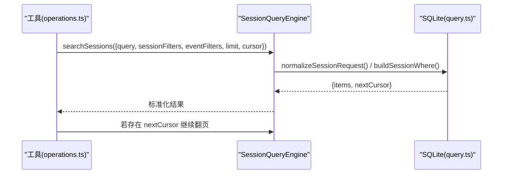
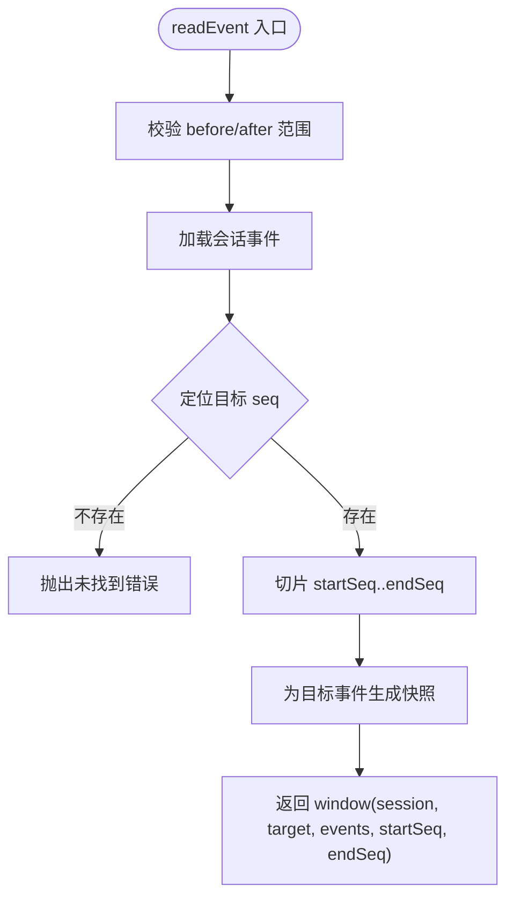
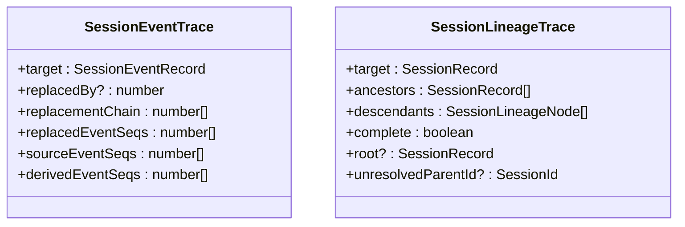
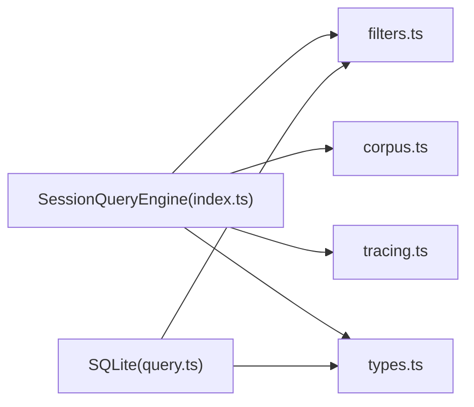

# 查询接口设计

<cite>
**本文引用的文件**
- [session-query.md](file://docs/subsystems/session-query.md)
- [session-query.zh.md](file://docs/subsystems/session-query.zh.md)
- [types.ts](file://packages/session-query/session-query/src/types.ts)
- [index.ts](file://packages/session-query/session-query/src/index.ts)
- [filters.ts](file://packages/session-query/session-query/src/filters.ts)
- [query.ts](file://packages/session-query/session-query-sqlite/src/query.ts)
- [operations.ts](file://packages/session-query/tool-session-query/src/operations.ts)
- [input.ts](file://packages/session-query/tool-session-query/src/input.ts)
</cite>

## 目录
1. [简介](#简介)
2. [项目结构](#项目结构)
3. [核心组件](#核心组件)
4. [架构总览](#架构总览)
5. [详细组件分析](#详细组件分析)
6. [依赖关系分析](#依赖关系分析)
7. [性能考虑](#性能考虑)
8. [故障排查指南](#故障排查指南)
9. [结论](#结论)
10. [附录：查询示例与最佳实践](#附录：查询示例与最佳实践)

## 简介
本文件系统化文档化会话查询接口的设计模式与规范，覆盖跨会话与单会话的全文检索、精确读取、过滤、分页游标、事件关系追踪、谱系追溯等能力。重点说明支持的查询操作符（时间范围、消息类型、用户ID匹配等）、复杂查询构建方法（链式调用模式）、参数校验与错误处理机制，并提供性能优化建议与丰富示例。

## 项目结构
会话查询由“抽象服务定义 + 提供方实现”组成：
- 抽象服务：SessionQueryEngine 暴露统一 API，负责精确读取、来源优先级、关系追踪、语义提取与提供方无关的过滤器。
- SQLite 提供方：实现全文索引生命周期、游标生成、排序与执行。
- 工具层：将模型侧输入规范化为内部过滤器并调用服务。

图表来源
- [index.ts:81-357](file://packages/session-query/session-query/src/index.ts#L81-L357)
- [types.ts:18-280](file://packages/session-query/session-query/src/types.ts#L18-L280)
- [filters.ts:1-244](file://packages/session-query/session-query/src/filters.ts#L1-L244)
- [query.ts:94-478](file://packages/session-query/session-query-sqlite/src/query.ts#L94-L478)
- [input.ts:88-177](file://packages/session-query/tool-session-query/src/input.ts#L88-L177)
- [operations.ts:54-272](file://packages/session-query/tool-session-query/src/operations.ts#L54-L272)

章节来源
- [session-query.zh.md:1-496](file://docs/subsystems/session-query.zh.md#L1-L496)

## 核心组件
- SessionQueryEngine：统一入口，提供 listSessions、filterSessions、readSession、readSurface、listEvents、filterEvents、traceSession、traceEvent、readEvent、searchSessions、searchEvents 等方法。
- 过滤器体系：SessionResultFilter（会话级）与 SessionEventResultFilter（事件级），支持 AND/OR 组合、范围查询、类型/表面/文本匹配。
- 全文搜索：跨会话 searchSessions 与单会话 searchEvents，返回带游标的分页结果，命中项包含片段 snippet。
- 事件与谱系：traceEvent 提供替换链与引用关系；traceSession 提供祖先与后代树。
- SQLite 提供方：负责 SQL 构建、FTS5 短语转义、游标指纹、限制检查与片段截取。

章节来源
- [index.ts:107-357](file://packages/session-query/session-query/src/index.ts#L107-L357)
- [types.ts:180-280](file://packages/session-query/session-query/src/types.ts#L180-L280)
- [filters.ts:18-162](file://packages/session-query/session-query/src/filters.ts#L18-L162)
- [query.ts:94-478](file://packages/session-query/session-query-sqlite/src/query.ts#L94-L478)

## 架构总览

图表来源
- [operations.ts:54-166](file://packages/session-query/tool-session-query/src/operations.ts#L54-L166)
- [index.ts:107-127](file://packages/session-query/session-query/src/index.ts#L107-L127)
- [query.ts:94-138](file://packages/session-query/session-query-sqlite/src/query.ts#L94-L138)

## 详细组件分析

### 过滤器与查询操作符
- 会话级过滤器 SessionResultFilter：
  - id：按会话 ID 列表匹配（OR）。
  - cwd：工作目录匹配（含 null）。
  - created-at：创建时间范围（from/to，闭区间）。
  - parent：父会话 ID 列表匹配（含 null）。
  - availability：live/persisted 可用性筛选。
- 事件级过滤器 SessionEventResultFilter：
  - seq/time：数值/时间范围（闭区间）。
  - type：事件类型列表匹配。
  - surface：current/shadowed/log-only 匹配。
  - text：字面量、不区分大小写、空白灵活的正则扫描（安全转义，防注入）。
- 过滤器组合规则：数组内各项逻辑与（AND），单个子句 values 逻辑或（OR）。

图表来源
- [filters.ts:18-38](file://packages/session-query/session-query/src/filters.ts#L18-L38)
- [filters.ts:120-162](file://packages/session-query/session-query/src/filters.ts#L120-L162)
- [filters.ts:105-118](file://packages/session-query/session-query/src/filters.ts#L105-L118)

章节来源
- [types.ts:180-219](file://packages/session-query/session-query/src/types.ts#L180-L219)
- [filters.ts:18-162](file://packages/session-query/session-query/src/filters.ts#L18-L162)

### 全文搜索与分页游标
- searchSessions：跨会话分组搜索，按最强匹配事件排序，返回 SessionSearchHit 列表与 nextCursor。
- searchEvents：单会话内搜索，返回 SessionEventSearchPage，包含目标 session header 与命中片段 snippet。
- 游标：由 provider 生成并绑定到规范化后的 query、filters、limit；用于翻页。
- 限制与安全：
  - 查询字符串被当作数据而非可执行 FTS 语法，使用引号包裹。
  - 变量绑定数量与 FTS5 外部谓词预算受保护，超限抛出无效过滤器错误。
  - 片段截取去除标记并控制 Unicode 字符数。

图表来源
- [operations.ts:54-114](file://packages/session-query/tool-session-query/src/operations.ts#L54-L114)
- [index.ts:107-127](file://packages/session-query/session-query/src/index.ts#L107-L127)
- [query.ts:94-138](file://packages/session-query/session-query-sqlite/src/query.ts#L94-L138)
- [query.ts:218-294](file://packages/session-query/session-query-sqlite/src/query.ts#L218-L294)

章节来源
- [types.ts:221-279](file://packages/session-query/session-query/src/types.ts#L221-L279)
- [query.ts:94-138](file://packages/session-query/session-query-sqlite/src/query.ts#L94-L138)
- [query.ts:218-294](file://packages/session-query/session-query-sqlite/src/query.ts#L218-L294)

### 精确读取与有界窗口
- readSession：读取完整原始日志并进行回放验证，返回克隆的 header 与事件序列。
- readEvent：读取指定 seq 的事件及前后上下文窗口（before/after），对窗口大小进行上限校验。
- readSurface：读取当前模型表面快照，附带 capturedThroughSeq。

图表来源
- [index.ts:301-357](file://packages/session-query/session-query/src/index.ts#L301-L357)

章节来源
- [index.ts:138-151](file://packages/session-query/session-query/src/index.ts#L138-L151)
- [index.ts:257-270](file://packages/session-query/session-query/src/index.ts#L257-L270)
- [index.ts:301-357](file://packages/session-query/session-query/src/index.ts#L301-L357)

### 事件关系与谱系
- traceEvent：返回目标事件的直接替换链、被替换事件、源引用事件与派生事件。
- traceSession：返回祖先链与后代森林，complete 标志指示是否完整。

图表来源
- [types.ts:96-124](file://packages/session-query/session-query/src/types.ts#L96-L124)
- [types.ts:65-94](file://packages/session-query/session-query/src/types.ts#L65-L94)
- [index.ts:272-299](file://packages/session-query/session-query/src/index.ts#L272-L299)

章节来源
- [types.ts:65-124](file://packages/session-query/session-query/src/types.ts#L65-L124)
- [index.ts:272-299](file://packages/session-query/session-query/src/index.ts#L272-L299)

### 工具层输入与权限
- input.ts：将模型侧参数转换为内部过滤器，包括时间戳解析、序列范围、事件类型/表面过滤。
- operations.ts：编排搜索、追踪、读取等操作，结合工作区访问与授权，收集多页结果并格式化输出。

章节来源
- [input.ts:88-177](file://packages/session-query/tool-session-query/src/input.ts#L88-L177)
- [operations.ts:54-272](file://packages/session-query/tool-session-query/src/operations.ts#L54-L272)

## 依赖关系分析
- SessionQueryEngine 依赖：
  - 会话与标题模块（@deepseek-ai/dsh-session、@deepseek-ai/dsh-session-title）。
  - 本地过滤器与文档构建（filters.ts、documents.ts）。
  - 语料管理（corpus.ts）。
  - 追踪（tracing.ts）。
- SQLite 提供方依赖：
  - 复用过滤器材料化函数，确保跨层一致性。
  - 通过 SQL 构建与 FTS5 短语转义实现高效检索。

图表来源
- [index.ts:7-66](file://packages/session-query/session-query/src/index.ts#L7-L66)
- [query.ts:1-17](file://packages/session-query/session-query-sqlite/src/query.ts#L1-L17)

章节来源
- [index.ts:7-66](file://packages/session-query/session-query/src/index.ts#L7-L66)
- [query.ts:1-17](file://packages/session-query/session-query-sqlite/src/query.ts#L1-L17)

## 性能考虑
- 分页与游标：
  - 使用 nextCursor 分页，避免一次性拉取大量数据。
  - 合理设置 limit，默认与最大限制在 provider 中约束。
- 过滤器选择：
  - 优先使用 id、type、surface、seq/time 等元数据过滤减少扫描范围。
  - text 过滤基于语义文本的正则扫描，适合精确定位但开销较高。
- 窗口读取：
  - readEvent 的 before/after 需控制在 readWindowMax 以内，避免过大窗口导致内存与 I/O 压力。
- 提供者限制：
  - SQLite 提供方对变量绑定数量与 FTS5 外部谓词数量设限，超出会拒绝请求，应精简 filter.values。
- 取消与并发：
  - 多数方法支持 AbortSignal，可在长耗时操作中及时中断。
  - 持久化检查并发度可配置，平衡吞吐与资源占用。

[本节为通用指导，无需特定文件引用]

## 故障排查指南
常见错误码与触发场景：
- SESSION_QUERY_INVALID_FILTER：过滤器值非法、未知 kind、范围 from > to、空数组等。
- SESSION_QUERY_INVALID_QUERY：查询为空或包含 NUL。
- SESSION_QUERY_INVALID_CURSOR：游标类型错误或重复。
- SESSION_QUERY_EVENT_NOT_FOUND：指定 seq 不存在。
- SESSION_QUERY_INVALID_WINDOW：before/after 越界或非整数。
- SESSION_QUERY_SESSION_NOT_FOUND：会话不存在。
- SESSION_QUERY_INDEX_FAILED：索引失败。
- SESSION_QUERY_SEARCH_DISABLED：部署禁用搜索。
- SESSION_QUERY_PERSISTENCE_FAILED：持久化后端失败。
- SESSION_QUERY_SOURCE_CONFLICT：源元数据冲突。
- SESSION_QUERY_CORRUPT_SESSION：会话损坏。
- SESSION_QUERY_STALE_CURSOR：游标过期。
- SESSION_QUERY_ABORTED：操作被取消。

排查要点：
- 检查过滤器值类型与范围合法性。
- 确认查询非空且不含 NUL。
- 校验 seq 是否存在，窗口大小是否在限制内。
- 关注 provider 的限制提示（变量绑定、FTS5 预算）。
- 利用 AbortSignal 捕获取消原因，避免误报。

章节来源
- [index.ts:301-357](file://packages/session-query/session-query/src/index.ts#L301-L357)
- [query.ts:36-56](file://packages/session-query/session-query-sqlite/src/query.ts#L36-L56)
- [query.ts:318-383](file://packages/session-query/session-query-sqlite/src/query.ts#L318-L383)

## 结论
会话查询接口以“抽象服务 + 提供方实现”的模式提供了稳定、可扩展的查询能力。通过统一的过滤器体系与全文搜索，支持从简单的时间/类型筛选到复杂的跨会话检索。严格的参数校验与错误分类保障了健壮性，分页游标与窗口读取提升了性能与可控性。工具层进一步封装了权限与展示，便于上层消费。

[本节为总结，无需特定文件引用]

## 附录：查询示例与最佳实践

- 基础过滤
  - 按会话 ID 列表筛选：使用 id 过滤器传入多个 SessionId。
  - 按工作目录筛选：使用 cwd 过滤器限定范围。
  - 按创建时间范围筛选：使用 created-at 的 from/to 闭区间。
  - 按父会话筛选：使用 parent 过滤器，支持 null 表示根会话。
  - 按可用性筛选：使用 availability 选择 live 或 persisted。

- 事件级过滤
  - 按事件类型筛选：type 过滤器传入事件类型数组。
  - 按表面筛选：surface 选择 current/shadowed/log-only。
  - 按时间/序列范围筛选：time/seq 的 from/to 闭区间。
  - 按语义文本匹配：text 过滤器进行字面量、不区分大小写、空白灵活的匹配。

- 复杂查询构建（链式调用模式）
  - 先构建会话级过滤器数组，再叠加事件级过滤器，最后调用 filterSessions/filterEvents。
  - 对于全文搜索，先构建 sessionFilters/eventFilters，再调用 searchSessions/searchEvents，并使用 nextCursor 翻页。

- 精确读取与上下文
  - 使用 readEvent(seq, before, after) 获取目标事件及其上下文窗口，注意窗口上限。
  - 使用 readSurface 获取当前模型表面快照，配合 capturedThroughSeq 理解覆盖范围。

- 关系与谱系
  - 使用 traceEvent 查看替换链与引用关系，辅助调试与审计。
  - 使用 traceSession 获取祖先与后代树，了解会话演化路径。

- 最佳实践
  - 尽量使用元数据过滤缩小范围，再使用 text 做精细匹配。
  - 合理设置 limit 与游标，避免大结果集。
  - 使用 AbortSignal 控制长时间查询的生命周期。
  - 遵循 provider 的限制，避免过多 filter.values 导致请求被拒。

章节来源
- [types.ts:180-219](file://packages/session-query/session-query/src/types.ts#L180-L219)
- [filters.ts:18-162](file://packages/session-query/session-query/src/filters.ts#L18-L162)
- [index.ts:107-357](file://packages/session-query/session-query/src/index.ts#L107-L357)
- [query.ts:94-478](file://packages/session-query/session-query-sqlite/src/query.ts#L94-L478)
- [input.ts:88-177](file://packages/session-query/tool-session-query/src/input.ts#L88-L177)
- [operations.ts:54-272](file://packages/session-query/tool-session-query/src/operations.ts#L54-L272)