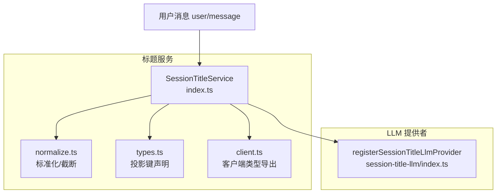
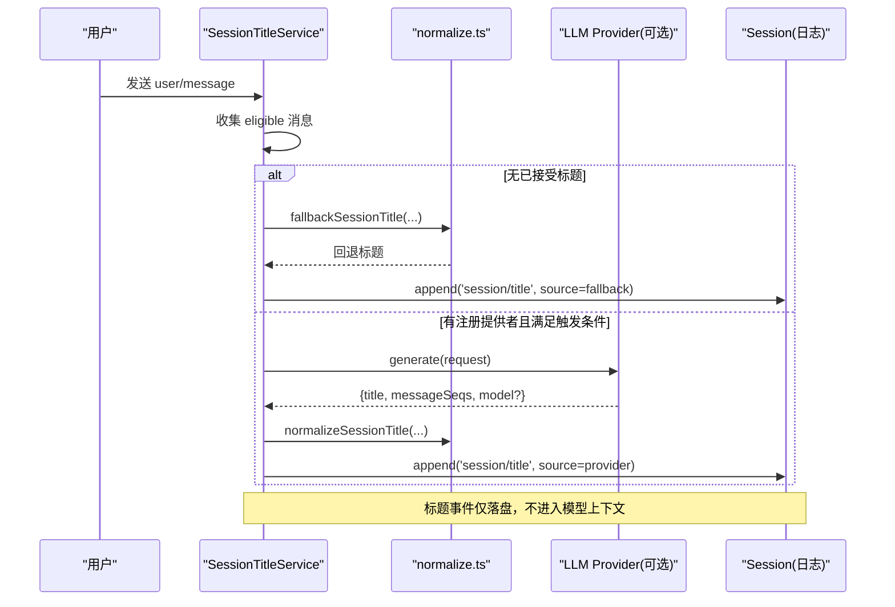
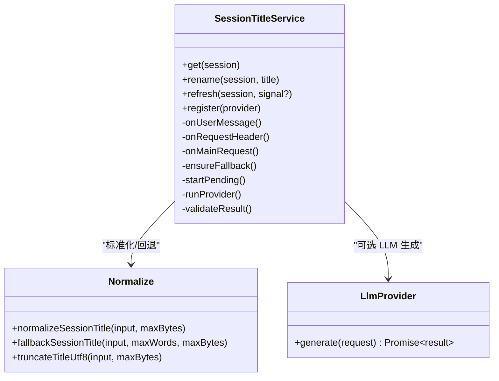
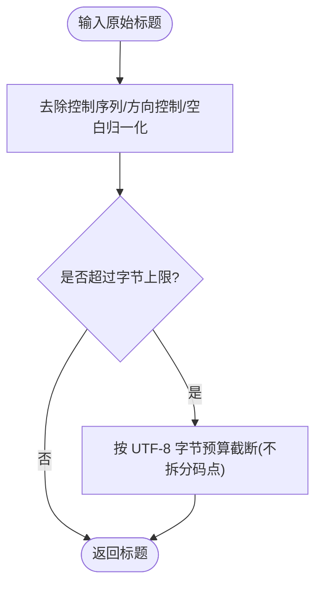
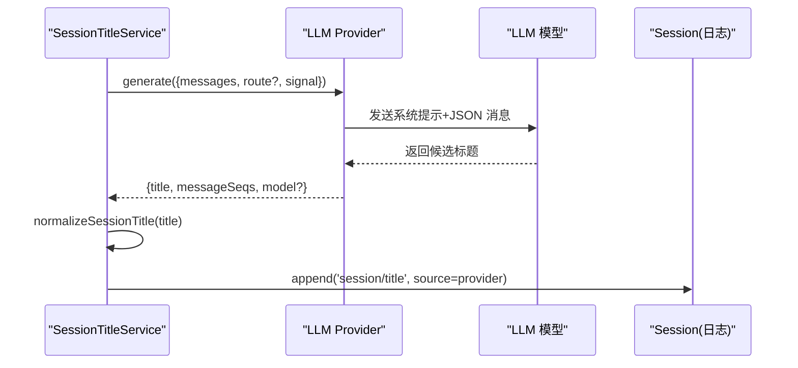
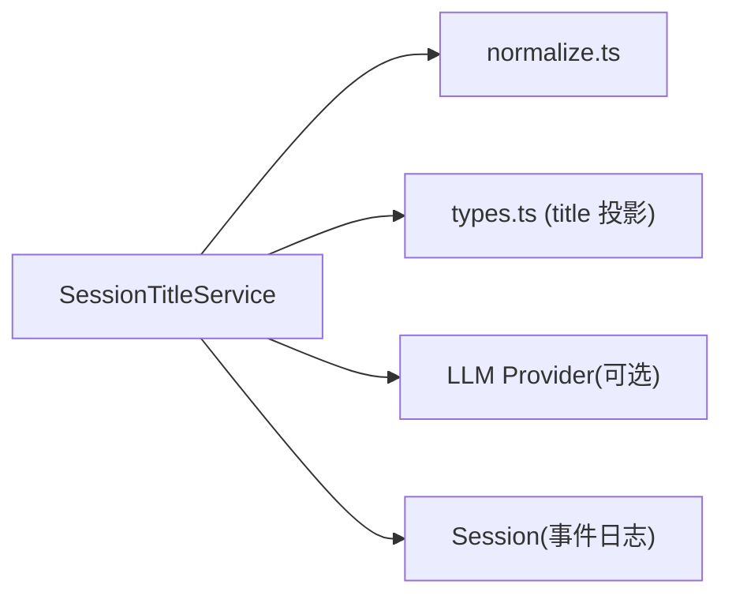

# 会话标题管理

<cite>
**本文引用的文件**
- [packages/session/session-title/src/index.ts](file://packages/session/session-title/src/index.ts)
- [packages/session/session-title/src/normalize.ts](file://packages/session/session-title/src/normalize.ts)
- [packages/session/session-title/src/types.ts](file://packages/session/session-title/src/types.ts)
- [packages/session/session-title/src/client.ts](file://packages/session/session-title/src/client.ts)
- [packages/session/session-title/tests/session-title.spec.ts](file://packages/session/session-title/tests/session-title.spec.ts)
- [packages/session/session-title/README.md](file://packages/session/session-title/README.md)
- [packages/session/session-title-llm/src/index.ts](file://packages/session/session-title-llm/src/index.ts)
</cite>

## 目录
1. [简介](#简介)
2. [项目结构](#项目结构)
3. [核心组件](#核心组件)
4. [架构总览](#架构总览)
5. [详细组件分析](#详细组件分析)
6. [依赖关系分析](#依赖关系分析)
7. [性能考量](#性能考量)
8. [故障排查指南](#故障排查指南)
9. [结论](#结论)
10. [附录](#附录)

## 简介
本文件系统化说明“会话标题管理”的能力与实现，覆盖：
- 会话标题的作用、生成策略与触发时机
- 基于 LLM 的标题生成算法（首条提示词与所有提示词两种模式）
- 标题标准化与格式化流程
- 标题的持久化与同步机制（日志事件、投影）
- 自定义标题生成器的开发指南
- 配置选项与性能调优建议
- 实际示例与集成方法
- 标题的历史记录与版本管理

## 项目结构
该能力由两个包协作完成：
- @deepseek-ai/dsh-session-title：提供会话标题服务、规范化、默认回退、事件与投影类型定义
- @deepseek-ai/dsh-session-title-llm：提供基于 LLM 的标题生成器注册与调用封装

图表来源
- [packages/session/session-title/src/index.ts:260-341](file://packages/session/session-title/src/index.ts#L260-L341)
- [packages/session/session-title/src/normalize.ts:21-74](file://packages/session/session-title/src/normalize.ts#L21-L74)
- [packages/session/session-title/src/types.ts:15-24](file://packages/session/session-title/src/types.ts#L15-L24)
- [packages/session/session-title/src/client.ts:1-11](file://packages/session/session-title/src/client.ts#L1-L11)
- [packages/session/session-title-llm/src/index.ts:153-169](file://packages/session/session-title-llm/src/index.ts#L153-L169)

章节来源
- [packages/session/session-title/src/index.ts:1-793](file://packages/session/session-title/src/index.ts#L1-L793)
- [packages/session/session-title/src/normalize.ts:1-75](file://packages/session/session-title/src/normalize.ts#L1-L75)
- [packages/session/session-title/src/types.ts:1-25](file://packages/session/session-title/src/types.ts#L1-L25)
- [packages/session/session-title/src/client.ts:1-11](file://packages/session/session-title/src/client.ts#L1-L11)
- [packages/session/session-title-llm/src/index.ts:140-198](file://packages/session/session-title-llm/src/index.ts#L140-L198)

## 核心组件
- SessionTitleService：会话标题服务，负责监听事件、调度回退与 LLM 生成、校验并追加 session/title 事件、维护投影。
- 标准化模块：cleanTitleText、truncateTitleUtf8、normalizeSessionTitle、fallbackSessionTitle。
- 类型与投影：title 投影键声明，供宿主与客户端共享单一类型源。
- LLM 提供者注册：将 LLM 能力包装为 SessionTitleProvider，支持首条提示词或全部提示词两种自动模式。

章节来源
- [packages/session/session-title/src/index.ts:260-793](file://packages/session/session-title/src/index.ts#L260-L793)
- [packages/session/session-title/src/normalize.ts:21-74](file://packages/session/session-title/src/normalize.ts#L21-L74)
- [packages/session/session-title/src/types.ts:15-24](file://packages/session/session-title/src/types.ts#L15-L24)
- [packages/session/session-title-llm/src/index.ts:153-198](file://packages/session/session-title-llm/src/index.ts#L153-L198)

## 架构总览
会话标题的生命周期围绕“事件驱动 + 最后写入获胜”的日志模型展开：
- 输入：user/message（仅人类文本块）、request/header（主请求路由）、llm/stream（辅助标记请求）。
- 处理：收集 eligible 消息 -> 确定是否触发回退或 LLM 生成 -> 标准化与校验 -> 追加 session/title。
- 输出：通过 foldSessionTitle 与 title 投影暴露最新标题快照；对模型不可见，不影响主请求 token/KV Cache。

图表来源
- [packages/session/session-title/src/index.ts:461-583](file://packages/session/session-title/src/index.ts#L461-L583)
- [packages/session/session-title/src/normalize.ts:59-74](file://packages/session/session-title/src/normalize.ts#L59-L74)
- [packages/session/session-title-llm/src/index.ts:153-169](file://packages/session/session-title-llm/src/index.ts#L153-L169)

## 详细组件分析

### 会话标题服务（SessionTitleService）
职责
- 监听 user/message、request/header、llm/stream 等事件，决定何时触发回退或 LLM 生成。
- 维护每个会话的工作状态（revision、pending、active），确保并发安全与可取消。
- 提供 get/refresh/rename/register 等 API，以及折叠函数 foldSessionTitle。
- 注册 title 投影，使列表行可直接读取当前标题字符串。

关键行为
- 首次合格人类文本消息后，立即计算并追加确定性回退标题。
- 若注册了 LLM 提供者，按 automatic 模式在合适时机异步生成新标题。
- 用户显式 rename 会“钉住”标题，阻止后续自动更新，除非显式 refresh。
- 所有生成的标题均经 normalizeSessionTitle 标准化与字节上限限制。

并发与取消
- 使用 revision 与 AbortSignal 保证旧工作被中止，避免竞态。
- 服务销毁时清理 pending/active 任务并等待收尾。

章节来源
- [packages/session/session-title/src/index.ts:260-793](file://packages/session/session-title/src/index.ts#L260-L793)

#### 类图（代码级）

图表来源
- [packages/session/session-title/src/index.ts:260-793](file://packages/session/session-title/src/index.ts#L260-L793)
- [packages/session/session-title/src/normalize.ts:21-74](file://packages/session/session-title/src/normalize.ts#L21-L74)
- [packages/session/session-title-llm/src/index.ts:153-169](file://packages/session/session-title-llm/src/index.ts#L153-L169)

### 标题标准化与格式化
- cleanTitleText：移除终端控制序列、方向控制符、C0/C1 控制字符，合并空白并 trim。
- truncateTitleUtf8：按 UTF-8 字节预算截断，不拆分 Unicode 码点。
- normalizeSessionTitle：组合清洗与截断，得到终端安全的单行标题。
- fallbackSessionTitle：从首条合格消息提取前若干词，受词数与字节双重限制。

复杂度
- 时间 O(n)，空间 O(n)，n 为输入长度。UTF-8 截断逐字符累加字节计数。

章节来源
- [packages/session/session-title/src/normalize.ts:21-74](file://packages/session/session-title/src/normalize.ts#L21-L74)

#### 流程图（标准化）

图表来源
- [packages/session/session-title/src/normalize.ts:21-61](file://packages/session/session-title/src/normalize.ts#L21-L61)

### 基于 LLM 的标题生成算法
- 注册方式：通过 registerSessionTitleLlmProvider 将 LLM 能力包装为 SessionTitleProvider。
- 系统提示词：要求简洁自然语言标题，禁止 Markdown/代码/控制符，遵循消息语言，目标词数/字符数可配。
- 消息框定：将 eligible 消息以 JSON 数组形式传入，避免用户文本破坏结构分隔。
- 路由选择：优先使用配置的 provider/model，否则从 request/header 中解析当前主请求路由。
- 自动模式：
  - first-prompt：仅在首个合格提示词时生成（适合轻量场景）。
  - all-prompts：每次新的合格提示词都重新生成（适合高质量标题）。

章节来源
- [packages/session/session-title-llm/src/index.ts:153-198](file://packages/session/session-title-llm/src/index.ts#L153-L198)

#### 时序图（LLM 生成）

图表来源
- [packages/session/session-title-llm/src/index.ts:153-198](file://packages/session/session-title-llm/src/index.ts#L153-L198)
- [packages/session/session-title/src/index.ts:550-583](file://packages/session/session-title/src/index.ts#L550-L583)

### 标题的持久化与同步机制
- 事件落盘：所有接受的标题均以 session/title 事件追加到会话日志，作为唯一事实源。
- 折叠视图：foldSessionTitle 从事件流中取最后一个 session/title 事件，返回包含 eventSeq、updatedAt 的快照。
- 投影同步：服务注册 title 投影键，值为 string|null，供列表行直接消费最新标题。
- 模型可见性：标题事件仅存在于日志层，不会进入 deriveMessages、系统提示或请求前缀，因此不影响主请求 token 与 KV Cache。

章节来源
- [packages/session/session-title/src/index.ts:186-216](file://packages/session/session-title/src/index.ts#L186-L216)
- [packages/session/session-title/src/index.ts:304-317](file://packages/session/session-title/src/index.ts#L304-L317)
- [packages/session/session-title/README.md:36-50](file://packages/session/session-title/README.md#L36-L50)

### 标题的历史记录与版本管理
- 历史：每个 session/title 事件即一个版本，保留 title、messageSeqs、source、eventSeq、updatedAt。
- 版本选择：latest-wins，通过 foldSessionTitle 获取最新版本。
- 并发版本：服务内部以 revision 编号与 AbortSignal 管理并发，确保只有当前 revision 能提交结果。
- 来源追踪：source 区分 fallback/provider/user，provider 还附带 model 溯源信息。

章节来源
- [packages/session/session-title/src/index.ts:47-76](file://packages/session/session-title/src/index.ts#L47-L76)
- [packages/session/session-title/src/index.ts:634-680](file://packages/session/session-title/src/index.ts#L634-L680)

### 自定义标题生成器开发指南
步骤
1. 实现 SessionTitleProvider 接口：id、automatic、generate(request)。
2. 在应用启动时调用 ctx.sessionTitle.register(provider) 注册唯一提供者。
3. 在 generate 中：
   - 根据 automatic 模式选择 eligible 消息子集（首条或全部）。
   - 构造提示词（可复用 LLM 提供的 systemPrompt/frameMessages）。
   - 调用 LLM 获取候选标题，返回 {title, messageSeqs, model?}。
4. 服务会自动标准化、校验并追加 session/title 事件。

注意事项
- messageSeqs 必须来自本次 request.messages，严格递增且唯一。
- 标题需非空且不超过 maxTitleBytes。
- 支持 AbortSignal 取消，避免无效工作。

章节来源
- [packages/session/session-title/src/index.ts:122-159](file://packages/session/session-title/src/index.ts#L122-L159)
- [packages/session/session-title/src/index.ts:434-459](file://packages/session/session-title/src/index.ts#L434-L459)
- [packages/session/session-title-llm/src/index.ts:153-169](file://packages/session/session-title-llm/src/index.ts#L153-L169)

### 配置选项与性能调优
配置项（必填）
- fallbackMaxWords：回退标题最大词数。
- fallbackMaxBytes：回退标题最大 UTF-8 字节数，不得大于 maxTitleBytes。
- maxTitleBytes：任何来源标题的最大 UTF-8 字节数。

性能建议
- 合理设置 targetWords/targetCjkCharacters 以减少 LLM 输出长度与成本。
- 使用 first-prompt 模式降低高频刷新开销。
- 利用 messageSeqs 精确限定输入范围，减少不必要上下文。
- 避免频繁显式 refresh，必要时结合 AbortSignal 取消旧任务。

章节来源
- [packages/session/session-title/src/index.ts:78-86](file://packages/session/session-title/src/index.ts#L78-L86)
- [packages/session/session-title-llm/src/index.ts:185-198](file://packages/session/session-title-llm/src/index.ts#L185-L198)
- [packages/session/session-title/README.md:20-34](file://packages/session/session-title/README.md#L20-L34)

### 实际示例与集成方法
- 单元测试展示了：
  - 标准化与回退行为（控制符去除、空白归一、UTF-8 截断）。
  - 首次合格消息后立即生成回退标题。
  - 忽略非人类/空/非文本消息，直到出现合格输入。
  - 回放时正确折叠最新标题事件。

- 集成要点：
  - 在服务初始化时注入 SessionTitleService 并传入配置。
  - 如需 LLM 生成，再注册 LLM 提供者。
  - 前端通过 title 投影读取当前标题，无需关心事件细节。

章节来源
- [packages/session/session-title/tests/session-title.spec.ts:23-161](file://packages/session/session-title/tests/session-title.spec.ts#L23-L161)
- [packages/session/session-title/src/index.ts:304-317](file://packages/session/session-title/src/index.ts#L304-L317)

## 依赖关系分析
- SessionTitleService 依赖：
  - 会话事件流（user/message、request/header、llm/stream）。
  - 标准化模块（normalize.ts）。
  - 可选 LLM 提供者（session-title-llm）。
  - 会话存储（append 事件）。
- 类型解耦：
  - types.ts 集中声明 title 投影键，供宿主与客户端共享，避免重复。

图表来源
- [packages/session/session-title/src/index.ts:260-341](file://packages/session/session-title/src/index.ts#L260-L341)
- [packages/session/session-title/src/normalize.ts:21-74](file://packages/session/session-title/src/normalize.ts#L21-L74)
- [packages/session/session-title/src/types.ts:15-24](file://packages/session/session-title/src/types.ts#L15-L24)
- [packages/session/session-title-llm/src/index.ts:153-169](file://packages/session/session-title-llm/src/index.ts#L153-L169)

章节来源
- [packages/session/session-title/src/index.ts:1-793](file://packages/session/session-title/src/index.ts#L1-L793)
- [packages/session/session-title/src/types.ts:1-25](file://packages/session/session-title/src/types.ts#L1-L25)

## 性能考量
- 零侵入主请求：标题事件不参与 deriveMessages 与系统提示，不增加主请求 token，也不影响 KV Cache。
- 异步非阻塞：自动生成与回退均在后台执行，不阻塞主代理响应。
- 去重与取消：revision 与 AbortSignal 避免重复工作与资源浪费。
- 字节预算：UTF-8 截断保障存储与展示稳定，避免超长标题。

章节来源
- [packages/session/session-title/README.md:36-50](file://packages/session/session-title/README.md#L36-L50)
- [packages/session/session-title/src/index.ts:634-706](file://packages/session/session-title/src/index.ts#L634-L706)

## 故障排查指南
常见问题与定位
- 标题未生成：检查是否存在合格的人类文本消息；确认未处于 user 钉住状态；查看是否有异常导致自动生成失败。
- 标题为空：检查 normalizeSessionTitle 是否因控制符/空白导致结果为空；确认 maxTitleBytes 是否过小。
- 提供者错误：查看日志警告；确认 messageSeqs 是否合法；确认 provider id 唯一且自动模式有效。
- 并发冲突：确认 revision 与 AbortSignal 生效；避免多次显式 refresh 造成竞争。

定位依据
- 服务在自动生成失败时记录警告，保留最近一次成功标题。
- 用户 rename 失败会抛出特定错误类型，便于上层统一处理。

章节来源
- [packages/session/session-title/src/index.ts:517-537](file://packages/session/session-title/src/index.ts#L517-L537)
- [packages/session/session-title/src/index.ts:104-112](file://packages/session/session-title/src/index.ts#L104-L112)

## 结论
会话标题管理以“日志事件 + 投影”为核心，提供确定性回退与可选 LLM 增强，兼顾稳定性与可扩展性。通过严格的标准化、字节预算与并发控制，确保标题在大规模会话中的可靠性与一致性。开发者可按需接入 LLM 提供者，获得更高质量的标题，同时保持对主请求的零干扰。

## 附录
- 术语
  - eligible 消息：仅人类 user/message 中的 text 块，且经标准化后非空。
  - 钉住：用户显式 rename 后的标题，不再自动更新，除非显式 refresh。
  - 投影：从事件流派生的只读视图，如 title 投影用于快速读取当前标题。