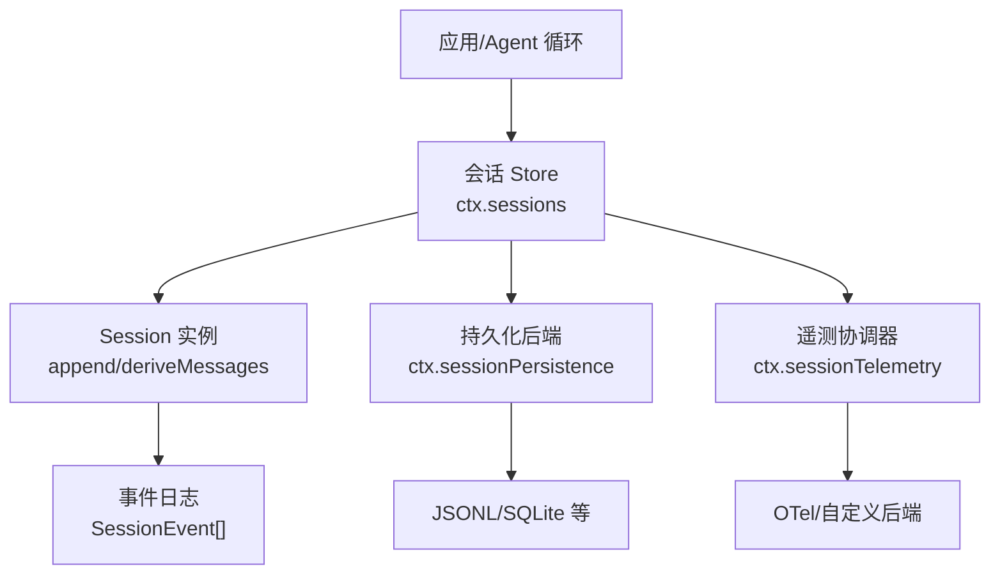
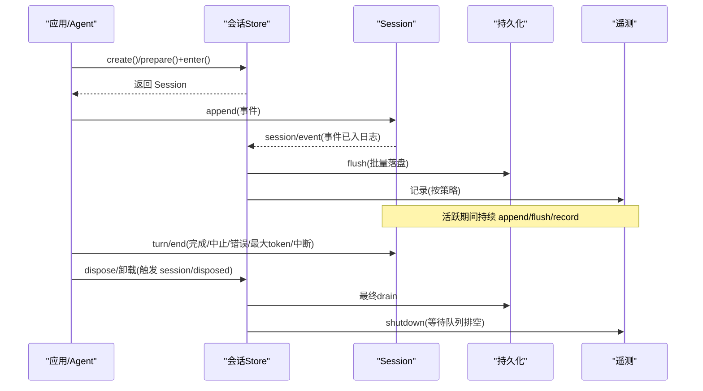
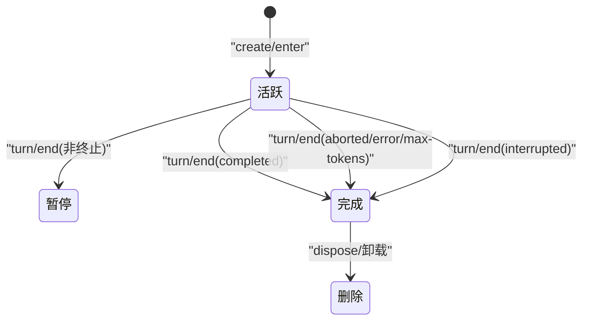
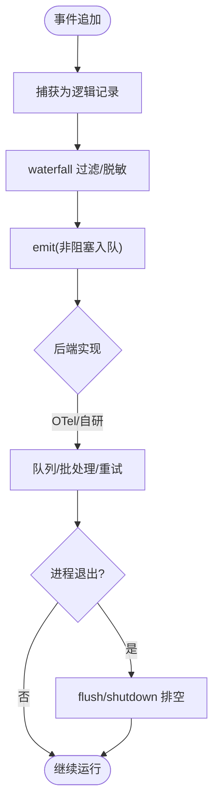
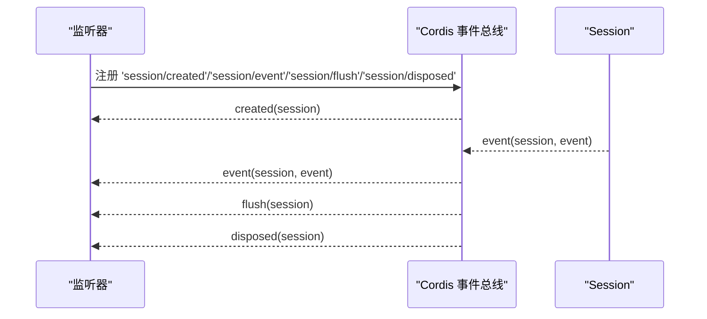
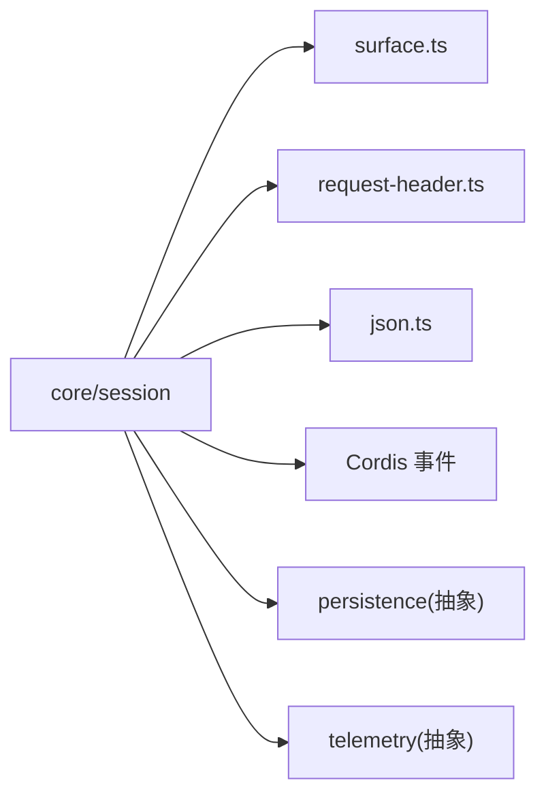

# 会话生命周期

<cite>
**本文引用的文件**
- [packages/core/session/src/index.ts](file://packages/core/session/src/index.ts)
- [docs/subsystems/session.md](file://docs/subsystems/session.md)
- [docs/subsystems/persistence.md](file://docs/subsystems/persistence.md)
- [docs/subsystems/session-telemetry.md](file://docs/subsystems/session-telemetry.md)
</cite>

## 目录
1. [简介](#简介)
2. [项目结构](#项目结构)
3. [核心组件](#核心组件)
4. [架构总览](#架构总览)
5. [详细组件分析](#详细组件分析)
6. [依赖关系分析](#依赖关系分析)
7. [性能考量](#性能考量)
8. [故障排查指南](#故障排查指南)
9. [结论](#结论)
10. [附录](#附录)

## 简介
本文件系统化说明“会话”从创建到销毁的完整生命周期，覆盖状态转换、资源管理、统计与遥测采集上报、监控调试方法、清理策略与垃圾回收，以及生命周期事件的监听与处理示例。文档以事件溯源为核心：会话是仅追加的事件日志，消息历史由日志派生；持久化、崩溃恢复、遥测与存储后端作为可插拔能力存在。

## 项目结构
围绕会话生命周期的关键位置：
- 内存会话与事件模型：packages/core/session（Session、事件类型、表面投影、Store）
- 持久化能力：docs/subsystems/persistence.md（抽象服务、后端、flush、崩溃恢复、头信息）
- 遥测能力：docs/subsystems/session-telemetry.md（采集点、记录、重放/去重、后端契约）
- 文档与类型定义：docs/subsystems/session.md（事件词汇、API、Cordis 事件）

图表来源
- [packages/core/session/src/index.ts:1-100](file://packages/core/session/src/index.ts#L1-L100)
- [docs/subsystems/persistence.md:1-120](file://docs/subsystems/persistence.md#L1-L120)
- [docs/subsystems/session-telemetry.md:1-120](file://docs/subsystems/session-telemetry.md#L1-L120)

章节来源
- [packages/core/session/src/index.ts:1-100](file://packages/core/session/src/index.ts#L1-L100)
- [docs/subsystems/session.md:1-120](file://docs/subsystems/session.md#L1-L120)
- [docs/subsystems/persistence.md:1-120](file://docs/subsystems/persistence.md#L1-L120)
- [docs/subsystems/session-telemetry.md:1-120](file://docs/subsystems/session-telemetry.md#L1-L120)

## 核心组件
- Session（会话）：仅追加事件日志、表面投影、派生消息、请求头/上下文折叠、首条活序列标记。
- SessionStore（会话存储）：创建、准备、进入、公告、列出、获取、分叉、刷新检查点。
- 持久化抽象（SessionPersistence）：定位、创建、追加、准备、加载、检查、读取、列表、快照。
- 遥测抽象（SessionTelemetryBackend/Sink）：捕获、记录、重放、去重、flush/shutdown。

章节来源
- [packages/core/session/src/index.ts:1-120](file://packages/core/session/src/index.ts#L1-L120)
- [docs/subsystems/session.md:359-519](file://docs/subsystems/session.md#L359-L519)
- [docs/subsystems/persistence.md:231-380](file://docs/subsystems/persistence.md#L231-L380)
- [docs/subsystems/session-telemetry.md:74-120](file://docs/subsystems/session-telemetry.md#L74-L120)

## 架构总览
会话生命周期由“创建—活跃—完成/中断—销毁”构成，贯穿事件日志、持久化写入、遥测上报与资源释放。

图表来源
- [packages/core/session/src/index.ts:42-86](file://packages/core/session/src/index.ts#L42-L86)
- [docs/subsystems/persistence.md:9-20](file://docs/subsystems/persistence.md#L9-L20)
- [docs/subsystems/session-telemetry.md:82-120](file://docs/subsystems/session-telemetry.md#L82-L120)

## 详细组件分析

### 会话状态与转换规则
- 活跃：存在未关闭的 turn/step 或 pending 输入时处于活跃态。
- 暂停：turn 结束但仍有待处理注入或后续步骤；或处于空闲等待唤醒。
- 完成：turn 正常结束（completed）。
- 中断/错误：aborted、error、max-tokens、interrupted（崩溃恢复合成）。
- 删除：从 Store 中移除并触发 disposed。

图表来源
- [docs/subsystems/session.md:540-576](file://docs/subsystems/session.md#L540-L576)
- [docs/subsystems/persistence.md:13-20](file://docs/subsystems/persistence.md#L13-L20)

章节来源
- [docs/subsystems/session.md:540-576](file://docs/subsystems/session.md#L540-L576)
- [docs/subsystems/persistence.md:13-20](file://docs/subsystems/persistence.md#L13-L20)

### 资源管理与释放
- 内存：Session.events 为不可变快照；消息通过 deriveMessages 缓存并冻结，避免重复克隆。
- 文件句柄：持久化后端在 flush/drain/shutdown 时确保写入完成与资源释放。
- 事件数据：所有 event.data 必须 JSON 可序列化，防止泄漏复杂对象。

章节来源
- [packages/core/session/src/index.ts:428-518](file://packages/core/session/src/index.ts#L428-L518)
- [docs/subsystems/persistence.md:9-20](file://docs/subsystems/persistence.md#L9-L20)
- [docs/subsystems/session.md:601-605](file://docs/subsystems/session.md#L601-L605)

### 统计信息与收集
- 每步 token 用量来自 assistant/chunk usage 或 assistant/message.usage。
- 轮次结束原因（TurnEndReason）用于区分成功、取消、错误、截断、崩溃恢复。
- 请求头/上下文事件记录路由与容量变化，便于统计调用配置。

章节来源
- [docs/subsystems/session.md:521-531](file://docs/subsystems/session.md#L521-L531)
- [docs/subsystems/session.md:540-576](file://docs/subsystems/session.md#L540-L576)
- [docs/subsystems/session.md:152-192](file://docs/subsystems/session.md#L152-L192)

### 遥测数据采集与上报
- 逻辑记录：channel（ledger/ops）、time、severity、attributes、body。
- 采集点：session/event 热路径同步入队；仅首个 assistant/chunk 发送，其余丢弃以避免冗余。
- 去重：接收端基于 (session.id, event.seq) 对 ledger 记录去重；ops 允许重复。
- 后端契约：emit（非阻塞）、可选 flush、shutdown（排空并静默）。

图表来源
- [docs/subsystems/session-telemetry.md:9-58](file://docs/subsystems/session-telemetry.md#L9-L58)
- [docs/subsystems/session-telemetry.md:74-120](file://docs/subsystems/session-telemetry.md#L74-L120)
- [docs/subsystems/session-telemetry.md:124-191](file://docs/subsystems/session-telemetry.md#L124-L191)

章节来源
- [docs/subsystems/session-telemetry.md:9-58](file://docs/subsystems/session-telemetry.md#L9-L58)
- [docs/subsystems/session-telemetry.md:74-120](file://docs/subsystems/session-telemetry.md#L74-L120)
- [docs/subsystems/session-telemetry.md:124-191](file://docs/subsystems/session-telemetry.md#L124-L191)

### 监控与调试
- 观察事件流：订阅 session/event 获取每个追加事件。
- 检查点：使用 ctx.sessions.flush 作为顺序与错误观察的检查点。
- 存活边界：session/end-seed 标记种子历史与本次生命周期写入的分界。
- 崩溃恢复：冷启动时补全中断的 turn，保证平衡。

章节来源
- [packages/core/session/src/index.ts:42-86](file://packages/core/session/src/index.ts#L42-L86)
- [docs/subsystems/session.md:583-591](file://docs/subsystems/session.md#L583-L591)
- [docs/subsystems/persistence.md:13-20](file://docs/subsystems/persistence.md#L13-L20)

### 清理策略与垃圾回收
- 批量写窗口：首次待写事件开启固定窗口，后续事件加入不重置截止时间；显式 flush 立即排空。
- 拒绝与重试：后台写入失败保留事件并暂停自动重试；新事件开启新窗口。
- 析构：dispose 执行最终 drain；遥测后端 shutdown 等待 SDK 排空。

章节来源
- [docs/subsystems/persistence.md:9-20](file://docs/subsystems/persistence.md#L9-L20)
- [docs/subsystems/session-telemetry.md:105-118](file://docs/subsystems/session-telemetry.md#L105-L118)

### 生命周期事件监听与处理示例
- 创建：监听 session/created，获取刚进入 Store 的 Session。
- 事件：监听 session/event，消费每个追加事件（持久化、遥测、审计）。
- 刷新：监听 session/flush，作为持久化检查点。
- 销毁：监听 session/disposed，进行收尾清理。

图表来源
- [packages/core/session/src/index.ts:42-86](file://packages/core/session/src/index.ts#L42-L86)

章节来源
- [packages/core/session/src/index.ts:42-86](file://packages/core/session/src/index.ts#L42-L86)

## 依赖关系分析
- Session 依赖 surface 投影、请求头折叠、JSON 校验与冻结。
- Store 依赖 Cordis 事件总线发布 session/* 事件。
- 持久化与遥测通过能力 seam 接入，不耦合核心循环。

图表来源
- [packages/core/session/src/index.ts:1-35](file://packages/core/session/src/index.ts#L1-L35)

章节来源
- [packages/core/session/src/index.ts:1-35](file://packages/core/session/src/index.ts#L1-L35)

## 性能考量
- 追加路径零阻塞 I/O：持久化插件异步缓冲，flush 作为检查点。
- 派生消息缓存：每个表面节点仅投影一次，重写时重建。
- 遥测最小化：仅首 chunk 上送，减少带宽与开销。
- 批量写窗口：控制批大小与超时，避免长尾延迟。

章节来源
- [packages/core/session/src/index.ts:428-518](file://packages/core/session/src/index.ts#L428-L518)
- [docs/subsystems/persistence.md:9-20](file://docs/subsystems/persistence.md#L9-L20)
- [docs/subsystems/session-telemetry.md:57-58](file://docs/subsystems/session-telemetry.md#L57-L58)

## 故障排查指南
- 版本不兼容：后端遇到未知格式会拒绝并提示升级方向。
- 事件形状非法：seed/load 边界校验消息与请求头，缺失 provider/model 将拒绝。
- 崩溃恢复：冷加载自动闭合中断 turn，保持平衡；不会改写已提交事件。
- 遥测丢失：best-effort 投递，接收端需去重；shutdown 前确保 drain。

章节来源
- [docs/subsystems/persistence.md:92-99](file://docs/subsystems/persistence.md#L92-L99)
- [docs/subsystems/persistence.md:13-20](file://docs/subsystems/persistence.md#L13-L20)
- [docs/subsystems/session-telemetry.md:57-58](file://docs/subsystems/session-telemetry.md#L57-L58)

## 结论
会话生命周期以事件溯源为中心，通过 Store 统一管理创建、活跃、完成与销毁；持久化与遥测作为可插拔能力解耦核心流程。借助严格的校验、检查点与崩溃恢复，系统在保证一致性的同时提供高吞吐与可观测性。

## 附录
- 事件词汇与 API：参见会话文档中的 SessionEventMap 与 Session 公共 API。
- 持久化语义：参见持久化文档中的 flush、崩溃恢复与后端契约。
- 遥测语义：参见遥测文档中的记录结构、水线与后端契约。