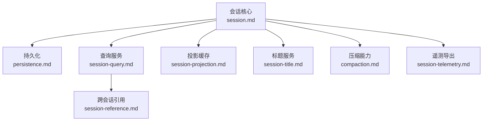
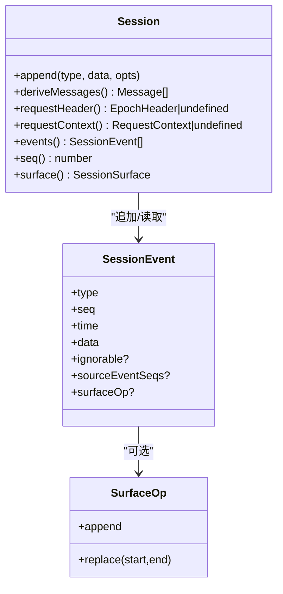
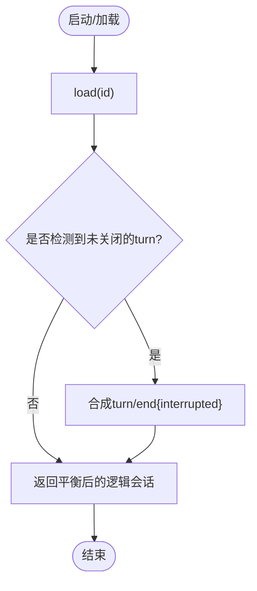
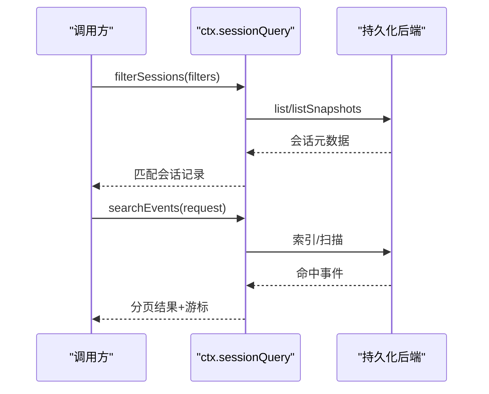
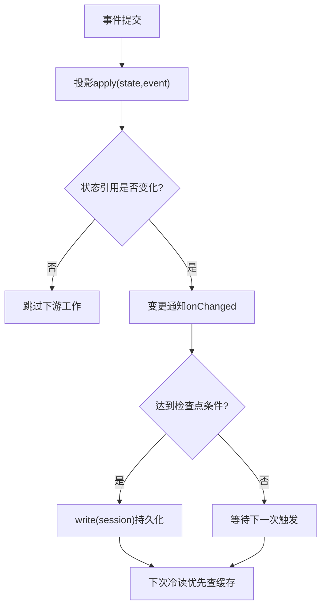
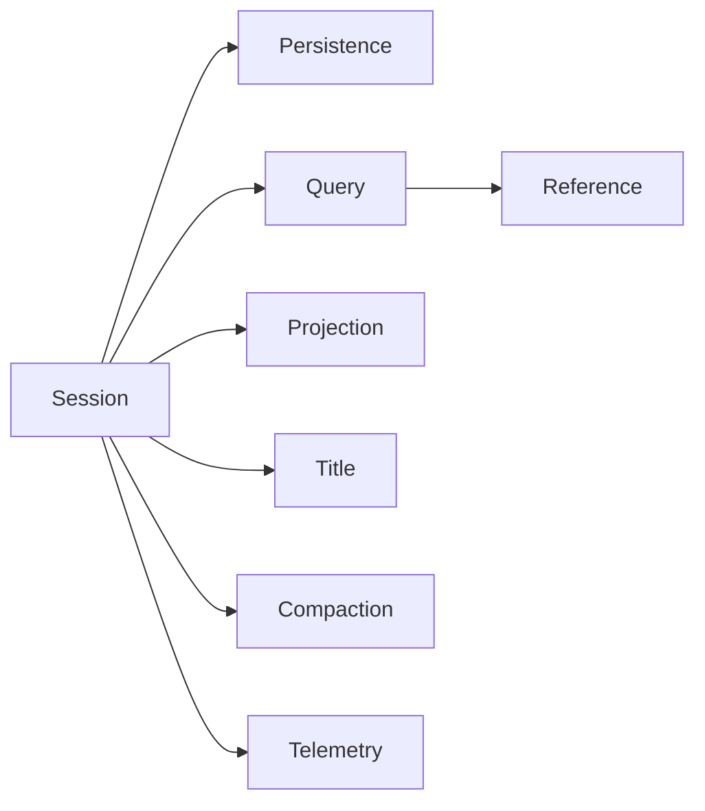

# 会话管理

<cite>
**本文引用的文件**
- [docs/subsystems/session.md](file://docs/subsystems/session.md)
- [docs/subsystems/persistence.md](file://docs/subsystems/persistence.md)
- [docs/subsystems/session-query.md](file://docs/subsystems/session-query.md)
- [docs/subsystems/session-reference.md](file://docs/subsystems/session-reference.md)
- [docs/subsystems/compaction.md](file://docs/subsystems/compaction.md)
- [docs/subsystems/session-projection.md](file://docs/subsystems/session-projection.md)
- [docs/subsystems/session-title.md](file://docs/subsystems/session-title.md)
- [docs/subsystems/session-telemetry.md](file://docs/subsystems/session-telemetry.md)
</cite>

## 目录
1. [简介](#简介)
2. [项目结构](#项目结构)
3. [核心组件](#核心组件)
4. [架构总览](#架构总览)
5. [详细组件分析](#详细组件分析)
6. [依赖关系分析](#依赖关系分析)
7. [性能考量](#性能考量)
8. [故障排查指南](#故障排查指南)
9. [结论](#结论)
10. [附录：API 使用示例与最佳实践](#附录api-使用示例与最佳实践)

## 简介
本文件系统化阐述会话（Session）的概念、生命周期、状态管理与持久化策略，覆盖会话的创建、更新、查询与销毁流程；说明检查点策略（自动保存与恢复）、会话与智能体的关系、会话在对话历史中的作用；提供配置选项与最佳实践，并给出实际 API 使用示例与错误处理、异常恢复机制。

## 项目结构
围绕“会话”的核心文档分布在 subsystems 目录下，分别定义事件模型、持久化、查询、投影、标题、压缩、遥测等能力。下图展示了这些子系统之间的职责边界与交互关系。



图表来源
- [docs/subsystems/session.md:1-80](file://docs/subsystems/session.md#L1-L80)
- [docs/subsystems/persistence.md:1-40](file://docs/subsystems/persistence.md#L1-L40)
- [docs/subsystems/session-query.md:1-30](file://docs/subsystems/session-query.md#L1-L30)
- [docs/subsystems/session-projection.md:1-30](file://docs/subsystems/session-projection.md#L1-L30)
- [docs/subsystems/session-title.md:1-20](file://docs/subsystems/session-title.md#L1-L20)
- [docs/subsystems/compaction.md:1-25](file://docs/subsystems/compaction.md#L1-L25)
- [docs/subsystems/session-telemetry.md:1-20](file://docs/subsystems/session-telemetry.md#L1-L20)

章节来源
- [docs/subsystems/session.md:1-80](file://docs/subsystems/session.md#L1-L80)
- [docs/subsystems/persistence.md:1-40](file://docs/subsystems/persistence.md#L1-L40)

## 核心组件
- 会话与事件模型：以追加式事件日志为唯一事实源，消息历史由事件推导，保证可重放与一致性。
- 持久化：通过抽象服务与后端实现（JSONL、SQLite）将事件日志落盘，支持崩溃恢复与格式拒绝。
- 查询：提供跨会话与单会话的过滤、全文检索、血缘追踪、窗口读取与事件关系追溯。
- 投影：按会话维度维护派生状态快照，支持冷读恢复与增量写入缓存。
- 标题：基于事件日志的最新标题折叠，支持用户手动命名与异步生成。
- 压缩：对历史进行摘要压缩，减少上下文占用，同时保持表面一致性与工具调用配对。
- 遥测：将会话事件映射为遥测记录，支持脱敏、去重与后端管道。

章节来源
- [docs/subsystems/session.md:194-519](file://docs/subsystems/session.md#L194-L519)
- [docs/subsystems/persistence.md:231-380](file://docs/subsystems/persistence.md#L231-L380)
- [docs/subsystems/session-query.md:9-141](file://docs/subsystems/session-query.md#L9-L141)
- [docs/subsystems/session-projection.md:9-90](file://docs/subsystems/session-projection.md#L9-L90)
- [docs/subsystems/session-title.md:9-63](file://docs/subsystems/session-title.md#L9-L63)
- [docs/subsystems/compaction.md:9-87](file://docs/subsystems/compaction.md#L9-L87)
- [docs/subsystems/session-telemetry.md:9-58](file://docs/subsystems/session-telemetry.md#L9-L58)

## 架构总览
下图展示会话从创建到销毁的全生命周期，以及各子系统在关键阶段的参与点。

```mermaid
sequenceDiagram
participant Client as "调用方"
participant Store as "会话存储(ctx.sessions)"
participant Session as "会话(Session)"
participant Persist as "持久化(ctx.sessionPersistence)"
participant Query as "查询(ctx.sessionQuery)"
participant Proj as "投影(ctx.sessionProjections)"
participant Title as "标题(ctx.sessionTitle)"
participant Compact as "压缩(ctx.compaction)"
participant Telemetry as "遥测(ctx.sessionTelemetry)"
Client->>Store : create(id, options)
Store-->>Client : 返回已进入并公告的Session
Client->>Session : append(事件)
Session-->>Telemetry : 捕获事件并发送遥测
Session-->>Proj : 驱动投影状态变更
Note over Session,Persist : 批量缓冲，等待flush或turn/end
Client->>Persist : flush(session)
Persist-->>Client : 确认落盘完成
Client->>Query : filterSessions / searchEvents
Query-->>Client : 返回会话/事件结果
Client->>Title : get/refresh/rename
Title-->>Client : 最新标题快照
Client->>Compact : compactIfNeeded/compactNow
Compact-->>Client : 压缩结果或无操作
Client->>Store : dispose/退出作用域
Store-->>Client : 清理与会话相关资源
```

图表来源
- [docs/subsystems/session.md:617-745](file://docs/subsystems/session.md#L617-L745)
- [docs/subsystems/persistence.md:9-20](file://docs/subsystems/persistence.md#L9-L20)
- [docs/subsystems/session-query.md:367-490](file://docs/subsystems/session-query.md#L367-L490)
- [docs/subsystems/session-projection.md:103-257](file://docs/subsystems/session-projection.md#L103-L257)
- [docs/subsystems/session-title.md:156-203](file://docs/subsystems/session-title.md#L156-L203)
- [docs/subsystems/compaction.md:128-191](file://docs/subsystems/compaction.md#L128-L191)
- [docs/subsystems/session-telemetry.md:136-157](file://docs/subsystems/session-telemetry.md#L136-L157)

## 详细组件分析

### 会话与事件模型
- 会话是追加式事件日志，包含 turn/step 边界、用户消息、助手消息、工具调用/结果、请求头/上下文等。
- 消息历史由有序表面（surface）推导，替换操作可覆盖历史片段，保证紧凑与一致性。
- 首条“活写”位置通过 end-seed 标记区分种子历史与本次生命周期新增事件。



图表来源
- [docs/subsystems/session.md:194-357](file://docs/subsystems/session.md#L194-L357)
- [docs/subsystems/session.md:359-519](file://docs/subsystems/session.md#L359-L519)

章节来源
- [docs/subsystems/session.md:194-519](file://docs/subsystems/session.md#L194-L519)

### 持久化与崩溃恢复
- 持久化抽象服务提供 locate/create/append/prepare/load/inspect/readFrom/list/listSnapshots。
- JSONL 与 SQLite 两种后端实现同一契约；JSONL 支持原子写入与中断恢复，SQLite 行级存储事件。
- 崩溃恢复会在冷加载时闭合未结束的 turn，保留已持久化的事件，不截断长任务历史。
- 格式拒绝：版本不兼容直接拒绝，避免误读未来或旧格式。



图表来源
- [docs/subsystems/persistence.md:13-20](file://docs/subsystems/persistence.md#L13-L20)
- [docs/subsystems/persistence.md:231-380](file://docs/subsystems/persistence.md#L231-L380)

章节来源
- [docs/subsystems/persistence.md:9-20](file://docs/subsystems/persistence.md#L9-L20)
- [docs/subsystems/persistence.md:231-380](file://docs/subsystems/persistence.md#L231-L380)

### 会话查询与跨会话引用
- 查询引擎提供会话列表、事件过滤、全文搜索、血缘追踪、窗口读取与事件关系追溯。
- 跨会话引用允许在消息中安全地引入其他会话的当前表面内容，生成不可信但可读的上下文。



图表来源
- [docs/subsystems/session-query.md:367-490](file://docs/subsystems/session-query.md#L367-L490)
- [docs/subsystems/session-reference.md:77-103](file://docs/subsystems/session-reference.md#L77-L103)

章节来源
- [docs/subsystems/session-query.md:9-141](file://docs/subsystems/session-query.md#L9-L141)
- [docs/subsystems/session-reference.md:9-55](file://docs/subsystems/session-reference.md#L9-L55)

### 投影与检查点策略
- 投影单元以纯函数方式将每个提交事件转换为派生状态，支持快照与变更通知。
- 检查点策略：
  - 强制检查点：turn/end、会话销毁时写入缓存。
  - 节流写入：按计数/间隔触发后台写入。
  - 冷读恢复：从缓存行 + readFrom 尾部增量重放，失败软处理并自愈。



图表来源
- [docs/subsystems/session-projection.md:9-90](file://docs/subsystems/session-projection.md#L9-L90)
- [docs/subsystems/session-projection.md:103-147](file://docs/subsystems/session-projection.md#L103-L147)

章节来源
- [docs/subsystems/session-projection.md:9-90](file://docs/subsystems/session-projection.md#L9-L90)
- [docs/subsystems/session-projection.md:103-257](file://docs/subsystems/session-projection.md#L103-L257)

### 标题服务
- 标题来自事件日志的折叠结果，支持用户手动命名（锁定自动刷新）与异步提供者生成。
- 每次辅助请求均记录路由、系统提示、消息序列与输出限制，便于审计与重放。

章节来源
- [docs/subsystems/session-title.md:9-63](file://docs/subsystems/session-title.md#L9-L63)
- [docs/subsystems/session-title.md:156-203](file://docs/subsystems/session-title.md#L156-L203)

### 压缩能力
- 压缩通过 compaction/* 事件记录锁、摘要、被遮蔽范围与令牌估算，并以 user/message 的 replace 操作更新表面。
- 自动压力与上下文溢出触发压缩；手动压缩可在空闲时段运行；区域压缩需保证工具调用/结果配对。

章节来源
- [docs/subsystems/compaction.md:9-87](file://docs/subsystems/compaction.md#L9-L87)
- [docs/subsystems/compaction.md:128-191](file://docs/subsystems/compaction.md#L128-L191)

### 遥测导出
- 将会话事件映射为遥测记录，仅首条 assistant/chunk 作为流开始信号，其余丢弃以避免冗余。
- 支持脱敏水线、去重策略与后端管道；共享策略对外披露，消费端据此渲染提示。

章节来源
- [docs/subsystems/session-telemetry.md:9-58](file://docs/subsystems/session-telemetry.md#L9-L58)
- [docs/subsystems/session-telemetry.md:136-157](file://docs/subsystems/session-telemetry.md#L136-L157)

## 依赖关系分析
- 会话核心依赖持久化、查询、投影、标题、压缩与遥测等能力，形成松耦合的能力缝。
- 查询与引用依赖持久化与事件模型；投影依赖事件流；标题依赖事件折叠；压缩依赖会话表面与 LLM；遥测依赖事件热路径。



图表来源
- [docs/subsystems/session.md:617-745](file://docs/subsystems/session.md#L617-L745)
- [docs/subsystems/persistence.md:231-380](file://docs/subsystems/persistence.md#L231-L380)
- [docs/subsystems/session-query.md:367-490](file://docs/subsystems/session-query.md#L367-L490)
- [docs/subsystems/session-reference.md:77-103](file://docs/subsystems/session-reference.md#L77-L103)
- [docs/subsystems/session-projection.md:103-257](file://docs/subsystems/session-projection.md#L103-L257)
- [docs/subsystems/session-title.md:156-203](file://docs/subsystems/session-title.md#L156-L203)
- [docs/subsystems/compaction.md:128-191](file://docs/subsystems/compaction.md#L128-L191)
- [docs/subsystems/session-telemetry.md:136-157](file://docs/subsystems/session-telemetry.md#L136-L157)

章节来源
- [docs/subsystems/session.md:617-745](file://docs/subsystems/session.md#L617-L745)
- [docs/subsystems/persistence.md:231-380](file://docs/subsystems/persistence.md#L231-L380)

## 性能考量
- 事件追加为同步通知，持久化插件异步缓冲，避免阻塞生产路径。
- 投影状态变更仅在引用变化时触发下游工作，降低无用计算。
- 查询支持分页与游标，避免全量扫描；全文检索由后端优化。
- 压缩在压力或溢出时主动缩减上下文，减少后续请求成本。
- 遥测采用非阻塞队列与批处理，不影响主循环。

[本节为通用指导，无需特定文件来源]

## 故障排查指南
- 格式拒绝：当后端无法忠实解读日志时，会抛出格式不支持错误，指示升级方向而非损坏。
- 崩溃恢复：冷加载检测未关闭 turn 并合成中断结束事件，确保逻辑平衡。
- 查询错误：提供稳定错误码分类（如无效配置、索引失败、会话不存在等），便于定位。
- 引用错误：自引用、超限、读取失败、预算超支与取消等错误代码明确。
- 压缩错误：忙、取消、范围变更、摘要失败、提交失败、持久化失败等预期错误类。
- 遥测：协调器内捕获异常，不会传播至主循环；后端失败软处理，重试与丢失由 SDK 负责。

章节来源
- [docs/subsystems/persistence.md:92-99](file://docs/subsystems/persistence.md#L92-L99)
- [docs/subsystems/persistence.md:13-20](file://docs/subsystems/persistence.md#L13-L20)
- [docs/subsystems/session-query.md:333-357](file://docs/subsystems/session-query.md#L333-L357)
- [docs/subsystems/session-reference.md:53-67](file://docs/subsystems/session-reference.md#L53-L67)
- [docs/subsystems/compaction.md:71-87](file://docs/subsystems/compaction.md#L71-L87)
- [docs/subsystems/session-telemetry.md:59-62](file://docs/subsystems/session-telemetry.md#L59-L62)

## 结论
会话以事件日志为核心，结合持久化、查询、投影、标题、压缩与遥测等能力，形成高内聚、低耦合的体系。通过明确的检查点策略与崩溃恢复机制，保障数据一致性与可用性；通过查询与引用扩展了跨会话协作能力；通过压缩与投影优化了性能与体验。

[本节为总结性内容，无需特定文件来源]

## 附录：API 使用示例与最佳实践

### 会话创建、更新、查询与销毁
- 创建会话：通过会话存储创建并进入，返回已公告的会话实例。
- 更新会话：调用 append 追加事件，注意 surface 类型需声明如何加入有序表面。
- 查询会话：使用查询服务过滤会话、搜索事件、读取窗口与追溯关系。
- 销毁会话：离开作用域或显式释放，确保持久化与投影缓存正确清理。

章节来源
- [docs/subsystems/session.md:617-745](file://docs/subsystems/session.md#L617-L745)
- [docs/subsystems/session.md:359-519](file://docs/subsystems/session.md#L359-L519)
- [docs/subsystems/session-query.md:367-490](file://docs/subsystems/session-query.md#L367-L490)

### 检查点策略（自动保存与恢复）
- 强制检查点：turn/end 与会话销毁时写入投影缓存。
- 节流写入：按计数/间隔触发后台写入，避免频繁 IO。
- 恢复策略：冷读优先查缓存，缺失则从持久化 readFrom 尾部增量重放，失败软处理并自愈。

章节来源
- [docs/subsystems/session-projection.md:103-147](file://docs/subsystems/session-projection.md#L103-L147)
- [docs/subsystems/session-projection.md:204-257](file://docs/subsystems/session-projection.md#L204-L257)

### 会话与智能体的关系
- 会话属于智能体生命周期的一部分，智能体通过会话记录其全部交互历史。
- 智能体在 turn/step 边界推进工作，会话事件承载输入、输出与工具执行结果。
- 智能体可通过查询与引用访问其他会话的历史与当前表面，实现协作。

章节来源
- [docs/subsystems/session.md:532-581](file://docs/subsystems/session.md#L532-L581)
- [docs/subsystems/session-reference.md:9-55](file://docs/subsystems/session-reference.md#L9-L55)

### 会话在对话历史中的作用
- 会话事件构成唯一事实源，消息历史由有序表面推导，支持替换与压缩。
- 工具调用/结果与助手消息成对出现，保证可重放与一致性。
- 请求头与上下文事件记录路由与容量信息，便于重建请求。

章节来源
- [docs/subsystems/session.md:152-192](file://docs/subsystems/session.md#L152-L192)
- [docs/subsystems/session.md:521-531](file://docs/subsystems/session.md#L521-L531)

### 会话配置选项与最佳实践
- 持久化后端选择：JSONL 适合逐会话文件归档；SQLite 适合集中存储与高效查询。
- 查询配置：设置默认页大小、最大页大小、片段长度、并发度等参数。
- 投影缓存：合理设置节流阈值与强制检查点，平衡一致性与性能。
- 压缩策略：根据压力与上下文溢出阈值启用自动压缩，必要时手动压缩。
- 标题服务：注册提供者或使用内置回退，用户手动命名可锁定自动刷新。
- 遥测：部署选择共享策略，配置脱敏规则与后端管道。

章节来源
- [docs/subsystems/persistence.md:231-380](file://docs/subsystems/persistence.md#L231-L380)
- [docs/subsystems/session-query.md:103-141](file://docs/subsystems/session-query.md#L103-L141)
- [docs/subsystems/session-projection.md:103-147](file://docs/subsystems/session-projection.md#L103-L147)
- [docs/subsystems/compaction.md:60-87](file://docs/subsystems/compaction.md#L60-L87)
- [docs/subsystems/session-title.md:87-146](file://docs/subsystems/session-title.md#L87-L146)
- [docs/subsystems/session-telemetry.md:59-62](file://docs/subsystems/session-telemetry.md#L59-L62)

### 错误处理与异常恢复机制
- 持久化：格式拒绝与崩溃恢复确保数据完整性；冷加载闭合未结束 turn。
- 查询：稳定错误码分类，便于上层统一处理。
- 引用：自引用、超限、读取失败、预算超支与取消等错误明确。
- 压缩：预期错误类覆盖忙、取消、范围变更、摘要失败、提交失败、持久化失败。
- 遥测：协调器内捕获异常，后端失败软处理，重试与丢失由 SDK 负责。

章节来源
- [docs/subsystems/persistence.md:92-99](file://docs/subsystems/persistence.md#L92-L99)
- [docs/subsystems/persistence.md:13-20](file://docs/subsystems/persistence.md#L13-L20)
- [docs/subsystems/session-query.md:333-357](file://docs/subsystems/session-query.md#L333-L357)
- [docs/subsystems/session-reference.md:53-67](file://docs/subsystems/session-reference.md#L53-L67)
- [docs/subsystems/compaction.md:71-87](file://docs/subsystems/compaction.md#L71-L87)
- [docs/subsystems/session-telemetry.md:59-62](file://docs/subsystems/session-telemetry.md#L59-L62)