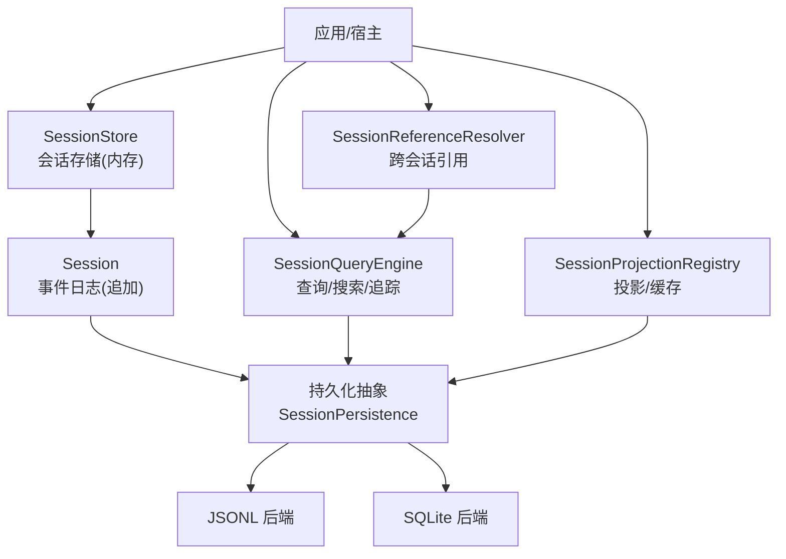
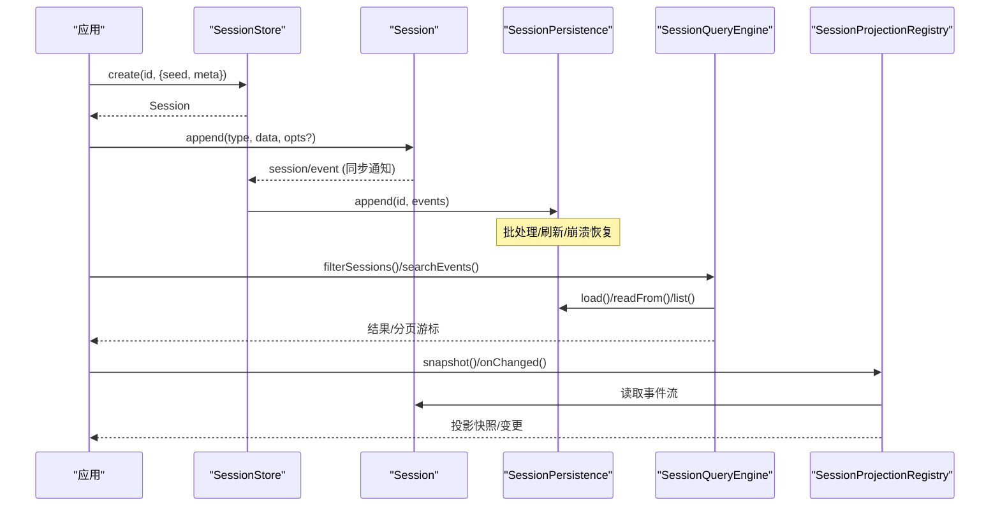
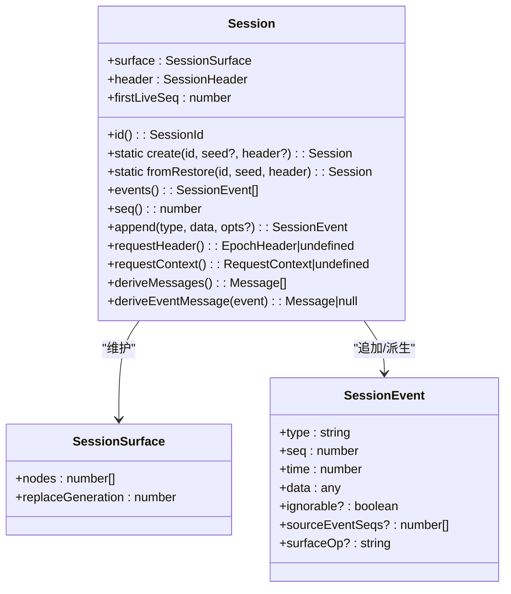
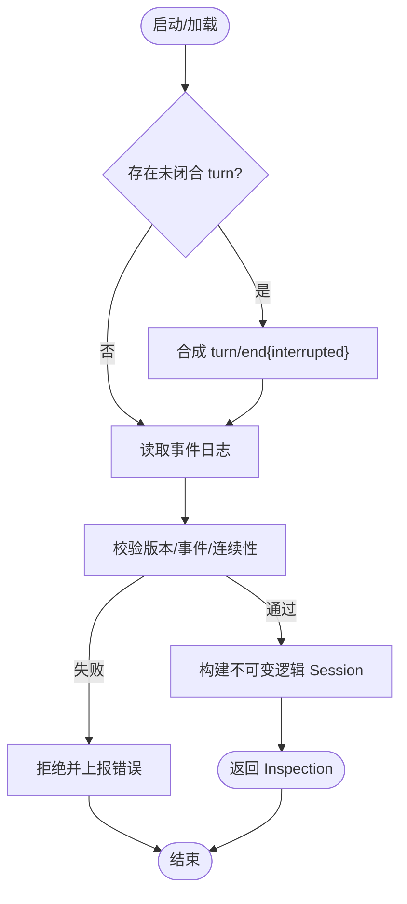
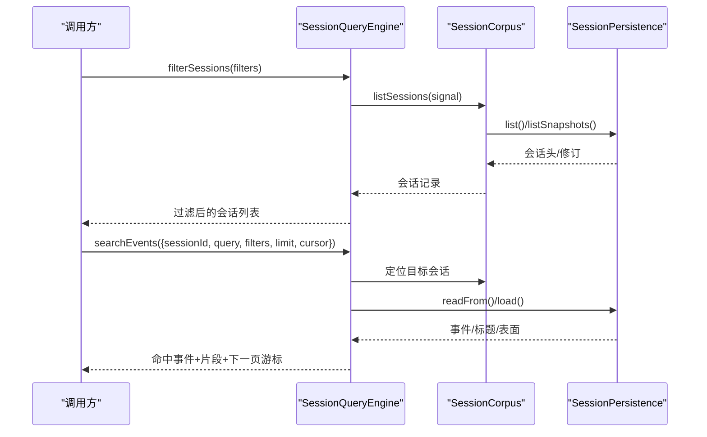
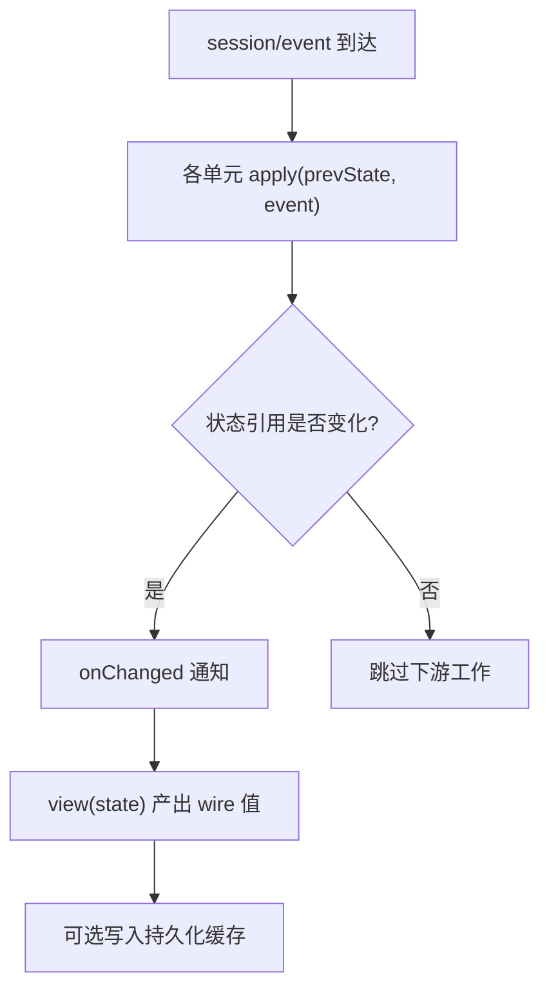
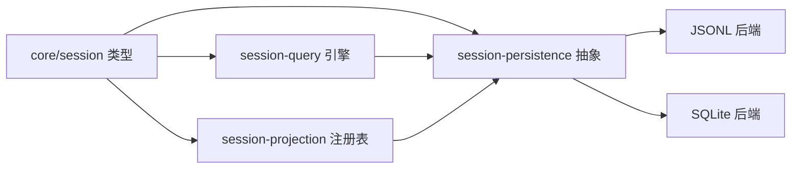

# 会话系统

<cite>
**本文引用的文件**
- [packages/core/session/src/types.ts](file://packages/core/session/src/types.ts)
- [docs/subsystems/session.md](file://docs/subsystems/session.md)
- [docs/subsystems/persistence.md](file://docs/subsystems/persistence.md)
- [docs/subsystems/session-query.md](file://docs/subsystems/session-query.md)
- [docs/subsystems/session-projection.md](file://docs/subsystems/session-projection.md)
- [docs/subsystems/session-reference.md](file://docs/subsystems/session-reference.md)
- [packages/session-query/session-query/src/index.ts](file://packages/session-query/session-query/src/index.ts)
</cite>

## 目录
1. [简介](#简介)
2. [项目结构](#项目结构)
3. [核心组件](#核心组件)
4. [架构总览](#架构总览)
5. [详细组件分析](#详细组件分析)
6. [依赖关系分析](#依赖关系分析)
7. [性能考量](#性能考量)
8. [故障排查指南](#故障排查指南)
9. [结论](#结论)
10. [附录：API 使用示例与集成模式](#附录api-使用示例与集成模式)

## 简介
本文件系统性地文档化智能体平台的“会话”能力。会话是以事件溯源为核心的不可变追加日志，作为智能体交互历史的唯一事实来源；消息历史由日志派生而非单独存储。持久化层负责将事件日志安全地落盘、崩溃恢复与版本兼容；查询层提供跨会话/单会话的检索、过滤、全文搜索与关系追踪；投影层为客户端提供按会话聚合的状态快照与变更推送。本文覆盖会话的创建、管理、销毁、状态持久化（JSONL/SQLite）、查询接口、生命周期管理、配置选项与最佳实践，以及备份迁移与兼容性处理，并给出实际 API 使用示例和集成模式。

## 项目结构
围绕会话的核心代码与文档分布在以下位置：
- 核心类型与事件模型：packages/core/session/src/types.ts
- 会话概念与事件词汇：docs/subsystems/session.md
- 持久化抽象与后端：docs/subsystems/persistence.md
- 会话查询服务与过滤器：docs/subsystems/session-query.md, packages/session-query/session-query/src/index.ts
- 会话投影与缓存：docs/subsystems/session-projection.md
- 跨会话引用与上下文准备：docs/subsystems/session-reference.md

图表来源
- [docs/subsystems/session.md:359-519](file://docs/subsystems/session.md#L359-L519)
- [docs/subsystems/persistence.md:231-380](file://docs/subsystems/persistence.md#L231-L380)
- [docs/subsystems/session-query.md:367-490](file://docs/subsystems/session-query.md#L367-L490)
- [docs/subsystems/session-projection.md:91-257](file://docs/subsystems/session-projection.md#L91-L257)

章节来源
- [docs/subsystems/session.md:1-800](file://docs/subsystems/session.md#L1-L800)
- [docs/subsystems/persistence.md:1-386](file://docs/subsystems/persistence.md#L1-L386)
- [docs/subsystems/session-query.md:1-496](file://docs/subsystems/session-query.md#L1-L496)
- [docs/subsystems/session-projection.md:1-263](file://docs/subsystems/session-projection.md#L1-L263)
- [packages/session-query/session-query/src/index.ts:1-200](file://packages/session-query/session-query/src/index.ts#L1-L200)

## 核心组件
- 会话与事件模型
  - SessionEventMap：定义所有会话事件类型（turn/step/user/assistant/tool/request 等），支持插件扩展。
  - SurfaceEventType：产生 LLM 消息的事件子集（user/message、assistant/message、tool/result）。
  - SurfaceOp：控制事件如何进入有序表面（append 或 replace）。
  - Session：追加式事件日志，维护 surface 投影、派生消息、请求头/路由上下文等。
- 持久化
  - SessionPersistence：抽象服务，定义 locate/create/append/prepare/load/inspect/readFrom/list/listSnapshots。
  - JSONL 后端：每会话独立 JSONL 文件，压缩/原子写入、崩溃恢复。
  - SQLite 后端：每事件一行，字段与事件一一对应。
- 查询
  - SessionQueryEngine：统一查询入口，提供 list/filter/search/readSurface/trace 等。
  - 过滤器：会话级与会话事件级过滤器，AND/OR 组合，文本语义扫描。
  - 全文搜索：跨会话分组命中、单会话内事件搜索，游标分页。
- 投影
  - SessionProjectionRegistry：订阅 session/event，驱动纯函数 apply，产出完整值视图。
  - 持久化投影缓存：冷读/热写结合，checkpoint/coldSnapshot 等。
- 引用
  - SessionReferenceResolver：跨会话引用解析，生成可注入的上下文。

章节来源
- [docs/subsystems/session.md:9-358](file://docs/subsystems/session.md#L9-L358)
- [docs/subsystems/persistence.md:21-237](file://docs/subsystems/persistence.md#L21-L237)
- [docs/subsystems/session-query.md:9-218](file://docs/subsystems/session-query.md#L9-L218)
- [docs/subsystems/session-projection.md:9-107](file://docs/subsystems/session-projection.md#L9-L107)
- [docs/subsystems/session-reference.md:9-103](file://docs/subsystems/session-reference.md#L9-L103)

## 架构总览
会话系统采用“事件溯源 + 能力缝”的分层设计：
- 内存层：Session 维护追加日志与表面投影，提供 deriveMessages() 派生消息。
- 持久化层：SessionPersistence 抽象出多后端实现，保证连续 seq、JSON 可序列化、崩溃恢复。
- 查询层：SessionQueryEngine 屏蔽后端差异，提供一致的数据访问与搜索能力。
- 投影层：SessionProjectionRegistry 将事件流转换为稳定的业务状态视图，供客户端消费。
- 引用层：SessionReferenceResolver 在消息中安全嵌入跨会话上下文。

图表来源
- [docs/subsystems/session.md:359-519](file://docs/subsystems/session.md#L359-L519)
- [docs/subsystems/persistence.md:231-380](file://docs/subsystems/persistence.md#L231-L380)
- [docs/subsystems/session-query.md:367-490](file://docs/subsystems/session-query.md#L367-L490)
- [docs/subsystems/session-projection.md:91-257](file://docs/subsystems/session-projection.md#L91-L257)

## 详细组件分析

### 会话与事件模型（Session）
- 事件词汇：SessionEventMap 定义了 turn/start/end、step/start/end、user/message、assistant/chunk/message、tool/call/result、request/header/context、session/end-seed 等。
- 表面机制：SurfaceEventType 仅包含 user/message、assistant/message、tool/result；SurfaceOp 控制 append 或 replace。
- 派生历史：deriveMessages() 基于有序表面节点推导模型可见消息，跳过 chunk 等结构事件。
- 首活边界：firstLiveSeq 与 session/end-seed 标记构造种子与本次进程新增事件的边界。
- 公开 API：create/fromRestore、append、events/seq、requestHeader()/requestContext()、deriveMessages()/deriveEventMessage()。

图表来源
- [docs/subsystems/session.md:194-519](file://docs/subsystems/session.md#L194-L519)

章节来源
- [docs/subsystems/session.md:9-358](file://docs/subsystems/session.md#L9-L358)
- [docs/subsystems/session.md:359-519](file://docs/subsystems/session.md#L359-L519)
- [packages/core/session/src/types.ts:21-177](file://packages/core/session/src/types.ts#L21-L177)

### 持久化（JSONL/SQLite）
- 刷新检查点：session/event 同步通知，持久化插件异步批处理；session/flush 触发排空与错误观察。
- 崩溃恢复：冷加载时若发现未闭合的 turn/start，会合成 turn/end{kind:'interrupted'} 保持平衡，不截断已持久化事件。
- 元数据头：SessionHeader 携带 version/id/createdAt/cwd/parentSession/seedLength/origin/delegationDepth/agentPreset。
- 格式拒绝：version 不匹配直接拒绝，未知事件类型若无 ignorable 则拒绝，避免静默误读。
- 后端能力：locate/readRaw/create/append/prepare/load/inspect/readFrom/list/listSnapshots。
- 原始制品：readRaw 返回后端原始文本（如 JSONL 解压后内容），保留编码细节。

图表来源
- [docs/subsystems/persistence.md:13-20](file://docs/subsystems/persistence.md#L13-L20)
- [docs/subsystems/persistence.md:92-141](file://docs/subsystems/persistence.md#L92-L141)
- [docs/subsystems/persistence.md:231-380](file://docs/subsystems/persistence.md#L231-L380)

章节来源
- [docs/subsystems/persistence.md:1-237](file://docs/subsystems/persistence.md#L1-L237)
- [docs/subsystems/persistence.md:231-380](file://docs/subsystems/persistence.md#L231-L380)
- [packages/core/session/src/types.ts:58-122](file://packages/core/session/src/types.ts#L58-L122)

### 会话查询（SessionQueryEngine）
- 逻辑记录：SessionRecord/SessionEventRecord/SessionLogSnapshot/SessionSurfaceSnapshot/SessionTitleObservation。
- 过滤器：会话级（id/cwd/created-at/parent/availability）与事件级（seq/time/type/surface/text）；数组 AND，列表 OR。
- 全文搜索：searchSessions（跨会话分组命中）与 searchEvents（单会话内事件搜索），返回游标分页。
- 关系追踪：traceEvent 提供替换链、源事件序列、派生事件序列等。
- 窗口读取：readEvent 支持目标事件前后上下文窗口。

图表来源
- [docs/subsystems/session-query.md:9-218](file://docs/subsystems/session-query.md#L9-L218)
- [docs/subsystems/session-query.md:367-490](file://docs/subsystems/session-query.md#L367-L490)
- [packages/session-query/session-query/src/index.ts:74-200](file://packages/session-query/session-query/src/index.ts#L74-L200)

章节来源
- [docs/subsystems/session-query.md:1-496](file://docs/subsystems/session-query.md#L1-L496)
- [packages/session-query/session-query/src/index.ts:1-200](file://packages/session-query/session-query/src/index.ts#L1-L200)

### 会话投影（SessionProjectionRegistry）
- 单元定义：ProjectionDefinition 包含 key/schema/init/apply/view/stateVersion，纯同步转换。
- 快照与变更：snapshot(session) 同步一致性切面；onChanged 监听状态引用变化。
- 缓存与冷读：cachedSnapshot/coldSnapshot/checkpoint/restore/restoreFloor/viewCheckpoint。
- 注册与卸载：register 返回 disposer，随 fiber 生命周期自动注销。

图表来源
- [docs/subsystems/session-projection.md:9-107](file://docs/subsystems/session-projection.md#L9-L107)
- [docs/subsystems/session-projection.md:91-257](file://docs/subsystems/session-projection.md#L91-L257)

章节来源
- [docs/subsystems/session-projection.md:1-263](file://docs/subsystems/session-projection.md#L1-L263)

### 跨会话引用（SessionReferenceResolver）
- 输入/候选：SessionReferenceInput/SessionReferenceCandidate，支持按 cwd/title 排序与限制数量。
- 预编译消息：prepare 剥离提及标记，生成可读内容与可选聚合上下文。
- 错误分类：SESSION_REFERENCE_* 稳定错误码便于宿主映射。

章节来源
- [docs/subsystems/session-reference.md:1-109](file://docs/subsystems/session-reference.md#L1-L109)

## 依赖关系分析
- Session 依赖持久化抽象以完成落盘与恢复；查询引擎依赖持久化抽象进行跨会话读取；投影层订阅 session/event 并依赖持久化进行冷读恢复。
- 版本兼容：SessionHeader.version 与 SESSION_FORMAT_VERSION 确保读写端一致；未知事件需带 ignorable 才能被忽略。
- 插件扩展：SessionEventMap 可通过声明合并扩展；投影单元可按需注册。

图表来源
- [docs/subsystems/persistence.md:231-380](file://docs/subsystems/persistence.md#L231-L380)
- [docs/subsystems/session-query.md:367-490](file://docs/subsystems/session-query.md#L367-L490)
- [docs/subsystems/session-projection.md:91-257](file://docs/subsystems/session-projection.md#L91-L257)
- [packages/core/session/src/types.ts:33-56](file://packages/core/session/src/types.ts#L33-L56)

章节来源
- [docs/subsystems/persistence.md:231-380](file://docs/subsystems/persistence.md#L231-L380)
- [docs/subsystems/session-query.md:367-490](file://docs/subsystems/session-query.md#L367-L490)
- [docs/subsystems/session-projection.md:91-257](file://docs/subsystems/session-projection.md#L91-L257)
- [packages/core/session/src/types.ts:33-56](file://packages/core/session/src/types.ts#L33-L56)

## 性能考量
- 事件追加路径非阻塞 I/O：session/event 同步通知，持久化插件异步批处理，降低主循环延迟。
- 派生历史缓存：deriveMessages() 对每个表面节点仅投影一次，replace 时重建。
- 查询优化：filterSessions/filterEvents 使用轻量过滤器；search* 使用游标分页与索引后端。
- 投影缓存：coldSnapshot 结合 readFrom 尾读与 registry restore，减少全量重放成本。
- 批处理边界：flush 用于显式耐久检查点，避免长时间等待。

[本节为通用指导，无需特定文件来源]

## 故障排查指南
- 版本不兼容：当后端检测到 SessionHeader.version 与当前构建不一致时，会拒绝打开日志并提示升级方向或无升级路径。
- 未知事件类型：若事件类型不在当前构建词汇表中且未标记 ignorable，加载将被拒绝，防止静默丢弃关键事件。
- 崩溃中断：冷加载遇到未闭合 turn/start 会合成 interrupted 关闭，不会截断已持久化事件；确认 persisted 标志与 inspection 输出。
- 查询失败：区分 SESSION_QUERY_* 错误码，如无效配置、索引失败、会话不存在、游标过期等，按错误码定位问题。
- 投影异常：确认单元 stateVersion 与持久化行版本匹配；若 log 缩短（崩溃修复裁剪），coldSnapshot 会触发全量重放。

章节来源
- [docs/subsystems/persistence.md:92-141](file://docs/subsystems/persistence.md#L92-L141)
- [docs/subsystems/persistence.md:13-20](file://docs/subsystems/persistence.md#L13-L20)
- [docs/subsystems/session-query.md:333-357](file://docs/subsystems/session-query.md#L333-L357)
- [docs/subsystems/session-projection.md:103-147](file://docs/subsystems/session-projection.md#L103-L147)

## 结论
会话系统以事件溯源为核心，提供强一致的消息历史、可靠的持久化与灵活的查询/投影能力。通过明确的版本策略、崩溃恢复与过滤器体系，平台能够在复杂场景下保障数据的正确性与可用性。建议在生产环境中合理使用 flush 检查点、投影缓存与查询分页，并结合错误码快速定位问题。

[本节为总结性内容，无需特定文件来源]

## 附录：API 使用示例与集成模式

- 会话创建与管理
  - 创建会话：通过 ctx.sessions.create(id, { seed, meta }) 创建会话，meta 可包含 cwd、parentSession、seedLength、origin、delegationDepth、agentPreset。
  - 追加事件：session.append(type, data, opts?)，其中 SurfaceEventType 必须提供 surfaceOp 与 sourceEventSeqs。
  - 派生消息：session.deriveMessages() 获取模型可见消息历史。
  - 刷新检查点：ctx.sessions.flush(session) 触发持久化落盘。

- 持久化与恢复
  - 后端选择：JSONL 或 SQLite，均实现 SessionPersistence 抽象。
  - 冷恢复：ctx.sessionPersistence.load(id) 返回平衡的 Inspection；inspect(id) 只读不修改物理尾部。
  - 原始制品：supportsRawArtifacts 为 true 时可调用 readRaw 获取后端原始文本。

- 查询与搜索
  - 列出会话：ctx.sessionQuery.listSessions(signal)。
  - 过滤会话：ctx.sessionQuery.filterSessions(filters)，filters 支持 id/cwd/created-at/parent/availability。
  - 过滤事件：ctx.sessionQuery.filterEvents(sessionId, filters)，filters 支持 seq/time/type/surface/text。
  - 全文搜索：ctx.sessionQuery.searchSessions()/searchEvents() 返回分页游标。
  - 事件追踪：ctx.sessionQuery.traceEvent({ sessionId, seq }) 获取替换链与源/派生事件。

- 投影与缓存
  - 注册单元：ctx.sessionProjections.register({ key, schema, init, apply, view, stateVersion })。
  - 订阅变更：ctx.sessionProjections.onChanged(listener)。
  - 快照读取：ctx.sessionProjections.snapshot(session)。
  - 冷读恢复：ctx.sessionProjectionCache.coldSnapshot(id, signal)。

- 跨会话引用
  - 列举候选：ctx.sessionReferenceResolver.listCandidates(agent, query, limit, signal)。
  - 准备上下文：ctx.sessionReferenceResolver.prepare(agent, content, references, signal)。

章节来源
- [docs/subsystems/session.md:359-519](file://docs/subsystems/session.md#L359-L519)
- [docs/subsystems/persistence.md:231-380](file://docs/subsystems/persistence.md#L231-L380)
- [docs/subsystems/session-query.md:367-490](file://docs/subsystems/session-query.md#L367-L490)
- [docs/subsystems/session-projection.md:91-257](file://docs/subsystems/session-projection.md#L91-L257)
- [docs/subsystems/session-reference.md:77-103](file://docs/subsystems/session-reference.md#L77-L103)