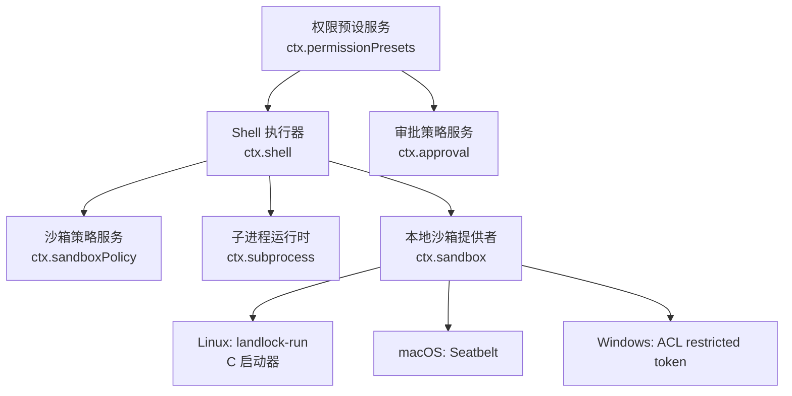
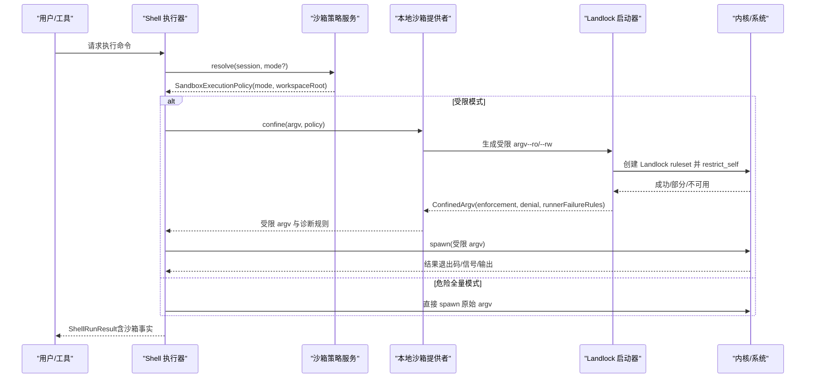
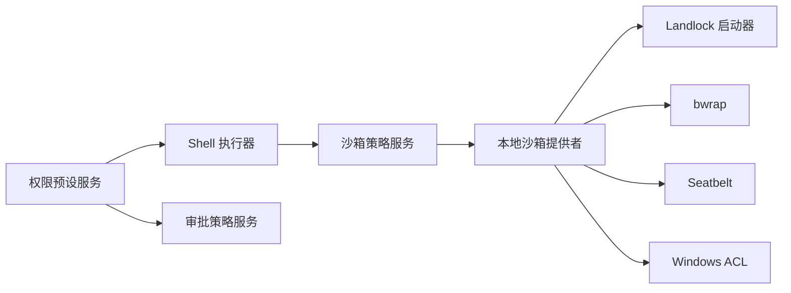

# 安全机制

<cite>
**本文引用的文件**
- [sandbox.md](file://docs/subsystems/sandbox.md)
- [permission-presets.md](file://docs/subsystems/permission-presets.md)
- [subprocess.md](file://docs/subsystems/subprocess.md)
- [shell.md](file://docs/subsystems/shell.md)
- [main.c](file://native/landlock-run/packages/entry/src/main.c)
- [index.ts（landlock-run 入口）](file://native/landlock-run/packages/entry/src/index.ts)
- [index.ts（权限预设服务）](file://packages/interaction/permission-presets/src/index.ts)
- [presentation.ts（UI 展示）](file://packages/client/ui-permission-presets/src/client/presentation.ts)
- [index.ts（本地沙箱提供者）](file://packages/sandbox/sandbox-local/src/index.ts)
- [landlock.e2e.ts（端到端测试）](file://packages/shell/bash-sandbox/tests/landlock.e2e.ts)
- [sandbox.spec.ts（分类规则测试）](file://packages/shell/bash-sandbox/tests/sandbox.spec.ts)
- [0004-landlock-partial-notice-misclassified-child-failures.md（事后复盘）](file://docs/postmortem/0004-landlock-partial-notice-misclassified-child-failures.md)
</cite>

## 目录
1. [简介](#简介)
2. [项目结构](#项目结构)
3. [核心组件](#核心组件)
4. [架构总览](#架构总览)
5. [详细组件分析](#详细组件分析)
6. [依赖关系分析](#依赖关系分析)
7. [性能考量](#性能考量)
8. [故障排除指南](#故障排除指南)
9. [结论](#结论)
10. [附录：配置与最佳实践](#附录配置与最佳实践)

## 简介
本文件面向安全管理员与开发者，系统化说明 DeepSeek Harness 的安全机制，包括权限控制、访问策略、资源限制、沙箱进程隔离、文件系统保护、网络访问控制、权限预设与自定义策略、原生安全组件（Landlock）集成原理与安全/性能权衡，以及安全最佳实践、常见威胁防护与安全审计方法。文档以仓库中的子系统文档与源码为依据，提供可操作的实施指导与排障建议。

## 项目结构
DeepSeek Harness 将“安全”拆分为多个协作的子系统：
- 沙箱抽象与策略：定义模式、执行策略、强制完整性报告（full/partial/unusable）。
- 子进程管理：统一进程生命周期、环境变量清洗、输出收集与终止策略。
- Shell 执行器：在沙箱中运行命令，封装结果与沙箱事实。
- 权限预设：将“沙箱模式 + 审批策略”打包为可切换的预设，并持久化用户选择。
- 本地沙箱提供者：在 Linux/macOS/Windows 上选择具体后端（bwrap/Landlock、Seatbelt、ACL），生成受限 argv。
- Landlock 原生组件：最小 C 启动器，自限制后 exec 受控命令，fail-closed。

图表来源
- [sandbox.md:9-39](file://docs/subsystems/sandbox.md#L9-L39)
- [subprocess.md:9-16](file://docs/subsystems/subprocess.md#L9-L16)
- [shell.md:9-16](file://docs/subsystems/shell.md#L9-L16)
- [index.ts（本地沙箱提供者）:335-344](file://packages/sandbox/sandbox-local/src/index.ts#L335-L344)
- [index.ts（权限预设服务）:139-178](file://packages/interaction/permission-presets/src/index.ts#L139-L178)

章节来源
- [sandbox.md:9-39](file://docs/subsystems/sandbox.md#L9-L39)
- [subprocess.md:9-16](file://docs/subsystems/subprocess.md#L9-L16)
- [shell.md:9-16](file://docs/subsystems/shell.md#L9-L16)
- [index.ts（本地沙箱提供者）:335-344](file://packages/sandbox/sandbox-local/src/index.ts#L335-L344)
- [index.ts（权限预设服务）:139-178](file://packages/interaction/permission-presets/src/index.ts#L139-L178)

## 核心组件
- 沙箱模式与强制完整性
  - 模式：read-only、workspace-write、danger-full-access；仅前两种进入受限路径。
  - 强制完整性：full/partial/unusable，由后端或内核 ABI 决定。
- 执行策略
  - 每次调用解析 SandboxExecutionPolicy（mode、workspaceRoot、sessionId），供受限执行使用。
- 子进程
  - 统一 spawn/terminate/collect，环境清洗（DSH_*）、输出截断与溢出转储。
- Shell 执行器
  - 将策略注入到前台/后台任务，返回 ShellRunResult/ShellProcess，附带沙箱事实（mode/denied/enforcement/runnerFailed）。
- 权限预设
  - 将 sandbox/mode 与 approval/policy 组合为预设表，支持默认值与用户选择，记录 permission/preset 事件。
- 本地沙箱提供者
  - 根据平台选择 bwrap/Landlock/Seatbelt/Windows ACL，生成受限 argv 与诊断规则。
- Landlock 原生组件
  - 自限制后 exec，allow-list 文件系统访问，失败关闭，探针报告 full/partial/unusable。

章节来源
- [sandbox.md:9-39](file://docs/subsystems/sandbox.md#L9-L39)
- [subprocess.md:9-16](file://docs/subsystems/subprocess.md#L9-L16)
- [shell.md:141-165](file://docs/subsystems/shell.md#L141-L165)
- [permission-presets.md:9-44](file://docs/subsystems/permission-presets.md#L9-L44)
- [index.ts（本地沙箱提供者）:335-344](file://packages/sandbox/sandbox-local/src/index.ts#L335-L344)
- [index.ts（landlock-run 入口）:101-127](file://native/landlock-run/packages/entry/src/index.ts#L101-L127)

## 架构总览
下图展示了从 Shell 执行到受限子进程的完整调用链，以及权限预设如何影响策略。

图表来源
- [sandbox.md:41-94](file://docs/subsystems/sandbox.md#L41-L94)
- [shell.md:141-165](file://docs/subsystems/shell.md#L141-L165)
- [index.ts（本地沙箱提供者）:335-344](file://packages/sandbox/sandbox-local/src/index.ts#L335-L344)
- [index.ts（landlock-run 入口）:101-127](file://native/landlock-run/packages/entry/src/index.ts#L101-L127)

## 详细组件分析

### 沙箱模式与执行策略
- 模式语义
  - read-only：仅允许必要读取与写入目标（如 /dev/null）。
  - workspace-write：允许工作区与后端临时目录写入。
  - danger-full-access：不进入受限路径，直接执行。
- 强制完整性
  - full：后端能完全实现模式承诺。
  - partial：旧 ABI 或平台差异导致仅部分约束生效。
  - unusable：无可用后端或内核不支持。
- 每调用策略
  - 解析 SandboxExecutionPolicy，携带 sessionId 用于后端按会话隔离状态。
  - 消费者可在一次调用前统一解析策略，再决定受限或非受限路径。

章节来源
- [sandbox.md:9-39](file://docs/subsystems/sandbox.md#L9-L39)
- [sandbox.md:41-94](file://docs/subsystems/sandbox.md#L41-L94)

### 子进程管理与输出收集
- 环境变量
  - DSH_* 命名空间由 Harness 管理，子进程启动时丢弃父进程同名字段，再合并当前快照。
- 输出收集
  - collect 模式支持内存上限与溢出转储文件，独立读者通过偏移读取，避免竞争。
- 终止策略
  - terminate 统一 SIGTERM→grace→SIGKILL 升级，跨平台树级终止；waitForExit 等待整棵树退出。

章节来源
- [subprocess.md:9-16](file://docs/subsystems/subprocess.md#L9-L16)
- [subprocess.md:39-87](file://docs/subsystems/subprocess.md#L39-L87)
- [subprocess.md:132-174](file://docs/subsystems/subprocess.md#L132-L174)

### Shell 执行器与沙箱事实
- 请求与规格分离
  - resolve() 填充必填字段并应用默认/上限；start/run 基于规格执行。
- 前台结果
  - ShellRunResult 正交报告 exitCode/signal/timedOut/aborted/timeoutMs 与 stdout/stderr。
- 沙箱事实
  - ShellSandboxInfo 包含 mode/denied/enforcement/runnerFailed，区分命令失败、策略拒绝与启动器失败。

章节来源
- [shell.md:9-16](file://docs/subsystems/shell.md#L9-L16)
- [shell.md:105-165](file://docs/subsystems/shell.md#L105-L165)

### 权限预设与审批策略
- 预设表
  - 内置 workspace-write（ask）与 danger-full-access（never），可自定义。
  - 名称 custom 保留给“非预设”派生态。
- 默认与选择
  - 新会话使用 defaultPreset；current(events) 根据有效模式与审批策略推导当前预设。
- 切换行为
  - set(session, name) 记录 permission/preset 日志事件，仅当实际 knob 变化时才写回对应 setter。

章节来源
- [permission-presets.md:9-44](file://docs/subsystems/permission-presets.md#L9-L44)
- [permission-presets.md:46-68](file://docs/subsystems/permission-presets.md#L46-L68)
- [index.ts（权限预设服务）:139-178](file://packages/interaction/permission-presets/src/index.ts#L139-L178)
- [index.ts（权限预设服务）:379-431](file://packages/interaction/permission-presets/src/index.ts#L379-L431)

### UI 展示与风险提示
- 对危险预设进行产品化标签显示，便于用户识别高风险选项。

章节来源
- [presentation.ts:1-22](file://packages/client/ui-permission-presets/src/client/presentation.ts#L1-L22)

### 本地沙箱提供者与后端选择
- 平台后端
  - Linux：优先 bwrap，不可用时回退到 landlock-run。
  - macOS：Seatbelt。
  - Windows：ACL restricted token。
- 生成受限 argv
  - 根据策略组装 --ro/--rw 等参数，返回 ConfinedArgv（含 enforcement、denialSignatures、runnerFailureRules）。

章节来源
- [index.ts（本地沙箱提供者）:335-344](file://packages/sandbox/sandbox-local/src/index.ts#L335-L344)
- [sandbox.md:96-150](file://docs/subsystems/sandbox.md#L96-L150)

### Landlock 原生组件：工作原理与安全性
- 自限制后 exec
  - 启动器先设置 PR_SET_NO_NEW_PRIVS，创建 ruleset 并 restrict_self，再 exec 被包装的命令。
- 白名单访问
  - --ro 授予读+执行；--rw 授予全部文件系统访问；未授权一律拒绝。
- 失败关闭
  - 无法创建或未被内核强制执行时，直接退出而不执行命令。
- ABI 协商
  - 根据内核支持的 ABI 级别裁剪允许的访问位集合，报告 partial/full。
- 探针
  - 短生命周期子进程构建最大规则集并尝试强制执行，输出“partially enforced”或“full”，否则 unusable。

章节来源
- [main.c:1-36](file://native/landlock-run/packages/entry/src/main.c#L1-L36)
- [main.c:107-130](file://native/landlock-run/packages/entry/src/main.c#L107-L130)
- [main.c:184-200](file://native/landlock-run/packages/entry/src/main.c#L184-L200)
- [main.c:220-262](file://native/landlock-run/packages/entry/src/main.c#L220-L262)
- [index.ts（landlock-run 入口）:101-127](file://native/landlock-run/packages/entry/src/index.ts#L101-L127)

### 错误分类与诊断规则
- Runner 失败 vs 策略拒绝
  - runnerFailureRules：匹配启动器自身失败（例如 exit 125 + 特定诊断行）。
  - denialSignatures：匹配受限命令被拒绝时的 stderr 片段（不同后端不同）。
- 信息行过滤
  - informationalLines 会先剔除无害提示，再进行致命匹配，避免误判。
- 测试覆盖
  - 端到端验证 Landlock 可用性、partial/full 判定与 shell 沙箱行为。

章节来源
- [sandbox.md:96-150](file://docs/subsystems/sandbox.md#L96-L150)
- [sandbox.spec.ts:462-484](file://packages/shell/bash-sandbox/tests/sandbox.spec.ts#L462-L484)
- [landlock.e2e.ts:26-54](file://packages/shell/bash-sandbox/tests/landlock.e2e.ts#L26-L54)
- [0004-landlock-partial-notice-misclassified-child-failures.md:50-56](file://docs/postmortem/0004-landlock-partial-notice-misclassified-child-failures.md#L50-L56)

## 依赖关系分析
- 松耦合接口
  - ctx.sandbox、ctx.sandboxPolicy、ctx.shell、ctx.subprocess、ctx.permissionPresets 形成清晰边界。
- 关键依赖链
  - Shell → SandboxPolicy → LocalSandboxProvider → (bwrap/landlock/seatbelt/windows-acl)。
  - PermissionPresetService → Shell（要求具备 sandboxMode）+ Approval（审批策略）。
- 外部依赖
  - Linux Landlock 内核能力；macOS Seatbelt；Windows ACL；可选 bwrap。

图表来源
- [index.ts（本地沙箱提供者）:335-344](file://packages/sandbox/sandbox-local/src/index.ts#L335-L344)
- [index.ts（权限预设服务）:139-178](file://packages/interaction/permission-presets/src/index.ts#L139-L178)

章节来源
- [index.ts（本地沙箱提供者）:335-344](file://packages/sandbox/sandbox-local/src/index.ts#L335-L344)
- [index.ts（权限预设服务）:139-178](file://packages/interaction/permission-presets/src/index.ts#L139-L178)

## 性能考量
- Landlock 启动器
  - 极小 C 二进制，静态链接 musl，启动开销低；ruleset 创建与 restrict_self 为一次性系统调用成本。
  - ABI 协商仅在启动时发生，后续 exec 继承规则，零额外开销。
- 输出收集
  - collect 模式内存上限与 spill 文件平衡了吞吐与可观测性；大输出场景建议启用 spill。
- 终止策略
  - 树级终止确保辅助进程不会泄漏；grace 期避免长时间挂起。
- 策略解析
  - 每调用解析策略成本低，但应避免频繁切换预设造成不必要的重写。

[本节为通用性能讨论，不直接分析具体文件]

## 故障排除指南
- 无法启用 Landlock
  - 现象：probe 返回 unusable 或 partial。
  - 排查：确认内核启用 Landlock（5.13+），ABI 级别是否满足；检查容器/LSM 限制。
  - 参考：[index.ts（landlock-run 入口）:101-127](file://native/landlock-run/packages/entry/src/index.ts#L101-L127)、[main.c:220-262](file://native/landlock-run/packages/entry/src/main.c#L220-L262)
- 启动器失败而非命令失败
  - 现象：exit 125 且包含 landlock-run: 诊断行。
  - 处理：依据 runnerFailureRules 分类，不要将其当作普通命令失败。
  - 参考：[sandbox.spec.ts:462-484](file://packages/shell/bash-sandbox/tests/sandbox.spec.ts#L462-L484)、[main.c:107-130](file://native/landlock-run/packages/entry/src/main.c#L107-L130)
- 策略拒绝 vs 命令失败
  - 现象：stderr 出现后端特定的拒绝片段（EROFS/EACCES/EPERM）。
  - 处理：使用 denialSignatures 精确匹配当前后端，避免跨后端误判。
  - 参考：[sandbox.md:96-150](file://docs/subsystems/sandbox.md#L96-L150)
- 预设配置错误
  - 现象：加载时报错“does not confine”或“reserved for the derived not-a-preset state”。
  - 处理：确保 bash executor 具备 sandboxMode；避免使用 reserved 名称 custom。
  - 参考：[index.ts（权限预设服务）:139-178](file://packages/interaction/permission-presets/src/index.ts#L139-L178)
- 输出丢失或截断
  - 现象：stdout/stderr 不完整。
  - 处理：启用 spill 文件，并通过 CollectedOutput.truncated/spillPath 恢复完整流。
  - 参考：[subprocess.md:39-87](file://docs/subsystems/subprocess.md#L39-L87)

章节来源
- [index.ts（landlock-run 入口）:101-127](file://native/landlock-run/packages/entry/src/index.ts#L101-L127)
- [main.c:107-130](file://native/landlock-run/packages/entry/src/main.c#L107-L130)
- [main.c:220-262](file://native/landlock-run/packages/entry/src/main.c#L220-L262)
- [sandbox.spec.ts:462-484](file://packages/shell/bash-sandbox/tests/sandbox.spec.ts#L462-L484)
- [sandbox.md:96-150](file://docs/subsystems/sandbox.md#L96-L150)
- [index.ts（权限预设服务）:139-178](file://packages/interaction/permission-presets/src/index.ts#L139-L178)
- [subprocess.md:39-87](file://docs/subsystems/subprocess.md#L39-L87)

## 结论
DeepSeek Harness 通过清晰的子系统边界与 fail-closed 设计，实现了可审计、可回退、可观测的沙箱执行体系。Landlock 作为 Linux 上的原生安全基座，配合策略服务与权限预设，提供了从“只读工作区”到“危险全量”的渐进式权限模型。结合子进程管理的健壮性与完善的诊断分类，能够在保证安全的同时兼顾性能与可维护性。

[本节为总结性内容，不直接分析具体文件]

## 附录：配置与最佳实践

### 权限预设配置示例
- 使用内置预设
  - workspace-write：适合大多数代码任务，需审批才扩大权限。
  - danger-full-access：仅在明确风险可控时使用，无需审批。
- 自定义预设
  - 在 presets 表中添加条目，指定 sandbox 与 approval，并为客户端提供 name/description。
  - 注意：custom 名称保留，不得用作表键。
- 默认预设
  - 为新会话设置 defaultPreset，或在组合默认与审批默认无法匹配任何预设时显式配置。

章节来源
- [permission-presets.md:9-44](file://docs/subsystems/permission-presets.md#L9-L44)
- [index.ts（权限预设服务）:139-178](file://packages/interaction/permission-presets/src/index.ts#L139-L178)

### 自定义权限策略实现要点
- 在策略层按调用维度解析 SandboxExecutionPolicy，确保 workspaceRoot 正确归一化。
- 对受限执行，始终调用 ctx.sandbox.confine；对危险全量模式，跳过受限路径。
- 使用 denialSignatures 与 runnerFailureRules 区分“被沙箱拒绝”和“启动器失败”。

章节来源
- [sandbox.md:41-94](file://docs/subsystems/sandbox.md#L41-L94)
- [sandbox.md:96-150](file://docs/subsystems/sandbox.md#L96-L150)

### 安全最佳实践
- 默认最小权限：优先 workspace-write，必要时再提升。
- 严格审批：对危险全量模式开启审批流程，避免静默放行。
- 输出与日志：启用 spill 文件，保留完整输出以便审计。
- 平台适配：在不同平台选择合适的后端，并在不可用时 fail-closed。
- 审计与回放：利用 session 事件（如 permission/preset）与结构化错误码进行追踪。

[本节为通用安全建议，不直接分析具体文件]

### 安全审计方法
- 审查预设表与默认预设，确保符合组织策略。
- 检查后端可用性探针与强制完整性报告（full/partial/unusable）。
- 核对 runnerFailureRules 与 denialSignatures 是否与所选后端一致。
- 定期抽样回放 session 事件，验证权限切换与审批流程合规。

章节来源
- [index.ts（landlock-run 入口）:101-127](file://native/landlock-run/packages/entry/src/index.ts#L101-L127)
- [sandbox.md:96-150](file://docs/subsystems/sandbox.md#L96-L150)