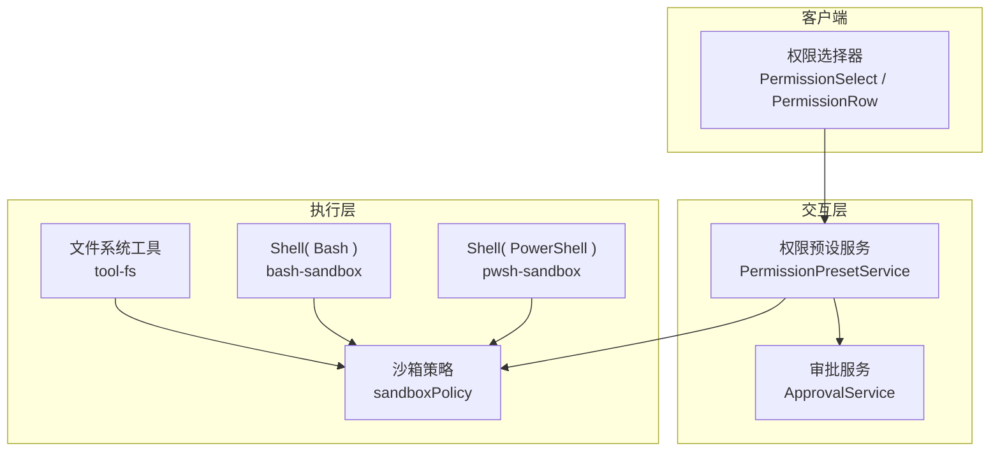
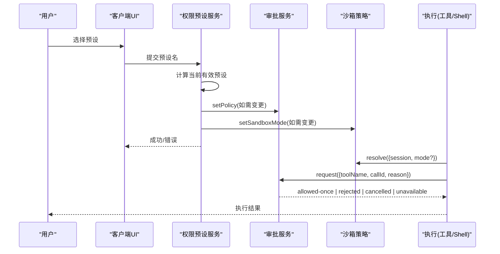
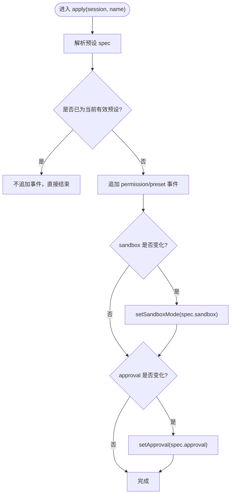
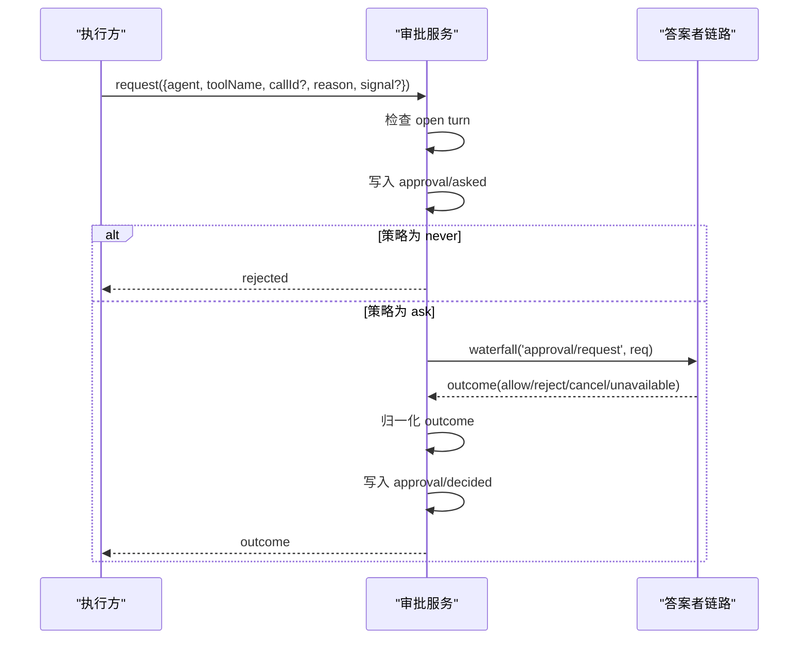
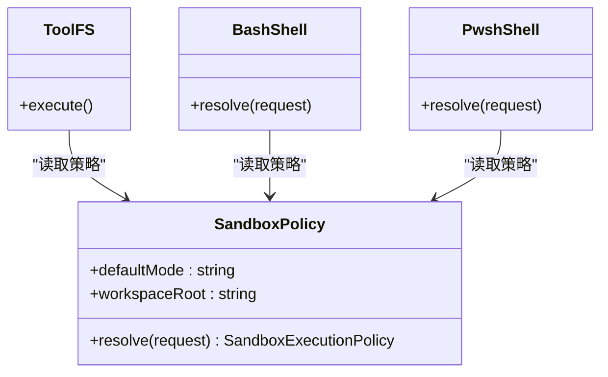
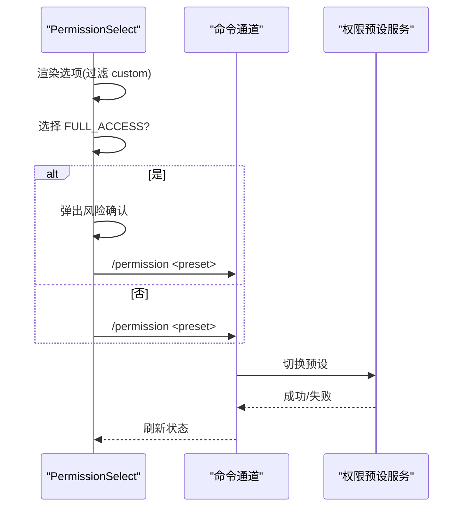
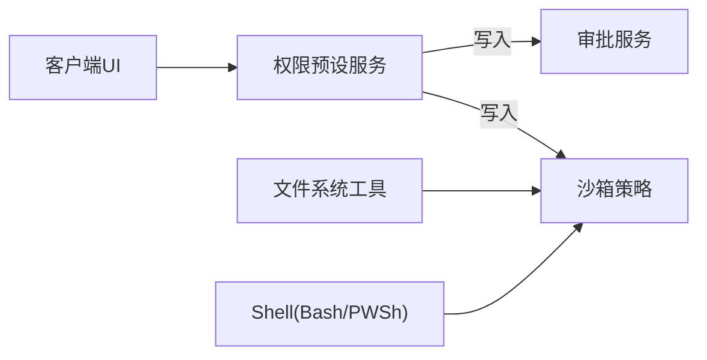

# 权限控制系统

<cite>
**本文引用的文件**
- [packages/interaction/permission-presets/src/index.ts](file://packages/interaction/permission-presets/src/index.ts)
- [packages/interaction/user-approval/src/index.ts](file://packages/interaction/user-approval/src/index.ts)
- [packages/sandbox/sandbox-policy/README.md](file://packages/sandbox/sandbox-policy/README.md)
- [docs/subsystems/sandbox.md](file://docs/subsystems/sandbox.md)
- [docs/subsystems/permission-presets.md](file://docs/subsystems/permission-presets.md)
- [packages/client/ui-permission-presets/src/client/presentation.ts](file://packages/client/ui-permission-presets/src/client/presentation.ts)
- [packages/client/ui-permission-presets/src/client/settings-store.ts](file://packages/client/ui-permission-presets/src/client/settings-store.ts)
- [packages/client/ui-conversation/src/client/skeleton/PermissionSelect.tsx](file://packages/client/ui-conversation/src/client/skeleton/PermissionSelect.tsx)
- [packages/fs/tool-fs/src/sandbox.ts](file://packages/fs/tool-fs/src/sandbox.ts)
- [packages/shell/bash-sandbox/src/index.ts](file://packages/shell/bash-sandbox/src/index.ts)
- [packages/shell/pwsh-sandbox/src/index.ts](file://packages/shell/pwsh-sandbox/src/index.ts)
- [packages/interaction/permission-presets/tests/permission-presets.spec.ts](file://packages/interaction/permission-presets/tests/permission-presets.spec.ts)
- [packages/interaction/user-approval/src/invariant.ts](file://packages/interaction/user-approval/src/invariant.ts)
</cite>

## 目录
1. [简介](#简介)
2. [项目结构](#项目结构)
3. [核心组件](#核心组件)
4. [架构总览](#架构总览)
5. [详细组件分析](#详细组件分析)
6. [依赖关系分析](#依赖关系分析)
7. [性能与可扩展性](#性能与可扩展性)
8. [故障排查指南](#故障排查指南)
9. [结论](#结论)
10. [附录：配置示例与最佳实践](#附录：配置示例与最佳实践)

## 简介
本文件系统化阐述 DeepSeek Harness 的权限控制系统，聚焦以下目标：
- 解释权限模型的设计原理：角色、资源与操作的抽象在系统中的落地方式（以“沙箱模式 + 审批策略”为核心）。
- 说明权限预设系统的工作原理：内置预设、默认值、以及自定义预设的配置与使用。
- 文档化权限检查的执行流程：优先级规则、冲突解决策略与可审计性。
- 提供面向安全管理员的实践建议：如何为不同场景设置合适的权限策略，以及如何诊断常见问题。

## 项目结构
权限控制由多个子系统协作完成：
- 权限预设服务：将“沙箱模式”和“审批策略”打包为可选的“预设”，并提供会话级持久化的选择记录。
- 审批服务：负责审批策略的生效、询问链路的分发与审计事件对（asked/decided）的持久化。
- 沙箱策略：统一解析每次执行的沙箱模式与工作区根，确保工具与 Shell 执行具有一致的边界。
- 客户端 UI：提供权限预设选择器、高风险操作确认、以及命令通道切换预设。

图表来源
- [packages/interaction/permission-presets/src/index.ts:159-277](file://packages/interaction/permission-presets/src/index.ts#L159-L277)
- [packages/interaction/user-approval/src/index.ts:192-237](file://packages/interaction/user-approval/src/index.ts#L192-L237)
- [packages/sandbox/sandbox-policy/README.md:1-14](file://packages/sandbox/sandbox-policy/README.md#L1-L14)
- [packages/fs/tool-fs/src/sandbox.ts:95-108](file://packages/fs/tool-fs/src/sandbox.ts#L95-L108)
- [packages/shell/bash-sandbox/src/index.ts:75-86](file://packages/shell/bash-sandbox/src/index.ts#L75-L86)
- [packages/shell/pwsh-sandbox/src/index.ts:75-94](file://packages/shell/pwsh-sandbox/src/index.ts#L75-L94)
- [packages/client/ui-conversation/src/client/skeleton/PermissionSelect.tsx:98-126](file://packages/client/ui-conversation/src/client/skeleton/PermissionSelect.tsx#L98-L126)

章节来源
- [docs/subsystems/permission-presets.md:1-132](file://docs/subsystems/permission-presets.md#L1-L132)
- [docs/subsystems/sandbox.md:23-94](file://docs/subsystems/sandbox.md#L23-L94)

## 核心组件
- 权限预设服务（PermissionPresetService）
  - 职责：维护预设表（名称 → 沙箱模式 + 审批策略），提供当前有效预设推导、选项构建、写入路径（追加预设事件并调用各旋钮的 setter）。
  - 关键能力：current/selectFor/resolve/optionOf/set；会话初始化时补齐缺失的权限事实；注册“permissions”投影与“/permission”命令。
- 审批服务（ApprovalService）
  - 职责：应用会话级审批策略（ask/never），分发到答案者链路，产出确定性结果；记录 ask/decided 审计事件对；向模型上下文注入策略提示。
- 沙箱策略（sandboxPolicy）
  - 职责：单一权威源，解析每次执行的沙箱模式与工作区根；支持 per-call 覆盖；为工具与 Shell 提供一致的边界。
- 客户端 UI
  - 职责：展示可用预设、处理高风险预设（如“完全访问”）的二次确认、通过命令或设置项切换预设。

章节来源
- [packages/interaction/permission-presets/src/index.ts:159-277](file://packages/interaction/permission-presets/src/index.ts#L159-L277)
- [packages/interaction/user-approval/src/index.ts:192-237](file://packages/interaction/user-approval/src/index.ts#L192-L237)
- [packages/sandbox/sandbox-policy/README.md:1-14](file://packages/sandbox/sandbox-policy/README.md#L1-L14)
- [packages/client/ui-permission-presets/src/client/presentation.ts:1-22](file://packages/client/ui-permission-presets/src/client/presentation.ts#L1-L22)
- [packages/client/ui-permission-presets/src/client/settings-store.ts:45-76](file://packages/client/ui-permission-presets/src/client/settings-store.ts#L45-L76)

## 架构总览
权限控制采用“旋钮 + 预设 + 审计”的分层设计：
- 旋钮层：沙箱模式（read-only/workspace-write/danger-full-access）与审批策略（ask/never）。
- 预设层：将两个旋钮组合为命名预设，便于用户一次性切换。
- 执行层：工具与 Shell 在执行前读取沙箱策略，必要时触发审批询问。
- 审计层：所有策略变更与审批问答均持久化为会话事件，支持回放与一致性校验。

图表来源
- [packages/interaction/permission-presets/src/index.ts:379-430](file://packages/interaction/permission-presets/src/index.ts#L379-L430)
- [packages/interaction/user-approval/src/index.ts:257-344](file://packages/interaction/user-approval/src/index.ts#L257-L344)
- [packages/fs/tool-fs/src/sandbox.ts:95-108](file://packages/fs/tool-fs/src/sandbox.ts#L95-L108)
- [packages/shell/bash-sandbox/src/index.ts:75-86](file://packages/shell/bash-sandbox/src/index.ts#L75-L86)
- [packages/shell/pwsh-sandbox/src/index.ts:75-94](file://packages/shell/pwsh-sandbox/src/index.ts#L75-L94)

## 详细组件分析

### 权限预设服务（PermissionPresetService）
- 预设表与默认值
  - 内置预设：workspace-write（写工作区+临时目录，需审批重试）、danger-full-access（无限制，不提示）。
  - 默认预设：若未显式配置，则根据组合默认值推导；若无法匹配任何预设，必须显式指定 defaultPreset。
- 当前预设推导
  - 优先保留用户上次选择的预设（当仍匹配当前旋钮值时），否则按声明顺序取首个匹配项，否则返回“custom”。
- 写入路径
  - 仅当旋钮实际变化时才追加事件并调用 setter；重选相同预设不会产生冗余事件。
- 会话初始化
  - 新会话补齐缺失的权限事实：若无任何旋钮且非种子会话，则写入默认预设及其旋钮；否则补齐缺失的 sandbox/approval。

图表来源
- [packages/interaction/permission-presets/src/index.ts:379-392](file://packages/interaction/permission-presets/src/index.ts#L379-L392)

章节来源
- [packages/interaction/permission-presets/src/index.ts:159-277](file://packages/interaction/permission-presets/src/index.ts#L159-L277)
- [packages/interaction/permission-presets/src/index.ts:304-337](file://packages/interaction/permission-presets/src/index.ts#L304-L337)
- [packages/interaction/permission-presets/src/index.ts:394-430](file://packages/interaction/permission-presets/src/index.ts#L394-L430)
- [docs/subsystems/permission-presets.md:9-68](file://docs/subsystems/permission-presets.md#L9-L68)

### 审批服务（ApprovalService）
- 策略优先级
  - 会话级 override > 部署默认策略 > 兜底 'ask'。
- 决策流程
  - 若策略为 'never'，直接拒绝；否则进入答案者瀑布流，最终归一化为允许一次、拒绝、取消或不可用。
- 审计事件对
  - approval/asked 与 approval/decided 成对出现，保证可回放与一致性校验。
- 模型可见性
  - 通过系统提示注入当前策略语义，使模型知晓是否需要请求审批。

图表来源
- [packages/interaction/user-approval/src/index.ts:257-344](file://packages/interaction/user-approval/src/index.ts#L257-L344)

章节来源
- [packages/interaction/user-approval/src/index.ts:192-237](file://packages/interaction/user-approval/src/index.ts#L192-L237)
- [packages/interaction/user-approval/src/index.ts:257-344](file://packages/interaction/user-approval/src/index.ts#L257-L344)
- [packages/interaction/user-approval/src/invariant.ts:27-50](file://packages/interaction/user-approval/src/invariant.ts#L27-L50)

### 沙箱策略（sandboxPolicy）
- 单一权威源
  - 提供部署默认模式与工作区根；每次执行通过 resolve() 获取完整策略（含 per-call 覆盖）。
- 模式与执行
  - read-only / workspace-write / danger-full-access；危险模式由消费者自行决定执行路径。
- 工具与 Shell 集成
  - 工具与 Shell 在执行前读取策略，必要时触发审批升级。

图表来源
- [packages/sandbox/sandbox-policy/README.md:1-14](file://packages/sandbox/sandbox-policy/README.md#L1-L14)
- [packages/fs/tool-fs/src/sandbox.ts:95-108](file://packages/fs/tool-fs/src/sandbox.ts#L95-L108)
- [packages/shell/bash-sandbox/src/index.ts:75-86](file://packages/shell/bash-sandbox/src/index.ts#L75-L86)
- [packages/shell/pwsh-sandbox/src/index.ts:75-94](file://packages/shell/pwsh-sandbox/src/index.ts#L75-L94)

章节来源
- [docs/subsystems/sandbox.md:23-94](file://docs/subsystems/sandbox.md#L23-L94)

### 客户端权限选择与高风险确认
- 预设展示
  - 从“permissions”投影读取选项与当前值；“custom”仅在派生状态下显示，不可作为目标。
- 高风险预设
  - “完全访问”需要二次确认；确认后才会提交命令进行切换。
- 设置项
  - 通过设置命名空间暴露默认预设，支持读写与无效状态处理。

图表来源
- [packages/client/ui-conversation/src/client/skeleton/PermissionSelect.tsx:98-126](file://packages/client/ui-conversation/src/client/skeleton/PermissionSelect.tsx#L98-L126)
- [packages/client/ui-permission-presets/src/client/presentation.ts:1-22](file://packages/client/ui-permission-presets/src/client/presentation.ts#L1-L22)
- [packages/client/ui-permission-presets/src/client/settings-store.ts:45-76](file://packages/client/ui-permission-presets/src/client/settings-store.ts#L45-L76)

章节来源
- [packages/client/ui-conversation/src/client/skeleton/PermissionSelect.tsx:98-126](file://packages/client/ui-conversation/src/client/skeleton/PermissionSelect.tsx#L98-L126)
- [packages/client/ui-permission-presets/src/client/presentation.ts:1-22](file://packages/client/ui-permission-presets/src/client/presentation.ts#L1-L22)
- [packages/client/ui-permission-presets/src/client/settings-store.ts:45-76](file://packages/client/ui-permission-presets/src/client/settings-store.ts#L45-L76)

## 依赖关系分析
- 松耦合
  - 预设服务不直接执行业务逻辑，仅通过各旋钮的 setter 写入；执行侧独立消费策略。
- 强一致
  - 审批审计事件对与策略事件均由各自服务管理，并通过不变量校验保障一致性。
- 外部依赖
  - 沙箱策略为唯一权威源；Shell 与工具均依赖其 resolve() 输出。

图表来源
- [packages/interaction/permission-presets/src/index.ts:159-277](file://packages/interaction/permission-presets/src/index.ts#L159-L277)
- [packages/interaction/user-approval/src/index.ts:192-237](file://packages/interaction/user-approval/src/index.ts#L192-L237)
- [packages/sandbox/sandbox-policy/README.md:1-14](file://packages/sandbox/sandbox-policy/README.md#L1-L14)

章节来源
- [packages/interaction/permission-presets/src/index.ts:159-277](file://packages/interaction/permission-presets/src/index.ts#L159-L277)
- [packages/interaction/user-approval/src/index.ts:192-237](file://packages/interaction/user-approval/src/index.ts#L192-L237)

## 性能与可扩展性
- 最小化事件写入
  - 仅当旋钮实际变化时才追加事件，避免冗余日志与回放开销。
- 纯函数折叠
  - 预设推导与旋钮折叠均为纯函数，易于测试与并行化。
- 可扩展点
  - 预设表可自由扩展；审批策略可扩展答案者；沙箱策略支持 per-call 覆盖，满足并发多策略场景。

[本节为通用指导，无需特定文件引用]

## 故障排查指南
- 常见错误与定位
  - 预设名为 reserved（custom）：不允许在预设表中定义该键。
  - 未启用沙箱：若挂载的 bash 执行器不具备沙箱能力，加载时会报错。
  - 默认预设无法匹配：当组合默认值不匹配任何预设时，必须显式配置 defaultPreset。
  - 审批策略非法：仅允许 ask/never，非法值会被拒绝。
  - 审计事件不一致：asked/decided 必须成对出现，且处于 open turn 内。
- 诊断步骤
  - 查看会话事件：permission/preset、sandbox/mode、approval/policy、approval/asked、approval/decided。
  - 核对当前有效预设：使用 current(events) 推导，确认是否与预期一致。
  - 检查策略来源：确认 is effective 来自会话覆盖还是部署默认。
  - 审查客户端行为：高风险预设是否触发了确认流程。

章节来源
- [packages/interaction/permission-presets/tests/permission-presets.spec.ts:162-184](file://packages/interaction/permission-presets/tests/permission-presets.spec.ts#L162-L184)
- [packages/interaction/user-approval/src/invariant.ts:27-50](file://packages/interaction/user-approval/src/invariant.ts#L27-L50)
- [packages/interaction/user-approval/src/index.ts:257-276](file://packages/interaction/user-approval/src/index.ts#L257-L276)

## 结论
DeepSeek Harness 的权限控制系统通过“沙箱模式 + 审批策略”的双旋钮抽象，结合“预设”这一用户友好层，实现了灵活、可审计、可回放的权限管理。执行侧通过统一的沙箱策略与审批服务，确保工具与 Shell 的一致性与安全性。客户端提供了直观的选择与风险提示，帮助安全管理员在不同场景下快速配置合适的权限策略。

[本节为总结性内容，无需特定文件引用]

## 附录：配置示例与最佳实践

- 内置预设与含义
  - workspace-write：在工作区与允许的临时目录中写入；更宽的重试需要审批。
  - danger-full-access：无限制的完全访问；不提示审批。
- 自定义预设
  - 在预设表中添加条目，指定 sandbox 与 approval，并可配置 name/description 用于客户端展示。
  - 注意：禁止使用 reserved 名称（custom）。
- 默认预设
  - 若组合默认值无法匹配任何预设，必须显式配置 defaultPreset。
- 会话初始化
  - 新会话会补齐缺失的权限事实；种子会话保留已有旋钮值并补齐缺失项。
- 执行前检查
  - 工具与 Shell 在执行前读取沙箱策略；必要时触发审批询问。
- 审计与监控
  - 关注 approval/asked 与 approval/decided 的配对；确保在 open turn 内。
  - 通过 permissions 投影观察当前有效预设与选项。
- 最佳实践
  - 生产环境默认使用 workspace-write + ask；仅在受控场景启用 danger-full-access。
  - 对高风险预设启用客户端二次确认。
  - 定期审查会话审计事件，发现异常审批或越权尝试。

章节来源
- [packages/interaction/permission-presets/src/index.ts:159-210](file://packages/interaction/permission-presets/src/index.ts#L159-L210)
- [packages/interaction/permission-presets/src/index.ts:394-430](file://packages/interaction/permission-presets/src/index.ts#L394-L430)
- [packages/fs/tool-fs/src/sandbox.ts:95-108](file://packages/fs/tool-fs/src/sandbox.ts#L95-L108)
- [packages/interaction/user-approval/src/index.ts:257-344](file://packages/interaction/user-approval/src/index.ts#L257-L344)
- [packages/client/ui-conversation/src/client/skeleton/PermissionSelect.tsx:98-126](file://packages/client/ui-conversation/src/client/skeleton/PermissionSelect.tsx#L98-L126)