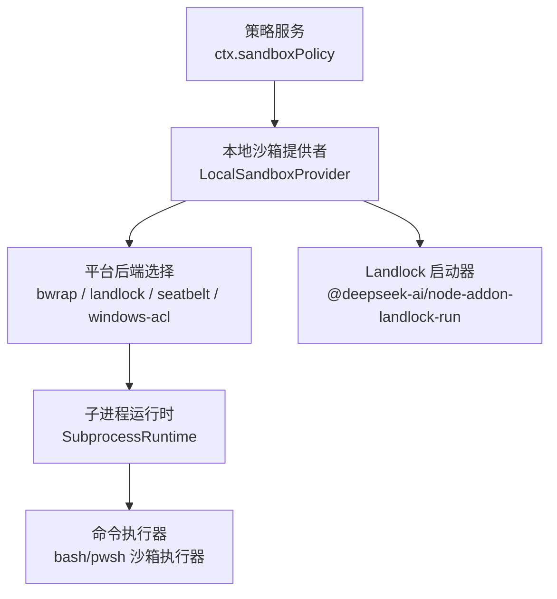
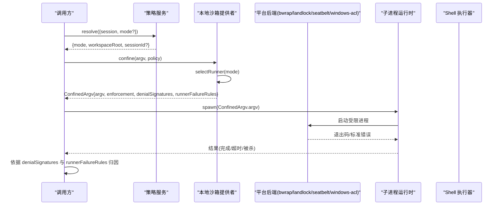
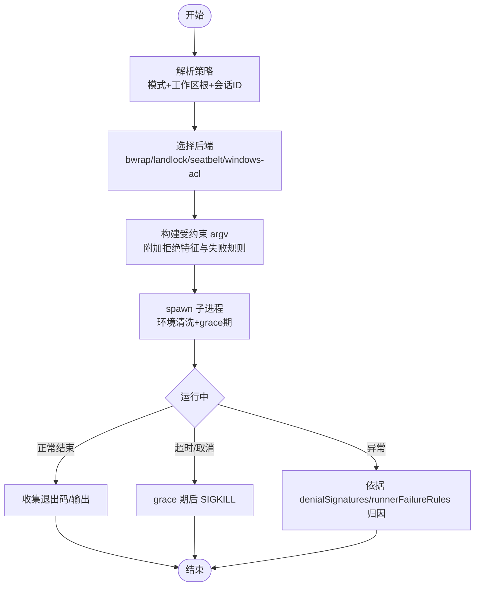
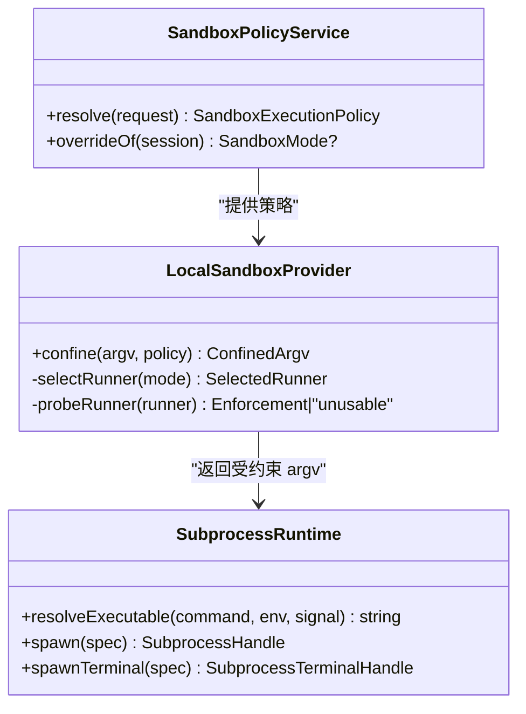
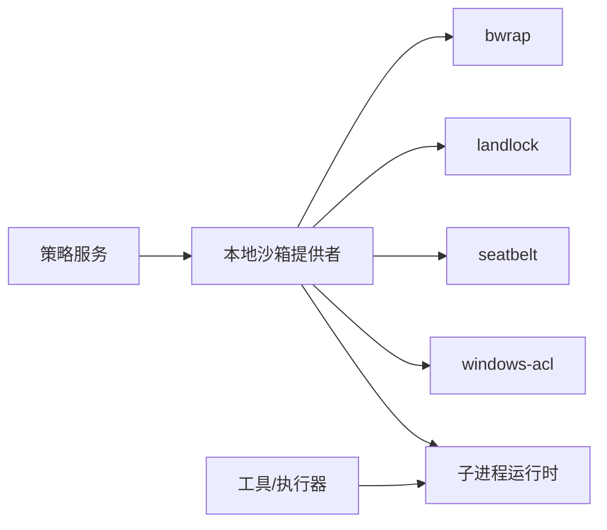

# 沙箱系统

<cite>
**本文引用的文件**
- [packages/sandbox/sandbox-local/src/index.ts](file://packages/sandbox/sandbox-local/src/index.ts)
- [docs/subsystems/sandbox.md](file://docs/subsystems/sandbox.md)
- [native/landlock-run/docs/architecture.md](file://native/landlock-run/docs/architecture.md)
- [packages/subprocess/subprocess/src/index.ts](file://packages/subprocess/subprocess/src/index.ts)
- [packages/sandbox/sandbox-policy/src/index.ts](file://packages/sandbox/sandbox-policy/src/index.ts)
- [packages/shell/bash-sandbox/tests/landlock.e2e.ts](file://packages/shell/bash-sandbox/tests/landlock.e2e.ts)
- [packages/sandbox/sandbox-local/tests/landlock.e2e.ts](file://packages/sandbox/sandbox-local/tests/landlock.e2e.ts)
- [packages/sandbox/sandbox-windows-acl/tests/acl.spec.ts](file://packages/sandbox/sandbox-windows-acl/tests/acl.spec.ts)
- [packages/sandbox/sandbox-windows-acl/tests/runner.spec.ts](file://packages/sandbox/sandbox-windows-acl/tests/runner.spec.ts)
- [packages/fs/tool-fs-search/src/index.ts](file://packages/fs/tool-fs-search/src/index.ts)
- [packages/code-runtime/code-runtime-worker-thread/src/index.ts](file://packages/code-runtime/code-runtime-worker-thread/src/index.ts)
- [packages/util/timeout/tests/timeout.spec.ts](file://packages/util/timeout/tests/timeout.spec.ts)
- [packages/storage/storage-domain/src/index.ts](file://packages/storage/storage-domain/src/index.ts)
- [examples/acp-agent/tests/partial-landlock.cordis.yml](file://examples/acp-agent/tests/partial-landlock.cordis.yml)
</cite>

## 目录
1. [简介](#简介)
2. [项目结构](#项目结构)
3. [核心组件](#核心组件)
4. [架构总览](#架构总览)
5. [详细组件分析](#详细组件分析)
6. [依赖关系分析](#依赖关系分析)
7. [性能考量](#性能考量)
8. [故障排除指南](#故障排除指南)
9. [结论](#结论)
10. [附录](#附录)

## 简介
本文件面向 DeepSeek Harness 的沙箱子系统，聚焦进程隔离、文件系统保护、网络访问控制、原生 Landlock 集成、配置与调试、以及扩展开发指导。沙箱通过“策略—提供者—执行器”的分层设计，将平台无关的“文件效果策略”与具体平台的“隔离后端”解耦：上层以模式（只读/工作区可写/危险全开放）表达意图，本地提供者根据平台选择并探测可用后端（Linux 优先 bubblewrap，其次 Landlock；macOS 使用 Seatbelt；Windows 使用 ACL 受限令牌），并以“失败即关闭”的原则确保不会静默降级为无约束执行。

## 项目结构
- 策略层：`ctx.sandboxPolicy` 统一解析部署默认模式与工作区根路径，并为每次能力调用产出完整策略（含会话 ID）。
- 提供者层：`LocalSandboxProvider` 负责平台链选择、功能探针、生成受约束的 argv 及错误分类规则。
- 执行层：子进程抽象 `SubprocessRuntime` 提供统一的 spawn/终止/终端原语；bash/pwsh 沙箱执行器消费策略与提供者结果。
- 原生机制：Landlock 启动器提供内核级隔离能力，配合功能探针报告“完全/部分/不可用”。
- 安全边界：环境变量清洗、凭据保护、ACL 写入授权等。

**图示来源**
- [packages/sandbox/sandbox-policy/src/index.ts:85-154](file://packages/sandbox/sandbox-policy/src/index.ts#L85-L154)
- [packages/sandbox/sandbox-local/src/index.ts:250-343](file://packages/sandbox/sandbox-local/src/index.ts#L250-L343)
- [packages/subprocess/subprocess/src/index.ts:74-140](file://packages/subprocess/subprocess/src/index.ts#L74-L140)
- [native/landlock-run/docs/architecture.md:16-24](file://native/landlock-run/docs/architecture.md#L16-L24)

**章节来源**
- [docs/subsystems/sandbox.md:1-39](file://docs/subsystems/sandbox.md#L1-L39)
- [packages/sandbox/sandbox-local/src/index.ts:1-568](file://packages/sandbox/sandbox-local/src/index.ts#L1-L568)
- [packages/subprocess/subprocess/src/index.ts:1-143](file://packages/subprocess/subprocess/src/index.ts#L1-L143)

## 核心组件
- 策略服务（SandboxPolicyService）：集中管理部署默认模式与工作区根，按会话事件覆盖模式，输出每调用一次的策略对象。
- 本地沙箱提供者（LocalSandboxProvider）：维护平台链、功能探针缓存、各后端拒绝特征与失败规则，生成受约束 argv。
- 子进程运行时（SubprocessRuntime）：定义 spawn/终止/终端的原语与环境清洗，保证树级生命周期管理与优雅退出。
- Landlock 启动器：提供内核级最小权限隔离，支持“完全/部分/不可用”的功能探测与失败即关闭语义。

**章节来源**
- [packages/sandbox/sandbox-policy/src/index.ts:85-154](file://packages/sandbox/sandbox-policy/src/index.ts#L85-L154)
- [packages/sandbox/sandbox-local/src/index.ts:250-343](file://packages/sandbox/sandbox-local/src/index.ts#L250-L343)
- [packages/subprocess/subprocess/src/index.ts:74-140](file://packages/subprocess/subprocess/src/index.ts#L74-L140)
- [native/landlock-run/docs/architecture.md:16-24](file://native/landlock-run/docs/architecture.md#L16-L24)

## 架构总览
下图展示一次“受限 bash 命令”的端到端流程：策略解析 → 提供者选择后端 → 构造受约束 argv → 子进程运行 → 结果归因（区分“被沙箱拒绝”和“启动器失败”）。

**图示来源**
- [packages/sandbox/sandbox-policy/src/index.ts:126-142](file://packages/sandbox/sandbox-policy/src/index.ts#L126-L142)
- [packages/sandbox/sandbox-local/src/index.ts:316-343](file://packages/sandbox/sandbox-local/src/index.ts#L316-L343)
- [packages/subprocess/subprocess/src/index.ts:124-140](file://packages/subprocess/subprocess/src/index.ts#L124-L140)

## 详细组件分析

### 进程隔离机制（子进程启动、资源限制、生命周期）
- 启动与参数传递
  - 策略服务产出 per-call 策略（模式、工作区根、可选会话 ID）。
  - 本地提供者根据平台链选择后端，返回受约束 argv 与诊断规则。
  - 子进程运行时负责环境清洗（移除敏感键与 DSH_* 前缀）、绝对路径校验、grace 期与信号升级（SIGTERM→grace→SIGKILL）。
- 资源限制
  - 超时与预算：工具层与代码运行时提供超时、最大输出字节、计算预算与堆大小上限等；子进程 graceMs 用于优雅退出与管道排空。
  - 内存/CPU：代码运行时 worker 线程可配置 computeMs、maxWallMs、maxOldGenerationSizeMb 等。
- 生命周期管理
  - 子进程句柄暴露 terminate/waitForExit；服务销毁时强制回收所有托管进程。
  - Windows ACL 提供者在提供者销毁时撤销临时写入授权并清理私有临时目录。

**图示来源**
- [packages/sandbox/sandbox-policy/src/index.ts:126-142](file://packages/sandbox/sandbox-policy/src/index.ts#L126-L142)
- [packages/sandbox/sandbox-local/src/index.ts:316-343](file://packages/sandbox/sandbox-local/src/index.ts#L316-L343)
- [packages/subprocess/subprocess/src/index.ts:37-66](file://packages/subprocess/subprocess/src/index.ts#L37-L66)
- [packages/util/timeout/tests/timeout.spec.ts:1-39](file://packages/util/timeout/tests/timeout.spec.ts#L1-L39)
- [packages/code-runtime/code-runtime-worker-thread/src/index.ts:24-54](file://packages/code-runtime/code-runtime-worker-thread/src/index.ts#L24-L54)

**章节来源**
- [packages/subprocess/subprocess/src/index.ts:37-66](file://packages/subprocess/subprocess/src/index.ts#L37-L66)
- [packages/subprocess/subprocess/src/index.ts:74-140](file://packages/subprocess/subprocess/src/index.ts#L74-L140)
- [packages/code-runtime/code-runtime-worker-thread/src/index.ts:24-54](file://packages/code-runtime/code-runtime-worker-thread/src/index.ts#L24-L54)
- [packages/util/timeout/tests/timeout.spec.ts:1-39](file://packages/util/timeout/tests/timeout.spec.ts#L1-L39)

### 文件系统保护机制（路径白名单、读写权限、审计）
- 模式与边界
  - read-only：仅允许必要写入点（如 /dev/null），其余写操作被拒绝。
  - workspace-write：允许在工作区根与后端定义的临时区域写入。
  - danger-full-access：不进入沙箱，由调用方自行决定。
- 平台实现要点
  - Linux bwrap：基于挂载命名空间与只读绑定，实现强隔离。
  - Linux Landlock：内核级最小权限，支持“完全/部分/不可用”探测；旧 ABI 可能仅部分生效。
  - macOS Seatbelt：基于 sandbox-exec 的 deny-file-write* 策略。
  - Windows ACL：通过受限令牌与 ACL 授予工作区与临时目录写入；由于 WRITE_RESTRICTED 必须保留 Everyone 且 NTFS 硬链接会跨路径共享文件对象，因此声明为“部分”保障。
- 审计与诊断
  - 每个后端提供“拒绝特征”（denialSignatures）与“启动器失败规则”（runnerFailureRules），便于区分“被沙箱阻止”和“启动器自身失败”。
  - 测试覆盖包含 Landlock 部分生效场景与 Windows ACL 硬链接边界行为。

**图示来源**
- [packages/sandbox/sandbox-policy/src/index.ts:85-154](file://packages/sandbox/sandbox-policy/src/index.ts#L85-L154)
- [packages/sandbox/sandbox-local/src/index.ts:250-343](file://packages/sandbox/sandbox-local/src/index.ts#L250-L343)
- [packages/subprocess/subprocess/src/index.ts:74-140](file://packages/subprocess/subprocess/src/index.ts#L74-L140)

**章节来源**
- [docs/subsystems/sandbox.md:9-39](file://docs/subsystems/sandbox.md#L9-L39)
- [packages/sandbox/sandbox-local/src/index.ts:168-213](file://packages/sandbox/sandbox-local/src/index.ts#L168-L213)
- [packages/sandbox/sandbox-windows-acl/tests/acl.spec.ts:300-318](file://packages/sandbox/sandbox-windows-acl/tests/acl.spec.ts#L300-L318)
- [packages/sandbox/sandbox-windows-acl/tests/runner.spec.ts:414-435](file://packages/sandbox/sandbox-windows-acl/tests/runner.spec.ts#L414-L435)

### 网络访问控制（出站连接限制与域名过滤）
- 当前沙箱模式词汇仅约束“文件效果”，不包含网络与进程可见性。网络访问控制不在 ctx.sandbox 的职责范围内。
- 如需网络限制，应在更高层（容器、微虚拟机或远程执行）实现，或通过外部网络代理/防火墙策略进行治理。

**章节来源**
- [docs/subsystems/sandbox.md:9-39](file://docs/subsystems/sandbox.md#L9-L39)

### 原生 Landlock 集成的安全性与性能
- 安全性
  - 启动器在短生命周期子进程中应用最大规则集，验证内核是否真正强制执行；缺失或不支持的二进制/内核均被视为“不可用”，走失败即关闭路径。
  - 旧 ABI 下可能仅“部分”生效，探针会报告 partial，消费者据此决定是否接受。
- 性能
  - 启动器为静态编译的二进制，无动态库依赖；探针与执行开销低。
  - 通过功能探针避免不必要的回退与误判，减少冷启动成本。

**章节来源**
- [native/landlock-run/docs/architecture.md:16-24](file://native/landlock-run/docs/architecture.md#L16-L24)
- [packages/sandbox/sandbox-local/src/index.ts:512-539](file://packages/sandbox/sandbox-local/src/index.ts#L512-L539)

### 沙箱配置指南（资源配额与安全策略）
- 策略配置（部署默认与工作区根）
  - mode：read-only/workspace-write/danger-full-access，默认 read-only。
  - workspaceRoot：agentless 调用或无 cwd 会话的回退根，默认 process.cwd()，始终解析为绝对路径。
- 资源配额
  - 子进程 graceMs：正有限值，用于优雅退出与管道排空。
  - 代码运行时 computeMs/maxWallMs/maxOutputBytes/maxOldGenerationSizeMb：限制 CPU 活跃时间、墙钟上限、输出体积与堆大小。
  - 工具层（搜索/匹配）可配置 maxResults、rawOutputMaxBytes、stderrMaxBytes、timeoutMs 等。
- 安全策略
  - 环境变量清洗：移除敏感键与 DSH_* 前缀，防止凭据泄露。
  - 凭据文件保护：POSIX 下检查文件权限，拒绝非 owner 可读的凭据文档。
  - Windows ACL：工作区与临时目录写入授权，提供者销毁时撤销并清理。

**章节来源**
- [packages/sandbox/sandbox-policy/src/index.ts:60-75](file://packages/sandbox/sandbox-policy/src/index.ts#L60-L75)
- [packages/sandbox/sandbox-policy/src/index.ts:85-154](file://packages/sandbox/sandbox-policy/src/index.ts#L85-L154)
- [packages/subprocess/subprocess/src/index.ts:37-66](file://packages/subprocess/subprocess/src/index.ts#L37-L66)
- [packages/code-runtime/code-runtime-worker-thread/src/index.ts:24-54](file://packages/code-runtime/code-runtime-worker-thread/src/index.ts#L24-L54)
- [packages/fs/tool-fs-search/src/index.ts:141-160](file://packages/fs/tool-fs-search/src/index.ts#L141-L160)
- [packages/storage/storage-domain/src/index.ts:84-220](file://packages/storage/storage-domain/src/index.ts#L84-L220)

### 调试方法与故障排除
- 常见现象定位
  - “被沙箱拒绝”：匹配后端 denialSignatures（例如 bwrap 的只读文件系统提示、Landlock 的权限拒绝、Seatbelt 的操作不允许、Windows 的访问被拒绝）。
  - “启动器失败”：匹配 runnerFailureRules（允许退出码门控、信息行排除、致命签名匹配）。
- 调试步骤
  - 确认策略解析结果（模式与工作区根）是否符合预期。
  - 查看所选后端与 enforcement 级别（full/partial/unavailable）。
  - 捕获子进程 stderr 与退出码，结合 denialSignatures 与 runnerFailureRules 判断归属。
  - 对 Landlock 场景，关注“部分生效”提示，必要时提升内核 ABI 或调整策略。
- 示例参考
  - bash 沙箱 e2e 测试展示了 Landlock 可用性探测与模式切换。
  - 本地沙箱 e2e 测试演示了真实受限执行与 enforcement 报告。
  - Windows ACL 测试覆盖了最小授予掩码与硬链接边界。

**章节来源**
- [packages/shell/bash-sandbox/tests/landlock.e2e.ts:26-54](file://packages/shell/bash-sandbox/tests/landlock.e2e.ts#L26-L54)
- [packages/sandbox/sandbox-local/tests/landlock.e2e.ts:24-52](file://packages/sandbox/sandbox-local/tests/landlock.e2e.ts#L24-L52)
- [packages/sandbox/sandbox-windows-acl/tests/acl.spec.ts:300-318](file://packages/sandbox/sandbox-windows-acl/tests/acl.spec.ts#L300-L318)
- [packages/sandbox/sandbox-windows-acl/tests/runner.spec.ts:414-435](file://packages/sandbox/sandbox-windows-acl/tests/runner.spec.ts#L414-L435)
- [docs/subsystems/sandbox.md:96-157](file://docs/subsystems/sandbox.md#L96-L157)

### 自定义沙箱扩展开发指导
- 新增隔离机制
  - 在本地提供者中添加新 runner 条目，实现 probeRunner 分支与 DENIAL_SIGNATURES/RUNNER_FAILURE_RULES。
  - 若为平台专属，更新 PLATFORM_CHAINS 与 STATIC_ENFORCEMENT。
  - 遵循“失败即关闭”原则：无法启用则抛出不可用错误，绝不静默降级。
- 资源类型支持
  - 若需新的资源限制（如网络、IPC），可在更高层封装或通过外部机制实现；保持 ctx.sandbox 专注文件效果策略。
- 测试与验收
  - 编写功能探针用例，覆盖可用/不可用/部分生效路径。
  - 覆盖拒绝特征与启动器失败规则的匹配逻辑。
  - 针对 Windows ACL 等复杂场景，增加硬链接/Everyone 边界的回归用例。

**章节来源**
- [packages/sandbox/sandbox-local/src/index.ts:150-187](file://packages/sandbox/sandbox-local/src/index.ts#L150-L187)
- [packages/sandbox/sandbox-local/src/index.ts:200-240](file://packages/sandbox/sandbox-local/src/index.ts#L200-L240)
- [packages/sandbox/sandbox-local/src/index.ts:492-539](file://packages/sandbox/sandbox-local/src/index.ts#L492-L539)

## 依赖关系分析
- 策略与提供者：策略服务独立于平台实现，仅提供 per-call 策略；提供者消费策略并选择后端。
- 提供者与后端：bwrap/landlock/seatbelt/windows-acl 各自具备不同的诊断与失败规则；提供者统一映射到 ConfinedArgv。
- 子进程运行时：屏蔽平台差异，提供统一 spawn/终止/终端接口与环境清洗。
- 工具与运行时：工具层通过配置项施加资源上限；代码运行时提供 worker 级资源限制。

**图示来源**
- [packages/sandbox/sandbox-policy/src/index.ts:85-154](file://packages/sandbox/sandbox-policy/src/index.ts#L85-L154)
- [packages/sandbox/sandbox-local/src/index.ts:150-187](file://packages/sandbox/sandbox-local/src/index.ts#L150-L187)
- [packages/subprocess/subprocess/src/index.ts:74-140](file://packages/subprocess/subprocess/src/index.ts#L74-L140)

**章节来源**
- [packages/sandbox/sandbox-local/src/index.ts:150-187](file://packages/sandbox/sandbox-local/src/index.ts#L150-L187)
- [packages/subprocess/subprocess/src/index.ts:74-140](file://packages/subprocess/subprocess/src/index.ts#L74-L140)

## 性能考量
- 探针缓存：平台链选择与功能探针结果缓存，避免重复探测开销。
- 轻量启动器：Landlock 启动器为静态二进制，启动与执行开销小。
- 资源上限：通过 graceMs、computeMs、maxWallMs、输出字节上限等限制，防止资源滥用。
- 输出与溢出控制：工具层限制搜索结果、原始输出与 stderr 大小，降低 I/O 压力。

[本节为通用指导，无需特定文件引用]

## 故障排除指南
- 快速定位
  - 检查策略解析结果是否正确（模式与工作区根）。
  - 查看所选后端与 enforcement 级别。
  - 捕获子进程 stderr 与退出码，对照 denialSignatures 与 runnerFailureRules。
- 常见问题
  - Landlock 部分生效：旧 ABI 导致仅部分访问受控，需升级内核或调整策略。
  - Windows ACL 硬链接：工作区内的硬链接可能使外部文件对象获得写入权限，属于已知“部分”边界。
  - 凭据泄露风险：POSIX 下凭据文件权限过宽将被拒绝；确保 chmod 600。
- 参考用例
  - 示例配置展示了 Landlock 部分生效场景的处理方式。

**章节来源**
- [docs/subsystems/sandbox.md:96-157](file://docs/subsystems/sandbox.md#L96-L157)
- [packages/sandbox/sandbox-windows-acl/tests/runner.spec.ts:414-435](file://packages/sandbox/sandbox-windows-acl/tests/runner.spec.ts#L414-L435)
- [examples/acp-agent/tests/partial-landlock.cordis.yml](file://examples/acp-agent/tests/partial-landlock.cordis.yml)

## 结论
DeepSeek Harness 沙箱系统通过清晰的策略—提供者—执行器分层，实现了跨平台的进程隔离与文件系统保护。Landlock 作为内核级隔离机制，提供了高安全性的最小权限模型；其他后端在不同平台上提供等效或近似的能力。通过严格的失败即关闭策略、完善的诊断与归因机制，以及丰富的资源限制选项，系统在保证安全的同时兼顾了可观测性与可运维性。开发者可按需扩展新的隔离机制，但应遵循现有契约与测试规范，确保一致的安全语义。

## 附录
- 术语
  - 模式：read-only/workspace-write/danger-full-access
  - 执行完整性：full/partial/unavailable
  - 拒绝特征：denialSignatures
  - 启动器失败规则：runnerFailureRules
- 相关文档
  - 子系统文档：进程沙箱
  - Landlock 启动器架构说明
  - 子进程运行时抽象与服务定义

[本节为补充信息，无需特定文件引用]