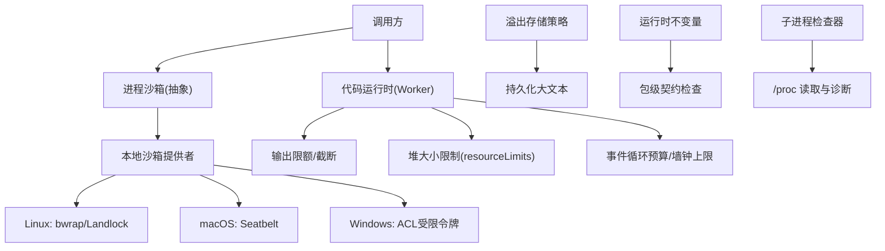
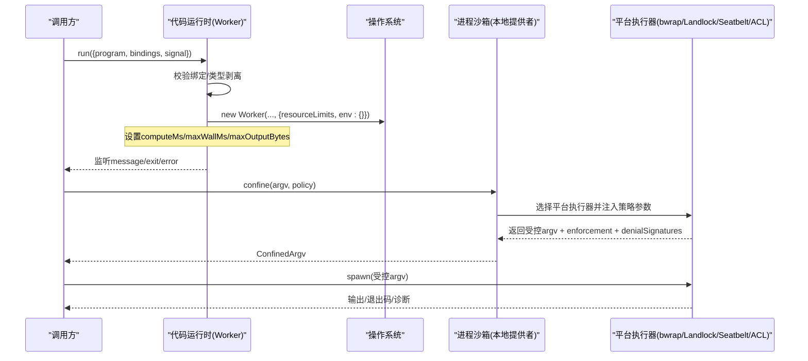
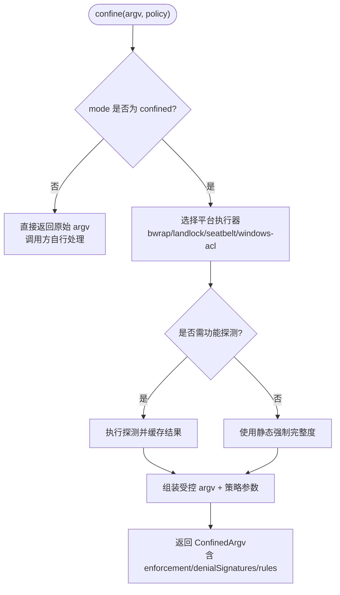
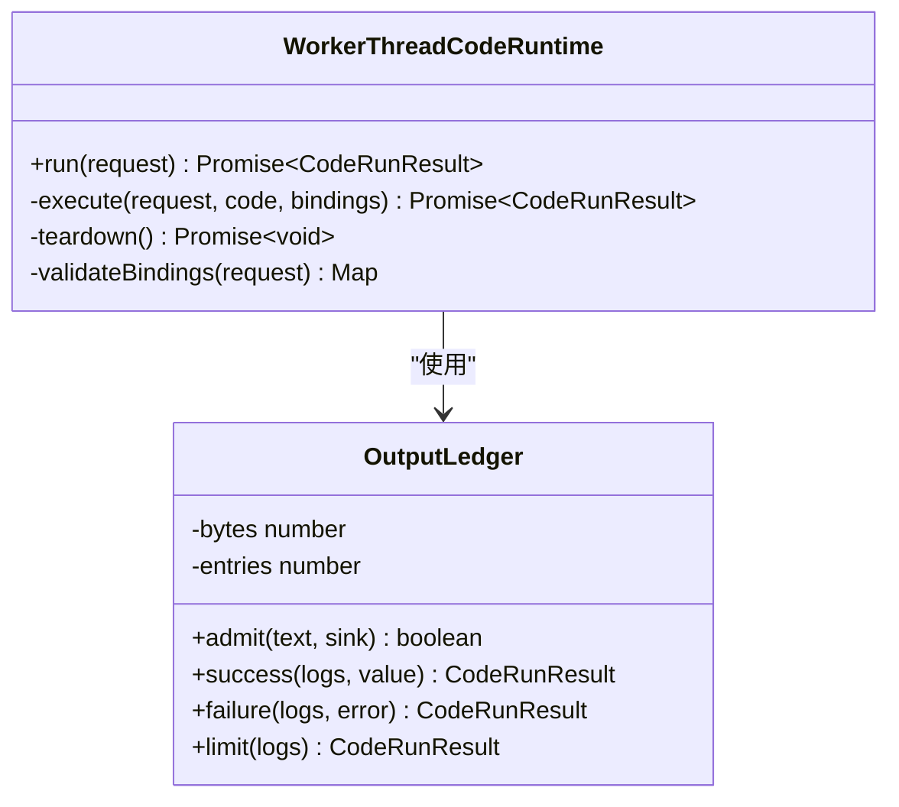
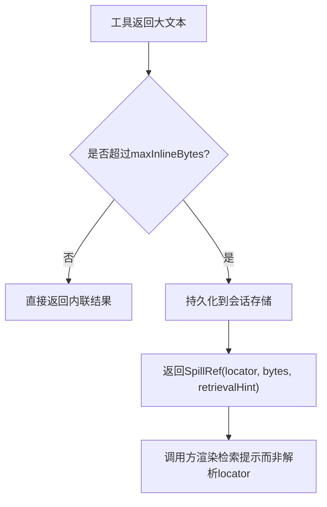
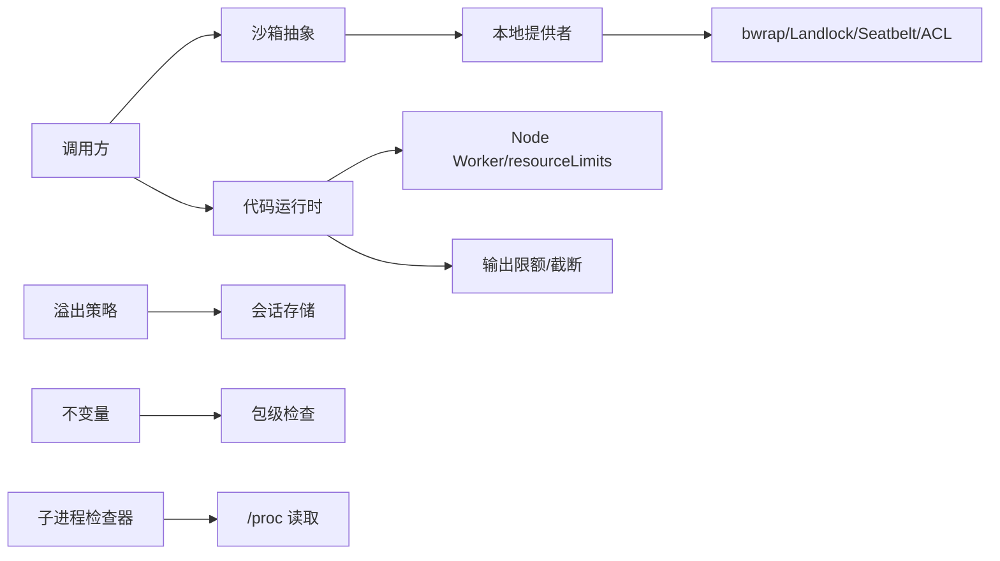

# 内存保护机制

<cite>
**本文引用的文件**
- [packages/sandbox/sandbox/src/index.ts](file://packages/sandbox/sandbox/src/index.ts)
- [packages/sandbox/sandbox-local/src/index.ts](file://packages/sandbox/sandbox-local/src/index.ts)
- [docs/subsystems/sandbox.md](file://docs/subsystems/sandbox.md)
- [packages/code-runtime/code-runtime-worker-thread/src/index.ts](file://packages/code-runtime/code-runtime-worker-thread/src/index.ts)
- [packages/runtime-diagnostics/invariants/src/index.ts](file://packages/runtime-diagnostics/invariants/src/index.ts)
- [packages/spill/spill-policy/src/index.ts](file://packages/spill/spill-policy/src/index.ts)
- [docs/subsystems/spill.md](file://docs/subsystems/spill.md)
- [packages/subprocess/subprocess-local/src/process-inspector.ts](file://packages/subprocess/subprocess-local/src/process-inspector.ts)
- [packages/boot/app-boot/src/index.ts](file://packages/boot/app-boot/src/index.ts)
</cite>

## 目录
1. [简介](#简介)
2. [项目结构](#项目结构)
3. [核心组件](#核心组件)
4. [架构总览](#架构总览)
5. [详细组件分析](#详细组件分析)
6. [依赖关系分析](#依赖关系分析)
7. [性能考量](#性能考量)
8. [故障排查指南](#故障排查指南)
9. [结论](#结论)
10. [附录](#附录)

## 简介
本文件系统化说明本仓库中的“内存保护机制”，覆盖以下方面：
- 内存隔离与访问控制：通过进程沙箱、工作线程隔离、资源配额与输出限额实现。
- 内存泄漏检测与防止：通过作用域清理、超时/中止、固定配额与失败快速退出，避免长期驻留对象。
- 内存使用限制与配额管理：事件循环忙碌时间预算、墙钟上限、旧代堆大小限制、输出字节上限。
- 敏感数据保护与内存清理策略：最小化日志/结果体积、溢出时截断并返回错误；沙箱临时目录与权限在生命周期结束时回收。
- 配置选项与性能优化建议：可配置的预算与限额、平台探测与回退策略。
- 监控与异常诊断：不变量注册、子进程检查器、启动期拒绝检查点等工具的使用方式。

## 项目结构
围绕内存保护的关键子系统分布在如下位置：
- 进程沙箱（跨平台）：定义抽象服务与模式，本地提供者选择具体后端（bwrap/Landlock/Seatbelt/Windows ACL）。
- 代码运行时（Worker 线程）：为模型代码提供独立 Worker，带计算预算、墙钟上限、输出限额与堆大小限制。
- 溢出存储策略：对超大文本结果进行落盘，避免内联占用过多内存。
- 运行时不变量：按包注册并执行运行时契约检查，尽早暴露问题。
- 子进程检查器：读取 /proc 信息辅助诊断进程状态与内存访问。
- 启动期拒绝检查点：捕获加载期未决拒绝，便于定位初始化阶段的内存/资源问题。

**图表来源**
- [packages/sandbox/sandbox/src/index.ts:158-176](file://packages/sandbox/sandbox/src/index.ts#L158-L176)
- [packages/sandbox/sandbox-local/src/index.ts:250-333](file://packages/sandbox/sandbox-local/src/index.ts#L250-L333)
- [packages/code-runtime/code-runtime-worker-thread/src/index.ts:238-271](file://packages/code-runtime/code-runtime-worker-thread/src/index.ts#L238-L271)
- [packages/spill/spill-policy/src/index.ts:110-121](file://packages/spill/spill-policy/src/index.ts#L110-L121)
- [packages/runtime-diagnostics/invariants/src/index.ts:94-118](file://packages/runtime-diagnostics/invariants/src/index.ts#L94-L118)
- [packages/subprocess/subprocess-local/src/process-inspector.ts:127-167](file://packages/subprocess/subprocess-local/src/process-inspector.ts#L127-L167)

**章节来源**
- [docs/subsystems/sandbox.md:1-219](file://docs/subsystems/sandbox.md#L1-L219)

## 核心组件
- 进程沙箱抽象与服务
  - 定义模式（只读/工作区写入/危险全访问）、执行策略、强制完整度（full/partial）以及失败分类规则。
  - 本地提供者负责平台链选择、功能探测、生成受控 argv 并返回 denial 签名与 runner 失败规则。
- 代码运行时（Worker 线程）
  - 每个程序运行在独立 Worker，具备：
    - computeMs：基于 measured busy time 的预算，超过即超时。
    - maxWallMs：绝对墙钟上限，兜底不可见等待。
    - maxOutputBytes：序列化日志/结果/错误消息的硬上限，超限则截断并返回 output-limit。
    - maxOldGenerationSizeMb：Node resourceLimits 限制旧代堆，超限时 Worker 退出。
- 溢出存储策略
  - 当最终文本结果超过阈值时，将内容持久化到会话级存储，返回定位符与检索提示，避免内联占用内存。
- 运行时不变量
  - 以包为单位注册检查，启用/过滤后在子 fiber 中执行，违反时抛出稳定错误码，便于定位。
- 子进程检查器
  - 通过 /proc 读取 syscall 与进程内存片段，辅助判断进程是否卡住或异常。
- 启动期拒绝检查点
  - 收集模块加载期的未决拒绝，延迟释放以便观察栈轨迹，帮助定位初始化阶段的问题。

**章节来源**
- [packages/sandbox/sandbox/src/index.ts:23-116](file://packages/sandbox/sandbox/src/index.ts#L23-L116)
- [packages/sandbox/sandbox-local/src/index.ts:250-333](file://packages/sandbox/sandbox-local/src/index.ts#L250-L333)
- [packages/code-runtime/code-runtime-worker-thread/src/index.ts:24-54](file://packages/code-runtime/code-runtime-worker-thread/src/index.ts#L24-L54)
- [packages/code-runtime/code-runtime-worker-thread/src/index.ts:168-229](file://packages/code-runtime/code-runtime-worker-thread/src/index.ts#L168-L229)
- [packages/code-runtime/code-runtime-worker-thread/src/index.ts:363-558](file://packages/code-runtime/code-runtime-worker-thread/src/index.ts#L363-L558)
- [docs/subsystems/spill.md:1-118](file://docs/subsystems/spill.md#L1-L118)
- [packages/spill/spill-policy/src/index.ts:110-121](file://packages/spill/spill-policy/src/index.ts#L110-L121)
- [packages/runtime-diagnostics/invariants/src/index.ts:94-197](file://packages/runtime-diagnostics/invariants/src/index.ts#L94-L197)
- [packages/subprocess/subprocess-local/src/process-inspector.ts:127-167](file://packages/subprocess/subprocess-local/src/process-inspector.ts#L127-L167)
- [packages/boot/app-boot/src/index.ts:565-578](file://packages/boot/app-boot/src/index.ts#L565-L578)

## 架构总览
下图展示一次受保护的代码执行流程：调用方提交程序，代码运行时在 Worker 中执行，受限于计算预算、墙钟上限、输出限额与堆大小；同时，外部命令通过进程沙箱包装执行，受文件系统策略约束。

**图表来源**
- [packages/code-runtime/code-runtime-worker-thread/src/index.ts:293-312](file://packages/code-runtime/code-runtime-worker-thread/src/index.ts#L293-L312)
- [packages/code-runtime/code-runtime-worker-thread/src/index.ts:363-441](file://packages/code-runtime/code-runtime-worker-thread/src/index.ts#L363-L441)
- [packages/sandbox/sandbox/src/index.ts:158-176](file://packages/sandbox/sandbox/src/index.ts#L158-L176)
- [packages/sandbox/sandbox-local/src/index.ts:316-333](file://packages/sandbox/sandbox-local/src/index.ts#L316-L333)

## 详细组件分析

### 进程沙箱：隔离与访问控制
- 模式与策略
  - read-only：仅允许必要写入（如 /dev/null），禁止写工作区。
  - workspace-write：允许在工作区根与后端提供的临时区域写入。
  - danger-full-access：不经过沙箱（由调用方自行决定）。
- 强制完整度
  - full：后端能完全承诺的文件效果。
  - partial：因内核 ABI 或平台限制，只能部分承诺（例如 Windows ACL 的 Everyone/hard-link 边界）。
- 本地提供者
  - 平台链选择：Linux 优先 bwrap，其次 Landlock；macOS 使用 Seatbelt；Windows 使用 ACL 受限令牌。
  - 功能探测：对候选执行器进行一次探测，缓存结果。
  - 失败分类：返回 denialSignatures 与 runnerFailureRules，区分“被沙箱阻止”和“沙箱自身失败”。

**图表来源**
- [packages/sandbox/sandbox-local/src/index.ts:492-539](file://packages/sandbox/sandbox-local/src/index.ts#L492-L539)
- [packages/sandbox/sandbox-local/src/index.ts:316-333](file://packages/sandbox/sandbox-local/src/index.ts#L316-L333)

**章节来源**
- [packages/sandbox/sandbox/src/index.ts:23-116](file://packages/sandbox/sandbox/src/index.ts#L23-L116)
- [packages/sandbox/sandbox-local/src/index.ts:250-333](file://packages/sandbox/sandbox-local/src/index.ts#L250-L333)
- [docs/subsystems/sandbox.md:9-157](file://docs/subsystems/sandbox.md#L9-L157)

### 代码运行时：内存预算与隔离
- 隔离模型
  - 每个程序在独立 Worker 中运行，空环境、无 execArgv 继承，降低污染面。
- 预算与限额
  - computeMs：基于 worker.performance.eventLoopUtilization() 的 measured busy time，公平且不可作弊。
  - maxWallMs：绝对墙钟上限，兜底无法观测的等待。
  - maxOutputBytes：日志/结果/错误消息的硬上限，超出则截断并返回 output-limit。
  - maxOldGenerationSizeMb：resourceLimits 限制旧代堆，超限时 Worker 退出。
- 生命周期与清理
  - dispose 会标记不可用、终止所有运行中的任务并等待 Worker 退出，确保无悬挂资源。

**图表来源**
- [packages/code-runtime/code-runtime-worker-thread/src/index.ts:238-271](file://packages/code-runtime/code-runtime-worker-thread/src/index.ts#L238-L271)
- [packages/code-runtime/code-runtime-worker-thread/src/index.ts:168-229](file://packages/code-runtime/code-runtime-worker-thread/src/index.ts#L168-L229)
- [packages/code-runtime/code-runtime-worker-thread/src/index.ts:293-312](file://packages/code-runtime/code-runtime-worker-thread/src/index.ts#L293-L312)
- [packages/code-runtime/code-runtime-worker-thread/src/index.ts:363-558](file://packages/code-runtime/code-runtime-worker-thread/src/index.ts#L363-L558)

**章节来源**
- [packages/code-runtime/code-runtime-worker-thread/src/index.ts:24-54](file://packages/code-runtime/code-runtime-worker-thread/src/index.ts#L24-L54)
- [packages/code-runtime/code-runtime-worker-thread/src/index.ts:168-229](file://packages/code-runtime/code-runtime-worker-thread/src/index.ts#L168-L229)
- [packages/code-runtime/code-runtime-worker-thread/src/index.ts:293-312](file://packages/code-runtime/code-runtime-worker-thread/src/index.ts#L293-L312)
- [packages/code-runtime/code-runtime-worker-thread/src/index.ts:363-558](file://packages/code-runtime/code-runtime-worker-thread/src/index.ts#L363-L558)

### 溢出存储：大对象内存压力缓解
- 触发条件：当工具的最终文本结果超过配置阈值时，策略层将其替换为“预览 + 落盘引用”。
- 语义：保存完整内容，返回定位符与检索提示；存储失败为最佳努力，不会把成功调用转为错误。
- 收益：避免内联大对象导致的高内存占用与序列化成本。

**图表来源**
- [docs/subsystems/spill.md:1-118](file://docs/subsystems/spill.md#L1-L118)
- [packages/spill/spill-policy/src/index.ts:110-121](file://packages/spill/spill-policy/src/index.ts#L110-L121)

**章节来源**
- [docs/subsystems/spill.md:1-118](file://docs/subsystems/spill.md#L1-L118)
- [packages/spill/spill-policy/src/index.ts:110-121](file://packages/spill/spill-policy/src/index.ts#L110-L121)

### 运行时不变量：契约与早期故障发现
- 能力：按包注册检查，支持全局开关与包名白/黑名单过滤。
- 行为：在子 fiber 中执行安装器，失败时抛出包含包名的 InvariantError，便于定位。
- 适用场景：验证内存/资源相关的前置假设（如配额、路径、句柄数量等）。

**章节来源**
- [packages/runtime-diagnostics/invariants/src/index.ts:94-197](file://packages/runtime-diagnostics/invariants/src/index.ts#L94-L197)

### 子进程检查器：诊断与内存访问探查
- 能力：读取 /proc/<pid>/task/<tid>/syscall 与 /proc/<pid>/mem，辅助判断进程状态与内存片段。
- 用途：定位僵尸进程、系统调用阻塞、可疑内存访问等。

**章节来源**
- [packages/subprocess/subprocess-local/src/process-inspector.ts:127-167](file://packages/subprocess/subprocess-local/src/process-inspector.ts#L127-L167)

### 启动期拒绝检查点：初始化阶段内存/资源问题定位
- 能力：收集模块加载期的未决拒绝，延迟释放以便观察完整栈轨迹。
- 用途：定位 require/import 阶段导致的内存/资源问题。

**章节来源**
- [packages/boot/app-boot/src/index.ts:565-578](file://packages/boot/app-boot/src/index.ts#L565-L578)

## 依赖关系分析
- 低耦合接口
  - 沙箱抽象与本地提供者分离，便于替换后端。
  - 代码运行时与协议解耦，通过消息端口通信。
- 关键依赖
  - Node Worker API、resourceLimits、eventLoopUtilization。
  - 平台工具：bwrap、Landlock launcher、sandbox-exec、Windows ACL runner。
  - 文件系统与 /proc 访问用于溢出存储与诊断。

**图表来源**
- [packages/sandbox/sandbox/src/index.ts:158-176](file://packages/sandbox/sandbox/src/index.ts#L158-L176)
- [packages/sandbox/sandbox-local/src/index.ts:250-333](file://packages/sandbox/sandbox-local/src/index.ts#L250-L333)
- [packages/code-runtime/code-runtime-worker-thread/src/index.ts:238-271](file://packages/code-runtime/code-runtime-worker-thread/src/index.ts#L238-L271)
- [packages/spill/spill-policy/src/index.ts:110-121](file://packages/spill/spill-policy/src/index.ts#L110-L121)
- [packages/runtime-diagnostics/invariants/src/index.ts:94-197](file://packages/runtime-diagnostics/invariants/src/index.ts#L94-L197)
- [packages/subprocess/subprocess-local/src/process-inspector.ts:127-167](file://packages/subprocess/subprocess-local/src/process-inspector.ts#L127-L167)

**章节来源**
- [docs/subsystems/sandbox.md:1-219](file://docs/subsystems/sandbox.md#L1-L219)

## 性能考量
- 预算粒度
  - computeMs 基于 measured busy time，避免空闲等待计入预算，提高公平性。
  - 采样间隔固定为内部常量，权衡精度与开销。
- 限额策略
  - maxOutputBytes 在多处拦截（日志、结果、错误消息），避免序列化膨胀。
  - maxOldGenerationSizeMb 通过 resourceLimits 直接限制堆增长，必要时触发 Worker 退出。
- 平台探测
  - 一次性探测并缓存结果，减少重复开销。
- 溢出存储
  - 将大文本外迁至磁盘，显著降低主进程内存峰值。

[本节为通用指导，无需特定文件来源]

## 故障排查指南
- 沙箱不可用或被拒绝
  - 现象：confine 抛出不可用错误或返回 runner 失败规则匹配。
  - 排查：检查平台工具可用性、runnerFailureSignatures 与 denialSignatures，确认强制完整度。
- 代码运行超时或输出超限
  - 现象：返回 timeout 或 output-limit。
  - 排查：调整 computeMs/maxWallMs/maxOutputBytes，检查绑定函数是否阻塞。
- 堆溢出
  - 现象：worker-exit。
  - 排查：调小 maxOldGenerationSizeMb，检查是否存在大对象累积。
- 大结果导致内存压力
  - 现象：高内存占用。
  - 排查：启用溢出存储策略，检查 maxInlineBytes 配置。
- 初始化阶段问题
  - 现象：模块加载期拒绝。
  - 排查：查看启动期拒绝检查点收集的 reasons。
- 进程卡死或异常
  - 现象：长时间无响应。
  - 排查：使用子进程检查器读取 /proc 信息，定位 syscall 与内存访问。

**章节来源**
- [packages/sandbox/sandbox/src/index.ts:118-144](file://packages/sandbox/sandbox/src/index.ts#L118-L144)
- [packages/sandbox/sandbox-local/src/index.ts:250-333](file://packages/sandbox/sandbox-local/src/index.ts#L250-L333)
- [packages/code-runtime/code-runtime-worker-thread/src/index.ts:534-558](file://packages/code-runtime/code-runtime-worker-thread/src/index.ts#L534-L558)
- [docs/subsystems/spill.md:81-118](file://docs/subsystems/spill.md#L81-L118)
- [packages/boot/app-boot/src/index.ts:565-578](file://packages/boot/app-boot/src/index.ts#L565-L578)
- [packages/subprocess/subprocess-local/src/process-inspector.ts:127-167](file://packages/subprocess/subprocess-local/src/process-inspector.ts#L127-L167)

## 结论
本仓库通过多层防护实现内存保护：
- 进程级隔离与访问控制（沙箱）确保外部命令的最小权限执行。
- 线程级隔离与资源配额（Worker）保障模型代码的可控执行。
- 溢出存储与限额截断有效缓解大对象带来的内存压力。
- 运行时不变量与诊断工具帮助快速定位问题。
合理配置预算与限额、结合平台特性与探测回退，可在安全与性能之间取得平衡。

[本节为总结，无需特定文件来源]

## 附录
- 配置项速览（来自各组件）
  - 代码运行时：computeMs、maxWallMs、maxOutputBytes、maxOldGenerationSizeMb。
  - 沙箱本地提供者：runnerCommand、runnerFailureSignatures、probeTimeoutMs。
  - 溢出策略：maxInlineBytes（启用时生效）。
  - 运行时不变量：enabled、package_allowlist、package_blocklist。
- 使用建议
  - 生产环境建议开启溢出存储，并根据业务特征设定合理的 maxInlineBytes。
  - 根据负载与模型复杂度调整 computeMs 与 maxWallMs，避免误杀或资源滥用。
  - 在 Linux/macOS/Windows 上分别验证平台工具可用性与强制完整度。
  - 利用不变量与子进程检查器建立持续监控与告警。

**章节来源**
- [packages/code-runtime/code-runtime-worker-thread/src/index.ts:238-271](file://packages/code-runtime/code-runtime-worker-thread/src/index.ts#L238-L271)
- [packages/sandbox/sandbox-local/src/index.ts:250-256](file://packages/sandbox/sandbox-local/src/index.ts#L250-L256)
- [packages/spill/spill-policy/src/index.ts:110-121](file://packages/spill/spill-policy/src/index.ts#L110-L121)
- [packages/runtime-diagnostics/invariants/src/index.ts:94-118](file://packages/runtime-diagnostics/invariants/src/index.ts#L94-L118)