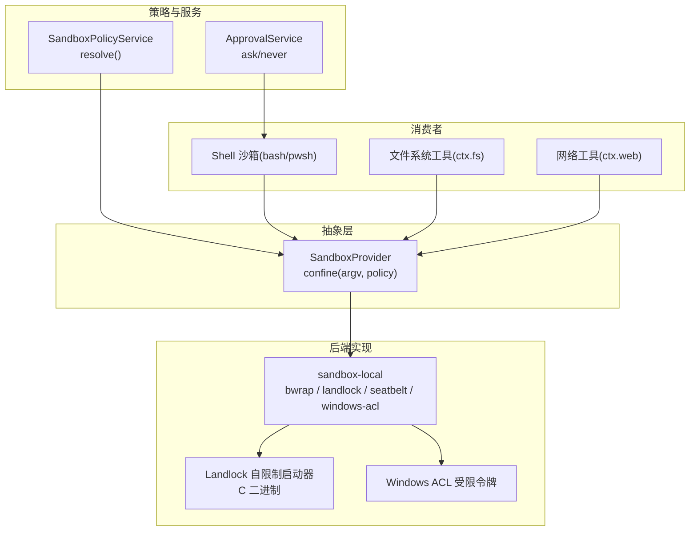
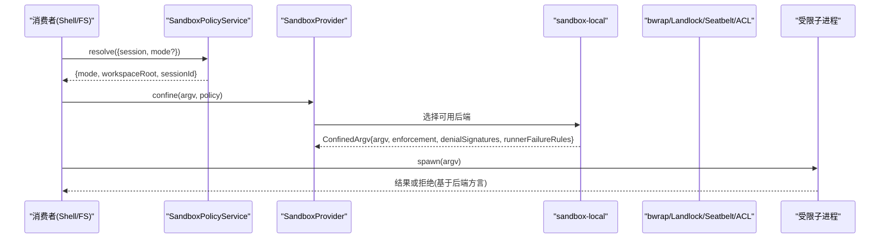
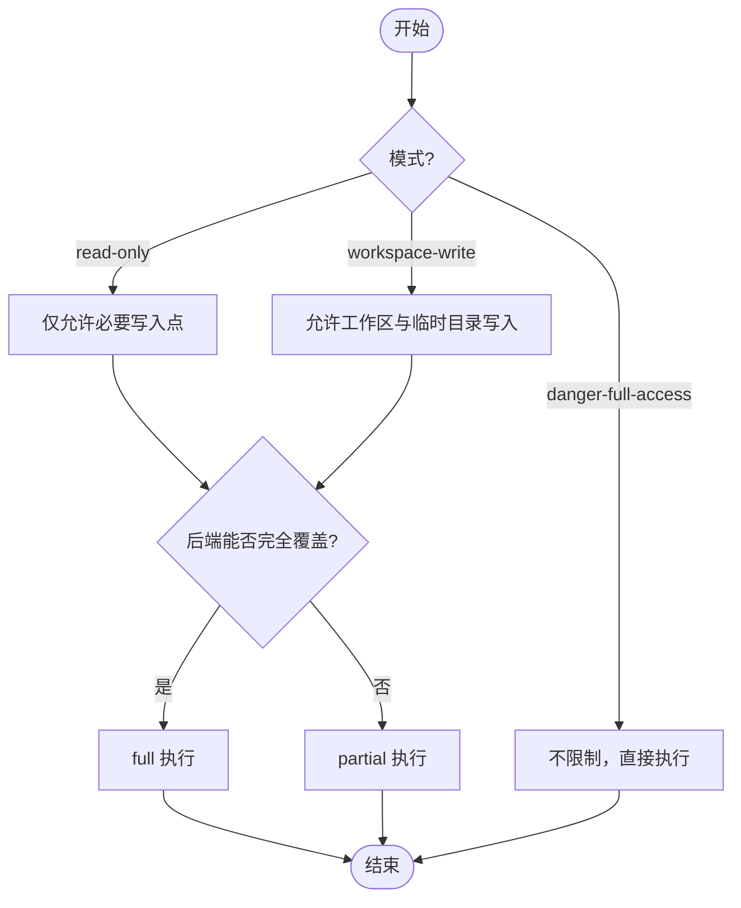
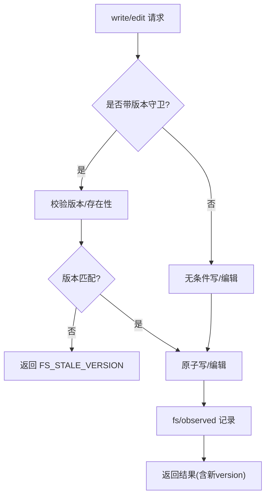
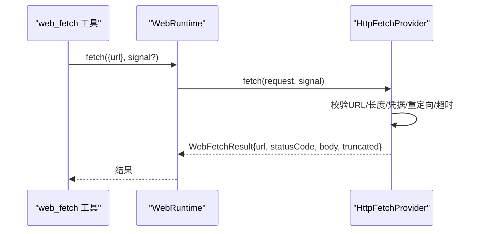
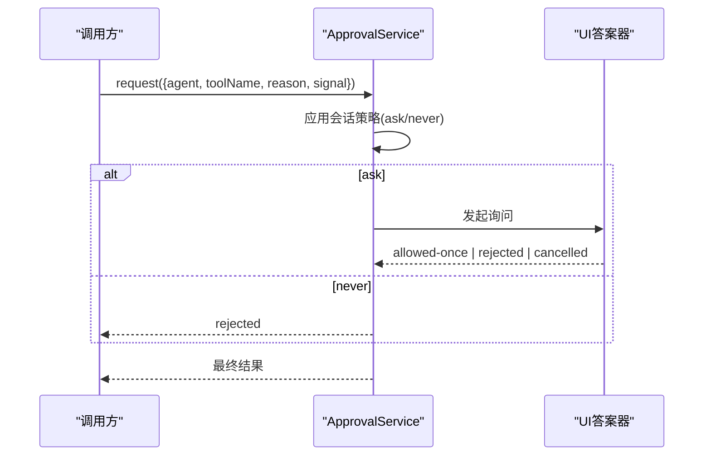
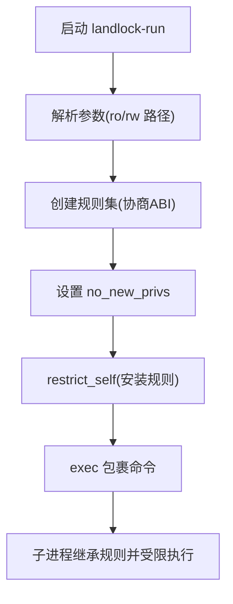
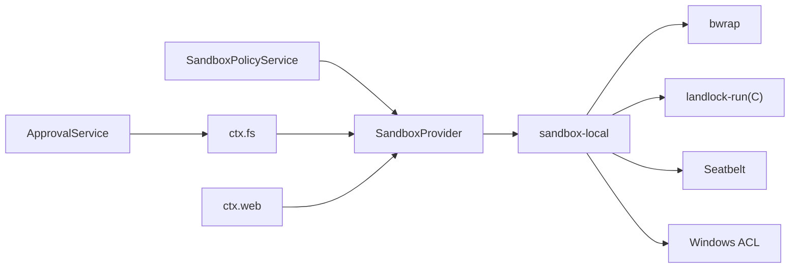

# 安全沙箱

<cite>
**本文引用的文件**
- [packages/sandbox/sandbox/src/index.ts](file://packages/sandbox/sandbox/src/index.ts)
- [packages/sandbox/sandbox-local/src/index.ts](file://packages/sandbox/sandbox-local/src/index.ts)
- [native/landlock-run/packages/entry/src/main.c](file://native/landlock-run/packages/entry/src/main.c)
- [native/landlock-run/README.md](file://native/landlock-run/README.md)
- [packages/sandbox/sandbox-windows-acl/src/index.ts](file://packages/sandbox/sandbox-windows-acl/src/index.ts)
- [packages/sandbox/sandbox-windows-acl/tests/index-failure-paths.spec.ts](file://packages/sandbox/sandbox-windows-acl/tests/index-failure-paths.spec.ts)
- [packages/sandbox/sandbox-local/tests/local.spec.ts](file://packages/sandbox/sandbox-local/tests/local.spec.ts)
- [packages/sandbox/sandbox-local/tests/landlock.e2e.ts](file://packages/sandbox/sandbox-local/tests/landlock.e2e.ts)
- [docs/subsystems/sandbox.md](file://docs/subsystems/sandbox.md)
- [docs/subsystems/filesystem.md](file://docs/subsystems/filesystem.md)
- [docs/subsystems/approval.md](file://docs/subsystems/approval.md)
- [docs/subsystems/web.md](file://docs/subsystems/web.md)
- [packages/web/web/src/index.ts](file://packages/web/web/src/index.ts)
- [packages/web/web-fetch-http/src/index.ts](file://packages/web/web-fetch-http/src/index.ts)
- [packages/web/web-fetch-http/tests/fetch-http.spec.ts](file://packages/web/web-fetch-http/tests/fetch-http.spec.ts)
- [packages/util/timeout/src/index.ts](file://packages/util/timeout/src/index.ts)
- [packages/guard/timeout-policy/README.md](file://packages/guard/timeout-policy/README.md)
- [packages/sdk/client/src/dispose.ts](file://packages/sdk/client/src/dispose.ts)
</cite>

## 目录
1. [简介](#简介)
2. [项目结构](#项目结构)
3. [核心组件](#核心组件)
4. [架构总览](#架构总览)
5. [详细组件分析](#详细组件分析)
6. [依赖关系分析](#依赖关系分析)
7. [性能与资源限制](#性能与资源限制)
8. [故障排查指南](#故障排查指南)
9. [结论](#结论)
10. [附录：配置与安全加固建议](#附录：配置与安全加固建议)

## 简介
本文件面向“安全沙箱”子系统，系统性说明进程隔离、文件系统访问控制、网络访问控制、内存与资源限制、审批流程与权限策略、以及审计日志的实现方式。文档以仓库中的源码与文档为依据，提供可操作的配置示例与漏洞防护建议，帮助读者在不深入代码的前提下理解并正确使用该沙箱能力。

## 项目结构
安全沙箱由“抽象服务定义 + 多平台后端实现 + 策略与服务编排 + 工具与消费者”构成：
- 抽象服务：统一进程隔离接口（confine）与执行策略（mode/workspaceRoot/sessionId）。
- 本地后端：Linux（bwrap/Landlock）、macOS（Seatbelt）、Windows（ACL受限令牌），按平台选择并报告执行完整性（full/partial）。
- 策略与服务：会话级模式解析、默认回退、工作区根路径；用户审批策略（ask/never）。
- 工具与消费者：bash/pwsh 沙箱化执行、文件系统工具、网络工具等通过统一接口调用。

图表来源
- [packages/sandbox/sandbox/src/index.ts:158-176](file://packages/sandbox/sandbox/src/index.ts#L158-L176)
- [packages/sandbox/sandbox-local/src/index.ts:168-186](file://packages/sandbox/sandbox-local/src/index.ts#L168-L186)
- [native/landlock-run/README.md:25-44](file://native/landlock-run/README.md#L25-L44)
- [docs/subsystems/sandbox.md:9-39](file://docs/subsystems/sandbox.md#L9-L39)

章节来源
- [docs/subsystems/sandbox.md:9-39](file://docs/subsystems/sandbox.md#L9-L39)
- [packages/sandbox/sandbox/src/index.ts:158-176](file://packages/sandbox/sandbox/src/index.ts#L158-L176)
- [packages/sandbox/sandbox-local/src/index.ts:168-186](file://packages/sandbox/sandbox-local/src/index.ts#L168-L186)

## 核心组件
- 进程隔离抽象：SandboxProvider.confine(argv, policy) 返回受约束的 argv 及执行完整性（full/partial），禁止静默放行。
- 执行策略：SandboxExecutionPolicy/SandboxPolicy 携带 mode（read-only/workspace-write/danger-full-access）、workspaceRoot、sessionId。
- 后端选择：sandbox-local 根据平台与可用性选择 bwrap/landlock/seatbelt/windows-acl，并声明各自 enforcement 完整度。
- Landlock 启动器：自限制后 exec，继承规则到子进程，失败关闭。
- Windows ACL：受限令牌+SID授权，部分能力存在边界（partial）。
- 审批策略：ApprovalService 支持 ask/never，fail-closed。
- 文件系统：ctx.fs 提供原子读写/编辑、版本守卫、观察事件；沙箱后端在写/编辑时按策略拦截。
- 网络访问：ctx.web 统一搜索/抓取，HTTP 提供者限协议、长度、重定向、超时、内容类型。

章节来源
- [packages/sandbox/sandbox/src/index.ts:23-72](file://packages/sandbox/sandbox/src/index.ts#L23-L72)
- [docs/subsystems/sandbox.md:41-94](file://docs/subsystems/sandbox.md#L41-L94)
- [packages/sandbox/sandbox-local/src/index.ts:168-186](file://packages/sandbox/sandbox-local/src/index.ts#L168-L186)
- [native/landlock-run/README.md:25-44](file://native/landlock-run/README.md#L25-L44)
- [docs/subsystems/filesystem.md:114-179](file://docs/subsystems/filesystem.md#L114-L179)
- [docs/subsystems/approval.md:31-47](file://docs/subsystems/approval.md#L31-L47)
- [docs/subsystems/web.md:120-133](file://docs/subsystems/web.md#L120-L133)

## 架构总览
下图展示一次“受限执行”的端到端流程：消费者解析策略 -> 调用 confine -> 后端选择运行器 -> 生成受限 argv -> 父进程 spawn 受限 argv -> 子进程在系统层面被限制。

图表来源
- [packages/sandbox/sandbox/src/index.ts:158-176](file://packages/sandbox/sandbox/src/index.ts#L158-L176)
- [packages/sandbox/sandbox-local/src/index.ts:335-344](file://packages/sandbox/sandbox-local/src/index.ts#L335-L344)
- [docs/subsystems/sandbox.md:152-157](file://docs/subsystems/sandbox.md#L152-L157)

## 详细组件分析

### 进程隔离机制与安全保障
- 模式与强制粒度
  - read-only：仅允许必要写入点（如 /dev/null），其余写操作被拒绝。
  - workspace-write：允许在工作区根与后端临时目录内写入。
  - danger-full-access：不进入沙箱，直接执行原始 argv。
- 执行完整性
  - full：后端能完全覆盖模式承诺的文件效果。
  - partial：内核 ABI 或平台限制导致仅部分覆盖（如旧版 Landlock、Windows ACL 的 Everyone/hard-link 边界）。
- 失败关闭
  - 无可用后端时抛出不可用错误；禁止静默降级为未受限执行。
- 平台后端
  - Linux：bwrap（容器式绑定）、Landlock（内核级白名单）、Seatbelt（macOS）。
  - Windows：ACL 受限令牌 + SID 授权，声明 partial。

图表来源
- [docs/subsystems/sandbox.md:9-39](file://docs/subsystems/sandbox.md#L9-L39)
- [packages/sandbox/sandbox-local/src/index.ts:168-186](file://packages/sandbox/sandbox-local/src/index.ts#L168-L186)

章节来源
- [docs/subsystems/sandbox.md:9-39](file://docs/subsystems/sandbox.md#L9-L39)
- [packages/sandbox/sandbox/src/index.ts:118-144](file://packages/sandbox/sandbox/src/index.ts#L118-L144)
- [packages/sandbox/sandbox-local/src/index.ts:168-186](file://packages/sandbox/sandbox-local/src/index.ts#L168-L186)

### 文件系统访问控制（读写权限、路径限制、类型过滤）
- 目标标识与元数据
  - 通过 FsTarget/FsInfo/FsPathInfo 描述目标与类型，避免直接解析内部 key。
- 写/编辑守卫
  - writeText/editText 支持可选版本守卫（createIfAbsent/replaceIfVersion），保证原子性与一致性。
- 观察事件
  - fs/write-intent、fs/edit-intent 为单槽决策瀑布；fs/observed 记录存在/不存在。
- 沙箱集成
  - 沙箱后端在写/编辑时依据 per-call 策略拦截；FS_SANDBOX_DENIED 表示策略拒绝。
- 路径与类型
  - lstat 可用于信任边界检查（如拒绝符号链接）；listDir 稳定排序且不读取内容。

图表来源
- [docs/subsystems/filesystem.md:114-179](file://docs/subsystems/filesystem.md#L114-L179)
- [docs/subsystems/filesystem.md:181-243](file://docs/subsystems/filesystem.md#L181-L243)
- [docs/subsystems/filesystem.md:244-271](file://docs/subsystems/filesystem.md#L244-L271)

章节来源
- [docs/subsystems/filesystem.md:11-94](file://docs/subsystems/filesystem.md#L11-L94)
- [docs/subsystems/filesystem.md:114-179](file://docs/subsystems/filesystem.md#L114-L179)
- [docs/subsystems/filesystem.md:181-243](file://docs/subsystems/filesystem.md#L181-L243)
- [docs/subsystems/filesystem.md:244-271](file://docs/subsystems/filesystem.md#L244-L271)

### 网络访问控制（域名白名单、协议限制、流量监控）
- 能力抽象
  - ctx.web 统一 search/fetch，provider 选择与错误词汇表集中管理。
- HTTP 提供者限制
  - 仅接受 http/https，拒绝 URL 中凭据，限制 URL 长度、响应字节数、解码字符数、跳转次数、超时。
  - 非 2xx 视为结果而非错误；内容类型分类用于消费端渲染。
- 域名白名单
  - 当前 HTTP 提供者未内置域名白名单；如需白名单应在上层策略或网关处实现。
- 流量监控
  - 可通过外部代理/网关进行流量观测；能力层本身不输出流量统计。

图表来源
- [docs/subsystems/web.md:70-133](file://docs/subsystems/web.md#L70-L133)
- [packages/web/web/src/index.ts:149-169](file://packages/web/web/src/index.ts#L149-L169)
- [packages/web/web-fetch-http/src/index.ts:33-66](file://packages/web/web-fetch-http/src/index.ts#L33-L66)
- [packages/web/web-fetch-http/tests/fetch-http.spec.ts:43-50](file://packages/web/web-fetch-http/tests/fetch-http.spec.ts#L43-L50)

章节来源
- [docs/subsystems/web.md:70-133](file://docs/subsystems/web.md#L70-L133)
- [packages/web/web-fetch-http/src/index.ts:33-66](file://packages/web/web-fetch-http/src/index.ts#L33-L66)
- [packages/web/web-fetch-http/tests/fetch-http.spec.ts:276-306](file://packages/web/web-fetch-http/tests/fetch-http.spec.ts#L276-L306)

### 内存保护与资源限制
- 进程级资源
  - 通过沙箱后端限制文件系统访问；网络请求受 HTTP 提供者大小/超时限制。
- 超时与取消
  - 超时库负责计时与原因分类；各能力自行实现终止（信号/中止）。
  - SDK 客户端对运行时进程使用 SIGKILL 并等待退出，超时则报错。
- 内存相关
  - 读/写/流式读取均提供上限（如 readBytes maxBytes、web 响应体限制），防止过大缓冲。

章节来源
- [packages/util/timeout/src/index.ts:1-31](file://packages/util/timeout/src/index.ts#L1-L31)
- [packages/guard/timeout-policy/README.md:54-58](file://packages/guard/timeout-policy/README.md#L54-L58)
- [packages/sdk/client/src/dispose.ts:34-68](file://packages/sdk/client/src/dispose.ts#L34-L68)
- [docs/subsystems/filesystem.md:55-71](file://docs/subsystems/filesystem.md#L55-L71)
- [docs/subsystems/web.md:120-133](file://docs/subsystems/web.md#L120-L133)

### 审批流程与权限管理策略
- 审批服务
  - ApprovalService 提供 ask/never 策略；ask 委托给答案器链，never 直接拒绝。
  - 所有 ask/decided 成对审计，fail-closed。
- 权限预设
  - 预设将 sandbox 模式与 approval 策略组合，便于一键切换。
- 升级与重试
  - 沙箱支持“批准后的更宽模式重试”，每次调用独立策略，不会污染 provider 状态。

图表来源
- [docs/subsystems/approval.md:31-47](file://docs/subsystems/approval.md#L31-L47)
- [docs/subsystems/approval.md:51-88](file://docs/subsystems/approval.md#L51-L88)
- [docs/subsystems/approval.md:100-140](file://docs/subsystems/approval.md#L100-L140)

章节来源
- [docs/subsystems/approval.md:31-47](file://docs/subsystems/approval.md#L31-L47)
- [docs/subsystems/approval.md:51-88](file://docs/subsystems/approval.md#L51-L88)
- [docs/subsystems/approval.md:100-140](file://docs/subsystems/approval.md#L100-L140)

### 关键流程图：Landlock 自限制与执行

图表来源
- [native/landlock-run/packages/entry/src/main.c:220-267](file://native/landlock-run/packages/entry/src/main.c#L220-L267)
- [native/landlock-run/README.md:25-44](file://native/landlock-run/README.md#L25-L44)

章节来源
- [native/landlock-run/packages/entry/src/main.c:220-267](file://native/landlock-run/packages/entry/src/main.c#L220-L267)
- [native/landlock-run/README.md:25-44](file://native/landlock-run/README.md#L25-L44)

## 依赖关系分析
- 抽象与实现解耦：SandboxProvider 抽象，sandbox-local 聚合多后端；不同平台按需启用。
- 策略与执行分离：SandboxPolicyService 负责 per-call 策略解析；消费者在调用前确定策略。
- 工具与后端弱耦合：文件系统/网络工具通过 ctx.* 调用，不感知具体后端。
- 审计与策略联动：审批策略影响行为分支；文件系统观察事件与沙箱策略共同决定写/编辑意图。

图表来源
- [packages/sandbox/sandbox/src/index.ts:158-176](file://packages/sandbox/sandbox/src/index.ts#L158-L176)
- [packages/sandbox/sandbox-local/src/index.ts:168-186](file://packages/sandbox/sandbox-local/src/index.ts#L168-L186)
- [docs/subsystems/filesystem.md:276-279](file://docs/subsystems/filesystem.md#L276-L279)
- [docs/subsystems/web.md:120-133](file://docs/subsystems/web.md#L120-L133)
- [docs/subsystems/approval.md:100-140](file://docs/subsystems/approval.md#L100-L140)

章节来源
- [packages/sandbox/sandbox/src/index.ts:158-176](file://packages/sandbox/sandbox/src/index.ts#L158-L176)
- [packages/sandbox/sandbox-local/src/index.ts:168-186](file://packages/sandbox/sandbox-local/src/index.ts#L168-L186)
- [docs/subsystems/filesystem.md:276-279](file://docs/subsystems/filesystem.md#L276-L279)
- [docs/subsystems/web.md:120-133](file://docs/subsystems/web.md#L120-L133)
- [docs/subsystems/approval.md:100-140](file://docs/subsystems/approval.md#L100-L140)

## 性能与资源限制
- 文件系统
  - 读/写/编辑均为原子操作；读支持流式与大文件上限；列表不读取内容。
- 网络
  - 响应体/解码体/URL 长度/跳转/超时均有上限；非 2xx 仍返回结果，避免异常开销。
- 超时
  - 超时库仅做计时与分类；实际终止由各能力实现（信号/中止）。
- 进程终止
  - SDK 客户端对运行时进程使用 SIGKILL，并在宽限期内等待退出，否则报错。

章节来源
- [docs/subsystems/filesystem.md:55-71](file://docs/subsystems/filesystem.md#L55-L71)
- [docs/subsystems/web.md:120-133](file://docs/subsystems/web.md#L120-L133)
- [packages/util/timeout/src/index.ts:1-31](file://packages/util/timeout/src/index.ts#L1-L31)
- [packages/sdk/client/src/dispose.ts:34-68](file://packages/sdk/client/src/dispose.ts#L34-L68)

## 故障排查指南
- 沙箱不可用
  - 现象：confine 抛出不可用错误；需安装/启用对应后端或切换到 danger-full-access。
  - 定位：检查平台后端可用性（bwrap/Landlock/Seatbelt/ACL）。
- 部分强制（partial）
  - 现象：后端声明 partial（如 Windows ACL 的 Everyone/hard-link 边界）。
  - 处理：对绝对边界要求高的场景应拒绝或提示风险。
- 文件系统拒绝
  - 现象：FS_SANDBOX_DENIED（策略拒绝）或 FS_PERMISSION_DENIED（内核拒绝）。
  - 处理：检查工作区根、只读模式、符号链接与特殊文件。
- 网络错误
  - 现象：WEB_INVALID_URL/WEB_BLOCKED_URL/WEB_FETCH_TIMEOUT/WEB_UNSUPPORTED_CONTENT_TYPE。
  - 处理：校验 URL、凭据、长度、超时与内容类型。
- 审批失败
  - 现象：unavailable/rejected/cancelled。
  - 处理：确认会话策略（ask/never）与答案器可用性。

章节来源
- [packages/sandbox/sandbox/src/index.ts:118-144](file://packages/sandbox/sandbox/src/index.ts#L118-L144)
- [packages/sandbox/sandbox-local/src/index.ts:168-186](file://packages/sandbox/sandbox-local/src/index.ts#L168-L186)
- [docs/subsystems/filesystem.md:244-271](file://docs/subsystems/filesystem.md#L244-L271)
- [docs/subsystems/web.md:120-133](file://docs/subsystems/web.md#L120-L133)
- [docs/subsystems/approval.md:21-29](file://docs/subsystems/approval.md#L21-L29)

## 结论
该沙箱通过“抽象服务 + 多后端 + 策略 + 工具”的分层设计，实现了跨平台的进程隔离与细粒度的资源访问控制。文件系统采用原子写/编辑与版本守卫，网络访问具备严格的协议与资源限制，审批流程确保高风险操作的可控性。部署时应结合平台能力选择合适后端，合理配置模式与工作区根，并通过审批策略与审计日志保障合规与可追溯。

## 附录：配置与安全加固建议
- 进程隔离
  - 优先使用 read-only 或 workspace-write；仅在必要时使用 danger-full-access。
  - 关注 enforcement=partial 的平台差异，对绝对边界需求进行风险评估。
- 文件系统
  - 使用 lstat 进行信任边界检查（拒绝符号链接）。
  - 始终传递版本守卫进行写/编辑，避免竞态与覆盖。
  - 利用 fs/observed 建立“先读后写”的安全基线。
- 网络访问
  - 限制 URL 长度、响应体大小、跳转次数与超时。
  - 不在可信环境外暴露 web_fetch，避免访问内网敏感地址。
  - 如需域名白名单，在上层策略或网关实现。
- 资源限制
  - 为长耗时任务设置超时；对大文件读取使用流式与上限。
  - 对运行时进程使用 SIGKILL 并设置退出宽限期。
- 审批与审计
  - 默认策略设为 ask，配合 UI 答案器；headless/CI 使用 never。
  - 开启审批审计事件（approval/asked + approval/decided）以便追踪。
- 示例策略（概念性）
  - 开发环境：workspace-write + ask，允许工作区内写，需要审批时弹出确认。
  - CI 环境：read-only + never，禁止写与交互，快速失败。
  - 生产环境：read-only + ask（或 never），严格限制写与网络，审计全量。

章节来源
- [docs/subsystems/sandbox.md:9-39](file://docs/subsystems/sandbox.md#L9-L39)
- [docs/subsystems/filesystem.md:114-179](file://docs/subsystems/filesystem.md#L114-L179)
- [docs/subsystems/web.md:120-133](file://docs/subsystems/web.md#L120-L133)
- [docs/subsystems/approval.md:31-47](file://docs/subsystems/approval.md#L31-L47)