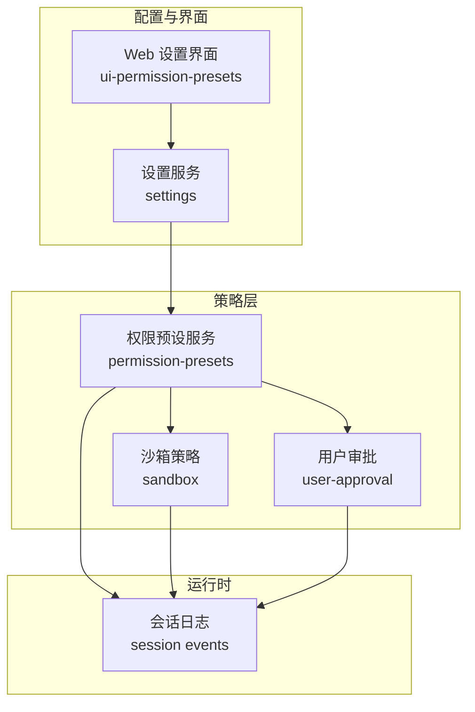
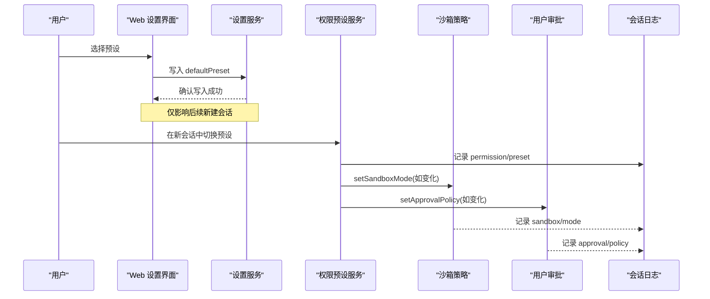
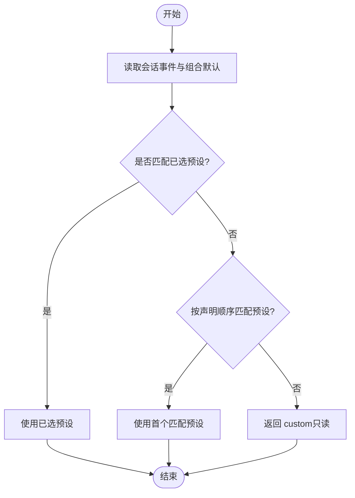
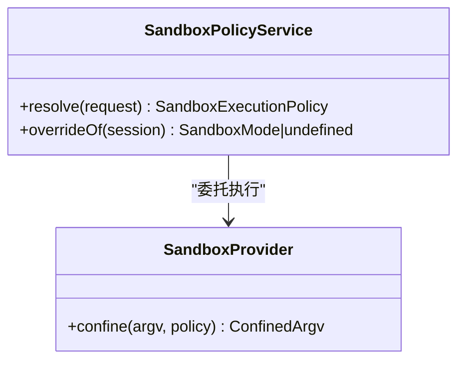
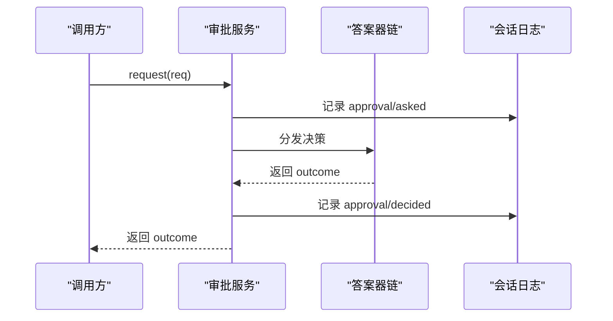
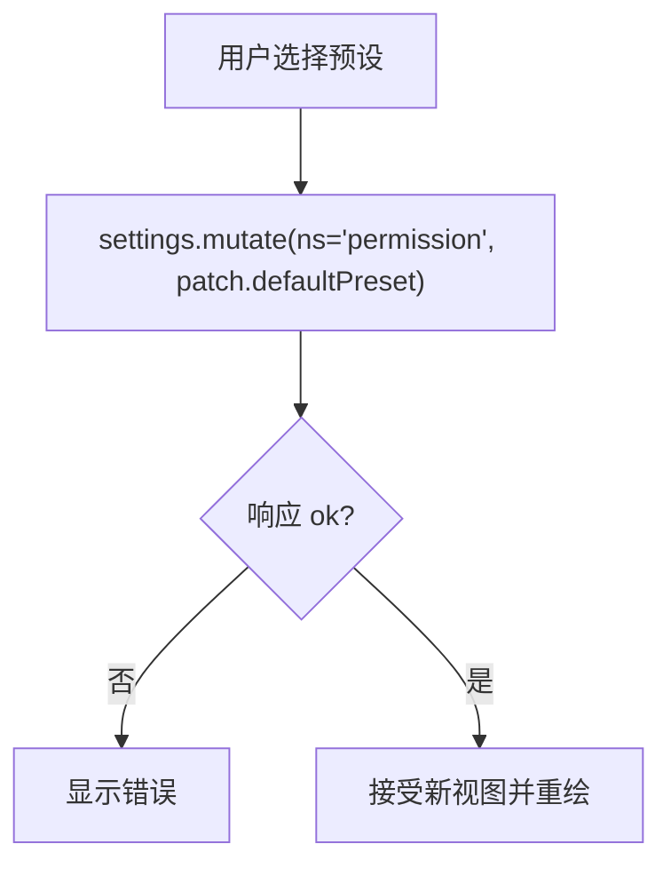
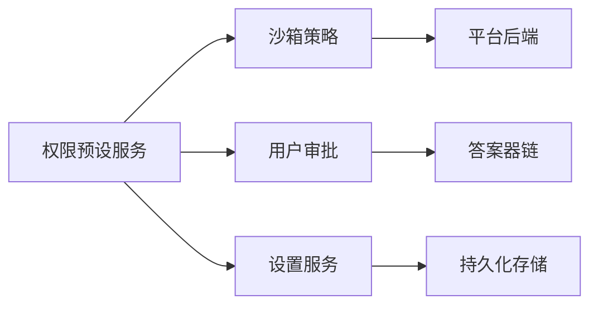

# 安全策略配置

<cite>
**本文引用的文件**
- [packages/interaction/permission-presets/src/index.ts](file://packages/interaction/permission-presets/src/index.ts)
- [packages/interaction/permission-presets/README.md](file://packages/interaction/permission-presets/README.md)
- [docs/subsystems/sandbox.md](file://docs/subsystems/sandbox.md)
- [docs/subsystems/approval.md](file://docs/subsystems/approval.md)
- [packages/settings/settings/src/index.ts](file://packages/settings/settings/src/index.ts)
- [packages/client/ui-permission-presets/src/client/settings-store.ts](file://packages/client/ui-permission-presets/src/client/settings-store.ts)
- [apps/web/tests/settings-chrome.e2e.ts](file://apps/web/tests/settings-chrome.e2e.ts)
- [scripts/verify-config-source-ownership.ts](file://scripts/verify-config-source-ownership.ts)
</cite>

## 目录
1. [简介](#简介)
2. [项目结构](#项目结构)
3. [核心组件](#核心组件)
4. [架构总览](#架构总览)
5. [详细组件分析](#详细组件分析)
6. [依赖关系分析](#依赖关系分析)
7. [性能考虑](#性能考虑)
8. [故障排查指南](#故障排查指南)
9. [结论](#结论)
10. [附录](#附录)

## 简介
本文件系统化说明“安全策略配置”的定义语法、配置格式、预设模板与默认值、继承与覆盖机制、验证与测试方法、最佳实践与常见示例，以及版本管理与迁移建议。该能力由“权限预设（Permission Presets）”将两个独立的安全控制点——沙箱模式（sandbox/mode）与审批策略（approval/policy）——打包为可选择的“预设”，并通过设置服务持久化默认值，在会话创建时固化到会话日志中，确保后续行为可重放与可审计。

## 项目结构
与安全策略相关的代码与文档主要分布在以下位置：
- 权限预设服务与类型定义：packages/interaction/permission-presets
- 沙箱策略与执行边界：docs/subsystems/sandbox.md 及对应实现
- 用户审批策略与问答流：docs/subsystems/approval.md 及对应实现
- 设置服务与命名空间注册：packages/settings/settings/src/index.ts
- Web 客户端对默认预设的写入：packages/client/ui-permission-presets/src/client/settings-store.ts
- 端到端用例与断言：apps/web/tests/settings-chrome.e2e.ts
- 配置来源合规校验脚本：scripts/verify-config-source-ownership.ts

图表来源
- [packages/interaction/permission-presets/src/index.ts:72-104](file://packages/interaction/permission-presets/src/index.ts#L72-L104)
- [docs/subsystems/sandbox.md:9-23](file://docs/subsystems/sandbox.md#L9-L23)
- [docs/subsystems/approval.md:31-47](file://docs/subsystems/approval.md#L31-L47)
- [packages/settings/settings/src/index.ts:36-62](file://packages/settings/settings/src/index.ts#L36-L62)
- [packages/client/ui-permission-presets/src/client/settings-store.ts:128-161](file://packages/client/ui-permission-presets/src/client/settings-store.ts#L128-L161)

章节来源
- [packages/interaction/permission-presets/src/index.ts:72-104](file://packages/interaction/permission-presets/src/index.ts#L72-L104)
- [docs/subsystems/sandbox.md:9-23](file://docs/subsystems/sandbox.md#L9-L23)
- [docs/subsystems/approval.md:31-47](file://docs/subsystems/approval.md#L31-L47)
- [packages/settings/settings/src/index.ts:36-62](file://packages/settings/settings/src/index.ts#L36-L62)
- [packages/client/ui-permission-presets/src/client/settings-store.ts:128-161](file://packages/client/ui-permission-presets/src/client/settings-store.ts#L128-L161)

## 核心组件
- 权限预设服务（PermissionPresetService）
  - 职责：维护“预设表”（名称→沙箱模式+审批策略），提供当前有效预设解析、选项构建、切换写入等能力。
  - 关键概念：
    - 预设表：键名映射到一组“沙箱模式 + 审批策略”，可选显示名与描述。
    - 默认预设：新会话的初始选择；若未显式配置，则匹配组合后的默认值。
    - 派生状态 custom：当当前组合不匹配任何预设时的只读展示态，不可作为目标选择。
  - 事件：记录 log-only 的 permission/preset 事件，随后通过各自 setter 写入 sandbox/mode 与 approval/policy。
- 沙箱策略（SandboxPolicy/SandboxProvider）
  - 职责：定义文件系统访问边界（read-only、workspace-write、danger-full-access），并封装平台后端以执行限制。
  - 关键点：仅前两种模式可下发给提供者；danger-full-access 直接绕过限制。
- 用户审批（ApprovalService）
  - 职责：在每次敏感操作前决定是否询问用户或自动拒绝；支持 ask 与 never 两种策略。
  - 关键点：策略变更通过会话日志持久化，模型可见性通过上下文快照体现。
- 设置服务（Settings）
  - 职责：按命名空间组织配置，提供 schema 校验、base/user 分层、并发写冲突检测、可观察更新等。
  - 关键点：validate 钩子用于跨字段约束；revision 保证并发写一致性。

章节来源
- [packages/interaction/permission-presets/src/index.ts:72-104](file://packages/interaction/permission-presets/src/index.ts#L72-L104)
- [packages/interaction/permission-presets/src/index.ts:340-377](file://packages/interaction/permission-presets/src/index.ts#L340-L377)
- [docs/subsystems/sandbox.md:9-23](file://docs/subsystems/sandbox.md#L9-L23)
- [docs/subsystems/approval.md:31-47](file://docs/subsystems/approval.md#L31-L47)
- [packages/settings/settings/src/index.ts:36-62](file://packages/settings/settings/src/index.ts#L36-L62)

## 架构总览
下图展示了从用户界面到策略生效的关键调用链：用户在 Web 设置中选择预设 → 写入 settings.yaml → 下次会话创建时读取默认预设 → 权限预设服务记录意图事件并写入具体策略 → 沙箱与审批策略生效。

图表来源
- [packages/client/ui-permission-presets/src/client/settings-store.ts:128-161](file://packages/client/ui-permission-presets/src/client/settings-store.ts#L128-L161)
- [packages/interaction/permission-presets/src/index.ts:340-377](file://packages/interaction/permission-presets/src/index.ts#L340-L377)
- [docs/subsystems/sandbox.md:191-213](file://docs/subsystems/sandbox.md#L191-L213)
- [docs/subsystems/approval.md:100-140](file://docs/subsystems/approval.md#L100-L140)

## 详细组件分析

### 权限预设服务（Permission Presets）
- 预设表与默认值
  - 预设表项包含：沙箱模式、审批策略、可选显示名与描述。
  - 默认预设：若未配置，则根据组合后的默认值推断；否则需显式指定。
- 当前有效预设推导
  - 优先保留用户上次选择（当仍匹配当前组合）。
  - 其次按声明顺序匹配第一个符合的组合。
  - 否则返回派生状态 custom（只读展示，不可选择）。
- 切换流程
  - 记录 permission/preset 事件（log-only）。
  - 仅当实际值发生变化时才写入 sandbox/mode 与 approval/policy。
  - 重复选择相同有效预设不会产生额外事件。

图表来源
- [packages/interaction/permission-presets/src/index.ts:72-104](file://packages/interaction/permission-presets/src/index.ts#L72-L104)
- [packages/interaction/permission-presets/src/index.ts:340-377](file://packages/interaction/permission-presets/src/index.ts#L340-L377)

章节来源
- [packages/interaction/permission-presets/src/index.ts:72-104](file://packages/interaction/permission-presets/src/index.ts#L72-L104)
- [packages/interaction/permission-presets/src/index.ts:340-377](file://packages/interaction/permission-presets/src/index.ts#L340-L377)
- [packages/interaction/permission-presets/README.md:1-29](file://packages/interaction/permission-presets/README.md#L1-L29)

### 沙箱策略（Sandbox Policy）
- 模式语义
  - read-only：禁止写入（平台后端可能允许必要 sink）。
  - workspace-write：允许在工作区根与后端临时区域写入。
  - danger-full-access：绕过限制，不进入受限执行路径。
- 每调用策略解析
  - 优先级：显式批准的模式 > 会话最后记录的 mode > 部署默认。
  - 工作区根：来自会话不可变 cwd，或配置回退。
- 提供者契约
  - confine(argv, policy) 必须返回受控 argv 或失败关闭；不允许静默放行。

图表来源
- [docs/subsystems/sandbox.md:9-23](file://docs/subsystems/sandbox.md#L9-L23)
- [docs/subsystems/sandbox.md:191-213](file://docs/subsystems/sandbox.md#L191-L213)

章节来源
- [docs/subsystems/sandbox.md:9-23](file://docs/subsystems/sandbox.md#L9-L23)
- [docs/subsystems/sandbox.md:191-213](file://docs/subsystems/sandbox.md#L191-L213)

### 用户审批（User Approval）
- 策略语义
  - ask：委派给答案器链，无答案器时 fail-closed。
  - never：直接拒绝，不触发交互。
- 请求与审计
  - request(req) 要求会话处于打开轮次内，追加 asked/decided 审计事件对。
  - 策略变更通过上下文快照暴露给模型，不影响历史提示文本。

图表来源
- [docs/subsystems/approval.md:31-47](file://docs/subsystems/approval.md#L31-L47)
- [docs/subsystems/approval.md:100-140](file://docs/subsystems/approval.md#L100-L140)

章节来源
- [docs/subsystems/approval.md:31-47](file://docs/subsystems/approval.md#L31-L47)
- [docs/subsystems/approval.md:100-140](file://docs/subsystems/approval.md#L100-L140)

### 设置服务与默认预设持久化
- 命名空间与 schema
  - 每个域通过 settingsNamespace 注册命名空间，并提供 schema 与 base。
  - validate 可用于跨字段约束，失败会拒绝写入或阻止注册。
- 并发写保护
  - 通过 revision 与 expectedRevision 避免并发覆盖。
- Web 客户端写入
  - 通过 mutate 接口写入 permission 命名空间的 defaultPreset，成功后接受服务端返回的新视图。

图表来源
- [packages/settings/settings/src/index.ts:36-62](file://packages/settings/settings/src/index.ts#L36-L62)
- [packages/client/ui-permission-presets/src/client/settings-store.ts:128-161](file://packages/client/ui-permission-presets/src/client/settings-store.ts#L128-L161)

章节来源
- [packages/settings/settings/src/index.ts:36-62](file://packages/settings/settings/src/index.ts#L36-L62)
- [packages/client/ui-permission-presets/src/client/settings-store.ts:128-161](file://packages/client/ui-permission-presets/src/client/settings-store.ts#L128-L161)

## 依赖关系分析
- 权限预设服务依赖：
  - 沙箱策略服务（写入 sandbox/mode）。
  - 用户审批服务（写入 approval/policy）。
  - 设置服务（读取/写入 defaultPreset）。
- 沙箱策略依赖：
  - 平台后端（bwrap/Landlock、Seatbelt、Windows ACL）。
- 审批策略依赖：
  - 答案器链（UI 或自动化桥接）。
- 设置服务依赖：
  - Schema 校验与 redaction。
  - 持久化存储（settings.yaml）。

图表来源
- [packages/interaction/permission-presets/src/index.ts:340-377](file://packages/interaction/permission-presets/src/index.ts#L340-L377)
- [docs/subsystems/sandbox.md:152-157](file://docs/subsystems/sandbox.md#L152-L157)
- [docs/subsystems/approval.md:84-88](file://docs/subsystems/approval.md#L84-L88)
- [packages/settings/settings/src/index.ts:36-62](file://packages/settings/settings/src/index.ts#L36-L62)

章节来源
- [packages/interaction/permission-presets/src/index.ts:340-377](file://packages/interaction/permission-presets/src/index.ts#L340-L377)
- [docs/subsystems/sandbox.md:152-157](file://docs/subsystems/sandbox.md#L152-L157)
- [docs/subsystems/approval.md:84-88](file://docs/subsystems/approval.md#L84-L88)
- [packages/settings/settings/src/index.ts:36-62](file://packages/settings/settings/src/index.ts#L36-L62)

## 性能考虑
- 最小化事件写入：仅在预设实际变化时写入 sandbox/mode 与 approval/policy，避免冗余日志。
- 预计算选项：selectFor 基于折叠后的 knob 状态一次性生成选项列表，减少 UI 渲染开销。
- 设置服务优化：watch 回调异步串行执行，避免阻塞主线程；redactSecrets 降低网络传输体积。
- 沙箱后端选择：单一候选时可跳过探测，缩短启动延迟。

[本节为通用指导，不直接分析具体文件]

## 故障排查指南
- 加载阶段报错
  - 预设表包含保留名 custom：需在配置中移除或改名。
  - 组合默认无法匹配任何预设：需显式配置 defaultPreset。
  - 非限制型 shell 执行器：需要启用具备 confinement 能力的 shell。
- 运行时问题
  - 审批策略 never 导致所有请求被拒：检查会话策略是否为 never。
  - 沙箱部分限制（partial）：平台 ABI 或环境差异导致，需评估风险或升级环境。
- 设置写入冲突
  - SettingsConflictError：并发修改导致，重试并携带最新 revision。
- 配置来源合规
  - 内置配置不得内联环境变量：使用 credentials 与端点解析通道注入。

章节来源
- [packages/interaction/permission-presets/README.md:23-29](file://packages/interaction/permission-presets/README.md#L23-L29)
- [packages/settings/settings/src/index.ts:164-183](file://packages/settings/settings/src/index.ts#L164-L183)
- [scripts/verify-config-source-ownership.ts:25-56](file://scripts/verify-config-source-ownership.ts#L25-L56)

## 结论
安全策略配置通过“权限预设”将沙箱与审批两大控制点统一呈现与管理，结合设置服务的强校验与持久化，实现了“可配置、可审计、可重放”的策略体系。遵循本文的最佳实践与迁移建议，可在不同环境与团队中稳定落地安全策略。

[本节为总结性内容，不直接分析具体文件]

## 附录

### 定义语法与配置格式
- 预设表项（PresetSpec）
  - sandbox：沙箱模式（read-only、workspace-write、danger-full-access）。
  - approval：审批策略（ask、never）。
  - name：显示名（可选）。
  - description：用户可读说明（可选）。
- 预设服务配置（Config）
  - presets：预设表（可选）。
  - defaultPreset：新会话默认预设（可选，未匹配时需显式配置）。
- 设置命名空间
  - permission：保存 defaultPreset，供后续会话创建时读取。

章节来源
- [packages/interaction/permission-presets/src/index.ts:72-104](file://packages/interaction/permission-presets/src/index.ts#L72-L104)
- [packages/settings/settings/src/index.ts:36-62](file://packages/settings/settings/src/index.ts#L36-L62)

### 不同安全级别的策略模板与预设
- 内置预设（示例）
  - workspace-write + ask：工作区可写，审批询问。
  - danger-full-access + never：完全访问，不审批。
- 自定义预设
  - 可按业务需求组合任意 sandbox 与 approval 值，并在预设表中登记。

章节来源
- [packages/interaction/permission-presets/README.md:1-29](file://packages/interaction/permission-presets/README.md#L1-L29)
- [docs/subsystems/sandbox.md:9-23](file://docs/subsystems/sandbox.md#L9-L23)
- [docs/subsystems/approval.md:31-47](file://docs/subsystems/approval.md#L31-L47)

### 策略继承与覆盖机制
- 会话级覆盖
  - 通过 sandbox/mode 与 approval/policy 事件覆盖默认值，后续消费者读取最终值。
- 预设选择优先级
  - 仍匹配的已选预设 > 首个匹配预设 > 派生 custom。
- 设置默认值
  - defaultPreset 仅影响后续新建会话；已存在会话不受影响。

章节来源
- [packages/interaction/permission-presets/src/index.ts:72-104](file://packages/interaction/permission-presets/src/index.ts#L72-L104)
- [packages/client/ui-permission-presets/src/client/settings-store.ts:128-161](file://packages/client/ui-permission-presets/src/client/settings-store.ts#L128-L161)

### 策略验证与测试方法
- 静态校验
  - 使用 verify-config-source-ownership 检查内置配置是否违规内联环境变量。
- 单元测试
  - 覆盖预设解析、选项构建、set 行为、未知预设拒绝、custom 保留名拒绝、组合默认无匹配时报错等场景。
- 端到端测试
  - 通过 Web 设置界面切换预设，验证 settings.yaml 写入与会话事件序列。

章节来源
- [scripts/verify-config-source-ownership.ts:25-56](file://scripts/verify-config-source-ownership.ts#L25-L56)
- [apps/web/tests/settings-chrome.e2e.ts:154-179](file://apps/web/tests/settings-chrome.e2e.ts#L154-L179)

### 最佳实践与常见配置示例
- 默认策略
  - 推荐为新会话设置保守默认（如 workspace-write + ask）。
- 明确 defaultPreset
  - 当组合默认无法匹配任何预设时，务必显式配置 defaultPreset。
- 避免危险预设滥用
  - danger-full-access 应严格限制使用范围，并配合审批策略 never 的谨慎评估。
- 保持预设表稳定
  - 预设表为进程级配置，变更需重启插件；删除引用会导致设置注册失败。

章节来源
- [packages/interaction/permission-presets/README.md:23-29](file://packages/interaction/permission-presets/README.md#L23-L29)
- [docs/subsystems/sandbox.md:9-23](file://docs/subsystems/sandbox.md#L9-L23)
- [docs/subsystems/approval.md:31-47](file://docs/subsystems/approval.md#L31-L47)

### 版本管理与迁移指南
- 向后兼容
  - 新增预设不会破坏现有会话；删除引用预设需同步更新 settings.yaml 中的 defaultPreset。
- 迁移步骤
  - 逐步引入新预设，先在测试环境验证；再在生产环境替换 defaultPreset。
  - 对于需要更严格控制的部署，先切换到 read-only + ask，再逐步放开。
- 审计与回滚
  - 利用会话日志中的 permission/preset、sandbox/mode、approval/policy 进行回溯与回滚。

章节来源
- [packages/interaction/permission-presets/README.md:1-29](file://packages/interaction/permission-presets/README.md#L1-L29)
- [apps/web/tests/settings-chrome.e2e.ts:154-179](file://apps/web/tests/settings-chrome.e2e.ts#L154-L179)