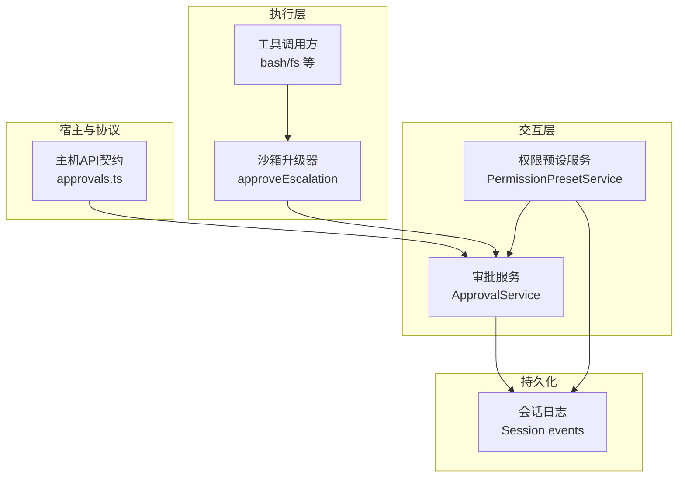
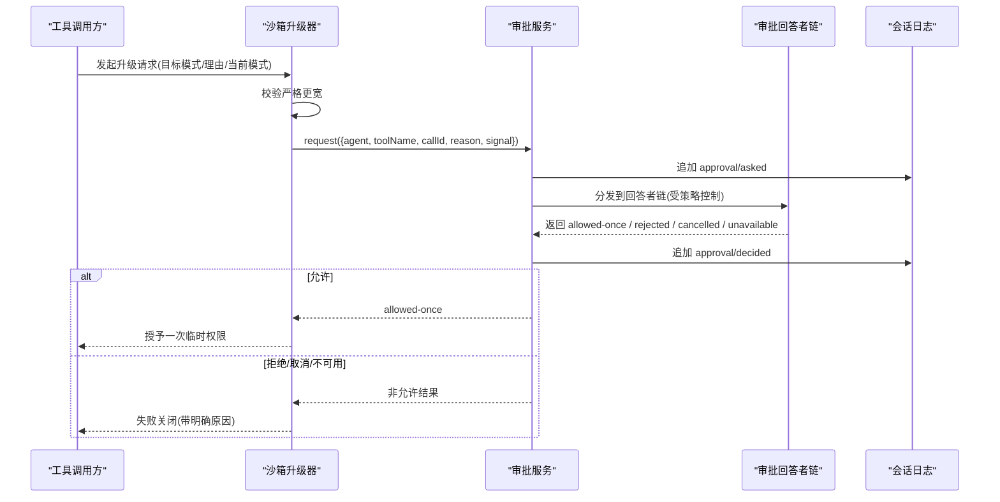
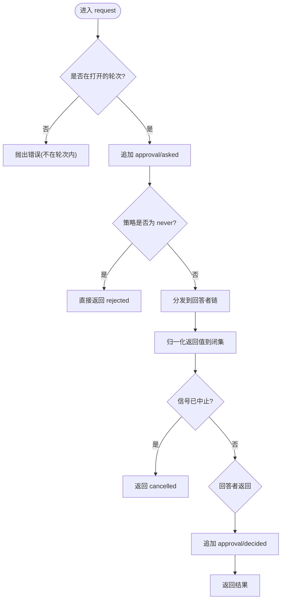
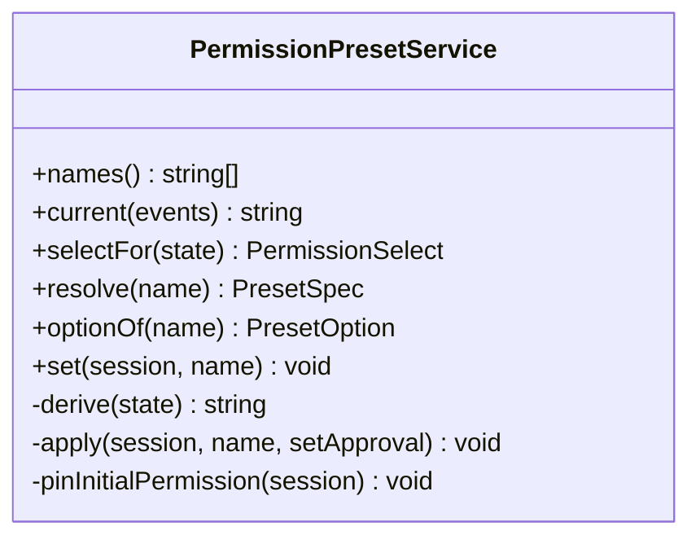
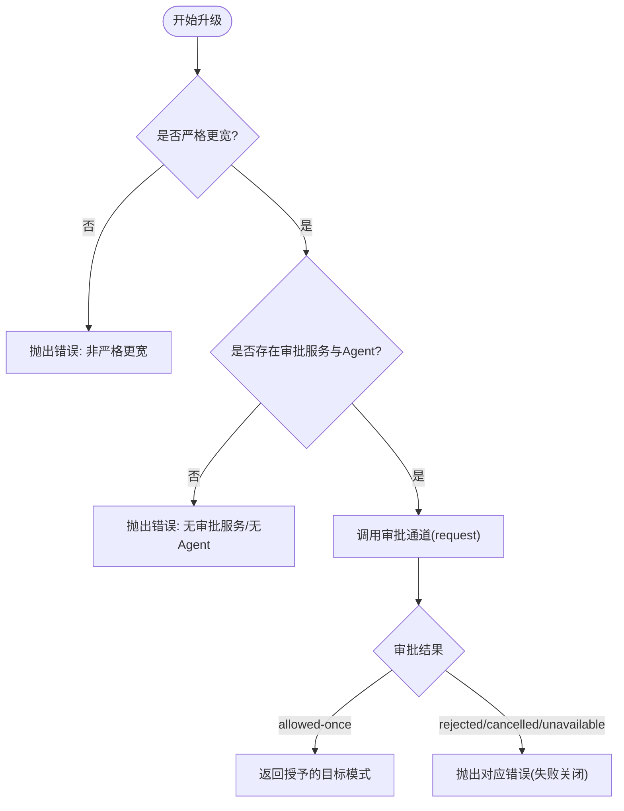
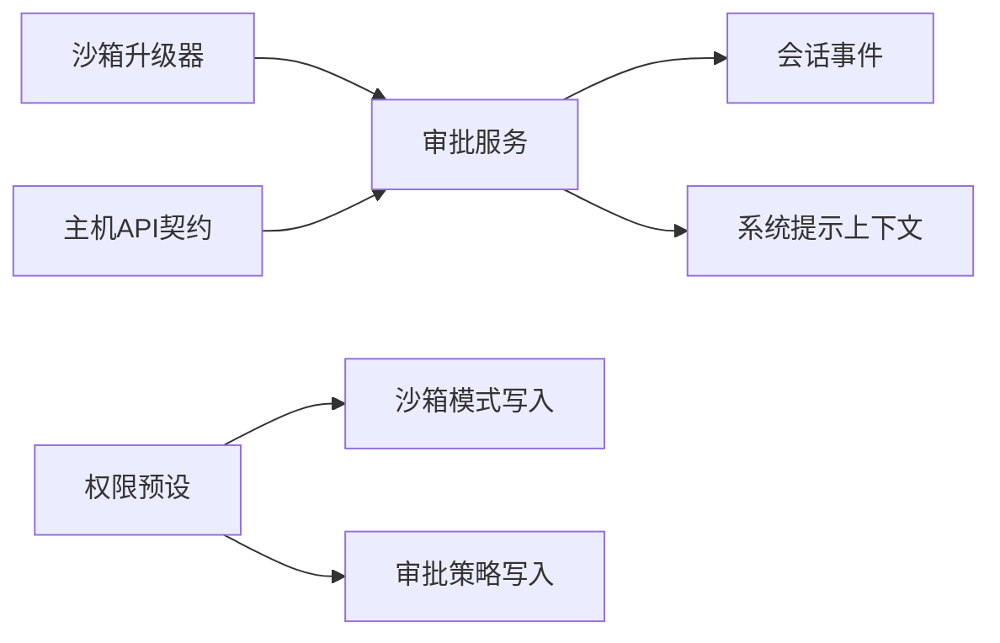

# 审批工作流

<cite>
**本文引用的文件**
- [packages/interaction/user-approval/src/index.ts](file://packages/interaction/user-approval/src/index.ts)
- [packages/interaction/permission-presets/src/index.ts](file://packages/interaction/permission-presets/src/index.ts)
- [docs/subsystems/approval.md](file://docs/subsystems/approval.md)
- [docs/subsystems/permission-presets.md](file://docs/subsystems/permission-presets.md)
- [packages/sandbox/sandbox/src/escalation.ts](file://packages/sandbox/sandbox/src/escalation.ts)
- [packages/host/apiproxy/src/api/approvals.ts](file://packages/host/apiproxy/src/api/approvals.ts)
- [packages/sandbox/sandbox/tests/escalation.spec.ts](file://packages/sandbox/sandbox/tests/escalation.spec.ts)
- [packages/shell/tool-pwsh/tests/tools.spec.ts](file://packages/shell/tool-pwsh/tests/tools.spec.ts)
- [packages/core/session/src/index.ts](file://packages/core/session/src/index.ts)
- [docs/subsystems/persistence.md](file://docs/subsystems/persistence.md)
</cite>

## 目录
1. [简介](#简介)
2. [项目结构](#项目结构)
3. [核心组件](#核心组件)
4. [架构总览](#架构总览)
5. [详细组件分析](#详细组件分析)
6. [依赖关系分析](#依赖关系分析)
7. [性能与可扩展性](#性能与可扩展性)
8. [故障排查指南](#故障排查指南)
9. [结论](#结论)
10. [附录](#附录)

## 简介
本文件系统化说明审批工作流的设计与实现，覆盖权限请求与审批流程、动态权限授予与撤销、审批策略配置与管理、权限升级与降级的工作流程、自定义扩展方法与最佳实践，以及审计日志与合规报告能力。整体设计遵循“最小授权、可审计、可回放”的原则：所有审批决策通过会话事件日志记录，支持重放与一致性校验；权限变更以“旋钮（knob）+预设（preset）”的方式组合沙箱模式与审批策略，提供用户可见的切换入口与确定性行为。

## 项目结构
围绕审批工作流的关键代码分布在以下模块：
- 审批服务：负责审批请求分发、策略应用、审计事件写入与模型上下文提示。
- 权限预设：将沙箱模式与审批策略打包为“预设”，提供选择、持久化与默认值管理。
- 沙箱升级：在工具执行前进行严格“更宽”检查，并通过审批通道决定临时提升。
- 主机API代理：定义审批答案的协议契约，用于跨进程/客户端回传结果。
- 会话持久化：确保审批事件与策略变更被持久化并可重放。

图表来源
- [packages/interaction/user-approval/src/index.ts:192-348](file://packages/interaction/user-approval/src/index.ts#L192-L348)
- [packages/interaction/permission-presets/src/index.ts:159-434](file://packages/interaction/permission-presets/src/index.ts#L159-L434)
- [packages/sandbox/sandbox/src/escalation.ts:157-190](file://packages/sandbox/sandbox/src/escalation.ts#L157-L190)
- [packages/host/apiproxy/src/api/approvals.ts:1-22](file://packages/host/apiproxy/src/api/approvals.ts#L1-L22)
- [packages/core/session/src/index.ts:550-567](file://packages/core/session/src/index.ts#L550-L567)

章节来源
- [docs/subsystems/approval.md:1-171](file://docs/subsystems/approval.md#L1-L171)
- [docs/subsystems/permission-presets.md:1-132](file://docs/subsystems/permission-presets.md#L1-L132)

## 核心组件
- 审批服务（ApprovalService）
  - 职责：按会话策略决定是否进入审批水线；维护“ask/never”策略；写入审计事件对；向模型注入策略提示。
  - 关键能力：request(req)、setPolicy(agent, policy)、overrideOf(session)。
- 权限预设服务（PermissionPresetService）
  - 职责：将沙箱模式与审批策略打包为预设；计算当前有效预设；切换时仅写差异旋钮；为新会话钉入初始权限。
  - 关键能力：current(events)、selectFor(state)、resolve(name)、optionOf(name)、set(session, name)。
- 沙箱升级器（approveEscalation）
  - 职责：在执行前校验“严格更宽”的升级目标；通过审批通道获取一次性许可；映射非授权结果为明确错误文本。
- 主机API契约（approvals.ts）
  - 职责：定义审批答案的数据结构，包含会话ID、审批ID与允许/拒绝结果，用于客户端回传。

章节来源
- [packages/interaction/user-approval/src/index.ts:192-348](file://packages/interaction/user-approval/src/index.ts#L192-L348)
- [packages/interaction/permission-presets/src/index.ts:159-434](file://packages/interaction/permission-presets/src/index.ts#L159-L434)
- [packages/sandbox/sandbox/src/escalation.ts:157-190](file://packages/sandbox/sandbox/src/escalation.ts#L157-L190)
- [packages/host/apiproxy/src/api/approvals.ts:1-22](file://packages/host/apiproxy/src/api/approvals.ts#L1-L22)

## 架构总览
审批工作流由“请求—策略—审批—审计—执行”构成闭环。工具发起权限或升级请求时，先经策略门控，再进入审批水线，最终产出唯一的一次性许可并记录审计事件；若未获许可则失败关闭。

图表来源
- [packages/sandbox/sandbox/src/escalation.ts:157-190](file://packages/sandbox/sandbox/src/escalation.ts#L157-L190)
- [packages/interaction/user-approval/src/index.ts:257-348](file://packages/interaction/user-approval/src/index.ts#L257-L348)

## 详细组件分析

### 审批服务（ApprovalService）
- 策略门控：在分发给回答者之前，依据会话策略（ask/never）直接决定结果，避免任何监听顺序绕过。
- 审计成对：每次请求都会追加 asked/decided 两个事件，且必须位于一个“打开的轮次”内，保证可重放一致性。
- 模型可见性：通过系统提示上下文注入策略语义，使模型理解当前是否会被询问。
- 异常与归一化：缺失/抛错/非词汇返回值统一归一为“不可用”，保持调用方闭集分支安全。

图表来源
- [packages/interaction/user-approval/src/index.ts:257-348](file://packages/interaction/user-approval/src/index.ts#L257-L348)

章节来源
- [packages/interaction/user-approval/src/index.ts:192-348](file://packages/interaction/user-approval/src/index.ts#L192-L348)
- [docs/subsystems/approval.md:1-171](file://docs/subsystems/approval.md#L1-L171)

### 权限预设（PermissionPresetService）
- 预设表：每个预设绑定一组“沙箱模式 + 审批策略”，并提供可选名称与描述。
- 当前预设推导：基于会话事件折叠出最近选择的预设；若旋钮值不匹配任何预设，则显示派生状态“custom”。
- 切换路径：记录用户意图事件后，仅写入发生变化的旋钮；重复选择有效预设不产生冗余事件。
- 新会话钉入：为新会话自动钉入默认预设或根据现有旋钮补全缺失事实。

图表来源
- [packages/interaction/permission-presets/src/index.ts:159-434](file://packages/interaction/permission-presets/src/index.ts#L159-L434)

章节来源
- [packages/interaction/permission-presets/src/index.ts:159-434](file://packages/interaction/permission-presets/src/index.ts#L159-L434)
- [docs/subsystems/permission-presets.md:1-132](file://docs/subsystems/permission-presets.md#L1-L132)

### 沙箱升级（Escalation）
- 严格更宽：仅允许从当前模式升级到更宽的模式（read-only→workspace-write→danger-full-access）。
- 审批前置：在执行前必须通过审批通道获得一次性许可；否则失败关闭。
- 错误文案：每种非允许结果映射为明确的失败消息，便于用户与模型理解。

图表来源
- [packages/sandbox/sandbox/src/escalation.ts:157-190](file://packages/sandbox/sandbox/src/escalation.ts#L157-L190)

章节来源
- [packages/sandbox/sandbox/src/escalation.ts:157-190](file://packages/sandbox/sandbox/src/escalation.ts#L157-L190)
- [packages/sandbox/sandbox/tests/escalation.spec.ts:57-111](file://packages/sandbox/sandbox/tests/escalation.spec.ts#L57-L111)

### 主机API审批响应契约
- 数据结构：包含会话ID、审批ID与允许/拒绝结果，用于客户端回传审批答案。
- 关联审计：审批ID用于关联服务端侧的 asked/decided 审计事件对。

章节来源
- [packages/host/apiproxy/src/api/approvals.ts:1-22](file://packages/host/apiproxy/src/api/approvals.ts#L1-L22)

## 依赖关系分析
- 审批服务依赖会话事件与系统提示上下文，用于策略读取与模型可见性。
- 权限预设依赖沙箱策略与审批策略的写入端点，作为“旋钮”的统一门面。
- 沙箱升级器通过抽象的审批接口与工具层解耦，避免直接耦合具体审批实现。
- 主机API契约为跨进程审批答案提供稳定类型约束。

图表来源
- [packages/interaction/user-approval/src/index.ts:192-348](file://packages/interaction/user-approval/src/index.ts#L192-L348)
- [packages/interaction/permission-presets/src/index.ts:159-434](file://packages/interaction/permission-presets/src/index.ts#L159-L434)
- [packages/sandbox/sandbox/src/escalation.ts:157-190](file://packages/sandbox/sandbox/src/escalation.ts#L157-L190)
- [packages/host/apiproxy/src/api/approvals.ts:1-22](file://packages/host/apiproxy/src/api/approvals.ts#L1-L22)

章节来源
- [packages/interaction/user-approval/src/index.ts:192-348](file://packages/interaction/user-approval/src/index.ts#L192-L348)
- [packages/interaction/permission-presets/src/index.ts:159-434](file://packages/interaction/permission-presets/src/index.ts#L159-L434)
- [packages/sandbox/sandbox/src/escalation.ts:157-190](file://packages/sandbox/sandbox/src/escalation.ts#L157-L190)
- [packages/host/apiproxy/src/api/approvals.ts:1-22](file://packages/host/apiproxy/src/api/approvals.ts#L1-L22)

## 性能与可扩展性
- 策略短路：never 策略在服务内部短路审批分发，减少不必要的UI或外部通道开销。
- 事件折叠：预设与策略读取通过事件折叠得到当前值，避免额外状态同步成本。
- 最小副作用：预设切换仅写入差异旋钮，降低日志膨胀与重放负担。
- 可扩展点：
  - 审批回答者：通过 waterfalls 机制注册多个回答者，支持UI、自动化桥接等。
  - 预设表：可按部署需求扩展预设项，但需保证沙箱执行器具备相应限制能力。
  - 主机API：可在不改变核心逻辑的前提下替换客户端回传实现。

[本节为通用指导，无需特定文件引用]

## 故障排查指南
- 常见错误与定位
  - 非严格更宽升级：检查当前模式与目标模式关系，确保符合“read-only→workspace-write→danger-full-access”的严格递增。
  - 无审批服务/无Agent：确认审批服务已正确组合，且调用来自有Agent的上下文。
  - 审批通道不可用：当没有可用回答者或回答者抛错时，会归一为不可用；检查回答者链是否注册成功。
  - 策略为 never：所有需要审批的请求将被拒绝；如需交互，请切换到 ask 策略。
- 调试建议
  - 查看会话日志中的 approval/asked 与 approval/decided 事件对，确认审批链路是否完整。
  - 使用权限预设服务的 current/selectFor 方法观察当前有效预设与选项。
  - 在工具测试中模拟不同审批结果，验证错误文案与行为是否符合预期。

章节来源
- [packages/sandbox/sandbox/tests/escalation.spec.ts:57-111](file://packages/sandbox/sandbox/tests/escalation.spec.ts#L57-L111)
- [packages/shell/tool-pwsh/tests/tools.spec.ts:603-621](file://packages/shell/tool-pwsh/tests/tools.spec.ts#L603-L621)
- [packages/interaction/user-approval/src/index.ts:257-348](file://packages/interaction/user-approval/src/index.ts#L257-L348)

## 结论
审批工作流通过“策略门控 + 审批水线 + 审计日志”的三层设计，实现了安全的权限控制与完整的可追溯性。权限预设将复杂配置简化为用户友好的选择项，沙箱升级确保仅在必要时进行最小范围的权限提升。结合持久化与会话重放，该体系既满足合规审计要求，又具备良好的可扩展性与可维护性。

[本节为总结性内容，无需特定文件引用]

## 附录

### 权限升级与降级工作流程
- 升级：工具在执行可能越界的操作前，调用升级器进行严格更宽检查，再通过审批通道申请一次性许可；获批后仅对该次调用生效。
- 降级：通过权限预设或服务设置将沙箱模式调窄（如 danger-full-access → workspace-write），并在下一轮执行生效；同时可调整审批策略为 ask 以恢复交互。

章节来源
- [packages/sandbox/sandbox/src/escalation.ts:157-190](file://packages/sandbox/sandbox/src/escalation.ts#L157-L190)
- [packages/interaction/permission-presets/src/index.ts:375-434](file://packages/interaction/permission-presets/src/index.ts#L375-L434)

### 审批审计日志与合规报告
- 审计事件：approval/asked 与 approval/decided 成对出现，携带审批ID、工具名、可选调用ID与原因；approval/policy 记录策略变更。
- 持久化：会话事件日志被持久化，支持崩溃恢复与重放；事件对必须在打开的轮次内提交，保证一致性。
- 合规报告：基于会话日志导出审批事件与策略变更，生成时间线与决策摘要，满足审计与合规审查需求。

章节来源
- [packages/interaction/user-approval/src/index.ts:34-73](file://packages/interaction/user-approval/src/index.ts#L34-L73)
- [packages/core/session/src/index.ts:550-567](file://packages/core/session/src/index.ts#L550-L567)
- [docs/subsystems/persistence.md:1-7](file://docs/subsystems/persistence.md#L1-L7)

### 自定义扩展方法与最佳实践
- 扩展审批回答者：注册到审批水线，处理特定场景（如自动化审批、UI弹窗），并确保返回闭集结果。
- 扩展预设：在预设表中添加新的沙箱/审批组合，并为客户端提供清晰的名称与描述。
- 最佳实践
  - 始终使用“严格更宽”的升级规则，避免权限回退风险。
  - 在 never 策略下运行自动化任务，确保确定性拒绝。
  - 通过权限预设集中管理策略，减少分散配置带来的不一致。
  - 利用审计事件构建可视化审批看板，辅助问题定位与合规审计。

章节来源
- [packages/interaction/user-approval/src/index.ts:192-348](file://packages/interaction/user-approval/src/index.ts#L192-L348)
- [packages/interaction/permission-presets/src/index.ts:159-434](file://packages/interaction/permission-presets/src/index.ts#L159-L434)
- [docs/subsystems/approval.md:1-171](file://docs/subsystems/approval.md#L1-L171)
- [docs/subsystems/permission-presets.md:1-132](file://docs/subsystems/permission-presets.md#L1-L132)