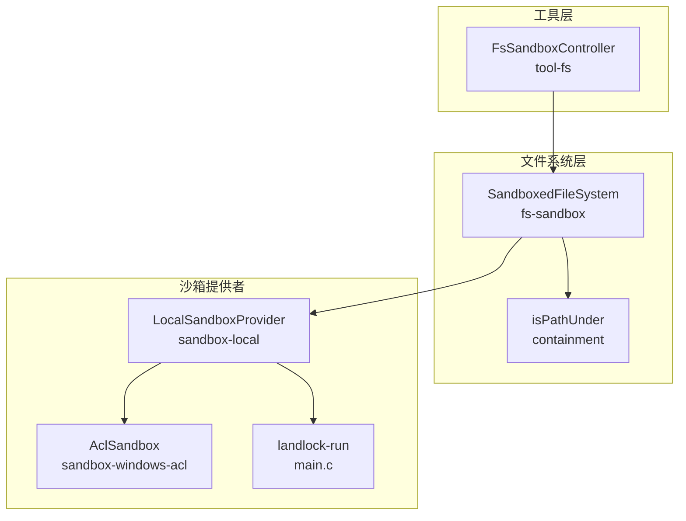
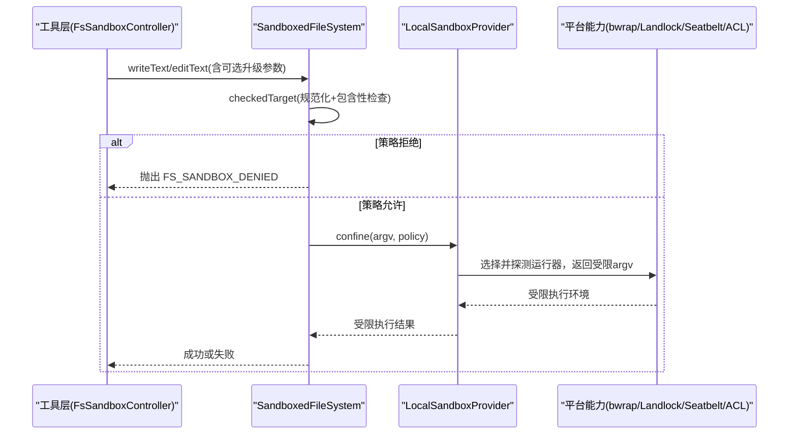
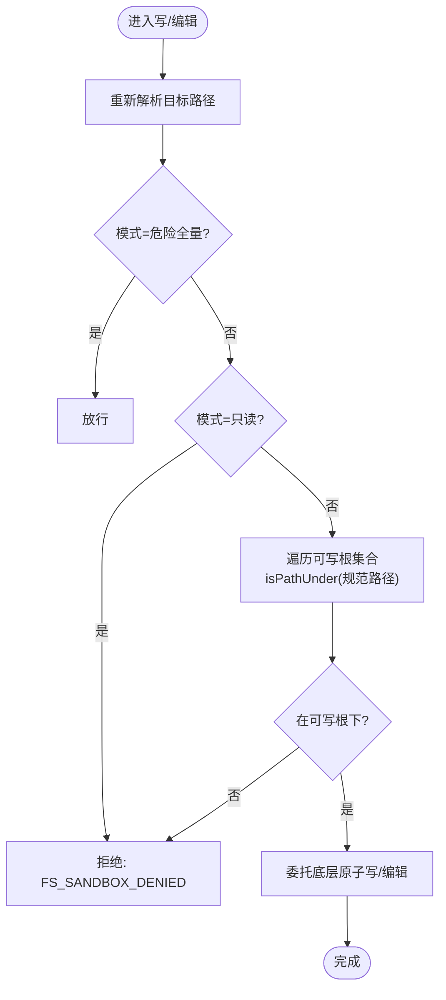
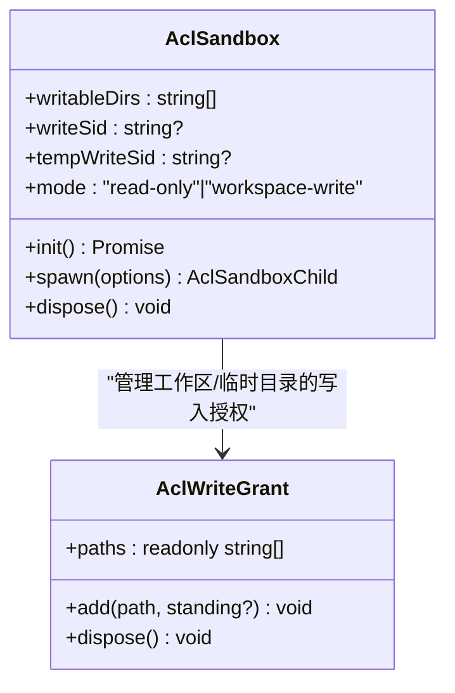
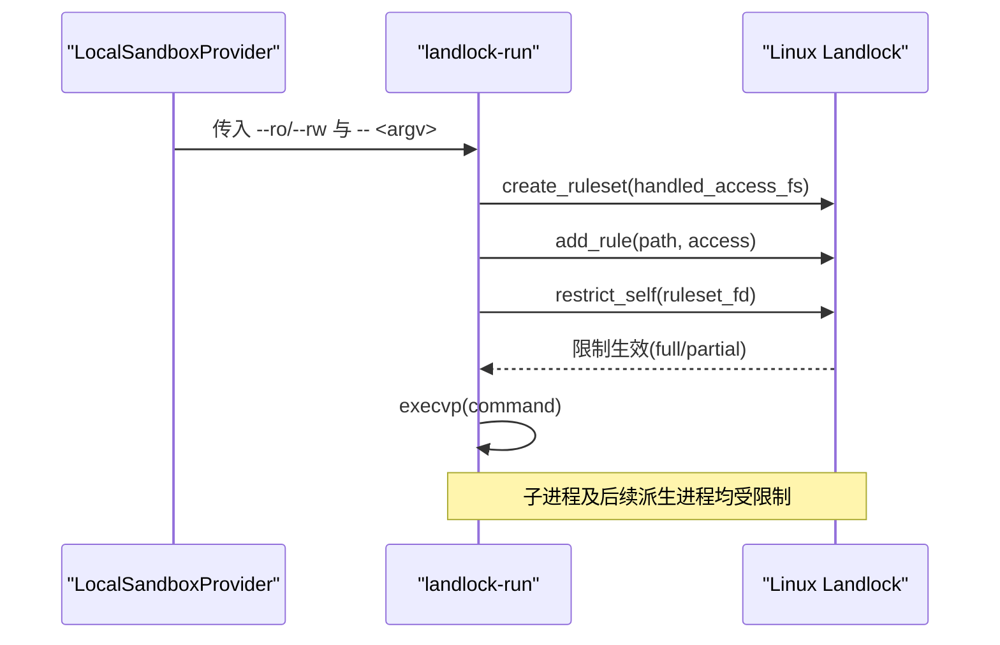
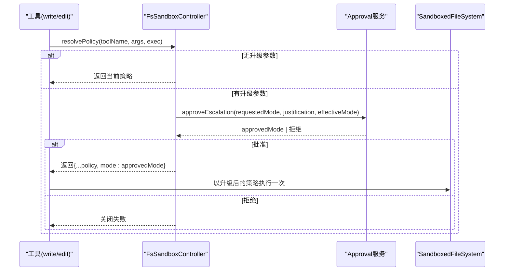
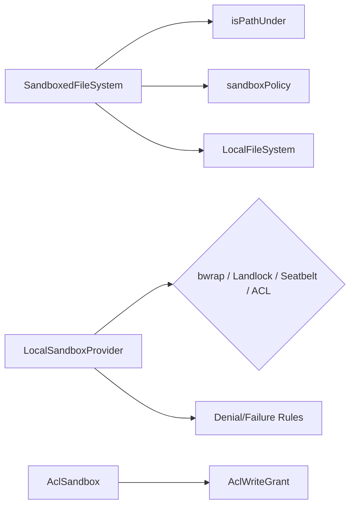

# 文件系统访问控制

<cite>
**本文引用的文件**
- [packages/fs/fs-sandbox/src/index.ts](file://packages/fs/fs-sandbox/src/index.ts)
- [packages/fs/fs-sandbox/src/containment.ts](file://packages/fs/fs-sandbox/src/containment.ts)
- [packages/sandbox/sandbox-local/src/index.ts](file://packages/sandbox/sandbox-local/src/index.ts)
- [packages/sandbox/sandbox-windows-acl/src/index.ts](file://packages/sandbox/sandbox-windows-acl/src/index.ts)
- [packages/sandbox/sandbox-windows-acl/src/grant.ts](file://packages/sandbox/sandbox-windows-acl/src/grant.ts)
- [native/landlock-run/packages/entry/src/main.c](file://native/landlock-run/packages/entry/src/main.c)
- [packages/fs/tool-fs/src/sandbox.ts](file://packages/fs/tool-fs/src/sandbox.ts)
- [docs/subsystems/filesystem.md](file://docs/subsystems/filesystem.md)
</cite>

## 目录
1. [简介](#简介)
2. [项目结构](#项目结构)
3. [核心组件](#核心组件)
4. [架构总览](#架构总览)
5. [详细组件分析](#详细组件分析)
6. [依赖关系分析](#依赖关系分析)
7. [性能考量](#性能考量)
8. [故障排查指南](#故障排查指南)
9. [结论](#结论)
10. [附录](#附录)

## 简介
本文件面向“文件系统访问控制”的完整实现与使用，覆盖以下主题：
- 文件路径白名单机制与目录根限制的实现原理
- 读写权限控制与文件类型过滤策略
- Windows ACL 权限模型与 Linux Landlock 文件系统的集成
- 文件操作审批流程与权限提升机制
- 安全配置最佳实践与常见漏洞防护
- 文件访问审计日志与实时监控的实现方法

该仓库通过“沙箱+策略+工具层”的分层设计，将不可信的文件路径在可信代码中进行严格校验，并在进程级通过平台能力（bwrap、Landlock、Seatbelt、Windows ACL）进行强制隔离。

## 项目结构
围绕文件系统访问控制的关键模块分布如下：
- 沙箱执行提供者：按平台选择并探测可用运行器（Linux: bwrap/Landlock；macOS: Seatbelt；Windows: ACL 受限令牌）
- 文件系统沙箱后端：对写/编辑操作施加每调用策略检查（读操作直通）
- 路径包含性判定：基于规范路径与文件系统身份的安全判断
- Windows ACL 写入授权：工作区与临时目录的独立 SID 与 DACL 管理
- 工具层沙箱控制器：统一暴露升级参数、审批流与错误映射
- 文档与契约：文件系统服务定义、事件与错误码

图表来源
- [packages/fs/tool-fs/src/sandbox.ts:37-132](file://packages/fs/tool-fs/src/sandbox.ts#L37-L132)
- [packages/fs/fs-sandbox/src/index.ts:59-148](file://packages/fs/fs-sandbox/src/index.ts#L59-L148)
- [packages/fs/fs-sandbox/src/containment.ts:46-77](file://packages/fs/fs-sandbox/src/containment.ts#L46-L77)
- [packages/sandbox/sandbox-local/src/index.ts:250-568](file://packages/sandbox/sandbox-local/src/index.ts#L250-L568)
- [packages/sandbox/sandbox-windows-acl/src/index.ts:160-435](file://packages/sandbox/sandbox-windows-acl/src/index.ts#L160-L435)
- [native/landlock-run/packages/entry/src/main.c:220-299](file://native/landlock-run/packages/entry/src/main.c#L220-L299)

章节来源
- [docs/subsystems/filesystem.md:1-496](file://docs/subsystems/filesystem.md#L1-L496)

## 核心组件
- SandboxedFileSystem：继承本地文件系统，仅对写/编辑操作增加每调用策略围栏；读操作直通
- isPathUnder：以“词法快速路径 + 文件系统身份兜底”的方式判定目标是否位于可写根下
- LocalSandboxProvider：按平台选择运行器链（bwrap→Landlock；Seatbelt；Windows ACL），缓存探测结果，构造受限 argv
- AclSandbox：Windows 受限令牌创建、DACL 写入授权、子进程受限启动与清理
- landlock-run：C 实现的 Landlock 规则集安装与 exec 包装，支持 --probe 探测内核能力
- FsSandboxController：为 write/edit 工具提供升级参数模式、审批流与错误映射

章节来源
- [packages/fs/fs-sandbox/src/index.ts:59-148](file://packages/fs/fs-sandbox/src/index.ts#L59-L148)
- [packages/fs/fs-sandbox/src/containment.ts:46-77](file://packages/fs/fs-sandbox/src/containment.ts#L46-L77)
- [packages/sandbox/sandbox-local/src/index.ts:250-568](file://packages/sandbox/sandbox-local/src/index.ts#L250-L568)
- [packages/sandbox/sandbox-windows-acl/src/index.ts:160-435](file://packages/sandbox/sandbox-windows-acl/src/index.ts#L160-L435)
- [native/landlock-run/packages/entry/src/main.c:220-299](file://native/landlock-run/packages/entry/src/main.c#L220-L299)
- [packages/fs/tool-fs/src/sandbox.ts:37-132](file://packages/fs/tool-fs/src/sandbox.ts#L37-L132)

## 架构总览
系统采用“策略围栏 + 进程隔离”的双层保护：
- 策略围栏：在可信代码中对每个写/编辑请求的目标路径进行规范化与包含性检查，拒绝不在白名单根下的变更
- 进程隔离：通过平台能力对子进程施加最小权限原则，只允许访问受控路径集合

图表来源
- [packages/fs/tool-fs/src/sandbox.ts:87-132](file://packages/fs/tool-fs/src/sandbox.ts#L87-L132)
- [packages/fs/fs-sandbox/src/index.ts:84-148](file://packages/fs/fs-sandbox/src/index.ts#L84-L148)
- [packages/sandbox/sandbox-local/src/index.ts:316-343](file://packages/sandbox/sandbox-local/src/index.ts#L316-L343)

## 详细组件分析

### 路径白名单与目录根限制
- 白名单来源：可写根集合由策略解析得到（工作区根与平台临时区域）
- 规范化与防绕过：每次写/编辑前重新解析真实路径，避免 TOCTOU 与符号链接替换
- 包含性判定：先做大小写敏感的词法前缀匹配；若不一致则沿祖先向上比对设备号与 inode，兼容 Windows 8.3 别名与大小写差异

图表来源
- [packages/fs/fs-sandbox/src/index.ts:126-148](file://packages/fs/fs-sandbox/src/index.ts#L126-L148)
- [packages/fs/fs-sandbox/src/containment.ts:46-77](file://packages/fs/fs-sandbox/src/containment.ts#L46-L77)

章节来源
- [packages/fs/fs-sandbox/src/index.ts:59-148](file://packages/fs/fs-sandbox/src/index.ts#L59-L148)
- [packages/fs/fs-sandbox/src/containment.ts:46-77](file://packages/fs/fs-sandbox/src/containment.ts#L46-L77)

### 读写权限控制与文件类型过滤
- 读操作：默认全部允许，不经过策略围栏
- 写/编辑：根据当前模式决定
  - read-only：直接拒绝所有变更
  - workspace-write：仅允许在工作区根或平台临时目录下变更
  - danger-full-access：不限制（需配合审批策略）
- 文件类型过滤：读取前可通过 stat/lstat 获取 type 字段，消费端据此拒绝目录、符号链接或特殊文件；写/编辑针对文本内容，二进制通过 readBytes 的字节上限与类型检查处理

章节来源
- [docs/subsystems/filesystem.md:114-179](file://docs/subsystems/filesystem.md#L114-L179)
- [docs/subsystems/filesystem.md:244-270](file://docs/subsystems/filesystem.md#L244-L270)

### Windows ACL 权限模型集成
- 受限令牌：创建 WRITE_RESTRICTED 令牌，将工作区 SID 与临时目录 SID 加入限制列表，使写访问仅在拥有对应 ACE 的路径生效
- 写入授权：
  - 工作区根：跨会话复用（确定性 SID），ACE 持久化作为重用缓存
  - 临时目录：每会话随机路径与独立 SID，生命周期结束时撤销
- 默认 DACL：为新对象设置合适的默认 DACL，避免受限令牌导致匿名管道等对象创建失败
- 边界说明：仅限制写；读、网络、进程可见性不受限；控制台隔离不可用；需要调用方拥有 DACL 修改权限

图表来源
- [packages/sandbox/sandbox-windows-acl/src/index.ts:160-435](file://packages/sandbox/sandbox-windows-acl/src/index.ts#L160-L435)
- [packages/sandbox/sandbox-windows-acl/src/grant.ts:28-105](file://packages/sandbox/sandbox-windows-acl/src/grant.ts#L28-L105)

章节来源
- [packages/sandbox/sandbox-windows-acl/src/index.ts:160-435](file://packages/sandbox/sandbox-windows-acl/src/index.ts#L160-L435)
- [packages/sandbox/sandbox-windows-acl/src/grant.ts:28-105](file://packages/sandbox/sandbox-windows-acl/src/grant.ts#L28-L105)

### Linux Landlock 文件系统集成
- 自限制后执行：landlock-run 先安装规则集再 exec 目标命令，规则集在 execve 后继承
- 规则集构建：--ro 授予读/执行，--rw 授予全部文件系统访问；未显式授予的访问一律拒绝
- ABI 协商：根据内核支持的 ABI 级别动态裁剪能力位，报告 full/partial
- 无新特权：prctl(PR_SET_NO_NEW_PRIVS) 防止 setuid/setgid 提升
- 探测：--probe 构建最大规则集并尝试限制自身，用于上层功能探测

图表来源
- [native/landlock-run/packages/entry/src/main.c:220-299](file://native/landlock-run/packages/entry/src/main.c#L220-L299)
- [packages/sandbox/sandbox-local/src/index.ts:316-343](file://packages/sandbox/sandbox-local/src/index.ts#L316-L343)

章节来源
- [native/landlock-run/packages/entry/src/main.c:220-299](file://native/landlock-run/packages/entry/src/main.c#L220-L299)
- [packages/sandbox/sandbox-local/src/index.ts:316-343](file://packages/sandbox/sandbox-local/src/index.ts#L316-L343)

### 文件操作审批流程与权限提升
- 升级参数：write/edit 工具在存在沙箱后端时暴露 sandbox_permissions 与 justification 两个参数
- 策略解析：若无升级参数，使用会话当前模式；若有，则进入审批流
- 审批流：调用 approval 服务，结合 agent、callId、toolName、signal 进行一次性批准；批准后以“更宽模式”重试一次
- 拒绝处理：若未配置审批服务、无 agent 路由或被拒绝，则关闭失败，不产生任何副作用
- 错误映射：FS_SANDBOX_DENIED 被映射为带提示标记的错误，便于上层展示与引导升级

图表来源
- [packages/fs/tool-fs/src/sandbox.ts:87-132](file://packages/fs/tool-fs/src/sandbox.ts#L87-L132)

章节来源
- [packages/fs/tool-fs/src/sandbox.ts:37-132](file://packages/fs/tool-fs/src/sandbox.ts#L37-L132)

### 沙箱运行器选择与平台适配
- 平台链：Linux 优先 bwrap 再 Landlock；macOS 使用 Seatbelt；Windows 使用 ACL 受限令牌
- 功能探测：首次 confining 时对候选运行器进行功能性探测，缓存结果；单候选无需仲裁
- 失败签名：不同运行器的拒绝输出特征被识别，用于分类“命令未运行”与“命令被拒绝”
- 执行完整性：bwrap/Seatbelt 宣称 full；Landlock 可能 partial；Windows ACL 因 Everyone 与硬链接限制标注 partial

章节来源
- [packages/sandbox/sandbox-local/src/index.ts:159-187](file://packages/sandbox/sandbox-local/src/index.ts#L159-L187)
- [packages/sandbox/sandbox-local/src/index.ts:492-539](file://packages/sandbox/sandbox-local/src/index.ts#L492-L539)

## 依赖关系分析
- SandboxedFileSystem 依赖：
  - LocalFileSystem（继承其读写/编辑原子语义）
  - containment.isPathUnder（路径包含性判定）
  - sandboxPolicy（每调用策略解析）
- LocalSandboxProvider 依赖：
  - 平台运行器（bwrap/Landlock/Seatbelt/Windows ACL）
  - 探测与失败签名规则
- Windows ACL 依赖：
  - Win32 FFI、SID/DACL 操作、受限令牌创建
  - 工作区/临时目录的写入授权生命周期管理
- Landlock 依赖：
  - C 程序 landlock-run 与内核 Landlock UAPI

图表来源
- [packages/fs/fs-sandbox/src/index.ts:59-148](file://packages/fs/fs-sandbox/src/index.ts#L59-L148)
- [packages/sandbox/sandbox-local/src/index.ts:250-568](file://packages/sandbox/sandbox-local/src/index.ts#L250-L568)
- [packages/sandbox/sandbox-windows-acl/src/index.ts:160-435](file://packages/sandbox/sandbox-windows-acl/src/index.ts#L160-L435)
- [packages/sandbox/sandbox-windows-acl/src/grant.ts:28-105](file://packages/sandbox/sandbox-windows-acl/src/grant.ts#L28-L105)

## 性能考量
- 路径包含性判定：词法前缀匹配为 O(1)，回退到祖先遍历与 stat 比较，最坏情况与路径深度线性相关
- 策略检查：每次写/编辑进行一次规范化与包含性检查，开销低且必要
- 运行器探测：首次 confining 时触发，结果缓存于 Provider 生命周期内
- Windows ACL 授权：工作区根 ACE 跨会话复用，临时目录 ACE 随会话销毁；避免重复树传播
- Landlock 规则集：按需构建，ABI 协商减少不必要的能力位

[本节为通用指导，不直接分析具体文件]

## 故障排查指南
- FS_SANDBOX_DENIED：来自策略围栏（read-only 或 workspace-write 越界），应检查目标路径是否在可写根下，或考虑经审批升级
- 命令未运行 vs 命令被拒绝：通过各运行器的失败签名区分（如 bwrap 的“read-only file system”，Landlock 的“permission denied”，Seatbelt 的“operation not permitted”，Windows ACL 的多种拒绝信息）
- Windows ACL 初始化失败：检查可写目录是否存在、调用方是否拥有 DACL 修改权限、SID 是否正确解析
- Landlock 不支持：--probe 失败表示内核未启用或不支持，需回退到其他运行器或调整部署
- 审批缺失：若未注入 approval 服务或无 agent 路由，升级将关闭失败

章节来源
- [packages/sandbox/sandbox-local/src/index.ts:200-240](file://packages/sandbox/sandbox-local/src/index.ts#L200-L240)
- [packages/fs/tool-fs/src/sandbox.ts:110-132](file://packages/fs/tool-fs/src/sandbox.ts#L110-L132)

## 结论
本方案通过“策略围栏 + 进程隔离”的组合，实现了细粒度、可审计、可升级的文件系统访问控制。路径白名单与根限制确保写/编辑仅发生在受控范围；平台能力提供强隔离；审批流程保障必要的权限提升可控；Windows ACL 与 Linux Landlock 分别在不同平台上提供可靠的执行约束。建议在生产环境中始终启用沙箱后端，并结合审批策略与最小权限原则进行部署。

[本节为总结性内容，不直接分析具体文件]

## 附录

### 安全配置最佳实践
- 默认启用沙箱后端，并将默认模式设为 read-only 或 workspace-write
- 禁止将危险的全量访问模式作为默认值；如需使用，必须配合审批策略
- 工作区根与临时目录分离，避免混用；临时目录必须随机且会话隔离
- 定期审查运行器可用性（bwrap/Landlock/Seatbelt/ACL），确保至少一种可用
- 对工具层的升级参数进行最小化暴露，仅在实际需要时开启

[本节为通用指导，不直接分析具体文件]

### 常见漏洞防护
- 符号链接与别名绕过：通过重新规范化与文件系统身份比对防御
- TOCTOU 竞争：在委托底层系统调用前再次规范化目标路径
- 权限提升滥用：升级必须经审批，且仅限单次重试
- 平台能力降级：Landlock partial 或 Windows ACL 部分限制场景下，明确告知并限制能力承诺

[本节为通用指导，不直接分析具体文件]

### 审计日志与实时监控
- 文件系统事件：通过 fs/write-intent、fs/edit-intent、fs/observed 等事件记录意图与观察结果，供策略插件与监控消费
- 错误与拒绝：FS_SANDBOX_DENIED 等结构化错误码便于上层统计与告警
- 运行器诊断：各运行器的拒绝签名与失败规则可用于自动化归因
- 建议：将上述事件与错误接入集中日志系统，建立阈值告警与可视化看板

章节来源
- [docs/subsystems/filesystem.md:181-270](file://docs/subsystems/filesystem.md#L181-L270)
- [packages/sandbox/sandbox-local/src/index.ts:200-240](file://packages/sandbox/sandbox-local/src/index.ts#L200-L240)