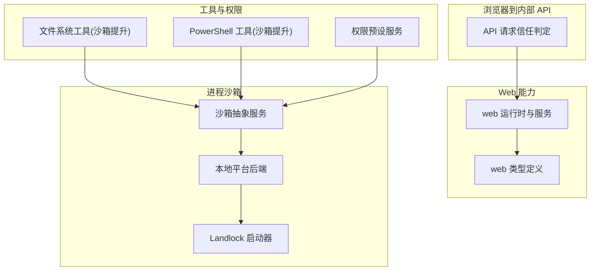
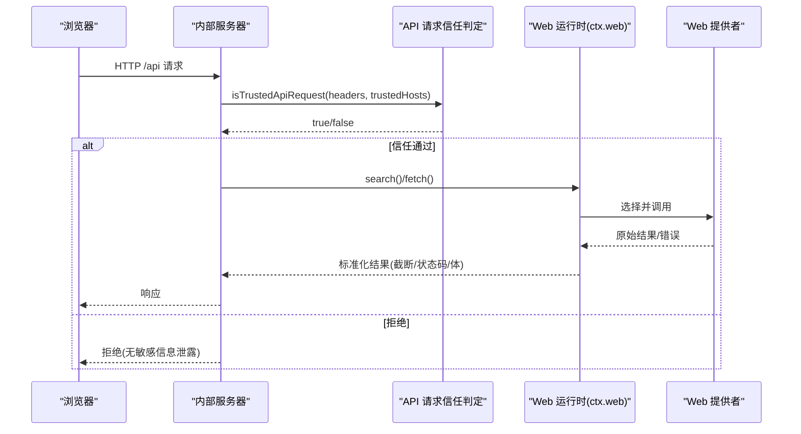
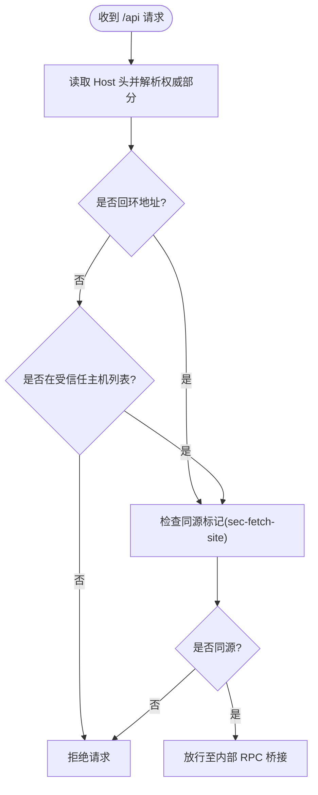
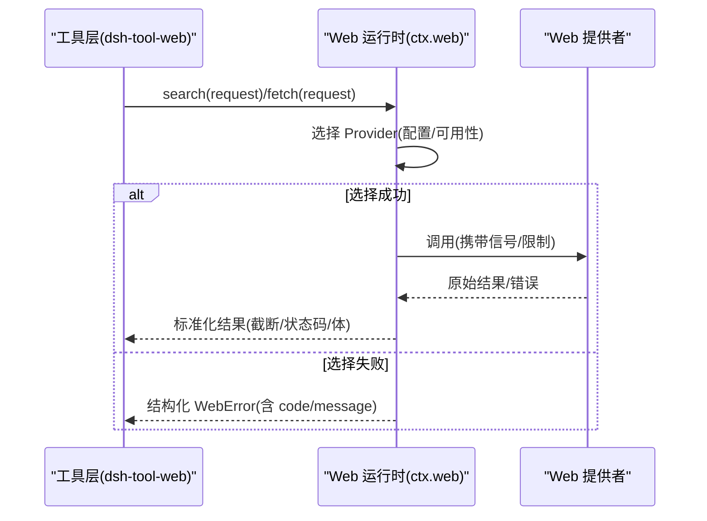
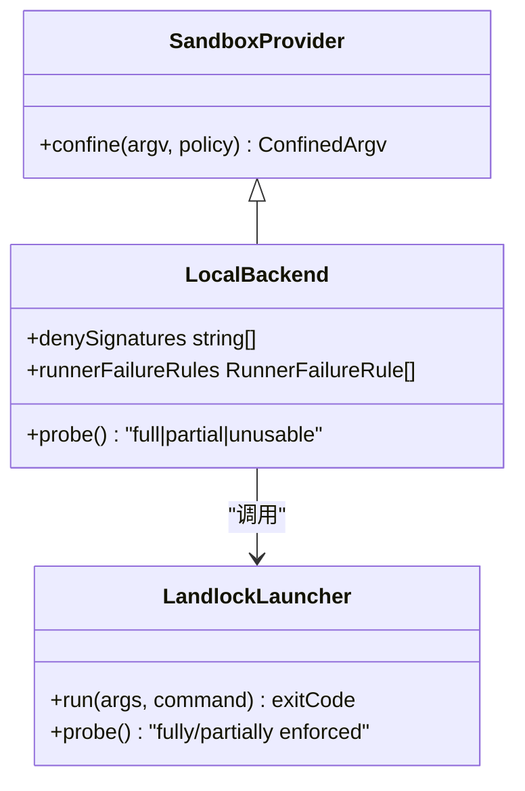
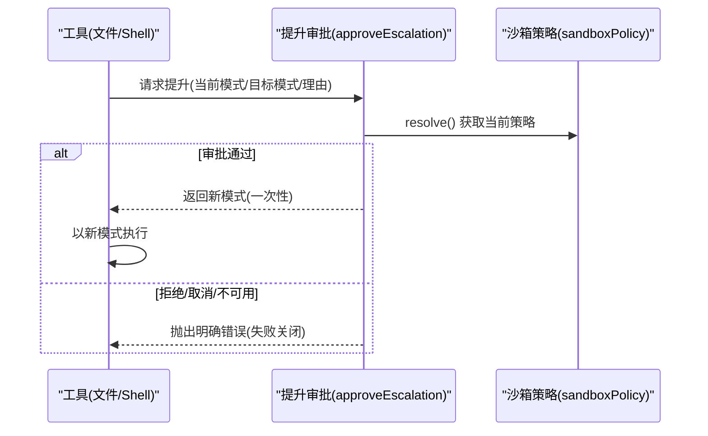
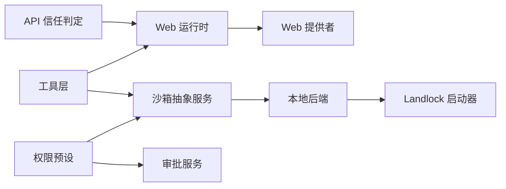

# 网络访问控制

<cite>
**本文引用的文件**
- [packages/web/web/src/types.ts](file://packages/web/web/src/types.ts)
- [packages/web/web/src/index.ts](file://packages/web/web/src/index.ts)
- [docs/subsystems/web.md](file://docs/subsystems/web.md)
- [packages/client/connection/src/api-request-trust.ts](file://packages/client/connection/src/api-request-trust.ts)
- [packages/client/connection/tests/api-request-trust.host.spec.ts](file://packages/client/connection/tests/api-request-trust.host.spec.ts)
- [.agents/notes/implemented/architecture/2026-07-28-api-browser-trust-boundary.md](file://.agents/notes/implemented/architecture/2026-07-28-api-browser-trust-boundary.md)
- [docs/subsystems/sandbox.md](file://docs/subsystems/sandbox.md)
- [packages/sandbox/README.md](file://packages/sandbox/README.md)
- [native/landlock-run/docs/cli-contract.md](file://native/landlock-run/docs/cli-contract.md)
- [native/landlock-run/test/launcher.test.js](file://native/landlock-run/test/launcher.test.js)
- [packages/sandbox/sandbox-local/tests/local.spec.ts](file://packages/sandbox/sandbox-local/tests/local.spec.ts)
- [packages/sandbox/sandbox-local/tests/seatbelt.e2e.ts](file://packages/sandbox/sandbox-local/tests/seatbelt.e2e.ts)
- [packages/sandbox/sandbox-local/tests/landlock.e2e.ts](file://packages/sandbox/sandbox-local/tests/landlock.e2e.ts)
- [packages/fs/tool-fs/src/sandbox.ts](file://packages/fs/tool-fs/src/sandbox.ts)
- [packages/shell/tool-pwsh/tests/tools.spec.ts](file://packages/shell/tool-pwsh/tests/tools.spec.ts)
- [examples/acp-agent/tests/escalation.e2e.ts](file://examples/acp-agent/tests/escalation.e2e.ts)
- [packages/sandbox/sandbox/tests/escalation.spec.ts](file://packages/sandbox/sandbox/tests/escalation.spec.ts)
- [packages/interaction/permission-presets/src/index.ts](file://packages/interaction/permission-presets/src/index.ts)
- [docs/subsystems/permission-presets.md](file://docs/subsystems/permission-presets.md)
</cite>

## 目录
1. [简介](#简介)
2. [项目结构](#项目结构)
3. [核心组件](#核心组件)
4. [架构总览](#架构总览)
5. [详细组件分析](#详细组件分析)
6. [依赖关系分析](#依赖关系分析)
7. [性能考虑](#性能考虑)
8. [故障排查指南](#故障排查指南)
9. [结论](#结论)
10. [附录](#附录)

## 简介
本文件系统化梳理本仓库中的“网络访问控制”能力，覆盖以下主题：
- 域名白名单与协议限制机制（浏览器到内部 API 的信任边界、Web 能力的 URL/重定向/内容类型限制）
- 网络流量监控与拦截策略（通过 Provider 选择、错误码分类、结果截断与可观测性）
- 不同操作系统下的网络隔离技术（进程沙箱模式、Linux Landlock、macOS Seatbelt、Windows ACL 受限令牌；以及容器/微 VM 作为整体能力替代）
- 权限的动态授予与撤销（沙箱模式提升审批流、预设切换对执行策略的即时生效）
- 网络安全配置最佳实践与攻击防护方案（DNS 重绑定防御、跨站标记校验、最小暴露面）
- 网络访问审计与异常检测（事件日志、不变量检查、失败归因与诊断）

## 项目结构
围绕网络访问控制的相关代码与文档分布在如下位置：
- Web 能力定义与提供者注册：packages/web/web（服务接口、Provider 选择、错误语义）
- 浏览器到内部 API 的信任边界：packages/client/connection（请求信任判定、Host/Origin/Fetch-Metadata 校验）
- 进程沙箱与平台后端：packages/sandbox（抽象服务）、sandbox-local（bwrap/Landlock/Seatbelt/ACL 后端）、native/landlock-run（Linux 自限制启动器）
- 工具层对沙箱模式的动态提升：packages/fs/tool-fs、packages/shell/tool-pwsh
- 权限预设与审批：packages/interaction/permission-presets、相关子系统文档
- 子系统参考文档：docs/subsystems/web.md、docs/subsystems/sandbox.md、docs/subsystems/permission-presets.md

图表来源
- [packages/web/web/src/index.ts:142-198](file://packages/web/web/src/index.ts#L142-L198)
- [packages/client/connection/src/api-request-trust.ts:90-110](file://packages/client/connection/src/api-request-trust.ts#L90-L110)
- [docs/subsystems/sandbox.md:9-39](file://docs/subsystems/sandbox.md#L9-L39)
- [native/landlock-run/docs/cli-contract.md:26-35](file://native/landlock-run/docs/cli-contract.md#L26-L35)

章节来源
- [docs/subsystems/web.md:1-133](file://docs/subsystems/web.md#L1-L133)
- [docs/subsystems/sandbox.md:1-157](file://docs/subsystems/sandbox.md#L1-L157)
- [packages/client/connection/src/api-request-trust.ts:90-110](file://packages/client/connection/src/api-request-trust.ts#L90-L110)

## 核心组件
- Web 能力（搜索/抓取）：提供统一的 ctx.web 服务，封装 Provider 选择、结果截断、错误分类与取消。
- 浏览器到内部 API 信任边界：基于 Host 白名单与同源标记，防御 DNS 重绑定与混淆代理攻击。
- 进程沙箱：以 per-call 策略驱动 bwrap/Landlock/Seatbelt/ACL 等后端，报告 enforcement 完整性。
- 权限预设与审批：将沙箱模式与审批策略打包为预设，支持会话内动态切换与审计。

章节来源
- [docs/subsystems/web.md:1-133](file://docs/subsystems/web.md#L1-L133)
- [docs/subsystems/sandbox.md:9-157](file://docs/subsystems/sandbox.md#L9-L157)
- [docs/subsystems/permission-presets.md:1-68](file://docs/subsystems/permission-presets.md#L1-L68)
- [packages/client/connection/src/api-request-trust.ts:90-110](file://packages/client/connection/src/api-request-trust.ts#L90-L110)

## 架构总览
下图展示了从浏览器发起 /api 请求到内部 RPC 桥接的信任判定流程，以及 Web 能力在工具层被调用时的 Provider 选择与结果处理。

图表来源
- [packages/client/connection/src/api-request-trust.ts:90-110](file://packages/client/connection/src/api-request-trust.ts#L90-L110)
- [packages/web/web/src/index.ts:142-198](file://packages/web/web/src/index.ts#L142-L198)
- [docs/subsystems/web.md:120-133](file://docs/subsystems/web.md#L120-L133)

## 详细组件分析

### 浏览器到内部 API 的信任边界（域名白名单与协议限制）
- Host 白名单：仅允许回环地址或部署声明的受信任主机（精确 host:port 或 port-less host 匹配任意端口）。
- 同源标记：现代浏览器会在 Fetch 上携带 sec-fetch-site 等同源标记，跨站标记一律拒绝。
- 防 DNS 重绑定：即使 Socket 落在本机，也依据 Host 头判断来源，避免恶意页面劫持。
- 测试覆盖：验证 localhost/IPv4/IPv6/大小写不敏感、端口精确匹配、非法主机名拒绝等场景。

图表来源
- [packages/client/connection/src/api-request-trust.ts:90-110](file://packages/client/connection/src/api-request-trust.ts#L90-L110)
- [packages/client/connection/tests/api-request-trust.host.spec.ts:22-108](file://packages/client/connection/tests/api-request-trust.host.spec.ts#L22-L108)

章节来源
- [packages/client/connection/src/api-request-trust.ts:90-110](file://packages/client/connection/src/api-request-trust.ts#L90-L110)
- [packages/client/connection/tests/api-request-trust.host.spec.ts:22-108](file://packages/client/connection/tests/api-request-trust.host.spec.ts#L22-L108)
- [.agents/notes/implemented/architecture/2026-07-28-api-browser-trust-boundary.md:18-24](file://.agents/notes/implemented/architecture/2026-07-28-api-browser-trust-boundary.md#L18-L24)

### Web 能力（搜索/抓取）的协议与流量控制
- 统一服务：ctx.web 提供 search/fetch，屏蔽底层 Provider 差异。
- Provider 选择：按配置 id 或可用 Provider 自动选择，出现歧义或缺失时返回结构化错误。
- 结果限制：search 强制按 maxResults 截断 sources；fetch 限制重定向、字节/字符上限、超时与内容类型。
- 错误分类：区分“未配置/不可用/重复注册/中止/提供商错误/URL 无效/URL 被阻止/重定向被阻止/过大/超时/不支持的内容类型”。

图表来源
- [packages/web/web/src/index.ts:142-198](file://packages/web/web/src/index.ts#L142-L198)
- [docs/subsystems/web.md:120-133](file://docs/subsystems/web.md#L120-L133)

章节来源
- [docs/subsystems/web.md:1-133](file://docs/subsystems/web.md#L1-L133)
- [packages/web/web/src/index.ts:142-198](file://packages/web/web/src/index.ts#L142-L198)
- [packages/web/web/src/types.ts:1-200](file://packages/web/web/src/types.ts#L1-L200)

### 进程沙箱与多平台隔离（Linux/macOS/Windows）
- 模式与执行完整性：read-only、workspace-write、danger-full-access；后端报告 full/partial 执行完整性。
- 平台后端：
  - Linux：bwrap + 自限制 Landlock 启动器（ABI 差异导致 partial），CLI 输出探针行用于映射 full/partial/unusable。
  - macOS：Seatbelt（sandbox-exec），读/写/设备访问行为由内核方言标识。
  - Windows：ACL 受限令牌（restricted token）与目录级授权，支持独立撤销。
- 容器/微 VM：作为整能力替代方案，不在 ctx.sandbox 下注册。

图表来源
- [docs/subsystems/sandbox.md:9-157](file://docs/subsystems/sandbox.md#L9-L157)
- [native/landlock-run/docs/cli-contract.md:26-35](file://native/landlock-run/docs/cli-contract.md#L26-L35)
- [native/landlock-run/test/launcher.test.js:70-96](file://native/landlock-run/test/launcher.test.js#L70-L96)

章节来源
- [docs/subsystems/sandbox.md:9-157](file://docs/subsystems/sandbox.md#L9-L157)
- [packages/sandbox/README.md:1-16](file://packages/sandbox/README.md#L1-L16)
- [native/landlock-run/docs/cli-contract.md:26-35](file://native/landlock-run/docs/cli-contract.md#L26-L35)
- [packages/sandbox/sandbox-local/tests/local.spec.ts:290-315](file://packages/sandbox/sandbox-local/tests/local.spec.ts#L290-L315)
- [packages/sandbox/sandbox-local/tests/seatbelt.e2e.ts:53-71](file://packages/sandbox/sandbox-local/tests/seatbelt.e2e.ts#L53-L71)
- [packages/sandbox/sandbox-local/tests/landlock.e2e.ts:54-70](file://packages/sandbox/sandbox-local/tests/landlock.e2e.ts#L54-L70)

### 网络流量的监控与拦截策略
- 监控点：
  - 浏览器到内部 API：Host 白名单与同源标记校验，拒绝可疑请求。
  - Web 能力：Provider 选择失败、URL 无效/被阻止、重定向被阻止、过大/超时/不支持内容类型等结构化错误。
- 拦截策略：
  - 默认拒绝：未知/非法 Host、跨站标记、未配置的 Provider、非预期重定向。
  - 结果限制：search 结果截断、fetch 体大小/字符上限。
- 可观测性：错误码与消息可用于告警与审计；Provider 可用性检查避免网络探测。

章节来源
- [packages/client/connection/src/api-request-trust.ts:90-110](file://packages/client/connection/src/api-request-trust.ts#L90-L110)
- [docs/subsystems/web.md:120-133](file://docs/subsystems/web.md#L120-L133)

### 权限的动态授予与撤销（沙箱模式提升）
- 提升路径：工具在执行需要更宽松的文件写入时，触发 approveEscalation，向审批通道申请一次性提升（如 read-only → workspace-write）。
- 审批结果：
  - 允许：本次执行使用更宽松模式，完成后恢复原策略。
  - 拒绝/取消/不可用：严格失败关闭，不会静默降级为无约束执行。
- 预设切换：通过 permissionPresets.set 将 sandbox/mode 与 approval/policy 组合为预设，立即生效并记录事件。

图表来源
- [packages/fs/tool-fs/src/sandbox.ts:95-108](file://packages/fs/tool-fs/src/sandbox.ts#L95-L108)
- [packages/sandbox/sandbox/tests/escalation.spec.ts:84-111](file://packages/sandbox/sandbox/tests/escalation.spec.ts#L84-L111)
- [examples/acp-agent/tests/escalation.e2e.ts:128-177](file://examples/acp-agent/tests/escalation.e2e.ts#L128-L177)
- [packages/shell/tool-pwsh/tests/tools.spec.ts:603-621](file://packages/shell/tool-pwsh/tests/tools.spec.ts#L603-L621)

章节来源
- [packages/fs/tool-fs/src/sandbox.ts:95-108](file://packages/fs/tool-fs/src/sandbox.ts#L95-L108)
- [packages/sandbox/sandbox/tests/escalation.spec.ts:84-111](file://packages/sandbox/sandbox/tests/escalation.spec.ts#L84-L111)
- [examples/acp-agent/tests/escalation.e2e.ts:128-177](file://examples/acp-agent/tests/escalation.e2e.ts#L128-L177)
- [packages/shell/tool-pwsh/tests/tools.spec.ts:603-621](file://packages/shell/tool-pwsh/tests/tools.spec.ts#L603-L621)
- [docs/subsystems/permission-presets.md:44-68](file://docs/subsystems/permission-presets.md#L44-L68)

### 网络安全配置最佳实践与攻击防护
- 最小暴露面：仅绑定必要地址（如 127.0.0.1），并通过 trustedHosts 限定远程可达域。
- 防御 DNS 重绑定：所有 /api 请求必须通过 Host 白名单与同源标记双重校验。
- 安全默认值：Web fetch 默认限制重定向、体大小、超时与内容类型；未知 Provider 或歧义配置直接失败。
- 失败关闭：沙箱不可用时拒绝执行，绝不静默回退到无约束模式。
- 审计与不变量：通过事件日志与不变量检查确保策略一致性与可追溯性。

章节来源
- [.agents/notes/implemented/architecture/2026-07-28-api-browser-trust-boundary.md:18-24](file://.agents/notes/implemented/architecture/2026-07-28-api-browser-trust-boundary.md#L18-L24)
- [docs/subsystems/web.md:120-133](file://docs/subsystems/web.md#L120-L133)
- [docs/subsystems/sandbox.md:152-157](file://docs/subsystems/sandbox.md#L152-L157)

### 网络访问审计与异常检测
- 事件与日志：
  - 权限预设切换：记录 permission/preset 事件，持久化用户意图。
  - 沙箱模式变更：通过 session 事件承载，供回放与审计。
- 不变量检查：对关键事件字段进行校验（如未知的沙箱模式），防止数据污染。
- 错误归因：WebError 与沙箱 runner 失败规则帮助区分“任务失败”和“基础设施失败”，便于告警与定位。

章节来源
- [docs/subsystems/permission-presets.md:44-68](file://docs/subsystems/permission-presets.md#L44-L68)
- [packages/sandbox/sandbox-policy/src/invariant.ts:1-21](file://packages/sandbox/sandbox-policy/src/invariant.ts#L1-L21)
- [docs/subsystems/sandbox.md:96-157](file://docs/subsystems/sandbox.md#L96-L157)

## 依赖关系分析
- Web 能力依赖 Provider 注册与可用性检查；工具层只关心统一接口。
- 浏览器到内部 API 的信任判定依赖 Host 头与同源标记，与具体业务无关。
- 沙箱抽象服务解耦平台实现，本地后端负责探针与方言适配。
- 权限预设依赖 shell 执行器的 confinement 能力与审批服务。

图表来源
- [packages/client/connection/src/api-request-trust.ts:90-110](file://packages/client/connection/src/api-request-trust.ts#L90-L110)
- [packages/web/web/src/index.ts:142-198](file://packages/web/web/src/index.ts#L142-L198)
- [docs/subsystems/sandbox.md:9-157](file://docs/subsystems/sandbox.md#L9-L157)
- [docs/subsystems/permission-presets.md:44-68](file://docs/subsystems/permission-presets.md#L44-L68)

章节来源
- [packages/client/connection/src/api-request-trust.ts:90-110](file://packages/client/connection/src/api-request-trust.ts#L90-L110)
- [packages/web/web/src/index.ts:142-198](file://packages/web/web/src/index.ts#L142-L198)
- [docs/subsystems/sandbox.md:9-157](file://docs/subsystems/sandbox.md#L9-L157)
- [docs/subsystems/permission-presets.md:44-68](file://docs/subsystems/permission-presets.md#L44-L68)

## 性能考虑
- Web fetch 限制体大小、字符数与超时，避免资源耗尽。
- search 结果按 maxResults 截断，减少传输与渲染开销。
- Provider 可用性检查为本地快速判断，避免启动阶段的网络探测。
- 沙箱后端探针仅在必要时运行，缓存执行完整性报告以减少重复开销。

[本节为通用指导，不直接分析具体文件]

## 故障排查指南
- 浏览器无法访问内部 API：
  - 检查 Host 是否回环或列入 trustedHosts；确认 sec-fetch-site 是否为 same-origin。
  - 参考测试用例验证各种主机名与端口组合。
- Web 抓取失败：
  - 根据 WebError.code 定位原因（URL 无效/被阻止/重定向被阻止/过大/超时/不支持内容类型）。
  - 检查 Provider 是否已配置且可用。
- 沙箱执行失败：
  - 区分 runner 失败与命令被拒绝（stderr 方言与退出码）。
  - 若后端不可用，应拒绝执行而非静默回退。
- 权限提升失败：
  - 查看审批结果（拒绝/取消/不可用）与错误消息，确认当前模式与目标模式关系。

章节来源
- [packages/client/connection/tests/api-request-trust.host.spec.ts:22-108](file://packages/client/connection/tests/api-request-trust.host.spec.ts#L22-L108)
- [docs/subsystems/web.md:120-133](file://docs/subsystems/web.md#L120-L133)
- [docs/subsystems/sandbox.md:96-157](file://docs/subsystems/sandbox.md#L96-L157)
- [packages/sandbox/sandbox/tests/escalation.spec.ts:84-111](file://packages/sandbox/sandbox/tests/escalation.spec.ts#L84-L111)

## 结论
本仓库在网络访问控制方面提供了分层、可组合的安全机制：
- 以 Host 白名单与同源标记构建浏览器到内部 API 的强信任边界，抵御 DNS 重绑定与混淆代理。
- 通过 Web 能力统一入口实施 URL/重定向/内容类型的细粒度限制，并以结构化错误支撑监控与告警。
- 借助进程沙箱在不同平台上实现最小权限执行，配合“失败关闭”原则保障安全基线。
- 通过权限预设与审批流实现动态、可审计的权限授予与撤销。
建议在生产环境中结合最小暴露面、严格默认策略与完善的审计日志，持续评估与加固网络访问控制。

[本节为总结性内容，不直接分析具体文件]

## 附录
- 术语
  - 信任边界：决定请求是否可到达内部服务的策略集合。
  - 执行完整性：后端对承诺的文件效果的实际覆盖程度（full/partial）。
  - 失败关闭：当安全基础设施不可用时拒绝执行，避免静默降级。
- 参考
  - Web 能力：docs/subsystems/web.md
  - 进程沙箱：docs/subsystems/sandbox.md
  - 权限预设：docs/subsystems/permission-presets.md
  - 浏览器到内部 API 信任边界：.agents/notes/implemented/architecture/2026-07-28-api-browser-trust-boundary.md

[本节为补充说明，不直接分析具体文件]