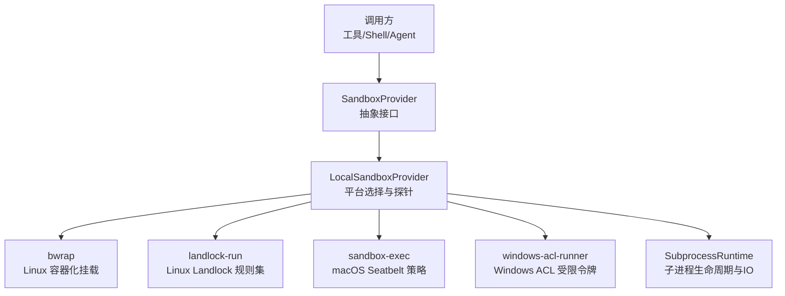
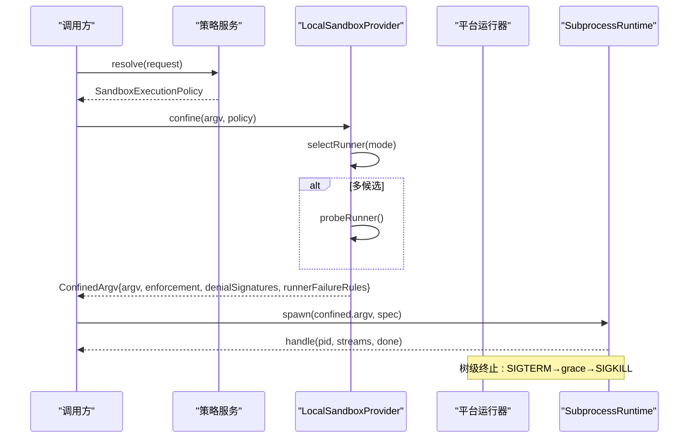
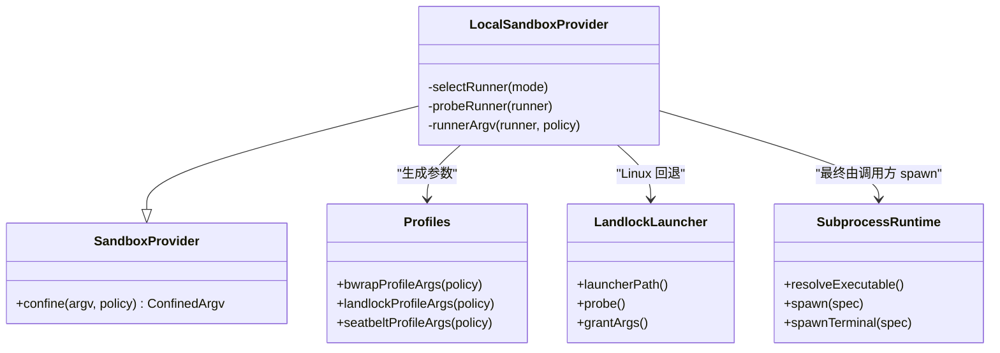

# 进程隔离机制

<cite>
**本文引用的文件**
- [packages/sandbox/sandbox/src/index.ts](file://packages/sandbox/sandbox/src/index.ts)
- [packages/sandbox/sandbox-local/src/index.ts](file://packages/sandbox/sandbox-local/src/index.ts)
- [packages/sandbox/sandbox-local/src/profiles.ts](file://packages/sandbox/sandbox-local/src/profiles.ts)
- [native/landlock-run/README.md](file://native/landlock-run/README.md)
- [native/landlock-run/packages/entry/src/main.c](file://native/landlock-run/packages/entry/src/main.c)
- [docs/subsystems/sandbox.md](file://docs/subsystems/sandbox.md)
- [docs/subsystems/subprocess.md](file://docs/subsystems/subprocess.md)
- [packages/subprocess/subprocess-local/src/index.ts](file://packages/subprocess/subprocess-local/src/index.ts)
- [packages/shell/bash-sandbox/tests/landlock.e2e.ts](file://packages/shell/bash-sandbox/tests/landlock.e2e.ts)
- [packages/sandbox/sandbox-local/tests/local.spec.ts](file://packages/sandbox/sandbox-local/tests/local.spec.ts)
</cite>

## 目录
1. [简介](#简介)
2. [项目结构](#项目结构)
3. [核心组件](#核心组件)
4. [架构总览](#架构总览)
5. [详细组件分析](#详细组件分析)
6. [依赖关系分析](#依赖关系分析)
7. [性能与资源限制](#性能与资源限制)
8. [故障排查指南](#故障排查指南)
9. [结论](#结论)
10. [附录：配置示例与安全策略最佳实践](#附录配置示例与安全策略最佳实践)

## 简介
本文件系统性地文档化该仓库中的“进程隔离”能力：如何通过沙箱将不受信命令在受限环境中执行，覆盖 Linux、macOS、Windows 三平台的实现差异；Landlock 安全模块的工作原理与 ABI 协商；进程间通信的安全边界与 IPC 控制；以及监控、资源使用限制和异常处理机制。

该能力以“服务契约 + 平台后端”的方式组织：上层通过统一的沙箱接口定义“文件效果策略”，由本地提供者根据平台选择具体运行器（Linux 优先 bubblewrap，回退 Landlock；macOS 使用 Seatbelt；Windows 使用 ACL 受限令牌），并以“失败即关闭”的原则确保不会静默降级为无约束执行。

## 项目结构
围绕进程隔离的关键代码分布在以下位置：
- 抽象契约与类型：packages/sandbox/sandbox/src/index.ts
- 本地多平台提供者：packages/sandbox/sandbox-local/src/index.ts、profiles.ts
- Linux Landlock 原生启动器：native/landlock-run/packages/entry/src/main.c、README.md
- 子进程管理：packages/subprocess/subprocess-local/src/index.ts、docs/subsystems/subprocess.md
- 文档与测试用例：docs/subsystems/sandbox.md、各 e2e/spec 用例

图表来源
- [packages/sandbox/sandbox/src/index.ts:152-176](file://packages/sandbox/sandbox/src/index.ts#L152-L176)
- [packages/sandbox/sandbox-local/src/index.ts:159-166](file://packages/sandbox/sandbox-local/src/index.ts#L159-L166)
- [packages/subprocess/subprocess-local/src/index.ts:37-157](file://packages/subprocess/subprocess-local/src/index.ts#L37-L157)

章节来源
- [docs/subsystems/sandbox.md:1-10](file://docs/subsystems/sandbox.md#L1-L10)
- [packages/sandbox/sandbox/src/index.ts:152-176](file://packages/sandbox/sandbox/src/index.ts#L152-L176)

## 核心组件
- 沙箱策略与模式
  - 文件效果模式：read-only、workspace-write、danger-full-access。网络与进程可见性不在该词汇表内。
  - 强制完整性：full/partial，用于向消费者报告当前主机上后端能达到的完整程度。
- 抽象服务
  - SandboxProvider：confine(argv, policy) 返回受约束的 argv、enforcement、denialSignatures、runnerFailureRules。
- 本地提供者
  - LocalSandboxProvider：按平台选择 runner 链（Linux: bwrap → landlock；macOS: seatbelt；Windows: windows-acl），功能探针仲裁，缓存结果。
- 平台配置文件生成
  - profiles.ts：将策略转换为各运行器的参数（bwrap 挂载、Landlock 授权路径、Seatbelt SBPL）。
- 子进程运行时
  - LocalSubprocessRuntime：负责可执行解析、stdio 处置、树级终止（SIGTERM→grace→SIGKILL）、PTY 分配与清理。

章节来源
- [docs/subsystems/sandbox.md:9-39](file://docs/subsystems/sandbox.md#L9-L39)
- [packages/sandbox/sandbox/src/index.ts:23-72](file://packages/sandbox/sandbox/src/index.ts#L23-L72)
- [packages/sandbox/sandbox/src/index.ts:90-116](file://packages/sandbox/sandbox/src/index.ts#L90-L116)
- [packages/sandbox/sandbox-local/src/index.ts:250-333](file://packages/sandbox/sandbox-local/src/index.ts#L250-L333)
- [packages/sandbox/sandbox-local/src/profiles.ts:11-58](file://packages/sandbox/sandbox-local/src/profiles.ts#L11-L58)
- [docs/subsystems/subprocess.md:89-130](file://docs/subsystems/subprocess.md#L89-L130)

## 架构总览
下图展示了从调用方到具体后端的调用序列，包括策略解析、平台选择、功能探针、生成 argv、子进程生命周期管理。

图表来源
- [packages/sandbox/sandbox/src/index.ts:164-175](file://packages/sandbox/sandbox/src/index.ts#L164-L175)
- [packages/sandbox/sandbox-local/src/index.ts:492-539](file://packages/sandbox/sandbox-local/src/index.ts#L492-L539)
- [packages/subprocess/subprocess-local/src/index.ts:146-157](file://packages/subprocess/subprocess-local/src/index.ts#L146-L157)

## 详细组件分析

### 抽象沙箱服务与策略
- 策略对象包含 mode、workspaceRoot、可选 sessionId，供后端按会话/工作区做状态键控（如 Windows ACL 的临时目录与 SID）。
- confinement 必须返回“可执行的受约束 argv”，禁止静默降级为无约束执行；不可用时抛出 SANDBOX_UNAVAILABLE。
- denialSignatures 与 runnerFailureRules 帮助区分“被沙箱拒绝”和“运行器自身失败”。

章节来源
- [packages/sandbox/sandbox/src/index.ts:34-72](file://packages/sandbox/sandbox/src/index.ts#L34-L72)
- [packages/sandbox/sandbox/src/index.ts:90-143](file://packages/sandbox/sandbox/src/index.ts#L90-L143)
- [docs/subsystems/sandbox.md:41-94](file://docs/subsystems/sandbox.md#L41-L94)

### 本地提供者：平台选择与功能探针
- 平台链：
  - Linux: 先尝试 bwrap（基于 mount namespace 的强隔离），再回退到 Landlock（内核级文件访问白名单）。
  - macOS: 使用 sandbox-exec（Seatbelt）应用 deny-file-write* 策略并允许 /dev/null。
  - Windows: 使用 ACL 受限令牌，声明 partial 强制完整性（因 Everyone 与硬链接等限制）。
- 功能探针：
  - bwrap：尝试创建最小读根+/dev+/proc 的命名空间并运行 true。
  - Landlock：调用 landlock-run --probe 构建最大规则集并实际 restrict_self，判断 full/partial/unusable。
  - Seatbelt：用 read-only 策略运行 true。
  - Windows ACL：以只读模式运行 cmd /c exit 0 验证受限令牌可用。
- 结果缓存：首次选择后缓存 selectedRunner，避免重复探测。

章节来源
- [packages/sandbox/sandbox-local/src/index.ts:159-187](file://packages/sandbox/sandbox-local/src/index.ts#L159-L187)
- [packages/sandbox/sandbox-local/src/index.ts:67-112](file://packages/sandbox/sandbox-local/src/index.ts#L67-L112)
- [packages/sandbox/sandbox-local/src/index.ts:492-539](file://packages/sandbox/sandbox-local/src/index.ts#L492-L539)

### 平台配置文件生成
- bwrapProfileArgs：
  - read-only：绑定只读根、/dev、/proc，并设置 die-with-parent。
  - workspace-write：额外创建 tmpfs /tmp 并将 workspaceRoot 重新绑定。
- landlockProfileArgs：
  - read-only：授予 / 读与执行，仅允许写 /dev/null。
  - workspace-write：额外授予 /tmp 与 workspaceRoot 读写。
- seatbeltProfileArgs：
  - 生成 SBPL 字符串，默认 deny file-write*，显式允许 /dev/null，并按 writableRoots 追加子路径写入许可。

章节来源
- [packages/sandbox/sandbox-local/src/profiles.ts:11-58](file://packages/sandbox/sandbox-local/src/profiles.ts#L11-L58)

### Landlock 安全模块工作原理
- 自限制后执行：landlock-run 在当前线程创建规则集，设置 no_new_privs，restrict_self 后 exec 目标命令；规则集跨 execve 继承，因此子进程也受约束。
- ABI 协商：探测内核支持的 ABI 级别，动态裁剪 handled_access_fs 掩码；若 ABI 较旧则报告 partial enforcement。
- 失败即关闭：无法创建规则集或内核不启用时直接退出，绝不执行未受约束的命令。
- CLI 契约：--ro/--rw 指定授权路径，--probe 进行功能探测，错误输出带固定前缀便于分类。

章节来源
- [native/landlock-run/README.md:1-48](file://native/landlock-run/README.md#L1-L48)
- [native/landlock-run/packages/entry/src/main.c:132-267](file://native/landlock-run/packages/entry/src/main.c#L132-L267)
- [native/landlock-run/packages/entry/src/main.c:269-297](file://native/landlock-run/packages/entry/src/main.c#L269-L297)

### 子进程管理与 IPC 安全边界
- 可执行解析：支持绝对路径或 PATH 查找，拒绝相对路径含分隔符，避免歧义。
- stdio 处置：pipe、inherit、collect（带溢出尾部和 spill 文件）三种模式，明确且可恢复。
- 环境隔离：清洗父进程环境变量，保留受信任的 DSH_* 命名空间；显式 env 合并。
- 终止与回收：统一 terminate() 触发 SIGTERM→grace→SIGKILL 升级；waitForExit 等待整棵进程树退出；PTY 终端同样具备前台进程组检测与信号转发。
- IPC 边界：管道与 PTY 是主要通道；沙箱策略仅约束“文件效果”，网络与进程可见性需由更高层策略或平台机制共同保障。

章节来源
- [docs/subsystems/subprocess.md:9-16](file://docs/subsystems/subprocess.md#L9-L16)
- [docs/subsystems/subprocess.md:39-87](file://docs/subsystems/subprocess.md#L39-L87)
- [docs/subsystems/subprocess.md:89-130](file://docs/subsystems/subprocess.md#L89-L130)
- [docs/subsystems/subprocess.md:132-173](file://docs/subsystems/subprocess.md#L132-L173)
- [packages/subprocess/subprocess-local/src/index.ts:104-157](file://packages/subprocess/subprocess-local/src/index.ts#L104-L157)

### 平台差异对比
- Linux
  - 首选 bwrap：通过 mount 命名空间提供强隔离，适合需要严格文件系统边界的场景。
  - 回退 Landlock：内核级文件访问白名单，无需特权命名空间，但受 ABI 影响可能 partial。
- macOS
  - Seatbelt：通过 sandbox-exec 应用 deny-file-write* 策略，仅允许必要写入点（如 /dev/null）。
- Windows
  - ACL 受限令牌：以 SID 粒度授予工作区与临时目录写入，整体为 partial 强制完整性（Everyone 与硬链接限制）。

章节来源
- [packages/sandbox/sandbox-local/src/index.ts:159-187](file://packages/sandbox/sandbox-local/src/index.ts#L159-L187)
- [packages/sandbox/sandbox-local/src/profiles.ts:11-58](file://packages/sandbox/sandbox-local/src/profiles.ts#L11-L58)

## 依赖关系分析

图表来源
- [packages/sandbox/sandbox/src/index.ts:152-176](file://packages/sandbox/sandbox/src/index.ts#L152-L176)
- [packages/sandbox/sandbox-local/src/index.ts:250-333](file://packages/sandbox/sandbox-local/src/index.ts#L250-L333)
- [packages/sandbox/sandbox-local/src/profiles.ts:11-58](file://packages/sandbox/sandbox-local/src/profiles.ts#L11-L58)
- [native/landlock-run/README.md:25-43](file://native/landlock-run/README.md#L25-L43)
- [packages/subprocess/subprocess-local/src/index.ts:104-157](file://packages/subprocess/subprocess-local/src/index.ts#L104-L157)

章节来源
- [packages/sandbox/sandbox-local/src/index.ts:250-333](file://packages/sandbox/sandbox-local/src/index.ts#L250-L333)

## 性能与资源限制
- 资源限制现状
  - 当前沙箱层聚焦“文件效果”限制，未内置 CPU/内存/cgroups 限制。
  - 可通过外部机制叠加资源限制（例如 cgroups v2、ulimit、容器编排），并在调用方配置中传入。
- 性能考量
  - bwrap 会创建新的 mount 命名空间，带来少量开销；Landlock 为内核态过滤，开销较低但受 ABI 限制。
  - Seatbelt 策略编译与应用有固定成本；Windows ACL 初始化涉及 SID/DACL 操作。
- 监控建议
  - 利用子进程的 CollectedOutput 与 spill 文件收集诊断输出。
  - 结合操作系统工具（如 Linux perf、macOS dtrace、Windows ETW）对受限进程进行观测。

[本节为通用指导，不直接分析具体文件]

## 故障排查指南
- 常见错误与定位
  - SANDBOX_UNAVAILABLE：无可用后端（缺少 bwrap/sandbox-exec/landlock 或 Windows ACL 不可用）。检查平台二进制与内核能力。
  - Runner failure：运行器自身失败（非命令执行失败）。依据 runnerFailureRules 匹配 stderr 与退出码。
  - Denial：被沙箱拒绝。依据 denialSignatures 判断具体后端产生的错误特征。
- 调试步骤
  - 使用 --probe 验证 Landlock 是否可用及 enforcement 等级。
  - 切换 runnerCommand 指向自定义运行器，配合 runnerFailureSignatures 快速定位问题。
  - 在测试中注入 internals 钩子替换平台探针，复现特定分支。

章节来源
- [packages/sandbox/sandbox/src/index.ts:118-143](file://packages/sandbox/sandbox/src/index.ts#L118-L143)
- [packages/sandbox/sandbox-local/src/index.ts:218-240](file://packages/sandbox/sandbox-local/src/index.ts#L218-L240)
- [packages/shell/bash-sandbox/tests/landlock.e2e.ts:26-54](file://packages/shell/bash-sandbox/tests/landlock.e2e.ts#L26-L54)
- [packages/sandbox/sandbox-local/tests/local.spec.ts:109-130](file://packages/sandbox/sandbox-local/tests/local.spec.ts#L109-L130)

## 结论
该仓库实现了跨平台的进程隔离能力，以“策略 + 后端”的方式解耦了文件效果约束与平台实现。Linux 优先使用 bwrap 提供强隔离，回退到内核级 Landlock；macOS 使用 Seatbelt；Windows 使用 ACL 受限令牌。所有后端遵循“失败即关闭”原则，并通过 enforcement 等级向调用方透明报告能力边界。子进程管理提供了稳健的生命周期与 IO 模型，便于上层组合出安全的执行环境。

[本节为总结，不直接分析具体文件]

## 附录：配置示例与安全策略最佳实践

- 配置要点
  - 策略模式
    - read-only：仅允许必要写入点（如 /dev/null）。
    - workspace-write：允许在工作区与后端定义的临时区域写入。
    - danger-full-access：绕过约束，仅用于可信场景。
  - 平台选择
    - Linux：优先 bwrap，必要时回退 Landlock。
    - macOS：Seatbelt 策略。
    - Windows：ACL 受限令牌，注意 partial 强制完整性。
  - 运行器与失败规则
    - 可配置 runnerCommand 与 runnerFailureSignatures 以适配自定义运行器。
- 安全策略最佳实践
  - 始终使用 confined 模式执行不受信命令，避免静默降级。
  - 使用 workspace-root 作为唯一写入边界，避免全局写权限。
  - 结合操作系统资源限制（cgroups/ulimit）与超时/中止信号，防止资源耗尽。
  - 对关键路径启用日志与 spill 文件，便于事后审计。
- 监控与异常处理
  - 使用 SubprocessHandle.waitForExit 观察整棵进程树退出。
  - 依据 runnerFailureRules 与 denialSignatures 区分“运行器失败”与“被沙箱拒绝”。
  - 在宿主退出时自动终止所有受管进程，避免孤儿进程。

章节来源
- [docs/subsystems/sandbox.md:9-39](file://docs/subsystems/sandbox.md#L9-L39)
- [packages/sandbox/sandbox-local/src/index.ts:250-333](file://packages/sandbox/sandbox-local/src/index.ts#L250-L333)
- [docs/subsystems/subprocess.md:132-173](file://docs/subsystems/subprocess.md#L132-L173)
- [packages/subprocess/subprocess-local/src/index.ts:62-102](file://packages/subprocess/subprocess-local/src/index.ts#L62-L102)