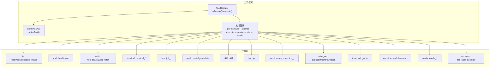
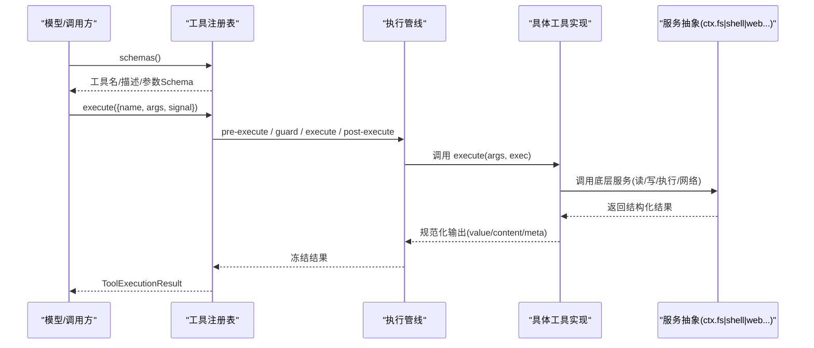
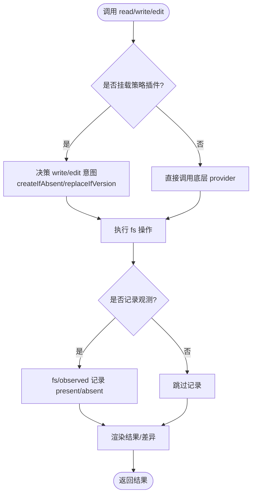
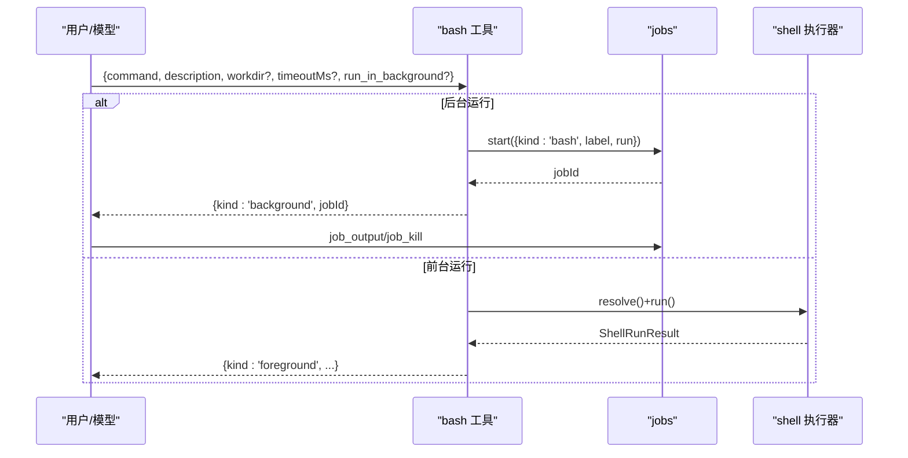
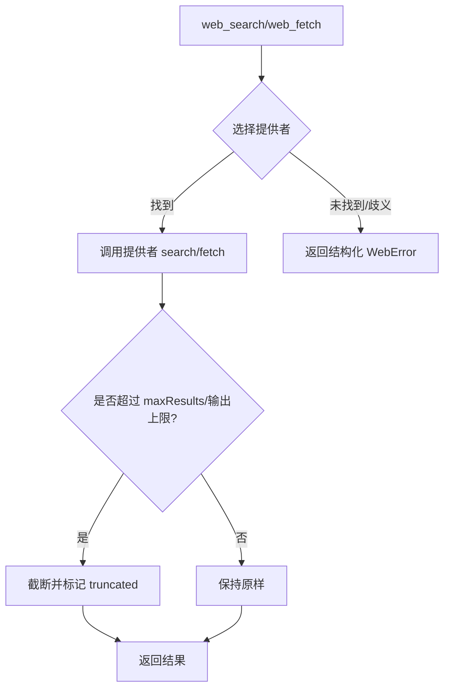
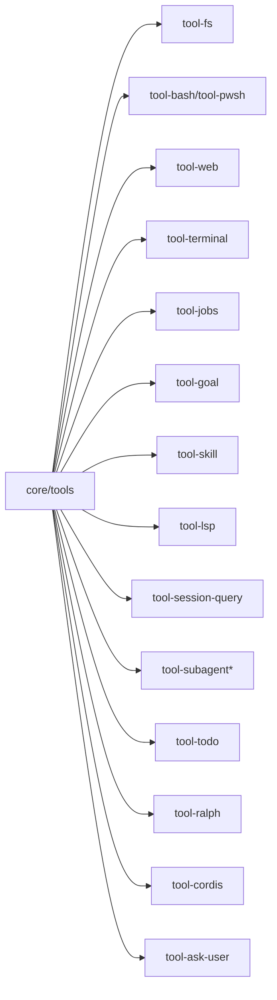

# 内置工具

<cite>
**本文引用的文件**
- [packages/core/tools/src/index.ts](file://packages/core/tools/src/index.ts)
- [packages/core/tools/src/schema.ts](file://packages/core/tools/src/schema.ts)
- [packages/core/tools/src/presentation.ts](file://packages/core/tools/src/presentation.ts)
- [docs/subsystems/tools.md](file://docs/subsystems/tools.md)
- [docs/tool-catalog.md](file://docs/tool-catalog.md)
- [packages/fs/tool-fs/src/index.ts](file://packages/fs/tool-fs/src/index.ts)
- [docs/subsystems/filesystem.md](file://docs/subsystems/filesystem.md)
- [packages/shell/tool-bash/src/index.ts](file://packages/shell/tool-bash/src/index.ts)
- [docs/subsystems/shell.md](file://docs/subsystems/shell.md)
- [packages/web/tool-web/src/index.ts](file://packages/web/tool-web/src/index.ts)
- [docs/subsystems/web.md](file://docs/subsystems/web.md)
- [packages/fs/tool-fs-search/src/index.ts](file://packages/fs/tool-fs-search/src/index.ts)
- [packages/terminal/tool-terminal/src/index.ts](file://packages/terminal/tool-terminal/src/index.ts)
- [packages/jobs/tool-jobs/src/index.ts](file://packages/jobs/tool-jobs/src/index.ts)
- [packages/goal/tool-goal/src/index.ts](file://packages/goal/tool-goal/src/index.ts)
- [packages/skill/tool-skill/src/index.ts](file://packages/skill/tool-skill/src/index.ts)
- [packages/lsp/tool-lsp/src/index.ts](file://packages/lsp/tool-lsp/src/index.ts)
- [packages/session-query/tool-session-query/src/index.ts](file://packages/session-query/tool-session-query/src/index.ts)
- [packages/subagent/tool-subagent/src/index.ts](file://packages/subagent/tool-subagent/src/index.ts)
- [packages/subagent/tool-subagent-control/src/index.ts](file://packages/subagent/tool-subagent-control/src/index.ts)
- [packages/subagent/tool-subagent-report/src/index.ts](file://packages/subagent/tool-subagent-report/src/index.ts)
- [packages/todo/tool-todo/src/index.ts](file://packages/todo/tool-todo/src/index.ts)
- [packages/workflow/tool-ralph/src/index.ts](file://packages/workflow/tool-ralph/src/index.ts)
- [packages/extensions/tool-cordis/src/index.ts](file://packages/extensions/tool-cordis/src/index.ts)
- [packages/interaction/tool-ask-user/src/index.ts](file://packages/interaction/tool-ask-user/src/index.ts)
</cite>

## 目录
1. [简介](#简介)
2. [项目结构](#项目结构)
3. [核心组件](#核心组件)
4. [架构总览](#架构总览)
5. [详细组件分析](#详细组件分析)
6. [依赖关系分析](#依赖关系分析)
7. [性能考量](#性能考量)
8. [故障排查指南](#故障排查指南)
9. [结论](#结论)
10. [附录：常用模式与最佳实践](#附录：常用模式与最佳实践)

## 简介
本文件面向“内置工具”的完整使用与扩展，覆盖文件系统操作、网络请求、代码执行、终端交互、搜索与查询、目标管理、工作流编排等。文档从工具注册、参数校验、执行管线、呈现层到错误处理进行系统化说明，并提供组合使用建议、性能对比、限制与注意事项、扩展点与自定义能力，以及常见模式的参考路径。

## 项目结构
- 工具框架位于 core/tools，提供 ToolDefinition、Schema DSL、执行管线（pre-execute/guards/execute/post-execute/result）、UI 呈现契约。
- 各功能域以“tool-*”包形式实现模型可见的工具（如 fs、shell、web、terminal、jobs、goal、skill、lsp、session-query、subagent、todo、workflow、cordis、ask-user）。
- 子系统文档（filesystem、shell、web）描述底层服务抽象与提供者选择策略，工具层仅消费这些抽象。

图表来源
- [packages/core/tools/src/index.ts:152-715](file://packages/core/tools/src/index.ts#L152-L715)
- [docs/subsystems/tools.md:9-721](file://docs/subsystems/tools.md#L9-L721)

章节来源
- [docs/subsystems/tools.md:9-721](file://docs/subsystems/tools.md#L9-L721)
- [docs/tool-catalog.md:12-42](file://docs/tool-catalog.md#L12-L42)

## 核心组件
- 工具定义与注册：通过 defineTool 声明 name/description/parameters/output/execute，并可选 presentCall/presentResult/finalizeContent/timeoutMs/isConcurrencySafe。
- 执行管线：tools/pre-execute（允许/拒绝/询问）→ 单调守卫（ToolGuard）→ tools/execute（超时/重试/指标）→ tools/post-execute（替换内容或值/阻断）→ finalizeContent → tools/result（最终结果）。
- 呈现层：ToolCallView/ToolResultView 统一 UI 表达（generic/terminal/diff/search/read/web）。
- 并发与安全：isConcurrencySafe 标记可并行；timeoutMs 为协作式超时预算；guard 可最终拒绝调用。

章节来源
- [packages/core/tools/src/index.ts:152-715](file://packages/core/tools/src/index.ts#L152-L715)
- [docs/subsystems/tools.md:9-721](file://docs/subsystems/tools.md#L9-L721)

## 架构总览
工具由框架统一调度，具体能力由不同 tool-* 包实现，并通过 ctx.* 服务抽象对接后端（如 ctx.fs、ctx.shell、ctx.web）。工具对外暴露稳定的 JSON Schema 参数，内部执行遵循统一的执行与呈现协议。

图表来源
- [packages/core/tools/src/index.ts:152-715](file://packages/core/tools/src/index.ts#L152-L715)
- [docs/subsystems/tools.md:170-405](file://docs/subsystems/tools.md#L170-L405)

## 详细组件分析

### 文件系统工具（read/write/edit/read_image）
- 能力：读取文本/图片、创建/覆盖文件、按字面量编辑、沙箱策略与观察策略。
- 关键配置：readLimit、readMaxLineLength、readMaxBytes、readStreamMinSize。
- 行为要点：
  - read 支持窗口化与字节上限，超大文件走流式读取。
  - write/edit 可通过 FsWriteIntent/FsEditRequest 做版本守卫与原子写入。
  - 可选 fs/* 事件策略（fs/write-intent、fs/edit-intent、fs/observed）实现“先读后改”等策略。
  - 无 timeoutMs（文件系统 I/O 不强制超时），取消通过信号传播。
- 呈现：read 返回行号化内容；edit/write 变更可配合 diff 视图。

图表来源
- [docs/subsystems/filesystem.md:114-278](file://docs/subsystems/filesystem.md#L114-L278)
- [packages/fs/tool-fs/src/index.ts:24-79](file://packages/fs/tool-fs/src/index.ts#L24-L79)

章节来源
- [docs/subsystems/filesystem.md:11-496](file://docs/subsystems/filesystem.md#L11-L496)
- [packages/fs/tool-fs/src/index.ts:24-79](file://packages/fs/tool-fs/src/index.ts#L24-L79)

### Shell 工具（bash/pwsh）
- 能力：前台/后台执行命令、超时控制、工作目录、环境变量注入、沙箱模式与升级审批。
- 关键配置：enableRunInBackground（默认启用）。
- 行为要点：
  - 前台：返回退出码、信号、是否超时/中止、stdout/stderr（含截断与溢出文件路径）。
  - 后台：立即返回 jobId，通过 jobs 工具收集输出与终止。
  - 沙箱：若被拒绝，可在同一轮中申请更宽权限（sandbox_permissions + justification）并经审批后重试一次。
  - 环境：DSH_* 变量由 shellEnv 在每次执行时注入。
- 呈现：前台以终端卡片展示，包含退出状态；后台以通用卡片展示启动确认。

图表来源
- [packages/shell/tool-bash/src/index.ts:190-395](file://packages/shell/tool-bash/src/index.ts#L190-L395)
- [docs/subsystems/shell.md:105-222](file://docs/subsystems/shell.md#L105-L222)

章节来源
- [docs/subsystems/shell.md:1-304](file://docs/subsystems/shell.md#L1-L304)
- [packages/shell/tool-bash/src/index.ts:30-395](file://packages/shell/tool-bash/src/index.ts#L30-L395)

### Web 工具（web_search/web_fetch）
- 能力：搜索与抓取网页内容，统一通过 ctx.web 选择提供者。
- 关键配置：searchMaxResults、fetchTimeoutMs、searchTimeoutMs、fetchMaxOutputChars。
- 行为要点：
  - 搜索：返回 sources[]（可截断）与可选 content；maxResults 在服务层强制。
  - 抓取：返回 url、statusCode、body（html/text），非 2xx 仍为成功结果。
  - 提供者选择：优先配置 id，否则自动选择唯一可用提供者；歧义或缺失会返回结构化错误。
  - 安全：本地 fetch 仅 HTTP(S)，限制重定向/大小/字符/时间。
- 呈现：search/fetch 分别有专用呈现视图（search/web）。

图表来源
- [docs/subsystems/web.md:13-133](file://docs/subsystems/web.md#L13-L133)
- [packages/web/tool-web/src/index.ts:26-92](file://packages/web/tool-web/src/index.ts#L26-L92)

章节来源
- [docs/subsystems/web.md:1-200](file://docs/subsystems/web.md#L1-L200)
- [packages/web/tool-web/src/index.ts:20-92](file://packages/web/tool-web/src/index.ts#L20-L92)

### 文件系统搜索（glob/grep）
- 能力：基于 ripgrep 的文件匹配与内容搜索，无需宿主安装 rg。
- 行为要点：
  - glob：返回匹配路径，结果过大时采样并保存完整列表。
  - grep：返回匹配行及位置，内联限制 250 条，超出则保存完整列表。
  - 通过 ctx.subprocess 作为前台任务执行，不支持后台。
- 呈现：search 视图（matches/paths），支持截断提示。

章节来源
- [docs/tool-catalog.md:716-775](file://docs/tool-catalog.md#L716-L775)
- [packages/fs/tool-fs-search/src/index.ts:1-200](file://packages/fs/tool-fs-search/src/index.ts#L1-L200)

### 终端工具（terminal_open/close/list/read/send/signal）
- 能力：持久终端会话的生命周期管理与交互。
- 行为要点：
  - open/close 管理会话；send 支持发送输入；read 获取增量输出；signal 发送信号。
  - 可与 jobs 结合实现后台任务。
- 呈现：终端卡片与输出块。

章节来源
- [docs/tool-catalog.md:776-800](file://docs/tool-catalog.md#L776-L800)
- [packages/terminal/tool-terminal/src/index.ts:1-200](file://packages/terminal/tool-terminal/src/index.ts#L1-L200)

### 作业管理（job_list/job_output/job_kill）
- 能力：跨能力的后台作业统一管控（bash、PTY、子代理等）。
- 行为要点：
  - list 列出作业；output 读取增量输出；kill 终止作业。
  - 与 bash/terminal/subagent 等生产者协作。
- 呈现：通用卡片与输出块。

章节来源
- [docs/tool-catalog.md:38-39](file://docs/tool-catalog.md#L38-L39)
- [packages/jobs/tool-jobs/src/index.ts:1-200](file://packages/jobs/tool-jobs/src/index.ts#L1-L200)

### 目标管理（create_goal/get_goal/update_goal）
- 能力：创建、查询、更新目标；需要人类授权（root 权限）完成关键操作。
- 行为要点：
  - 完成/阻塞需满足最低轮次约束；变更通过 goal/change 事件通知。
- 呈现：目标卡片与状态。

章节来源
- [docs/tool-catalog.md:29-30](file://docs/tool-catalog.md#L29-L30)
- [packages/goal/tool-goal/src/index.ts:1-200](file://packages/goal/tool-goal/src/index.ts#L1-L200)

### 技能（skill）
- 能力：调用已注册技能，注入上下文与指令。
- 行为要点：
  - 通过 agent.inject() 将用户消息/指令注入会话。
- 呈现：技能调用卡片。

章节来源
- [docs/tool-catalog.md:33-34](file://docs/tool-catalog.md#L33-L34)
- [packages/skill/tool-skill/src/index.ts:1-200](file://packages/skill/tool-skill/src/index.ts#L1-L200)

### LSP（lsp）
- 能力：语言服务器查询（诊断、符号、跳转等），屏蔽提供者差异。
- 行为要点：
  - 需要运行时注册 LSP 提供者；未注册时返回结构化错误。
- 呈现：搜索结果卡片。

章节来源
- [docs/tool-catalog.md:31-32](file://docs/tool-catalog.md#L31-L32)
- [packages/lsp/tool-lsp/src/index.ts:1-200](file://packages/lsp/tool-lsp/src/index.ts#L1-L200)

### 会话查询（session_event_read/search/trace/session_search/session_trace）
- 能力：只读访问当前会话的事件与轨迹，隐藏提供者游标。
- 行为要点：
  - 需要调用者具备工作区权限；可搭配超时/溢出策略。
- 呈现：搜索结果与追踪视图。

章节来源
- [docs/tool-catalog.md:34-35](file://docs/tool-catalog.md#L34-L35)
- [packages/session-query/tool-session-query/src/index.ts:1-200](file://packages/session-query/tool-session-query/src/index.ts#L1-L200)

### 子代理（subagent/subagent_fork、control、report）
- 能力：创建/控制/报告子代理；支持后台持续运行与中断。
- 行为要点：
  - subagent：可继续型，默认后台执行并自动交付结果。
  - subagent_fork：一次性，默认前台。
  - control：全局命名 send_message/interrupt_agent/list_agents。
  - report：子代理向父会话报告。
- 呈现：子代理卡片与控制面板。

章节来源
- [docs/tool-catalog.md:35-37](file://docs/tool-catalog.md#L35-L37)
- [packages/subagent/tool-subagent/src/index.ts:1-200](file://packages/subagent/tool-subagent/src/index.ts#L1-L200)
- [packages/subagent/tool-subagent-control/src/index.ts:1-200](file://packages/subagent/tool-subagent-control/src/index.ts#L1-L200)
- [packages/subagent/tool-subagent-report/src/index.ts:1-200](file://packages/subagent/tool-subagent-report/src/index.ts#L1-L200)

### Todo（todo_write）
- 能力：会话级待办清单；UI 渲染最新 todo/write 事件。
- 行为要点：
  - allowParallelInProgress 决定允许多个进行中任务（默认 true）。
- 呈现：检查列表卡片。

章节来源
- [docs/tool-catalog.md:39-40](file://docs/tool-catalog.md#L39-L40)
- [packages/todo/tool-todo/src/index.ts:1-200](file://packages/todo/tool-todo/src/index.ts#L1-L200)

### 工作流（workflow/ralph）
- 能力：固定前台工作流，每轮生成一个结构化子任务；ralph 为固定流程入口。
- 行为要点：
  - 通过 workflowEngine 驱动；子任务事件贯穿执行过程。
- 呈现：工作流卡片与步骤视图。

章节来源
- [docs/tool-catalog.md:40-41](file://docs/tool-catalog.md#L40-L41)
- [packages/workflow/tool-ralph/src/index.ts:1-200](file://packages/workflow/tool-ralph/src/index.ts#L1-L200)

### Cordis 动态包（cordis_define/inspect/run/stop/undefine）
- 能力：动态定义/查询/运行/停止/删除 Cordis 插件包。
- 行为要点：
  - 需要 dynamicCordisRunner 注入；运行中的包可注册额外工具。
- 呈现：定义与运行卡片。

章节来源
- [docs/tool-catalog.md:23-24](file://docs/tool-catalog.md#L23-L24)
- [packages/extensions/tool-cordis/src/index.ts:1-200](file://packages/extensions/tool-cordis/src/index.ts#L1-L200)

### 用户问答（ask_user_question）
- 能力：暂停工具调用直至 UI/提供者返回人类答案。
- 行为要点：
  - 支持单选/多选、推荐选项、标题与问题分组。
- 呈现：问答卡片。

章节来源
- [docs/tool-catalog.md:17-20](file://docs/tool-catalog.md#L17-L20)
- [packages/interaction/tool-ask-user/src/index.ts:1-200](file://packages/interaction/tool-ask-user/src/index.ts#L1-L200)

## 依赖关系分析
- 工具框架依赖：schema、presentation、registry、waterfall。
- 工具包依赖：各自 ctx.* 服务（fs、shell、web、terminals、jobs、agents、skills、lsp、sessionQuery、subagents、workflowEngine、dynamicCordisRunner、userQuestions）。
- 外部集成：ripgrep（fs-search）、HTTP 客户端（web-fetch）、LSP 提供者、子代理提供者、作业运行时等。

图表来源
- [docs/tool-catalog.md:12-42](file://docs/tool-catalog.md#L12-L42)
- [packages/core/tools/src/index.ts:152-715](file://packages/core/tools/src/index.ts#L152-L715)

章节来源
- [docs/tool-catalog.md:12-42](file://docs/tool-catalog.md#L12-L42)

## 性能考量
- 并发：isConcurrencySafe=true 的工具可参与并行组；未知/异常分类视为独占。
- 超时：工具级 timeoutMs 为协作式预算，需工具体正确响应 AbortSignal；文件系统 I/O 不强制超时。
- 输出上限：web_search 的 maxResults 与服务层截断；web_fetch 的输出字符上限；fs read 的行/字节上限；bash 输出截断与溢出文件。
- 资源占用：大文件读取走流式；搜索/抓取结果可能保存到 spillStore；后台作业避免阻塞主循环。

[本节为通用指导，不直接分析具体文件]

## 故障排查指南
- 工具不可用/未知：UNKNOWN_TOOL；检查工具注册与作用域限制（allow/deny）。
- 参数错误：INVALID_ARGS；检查 schema 与必填字段。
- 输出无效：INVALID_TOOL_OUTPUT；检查 output.schema 与 render/presentationMeta。
- 网络错误：WebError（WEB_PROVIDER_UNAVAILABLE/AMBIGUOUS/CONFIGURED_MISSING/ERROR 等）；检查提供者配置与可用性。
- 沙箱拒绝：SANDBOX_DENIED/SANDBOX_UNAVAILABLE；必要时在同一轮中申请更宽权限并重试一次。
- 文件错误：FS_NOT_FOUND/FS_PERMISSION_DENIED/FS_IO_ERROR/FS_STALE_VERSION/FS_NOT_OBSERVED 等；根据错误码分支处理。
- 超时/中止：TOOL_ABORTED/ABORTED_BEFORE_DISPATCH；确保工具体监听信号并及时归零。

章节来源
- [docs/subsystems/tools.md:170-405](file://docs/subsystems/tools.md#L170-L405)
- [docs/subsystems/filesystem.md:244-278](file://docs/subsystems/filesystem.md#L244-L278)
- [docs/subsystems/web.md:126-133](file://docs/subsystems/web.md#L126-L133)
- [docs/subsystems/shell.md:141-166](file://docs/subsystems/shell.md#L141-L166)

## 结论
内置工具通过统一的注册与执行管线，将文件系统、Shell、网络、终端、作业、目标、技能、LSP、会话查询、子代理、Todo、工作流、Cordis 动态包与用户问答等能力标准化暴露给模型与上层应用。借助 schema 校验、执行水线、呈现契约与策略插件，系统在保证安全与可控的前提下提供了强大的可扩展性。

[本节为总结，不直接分析具体文件]

## 附录：常用模式与最佳实践

- 组合模式
  - 文件+搜索：先用 glob/grep 定位目标，再用 read/edit 修改，最后用 str_replace_editor 精确替换。
  - 命令+作业：长耗时命令使用 run_in_background，通过 job_output/job_kill 管理生命周期。
  - 网络+文件：web_search 获取信息，web_fetch 抓取详情，write 落盘，read 二次验证。
  - 子代理+作业：subagent 后台运行复杂任务，通过 send_message/interrupt_agent 控制。
  - 目标+Todo：create_goal 规划任务，todo_write 维护待办，完成后 update_goal。

- 参数与配置建议
  - 合理设置 readLimit/readMaxBytes 避免大输出阻塞；web_search 的 searchMaxResults 控制结果规模；web_fetch 的 fetchTimeoutMs/fetchMaxOutputChars 控制时间与体积。
  - 对沙箱敏感的命令，遇到拒绝时立即申请更宽权限并重试一次，避免多次试探。

- 扩展与自定义
  - 新增工具：使用 defineTool 注册，声明 parameters/output/execute，可选 presentCall/presentResult/finalizeContent/timeoutMs/isConcurrencySafe。
  - 策略扩展：通过 tools/pre-execute、tools/execute、tools/post-execute 水线实现审计、限流、重试、替换内容/值。
  - 服务抽象：实现 ctx.fs/ctx.shell/ctx.web 等提供者以替换后端（如远程文件系统、不同搜索/抓取提供商）。

- 版本兼容与迁移
  - 工具 Schema 稳定，但 providers 可替换；注意 WebError 与 FsErrorCode 的开放集合，消费者应容忍未知错误码。
  - 当部署移除某工具或限制作用域时，通过 restrict(allow/deny) 控制可见性；保留 reserved 名称（如 run_code）不受过滤影响。

[本节为通用指导，不直接分析具体文件]