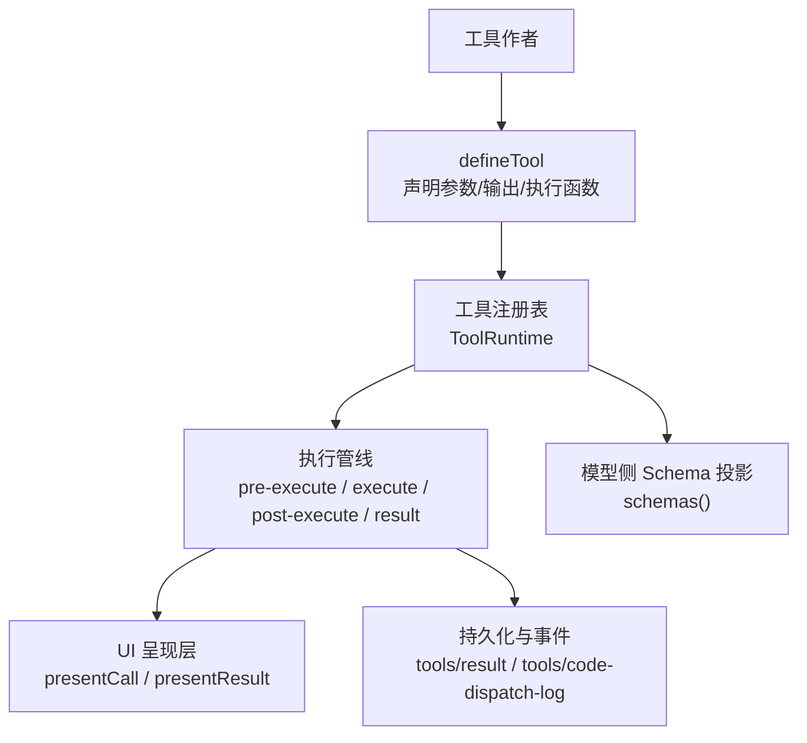
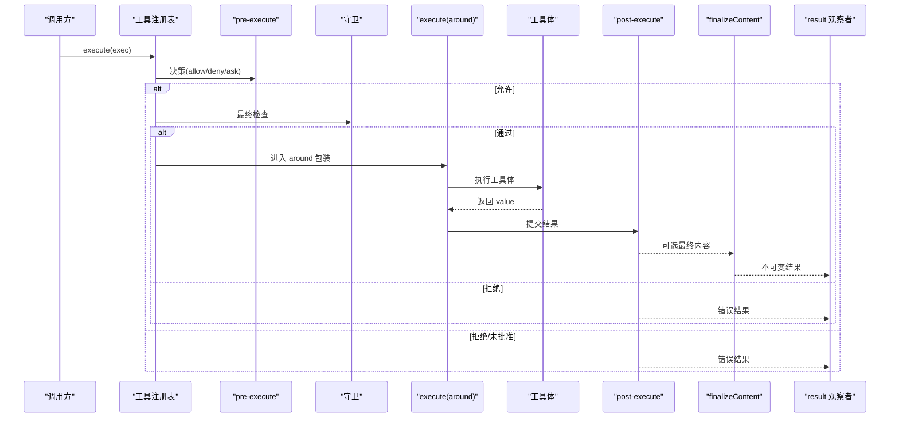
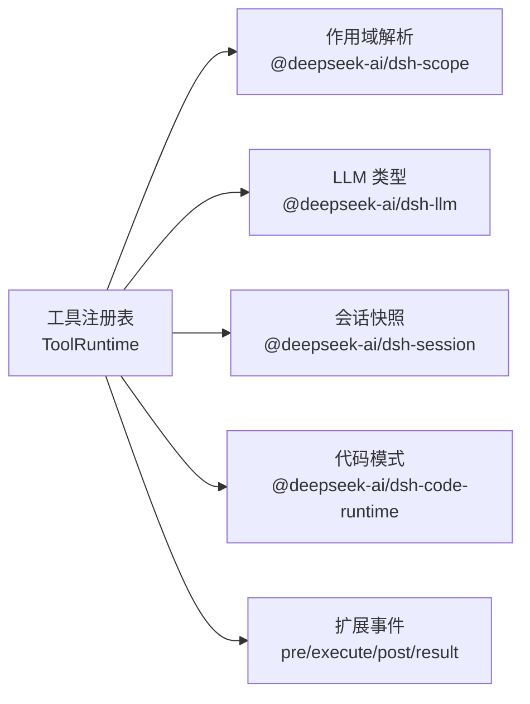
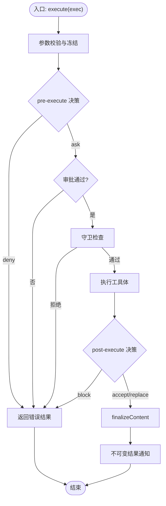

# 工具开发指南

<cite>
**本文引用的文件**
- [packages/core/tools/src/index.ts](file://packages/core/tools/src/index.ts)
- [packages/core/tools/src/schema.ts](file://packages/core/tools/src/schema.ts)
- [packages/core/tools/src/presentation.ts](file://packages/core/tools/src/presentation.ts)
- [docs/subsystems/tools.md](file://docs/subsystems/tools.md)
- [docs/cookbook/adding-a-tool.md](file://docs/cookbook/adding-a-tool.md)
- [docs/testing.md](file://docs/testing.md)
- [docs/subsystems/llm-streaming.md](file://docs/subsystems/llm-streaming.md)
- [.agents/notes/implemented/architecture/2026-06-11-structured-error-taxonomy.md](file://.agents/notes/implemented/architecture/2026-06-11-structured-error-taxonomy.md)
- [scripts/publish-npm-baseline.ts](file://scripts/publish-npm-baseline.ts)
</cite>

## 目录
1. [简介](#简介)
2. [项目结构](#项目结构)
3. [核心组件](#核心组件)
4. [架构总览](#架构总览)
5. [详细组件分析](#详细组件分析)
6. [依赖关系分析](#依赖关系分析)
7. [性能考量](#性能考量)
8. [故障排查指南](#故障排查指南)
9. [结论](#结论)
10. [附录](#附录)

## 简介
本指南面向希望为系统开发与扩展“工具”的工程师，覆盖从接口规范、同步与异步实现、流式响应、错误处理、测试方法、性能优化到打包发布与版本管理的完整实践。内容基于仓库中的工具子系统与相关文档，提供可操作的步骤与图示，帮助读者从零开始构建高质量的工具。

## 项目结构
- 工具注册与执行管线位于核心包：`packages/core/tools`
- 工具参数与输出类型 DSL 定义在 `schema.ts`
- UI 呈现词汇（卡片）定义在 `presentation.ts`
- 工具子系统说明文档在 `docs/subsystems/tools.md`
- 快速上手示例与规则在 `docs/cookbook/adding-a-tool.md`
- 测试策略与分层在 `docs/testing.md`
- LLM 流式协议在 `docs/subsystems/llm-streaming.md`
- 结构化错误体系在 `.agents/notes/implemented/architecture/2026-06-11-structured-error-taxonomy.md`
- 发布流程脚本在 `scripts/publish-npm-baseline.ts`

图表来源
- [packages/core/tools/src/index.ts:787-800](file://packages/core/tools/src/index.ts#L787-L800)
- [docs/subsystems/tools.md:170-210](file://docs/subsystems/tools.md#L170-L210)

章节来源
- [docs/subsystems/tools.md:1-12](file://docs/subsystems/tools.md#L1-L12)
- [packages/core/tools/src/index.ts:1-28](file://packages/core/tools/src/index.ts#L1-L28)

## 核心组件
- ToolDefinition：包含名称、描述、参数、输出契约、执行函数、可选最终内容回调、超时与并发安全标记、UI 呈现器。
- ToolSchema：模型可见字段（name/description/parameters），由 schemas() 白名单生成，不泄露执行与呈现回调。
- ToolExecutionInput/ToolExecution：一次工具调用的输入与执行上下文，含唯一 token、根调用 id、信号等。
- ToolExecutionResult：成功或失败的结果，包含 content、value、meta、additionalContexts、concludesTurn 等。
- ToolRunContext：execute 接收的执行上下文，支持 deferContext 与 concludeTurn。
- ToolGuard：单调守卫，仅能拒绝不能放行。
- 执行模式：parallel/exclusive，由 isConcurrencySafe 判定。

章节来源
- [docs/subsystems/tools.md:9-96](file://docs/subsystems/tools.md#L9-L96)
- [docs/subsystems/tools.md:170-210](file://docs/subsystems/tools.md#L170-L210)
- [docs/subsystems/tools.md:243-253](file://docs/subsystems/tools.md#L243-L253)
- [docs/subsystems/tools.md:315-368](file://docs/subsystems/tools.md#L315-L368)

## 架构总览
工具执行遵循可扩展的水线（waterfall）与单调策略：
- pre-execute：允许、拒绝或请求审批
- 守卫（guard）：最终拒绝权
- execute：around-dispatch 包装（超时、重试、指标）
- post-execute：接受、替换内容或值、附加上下文、阻断结果
- finalizeContent：定义级最终内容转换
- result：不可变结果通知

图表来源
- [docs/subsystems/tools.md:170-210](file://docs/subsystems/tools.md#L170-L210)
- [docs/subsystems/tools.md:376-404](file://docs/subsystems/tools.md#L376-L404)

章节来源
- [docs/subsystems/tools.md:170-210](file://docs/subsystems/tools.md#L170-L210)
- [docs/subsystems/tools.md:376-404](file://docs/subsystems/tools.md#L376-L404)

## 详细组件分析

### 工具接口规范与函数签名
- defineTool 参数：
  - name/description/parameters：模型可见的 schema 描述
  - output：{ schema, render, presentationMeta? }
  - execute(args, exec)：返回符合 output.schema 的 JSON 值
  - timeoutMs：协作式超时预算（毫秒）
  - isConcurrencySafe?(args)：是否可与兄弟调用并行
  - presentCall?(args)、presentResult?(args, result)：UI 呈现意图
- 返回值与错误：
  - 成功：ToolExecutionSuccess（value/content/meta/additionalContexts/concludesTurn）
  - 失败：ToolExecutionFailure（error/message/info）
- 参数校验：
  - 使用 ValueSchemaSpec/ParameterSchemaSpec 进行强类型推断与运行时校验
  - 非法参数抛出 ToolArgsError（INVALID_ARGS）
  - 非法输出抛出 ToolOutputError（INVALID_TOOL_OUTPUT）

章节来源
- [docs/subsystems/tools.md:9-96](file://docs/subsystems/tools.md#L9-L96)
- [docs/subsystems/tools.md:98-151](file://docs/subsystems/tools.md#L98-L151)
- [docs/subsystems/tools.md:327-368](file://docs/subsystems/tools.md#L327-L368)

### 同步与异步工具开发模式
- 同步：execute 可返回 Promise；内部可使用阻塞 I/O，但需尊重 exec.signal 以支持取消
- 异步：推荐将长耗时任务放入后台任务（jobs），返回句柄；前台保持轻量并观察信号
- 取消：exec.signal 是必须遵守的取消通道；around-dispatch 可替换信号但不能移除

章节来源
- [docs/cookbook/adding-a-tool.md:40-65](file://docs/cookbook/adding-a-tool.md#L40-L65)
- [docs/subsystems/tools.md:30-40](file://docs/subsystems/tools.md#L30-L40)

### 流式响应的实现方法
- 工具本身返回 JSON 值；若需要向模型展示流式过程，可通过 additionalContexts 或后台任务配合会话事件逐步追加上下文
- 对于 LLM 侧的流式协议，适配器产出 StreamChunk，工具不在该层直接产生流；如需“边做边看”，应结合 jobs 与用户消息追加
- 代码模式下的 run_code 子调度可通过 tools/code-dispatch-log 修改日志副本的内容，但不影响程序收到的 value 与模型看到的最终结果

章节来源
- [docs/subsystems/tools.md:255-281](file://docs/subsystems/tools.md#L255-L281)
- [docs/subsystems/llm-streaming.md:154-182](file://docs/subsystems/llm-streaming.md#L154-L182)

### 错误处理策略
- 结构化错误分类：统一 HarnessError 基类，携带稳定 code、message、cause 链
- 工具错误：
  - 参数错误：ToolArgsError（INVALID_ARGS）
  - 输出错误：ToolOutputError（INVALID_TOOL_OUTPUT）
  - 未知工具：UNKNOWN_TOOL
  - 取消：ABORTED_BEFORE_DISPATCH（未启动即取消）
- 重试机制：
  - 可在 tools/execute 中实现重试包装
  - 对可重试错误码（如 RATE_LIMIT、TIMEOUT）实施退避策略
- 诊断与持久化：
  - tool/result 事件携带不可变结果，便于回放与重试插件消费
  - 非 Error 抛出不丢失 code，被包装为 HarnessError 并保留 cause

章节来源
- [.agents/notes/implemented/architecture/2026-06-11-structured-error-taxonomy.md:1-17](file://.agents/notes/implemented/architecture/2026-06-11-structured-error-taxonomy.md#L1-L17)
- [packages/core/tools/src/index.ts:471-486](file://packages/core/tools/src/index.ts#L471-L486)
- [docs/subsystems/tools.md:376-404](file://docs/subsystems/tools.md#L376-L404)

### 测试工具与框架使用方法
- 单元测试：vitest，聚焦边界条件、错误路径、事件顺序、并发竞态与回归用例
- 覆盖率门控：每文件 100% 行覆盖率要求（特定目录豁免）
- 真实 API e2e：带密钥测试，自跳过策略保证无密钥 CI 绿色
- 快照测试：键无关的预期输出，覆盖传输契约与呈现
- 模拟数据：优先使用真实实现，仅在昂贵或非确定性边界使用 mock；桥接测试用脚本化 mock 模型 + 真实工具执行

章节来源
- [docs/testing.md:7-50](file://docs/testing.md#L7-L50)

### 性能优化技巧
- 缓存策略：
  - 对只读工具可按参数键建立内存缓存，注意失效与并发安全
  - 避免缓存大对象，必要时缓存句柄或摘要
- 并发控制：
  - 通过 isConcurrencySafe 声明并行能力，减少不必要的串行屏障
  - 对写操作或共享状态变更，显式返回 exclusive 模式
- 资源管理：
  - 严格遵守 exec.signal 取消，及时释放 I/O、进程、网络连接
  - 长任务使用 jobs 托管生命周期，避免泄漏
- 输出与序列化：
  - output.value 保持最小必要信息，render 负责人类可读内容
  - presentationMeta 仅承载可重放 UI 元数据，避免重复大文本

章节来源
- [docs/subsystems/tools.md:61-74](file://docs/subsystems/tools.md#L61-L74)
- [docs/cookbook/adding-a-tool.md:51-65](file://docs/cookbook/adding-a-tool.md#L51-L65)

### 打包、发布与版本管理最佳实践
- 包清单约束：
  - 发布成员不得 private，需设置 publishConfig.access 为 public
  - repository 指向仓库与目录一致
- 发布流程：
  - pack 与 release 分离，publish 仅消费已验证的 tarball
  - 使用脚本命令进行打包与发布，支持 ref、registry、output-dir 等选项
- 版本策略：
  - 采用编号版本与 dist-tag，避免嵌入 SHA 的版本号导致循环写入问题

章节来源
- [scripts/check-workspace-constraints.ts:253-267](file://scripts/check-workspace-constraints.ts#L253-L267)
- [scripts/publish-npm-baseline.ts:1012-1055](file://scripts/publish-npm-baseline.ts#L1012-L1055)

### 丰富代码示例与实现要点
- 最小工具形状：
  - 使用 defineTool 声明 name/description/parameters/output/execute
  - 参数自动校验，输出值受 schema 约束
  - 通过 ctx.tools.register 注册，fiber 销毁时自动注销
- 长运行工作：
  - 通过 jobs.start 启动后台任务，返回句柄；前台保持轻量
  - 使用任务专属取消信号，而非 exec.signal
- Code Mode 集成：
  - 所有可见工具可直接通过 SDK 调用，返回最终 JSON 值
  - 失败时抛出 ToolCallError，仅暴露 name/toolName/message

章节来源
- [docs/cookbook/adding-a-tool.md:7-65](file://docs/cookbook/adding-a-tool.md#L7-L65)

### 调试与故障排除方法
- 定位未知工具：
  - 检查 schemas() 与 get(name) 是否可见
  - 快照测试中可提取 UNKNOWN_TOOL 的 callId 列表
- 追踪错误来源：
  - 利用 tool/result 事件与 session 日志，查看 error.code 与 message
  - 使用 structured error taxonomy 区分不同错误类别
- 回放与重现：
  - 使用快照与 JSONL 回放，确保行为一致性
  - 对 UI 呈现差异，检查 presentCall/presentResult 的纯函数属性

章节来源
- [packages/test-support/acp-snapshot/src/suite.ts:708-733](file://packages/test-support/acp-snapshot/src/suite.ts#L708-L733)
- [.agents/notes/implemented/architecture/2026-06-11-structured-error-taxonomy.md:1-17](file://.agents/notes/implemented/architecture/2026-06-11-structured-error-taxonomy.md#L1-L17)

## 依赖关系分析
- 工具注册表依赖：
  - 上下文与服务注入（Cordis）
  - 作用域解析（dsh-scope）
  - LLM 类型（dsh-llm）
  - 会话快照（dsh-session）
  - 代码模式（dsh-code-runtime）
- 外部扩展点：
  - tools/pre-execute、tools/execute、tools/post-execute、tools/result
  - tools/code-dispatch-log（代码模式子调度日志）

图表来源
- [packages/core/tools/src/index.ts:1-28](file://packages/core/tools/src/index.ts#L1-L28)
- [docs/subsystems/tools.md:576-720](file://docs/subsystems/tools.md#L576-L720)

章节来源
- [packages/core/tools/src/index.ts:1-28](file://packages/core/tools/src/index.ts#L1-L28)
- [docs/subsystems/tools.md:576-720](file://docs/subsystems/tools.md#L576-L720)

## 性能考量
- 并发与隔离：
  - 明确 isConcurrencySafe，避免共享状态竞争
  - 写操作默认 exclusive，读操作可 parallel
- 取消与资源：
  - 所有 I/O 与网络调用需监听 exec.signal
  - 后台任务使用独立取消信号，避免外层取消误杀
- 输出与渲染：
  - value 保持精简，render 负责人类可读
  - presentationMeta 仅承载可重放 UI 元数据

[本节为通用指导，无需具体文件引用]

## 故障排查指南
- 常见错误码：
  - INVALID_ARGS：参数不符合 schema
  - INVALID_TOOL_OUTPUT：输出不符合 schema
  - UNKNOWN_TOOL：工具未注册或不可见
  - ABORTED_BEFORE_DISPATCH：取消发生在工具体之前
- 排查步骤：
  - 检查 schemas() 与 get(name)
  - 查看 tool/result 事件与 session 日志
  - 使用快照测试对比预期输出
  - 对 UI 呈现问题，检查 presentCall/presentResult 的纯函数属性

章节来源
- [packages/core/tools/src/index.ts:471-486](file://packages/core/tools/src/index.ts#L471-L486)
- [docs/subsystems/tools.md:376-404](file://docs/subsystems/tools.md#L376-L404)

## 结论
通过统一的工具定义、严格的参数与输出校验、可扩展的执行管线、清晰的错误分类与测试策略，开发者可以构建可靠、高性能且易于维护的工具。遵循本文档的规范与实践，能够显著提升工具的质量与可观测性，并在生产环境中稳定运行。

[本节为总结，无需具体文件引用]

## 附录

### 工具执行流程图（算法视角）

图表来源
- [docs/subsystems/tools.md:170-210](file://docs/subsystems/tools.md#L170-L210)
- [docs/subsystems/tools.md:376-404](file://docs/subsystems/tools.md#L376-L404)