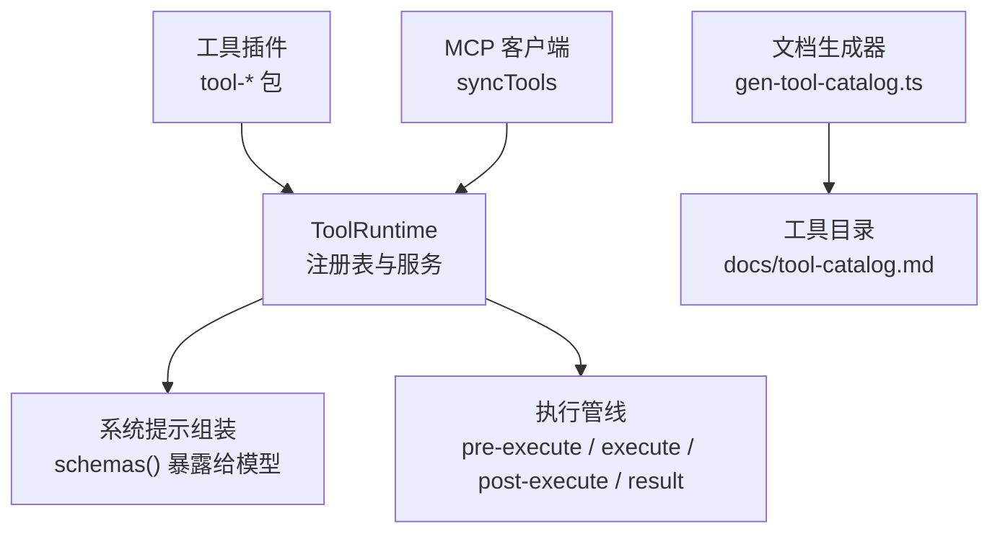
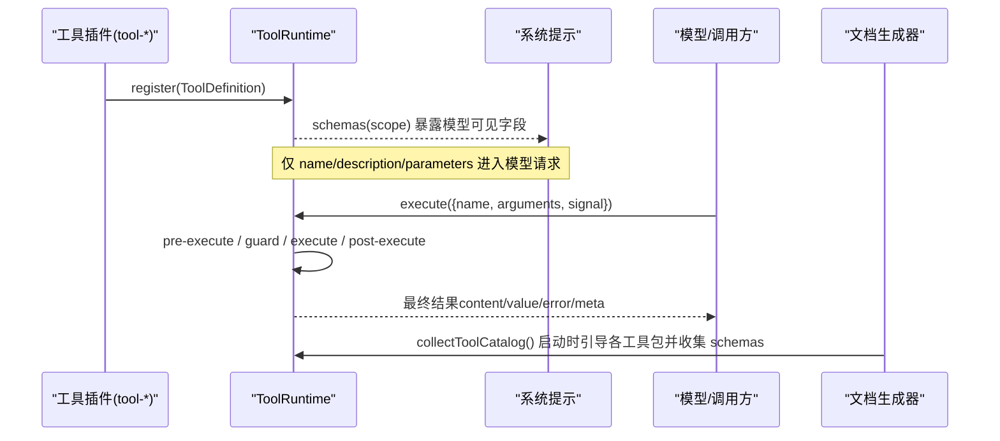
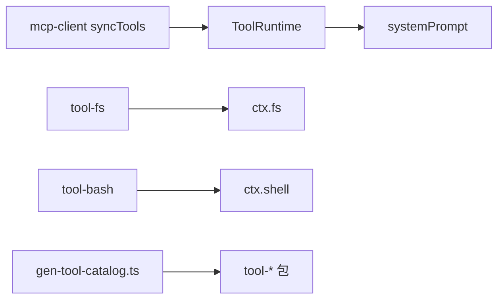
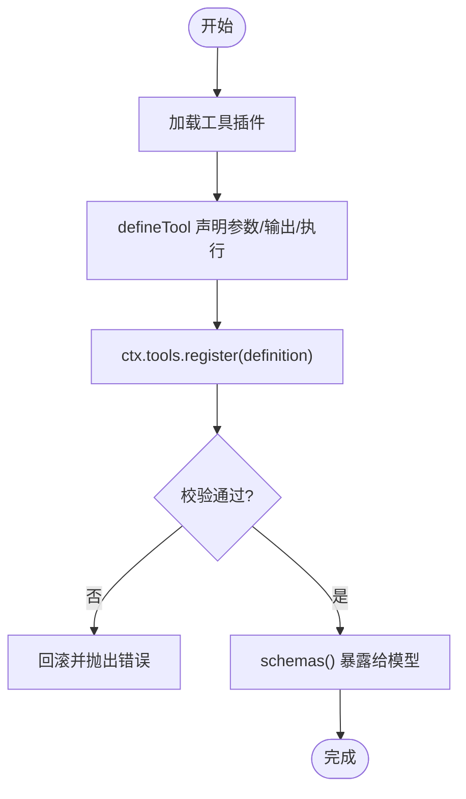
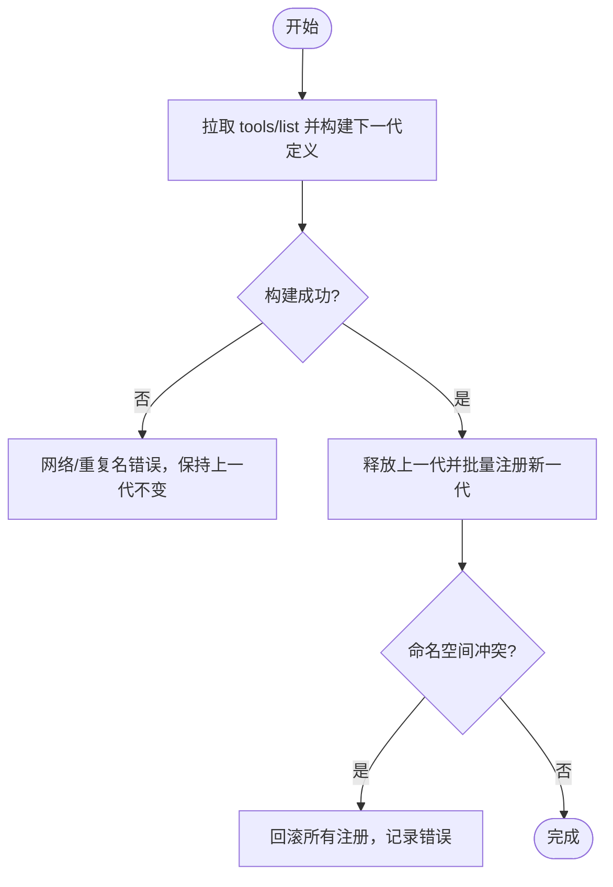

# 工具注册与发现

<cite>
**本文引用的文件**
- [packages/core/tools/src/index.ts](file://packages/core/tools/src/index.ts)
- [packages/fs/tool-fs/src/index.ts](file://packages/fs/tool-fs/src/index.ts)
- [packages/shell/tool-bash/src/index.ts](file://packages/shell/tool-bash/src/index.ts)
- [packages/mcp/mcp-client/src/tools.ts](file://packages/mcp/mcp-client/src/tools.ts)
- [scripts/gen-tool-catalog.ts](file://scripts/gen-tool-catalog.ts)
- [docs/subsystems/tools.md](file://docs/subsystems/tools.md)
- [docs/cordis-api/registry.md](file://docs/cordis-api/registry.md)
- [docs/cordis-api/service.md](file://docs/cordis-api/service.md)
- [packages/extensions/cordis-host-runner/src/guard.ts](file://packages/extensions/cordis-host-runner/src/guard.ts)
- [packages/core/tools/tests/tools.spec.ts](file://packages/core/tools/tests/tools.spec.ts)
- [packages/mcp/mcp-client/tests/mcp-client.e2e.ts](file://packages/mcp/mcp-client/tests/mcp-client.e2e.ts)
</cite>

## 目录
1. [简介](#简介)
2. [项目结构](#项目结构)
3. [核心组件](#核心组件)
4. [架构总览](#架构总览)
5. [详细组件分析](#详细组件分析)
6. [依赖关系分析](#依赖关系分析)
7. [性能考量](#性能考量)
8. [故障排查指南](#故障排查指南)
9. [结论](#结论)
10. [附录](#附录)

## 简介
本文件系统性说明 DeepSeek Harness 中的“工具注册与发现”机制，覆盖以下主题：
- 工具声明、元数据定义与注册表管理
- 静态发现与动态加载
- 命名约定与版本管理策略
- 依赖关系的解析与验证
- 完整注册示例（不同类型工具）
- 冲突解决与优先级处理
- 调试与问题定位

## 项目结构
围绕工具注册与发现的关键位置包括：
- 工具运行时与注册表：ToolRuntime 服务，提供 register/schemas/get/restrict/guard/execute 等能力
- 工具插件：各 tool-* 包通过 apply(ctx, config) 使用 defineTool 注册工具
- 动态来源：MCP 客户端将远端工具同步到本地注册表
- 文档生成：脚本在启动时引导每个工具包并收集模型可见的 schema，形成工具目录

**图表来源**
- [packages/core/tools/src/index.ts:787-837](file://packages/core/tools/src/index.ts#L787-L837)
- [packages/mcp/mcp-client/src/tools.ts:104-174](file://packages/mcp/mcp-client/src/tools.ts#L104-L174)
- [scripts/gen-tool-catalog.ts:616-653](file://scripts/gen-tool-catalog.ts#L616-L653)

**章节来源**
- [packages/core/tools/src/index.ts:787-837](file://packages/core/tools/src/index.ts#L787-L837)
- [docs/subsystems/tools.md:478-570](file://docs/subsystems/tools.md#L478-L570)

## 核心组件
- ToolRuntime（工具运行时）
  - 职责：维护作用域层（全局与 agent 级）、注册工具、计算可见性、执行管线、事件广播
  - 关键 API：register、schemas、get、restrict、guard、execute、executionMode、presentAs
- 工具定义 ToolDefinition
  - 字段：name、description、parameters、output（schema + render）、execute、finalizeContent、timeoutMs、isConcurrencySafe、presentCall/presentResult
- 工具限制 ToolRestriction
  - allow/deny 过滤全局工具；作用域内注册不受影响
- 执行管线
  - tools/pre-execute（允许/拒绝/询问）→ 单调守卫 → tools/execute（环绕）→ tools/post-execute（接受/替换/阻断）→ finalizeContent → tools/result

**章节来源**
- [docs/subsystems/tools.md:9-151](file://docs/subsystems/tools.md#L9-L151)
- [docs/subsystems/tools.md:153-172](file://docs/subsystems/tools.md#L153-L172)
- [docs/subsystems/tools.md:170-404](file://docs/subsystems/tools.md#L170-L404)
- [packages/core/tools/src/index.ts:787-837](file://packages/core/tools/src/index.ts#L787-L837)

## 架构总览
工具注册与发现由“静态插件注册 + 动态来源同步 + 作用域可见性 + 执行管线”构成。

**图表来源**
- [packages/core/tools/src/index.ts:787-837](file://packages/core/tools/src/index.ts#L787-L837)
- [docs/subsystems/tools.md:478-570](file://docs/subsystems/tools.md#L478-L570)
- [scripts/gen-tool-catalog.ts:616-653](file://scripts/gen-tool-catalog.ts#L616-L653)

## 详细组件分析

### 工具声明与元数据
- 参数与输出使用统一的 JSON Schema DSL，支持标量、数组、对象、oneOf、enum/const、json 等
- output.schema 用于校验执行返回值；render 将结构化值转为模型可见内容；presentationMeta 提供顶层调用的展示元信息
- 可选超时与并发安全标记，以及 UI 呈现回调 presentCall/presentResult

**章节来源**
- [docs/subsystems/tools.md:98-151](file://docs/subsystems/tools.md#L98-L151)
- [docs/subsystems/tools.md:459-468](file://docs/subsystems/tools.md#L459-L468)

### 注册表与作用域
- ToolLayer 维护每层的工具、限制与守卫；重复名称在同一层或全局会抛出错误
- 作用域链：全局 → 父作用域 → 当前 agent；子作用域可屏蔽/扩展全局工具
- restrict 以 allow/deny 组合过滤全局工具；scoped 注册始终可见

**章节来源**
- [packages/core/tools/src/index.ts:714-754](file://packages/core/tools/src/index.ts#L714-L754)
- [docs/subsystems/tools.md:153-168](file://docs/subsystems/tools.md#L153-L168)

### 执行管线与守卫
- pre-execute：允许/拒绝/询问（ask），缺少审批通道则降级为拒绝
- 守卫：单调不可逆的拒绝；顺序不影响“已拒绝仍被拒绝”
- execute：可替换信号但不可移除；注册表会在调用体前融合原始 caller 信号
- post-execute：接受/替换/阻断；阻断会将纠正反馈转为错误结果
- finalizeContent：定义级最后内容转换，保证幂等且无副作用

**章节来源**
- [docs/subsystems/tools.md:170-404](file://docs/subsystems/tools.md#L170-L404)

### 静态发现（插件式工具）
- 每个 tool-* 包通过 apply(ctx, config) 使用 defineTool 注册
- 典型流程：声明 Config → 注入依赖 → 调用 ctx.tools.register(...)
- 示例：文件系统工具套件、Bash/Pwsh 工具

**章节来源**
- [packages/fs/tool-fs/src/index.ts:18-79](file://packages/fs/tool-fs/src/index.ts#L18-L79)
- [packages/shell/tool-bash/src/index.ts:30-42](file://packages/shell/tool-bash/src/index.ts#L30-L42)
- [packages/shell/tool-bash/src/index.ts:190-200](file://packages/shell/tool-bash/src/index.ts#L190-L200)

### 动态加载（MCP 工具同步）
- syncTools 分两阶段：先拉取并构建下一代的 ToolDefinition 列表，再统一替换旧代
- 失败回滚：若注册阶段发生冲突，全部回滚，确保模型要么看到完整一代，要么看不到该服务器任何工具
- 命名空间隔离：mcp__<serverName>__ 前缀避免与外部注册冲突

**章节来源**
- [packages/mcp/mcp-client/src/tools.ts:104-174](file://packages/mcp/mcp-client/src/tools.ts#L104-L174)
- [packages/mcp/mcp-client/tests/mcp-client.e2e.ts:91-115](file://packages/mcp/mcp-client/tests/mcp-client.e2e.ts#L91-L115)

### 命名约定与版本管理
- MCP 工具名规范化：点号分隔名会被标准化为带哈希后缀的稳定公共名，避免冲突
- 工具包清单：生成器扫描 packages/*/tool-* 并强制要求清单完整性，防止新工具“静默未记录”
- 版本策略：通过 Cordis 插件/包生命周期管理；动态工具通过 cordis_* 工具进行定义、运行、更新与停止

**章节来源**
- [packages/mcp/mcp-client/tests/mcp-client.e2e.ts:102-115](file://packages/mcp/mcp-client/tests/mcp-client.e2e.ts#L102-L115)
- [scripts/gen-tool-catalog.ts:568-591](file://scripts/gen-tool-catalog.ts#L568-L591)
- [docs/tool-catalog.md:1-14](file://docs/tool-catalog.md#L1-L14)

### 依赖关系解析与验证
- 插件通过 inject 声明所需服务；Cordis 在加载时解析依赖，缺失则延迟加载或报错
- 工具内部对配置进行强校验（如正整数、布尔显式等），并在运行时做防御性检查
- 守卫与策略：host runner 对 defineTool 的 schema 进行严格校验，拒绝非法类型与组合

**章节来源**
- [docs/cordis-api/registry.md:8-56](file://docs/cordis-api/registry.md#L8-L56)
- [docs/cordis-api/service.md:6-12](file://docs/cordis-api/service.md#L6-L12)
- [packages/extensions/cordis-host-runner/src/guard.ts:386-488](file://packages/extensions/cordis-host-runner/src/guard.ts#L386-L488)

### 冲突解决与优先级
- 同一作用域内重复注册同名工具会抛错；全局与 agent 作用域分离
- 作用域继承：子作用域可覆盖全局工具；restrict 仅作用于全局可见性
- 动态同步冲突：MCP 同步时若命名空间被占用，整代回滚并记录日志

**章节来源**
- [packages/core/tools/src/index.ts:714-754](file://packages/core/tools/src/index.ts#L714-L754)
- [packages/mcp/mcp-client/src/tools.ts:157-174](file://packages/mcp/mcp-client/src/tools.ts#L157-L174)

### 完整注册示例（不同类型工具）
- 文件系统工具套件：声明 Config、注入依赖、注册 read/write/edit/read_image
- Bash 工具：声明 enableRunInBackground、注册 bash 工具并提供终端卡片呈现
- MCP 动态工具：从远端拉取工具列表，规范化命名后批量注册

**章节来源**
- [packages/fs/tool-fs/src/index.ts:18-79](file://packages/fs/tool-fs/src/index.ts#L18-L79)
- [packages/shell/tool-bash/src/index.ts:30-42](file://packages/shell/tool-bash/src/index.ts#L30-L42)
- [packages/shell/tool-bash/src/index.ts:190-200](file://packages/shell/tool-bash/src/index.ts#L190-L200)
- [packages/mcp/mcp-client/src/tools.ts:104-174](file://packages/mcp/mcp-client/src/tools.ts#L104-L174)

### 调试与问题定位
- 监听 tools/change 观察注册/注销与限制变化
- 监听 tools/result 获取冻结的最终结果快照
- 当 change 监听抛错时，注册表会回滚条目，避免泄漏；后续相同名称可重新注册
- 使用 schemas() 查看当前作用域下模型可见的工具集合

**章节来源**
- [docs/subsystems/tools.md:576-720](file://docs/subsystems/tools.md#L576-L720)
- [packages/core/tools/tests/tools.spec.ts:1999-2022](file://packages/core/tools/tests/tools.spec.ts#L1999-L2022)

## 依赖关系分析
- ToolRuntime 依赖 systemPrompt 以注入 schemas 与 SDK 段
- 工具插件依赖各自的能力 seam（fs、shell、jobs、subprocess 等）
- 文档生成器依赖每个 tool-* 包的 mount 入口，启动独立 Context 收集 schemas

**图表来源**
- [packages/core/tools/src/index.ts:787-837](file://packages/core/tools/src/index.ts#L787-L837)
- [packages/fs/tool-fs/src/index.ts:18-79](file://packages/fs/tool-fs/src/index.ts#L18-L79)
- [packages/shell/tool-bash/src/index.ts:30-42](file://packages/shell/tool-bash/src/index.ts#L30-L42)
- [scripts/gen-tool-catalog.ts:616-653](file://scripts/gen-tool-catalog.ts#L616-L653)
- [packages/mcp/mcp-client/src/tools.ts:104-174](file://packages/mcp/mcp-client/src/tools.ts#L104-L174)

**章节来源**
- [packages/core/tools/src/index.ts:787-837](file://packages/core/tools/src/index.ts#L787-L837)
- [scripts/gen-tool-catalog.ts:616-653](file://scripts/gen-tool-catalog.ts#L616-L653)

## 性能考量
- 执行模式分类：isConcurrencySafe 返回 true 时可与其他同级调用并行；否则独占执行
- 最大并行子调用数：maxParallelSubCalls 控制 run_code 等场景下的并发上限
- 取消与资源回收：execute 传入的 AbortSignal 贯穿管线；工具需协作式取消并达到静息
- 文档生成：每个工具包在独立 Context 中引导并立即释放，避免跨包状态污染

**章节来源**
- [docs/subsystems/tools.md:243-253](file://docs/subsystems/tools.md#L243-L253)
- [packages/core/tools/src/index.ts:774-781](file://packages/core/tools/src/index.ts#L774-L781)
- [scripts/gen-tool-catalog.ts:616-653](file://scripts/gen-tool-catalog.ts#L616-L653)

## 故障排查指南
- 现象：tools/change 监听抛错导致注册回滚
  - 处理：修复监听逻辑；确认后续相同名称可重新注册
- 现象：MCP 同步部分工具注册失败
  - 处理：检查命名空间冲突；根据 registrationFailure 策略决定是否抛出异常
- 现象：工具不可见
  - 处理：检查 restrict 是否排除了该工具；确认当前作用域是否正确
- 现象：执行被拒绝
  - 处理：检查 pre-execute 与守卫是否返回拒绝原因；必要时调整策略

**章节来源**
- [packages/core/tools/tests/tools.spec.ts:1999-2022](file://packages/core/tools/tests/tools.spec.ts#L1999-L2022)
- [packages/mcp/mcp-client/src/tools.ts:157-174](file://packages/mcp/mcp-client/src/tools.ts#L157-L174)
- [docs/subsystems/tools.md:153-168](file://docs/subsystems/tools.md#L153-L168)
- [docs/subsystems/tools.md:170-404](file://docs/subsystems/tools.md#L170-L404)

## 结论
DeepSeek Harness 的工具注册与发现机制以 ToolRuntime 为核心，结合插件式静态注册与 MCP 动态同步，配合作用域可见性与严格的执行管线，实现了可扩展、可观测、可治理的工具生态。通过统一的 JSON Schema 元数据、严格的配置校验与完善的冲突回滚策略，保证了模型可见契约的一致性与稳定性。

## 附录

### 工具注册流程图（静态）

**图表来源**
- [packages/fs/tool-fs/src/index.ts:18-79](file://packages/fs/tool-fs/src/index.ts#L18-L79)
- [packages/core/tools/src/index.ts:787-837](file://packages/core/tools/src/index.ts#L787-L837)

### 工具注册流程图（动态-MCP）

**图表来源**
- [packages/mcp/mcp-client/src/tools.ts:104-174](file://packages/mcp/mcp-client/src/tools.ts#L104-L174)