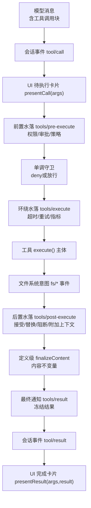
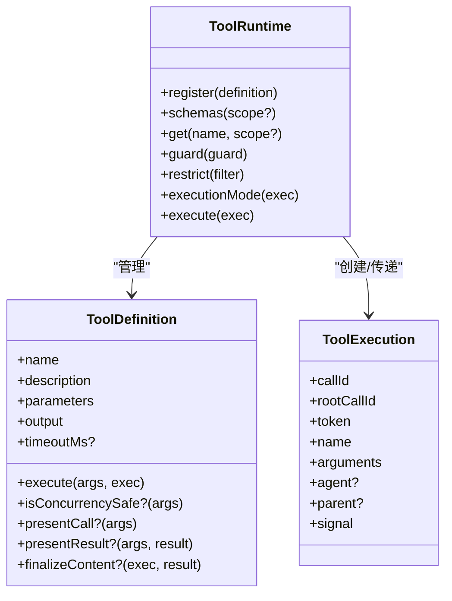
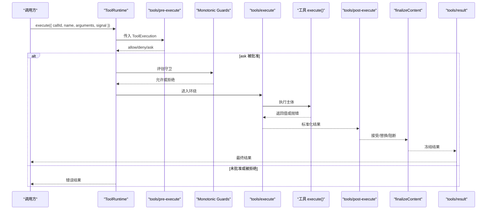
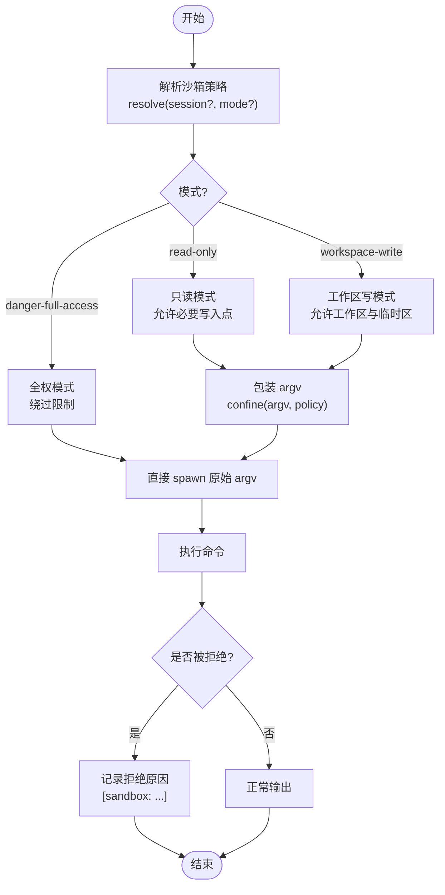
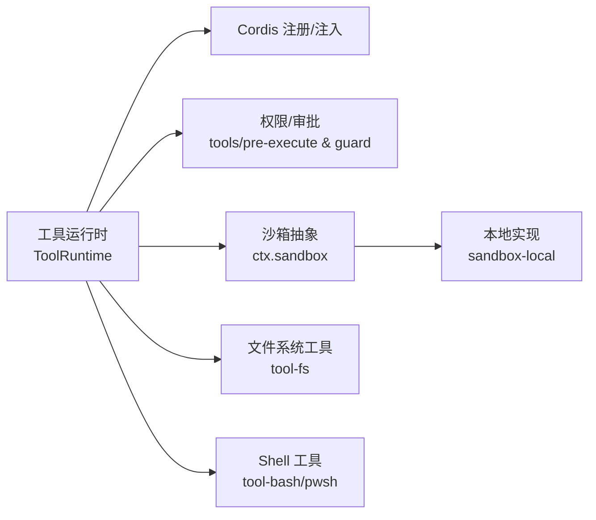

# 工具系统

<cite>
**本文引用的文件**
- [packages/core/tools/src/index.ts](file://packages/core/tools/src/index.ts)
- [packages/core/tools/src/schema.ts](file://packages/core/tools/src/schema.ts)
- [packages/core/tools/src/presentation.ts](file://packages/core/tools/src/presentation.ts)
- [packages/core/tools/src/code-mode.ts](file://packages/core/tools/src/code-mode.ts)
- [packages/core/tools/tests/execution-mode.spec.ts](file://packages/core/tools/tests/execution-mode.spec.ts)
- [packages/core/tools/tests/scoped.spec.ts](file://packages/core/tools/tests/scoped.spec.ts)
- [packages/shell/tool-bash/src/index.ts](file://packages/shell/tool-bash/src/index.ts)
- [packages/fs/tool-fs/src/sandbox.ts](file://packages/fs/tool-fs/src/sandbox.ts)
- [packages/sandbox/sandbox-local/src/index.ts](file://packages/sandbox/sandbox-local/src/index.ts)
- [docs/subsystems/tools.md](file://docs/subsystems/tools.md)
- [docs/tool-execution-pipeline.md](file://docs/tool-execution-pipeline.md)
- [docs/tool-catalog.md](file://docs/tool-catalog.md)
- [docs/cordis-api/registry.md](file://docs/cordis-api/registry.md)
- [docs/subsystems/sandbox.md](file://docs/subsystems/sandbox.md)
- [docs/cookbook/adding-a-tool.md](file://docs/cookbook/adding-a-tool.md)
</cite>

## 目录
1. [简介](#简介)
2. [项目结构](#项目结构)
3. [核心组件](#核心组件)
4. [架构总览](#架构总览)
5. [详细组件分析](#详细组件分析)
6. [依赖关系分析](#依赖关系分析)
7. [性能考量](#性能考量)
8. [故障排查指南](#故障排查指南)
9. [结论](#结论)
10. [附录：内置工具与使用方式](#附录内置工具与使用方式)

## 简介
本文件系统性地文档化工具系统的注册、发现、执行管道、类型系统、权限控制、沙箱执行、结果处理，以及开发指南与最佳实践。该系统的核心由工具运行时（ToolRuntime）提供，围绕“参数校验—权限检查—守卫—调度—执行—后置处理—最终观察”的流水线组织，支持同步/异步/流式等多种执行模式，并通过沙箱与策略服务确保可审计、可回滚、可观测的执行环境。

## 项目结构
- 工具运行时与管线：位于 packages/core/tools，负责工具注册、可见性解析、执行调度、事件水落、结果规范化与 UI 呈现元数据。
- 工具实现：各业务工具以插件形式挂载到 ctx.tools，如 shell 工具（bash/pwsh）、fs 工具（read/write/edit/read_image）、搜索工具（glob/grep）、终端工具等。
- 沙箱与策略：通过 ctx.sandbox 与 ctx.sandboxPolicy 将进程级文件访问限制为 read-only / workspace-write / danger-full-access，并报告执行完整性。
- 文档与目录：docs 下包含子系统说明、工具执行流水线图、工具目录、Cordis 注册 API、沙箱子系统等。

图表来源
- [docs/tool-execution-pipeline.md:8-58](file://docs/tool-execution-pipeline.md#L8-L58)
- [packages/core/tools/src/index.ts:142-200](file://packages/core/tools/src/index.ts#L142-L200)

章节来源
- [docs/tool-execution-pipeline.md:1-63](file://docs/tool-execution-pipeline.md#L1-L63)
- [packages/core/tools/src/index.ts:1-200](file://packages/core/tools/src/index.ts#L1-L200)

## 核心组件
- ToolRuntime（工具运行时）：维护工具注册表、可见性视图、执行模式分类、调度接口、事件水落与结果归一化。
- defineTool/Schema DSL：统一参数与输出声明，编译为 JSON Schema，并在执行前进行严格校验。
- 执行模式：exclusive（独占）与 parallel（并行），由 isConcurrencySafe 判定；未知或异常默认 exclusive。
- 权限与守卫：tools/pre-execute 允许/拒绝/询问；monotonic guards 在每次调用后做最终否决；restrict 按作用域过滤全局工具。
- 沙箱与策略：ctx.sandbox.confine 包装 argv，ctx.sandboxPolicy.resolve 决定 per-call 的文件访问模式与根路径。
- 结果与呈现：output.render 生成模型内容；presentCall/presentResult 提供 UI 卡片；finalizeContent 做最后一次内容不变量约束。

章节来源
- [packages/core/tools/src/index.ts:650-801](file://packages/core/tools/src/index.ts#L650-L801)
- [packages/core/tools/src/index.ts:703-1088](file://packages/core/tools/src/index.ts#L703-L1088)
- [docs/subsystems/tools.md:9-151](file://docs/subsystems/tools.md#L9-L151)
- [docs/subsystems/tools.md:170-405](file://docs/subsystems/tools.md#L170-L405)
- [docs/subsystems/tools.md:459-468](file://docs/subsystems/tools.md#L459-L468)

## 架构总览
工具系统采用“注册即发现、分层可见性、可扩展水落”的架构：
- 注册：插件通过 ctx.tools.register 声明工具；同一层内同名冲突会失败，作用域内注册可遮蔽全局。
- 发现：schemas() 仅暴露模型可见字段（name/description/parameters），不泄露执行回调；get() 返回当前作用域可见的定义。
- 调度：根据 executionMode 对并发进行分组；Code Mode 下 run_code 作为保留传输，子调用重新进入完整管线。
- 安全：pre-execute → guard → execute → post-execute → finalizeContent → result，每个阶段都可拦截或增强。
- 沙箱：工具在执行前后通过 fs/* 事件与 sandbox 策略协作，确保文件操作受控且可审计。

图表来源
- [packages/core/tools/src/index.ts:787-801](file://packages/core/tools/src/index.ts#L787-L801)
- [docs/subsystems/tools.md:25-94](file://docs/subsystems/tools.md#L25-L94)
- [docs/subsystems/tools.md:283-313](file://docs/subsystems/tools.md#L283-L313)

章节来源
- [packages/core/tools/src/index.ts:650-801](file://packages/core/tools/src/index.ts#L650-L801)
- [docs/subsystems/tools.md:9-151](file://docs/subsystems/tools.md#L9-L151)

## 详细组件分析

### 工具注册与发现机制
- 注册：defineTool 将参数与输出声明编译为 JSON Schema，并绑定 execute、可选的 finalizeContent 与 UI 呈现方法。注册时验证 schema 语义（如 timeoutMs 为正数）。
- 可见性：schemas() 仅输出模型可见字段；get() 返回当前作用域可见的定义；restrict() 可对全局工具进行 allow/deny 过滤，作用域内注册不受影响。
- 变更事件：tools/change 广播工具集变化（注册/注销/限制变化），供上层装配系统刷新。

章节来源
- [packages/core/tools/src/index.ts:714-728](file://packages/core/tools/src/index.ts#L714-L728)
- [packages/core/tools/src/index.ts:1064-1088](file://packages/core/tools/src/index.ts#L1064-L1088)
- [packages/core/tools/src/index.ts:582-599](file://packages/core/tools/src/index.ts#L582-L599)
- [docs/subsystems/tools.md:153-168](file://docs/subsystems/tools.md#L153-L168)

### 执行管道：参数验证、权限检查、守卫、调度、执行、结果处理
- 参数验证：execute 前由 defineTool 基于 ParameterSchemaSpec 校验参数，非法则抛出 ToolArgsError（INVALID_ARGS）。
- 权限检查：tools/pre-execute 水落可 deny/ask/allow；ask 需经 approval 服务一次批准，否则视为拒绝。
- 守卫：monotonic guards 在 pre-execute 之后运行，只能拒绝不能放行，保证后续监听无法撤销拒绝。
- 调度：executionMode 决定是否可与兄弟调用并行；unknown/throwing classifier 默认 exclusive。
- 执行：tools/execute 水落用于超时、重试、指标；工具体必须遵守 exec.signal 取消契约。
- 结果处理：post-execute 可接受/替换/阻断/附加上下文；finalizeContent 做最后一次内容不变量；tools/result 接收冻结的最终结果。

图表来源
- [docs/tool-execution-pipeline.md:8-58](file://docs/tool-execution-pipeline.md#L8-L58)
- [packages/core/tools/src/index.ts:142-200](file://packages/core/tools/src/index.ts#L142-L200)
- [docs/subsystems/tools.md:170-405](file://docs/subsystems/tools.md#L170-L405)

章节来源
- [docs/subsystems/tools.md:170-405](file://docs/subsystems/tools.md#L170-L405)
- [packages/core/tools/tests/execution-mode.spec.ts:40-141](file://packages/core/tools/tests/execution-mode.spec.ts#L40-L141)

### 类型系统与执行模式
- 参数与输出：ValueSchemaSpec 支持标量、数组、对象、json、oneOf；InferArgs/InferValue 提供精确类型推断。
- 执行模式：ToolExecutionMode 为 { kind: 'parallel' } | { kind: 'exclusive' }；isConcurrencySafe 为纯函数，仅 true 才允许并行。
- Code Mode：run_code 是保留传输，程序内子调用重新进入完整管线，并按 maxParallelSubCalls 控制并发上限。

章节来源
- [docs/subsystems/tools.md:98-151](file://docs/subsystems/tools.md#L98-L151)
- [docs/subsystems/tools.md:243-253](file://docs/subsystems/tools.md#L243-L253)
- [packages/core/tools/src/index.ts:650-673](file://packages/core/tools/src/index.ts#L650-L673)
- [packages/core/tools/tests/execution-mode.spec.ts:40-141](file://packages/core/tools/tests/execution-mode.spec.ts#L40-L141)

### 权限控制与访问限制
- 作用域限制：restrict({ allow, deny }) 对继承的工具集合取交集，作用域内注册不被影响；reserved 名称不可限制。
- 守卫：guard(fn) 注册单调守卫，任何匹配守卫均可拒绝；顺序不影响“只减权限”的语义。
- 审批：pre-execute 中的 ask 需要 approval 服务一次性批准，缺失或拒绝均视为拒绝。
- 沙箱策略：SandboxMode 控制文件效果（read-only/workspace-write/danger-full-access），confined 模式通过 ctx.sandbox.confine 包装 argv，partial/full 报告执行完整性。

章节来源
- [packages/core/tools/src/index.ts:1064-1088](file://packages/core/tools/src/index.ts#L1064-L1088)
- [packages/core/tools/src/index.ts:703-711](file://packages/core/tools/src/index.ts#L703-L711)
- [docs/subsystems/sandbox.md:9-94](file://docs/subsystems/sandbox.md#L9-L94)
- [docs/subsystems/sandbox.md:96-157](file://docs/subsystems/sandbox.md#L96-L157)

### 沙箱执行与文件系统保护
- 策略解析：ctx.sandboxPolicy.resolve(session?, mode?) 决定 per-call 的模式与工作区根；provider 策略进一步收窄模式。
- 进程封装：sandbox-local 选择 runner（bwrap/Landlock/Seatbelt/Windows ACL），返回 ConfinedArgv（argv、enforcement、denialSignatures、runnerFailureRules）。
- 工具集成：bash/pwsh 工具在受限模式下执行命令，若被阻止则报告 “[sandbox: file access denied under <mode> mode]”，属于策略拒绝而非命令错误。

图表来源
- [docs/subsystems/sandbox.md:41-94](file://docs/subsystems/sandbox.md#L41-L94)
- [packages/sandbox/sandbox-local/src/index.ts:305-333](file://packages/sandbox/sandbox-local/src/index.ts#L305-L333)
- [packages/shell/tool-bash/tests/tools.spec.ts:579-606](file://packages/shell/tool-bash/tests/tools.spec.ts#L579-L606)

章节来源
- [docs/subsystems/sandbox.md:41-157](file://docs/subsystems/sandbox.md#L41-L157)
- [packages/sandbox/sandbox-local/src/index.ts:305-333](file://packages/sandbox/sandbox-local/src/index.ts#L305-L333)
- [packages/fs/tool-fs/src/sandbox.ts:95-108](file://packages/fs/tool-fs/src/sandbox.ts#L95-L108)

### 结果处理与 UI 呈现
- 结果规范：成功结果携带 value（执行本地、不持久化）、content（模型可见）、meta（可选）、additionalContexts（可选）、concludesTurn（可选）。
- 呈现投影：output.render 生成模型内容；presentationMeta 提供可重放的结果元数据；presentCall/presentResult 提供中性卡片词汇（generic/terminal/diff/search/web/read）。
- finalizeContent：最后一次内容不变量约束，失败会被归一化为 isError 但依然到达观察者。

章节来源
- [docs/subsystems/tools.md:337-375](file://docs/subsystems/tools.md#L337-L375)
- [docs/subsystems/tools.md:459-468](file://docs/subsystems/tools.md#L459-L468)

### 工具开发指南
- 最小形状：使用 defineTool 声明 name/description/parameters/output/execute；注册即生效，卸载 fiber 即注销。
- 执行契约：参数已校验；args 只读；返回单一 JSON 值；抛错或无效值视为 isError；遵循 exec.signal；使用 output.render 与 presentationMeta；通过 agent.inject 发送上下文。
- 长任务：通过 ctx.jobs.start 注册后台任务，返回句柄；前台任务耦合 exec.signal。
- 扩展点：优先使用 waterfalls（pre/execute/post）与 guard，避免在工具内部硬编码策略。
- Code Mode：工具自动可用，程序内调用重新进入管线，返回结构化值而非渲染内容。

章节来源
- [docs/cookbook/adding-a-tool.md:7-66](file://docs/cookbook/adding-a-tool.md#L7-L66)
- [docs/cookbook/adding-a-tool.md:67-95](file://docs/cookbook/adding-a-tool.md#L67-L95)

## 依赖关系分析
- 工具运行时依赖 Cordis 注册与服务注入机制，通过 inject 声明依赖（如 systemPrompt、codeRuntime、approval）。
- 工具插件通过 ctx.tools.register 贡献能力；不同包（shell、fs、terminal、web 等）各自实现具体工具。
- 沙箱提供者（sandbox-local）与策略服务（sandbox-policy）解耦于工具实现，工具通过抽象 seam 消费。

图表来源
- [docs/cordis-api/registry.md:8-56](file://docs/cordis-api/registry.md#L8-L56)
- [docs/subsystems/sandbox.md:152-157](file://docs/subsystems/sandbox.md#L152-L157)
- [packages/core/tools/src/index.ts:650-673](file://packages/core/tools/src/index.ts#L650-L673)

章节来源
- [docs/cordis-api/registry.md:8-56](file://docs/cordis-api/registry.md#L8-L56)
- [docs/subsystems/sandbox.md:152-157](file://docs/subsystems/sandbox.md#L152-L157)

## 性能考量
- 并发控制：executionMode 将 safe 调用合并为并行组，exclusive 调用形成屏障；Code Mode 下 maxParallelSubCalls 控制子调用并发上限。
- 信号传播：exec.signal 贯穿整个管线，确保取消及时；around-dispatch 可替换信号但不能移除，需恢复原信号。
- 结果快照：value 在成功后立即快照并冻结，减少后续拷贝成本；content 在最终阶段再计算，避免重复渲染。
- 日志与溢出：大输出通过 spill 后端保存定位器，避免阻塞主流程；search 工具 capped 结果携带 truncated/total 提示 UI。

章节来源
- [packages/core/tools/src/index.ts:667-673](file://packages/core/tools/src/index.ts#L667-L673)
- [docs/subsystems/tools.md:243-253](file://docs/subsystems/tools.md#L243-L253)
- [docs/tool-catalog.md:27](file://docs/tool-catalog.md#L27)

## 故障排查指南
- 参数错误：ToolArgsError（INVALID_ARGS）表示参数不符合 schema；检查 required、类型、enum/const、oneOf。
- 工具不存在：UNKNOWN_TOOL 表示名称不可见或未注册；检查作用域与 restrict 配置。
- 沙箱拒绝：stderr 包含 “[sandbox: file access denied under <mode> mode]” 表示策略拒绝；调整 sandbox_permissions 或 justification。
- 审批失败：ask 未被批准或缺失 approval 服务会导致拒绝；确认审批通道可用。
- 执行超时：wrapper 可通过 tools/execute 设置超时；工具需响应 exec.signal 及时退出。

章节来源
- [packages/core/tools/tests/tools.spec.ts:2588-2613](file://packages/core/tools/tests/tools.spec.ts#L2588-L2613)
- [packages/shell/tool-bash/tests/tools.spec.ts:579-606](file://packages/shell/tool-bash/tests/tools.spec.ts#L579-L606)
- [apps/web/tests/permission-policy-context.e2e.ts:145-171](file://apps/web/tests/permission-policy-context.e2e.ts#L145-L171)

## 结论
工具系统通过严格的类型与 schema 约束、可扩展的水落与守卫机制、以及进程级沙箱策略，提供了安全、可观测、可组合的工具执行环境。开发者应遵循最小形状契约、正确声明输出与呈现、合理使用权限与沙箱，并利用 Code Mode 获得一致的编程体验。

## 附录：内置工具与使用方式
- bash/pwsh：执行命令，支持后台运行与沙箱控制；输出截断并保存全文定位。
- fs：read/write/edit/read_image，配合 fs/* 事件与观察策略，确保读写一致性与审计。
- search：glob/grep，使用 ripgrep 二进制，结果 capped 并保存完整列表。
- terminal：管理 PTY 终端会话，支持打开/关闭/读取/发送/信号。
- web：web_search/web_fetch，隐藏 provider 细节，稳定 schema。
- cordis：动态插件生命周期管理（define/inspect/run/stop/undefine）。
- goal/schedule/workflow/subagent/jobs/todo/lsp：领域工具，分别对应目标、计划、工作流、子代理、作业、待办、语言服务等。

章节来源
- [docs/tool-catalog.md:12-42](file://docs/tool-catalog.md#L12-L42)
- [docs/tool-catalog.md:176-263](file://docs/tool-catalog.md#L176-L263)
- [docs/tool-catalog.md:599-775](file://docs/tool-catalog.md#L599-L775)
- [docs/tool-catalog.md:776-800](file://docs/tool-catalog.md#L776-L800)